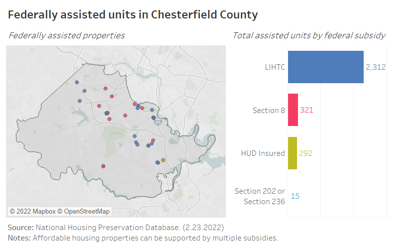
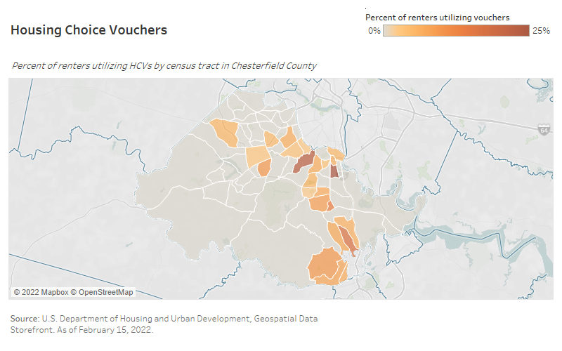

--- 
title: "Chesterfield County Rental Market Analysis"
author: "HDAdvisors"
date: "2022-04-02"
site: bookdown::bookdown_site
documentclass: book
# url: your book url like https://bookdown.org/yihui/bookdown
# cover-image: path to the social sharing image like images/cover.jpg
# description: add description
biblio-style: apalike
csl: chicago-fullnote-bibliography.csl
---

# url: your book url like https://bookdown.org/yihui/bookdown

Placeholder

## Report outline {-}

<!--chapter:end:index.Rmd-->

# (PART) LITERATURE REVIEW {.unnumbered}

Placeholder

## Background
## Hull Street Corridor Revitalization Plan
## Route 1 (formerly Northern Jefferson Davis) Special Area Plan
## Route 1 (formerly North Jefferson Davis Highway) Real Estate Market Study
## Moving Forward: The Comprehensive Plan for Chesterfield County
## Midlothian Community Special Area Plan
## Richmond Regional Housing Framework
## Analysis of Impediments to Fair Housing Choice in the Greater Richmond and Tri-Cities Region 
## Takeaways

<!--chapter:end:part-1a-1.Rmd-->

# Measures of housing affordability {#part-1a-2}

Placeholder

## Background
## 30 percent standard
## NAR's Housing Affordability Index
## NLIHC's Housing Wage
## Residual income approach
## CNT's H+T Affordability Index
## Takeaways

<!--chapter:end:part-1a-2.Rmd-->

# Market-affordable housing {#part-1a-3}

Placeholder

## Background
## Defining NOAH
## NOAH in Chesterfield County
### Amount
### Location
### Rent levels
### Age
### Examples
## Takeaways

<!--chapter:end:part-1a-3.Rmd-->

# Concentrations of affordable housing {#part-1a-4}

## Background

Concerns over the concentration of affordable housing have been largely born out of the criticisms of large-scale public housing developments, the consequences of 20th century urban renewal efforts, and the subsequent challenges with concentrated poverty. But less research has been done to study what potential positive or negative impacts newer affordable housing developments, such as those using Low-Income Housing Tax Credits, might have if densely situated in a particular community.

## Research analysis

Most relevant research on affordable housing concentration focused on the economic impacts that an affordable housing development has on a community---mainly in terms of surrounding property value. According to recent research, the spillover effects of affordable housing developments have largely been conducted without regard to the presence or absence of other nearby developments.^[Voith, Richard et al. (2020). "Is More Affordable Housing Better? The Housing Price Effects of Concentrating LIHTC Developments in Los Angeles." Journal of Housing Economics, forthcoming. Available at SSRN: https://dx.doi.org/10.2139/ssrn.3740758] Therefore, there is little to no consensus on what constitutes a *concentration* of affordable housing.

Research conducted in 2008 on the spatial distribution of LIHTC properties determined that “clustering” of LIHTC properties does occur across metropolitan areas.^[O'Neill, Tara. (2008). "Subsidized Housing, Private Developers and Place: A Spatial Analysis of the Clustering of Low Income Housing Tax Credit Properties in the 25 Largest U.S. Cities." University of New Orleans Theses and Dissertations. 852. https://scholarworks.uno.edu/td/852/] However, the scale of clustering varied among metropolitan areas included in the study---none of which included the Richmond metropolitan area. This clustering was found to primarily the result of program design (i.e. Qualified Allocation Plans in many states favor the development of LIHTC properties in Qualified Census Tracts (QCT) or Difficult Development Areas (DDA)).

In the same year, a report from the National Association of REALTORS® defined concentrations of assisted rental properties differently across metro areas.^[Galster, George C. (2008). "A Review of Existing Research on the Effects of Federally Assisted Housing Programs on Neighboring Residential Property Values." https://www.nar.realtor/ncrer.nsf/files/galsterexsum2.pdf/$FILE/galsterexsum2.pdf] For example, five or more properties within 1,000 to 2,000 feet of one another is a concentration in Denver, compared to or three or more properties within 500 feet in Baltimore County. Attempting to determine any effect these concentrations had on property values, the author finds:

> [That there] appears to be no consistent impact of federally assisted housing on nearby residential property values; impacts are contingent on context, concentration, and scale.

More recent research from 2020 investigated spillover effects of more than one LIHTC property on surrounding homes in the City of Los Angeles.^[Voith et al. (2020).] Once again, an explicit definition of a concentration of affordable housing could not be confidently stated. Authors instead differentiated between areas wherein there were zero, one, or two or more LIHTC developments within a half mile radius. Again investigating the impact on property values, the report finds:

> LIHTC properties positively impact surrounding housing values across the spectrum of Los Angeles’ neighborhoods. Further the concentration of multiple LIHTC properties in a neighborhood additively increases housing prices up to ½ mile away. Finally, these effects though of greater magnitude in lower-income neighborhoods, are fully present in high-income neighborhoods.

::: {.rmdnote}

In 2017, the Center for Urban and Regional Analysis at Virginia Commonwealth University released a [report](https://cura.vcu.edu/ongoing-projects/housing-and-connectivity-in-richmond/) on the jobs-housing imbalance in the Richmond region. While it did not specifically address any potential "concentrations" of affordable housing, it analyzed six low-cost rental housing developments to determine if they had any tangible impacts to the surrounding neighborhoods.

The analysis, which included two properties in Chesterfield County (one subsidized and one unsubsidized), determined that these developments likely had no influence on nearby property values, property sales, or crime rates.

:::

Based on this review, a concentration of affordable housing varies depending on research methods, as well as community context. In most instances, a concentration of affordable housing was described as being multiple properties within a set radius of one another. To this end, a concentration of affordable housing in Chesterfield County would look very different from a concentration of affordable housing in Hampton, Virginia or even in the City of Richmond.

## Distribution of lower-cost rental housing in Chesterfield County

A full analysis of the spatial concentration of affordable housing in Chesterfield County, along with any downstream effects on property values and other community indicators, is beyond the scope of this study. However, we use public and private datasets to plot both subsidized and market-affordable rental properties across the county in the sections below.

### With public subsidy

Based on data from the National Housing Preservation Database (NHPD), affordable housing properties supported by the federal government are spread throughout the suburban parts of the county. There are 32 federally assisted properties in Chesterfield County, compared to 60 in Henrico County and 134 in the City of Richmond. In Chesterfield, the majority of assisted units are supported by the Low Income Housing Tax Credit program, where market-rate units are often included in the development.

(\#fig:subsidy-map)Federally assisted rental properties in Chesterfield County

### Without public subsidy

Naturally-occuring affordable housing (NOAH) is much more prevalent across the county than its income-restricted counterparts, as discussed in [Chapter 3](#part-1a-3). These properties can be found throughout most populated areas, with the highest concentrations within several miles of the border with the City of Richmond, particularly between Hull Street and Route 1.

(\#fig:noah-map)Naturally occurring affordable rental properties in Chesterfield County

### Housing Choice Vouchers

The Section 8 Housing Choice Voucher (HCV) program is the federal government's main program for assisting very low-income families, elderly, and disabled persons afford housing. Vouchers provide rental assistance to help individuals and families that make no more than 50 percent AMI find housing in the private market. Voucher holders are able to choose where they want to live, but the property must meet Section 8 requirements (i.e. meet health, safety, and proper maintenance requirements).

Tenants are required to 30 percent of their monthly adjusted gross income on rent and utilities, while the voucher will cover the remaining amount up to a payment standard set by HUD. This payment standard is referred to as Fair Market Rent (FMR), a measure of the average cost of affordable housing in a metropolitan area. 

::: {.rmdnote}

In Chesterfield County, the FMR for a two-bedroom rental in 2021 was $1,189. 

:::

(\#fig:hcvs)HCV utilization in Chesterfield County

For county residents, HCVs are administered through the county's Department of Social Services (as a local housing agency on behalf of Virginia Housing). HCV recipients from other agencies in the region, such as Richmond Redevelopment and Housing Authority, are able to utilize their vouchers in Chesterfield County.

## Takeaways

* A standard definition of a concentration of affordable housing does not exist, nor should one be universally applied across different types of communities.
* The majority of related research has focused on the impacts of multiple affordable housing properties on the surrounding community. However, in each research case, a “concentration” of affordable housing varied depending on the community (i.e., a concentration means different things in different locations).
* The current body of research shows that LIHTC properties have no detrimental impact on nearby property values.
* Income-restricted rental housing in Chesterfield County is not tightly concentrated in one neighborhood or along one corridor.
* A significant share of the county’s unsubsidized affordable housing is located in northern neighborhoods adjacent to the City of Richmond.

<!--chapter:end:part-1a-4.Rmd-->

# Renter tenancy {#part-1a-5}

Placeholder

## Research analysis
## Length of stay by tenure in Chesterfield
## Takeaways

<!--chapter:end:part-1a-5.Rmd-->

# (PART) DEMOGRAPHIC AND AFFORDABILITY ANALYSIS {-}
# Data sources and reliability {#part-1b-1}

Placeholder

## Background
## Decennial Census
## American Community Survey
## Comprehensive Housing Affordability Strategy
## Center for Neighborhood Technology
## Central Virginia Regional Multiple Listing Service
## CoStar
## Takeaways

<!--chapter:end:part-1b-1.Rmd-->

# Household income {#part-1b-2}

Placeholder

## Background
## Tenure
## Age
## Race and ethnicity
## Takeaways

<!--chapter:end:part-1b-2.Rmd-->

# Household cost burden {#part-1b-3}

Placeholder

## Background
## Tenure and income
## Household type
## Race and ethnicity
## Takeaways

<!--chapter:end:part-1b-3.Rmd-->

# Ability-to-pay {#part-1b-4}

Placeholder

## Background
## Homeowner affordability
## Renter affordability
## Takeaways

<!--chapter:end:part-1b-4.Rmd-->

# Route 1 affordability analysis  {#part-1b-5}

Placeholder

## Background
## Study area
## Homeowner affordability
## Renter affordability
## Takeaways

<!--chapter:end:part-1b-5.Rmd-->

