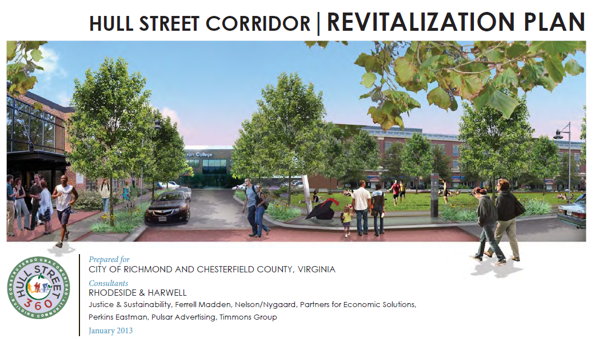
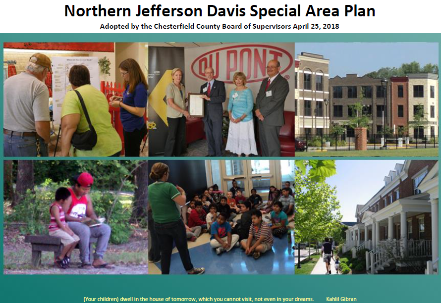
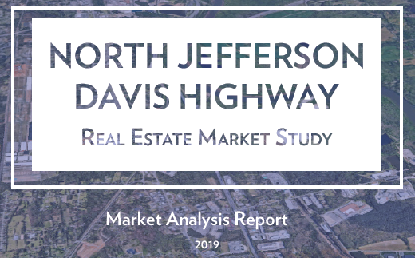
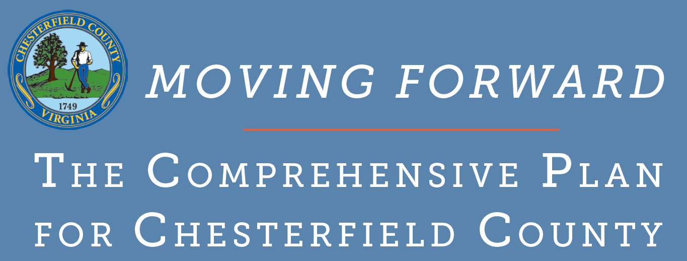
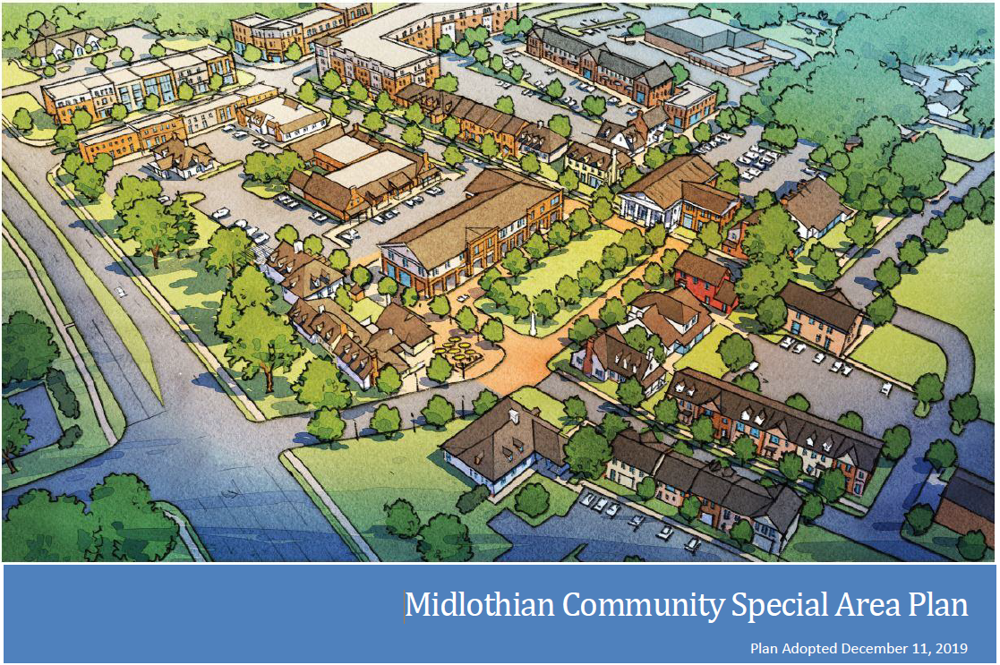
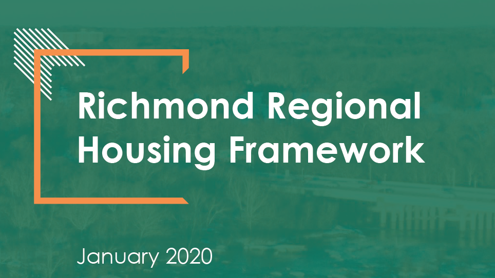
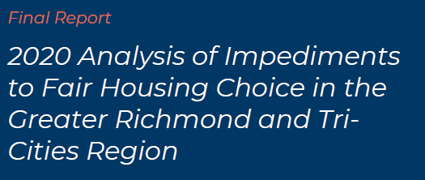

# (PART) LITERATURE REVIEW {.unnumbered}

# Planning for housing in Chesterfield County {#part-1a-1}

This section summarizes recent planning documents related to housing and housing affordability in Chesterfield County. This includes county and regional planning documents. Documents post-2008 will be favored for currency.

## Background

Chesterfield County has acknowledged the importance of housing availability and affordability throughout many of their planning documents. Planning efforts by the county have sought to address housing at varying scales within county boundaries, while the county has also been involved in multijurisdictional planning to address the housing challenges that exist at the regional level.

The following sections summarize housing, community development, and revitalization elements in the most recent planning documents created for Chesterfield County. Plans are listed chronologically, ending with the most recently completed documents.

## Hull Street Corridor Revitalization Plan

*Completed January 2013.*

This plan was a joint revitalization plan between the City of Richmond and Chesterfield County. It focused on a 4.7 mile stretch of Hull Street experiencing changing demographics and increased need for reinvestment.

Plan highlights:

* Current housing conditions in the corridor included:
  + A significant supply of affordable rental homes (without public assistance),
  + Homeownership opportunities that were relatively more affordable compared to other areas of the County and City, and
  + The average age of housing stock was younger than the City average, but older than the County average.
* The corridor vision includes preserving current neighborhoods while creating “new housing for a range of income levels.”
* Townhomes and other multifamily options located near amenities were specifically recommended to reduce automobile dependency.
* The plan calls for future public investment to enhance existing housing stock, add new affordable housing options, and address senior housing needs.

## Route 1 (formerly Northern Jefferson Davis) Special Area Plan

*Completed April 2018.*

This detailed special area plan produced by county planners focused on the northern 8.5 mile section of Route 1 within the county.

Plan highlights:

* The plan included a strong emphasis on stabilizing and improving distinct neighborhoods.
* Certain areas of the corridor were designated for new residential mixed use development to help encourage additional housing options and bring new investment.
* Accessory dwelling units (ADUs) were recommended as an alternative housing option to promote, as well as transitional housing options for individuals with high needs.
* An additional emphasis was placed on continued and expanded revitalization efforts to improve housing in older neighborhoods along the corridor.

## Route 1 (formerly North Jefferson Davis Highway) Real Estate Market Study

*Completed 2019.*

This study, commissioned by Chesterfield County and prepared by Urban Partners, informed county officials on market opportunities that exist along the northern section of Route 1 within Chesterfield County. The study area included eight census block groups that abut Route 1 from the Richmond City border to Route 288.

Study highlights:

* Population and household growth in the study area are much slower than the county average.
* The study area is very ethnically diverse compared to county and region.
* These neighborhoods have higher shares of children (under 10) and non-family households.
* Households in this area have significantly lower incomes and higher poverty rates.
* Job numbers have declined across the study area, especially in manufacturing.
* The study area experienced a significant increase in residential vacancy, and decrease in homeownership, from 2000 to 2017.
* The study area is now majority renter, but over one-third of renters live in single-family homes.
* There are approximately 380 mobile homes across six manufactured home communities in the study area.
* An analysis of existing multifamily properties found a very tight rental market (98.4 percent occupancy) despite high overall vacancy rate.
* The report estimates that the study area could accommodate 15 to 20 percent of county’s demand for new multifamily stock by 2025 (3-4 new developments); however, acquisition and construction costs would mean these new units are priced at or near County average, which is out of reach for most incomes in the study area.
* Homeownership is relatively affordable in the study area, but not always for current residents with very low or fixed incomes.

## Moving Forward: The Comprehensive Plan for Chesterfield County

*Completed May 2019.*

The Code of Virginia (Section 15.2-2223) requires all localities to adopt a comprehensive plan that guides the physical development of jurisdictions based on existing conditions and trends. This plan is the most recently completed effort to fulfill this requirement. It was a collaborative effort between elected officials, residents, stakeholders, and county staff.

Plan highlights:

* Chapter 6: Neighborhoods and Housing:
  + The first desired outcome is additional affordable homeownership opportunities.
  + The second desired outcome is supporting a “range of housing options” in neighborhoods and mixed-use centers.
  + A lack of “missing middle” housing options (e.g., townhomes, small-scale rental) was also identified.
  + The chapter calls for affordable housing options to be “encouraged throughout the county to promote integrated communities.”
* Chapter 7: Revitalization
  + Outlines goals for using public and private investment to improve the quality of communities experiencing decline, vacancy, and other challenges.
  + Reinforces the “need for a range of well-designed housing choices” that are strategically located and affordably priced.

## Midlothian Community Special Area Plan

*Completed December 2019.*

This is a detailed special area plan by county planners focused on the Midlothian community. It is a continued effort of the *Moving Forward* comprehensive plan adopted earlier in 2019.

Plan highlights:

* There are currently a “limited variety of housing options” in the Midlothian Village area.
* 61 percent of housing in the Village are single-family homes in subdivisions.
* Recommendations call for additional residential development to meet demand, particularly smaller and denser types to lower per-unit costs and prices for buyers or renters.
* A specific need for housing that caters to persons/couples without children was identified.
* Mixed use opportunities (residential and commercial) were encouraged as part of retail property redevelopment strategies.
* Accessory dwelling units (ADUs) were also recommended as a solution to increase the supply of low-cost homes, especially for single-person households.

## Richmond Regional Housing Framework

*Completed January 2020.*

This framework is an effort between the Partnership for Housing Affordability (PHA), Chesterfield, Hanover, Henrico, the City of Richmond, and the Town of Ashland to increase housing opportunities across the region. The plan identified common housing challenges and solutions, along with locality-specific findings and recommendations.

Major findings for Chesterfield County included:

* Homeownership is significantly more expensive to achieve than a decade ago.
* The deficit of homes affordable to renters below 50 percent AMI is over 2,000.
* The senior population in Chesterfield is growing faster than anywhere else in the region.
* Almost 2,000 families live in the county’s 27 manufactured home communities, the highest amount in the region.
* Most of the projected job growth will be occupations with below-average wages, limiting the ability of workers to pay for housing.

Some of the specific policy solutions for Chesterfield County included:

* Increase the amount of land available for multifamily housing via land use and zoning reform.
* Reduce land use and zoning barriers to accessory dwelling units (ADUs).
* Encourage smaller, denser homeownership opportunities (such as townhomes and condos) to reduce land costs per home.
* Increase efforts to revitalize manufactured home communities and preserve them as affordable housing options.

## Analysis of Impediments to Fair Housing Choice in the Greater Richmond and Tri-Cities Region 

*Completed March 2021.*

An analysis of impediments (AI) to fair housing is a requirement among jurisdictions receiving entitlement funds from the U.S. Department of Housing and Urban Development. This AI was a collaborative effort by Chesterfield, Henrico, and Cities of Colonial Heights, Hopewell, Petersburg, and Richmond in order to maximize efficiency.

Among the 587 respondents from Chesterfield County who participated in a community engagement survery:

* 25 percent want to buy a home but cannot afford one.
* 19 percent are worried about rent going up and being unable to afford it.
* The top five most important factors for choosing a new home were:
  + Quality schools,
  + Affordability,
  + Low crime rate,
  + Good opinion of the neighborhood, and
  + Close to work.
* The top impediment to moving was the inability to afford anywhere else to live.

Relevant research findings for Chesterfield County included:

* The lowest share of non-family households in the region (27 percent).
* Low disability rates among the full population (12 percent).
* The second-highest share of foreign-born residents in region (8.4 percent).
* The highest median household income in the region ($80,214 in 2018).
* The lowest poverty rate in region (7 percent).
* Nearly one-third of county’s housing stock was built after 2000.
* More manufactured home communities are in Chesterfield than any other locality in the region; these neighnorhoods offer more affordable options but often at the expense of poor housing quality.
* Underutilization of housing assistance (e.g. Housing Choice Vouchers) by Hispanic and Latino households relative to their share of the overall population.

Common impediments to furthering fair and equitable housing included:

* Historical segregation and discrimination,
* Limited and/or inconsistent federal resources to increase the supply of affordable homes and reduce housing instability, and
* Restrictive land use codes limiting multifamily development and other more affordable types of construction.

Impediments to rental housing choices included:

* Geographically concentrated affordable rental options (in lower-opportunity areas),
* Low supply and high demand contributing to significant rent growth, and
* A lack of (and poor locations of) units available and affordable to residents with very low incomes and/or disabilities.

Impediments to accessing high opportunity environments included:

* A limited amount of affordable housing and transit access in job-rich areas,
* Inadequate public transportation coverage across the region, and
* Educational success disparities across public schools.

## Takeaways

* Chesterfield County, both on its own and in partnership with the region, has regularly assessed its range of housing needs and identified policy solutions to address these challenges.
* Despite relatively high average incomes at the county level, affordable homeownership and rental opportunities are becoming more difficult to secure for low- to moderate-income households.
* The county's major commercial corridors (Route 1, Midlothian Turnpike, and Hull Street) have all been identified as opportunities for redevelopment and revitalization activities that would increase the supply and diversity of housing options.
* The county should ensure safe and affordable housing is available to its rapidly rising senior population, as well as its large share of Hispanic and Latino families, many of whom live in substandard manufactured housing.
