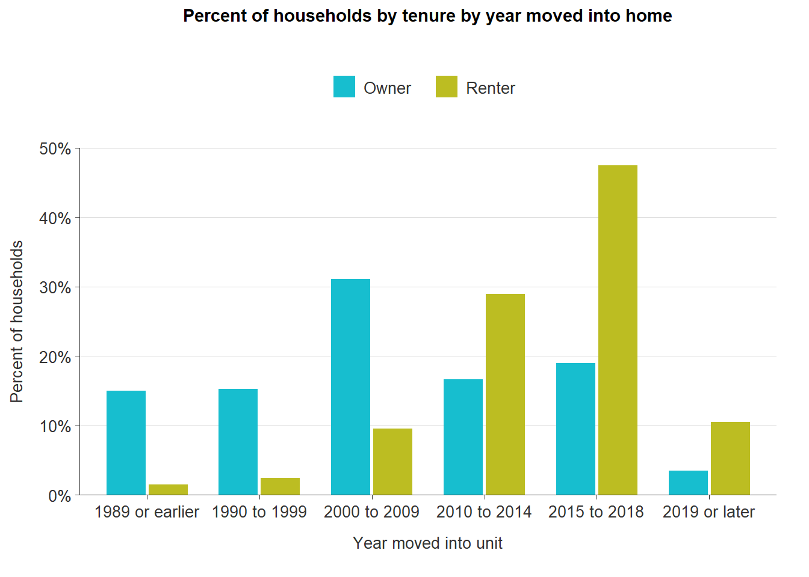

# Renter tenancy {#part-1a-5}

This section summarizes research on period of stay in subsidized housing and any comparisons between tenancy in subsidized and unsubsidized housing.

## Research analysis

From a growing family to a change in employment, the length of time a person rents an apartment or home can vary depending on a multitude of factors. Little academic research has been conducted on the length of stay among market-rate renters. Most research conducted in this area is dedicated to better understanding apartment turnover rates from a commercial real estate perspective. For affordable housing residents, the most comprehensive study of length of stay was conducted in 2017 by the HUD’s Office of Policy Development and Research. 

:::{.rmdnote}

To date, no formal research has been conducted making comparisons between market-rate and affordable housing resident length of stay. 

:::

General consensus on market-rate rental housing tenancy ranges depending on whether a property is single-family or multifamily. Single-family rental stays average three years, while stays in multifamily properties averages about 27.5 months. Affordable housing stays average higher at nearly six years, but can vary depending on household type. Senior households stay about nine years, while non-senior families with children stay about four years. 

The PDR study also found that stays in affordable housing varied by program type. Housing Choice Voucher (HCV) program participants had a median stay of 4.8 years, while programs like public housing and Section 8 project-based programs had a median stay closer to market rate residents---three years. LIHTC, a major source of affordable housing across the nation, was missing from this study, and no research was found to be conducted on LITHC tenant length of stay, however, Section 8 project-based assistance and HCVs are often tied to LIHTC units.

PDR notes that stays in affordable housing programs are likely to increase as market forces, such as rising home prices and stagnant wages, continue to negatively impact low-income households. This increased length of stay in affordable housing can prevent new residents from accessing a much needed resource when additional supply is not being generated. It can also be an indication of residents not being able to climb the economic ladder to move out of assisted housing. 

For the private market, it can be beneficial to increase tenant length of stay. Tenant turnover can be costly for landlords who need to clean, repair, and market rental units. Vacancy, for any amount of time, equates to lost rent.

## Length of stay from ACS data

While there is no readily accessible dataset to compare length-of-stay between renters in subsidized versus market-rate housing, Table [B25038](https://censusreporter.org/data/table/?table=B25038&geo_ids=05000US51041&primary_geo_id=05000US51041) from the American Community Survey displays estimates for the year households moved into their current home by tenure.

The figure below shows this data for Chesterfield County using the latest 2016-2020 5-year estimates. Homeowners are much more likely to have lived in their home for a longer time than renters. Well over half of all homeowners last moved before 2009, with many settling in during the 2000-2009 decade. The majority of renters, on the other hand, moved into their current apartment in 2010 or after.

(\#fig:length-of-stay)Percent of households by tenure by year moved into home

## Takeaways

* Tenants may stay or leave in rental housing for various reasons regardless of the type of rental housing they live in.
* Longer lengths of stay mean economic stability for both tenant and landlord, but low turnover rates can exacerbate affordability challenges for new residents seeking to move to a community.
* With low turnover and minimal new rental construction, low supply leads to high demand across the rental market regardless of housing type.
* In Chesterfield County, renters in all types of units last moved much more recently than their homeowner counterparts.
