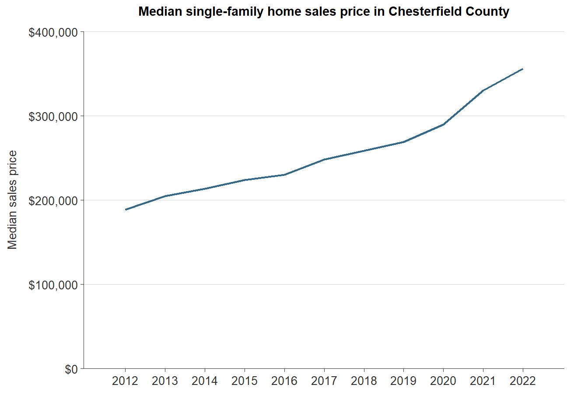
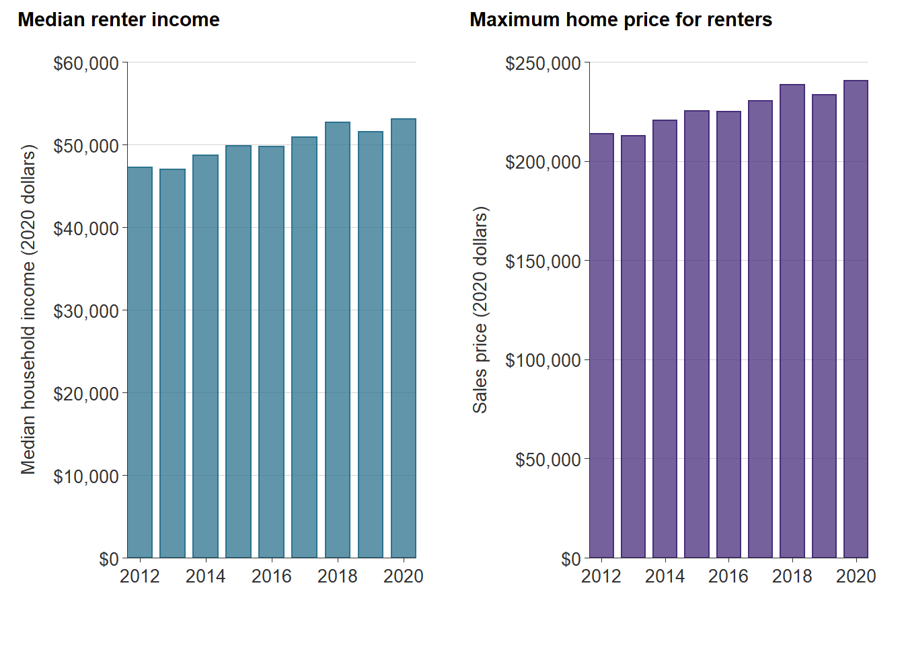
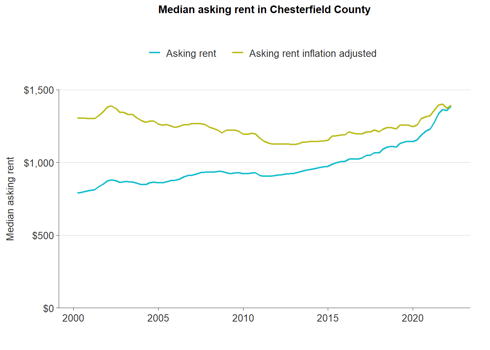

# Ability-to-pay {#part-1b-4}

This section compares common wages for workers across Chesterfield County to actual housing costs for both homeownership and renting. The analysis reflects the ability for Chesterfield workforce to pay for current housing costs.

## Background

Affording a home in Chesterfield County—whether to own or rent— is directly tied to the incomes that households earn. There are diverse job opportunities across the region, and while some common jobs do pay well-above minimum wage, housing costs are rising faster.

<table class="table table-striped table-hover table-condensed" style="margin-left: auto; margin-right: auto;">
<caption>(\#tab:top-occupations)Top five most common occupations in Chesterfield County</caption>
 <thead>
  <tr>
   <th style="text-align:left;"> Occupation </th>
   <th style="text-align:right;"> Jobs </th>
   <th style="text-align:right;"> Mean hourly wage </th>
   <th style="text-align:right;"> Mean annual wage </th>
  </tr>
 </thead>
<tbody>
  <tr>
   <td style="text-align:left;"> Retail salespersons </td>
   <td style="text-align:right;"> 18,770 </td>
   <td style="text-align:right;"> $13.85 </td>
   <td style="text-align:right;"> $28,800 </td>
  </tr>
  <tr>
   <td style="text-align:left;"> Fast food and counter workers </td>
   <td style="text-align:right;"> 16,930 </td>
   <td style="text-align:right;"> $11.29 </td>
   <td style="text-align:right;"> $23,490 </td>
  </tr>
  <tr>
   <td style="text-align:left;"> Customer service representatives </td>
   <td style="text-align:right;"> 13,560 </td>
   <td style="text-align:right;"> $17.51 </td>
   <td style="text-align:right;"> $36,410 </td>
  </tr>
  <tr>
   <td style="text-align:left;"> Registered nurses </td>
   <td style="text-align:right;"> 12,910 </td>
   <td style="text-align:right;"> $36.99 </td>
   <td style="text-align:right;"> $76,940 </td>
  </tr>
  <tr>
   <td style="text-align:left;"> Home health and personal care aides </td>
   <td style="text-align:right;"> 9,390 </td>
   <td style="text-align:right;"> $11.51 </td>
   <td style="text-align:right;"> $23,930 </td>
  </tr>
</tbody>
</table>

*Source: Bureau of Labor Statistics, Occupational Employment and Wage Statistics, May 2021.*

A diverse workforce also requires diverse housing for those workers. When workers can’t find housing in a community, they either have to commute in or they search for work elsewhere. More in-commuters can exacerbate traffic congestion and increase the amount of spending on transportation costs, while the loss of workers can put strain on local economies.

Understanding the ability of a range of job types to afford housing in a county contributes to economic development goals and helps ensure that workers that live in the county can continue to live in the county.

## Homeowner affordability

Homeownership is more difficult to achieve in Chesterfield County The COVID-19 pandemic further tightened the housing market across America, and the Richmond region was no exception. The low supply of homes-for-sale coupled with record low mortgage interest rates placed pressure on local housing markets, especially in the suburbs.

The median home sale price in Chesterfield County has increased by 23 percent since before the pandemic in 2019---from $269,000 to $330,000 in 2021.

(\#fig:cf-med-sales)Median single-family home sales price in Chesterfield County

*Source: CVR MLS. 2022 includes all sales through March.*

In order to afford a home at this price, a household would need to make **\$79,181**. The table below shows the assumptions made to calculate this figure.

<table class="table table-condensed table-hover table-striped" style="margin-left: auto; margin-right: auto;">
<caption>(\#tab:cf-home-price)Calculated income needed to buy median-priced home in Chesterfield County</caption>
 <thead>
  <tr>
   <th style="text-align:left;"> Variable </th>
   <th style="text-align:right;"> Value </th>
  </tr>
 </thead>
<tbody>
  <tr>
   <td style="text-align:left;"> Median sales price </td>
   <td style="text-align:right;"> $330,000 </td>
  </tr>
  <tr>
   <td style="text-align:left;"> Downpayment </td>
   <td style="text-align:right;"> 5.0% </td>
  </tr>
  <tr>
   <td style="text-align:left;"> Closing costs </td>
   <td style="text-align:right;"> 1.5% </td>
  </tr>
  <tr>
   <td style="text-align:left;"> Loan amount </td>
   <td style="text-align:right;"> $318,274 </td>
  </tr>
  <tr>
   <td style="text-align:left;"> Interest rate </td>
   <td style="text-align:right;"> 4.42% </td>
  </tr>
  <tr>
   <td style="text-align:left;"> Monthly utilities </td>
   <td style="text-align:right;"> $250 </td>
  </tr>
  <tr>
   <td style="text-align:left;"> Monthly payment </td>
   <td style="text-align:right;"> $1,847.55 </td>
  </tr>
  <tr>
   <td style="text-align:left;font-weight: bold;"> Income needed to buy home </td>
   <td style="text-align:right;font-weight: bold;"> $79,181 </td>
  </tr>
</tbody>
</table>

*Sources: CVR MLS and Freddie Mac Primary Mortgage Market Survey.*

This minimum income is about \$25,000 more than the 2020 median household income for renters in Chesterfield. In fact, through 2020, the average renter household income is unable to support a home sales price above $250,000.

(\#fig:cf-renter-income-afford)Median household income and affordable home sales price for renters in Chesterfield County

*Sources: U.S. Census Bureau, American Community Survey, 5-year estimates, Table B25119 and Freddie Mac Primary Mortgage Market Survey.*

Compared to 2021 average wages, several common occupations in the county would also struggle to afford the typical home price in the county in 2021. For example, customer service representatives average hourly wage of \$17.51 could only afford a monthly mortgage payment for a home priced below \$170,000. Even with an hourly wage that is three times that of the Virginia minimum wage (\$11.00 per hour), households in the county would still struggle to afford a home.

The table below shows the maximum home sales price affordable at the current average wages for the five most common occupations in Chesterfield County.

<table class="table table-striped table-hover table-condensed" style="margin-left: auto; margin-right: auto;">
<caption>(\#tab:cf-jobs-price)Maximum home sales price for five most common occupations in Chesterfield County</caption>
 <thead>
  <tr>
   <th style="text-align:left;"> Occupation </th>
   <th style="text-align:right;"> Jobs </th>
   <th style="text-align:right;"> Maximum home sales price </th>
  </tr>
 </thead>
<tbody>
  <tr>
   <td style="text-align:left;"> Retail salespersons </td>
   <td style="text-align:right;"> 18,770 </td>
   <td style="text-align:right;"> 672.0000 </td>
  </tr>
  <tr>
   <td style="text-align:left;"> Fast food and counter workers </td>
   <td style="text-align:right;"> 16,930 </td>
   <td style="text-align:right;"> 548.1000 </td>
  </tr>
  <tr>
   <td style="text-align:left;"> Customer service representatives </td>
   <td style="text-align:right;"> 13,560 </td>
   <td style="text-align:right;"> 849.5667 </td>
  </tr>
  <tr>
   <td style="text-align:left;"> Registered nurses </td>
   <td style="text-align:right;"> 12,910 </td>
   <td style="text-align:right;"> 1795.2667 </td>
  </tr>
  <tr>
   <td style="text-align:left;"> Home health and personal care aides </td>
   <td style="text-align:right;"> 9,390 </td>
   <td style="text-align:right;"> 558.3667 </td>
  </tr>
</tbody>
</table>

*Sources: Freddie Mac Primary Mortgage Market Survey and Bureau of Labor Statistics, Occupational Employment and Wage Statistics, May 2021.*

## Renter affordability

The housing supply shortage is also being felt in the rental housing market. Small landlords exiting the rental market and low supply are exacerbating the challenges renters were facing even before the pandemic.  For many renters in low paying jobs, the pandemic impacts were heightened for those that could not work-from-home and depended on shuttered service industry jobs. Slow wage growth and increasing rental prices combined to put pressure on the housing stability of essential workers.

Post-recession average asking rent in the county hit a low of \$1,150 in 2012 (adjusted to current dollars), but has been on the rise ever since. From 2012 to 2019, average rents rose an average of 2 percent each year until 2020, the year of the pandemic. Between 2019 and 2020, average rent in the county rose by 5 percent (\$69)---from \$1,290 to \$1,359, a substantial increase for individuals and families on tight budgets. In 2021, average rent continued to rise to over \$1,400. 

(\#fig:cf-rents)Median asking rent in Chesterfield County

*Source: CoStar Group, Inc.*

This rent is increasingly unaffordable to some of the most common occupations in the county, like retail salespersons and home health aides. For a retail salesperson with an average hourly wage of \$13.85, a rent on a single income would be more affordable at \$672 to \$748 cheaper than the typical rent in the county. 

Elementary school teachers with an average salary of \$53,840 would also be hard pressed to afford the typical rent. For an essential part of the workforce there would need to be rental units priced lower cheaper at \$1,256.

<table class="table table-striped table-hover table-condensed" style="margin-left: auto; margin-right: auto;">
<caption>(\#tab:cf-renter-affordability)Maximum monthly rent for five most common occupations in Chesterfield County</caption>
 <thead>
  <tr>
   <th style="text-align:left;"> Occupation </th>
   <th style="text-align:right;"> Jobs </th>
   <th style="text-align:right;"> Maximum monthly rent </th>
  </tr>
 </thead>
<tbody>
  <tr>
   <td style="text-align:left;"> Retail salespersons </td>
   <td style="text-align:right;"> 18,770 </td>
   <td style="text-align:right;"> 8640 </td>
  </tr>
  <tr>
   <td style="text-align:left;"> Fast food and counter workers </td>
   <td style="text-align:right;"> 16,930 </td>
   <td style="text-align:right;"> 7047 </td>
  </tr>
  <tr>
   <td style="text-align:left;"> Customer service representatives </td>
   <td style="text-align:right;"> 13,560 </td>
   <td style="text-align:right;"> 10923 </td>
  </tr>
  <tr>
   <td style="text-align:left;"> Registered nurses </td>
   <td style="text-align:right;"> 12,910 </td>
   <td style="text-align:right;"> 23082 </td>
  </tr>
  <tr>
   <td style="text-align:left;"> Home health and personal care aides </td>
   <td style="text-align:right;"> 9,390 </td>
   <td style="text-align:right;"> 7179 </td>
  </tr>
</tbody>
</table>

*Source: CoStar Group, Inc. and Bureau of Labor Statistics, Occupational Employment and Wage Statistics, May 2021.*

## Takeaways

* Although Chesterfield has a relatively high median household income in the region, many of the county's essential workers are not earning enough to keep up with the housing market.
* Homeownership will be increasingly out-of-reach for many workers if current supply and demand trends continue, and especially if interest rates begin rising.
* The average monthly rent in Chesterfield is approaching $1,500. This will be very unaffordable to most of the county's retail, service, and healthcare service workers.
