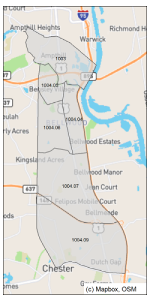
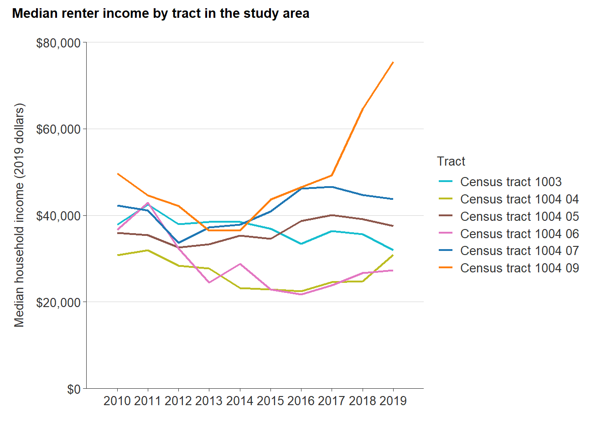
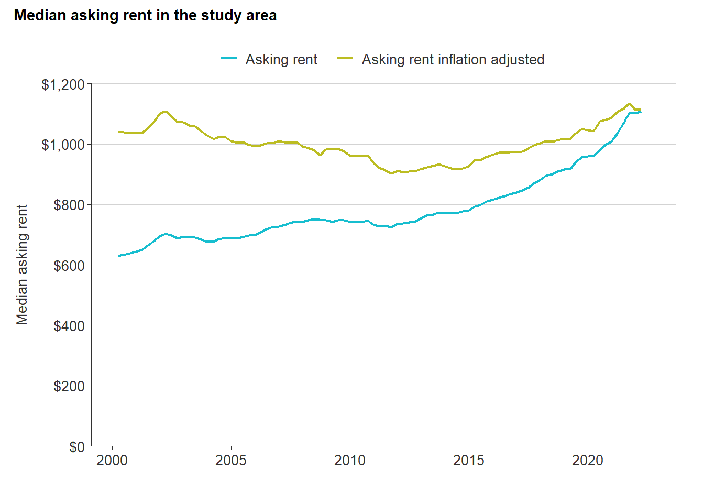

# Route 1 affordability analysis  {#part-1b-5}

This section provides a focused analysis of housing affordability along the U.S. Route 1 corridor in Chesterfield County from the county-city border to the north down to Route 10 at the southern end.

## Background

The northern section of U.S. Route 1 in Chesterfield County saw substantial economic activity throughout the middle of the 20th century. As the major north-south interstate corridor along the East Coast, American motorists stopped at the many motels and food stops that sustained a vibrant tourist economy.

However, the creation of Interstate 95 in the late 1950s drew traffic, and with it business, away from the Route 1 corridor. Throughout the latter half of the 20th century, the corridor saw decline and significant changes that presented challenges for revitalization efforts.

A growing Hispanic population along the corridor has helped reignite commercial activity along the corridor, but housing challenges still exist. Although one of the most affordable areas in Chesterfield County, the corridor has remained generally affordable due to older housing units---many of which are out of style and in need of significant rehabilitation.

## Study area

For the purposes of this analysis, the study area is defined as the Census tracts 1003, 1004.04, 1004.05, 1004.06, 1004.07, 1004.09. These tracts all border Route 1 from Northern Chesterfield to Route 10.

(\#fig:r1-base-map)Route 1 study area

There are several different housing options along the corridor that serve a diverse population; these includes single-family homes, garden-style apartments, mobile homes, and senior communities. While not included as part of this analysis, it is also important to note that several motels along the corridor are serving as long-term housing options for some Chesterfield residents.

According to tract-level LEHD employment data from the Census Bureau's [OnTheMap](https://onthemap.ces.census.gov/) application, residents in this area largely work in the retail, health care and social assistance, construction, and accommodation and food services industries. "Administration and support and waste management and remediation services" is a broad category including office administration, security, cleaning, and other routine services for businesses and other organizations.

<table class="table table-striped table-hover table-condensed" style="margin-left: auto; margin-right: auto;">
<caption>(\#tab:r1-industry)Top five most common industries for residents in the study area</caption>
 <thead>
  <tr>
   <th style="text-align:left;"> Industry </th>
   <th style="text-align:right;"> Jobs </th>
  </tr>
 </thead>
<tbody>
  <tr>
   <td style="text-align:left;"> Retail trade </td>
   <td style="text-align:right;"> 958 </td>
  </tr>
  <tr>
   <td style="text-align:left;"> Health care and social assistance </td>
   <td style="text-align:right;"> 919 </td>
  </tr>
  <tr>
   <td style="text-align:left;"> Construction </td>
   <td style="text-align:right;"> 746 </td>
  </tr>
  <tr>
   <td style="text-align:left;"> Accommodation and food services </td>
   <td style="text-align:right;"> 710 </td>
  </tr>
  <tr>
   <td style="text-align:left;"> Administration and support and waste management and remediation services </td>
   <td style="text-align:right;"> 651 </td>
  </tr>
</tbody>
</table>

*Source: U.S. Census Bureau. (2022). LEHD Origin-Destination Employment Statistics (2002-2019). Longitudinal-Employer Household Dynamics Program.*

While specific wages for each industry and occupation are not available for the specific study area, the LEHD dataset does summarize monthly earnings for all workers into three pay bands. One in five workers earn less than \$1,250 per month, which are likely part-time jobs. While many workers (42 percent) earn more than \$3,333 monthly, or approximately \$40,000 annually, the majority earn less. Most working residents in the study area are employed full-time at low-wage jobs, or are underemployed.

<table class="table table-striped table-hover table-condensed" style="margin-left: auto; margin-right: auto;">
<caption>(\#tab:r1-earnings)Monthly earnings for residents in the study area</caption>
 <thead>
  <tr>
   <th style="text-align:left;"> Monthly earnings (dollars) </th>
   <th style="text-align:right;"> Percent </th>
  </tr>
 </thead>
<tbody>
  <tr>
   <td style="text-align:left;"> 1,250 or less </td>
   <td style="text-align:right;"> 20.2% </td>
  </tr>
  <tr>
   <td style="text-align:left;"> 1,251 to 3,333 </td>
   <td style="text-align:right;"> 37.9% </td>
  </tr>
  <tr>
   <td style="text-align:left;"> More than 3,333 </td>
   <td style="text-align:right;"> 41.9% </td>
  </tr>
</tbody>
</table>

*Source: U.S. Census Bureau. (2022). LEHD Origin-Destination Employment Statistics (2002-2019). Longitudinal-Employer Household Dynamics Program.*

The LEHD does not tabulate jobs by specific occupation, but based on the most common industries of workers in the study area, the table below shows the most likely common occupations (and regional wages) for these workers.

<table class="table table-striped table-hover table-condensed" style="margin-left: auto; margin-right: auto;">
<caption>(\#tab:r1-jobs)Wages for common occupations in the study area</caption>
 <thead>
  <tr>
   <th style="text-align:left;"> Occupation </th>
   <th style="text-align:right;"> Mean hourly wage </th>
   <th style="text-align:right;"> Mean annual wage </th>
  </tr>
 </thead>
<tbody>
  <tr>
   <td style="text-align:left;"> Construction laborers </td>
   <td style="text-align:right;"> $16.50 </td>
   <td style="text-align:right;"> $34,310.00 </td>
  </tr>
  <tr>
   <td style="text-align:left;"> Retail salespersons </td>
   <td style="text-align:right;"> $13.85 </td>
   <td style="text-align:right;"> $28,800.00 </td>
  </tr>
  <tr>
   <td style="text-align:left;"> Janitors and cleaners </td>
   <td style="text-align:right;"> $13.02 </td>
   <td style="text-align:right;"> $27,450.00 </td>
  </tr>
  <tr>
   <td style="text-align:left;"> Home health and personal care aides </td>
   <td style="text-align:right;"> $11.51 </td>
   <td style="text-align:right;"> $23,930.00 </td>
  </tr>
  <tr>
   <td style="text-align:left;"> Fast food and counter workers </td>
   <td style="text-align:right;"> $11.29 </td>
   <td style="text-align:right;"> $23,490.00 </td>
  </tr>
</tbody>
</table>

## Homeowner affordability

Along the Route 1 corridor, there have been about 56 home sales each quarter between 2015 and 2021. Like the rest of the county, the pandemic has impacted home prices in one of the county’s most affordable areas. As of 2021, the median sale price was \$288,000, a 95 percent increase from 2015 when the median home sale price was \$148,000.

(\#fig:r1-med-sales)Median single-family home sales price in study area

*Source: CVR MLS. 2022 includes all sales through March.*

In order to afford a home at this price, a household would need to make **\$70,467**. While this is 11 percent less than the income needed to afford the median sales price for the whole county, this is significantly above what most workers in the study area earn. The table below shows the assumptions made to calculate this figure.

<table class="table table-condensed table-hover table-striped" style="margin-left: auto; margin-right: auto;">
<caption>(\#tab:r1-home-price)Calculated income needed to buy median-priced home in the study area</caption>
 <thead>
  <tr>
   <th style="text-align:left;"> Variable </th>
   <th style="text-align:right;"> Value </th>
  </tr>
 </thead>
<tbody>
  <tr>
   <td style="text-align:left;"> Median sales price </td>
   <td style="text-align:right;"> $288,000 </td>
  </tr>
  <tr>
   <td style="text-align:left;"> Downpayment </td>
   <td style="text-align:right;"> 5.0% </td>
  </tr>
  <tr>
   <td style="text-align:left;"> Closing costs </td>
   <td style="text-align:right;"> 1.5% </td>
  </tr>
  <tr>
   <td style="text-align:left;"> Loan amount </td>
   <td style="text-align:right;"> $277,766 </td>
  </tr>
  <tr>
   <td style="text-align:left;"> Interest rate </td>
   <td style="text-align:right;"> 4.42% </td>
  </tr>
  <tr>
   <td style="text-align:left;"> Monthly utilities </td>
   <td style="text-align:right;"> $250 </td>
  </tr>
  <tr>
   <td style="text-align:left;"> Monthly payment </td>
   <td style="text-align:right;"> $1,644.23 </td>
  </tr>
  <tr>
   <td style="text-align:left;font-weight: bold;"> Income needed to buy home </td>
   <td style="text-align:right;font-weight: bold;"> $70,467 </td>
  </tr>
</tbody>
</table>

*Sources: CVR MLS and Freddie Mac Primary Mortgage Market Survey.*

Census estimates also show that most renters across the study area live in households that have incomes well below what it would require to buy a home in their neighborhood. Most of the census tracts have median renter incomes between \$20,000 and \$50,000.

(\#fig:r1-renter-income)Median renter income by tract in the study area

*Source: U.S. Census Bureau, American Community Survey, 5-year estimates, Table B25119.*

For workers who live along the Route 1 corridor, these price increases are continuing to keep homeownership out of reach. Residents largely work in the retail, health care and social assistance, construction, and accommodation and food services industries. Based on the average annual wages in the Richmond region, very few workers in these industries could afford to own a home along the corridor. The few homes that are sold at these prices (below \$160,000) are often in disrepair and, if sold, purchased by investors to rehabilitate and sell at a higher price.

<table class="table table-striped table-hover table-condensed" style="margin-left: auto; margin-right: auto;">
<caption>(\#tab:r1-jobs-price)Maximum home sales price for common occupations in the study area</caption>
 <thead>
  <tr>
   <th style="text-align:left;"> Occupation </th>
   <th style="text-align:right;"> Maximum home sales price </th>
  </tr>
 </thead>
<tbody>
  <tr>
   <td style="text-align:left;"> Construction laborers </td>
   <td style="text-align:right;"> $159,494 </td>
  </tr>
  <tr>
   <td style="text-align:left;"> Retail salespersons </td>
   <td style="text-align:right;"> $133,880 </td>
  </tr>
  <tr>
   <td style="text-align:left;"> Janitors and cleaners </td>
   <td style="text-align:right;"> $127,604 </td>
  </tr>
  <tr>
   <td style="text-align:left;"> Home health and personal care aides </td>
   <td style="text-align:right;"> $111,241 </td>
  </tr>
  <tr>
   <td style="text-align:left;"> Fast food and counter workers </td>
   <td style="text-align:right;"> $109,196 </td>
  </tr>
</tbody>
</table>

*Sources: Freddie Mac Primary Mortgage Market Survey and Bureau of Labor Statistics, Occupational Employment and Wage Statistics, May 2021.*

## Renter affordability

There are at least 2,076 existing rental units across 22 properties along the Route 1 corridor, with 204 additional units proposed. This does not include a significant amount of mobile home park units like Shady Hill, which contains at least 110 units alone. Thirty-seven percent of these units are located in a development with some rent restrictions that help ensure affordability. 

Since 2010, rents along the corridor have been on the rise, from a low of \$973 in 2011 to a 2022 year-to-date high of \$1,085. The increasing average rent can be attributed to the entry of several higher-end rentals into the market, like Colony Village.

(\#fig:r1-rents)Median asking rent in the study area

*Source: CoStar Group, Inc.*

The rise in rental demand---and subsequently, prices---along the corridor is putting significant pressure on workers who live in the area. In order to afford the average rent of \$1,083 in 2021, a single individual would need to make \$43,320 a year, or $20.83 an hour.

Some of the most common jobs occupied by corridor residents pay an hourly wage that is nearly half that needed to afford the typical rent. Fast wood workers, home health aides, and childcare workers all have an average hourly wage less than \$12.00. In order to afford a rental on a single income, they would need a monthly rent closer to \$600---a rent that is becoming harder and harder to find even in older properties like the Bellwood Maisonettes that now list their one bedroom apartments at $1,000 a month.

<table class="table table-striped table-hover table-condensed" style="margin-left: auto; margin-right: auto;">
<caption>(\#tab:r1-renter-affordability)Maximum monthly rent for common occupations in the study area</caption>
 <thead>
  <tr>
   <th style="text-align:left;"> Occupation </th>
   <th style="text-align:right;"> Maximum monthly rent </th>
  </tr>
 </thead>
<tbody>
  <tr>
   <td style="text-align:left;"> Construction laborers </td>
   <td style="text-align:right;"> $857.75 </td>
  </tr>
  <tr>
   <td style="text-align:left;"> Retail salespersons </td>
   <td style="text-align:right;"> $720.00 </td>
  </tr>
  <tr>
   <td style="text-align:left;"> Janitors and cleaners </td>
   <td style="text-align:right;"> $686.25 </td>
  </tr>
  <tr>
   <td style="text-align:left;"> Home health and personal care aides </td>
   <td style="text-align:right;"> $598.25 </td>
  </tr>
  <tr>
   <td style="text-align:left;"> Fast food and counter workers </td>
   <td style="text-align:right;"> $587.25 </td>
  </tr>
</tbody>
</table>

With these rent increases, renters along the corridor face increasing challenges. They often need to work additional hours, count on additional income from a partner, roommate, or family member, or compromise quality for affordability.

The majority of these properties are considered NOAH given their age, condition, and rent. But few, if any of these properties, have experienced any major renovations in the past decades---meaning that they are at-risk of deteriorating conditions or redevelopment. In either case, this puts residents in a precarious position: continue to live in unhealthy and unsafe conditions or move (voluntarily or involuntarily). 

## Takeaways

* Many workers in the northern Route 1 corridor are part of the county's essential workforce. However, the jobs they hold command wages that are usually well below average.
* Despite the lower home values in the study area, sales prices are rapidly increasing, putting homeownership out of reach for most residents of these neighborhoods.
* Increasing rents will force current residents to absorb additional housing cost burden, or find cheaper options after making concessions about the location or quality of their home.
