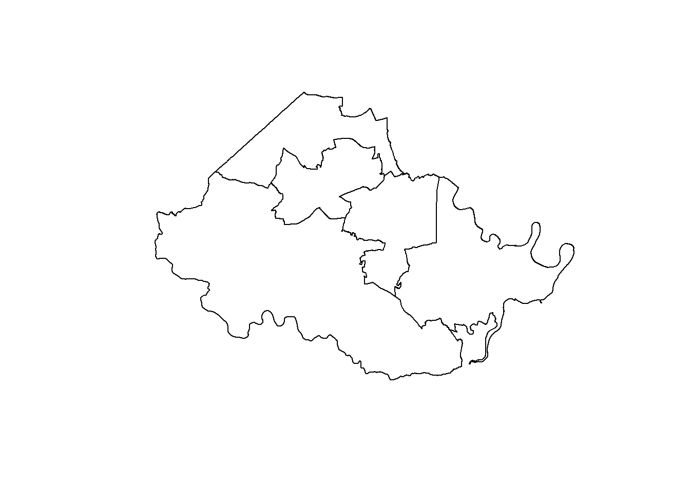

# (PART) COUNTYWIDE MARKET ANALYSIS {.unnumbered}

# Rental Spatial Analyis {#part-2a-2}

This section presents an analysis of the county's existing rental supply, focusing on the amount and location of rental housing units by Chesterfield County magisterial districts.


## Recent multifamily developments

The last five years have shown fluctuating multifamily development completions based on CoStar's proprietary commercial real estate database. From zero completed units in 2018 to a five year high of 1,569 units in 2020, development has been sporadic but is expected to grow significantly in the coming years. Most recent developments have consisted of low-rise buildings, offering amenities such as clubhouses, pools, and fitness centers.

As of June 2022, there were 33 existing market-rate multifamily developments that were either built in the last five years, under construction, or proposed. An additional development is a mixed-income senior rental housing project by Better Housing Coalition that was completed recently. Development in the past five years has generally been spread across the county, but only one development was completed in the Dale District.

Thirty-two percent of recent and future development has been or will be constructed in the Midlothian District. In 2023 and 2024, 3,757 new rental homes are expected to be completed --- slightly more than the number of homes completed between 2020 and 2022. 

This shift in intense development can be attributed to increasing home demand in this affluent and amenity rich portion of the county. Greenfield development in the western part of the county also contributes to its attractiveness to multifamily and mixed-use developers --- providing less risk when compared to redevelopment of brownfield sites. The Midlothian area also offers convenient access to Route 288, where residents can reach major job centers like the County Government Center, or even centers outside the county, like West Creek in Henrico County.

<div class="figure">

<p class="caption">(\#fig:recent-mf)Recent multifamily developments by magisterial district</p>
</div><div class="figure">

```{=html}
<div id="htmlwidget-f34822359e1cf76d5270" style="width:100%;height:480px;" class="leaflet html-widget"></div>
<script type="application/json" data-for="htmlwidget-f34822359e1cf76d5270">{"x":{"options":{"crs":{"crsClass":"L.CRS.EPSG3857","code":null,"proj4def":null,"projectedBounds":null,"options":{}}},"calls":[{"method":"addEasyButton","args":[{"icon":"ion-arrow-shrink","title":"Reset View","onClick":"function(btn, map){ map.setView(map._initialCenter, map._initialZoom); }","position":"topleft"}]},{"method":"addProviderTiles","args":["CartoDB.PositronNoLabels",null,null,{"errorTileUrl":"","noWrap":false,"detectRetina":false}]},{"method":"addCircleMarkers","args":[[37.463447,37.3879938,37.5118752,37.5105924,37.4704738,37.5152693,37.385989,37.4161673,37.4024981,37.3590129,37.4509959,37.395725,37.4268763,37.4169455,37.399948,37.5173148,37.5036969,37.3621348,37.4224921,37.509398,37.5162239,37.4431249,37.3500934,37.3586547,37.4749512,37.4218539,37.4990468,37.5052285,37.5077936,37.4997024,37.4529259,37.4057477,37.406681,37.4066597],[-77.664415,-77.6782917,-77.5326124,-77.5346073,-77.6614462,-77.6988542,-77.4258182,-77.6245689,-77.710331,-77.4454843,-77.6398079,-77.7405882,-77.695146,-77.4357878,-77.431476,-77.6071521,-77.669418,-77.4099752,-77.4396854,-77.62733,-77.6902964,-77.6416094,-77.4894109,-77.443,-77.6599419,-77.497621,-77.6917785,-77.6929055,-77.6632126,-77.5550052,-77.6432931,-77.6380479,-77.6376289,-77.637071],2,{},null,{"interactive":true,"className":"","stroke":true,"color":["#BCBD22","#E377C2","#1F77B4","#1F77B4","#BCBD22","#1F77B4","#17BECF","#E377C2","#E377C2","#17BECF","#BCBD22","#E377C2","#E377C2","#17BECF","#17BECF","#1F77B4","#1F77B4","#17BECF","#17BECF","#1F77B4","#1F77B4","#BCBD22","#17BECF","#17BECF","#BCBD22","#8C564B","#1F77B4","#1F77B4","#1F77B4","#1F77B4","#BCBD22","#E377C2","#E377C2","#E377C2"],"weight":2,"opacity":1,"fill":true,"fillColor":["#BCBD22","#E377C2","#1F77B4","#1F77B4","#BCBD22","#1F77B4","#17BECF","#E377C2","#E377C2","#17BECF","#BCBD22","#E377C2","#E377C2","#17BECF","#17BECF","#1F77B4","#1F77B4","#17BECF","#17BECF","#1F77B4","#1F77B4","#BCBD22","#17BECF","#17BECF","#BCBD22","#8C564B","#1F77B4","#1F77B4","#1F77B4","#1F77B4","#BCBD22","#E377C2","#E377C2","#E377C2"],"fillOpacity":1},null,null,["<div class='scrollableContainer'><table class= id='popup'><tr><td><\/td><th>Development&emsp;<\/th><td>Abberly at CenterPointe&emsp;<\/td><\/tr><tr><td><\/td><th>Address&emsp;<\/th><td>1900 Abberly Cir&emsp;<\/td><\/tr><tr><td><\/td><th>Units&emsp;<\/th><td>271&emsp;<\/td><\/tr><tr><td><\/td><th>District&emsp;<\/th><td>CLOVERHILL&emsp;<\/td><\/tr><tr><td><\/td><th>Latitude&emsp;<\/th><td>37.46345&emsp;<\/td><\/tr><tr><td><\/td><th>Longitude&emsp;<\/th><td>-77.66442&emsp;<\/td><\/tr><\/table><\/div>","<div class='scrollableContainer'><table class= id='popup'><tr><td><\/td><th>Development&emsp;<\/th><td>NA&emsp;<\/td><\/tr><tr><td><\/td><th>Address&emsp;<\/th><td>8500 Bethia Rd&emsp;<\/td><\/tr><tr><td><\/td><th>Units&emsp;<\/th><td>288&emsp;<\/td><\/tr><tr><td><\/td><th>District&emsp;<\/th><td>MATOACA&emsp;<\/td><\/tr><tr><td><\/td><th>Latitude&emsp;<\/th><td>37.38799&emsp;<\/td><\/tr><tr><td><\/td><th>Longitude&emsp;<\/th><td>-77.67829&emsp;<\/td><\/tr><\/table><\/div>","<div class='scrollableContainer'><table class= id='popup'><tr><td><\/td><th>Development&emsp;<\/th><td>The Boulders Lakeside&emsp;<\/td><\/tr><tr><td><\/td><th>Address&emsp;<\/th><td>1006 Boulder Lake Ter&emsp;<\/td><\/tr><tr><td><\/td><th>Units&emsp;<\/th><td>248&emsp;<\/td><\/tr><tr><td><\/td><th>District&emsp;<\/th><td>MIDLOTHIAN&emsp;<\/td><\/tr><tr><td><\/td><th>Latitude&emsp;<\/th><td>37.51188&emsp;<\/td><\/tr><tr><td><\/td><th>Longitude&emsp;<\/th><td>-77.53261&emsp;<\/td><\/tr><\/table><\/div>","<div class='scrollableContainer'><table class= id='popup'><tr><td><\/td><th>Development&emsp;<\/th><td>The Boulders Lakeview&emsp;<\/td><\/tr><tr><td><\/td><th>Address&emsp;<\/th><td>1001 Boulders Springs Dr&emsp;<\/td><\/tr><tr><td><\/td><th>Units&emsp;<\/th><td>212&emsp;<\/td><\/tr><tr><td><\/td><th>District&emsp;<\/th><td>MIDLOTHIAN&emsp;<\/td><\/tr><tr><td><\/td><th>Latitude&emsp;<\/th><td>37.51059&emsp;<\/td><\/tr><tr><td><\/td><th>Longitude&emsp;<\/th><td>-77.53461&emsp;<\/td><\/tr><\/table><\/div>","<div class='scrollableContainer'><table class= id='popup'><tr><td><\/td><th>Development&emsp;<\/th><td>Luxe 360&emsp;<\/td><\/tr><tr><td><\/td><th>Address&emsp;<\/th><td>14000 Center Pointe Pky&emsp;<\/td><\/tr><tr><td><\/td><th>Units&emsp;<\/th><td>342&emsp;<\/td><\/tr><tr><td><\/td><th>District&emsp;<\/th><td>CLOVERHILL&emsp;<\/td><\/tr><tr><td><\/td><th>Latitude&emsp;<\/th><td>37.47047&emsp;<\/td><\/tr><tr><td><\/td><th>Longitude&emsp;<\/th><td>-77.66145&emsp;<\/td><\/tr><\/table><\/div>","<div class='scrollableContainer'><table class= id='popup'><tr><td><\/td><th>Development&emsp;<\/th><td>Westchester II&emsp;<\/td><\/tr><tr><td><\/td><th>Address&emsp;<\/th><td>15800 City View Dr&emsp;<\/td><\/tr><tr><td><\/td><th>Units&emsp;<\/th><td>250&emsp;<\/td><\/tr><tr><td><\/td><th>District&emsp;<\/th><td>MIDLOTHIAN&emsp;<\/td><\/tr><tr><td><\/td><th>Latitude&emsp;<\/th><td>37.51527&emsp;<\/td><\/tr><tr><td><\/td><th>Longitude&emsp;<\/th><td>-77.69885&emsp;<\/td><\/tr><\/table><\/div>","<div class='scrollableContainer'><table class= id='popup'><tr><td><\/td><th>Development&emsp;<\/th><td>Colony Village II&emsp;<\/td><\/tr><tr><td><\/td><th>Address&emsp;<\/th><td>10200 Colony Village Way&emsp;<\/td><\/tr><tr><td><\/td><th>Units&emsp;<\/th><td>166&emsp;<\/td><\/tr><tr><td><\/td><th>District&emsp;<\/th><td>BERMUDA&emsp;<\/td><\/tr><tr><td><\/td><th>Latitude&emsp;<\/th><td>37.38599&emsp;<\/td><\/tr><tr><td><\/td><th>Longitude&emsp;<\/th><td>-77.42582&emsp;<\/td><\/tr><\/table><\/div>","<div class='scrollableContainer'><table class= id='popup'><tr><td><\/td><th>Development&emsp;<\/th><td>Commonwealth Apartments&emsp;<\/td><\/tr><tr><td><\/td><th>Address&emsp;<\/th><td>5401 Commonwealth Centre Pky&emsp;<\/td><\/tr><tr><td><\/td><th>Units&emsp;<\/th><td>234&emsp;<\/td><\/tr><tr><td><\/td><th>District&emsp;<\/th><td>MATOACA&emsp;<\/td><\/tr><tr><td><\/td><th>Latitude&emsp;<\/th><td>37.41617&emsp;<\/td><\/tr><tr><td><\/td><th>Longitude&emsp;<\/th><td>-77.62457&emsp;<\/td><\/tr><\/table><\/div>","<div class='scrollableContainer'><table class= id='popup'><tr><td><\/td><th>Development&emsp;<\/th><td>Livingston Apartment Flats&emsp;<\/td><\/tr><tr><td><\/td><th>Address&emsp;<\/th><td>15560 Cosby Village Ave&emsp;<\/td><\/tr><tr><td><\/td><th>Units&emsp;<\/th><td>307&emsp;<\/td><\/tr><tr><td><\/td><th>District&emsp;<\/th><td>MATOACA&emsp;<\/td><\/tr><tr><td><\/td><th>Latitude&emsp;<\/th><td>37.4025&emsp;<\/td><\/tr><tr><td><\/td><th>Longitude&emsp;<\/th><td>-77.71033&emsp;<\/td><\/tr><\/table><\/div>","<div class='scrollableContainer'><table class= id='popup'><tr><td><\/td><th>Development&emsp;<\/th><td>Fountain Square&emsp;<\/td><\/tr><tr><td><\/td><th>Address&emsp;<\/th><td>4300-4318 Fountain Square Dr&emsp;<\/td><\/tr><tr><td><\/td><th>Units&emsp;<\/th><td>37&emsp;<\/td><\/tr><tr><td><\/td><th>District&emsp;<\/th><td>BERMUDA&emsp;<\/td><\/tr><tr><td><\/td><th>Latitude&emsp;<\/th><td>37.35901&emsp;<\/td><\/tr><tr><td><\/td><th>Longitude&emsp;<\/th><td>-77.44548&emsp;<\/td><\/tr><\/table><\/div>","<div class='scrollableContainer'><table class= id='popup'><tr><td><\/td><th>Development&emsp;<\/th><td>The Lake J and K&emsp;<\/td><\/tr><tr><td><\/td><th>Address&emsp;<\/th><td>Genito Rd&emsp;<\/td><\/tr><tr><td><\/td><th>Units&emsp;<\/th><td>750&emsp;<\/td><\/tr><tr><td><\/td><th>District&emsp;<\/th><td>CLOVERHILL&emsp;<\/td><\/tr><tr><td><\/td><th>Latitude&emsp;<\/th><td>37.451&emsp;<\/td><\/tr><tr><td><\/td><th>Longitude&emsp;<\/th><td>-77.63981&emsp;<\/td><\/tr><\/table><\/div>","<div class='scrollableContainer'><table class= id='popup'><tr><td><\/td><th>Development&emsp;<\/th><td>Glenmoor Oaks&emsp;<\/td><\/tr><tr><td><\/td><th>Address&emsp;<\/th><td>18101 Golden Bear Trace&emsp;<\/td><\/tr><tr><td><\/td><th>Units&emsp;<\/th><td>248&emsp;<\/td><\/tr><tr><td><\/td><th>District&emsp;<\/th><td>MATOACA&emsp;<\/td><\/tr><tr><td><\/td><th>Latitude&emsp;<\/th><td>37.39572&emsp;<\/td><\/tr><tr><td><\/td><th>Longitude&emsp;<\/th><td>-77.74059&emsp;<\/td><\/tr><\/table><\/div>","<div class='scrollableContainer'><table class= id='popup'><tr><td><\/td><th>Development&emsp;<\/th><td>Watercrest Richmond&emsp;<\/td><\/tr><tr><td><\/td><th>Address&emsp;<\/th><td>5250 Grandin Ave&emsp;<\/td><\/tr><tr><td><\/td><th>Units&emsp;<\/th><td>99&emsp;<\/td><\/tr><tr><td><\/td><th>District&emsp;<\/th><td>MATOACA&emsp;<\/td><\/tr><tr><td><\/td><th>Latitude&emsp;<\/th><td>37.42688&emsp;<\/td><\/tr><tr><td><\/td><th>Longitude&emsp;<\/th><td>-77.69515&emsp;<\/td><\/tr><\/table><\/div>","<div class='scrollableContainer'><table class= id='popup'><tr><td><\/td><th>Development&emsp;<\/th><td>Maple Woods Apartments&emsp;<\/td><\/tr><tr><td><\/td><th>Address&emsp;<\/th><td>Jefferson Davis Hwy&emsp;<\/td><\/tr><tr><td><\/td><th>Units&emsp;<\/th><td>92&emsp;<\/td><\/tr><tr><td><\/td><th>District&emsp;<\/th><td>BERMUDA&emsp;<\/td><\/tr><tr><td><\/td><th>Latitude&emsp;<\/th><td>37.41695&emsp;<\/td><\/tr><tr><td><\/td><th>Longitude&emsp;<\/th><td>-77.43579&emsp;<\/td><\/tr><\/table><\/div>","<div class='scrollableContainer'><table class= id='popup'><tr><td><\/td><th>Development&emsp;<\/th><td>Lambert Landing&emsp;<\/td><\/tr><tr><td><\/td><th>Address&emsp;<\/th><td>9200 Jefferson Davis Hwy&emsp;<\/td><\/tr><tr><td><\/td><th>Units&emsp;<\/th><td>112&emsp;<\/td><\/tr><tr><td><\/td><th>District&emsp;<\/th><td>BERMUDA&emsp;<\/td><\/tr><tr><td><\/td><th>Latitude&emsp;<\/th><td>37.39995&emsp;<\/td><\/tr><tr><td><\/td><th>Longitude&emsp;<\/th><td>-77.43148&emsp;<\/td><\/tr><\/table><\/div>","<div class='scrollableContainer'><table class= id='popup'><tr><td><\/td><th>Development&emsp;<\/th><td>Mall Drive Apartments&emsp;<\/td><\/tr><tr><td><\/td><th>Address&emsp;<\/th><td>1650 Mall Dr&emsp;<\/td><\/tr><tr><td><\/td><th>Units&emsp;<\/th><td>473&emsp;<\/td><\/tr><tr><td><\/td><th>District&emsp;<\/th><td>MIDLOTHIAN&emsp;<\/td><\/tr><tr><td><\/td><th>Latitude&emsp;<\/th><td>37.51731&emsp;<\/td><\/tr><tr><td><\/td><th>Longitude&emsp;<\/th><td>-77.60715&emsp;<\/td><\/tr><\/table><\/div>","<div class='scrollableContainer'><table class= id='popup'><tr><td><\/td><th>Development&emsp;<\/th><td>Midlothian West&emsp;<\/td><\/tr><tr><td><\/td><th>Address&emsp;<\/th><td>14291 Midlothian Tpke&emsp;<\/td><\/tr><tr><td><\/td><th>Units&emsp;<\/th><td>275&emsp;<\/td><\/tr><tr><td><\/td><th>District&emsp;<\/th><td>MIDLOTHIAN&emsp;<\/td><\/tr><tr><td><\/td><th>Latitude&emsp;<\/th><td>37.5037&emsp;<\/td><\/tr><tr><td><\/td><th>Longitude&emsp;<\/th><td>-77.66942&emsp;<\/td><\/tr><\/table><\/div>","<div class='scrollableContainer'><table class= id='popup'><tr><td><\/td><th>Development&emsp;<\/th><td>The Jane at Moore's Lake&emsp;<\/td><\/tr><tr><td><\/td><th>Address&emsp;<\/th><td>12300 Moore’s Lake Rd&emsp;<\/td><\/tr><tr><td><\/td><th>Units&emsp;<\/th><td>385&emsp;<\/td><\/tr><tr><td><\/td><th>District&emsp;<\/th><td>BERMUDA&emsp;<\/td><\/tr><tr><td><\/td><th>Latitude&emsp;<\/th><td>37.36213&emsp;<\/td><\/tr><tr><td><\/td><th>Longitude&emsp;<\/th><td>-77.40998&emsp;<\/td><\/tr><\/table><\/div>","<div class='scrollableContainer'><table class= id='popup'><tr><td><\/td><th>Development&emsp;<\/th><td>Market Woods&emsp;<\/td><\/tr><tr><td><\/td><th>Address&emsp;<\/th><td>2501 New Park Rd&emsp;<\/td><\/tr><tr><td><\/td><th>Units&emsp;<\/th><td>60&emsp;<\/td><\/tr><tr><td><\/td><th>District&emsp;<\/th><td>BERMUDA&emsp;<\/td><\/tr><tr><td><\/td><th>Latitude&emsp;<\/th><td>37.42249&emsp;<\/td><\/tr><tr><td><\/td><th>Longitude&emsp;<\/th><td>-77.43969&emsp;<\/td><\/tr><\/table><\/div>","<div class='scrollableContainer'><table class= id='popup'><tr><td><\/td><th>Development&emsp;<\/th><td>Coalfield Reserve&emsp;<\/td><\/tr><tr><td><\/td><th>Address&emsp;<\/th><td>12231-12427 Old Buckingham Rd&emsp;<\/td><\/tr><tr><td><\/td><th>Units&emsp;<\/th><td>310&emsp;<\/td><\/tr><tr><td><\/td><th>District&emsp;<\/th><td>MIDLOTHIAN&emsp;<\/td><\/tr><tr><td><\/td><th>Latitude&emsp;<\/th><td>37.5094&emsp;<\/td><\/tr><tr><td><\/td><th>Longitude&emsp;<\/th><td>-77.62733&emsp;<\/td><\/tr><\/table><\/div>","<div class='scrollableContainer'><table class= id='popup'><tr><td><\/td><th>Development&emsp;<\/th><td>The Vue at Westchester Commons&emsp;<\/td><\/tr><tr><td><\/td><th>Address&emsp;<\/th><td>400 Perimeter Dr&emsp;<\/td><\/tr><tr><td><\/td><th>Units&emsp;<\/th><td>238&emsp;<\/td><\/tr><tr><td><\/td><th>District&emsp;<\/th><td>MIDLOTHIAN&emsp;<\/td><\/tr><tr><td><\/td><th>Latitude&emsp;<\/th><td>37.51622&emsp;<\/td><\/tr><tr><td><\/td><th>Longitude&emsp;<\/th><td>-77.6903&emsp;<\/td><\/tr><\/table><\/div>","<div class='scrollableContainer'><table class= id='popup'><tr><td><\/td><th>Development&emsp;<\/th><td>Towns at Swift Creek&emsp;<\/td><\/tr><tr><td><\/td><th>Address&emsp;<\/th><td>12224 Petrel Crossing&emsp;<\/td><\/tr><tr><td><\/td><th>Units&emsp;<\/th><td>200&emsp;<\/td><\/tr><tr><td><\/td><th>District&emsp;<\/th><td>CLOVERHILL&emsp;<\/td><\/tr><tr><td><\/td><th>Latitude&emsp;<\/th><td>37.44312&emsp;<\/td><\/tr><tr><td><\/td><th>Longitude&emsp;<\/th><td>-77.64161&emsp;<\/td><\/tr><\/table><\/div>","<div class='scrollableContainer'><table class= id='popup'><tr><td><\/td><th>Development&emsp;<\/th><td>The Reserve at Rivington&emsp;<\/td><\/tr><tr><td><\/td><th>Address&emsp;<\/th><td>12000 Reserve Manor Cir&emsp;<\/td><\/tr><tr><td><\/td><th>Units&emsp;<\/th><td>276&emsp;<\/td><\/tr><tr><td><\/td><th>District&emsp;<\/th><td>BERMUDA&emsp;<\/td><\/tr><tr><td><\/td><th>Latitude&emsp;<\/th><td>37.35009&emsp;<\/td><\/tr><tr><td><\/td><th>Longitude&emsp;<\/th><td>-77.48941&emsp;<\/td><\/tr><\/table><\/div>","<div class='scrollableContainer'><table class= id='popup'><tr><td><\/td><th>Development&emsp;<\/th><td>The Station&emsp;<\/td><\/tr><tr><td><\/td><th>Address&emsp;<\/th><td>4101 Runner Loop&emsp;<\/td><\/tr><tr><td><\/td><th>Units&emsp;<\/th><td>201&emsp;<\/td><\/tr><tr><td><\/td><th>District&emsp;<\/th><td>BERMUDA&emsp;<\/td><\/tr><tr><td><\/td><th>Latitude&emsp;<\/th><td>37.35865&emsp;<\/td><\/tr><tr><td><\/td><th>Longitude&emsp;<\/th><td>-77.443&emsp;<\/td><\/tr><\/table><\/div>","<div class='scrollableContainer'><table class= id='popup'><tr><td><\/td><th>Development&emsp;<\/th><td>Sapphire at Centerpointe&emsp;<\/td><\/tr><tr><td><\/td><th>Address&emsp;<\/th><td>14250 Sapphire Park Ln&emsp;<\/td><\/tr><tr><td><\/td><th>Units&emsp;<\/th><td>192&emsp;<\/td><\/tr><tr><td><\/td><th>District&emsp;<\/th><td>CLOVERHILL&emsp;<\/td><\/tr><tr><td><\/td><th>Latitude&emsp;<\/th><td>37.47495&emsp;<\/td><\/tr><tr><td><\/td><th>Longitude&emsp;<\/th><td>-77.65994&emsp;<\/td><\/tr><\/table><\/div>","<div class='scrollableContainer'><table class= id='popup'><tr><td><\/td><th>Development&emsp;<\/th><td>Austin Woods&emsp;<\/td><\/tr><tr><td><\/td><th>Address&emsp;<\/th><td>6401 Scots Pine Run&emsp;<\/td><\/tr><tr><td><\/td><th>Units&emsp;<\/th><td>230&emsp;<\/td><\/tr><tr><td><\/td><th>District&emsp;<\/th><td>DALE&emsp;<\/td><\/tr><tr><td><\/td><th>Latitude&emsp;<\/th><td>37.42185&emsp;<\/td><\/tr><tr><td><\/td><th>Longitude&emsp;<\/th><td>-77.49762&emsp;<\/td><\/tr><\/table><\/div>","<div class='scrollableContainer'><table class= id='popup'><tr><td><\/td><th>Development&emsp;<\/th><td>NA&emsp;<\/td><\/tr><tr><td><\/td><th>Address&emsp;<\/th><td>710 Watkins Centre Pky&emsp;<\/td><\/tr><tr><td><\/td><th>Units&emsp;<\/th><td>450&emsp;<\/td><\/tr><tr><td><\/td><th>District&emsp;<\/th><td>MIDLOTHIAN&emsp;<\/td><\/tr><tr><td><\/td><th>Latitude&emsp;<\/th><td>37.49905&emsp;<\/td><\/tr><tr><td><\/td><th>Longitude&emsp;<\/th><td>-77.69178&emsp;<\/td><\/tr><\/table><\/div>","<div class='scrollableContainer'><table class= id='popup'><tr><td><\/td><th>Development&emsp;<\/th><td>Center West&emsp;<\/td><\/tr><tr><td><\/td><th>Address&emsp;<\/th><td>701 Watkins View Dr&emsp;<\/td><\/tr><tr><td><\/td><th>Units&emsp;<\/th><td>450&emsp;<\/td><\/tr><tr><td><\/td><th>District&emsp;<\/th><td>MIDLOTHIAN&emsp;<\/td><\/tr><tr><td><\/td><th>Latitude&emsp;<\/th><td>37.50523&emsp;<\/td><\/tr><tr><td><\/td><th>Longitude&emsp;<\/th><td>-77.69291&emsp;<\/td><\/tr><\/table><\/div>","<div class='scrollableContainer'><table class= id='popup'><tr><td><\/td><th>Development&emsp;<\/th><td>Winterfield at Midlothian Apartments&emsp;<\/td><\/tr><tr><td><\/td><th>Address&emsp;<\/th><td>1104 Winterlake Dr&emsp;<\/td><\/tr><tr><td><\/td><th>Units&emsp;<\/th><td>238&emsp;<\/td><\/tr><tr><td><\/td><th>District&emsp;<\/th><td>MIDLOTHIAN&emsp;<\/td><\/tr><tr><td><\/td><th>Latitude&emsp;<\/th><td>37.50779&emsp;<\/td><\/tr><tr><td><\/td><th>Longitude&emsp;<\/th><td>-77.66321&emsp;<\/td><\/tr><\/table><\/div>","<div class='scrollableContainer'><table class= id='popup'><tr><td><\/td><th>Development&emsp;<\/th><td>Marcella at Gateway&emsp;<\/td><\/tr><tr><td><\/td><th>Address&emsp;<\/th><td>801 Gateway Centre Pky&emsp;<\/td><\/tr><tr><td><\/td><th>Units&emsp;<\/th><td>245&emsp;<\/td><\/tr><tr><td><\/td><th>District&emsp;<\/th><td>MIDLOTHIAN&emsp;<\/td><\/tr><tr><td><\/td><th>Latitude&emsp;<\/th><td>37.4997&emsp;<\/td><\/tr><tr><td><\/td><th>Longitude&emsp;<\/th><td>-77.55501&emsp;<\/td><\/tr><\/table><\/div>","<div class='scrollableContainer'><table class= id='popup'><tr><td><\/td><th>Development&emsp;<\/th><td>NA&emsp;<\/td><\/tr><tr><td><\/td><th>Address&emsp;<\/th><td>13400 Genito Rd&emsp;<\/td><\/tr><tr><td><\/td><th>Units&emsp;<\/th><td>700&emsp;<\/td><\/tr><tr><td><\/td><th>District&emsp;<\/th><td>CLOVERHILL&emsp;<\/td><\/tr><tr><td><\/td><th>Latitude&emsp;<\/th><td>37.45293&emsp;<\/td><\/tr><tr><td><\/td><th>Longitude&emsp;<\/th><td>-77.64329&emsp;<\/td><\/tr><\/table><\/div>","<div class='scrollableContainer'><table class= id='popup'><tr><td><\/td><th>Development&emsp;<\/th><td>Building 3&emsp;<\/td><\/tr><tr><td><\/td><th>Address&emsp;<\/th><td>Quailwood Rd&emsp;<\/td><\/tr><tr><td><\/td><th>Units&emsp;<\/th><td>NA&emsp;<\/td><\/tr><tr><td><\/td><th>District&emsp;<\/th><td>MATOACA&emsp;<\/td><\/tr><tr><td><\/td><th>Latitude&emsp;<\/th><td>37.40575&emsp;<\/td><\/tr><tr><td><\/td><th>Longitude&emsp;<\/th><td>-77.63805&emsp;<\/td><\/tr><\/table><\/div>","<div class='scrollableContainer'><table class= id='popup'><tr><td><\/td><th>Development&emsp;<\/th><td>Building 2&emsp;<\/td><\/tr><tr><td><\/td><th>Address&emsp;<\/th><td>Quailwood Rd&emsp;<\/td><\/tr><tr><td><\/td><th>Units&emsp;<\/th><td>NA&emsp;<\/td><\/tr><tr><td><\/td><th>District&emsp;<\/th><td>MATOACA&emsp;<\/td><\/tr><tr><td><\/td><th>Latitude&emsp;<\/th><td>37.40668&emsp;<\/td><\/tr><tr><td><\/td><th>Longitude&emsp;<\/th><td>-77.63763&emsp;<\/td><\/tr><\/table><\/div>","<div class='scrollableContainer'><table class= id='popup'><tr><td><\/td><th>Development&emsp;<\/th><td>Building 1&emsp;<\/td><\/tr><tr><td><\/td><th>Address&emsp;<\/th><td>Quailwood Rd&emsp;<\/td><\/tr><tr><td><\/td><th>Units&emsp;<\/th><td>NA&emsp;<\/td><\/tr><tr><td><\/td><th>District&emsp;<\/th><td>MATOACA&emsp;<\/td><\/tr><tr><td><\/td><th>Latitude&emsp;<\/th><td>37.40666&emsp;<\/td><\/tr><tr><td><\/td><th>Longitude&emsp;<\/th><td>-77.63707&emsp;<\/td><\/tr><\/table><\/div>"],null,["CLOVERHILL","MATOACA","MIDLOTHIAN","MIDLOTHIAN","CLOVERHILL","MIDLOTHIAN","BERMUDA","MATOACA","MATOACA","BERMUDA","CLOVERHILL","MATOACA","MATOACA","BERMUDA","BERMUDA","MIDLOTHIAN","MIDLOTHIAN","BERMUDA","BERMUDA","MIDLOTHIAN","MIDLOTHIAN","CLOVERHILL","BERMUDA","BERMUDA","CLOVERHILL","DALE","MIDLOTHIAN","MIDLOTHIAN","MIDLOTHIAN","MIDLOTHIAN","CLOVERHILL","MATOACA","MATOACA","MATOACA"],{"interactive":false,"permanent":false,"direction":"auto","opacity":1,"offset":[0,0],"textsize":"10px","textOnly":false,"className":"","sticky":true},null]},{"method":"addLegend","args":[{"colors":["#17BECF","#BCBD22","#8C564B","#E377C2","#1F77B4"],"labels":["Bermuda","Cloverhill","Dale","Matoaca","Midlothian"],"na_color":null,"na_label":"NA","opacity":1,"position":"bottomright","type":"unknown","title":"District","extra":null,"layerId":null,"className":"info legend","group":null}]}],"limits":{"lat":[37.3500934,37.5173148],"lng":[-77.7405882,-77.4099752]}},"evals":["calls.0.args.0.onClick"],"jsHooks":{"render":[{"code":"function(el, x, data) {\n  return (function(el, x){ var map = this; map._initialCenter = map.getCenter(); map._initialZoom = map.getZoom();}).call(this.getMap(), el, x, data);\n}","data":null}]}}</script>
```

<p class="caption">(\#fig:recent-mf)Recent multifamily developments by magisterial district</p>
</div>

*Source: CoStar Group, Inc.*

<div class="figure">

```{=html}
<div id="htmlwidget-8a981b08698194e71088" style="width:100%;height:480px;" class="plotly html-widget"></div>
<script type="application/json" data-for="htmlwidget-8a981b08698194e71088">{"x":{"data":[{"orientation":"v","width":0.75,"base":0,"x":[1],"y":[1329],"text":"District: Bermuda<br />Units: 1329<br />District: Bermuda<br />District: Bermuda","type":"bar","textposition":"none","marker":{"autocolorscale":false,"color":"rgba(23,190,207,1)","line":{"width":1.88976377952756,"color":"rgba(23,190,207,1)"}},"name":"Bermuda","legendgroup":"Bermuda","showlegend":true,"xaxis":"x","yaxis":"y","hoverinfo":"text","frame":null,"hoverlabel":{"align":"left"}},{"orientation":"v","width":0.75,"base":0,"x":[2],"y":[2455],"text":"District: Cloverhill<br />Units: 2455<br />District: Cloverhill<br />District: Cloverhill","type":"bar","textposition":"none","marker":{"autocolorscale":false,"color":"rgba(188,189,34,1)","line":{"width":1.88976377952756,"color":"rgba(188,189,34,1)"}},"name":"Cloverhill","legendgroup":"Cloverhill","showlegend":true,"xaxis":"x","yaxis":"y","hoverinfo":"text","frame":null,"hoverlabel":{"align":"left"}},{"orientation":"v","width":0.75,"base":0,"x":[3],"y":[230],"text":"District: Dale<br />Units:  230<br />District: Dale<br />District: Dale","type":"bar","textposition":"none","marker":{"autocolorscale":false,"color":"rgba(140,86,75,1)","line":{"width":1.88976377952756,"color":"rgba(140,86,75,1)"}},"name":"Dale","legendgroup":"Dale","showlegend":true,"xaxis":"x","yaxis":"y","hoverinfo":"text","frame":null,"hoverlabel":{"align":"left"}},{"orientation":"v","width":0.75,"base":0,"x":[4],"y":[1176],"text":"District: Matoaca<br />Units: 1176<br />District: Matoaca<br />District: Matoaca","type":"bar","textposition":"none","marker":{"autocolorscale":false,"color":"rgba(227,119,194,1)","line":{"width":1.88976377952756,"color":"rgba(227,119,194,1)"}},"name":"Matoaca","legendgroup":"Matoaca","showlegend":true,"xaxis":"x","yaxis":"y","hoverinfo":"text","frame":null,"hoverlabel":{"align":"left"}},{"orientation":"v","width":0.75,"base":0,"x":[5],"y":[3389],"text":"District: Midlothian<br />Units: 3389<br />District: Midlothian<br />District: Midlothian","type":"bar","textposition":"none","marker":{"autocolorscale":false,"color":"rgba(31,119,180,1)","line":{"width":1.88976377952756,"color":"rgba(31,119,180,1)"}},"name":"Midlothian","legendgroup":"Midlothian","showlegend":true,"xaxis":"x","yaxis":"y","hoverinfo":"text","frame":null,"hoverlabel":{"align":"left"}}],"layout":{"margin":{"t":25.2984640929846,"r":26.5670402656704,"b":39.5184723951847,"l":63.4288086342881},"plot_bgcolor":"rgba(255,255,255,1)","paper_bgcolor":"rgba(255,255,255,1)","font":{"color":"rgba(50,50,50,1)","family":"","size":13.2835201328352},"xaxis":{"domain":[0,1],"automargin":true,"type":"linear","autorange":false,"range":[0.4,5.6],"tickmode":"array","ticktext":["Bermuda","Cloverhill","Dale","Matoaca","Midlothian"],"tickvals":[1,2,3,4,5],"categoryorder":"array","categoryarray":["Bermuda","Cloverhill","Dale","Matoaca","Midlothian"],"nticks":null,"ticks":"outside","tickcolor":"rgba(50,50,50,1)","ticklen":3.65296803652968,"tickwidth":0.398505603985056,"showticklabels":true,"tickfont":{"color":"rgba(50,50,50,1)","family":"","size":13.2835201328352},"tickangle":-0,"showline":true,"linecolor":"rgba(50,50,50,1)","linewidth":0.398505603985056,"showgrid":false,"gridcolor":null,"gridwidth":0,"zeroline":false,"anchor":"y","title":{"text":"District","font":{"color":"rgba(50,50,50,1)","family":"","size":13.2835201328352}},"hoverformat":".2f"},"yaxis":{"domain":[0,1],"automargin":true,"type":"linear","autorange":false,"range":[0,3500],"tickmode":"array","ticktext":["0","500","1,000","1,500","2,000","2,500","3,000","3,500"],"tickvals":[0,500,1000,1500,2000,2500,3000,3500],"categoryorder":"array","categoryarray":["0","500","1,000","1,500","2,000","2,500","3,000","3,500"],"nticks":null,"ticks":"outside","tickcolor":"rgba(50,50,50,1)","ticklen":3.65296803652968,"tickwidth":0.398505603985056,"showticklabels":true,"tickfont":{"color":"rgba(50,50,50,1)","family":"","size":13.2835201328352},"tickangle":-0,"showline":true,"linecolor":"rgba(50,50,50,1)","linewidth":0.398505603985056,"showgrid":true,"gridcolor":"rgba(211,211,211,1)","gridwidth":0.265670402656704,"zeroline":false,"anchor":"x","title":{"text":"Units","font":{"color":"rgba(50,50,50,1)","family":"","size":13.2835201328352}},"hoverformat":".2f"},"shapes":[{"type":"rect","fillcolor":null,"line":{"color":null,"width":0,"linetype":[]},"yref":"paper","xref":"paper","x0":0,"x1":1,"y0":0,"y1":1}],"showlegend":true,"legend":{"bgcolor":"rgba(255,255,255,1)","bordercolor":"rgba(255,255,255,1)","borderwidth":1.88976377952756,"font":{"color":"rgba(50,50,50,1)","family":"","size":13.2835201328352},"title":{"text":"District","font":{"color":"rgba(50,50,50,1)","family":"","size":13.2835201328352}}},"hovermode":"closest","barmode":"relative"},"config":{"doubleClick":"reset","modeBarButtonsToAdd":["hoverclosest","hovercompare"],"showSendToCloud":false,"modeBarButtonsToRemove":["zoom2d","pan2d","zoomIn2d","zoomOut2d","autoScale2d","resetScale2d","hoverClosestCartesian","hoverCompareCartesian","sendDataToCloud","toggleHover","resetViews","toggleSpikelines","resetViewMapbox","toggleSpikelines","resetViewMapbox","lasso2d","select2d"],"displaylogo":false},"source":"A","attrs":{"5bd059ea4d18":{"x":{},"y":{},"colour":{},"fill":{},"type":"bar"}},"cur_data":"5bd059ea4d18","visdat":{"5bd059ea4d18":["function (y) ","x"]},"highlight":{"on":"plotly_click","persistent":false,"dynamic":false,"selectize":false,"opacityDim":0.2,"selected":{"opacity":1},"debounce":0},"shinyEvents":["plotly_hover","plotly_click","plotly_selected","plotly_relayout","plotly_brushed","plotly_brushing","plotly_clickannotation","plotly_doubleclick","plotly_deselect","plotly_afterplot","plotly_sunburstclick"],"base_url":"https://plot.ly"},"evals":[],"jsHooks":[]}</script>
```

<p class="caption">(\#fig:new-units)Number of recent multifamily units by magisterial district</p>
</div>

*Source: CoStar Group, Inc.*

<div class="figure">

```{=html}
<div id="htmlwidget-9c50885f406f54dd3679" style="width:100%;height:480px;" class="plotly html-widget"></div>
<script type="application/json" data-for="htmlwidget-9c50885f406f54dd3679">{"x":{"data":[{"orientation":"v","width":[0.0964285714285325,0.0964285714285325,0.0964285714285325,0.0964285714285325,0.0964285714285325,0.0964285714285325,0.0964285714285325,0.0964285714285325],"base":[0,0,0,0,0,0,0,0],"x":[2016.94642857143,2017.05357142857,2018.89285714286,2019.67857142857,2019.78571428571,2021.73214285714,2021.83928571429,2022.67857142857],"y":[166,37,385,60,276,112,201,92],"text":["Year: 2017<br />Units: 166<br />District: BERMUDA<br />District: BERMUDA","Year: 2017<br />Units:  37<br />District: BERMUDA<br />District: BERMUDA","Year: 2019<br />Units: 385<br />District: BERMUDA<br />District: BERMUDA","Year: 2020<br />Units:  60<br />District: BERMUDA<br />District: BERMUDA","Year: 2020<br />Units: 276<br />District: BERMUDA<br />District: BERMUDA","Year: 2022<br />Units: 112<br />District: BERMUDA<br />District: BERMUDA","Year: 2022<br />Units: 201<br />District: BERMUDA<br />District: BERMUDA","Year: 2023<br />Units:  92<br />District: BERMUDA<br />District: BERMUDA"],"type":"bar","textposition":"none","marker":{"autocolorscale":false,"color":"rgba(23,190,207,1)","line":{"width":1.88976377952756,"color":"rgba(23,190,207,1)"}},"name":"BERMUDA","legendgroup":"BERMUDA","showlegend":true,"xaxis":"x","yaxis":"y","hoverinfo":"text","frame":null,"hoverlabel":{"align":"left"}},{"orientation":"v","width":[0.0964285714285325,0.0964285714285325,0.0964285714285325,0.0964285714285325,0.0964285714285325,0.0964285714285325],"base":[0,0,0,0,0,0],"x":[2019,2019.89285714286,2020.89285714286,2021.94642857143,2023.89285714286,2024],"y":[271,192,200,342,750,700],"text":["Year: 2019<br />Units: 271<br />District: CLOVERHILL<br />District: CLOVERHILL","Year: 2020<br />Units: 192<br />District: CLOVERHILL<br />District: CLOVERHILL","Year: 2021<br />Units: 200<br />District: CLOVERHILL<br />District: CLOVERHILL","Year: 2022<br />Units: 342<br />District: CLOVERHILL<br />District: CLOVERHILL","Year: 2024<br />Units: 750<br />District: CLOVERHILL<br />District: CLOVERHILL","Year: 2024<br />Units: 700<br />District: CLOVERHILL<br />District: CLOVERHILL"],"type":"bar","textposition":"none","marker":{"autocolorscale":false,"color":"rgba(188,189,34,1)","line":{"width":1.88976377952756,"color":"rgba(188,189,34,1)"}},"name":"CLOVERHILL","legendgroup":"CLOVERHILL","showlegend":true,"xaxis":"x","yaxis":"y","hoverinfo":"text","frame":null,"hoverlabel":{"align":"left"}},{"orientation":"v","width":0.0964285714285325,"base":0,"x":[2021],"y":[230],"text":"Year: 2021<br />Units: 230<br />District: DALE<br />District: DALE","type":"bar","textposition":"none","marker":{"autocolorscale":false,"color":"rgba(140,86,75,1)","line":{"width":1.88976377952756,"color":"rgba(140,86,75,1)"}},"name":"DALE","legendgroup":"DALE","showlegend":true,"xaxis":"x","yaxis":"y","hoverinfo":"text","frame":null,"hoverlabel":{"align":"left"}},{"orientation":"v","width":[0.0964285714285325,0.0964285714285325,0.0964285714285325,0.0964285714285325,0.0964285714285325],"base":[0,0,0,0,0],"x":[2020,2020.10714285714,2022.05357142857,2022.16071428571,2022.26785714286],"y":[307,248,288,234,99],"text":["Year: 2020<br />Units: 307<br />District: MATOACA<br />District: MATOACA","Year: 2020<br />Units: 248<br />District: MATOACA<br />District: MATOACA","Year: 2022<br />Units: 288<br />District: MATOACA<br />District: MATOACA","Year: 2022<br />Units: 234<br />District: MATOACA<br />District: MATOACA","Year: 2022<br />Units:  99<br />District: MATOACA<br />District: MATOACA"],"type":"bar","textposition":"none","marker":{"autocolorscale":false,"color":"rgba(227,119,194,1)","line":{"width":1.88976377952756,"color":"rgba(227,119,194,1)"}},"name":"MATOACA","legendgroup":"MATOACA","showlegend":true,"xaxis":"x","yaxis":"y","hoverinfo":"text","frame":null,"hoverlabel":{"align":"left"}},{"orientation":"v","width":[0.0964285714285325,0.0964285714285325,0.0964285714285325,0.0964285714285325,0.0964285714285325,0.0964285714285325,0.0964285714285325,0.0964285714285325,0.0964285714285325,0.0964285714285325,0.0964285714285325],"base":[0,0,0,0,0,0,0,0,0,0,0],"x":[2019.10714285714,2020.21428571429,2020.32142857143,2021.10714285714,2022.78571428571,2022.89285714286,2023,2023.10714285714,2023.21428571429,2023.32142857143,2024.10714285714],"y":[238,248,238,450,212,473,275,310,450,245,250],"text":["Year: 2019<br />Units: 238<br />District: MIDLOTHIAN<br />District: MIDLOTHIAN","Year: 2020<br />Units: 248<br />District: MIDLOTHIAN<br />District: MIDLOTHIAN","Year: 2020<br />Units: 238<br />District: MIDLOTHIAN<br />District: MIDLOTHIAN","Year: 2021<br />Units: 450<br />District: MIDLOTHIAN<br />District: MIDLOTHIAN","Year: 2023<br />Units: 212<br />District: MIDLOTHIAN<br />District: MIDLOTHIAN","Year: 2023<br />Units: 473<br />District: MIDLOTHIAN<br />District: MIDLOTHIAN","Year: 2023<br />Units: 275<br />District: MIDLOTHIAN<br />District: MIDLOTHIAN","Year: 2023<br />Units: 310<br />District: MIDLOTHIAN<br />District: MIDLOTHIAN","Year: 2023<br />Units: 450<br />District: MIDLOTHIAN<br />District: MIDLOTHIAN","Year: 2023<br />Units: 245<br />District: MIDLOTHIAN<br />District: MIDLOTHIAN","Year: 2024<br />Units: 250<br />District: MIDLOTHIAN<br />District: MIDLOTHIAN"],"type":"bar","textposition":"none","marker":{"autocolorscale":false,"color":"rgba(31,119,180,1)","line":{"width":1.88976377952756,"color":"rgba(31,119,180,1)"}},"name":"MIDLOTHIAN","legendgroup":"MIDLOTHIAN","showlegend":true,"xaxis":"x","yaxis":"y","hoverinfo":"text","frame":null,"hoverlabel":{"align":"left"}}],"layout":{"margin":{"t":25.2984640929846,"r":26.5670402656704,"b":39.5184723951847,"l":50.1452885014529},"plot_bgcolor":"rgba(255,255,255,1)","paper_bgcolor":"rgba(255,255,255,1)","font":{"color":"rgba(50,50,50,1)","family":"","size":13.2835201328352},"xaxis":{"domain":[0,1],"automargin":true,"type":"linear","autorange":false,"range":[2016.89821428571,2024.15535714286],"tickmode":"array","ticktext":["2017","2018","2019","2020","2021","2022","2023","2024"],"tickvals":[2017,2018,2019,2020,2021,2022,2023,2024],"categoryorder":"array","categoryarray":["2017","2018","2019","2020","2021","2022","2023","2024"],"nticks":null,"ticks":"outside","tickcolor":"rgba(50,50,50,1)","ticklen":3.65296803652968,"tickwidth":0.398505603985056,"showticklabels":true,"tickfont":{"color":"rgba(50,50,50,1)","family":"","size":13.2835201328352},"tickangle":-0,"showline":true,"linecolor":"rgba(50,50,50,1)","linewidth":0.398505603985056,"showgrid":false,"gridcolor":null,"gridwidth":0,"zeroline":false,"anchor":"y","title":{"text":"Year","font":{"color":"rgba(50,50,50,1)","family":"","size":13.2835201328352}},"hoverformat":".2f"},"yaxis":{"domain":[0,1],"automargin":true,"type":"linear","autorange":false,"range":[0,800],"tickmode":"array","ticktext":["0","200","400","600","800"],"tickvals":[0,200,400,600,800],"categoryorder":"array","categoryarray":["0","200","400","600","800"],"nticks":null,"ticks":"outside","tickcolor":"rgba(50,50,50,1)","ticklen":3.65296803652968,"tickwidth":0.398505603985056,"showticklabels":true,"tickfont":{"color":"rgba(50,50,50,1)","family":"","size":13.2835201328352},"tickangle":-0,"showline":true,"linecolor":"rgba(50,50,50,1)","linewidth":0.398505603985056,"showgrid":true,"gridcolor":"rgba(211,211,211,1)","gridwidth":0.265670402656704,"zeroline":false,"anchor":"x","title":{"text":"Units","font":{"color":"rgba(50,50,50,1)","family":"","size":13.2835201328352}},"hoverformat":".2f"},"shapes":[{"type":"rect","fillcolor":null,"line":{"color":null,"width":0,"linetype":[]},"yref":"paper","xref":"paper","x0":0,"x1":1,"y0":0,"y1":1}],"showlegend":true,"legend":{"bgcolor":"rgba(255,255,255,1)","bordercolor":"rgba(255,255,255,1)","borderwidth":1.88976377952756,"font":{"color":"rgba(50,50,50,1)","family":"","size":13.2835201328352},"title":{"text":"District","font":{"color":"rgba(50,50,50,1)","family":"","size":13.2835201328352}}},"hovermode":"closest","barmode":"relative"},"config":{"doubleClick":"reset","modeBarButtonsToAdd":["hoverclosest","hovercompare"],"showSendToCloud":false,"modeBarButtonsToRemove":["zoom2d","pan2d","zoomIn2d","zoomOut2d","autoScale2d","resetScale2d","hoverClosestCartesian","hoverCompareCartesian","sendDataToCloud","toggleHover","resetViews","toggleSpikelines","resetViewMapbox","toggleSpikelines","resetViewMapbox","lasso2d","select2d"],"displaylogo":false},"source":"A","attrs":{"5bd037af6576":{"x":{},"y":{},"colour":{},"fill":{},"type":"bar"}},"cur_data":"5bd037af6576","visdat":{"5bd037af6576":["function (y) ","x"]},"highlight":{"on":"plotly_click","persistent":false,"dynamic":false,"selectize":false,"opacityDim":0.2,"selected":{"opacity":1},"debounce":0},"shinyEvents":["plotly_hover","plotly_click","plotly_selected","plotly_relayout","plotly_brushed","plotly_brushing","plotly_clickannotation","plotly_doubleclick","plotly_deselect","plotly_afterplot","plotly_sunburstclick"],"base_url":"https://plot.ly"},"evals":[],"jsHooks":[]}</script>
```

<p class="caption">(\#fig:units-time)Timeline of recent multifamily units by magisterial district</p>
</div>

*Source: CoStar Group, Inc.*


*Source: CoStar Group, Inc.*

## Market affordable rental

Market affordable rental housing is spread throughout each district of Chesterfield County. However, the majority of market affordable rentals lie along the city-county border. This is a typical trend in most metropolitan areas, wherein early suburban development in the mid- to late 20th century led to small garden apartment development on the outskirts of major cities. But these "inner-ring" suburbs are growing rapidly, especially with more and more diverse populations.[^part-2a-2-1]

[^part-2a-2-1]: Hanlon, Bernadette. (2009). "A Typologoy of Inner-Ring Suburbs: Class, Race, and Ethnicity in U.S. Suburbia." City and Community.2009;8(3):221-246. <doi:10.1111/j.1540-6040.2009.01287.x>

The Bermuda District, which includes the entirety of the Route One corridor, contains the largest number of market affordable rental properties, specifically manufactured home communities (8 from the city border down to Route 10). The only other district with manufactured home communities present is the Midlothian District with an estimated 275 homes across two properties --- the majority of which are located in Suburban Village.

Market affordable rentals are largely located in garden style apartments though. Garden style apartments are communities made up of small buildings that are at least two stories high, but no higher than four stories. This style of apartment was hugely popular in the 1960s and remained so throughout the 1970s and 1980s.[^part-2a-2-2]

[^part-2a-2-2]: Johnson, Emily. (2022). <https://rejournals.com/suburban-garden-style-apartments-are-2022s-comeback-kid/>

The largest of these communities is Crystal Lakes Apartments is located along Chippenham Parkway --- with 716 apartment homes. Built in 1967, the property recently underwent renovations in 2020. Subsequently, the property saw a 6 percent increase in average market rent per unit from 2019 to 2020.

These older garden style communities may have some amenities like a clubhouse, playgrounds, or fitness centers, but they are often outdated. Twenty-six of the 61 market affordable properties were built in the 1960s and 1970s. Only eight of these properties have reported a renovation; most of them having been completed in the last seven years.

Preserving market affordable rentals, especially near the city-county border and along transit lines, helps support low- to moderate-income renters. McKinsey & Company, a global management consulting firm, has even focused research on preserving such a valuable asset of local housing stock.^[Kling et al. https://www.mckinsey.com/industries/public-and-social-sector/our-insights/preserving-the-largest-and-most-at-risk-supply-of-affordable-housing]

<div class="figure">

```{=html}
<div id="htmlwidget-cd435e45d8bcb62425c9" style="width:100%;height:480px;" class="leaflet html-widget"></div>
<script type="application/json" data-for="htmlwidget-cd435e45d8bcb62425c9">{"x":{"options":{"crs":{"crsClass":"L.CRS.EPSG3857","code":null,"proj4def":null,"projectedBounds":null,"options":{}}},"calls":[{"method":"addEasyButton","args":[{"icon":"ion-arrow-shrink","title":"Reset View","onClick":"function(btn, map){ map.setView(map._initialCenter, map._initialZoom); }","position":"topleft"}]},{"method":"addProviderTiles","args":["CartoDB.PositronNoLabels",null,null,{"errorTileUrl":"","noWrap":false,"detectRetina":false}]},{"method":"addCircleMarkers","args":[[37.507005,37.374125,37.35795,37.356352,37.357614,37.506239,37.340547,37.333061,37.296338,37.516971,37.285734,37.5226,37.23743,37.5017,37.524429,37.423115,37.438016,37.452038,37.453437,37.467923,37.465898,37.437873,37.446762,37.437029,37.35815,37.458875,37.420768,37.34374,37.345418,37.453839,37.419267,37.452282,37.460318,37.451822,37.449934,37.449999,37.449634,37.46234,37.441712,37.392683,37.37917,37.409296,37.433856,37.432064,37.432105,37.431387,37.429867,37.490605,37.430303,37.504305,37.504093,37.400622,37.420147,37.462509,37.419156,37.499475,37.350964,37.495198,37.392552,37.413111,37.393058],[-77.578991,-77.420422,-77.490017,-77.441797,-77.449127,-77.642181,-77.416142,-77.407056,-77.408601,-77.611598,-77.412208,-77.572494,-77.433297,-77.535037,-77.615068,-77.43255,-77.43718,-77.445843,-77.645612,-77.51814,-77.515387,-77.451918,-77.584151,-77.458734,-77.445838,-77.507031,-77.621288,-77.441944,-77.443059,-77.446907,-77.63617,-77.444523,-77.498442,-77.457852,-77.443923,-77.443496,-77.495218,-77.502876,-77.450409,-77.605362,-77.498303,-77.685671,-77.45632,-77.438789,-77.440428,-77.438358,-77.439408,-77.521257,-77.444835,-77.589454,-77.533008,-77.698038,-77.436961,-77.533137,-77.436607,-77.540569,-77.375573,-77.567341,-77.426593,-77.435152,-77.429344],2,{},null,{"interactive":true,"className":"","stroke":true,"color":["#1F77B4","#17BECF","#17BECF","#17BECF","#17BECF","#1F77B4","#17BECF","#17BECF","#17BECF","#1F77B4","#17BECF","#1F77B4","#E377C2","#1F77B4","#1F77B4","#17BECF","#17BECF","#17BECF","#BCBD22","#1F77B4","#1F77B4","#17BECF","#BCBD22","#8C564B","#17BECF","#8C564B","#BCBD22","#17BECF","#17BECF","#17BECF","#E377C2","#17BECF","#8C564B","#8C564B","#17BECF","#17BECF","#8C564B","#8C564B","#17BECF","#E377C2","#8C564B","#E377C2","#8C564B","#17BECF","#17BECF","#17BECF","#17BECF","#1F77B4","#17BECF","#BCBD22","#1F77B4","#E377C2","#17BECF","#BCBD22","#17BECF","#1F77B4","#17BECF","#BCBD22","#17BECF","#17BECF","#17BECF"],"weight":2,"opacity":1,"fill":true,"fillColor":["#1F77B4","#17BECF","#17BECF","#17BECF","#17BECF","#1F77B4","#17BECF","#17BECF","#17BECF","#1F77B4","#17BECF","#1F77B4","#E377C2","#1F77B4","#1F77B4","#17BECF","#17BECF","#17BECF","#BCBD22","#1F77B4","#1F77B4","#17BECF","#BCBD22","#8C564B","#17BECF","#8C564B","#BCBD22","#17BECF","#17BECF","#17BECF","#E377C2","#17BECF","#8C564B","#8C564B","#17BECF","#17BECF","#8C564B","#8C564B","#17BECF","#E377C2","#8C564B","#E377C2","#8C564B","#17BECF","#17BECF","#17BECF","#17BECF","#1F77B4","#17BECF","#BCBD22","#1F77B4","#E377C2","#17BECF","#BCBD22","#17BECF","#1F77B4","#17BECF","#BCBD22","#17BECF","#17BECF","#17BECF"],"fillOpacity":1},null,null,["<div class='scrollableContainer'><table class= id='popup'><tr><td><\/td><th>Address&emsp;<\/th><td>10000 Midlothian Tpke&emsp;<\/td><\/tr><tr><td><\/td><th>County&emsp;<\/th><td>Chesterfield&emsp;<\/td><\/tr><tr><td><\/td><th>State&emsp;<\/th><td>VA&emsp;<\/td><\/tr><tr><td><\/td><th>Zip&emsp;<\/th><td>23235&emsp;<\/td><\/tr><tr><td><\/td><th>Name&emsp;<\/th><td>Suburban Village MHC&emsp;<\/td><\/tr><tr><td><\/td><th>Status&emsp;<\/th><td>Existing&emsp;<\/td><\/tr><tr><td><\/td><th>Units&emsp;<\/th><td>220&emsp;<\/td><\/tr><tr><td><\/td><th>Style&emsp;<\/th><td>Manufactured Home Park&emsp;<\/td><\/tr><tr><td><\/td><th>Star&emsp;<\/th><td>2&emsp;<\/td><\/tr><tr><td><\/td><th>Market&emsp;<\/th><td>Richmond&emsp;<\/td><\/tr><tr><td><\/td><th>Yearbuilt&emsp;<\/th><td>NA&emsp;<\/td><\/tr><tr><td><\/td><th>Yearreno&emsp;<\/th><td>NA&emsp;<\/td><\/tr><tr><td><\/td><th>Buildings&emsp;<\/th><td>NA&emsp;<\/td><\/tr><tr><td><\/td><th>Zoning&emsp;<\/th><td>MH1&emsp;<\/td><\/tr><tr><td><\/td><th>Stories&emsp;<\/th><td>NA&emsp;<\/td><\/tr><tr><td><\/td><th>Vacancyrate&emsp;<\/th><td>3.79&emsp;<\/td><\/tr><tr><td><\/td><th>Avgsf&emsp;<\/th><td>NA&emsp;<\/td><\/tr><tr><td><\/td><th>Avgasking&emsp;<\/th><td>NA&emsp;<\/td><\/tr><tr><td><\/td><th>Avgeffective&emsp;<\/th><td>NA&emsp;<\/td><\/tr><tr><td><\/td><th>Renttype&emsp;<\/th><td>Market&emsp;<\/td><\/tr><tr><td><\/td><th>Latitude&emsp;<\/th><td>37.507&emsp;<\/td><\/tr><tr><td><\/td><th>Longitude&emsp;<\/th><td>-77.57899&emsp;<\/td><\/tr><tr><td><\/td><th>Formatted address&emsp;<\/th><td>10000 Midlothian Turnpike, North Chesterfield, VA 23235&emsp;<\/td><\/tr><tr><td><\/td><th>Accuracy&emsp;<\/th><td>0.9&emsp;<\/td><\/tr><tr><td><\/td><th>Accuracy type&emsp;<\/th><td>rooftop&emsp;<\/td><\/tr><tr><td><\/td><th>Source&emsp;<\/th><td>Virginia Geographic Information Network (VGIN)&emsp;<\/td><\/tr><tr><td><\/td><th>Address components number&emsp;<\/th><td>10000&emsp;<\/td><\/tr><tr><td><\/td><th>Address components street&emsp;<\/th><td>Midlothian&emsp;<\/td><\/tr><tr><td><\/td><th>Address components suffix&emsp;<\/th><td>Turnpike&emsp;<\/td><\/tr><tr><td><\/td><th>Address components formatted street&emsp;<\/th><td>Midlothian Turnpike&emsp;<\/td><\/tr><tr><td><\/td><th>Address components city&emsp;<\/th><td>North Chesterfield&emsp;<\/td><\/tr><tr><td><\/td><th>Address components county&emsp;<\/th><td>Chesterfield County&emsp;<\/td><\/tr><tr><td><\/td><th>Address components state&emsp;<\/th><td>VA&emsp;<\/td><\/tr><tr><td><\/td><th>Address components zip&emsp;<\/th><td>23235&emsp;<\/td><\/tr><tr><td><\/td><th>Address components country&emsp;<\/th><td>US&emsp;<\/td><\/tr><tr><td><\/td><th>Address components predirectional&emsp;<\/th><td>NA&emsp;<\/td><\/tr><tr><td><\/td><th>Mag dist name&emsp;<\/th><td>MIDLOTHIAN&emsp;<\/td><\/tr><tr><td><\/td><th>Type&emsp;<\/th><td>Manufactured Home Park&emsp;<\/td><\/tr><\/table><\/div>","<div class='scrollableContainer'><table class= id='popup'><tr><td><\/td><th>Address&emsp;<\/th><td>11240 Jefferson Davis Hwy&emsp;<\/td><\/tr><tr><td><\/td><th>County&emsp;<\/th><td>Chesterfield&emsp;<\/td><\/tr><tr><td><\/td><th>State&emsp;<\/th><td>VA&emsp;<\/td><\/tr><tr><td><\/td><th>Zip&emsp;<\/th><td>23237-4241&emsp;<\/td><\/tr><tr><td><\/td><th>Name&emsp;<\/th><td>NA&emsp;<\/td><\/tr><tr><td><\/td><th>Status&emsp;<\/th><td>Existing&emsp;<\/td><\/tr><tr><td><\/td><th>Units&emsp;<\/th><td>52&emsp;<\/td><\/tr><tr><td><\/td><th>Style&emsp;<\/th><td>Garden&emsp;<\/td><\/tr><tr><td><\/td><th>Star&emsp;<\/th><td>3&emsp;<\/td><\/tr><tr><td><\/td><th>Market&emsp;<\/th><td>Richmond&emsp;<\/td><\/tr><tr><td><\/td><th>Yearbuilt&emsp;<\/th><td>1963&emsp;<\/td><\/tr><tr><td><\/td><th>Yearreno&emsp;<\/th><td>NA&emsp;<\/td><\/tr><tr><td><\/td><th>Buildings&emsp;<\/th><td>13&emsp;<\/td><\/tr><tr><td><\/td><th>Zoning&emsp;<\/th><td>C3&emsp;<\/td><\/tr><tr><td><\/td><th>Stories&emsp;<\/th><td>1&emsp;<\/td><\/tr><tr><td><\/td><th>Vacancyrate&emsp;<\/th><td>3.91&emsp;<\/td><\/tr><tr><td><\/td><th>Avgsf&emsp;<\/th><td>NA&emsp;<\/td><\/tr><tr><td><\/td><th>Avgasking&emsp;<\/th><td>NA&emsp;<\/td><\/tr><tr><td><\/td><th>Avgeffective&emsp;<\/th><td>NA&emsp;<\/td><\/tr><tr><td><\/td><th>Renttype&emsp;<\/th><td>Market&emsp;<\/td><\/tr><tr><td><\/td><th>Latitude&emsp;<\/th><td>37.37412&emsp;<\/td><\/tr><tr><td><\/td><th>Longitude&emsp;<\/th><td>-77.42042&emsp;<\/td><\/tr><tr><td><\/td><th>Formatted address&emsp;<\/th><td>11240 Jefferson Davis Hwy, North Chesterfield, VA 23237&emsp;<\/td><\/tr><tr><td><\/td><th>Accuracy&emsp;<\/th><td>0.9&emsp;<\/td><\/tr><tr><td><\/td><th>Accuracy type&emsp;<\/th><td>rooftop&emsp;<\/td><\/tr><tr><td><\/td><th>Source&emsp;<\/th><td>Virginia Geographic Information Network (VGIN)&emsp;<\/td><\/tr><tr><td><\/td><th>Address components number&emsp;<\/th><td>11240&emsp;<\/td><\/tr><tr><td><\/td><th>Address components street&emsp;<\/th><td>Jefferson Davis&emsp;<\/td><\/tr><tr><td><\/td><th>Address components suffix&emsp;<\/th><td>Hwy&emsp;<\/td><\/tr><tr><td><\/td><th>Address components formatted street&emsp;<\/th><td>Jefferson Davis Hwy&emsp;<\/td><\/tr><tr><td><\/td><th>Address components city&emsp;<\/th><td>North Chesterfield&emsp;<\/td><\/tr><tr><td><\/td><th>Address components county&emsp;<\/th><td>Chesterfield County&emsp;<\/td><\/tr><tr><td><\/td><th>Address components state&emsp;<\/th><td>VA&emsp;<\/td><\/tr><tr><td><\/td><th>Address components zip&emsp;<\/th><td>23237&emsp;<\/td><\/tr><tr><td><\/td><th>Address components country&emsp;<\/th><td>US&emsp;<\/td><\/tr><tr><td><\/td><th>Address components predirectional&emsp;<\/th><td>NA&emsp;<\/td><\/tr><tr><td><\/td><th>Mag dist name&emsp;<\/th><td>BERMUDA&emsp;<\/td><\/tr><tr><td><\/td><th>Type&emsp;<\/th><td>Multifamily&emsp;<\/td><\/tr><\/table><\/div>","<div class='scrollableContainer'><table class= id='popup'><tr><td><\/td><th>Address&emsp;<\/th><td>11800 Lake Falls Dr&emsp;<\/td><\/tr><tr><td><\/td><th>County&emsp;<\/th><td>Chesterfield&emsp;<\/td><\/tr><tr><td><\/td><th>State&emsp;<\/th><td>VA&emsp;<\/td><\/tr><tr><td><\/td><th>Zip&emsp;<\/th><td>23831&emsp;<\/td><\/tr><tr><td><\/td><th>Name&emsp;<\/th><td>Waterside at Ironbridge&emsp;<\/td><\/tr><tr><td><\/td><th>Status&emsp;<\/th><td>Existing&emsp;<\/td><\/tr><tr><td><\/td><th>Units&emsp;<\/th><td>265&emsp;<\/td><\/tr><tr><td><\/td><th>Style&emsp;<\/th><td>Garden&emsp;<\/td><\/tr><tr><td><\/td><th>Star&emsp;<\/th><td>2&emsp;<\/td><\/tr><tr><td><\/td><th>Market&emsp;<\/th><td>Richmond&emsp;<\/td><\/tr><tr><td><\/td><th>Yearbuilt&emsp;<\/th><td>1987&emsp;<\/td><\/tr><tr><td><\/td><th>Yearreno&emsp;<\/th><td>NA&emsp;<\/td><\/tr><tr><td><\/td><th>Buildings&emsp;<\/th><td>22&emsp;<\/td><\/tr><tr><td><\/td><th>Zoning&emsp;<\/th><td>R7&emsp;<\/td><\/tr><tr><td><\/td><th>Stories&emsp;<\/th><td>3&emsp;<\/td><\/tr><tr><td><\/td><th>Vacancyrate&emsp;<\/th><td>3.08&emsp;<\/td><\/tr><tr><td><\/td><th>Avgsf&emsp;<\/th><td>893&emsp;<\/td><\/tr><tr><td><\/td><th>Avgasking&emsp;<\/th><td>1539&emsp;<\/td><\/tr><tr><td><\/td><th>Avgeffective&emsp;<\/th><td>1531&emsp;<\/td><\/tr><tr><td><\/td><th>Renttype&emsp;<\/th><td>Market&emsp;<\/td><\/tr><tr><td><\/td><th>Latitude&emsp;<\/th><td>37.35795&emsp;<\/td><\/tr><tr><td><\/td><th>Longitude&emsp;<\/th><td>-77.49002&emsp;<\/td><\/tr><tr><td><\/td><th>Formatted address&emsp;<\/th><td>11800 Lake Falls Dr, Chester, VA 23831&emsp;<\/td><\/tr><tr><td><\/td><th>Accuracy&emsp;<\/th><td>0.9&emsp;<\/td><\/tr><tr><td><\/td><th>Accuracy type&emsp;<\/th><td>rooftop&emsp;<\/td><\/tr><tr><td><\/td><th>Source&emsp;<\/th><td>Virginia Geographic Information Network (VGIN)&emsp;<\/td><\/tr><tr><td><\/td><th>Address components number&emsp;<\/th><td>11800&emsp;<\/td><\/tr><tr><td><\/td><th>Address components street&emsp;<\/th><td>Lake Falls&emsp;<\/td><\/tr><tr><td><\/td><th>Address components suffix&emsp;<\/th><td>Dr&emsp;<\/td><\/tr><tr><td><\/td><th>Address components formatted street&emsp;<\/th><td>Lake Falls Dr&emsp;<\/td><\/tr><tr><td><\/td><th>Address components city&emsp;<\/th><td>Chester&emsp;<\/td><\/tr><tr><td><\/td><th>Address components county&emsp;<\/th><td>Chesterfield County&emsp;<\/td><\/tr><tr><td><\/td><th>Address components state&emsp;<\/th><td>VA&emsp;<\/td><\/tr><tr><td><\/td><th>Address components zip&emsp;<\/th><td>23831&emsp;<\/td><\/tr><tr><td><\/td><th>Address components country&emsp;<\/th><td>US&emsp;<\/td><\/tr><tr><td><\/td><th>Address components predirectional&emsp;<\/th><td>NA&emsp;<\/td><\/tr><tr><td><\/td><th>Mag dist name&emsp;<\/th><td>BERMUDA&emsp;<\/td><\/tr><tr><td><\/td><th>Type&emsp;<\/th><td>Multifamily&emsp;<\/td><\/tr><\/table><\/div>","<div class='scrollableContainer'><table class= id='popup'><tr><td><\/td><th>Address&emsp;<\/th><td>12020 Winfree St&emsp;<\/td><\/tr><tr><td><\/td><th>County&emsp;<\/th><td>Chesterfield&emsp;<\/td><\/tr><tr><td><\/td><th>State&emsp;<\/th><td>VA&emsp;<\/td><\/tr><tr><td><\/td><th>Zip&emsp;<\/th><td>23831-4937&emsp;<\/td><\/tr><tr><td><\/td><th>Name&emsp;<\/th><td>NA&emsp;<\/td><\/tr><tr><td><\/td><th>Status&emsp;<\/th><td>Existing&emsp;<\/td><\/tr><tr><td><\/td><th>Units&emsp;<\/th><td>4&emsp;<\/td><\/tr><tr><td><\/td><th>Style&emsp;<\/th><td>Low-Rise&emsp;<\/td><\/tr><tr><td><\/td><th>Star&emsp;<\/th><td>2&emsp;<\/td><\/tr><tr><td><\/td><th>Market&emsp;<\/th><td>Richmond&emsp;<\/td><\/tr><tr><td><\/td><th>Yearbuilt&emsp;<\/th><td>NA&emsp;<\/td><\/tr><tr><td><\/td><th>Yearreno&emsp;<\/th><td>NA&emsp;<\/td><\/tr><tr><td><\/td><th>Buildings&emsp;<\/th><td>1&emsp;<\/td><\/tr><tr><td><\/td><th>Zoning&emsp;<\/th><td>R7&emsp;<\/td><\/tr><tr><td><\/td><th>Stories&emsp;<\/th><td>2&emsp;<\/td><\/tr><tr><td><\/td><th>Vacancyrate&emsp;<\/th><td>3.91&emsp;<\/td><\/tr><tr><td><\/td><th>Avgsf&emsp;<\/th><td>600&emsp;<\/td><\/tr><tr><td><\/td><th>Avgasking&emsp;<\/th><td>NA&emsp;<\/td><\/tr><tr><td><\/td><th>Avgeffective&emsp;<\/th><td>NA&emsp;<\/td><\/tr><tr><td><\/td><th>Renttype&emsp;<\/th><td>Market&emsp;<\/td><\/tr><tr><td><\/td><th>Latitude&emsp;<\/th><td>37.35635&emsp;<\/td><\/tr><tr><td><\/td><th>Longitude&emsp;<\/th><td>-77.4418&emsp;<\/td><\/tr><tr><td><\/td><th>Formatted address&emsp;<\/th><td>12020 Winfree St, Chester, VA 23831&emsp;<\/td><\/tr><tr><td><\/td><th>Accuracy&emsp;<\/th><td>0.9&emsp;<\/td><\/tr><tr><td><\/td><th>Accuracy type&emsp;<\/th><td>rooftop&emsp;<\/td><\/tr><tr><td><\/td><th>Source&emsp;<\/th><td>Virginia Geographic Information Network (VGIN)&emsp;<\/td><\/tr><tr><td><\/td><th>Address components number&emsp;<\/th><td>12020&emsp;<\/td><\/tr><tr><td><\/td><th>Address components street&emsp;<\/th><td>Winfree&emsp;<\/td><\/tr><tr><td><\/td><th>Address components suffix&emsp;<\/th><td>St&emsp;<\/td><\/tr><tr><td><\/td><th>Address components formatted street&emsp;<\/th><td>Winfree St&emsp;<\/td><\/tr><tr><td><\/td><th>Address components city&emsp;<\/th><td>Chester&emsp;<\/td><\/tr><tr><td><\/td><th>Address components county&emsp;<\/th><td>Chesterfield County&emsp;<\/td><\/tr><tr><td><\/td><th>Address components state&emsp;<\/th><td>VA&emsp;<\/td><\/tr><tr><td><\/td><th>Address components zip&emsp;<\/th><td>23831&emsp;<\/td><\/tr><tr><td><\/td><th>Address components country&emsp;<\/th><td>US&emsp;<\/td><\/tr><tr><td><\/td><th>Address components predirectional&emsp;<\/th><td>NA&emsp;<\/td><\/tr><tr><td><\/td><th>Mag dist name&emsp;<\/th><td>BERMUDA&emsp;<\/td><\/tr><tr><td><\/td><th>Type&emsp;<\/th><td>Multifamily&emsp;<\/td><\/tr><\/table><\/div>","<div class='scrollableContainer'><table class= id='popup'><tr><td><\/td><th>Address&emsp;<\/th><td>12051 Chestertowne Rd&emsp;<\/td><\/tr><tr><td><\/td><th>County&emsp;<\/th><td>Chesterfield&emsp;<\/td><\/tr><tr><td><\/td><th>State&emsp;<\/th><td>VA&emsp;<\/td><\/tr><tr><td><\/td><th>Zip&emsp;<\/th><td>23831&emsp;<\/td><\/tr><tr><td><\/td><th>Name&emsp;<\/th><td>Chester Townhomes&emsp;<\/td><\/tr><tr><td><\/td><th>Status&emsp;<\/th><td>Existing&emsp;<\/td><\/tr><tr><td><\/td><th>Units&emsp;<\/th><td>152&emsp;<\/td><\/tr><tr><td><\/td><th>Style&emsp;<\/th><td>Garden&emsp;<\/td><\/tr><tr><td><\/td><th>Star&emsp;<\/th><td>2&emsp;<\/td><\/tr><tr><td><\/td><th>Market&emsp;<\/th><td>Richmond&emsp;<\/td><\/tr><tr><td><\/td><th>Yearbuilt&emsp;<\/th><td>1969&emsp;<\/td><\/tr><tr><td><\/td><th>Yearreno&emsp;<\/th><td>NA&emsp;<\/td><\/tr><tr><td><\/td><th>Buildings&emsp;<\/th><td>18&emsp;<\/td><\/tr><tr><td><\/td><th>Zoning&emsp;<\/th><td>R7&emsp;<\/td><\/tr><tr><td><\/td><th>Stories&emsp;<\/th><td>2&emsp;<\/td><\/tr><tr><td><\/td><th>Vacancyrate&emsp;<\/th><td>NA&emsp;<\/td><\/tr><tr><td><\/td><th>Avgsf&emsp;<\/th><td>874&emsp;<\/td><\/tr><tr><td><\/td><th>Avgasking&emsp;<\/th><td>1256&emsp;<\/td><\/tr><tr><td><\/td><th>Avgeffective&emsp;<\/th><td>1253&emsp;<\/td><\/tr><tr><td><\/td><th>Renttype&emsp;<\/th><td>Market&emsp;<\/td><\/tr><tr><td><\/td><th>Latitude&emsp;<\/th><td>37.35761&emsp;<\/td><\/tr><tr><td><\/td><th>Longitude&emsp;<\/th><td>-77.44913&emsp;<\/td><\/tr><tr><td><\/td><th>Formatted address&emsp;<\/th><td>12051 Chestertowne Rd, Chester, VA 23831&emsp;<\/td><\/tr><tr><td><\/td><th>Accuracy&emsp;<\/th><td>0.9&emsp;<\/td><\/tr><tr><td><\/td><th>Accuracy type&emsp;<\/th><td>rooftop&emsp;<\/td><\/tr><tr><td><\/td><th>Source&emsp;<\/th><td>Virginia Geographic Information Network (VGIN)&emsp;<\/td><\/tr><tr><td><\/td><th>Address components number&emsp;<\/th><td>12051&emsp;<\/td><\/tr><tr><td><\/td><th>Address components street&emsp;<\/th><td>Chestertowne&emsp;<\/td><\/tr><tr><td><\/td><th>Address components suffix&emsp;<\/th><td>Rd&emsp;<\/td><\/tr><tr><td><\/td><th>Address components formatted street&emsp;<\/th><td>Chestertowne Rd&emsp;<\/td><\/tr><tr><td><\/td><th>Address components city&emsp;<\/th><td>Chester&emsp;<\/td><\/tr><tr><td><\/td><th>Address components county&emsp;<\/th><td>Chesterfield County&emsp;<\/td><\/tr><tr><td><\/td><th>Address components state&emsp;<\/th><td>VA&emsp;<\/td><\/tr><tr><td><\/td><th>Address components zip&emsp;<\/th><td>23831&emsp;<\/td><\/tr><tr><td><\/td><th>Address components country&emsp;<\/th><td>US&emsp;<\/td><\/tr><tr><td><\/td><th>Address components predirectional&emsp;<\/th><td>NA&emsp;<\/td><\/tr><tr><td><\/td><th>Mag dist name&emsp;<\/th><td>BERMUDA&emsp;<\/td><\/tr><tr><td><\/td><th>Type&emsp;<\/th><td>Multifamily&emsp;<\/td><\/tr><\/table><\/div>","<div class='scrollableContainer'><table class= id='popup'><tr><td><\/td><th>Address&emsp;<\/th><td>1301 Buckingham Station Dr&emsp;<\/td><\/tr><tr><td><\/td><th>County&emsp;<\/th><td>Chesterfield&emsp;<\/td><\/tr><tr><td><\/td><th>State&emsp;<\/th><td>VA&emsp;<\/td><\/tr><tr><td><\/td><th>Zip&emsp;<\/th><td>23113&emsp;<\/td><\/tr><tr><td><\/td><th>Name&emsp;<\/th><td>Old Buckingham Station&emsp;<\/td><\/tr><tr><td><\/td><th>Status&emsp;<\/th><td>Existing&emsp;<\/td><\/tr><tr><td><\/td><th>Units&emsp;<\/th><td>360&emsp;<\/td><\/tr><tr><td><\/td><th>Style&emsp;<\/th><td>Garden&emsp;<\/td><\/tr><tr><td><\/td><th>Star&emsp;<\/th><td>3&emsp;<\/td><\/tr><tr><td><\/td><th>Market&emsp;<\/th><td>Richmond&emsp;<\/td><\/tr><tr><td><\/td><th>Yearbuilt&emsp;<\/th><td>1988&emsp;<\/td><\/tr><tr><td><\/td><th>Yearreno&emsp;<\/th><td>NA&emsp;<\/td><\/tr><tr><td><\/td><th>Buildings&emsp;<\/th><td>14&emsp;<\/td><\/tr><tr><td><\/td><th>Zoning&emsp;<\/th><td>R7&emsp;<\/td><\/tr><tr><td><\/td><th>Stories&emsp;<\/th><td>3&emsp;<\/td><\/tr><tr><td><\/td><th>Vacancyrate&emsp;<\/th><td>5.02&emsp;<\/td><\/tr><tr><td><\/td><th>Avgsf&emsp;<\/th><td>1027&emsp;<\/td><\/tr><tr><td><\/td><th>Avgasking&emsp;<\/th><td>1618&emsp;<\/td><\/tr><tr><td><\/td><th>Avgeffective&emsp;<\/th><td>1618&emsp;<\/td><\/tr><tr><td><\/td><th>Renttype&emsp;<\/th><td>Market&emsp;<\/td><\/tr><tr><td><\/td><th>Latitude&emsp;<\/th><td>37.50624&emsp;<\/td><\/tr><tr><td><\/td><th>Longitude&emsp;<\/th><td>-77.64218&emsp;<\/td><\/tr><tr><td><\/td><th>Formatted address&emsp;<\/th><td>1301 Buckingham Station Dr, Midlothian, VA 23113&emsp;<\/td><\/tr><tr><td><\/td><th>Accuracy&emsp;<\/th><td>0.9&emsp;<\/td><\/tr><tr><td><\/td><th>Accuracy type&emsp;<\/th><td>rooftop&emsp;<\/td><\/tr><tr><td><\/td><th>Source&emsp;<\/th><td>Virginia Geographic Information Network (VGIN)&emsp;<\/td><\/tr><tr><td><\/td><th>Address components number&emsp;<\/th><td>1301&emsp;<\/td><\/tr><tr><td><\/td><th>Address components street&emsp;<\/th><td>Buckingham Station&emsp;<\/td><\/tr><tr><td><\/td><th>Address components suffix&emsp;<\/th><td>Dr&emsp;<\/td><\/tr><tr><td><\/td><th>Address components formatted street&emsp;<\/th><td>Buckingham Station Dr&emsp;<\/td><\/tr><tr><td><\/td><th>Address components city&emsp;<\/th><td>Midlothian&emsp;<\/td><\/tr><tr><td><\/td><th>Address components county&emsp;<\/th><td>Chesterfield County&emsp;<\/td><\/tr><tr><td><\/td><th>Address components state&emsp;<\/th><td>VA&emsp;<\/td><\/tr><tr><td><\/td><th>Address components zip&emsp;<\/th><td>23113&emsp;<\/td><\/tr><tr><td><\/td><th>Address components country&emsp;<\/th><td>US&emsp;<\/td><\/tr><tr><td><\/td><th>Address components predirectional&emsp;<\/th><td>NA&emsp;<\/td><\/tr><tr><td><\/td><th>Mag dist name&emsp;<\/th><td>MIDLOTHIAN&emsp;<\/td><\/tr><tr><td><\/td><th>Type&emsp;<\/th><td>Multifamily&emsp;<\/td><\/tr><\/table><\/div>","<div class='scrollableContainer'><table class= id='popup'><tr><td><\/td><th>Address&emsp;<\/th><td>13504 Evelyn Dr&emsp;<\/td><\/tr><tr><td><\/td><th>County&emsp;<\/th><td>Chesterfield&emsp;<\/td><\/tr><tr><td><\/td><th>State&emsp;<\/th><td>VA&emsp;<\/td><\/tr><tr><td><\/td><th>Zip&emsp;<\/th><td>23831-5235&emsp;<\/td><\/tr><tr><td><\/td><th>Name&emsp;<\/th><td>Laketree Manor Apartments&emsp;<\/td><\/tr><tr><td><\/td><th>Status&emsp;<\/th><td>Existing&emsp;<\/td><\/tr><tr><td><\/td><th>Units&emsp;<\/th><td>50&emsp;<\/td><\/tr><tr><td><\/td><th>Style&emsp;<\/th><td>Garden&emsp;<\/td><\/tr><tr><td><\/td><th>Star&emsp;<\/th><td>3&emsp;<\/td><\/tr><tr><td><\/td><th>Market&emsp;<\/th><td>Richmond&emsp;<\/td><\/tr><tr><td><\/td><th>Yearbuilt&emsp;<\/th><td>1973&emsp;<\/td><\/tr><tr><td><\/td><th>Yearreno&emsp;<\/th><td>NA&emsp;<\/td><\/tr><tr><td><\/td><th>Buildings&emsp;<\/th><td>7&emsp;<\/td><\/tr><tr><td><\/td><th>Zoning&emsp;<\/th><td>R7&emsp;<\/td><\/tr><tr><td><\/td><th>Stories&emsp;<\/th><td>2&emsp;<\/td><\/tr><tr><td><\/td><th>Vacancyrate&emsp;<\/th><td>6.01&emsp;<\/td><\/tr><tr><td><\/td><th>Avgsf&emsp;<\/th><td>827&emsp;<\/td><\/tr><tr><td><\/td><th>Avgasking&emsp;<\/th><td>1132&emsp;<\/td><\/tr><tr><td><\/td><th>Avgeffective&emsp;<\/th><td>1124&emsp;<\/td><\/tr><tr><td><\/td><th>Renttype&emsp;<\/th><td>Market&emsp;<\/td><\/tr><tr><td><\/td><th>Latitude&emsp;<\/th><td>37.34055&emsp;<\/td><\/tr><tr><td><\/td><th>Longitude&emsp;<\/th><td>-77.41614&emsp;<\/td><\/tr><tr><td><\/td><th>Formatted address&emsp;<\/th><td>13504 Evelyn Dr, Chester, VA 23831&emsp;<\/td><\/tr><tr><td><\/td><th>Accuracy&emsp;<\/th><td>0.9&emsp;<\/td><\/tr><tr><td><\/td><th>Accuracy type&emsp;<\/th><td>rooftop&emsp;<\/td><\/tr><tr><td><\/td><th>Source&emsp;<\/th><td>Virginia Geographic Information Network (VGIN)&emsp;<\/td><\/tr><tr><td><\/td><th>Address components number&emsp;<\/th><td>13504&emsp;<\/td><\/tr><tr><td><\/td><th>Address components street&emsp;<\/th><td>Evelyn&emsp;<\/td><\/tr><tr><td><\/td><th>Address components suffix&emsp;<\/th><td>Dr&emsp;<\/td><\/tr><tr><td><\/td><th>Address components formatted street&emsp;<\/th><td>Evelyn Dr&emsp;<\/td><\/tr><tr><td><\/td><th>Address components city&emsp;<\/th><td>Chester&emsp;<\/td><\/tr><tr><td><\/td><th>Address components county&emsp;<\/th><td>Chesterfield County&emsp;<\/td><\/tr><tr><td><\/td><th>Address components state&emsp;<\/th><td>VA&emsp;<\/td><\/tr><tr><td><\/td><th>Address components zip&emsp;<\/th><td>23831&emsp;<\/td><\/tr><tr><td><\/td><th>Address components country&emsp;<\/th><td>US&emsp;<\/td><\/tr><tr><td><\/td><th>Address components predirectional&emsp;<\/th><td>NA&emsp;<\/td><\/tr><tr><td><\/td><th>Mag dist name&emsp;<\/th><td>BERMUDA&emsp;<\/td><\/tr><tr><td><\/td><th>Type&emsp;<\/th><td>Multifamily&emsp;<\/td><\/tr><\/table><\/div>","<div class='scrollableContainer'><table class= id='popup'><tr><td><\/td><th>Address&emsp;<\/th><td>14006 Stevenhurst Dr&emsp;<\/td><\/tr><tr><td><\/td><th>County&emsp;<\/th><td>Chesterfield&emsp;<\/td><\/tr><tr><td><\/td><th>State&emsp;<\/th><td>VA&emsp;<\/td><\/tr><tr><td><\/td><th>Zip&emsp;<\/th><td>23831&emsp;<\/td><\/tr><tr><td><\/td><th>Name&emsp;<\/th><td>Greenleigh&emsp;<\/td><\/tr><tr><td><\/td><th>Status&emsp;<\/th><td>Existing&emsp;<\/td><\/tr><tr><td><\/td><th>Units&emsp;<\/th><td>502&emsp;<\/td><\/tr><tr><td><\/td><th>Style&emsp;<\/th><td>Manufactured Home Park&emsp;<\/td><\/tr><tr><td><\/td><th>Star&emsp;<\/th><td>NA&emsp;<\/td><\/tr><tr><td><\/td><th>Market&emsp;<\/th><td>Richmond&emsp;<\/td><\/tr><tr><td><\/td><th>Yearbuilt&emsp;<\/th><td>NA&emsp;<\/td><\/tr><tr><td><\/td><th>Yearreno&emsp;<\/th><td>NA&emsp;<\/td><\/tr><tr><td><\/td><th>Buildings&emsp;<\/th><td>502&emsp;<\/td><\/tr><tr><td><\/td><th>Zoning&emsp;<\/th><td>NA&emsp;<\/td><\/tr><tr><td><\/td><th>Stories&emsp;<\/th><td>NA&emsp;<\/td><\/tr><tr><td><\/td><th>Vacancyrate&emsp;<\/th><td>NA&emsp;<\/td><\/tr><tr><td><\/td><th>Avgsf&emsp;<\/th><td>NA&emsp;<\/td><\/tr><tr><td><\/td><th>Avgasking&emsp;<\/th><td>NA&emsp;<\/td><\/tr><tr><td><\/td><th>Avgeffective&emsp;<\/th><td>NA&emsp;<\/td><\/tr><tr><td><\/td><th>Renttype&emsp;<\/th><td>Market&emsp;<\/td><\/tr><tr><td><\/td><th>Latitude&emsp;<\/th><td>37.33306&emsp;<\/td><\/tr><tr><td><\/td><th>Longitude&emsp;<\/th><td>-77.40706&emsp;<\/td><\/tr><tr><td><\/td><th>Formatted address&emsp;<\/th><td>NA&emsp;<\/td><\/tr><tr><td><\/td><th>Accuracy&emsp;<\/th><td>NA&emsp;<\/td><\/tr><tr><td><\/td><th>Accuracy type&emsp;<\/th><td>NA&emsp;<\/td><\/tr><tr><td><\/td><th>Source&emsp;<\/th><td>NA&emsp;<\/td><\/tr><tr><td><\/td><th>Address components number&emsp;<\/th><td>NA&emsp;<\/td><\/tr><tr><td><\/td><th>Address components street&emsp;<\/th><td>NA&emsp;<\/td><\/tr><tr><td><\/td><th>Address components suffix&emsp;<\/th><td>NA&emsp;<\/td><\/tr><tr><td><\/td><th>Address components formatted street&emsp;<\/th><td>NA&emsp;<\/td><\/tr><tr><td><\/td><th>Address components city&emsp;<\/th><td>NA&emsp;<\/td><\/tr><tr><td><\/td><th>Address components county&emsp;<\/th><td>NA&emsp;<\/td><\/tr><tr><td><\/td><th>Address components state&emsp;<\/th><td>NA&emsp;<\/td><\/tr><tr><td><\/td><th>Address components zip&emsp;<\/th><td>NA&emsp;<\/td><\/tr><tr><td><\/td><th>Address components country&emsp;<\/th><td>NA&emsp;<\/td><\/tr><tr><td><\/td><th>Address components predirectional&emsp;<\/th><td>NA&emsp;<\/td><\/tr><tr><td><\/td><th>Mag dist name&emsp;<\/th><td>BERMUDA&emsp;<\/td><\/tr><tr><td><\/td><th>Type&emsp;<\/th><td>Manufactured Home Park&emsp;<\/td><\/tr><\/table><\/div>","<div class='scrollableContainer'><table class= id='popup'><tr><td><\/td><th>Address&emsp;<\/th><td>16415 Jefferson Davis Hwy&emsp;<\/td><\/tr><tr><td><\/td><th>County&emsp;<\/th><td>Chesterfield&emsp;<\/td><\/tr><tr><td><\/td><th>State&emsp;<\/th><td>VA&emsp;<\/td><\/tr><tr><td><\/td><th>Zip&emsp;<\/th><td>23834-5378&emsp;<\/td><\/tr><tr><td><\/td><th>Name&emsp;<\/th><td>NA&emsp;<\/td><\/tr><tr><td><\/td><th>Status&emsp;<\/th><td>Existing&emsp;<\/td><\/tr><tr><td><\/td><th>Units&emsp;<\/th><td>12&emsp;<\/td><\/tr><tr><td><\/td><th>Style&emsp;<\/th><td>Garden&emsp;<\/td><\/tr><tr><td><\/td><th>Star&emsp;<\/th><td>2&emsp;<\/td><\/tr><tr><td><\/td><th>Market&emsp;<\/th><td>Richmond&emsp;<\/td><\/tr><tr><td><\/td><th>Yearbuilt&emsp;<\/th><td>1940&emsp;<\/td><\/tr><tr><td><\/td><th>Yearreno&emsp;<\/th><td>NA&emsp;<\/td><\/tr><tr><td><\/td><th>Buildings&emsp;<\/th><td>6&emsp;<\/td><\/tr><tr><td><\/td><th>Zoning&emsp;<\/th><td>A&emsp;<\/td><\/tr><tr><td><\/td><th>Stories&emsp;<\/th><td>3&emsp;<\/td><\/tr><tr><td><\/td><th>Vacancyrate&emsp;<\/th><td>3.91&emsp;<\/td><\/tr><tr><td><\/td><th>Avgsf&emsp;<\/th><td>NA&emsp;<\/td><\/tr><tr><td><\/td><th>Avgasking&emsp;<\/th><td>NA&emsp;<\/td><\/tr><tr><td><\/td><th>Avgeffective&emsp;<\/th><td>NA&emsp;<\/td><\/tr><tr><td><\/td><th>Renttype&emsp;<\/th><td>Market&emsp;<\/td><\/tr><tr><td><\/td><th>Latitude&emsp;<\/th><td>37.29634&emsp;<\/td><\/tr><tr><td><\/td><th>Longitude&emsp;<\/th><td>-77.4086&emsp;<\/td><\/tr><tr><td><\/td><th>Formatted address&emsp;<\/th><td>16415 Jefferson Davis Hwy, South Chesterfield, VA 23834&emsp;<\/td><\/tr><tr><td><\/td><th>Accuracy&emsp;<\/th><td>0.9&emsp;<\/td><\/tr><tr><td><\/td><th>Accuracy type&emsp;<\/th><td>rooftop&emsp;<\/td><\/tr><tr><td><\/td><th>Source&emsp;<\/th><td>Virginia Geographic Information Network (VGIN)&emsp;<\/td><\/tr><tr><td><\/td><th>Address components number&emsp;<\/th><td>16415&emsp;<\/td><\/tr><tr><td><\/td><th>Address components street&emsp;<\/th><td>Jefferson Davis&emsp;<\/td><\/tr><tr><td><\/td><th>Address components suffix&emsp;<\/th><td>Hwy&emsp;<\/td><\/tr><tr><td><\/td><th>Address components formatted street&emsp;<\/th><td>Jefferson Davis Hwy&emsp;<\/td><\/tr><tr><td><\/td><th>Address components city&emsp;<\/th><td>South Chesterfield&emsp;<\/td><\/tr><tr><td><\/td><th>Address components county&emsp;<\/th><td>Chesterfield County&emsp;<\/td><\/tr><tr><td><\/td><th>Address components state&emsp;<\/th><td>VA&emsp;<\/td><\/tr><tr><td><\/td><th>Address components zip&emsp;<\/th><td>23834&emsp;<\/td><\/tr><tr><td><\/td><th>Address components country&emsp;<\/th><td>US&emsp;<\/td><\/tr><tr><td><\/td><th>Address components predirectional&emsp;<\/th><td>NA&emsp;<\/td><\/tr><tr><td><\/td><th>Mag dist name&emsp;<\/th><td>BERMUDA&emsp;<\/td><\/tr><tr><td><\/td><th>Type&emsp;<\/th><td>Multifamily&emsp;<\/td><\/tr><\/table><\/div>","<div class='scrollableContainer'><table class= id='popup'><tr><td><\/td><th>Address&emsp;<\/th><td>1701 Irondale Rd&emsp;<\/td><\/tr><tr><td><\/td><th>County&emsp;<\/th><td>Chesterfield&emsp;<\/td><\/tr><tr><td><\/td><th>State&emsp;<\/th><td>VA&emsp;<\/td><\/tr><tr><td><\/td><th>Zip&emsp;<\/th><td>23235-3766&emsp;<\/td><\/tr><tr><td><\/td><th>Name&emsp;<\/th><td>Summit at Bon Air&emsp;<\/td><\/tr><tr><td><\/td><th>Status&emsp;<\/th><td>Existing&emsp;<\/td><\/tr><tr><td><\/td><th>Units&emsp;<\/th><td>296&emsp;<\/td><\/tr><tr><td><\/td><th>Style&emsp;<\/th><td>Garden&emsp;<\/td><\/tr><tr><td><\/td><th>Star&emsp;<\/th><td>2&emsp;<\/td><\/tr><tr><td><\/td><th>Market&emsp;<\/th><td>Richmond&emsp;<\/td><\/tr><tr><td><\/td><th>Yearbuilt&emsp;<\/th><td>1975&emsp;<\/td><\/tr><tr><td><\/td><th>Yearreno&emsp;<\/th><td>2017&emsp;<\/td><\/tr><tr><td><\/td><th>Buildings&emsp;<\/th><td>37&emsp;<\/td><\/tr><tr><td><\/td><th>Zoning&emsp;<\/th><td>R7&emsp;<\/td><\/tr><tr><td><\/td><th>Stories&emsp;<\/th><td>2&emsp;<\/td><\/tr><tr><td><\/td><th>Vacancyrate&emsp;<\/th><td>6.12&emsp;<\/td><\/tr><tr><td><\/td><th>Avgsf&emsp;<\/th><td>1018&emsp;<\/td><\/tr><tr><td><\/td><th>Avgasking&emsp;<\/th><td>1596&emsp;<\/td><\/tr><tr><td><\/td><th>Avgeffective&emsp;<\/th><td>1596&emsp;<\/td><\/tr><tr><td><\/td><th>Renttype&emsp;<\/th><td>Market&emsp;<\/td><\/tr><tr><td><\/td><th>Latitude&emsp;<\/th><td>37.51697&emsp;<\/td><\/tr><tr><td><\/td><th>Longitude&emsp;<\/th><td>-77.6116&emsp;<\/td><\/tr><tr><td><\/td><th>Formatted address&emsp;<\/th><td>1701 Irondale Rd, North Chesterfield, VA 23235&emsp;<\/td><\/tr><tr><td><\/td><th>Accuracy&emsp;<\/th><td>0.9&emsp;<\/td><\/tr><tr><td><\/td><th>Accuracy type&emsp;<\/th><td>rooftop&emsp;<\/td><\/tr><tr><td><\/td><th>Source&emsp;<\/th><td>Virginia Geographic Information Network (VGIN)&emsp;<\/td><\/tr><tr><td><\/td><th>Address components number&emsp;<\/th><td>1701&emsp;<\/td><\/tr><tr><td><\/td><th>Address components street&emsp;<\/th><td>Irondale&emsp;<\/td><\/tr><tr><td><\/td><th>Address components suffix&emsp;<\/th><td>Rd&emsp;<\/td><\/tr><tr><td><\/td><th>Address components formatted street&emsp;<\/th><td>Irondale Rd&emsp;<\/td><\/tr><tr><td><\/td><th>Address components city&emsp;<\/th><td>North Chesterfield&emsp;<\/td><\/tr><tr><td><\/td><th>Address components county&emsp;<\/th><td>Chesterfield County&emsp;<\/td><\/tr><tr><td><\/td><th>Address components state&emsp;<\/th><td>VA&emsp;<\/td><\/tr><tr><td><\/td><th>Address components zip&emsp;<\/th><td>23235&emsp;<\/td><\/tr><tr><td><\/td><th>Address components country&emsp;<\/th><td>US&emsp;<\/td><\/tr><tr><td><\/td><th>Address components predirectional&emsp;<\/th><td>NA&emsp;<\/td><\/tr><tr><td><\/td><th>Mag dist name&emsp;<\/th><td>MIDLOTHIAN&emsp;<\/td><\/tr><tr><td><\/td><th>Type&emsp;<\/th><td>Multifamily&emsp;<\/td><\/tr><\/table><\/div>","<div class='scrollableContainer'><table class= id='popup'><tr><td><\/td><th>Address&emsp;<\/th><td>17210 Jefferson Davis Hwy&emsp;<\/td><\/tr><tr><td><\/td><th>County&emsp;<\/th><td>Chesterfield&emsp;<\/td><\/tr><tr><td><\/td><th>State&emsp;<\/th><td>VA&emsp;<\/td><\/tr><tr><td><\/td><th>Zip&emsp;<\/th><td>23834&emsp;<\/td><\/tr><tr><td><\/td><th>Name&emsp;<\/th><td>Plantation&emsp;<\/td><\/tr><tr><td><\/td><th>Status&emsp;<\/th><td>Existing&emsp;<\/td><\/tr><tr><td><\/td><th>Units&emsp;<\/th><td>48&emsp;<\/td><\/tr><tr><td><\/td><th>Style&emsp;<\/th><td>Manufactured Home Park&emsp;<\/td><\/tr><tr><td><\/td><th>Star&emsp;<\/th><td>NA&emsp;<\/td><\/tr><tr><td><\/td><th>Market&emsp;<\/th><td>Richmond&emsp;<\/td><\/tr><tr><td><\/td><th>Yearbuilt&emsp;<\/th><td>NA&emsp;<\/td><\/tr><tr><td><\/td><th>Yearreno&emsp;<\/th><td>NA&emsp;<\/td><\/tr><tr><td><\/td><th>Buildings&emsp;<\/th><td>48&emsp;<\/td><\/tr><tr><td><\/td><th>Zoning&emsp;<\/th><td>NA&emsp;<\/td><\/tr><tr><td><\/td><th>Stories&emsp;<\/th><td>NA&emsp;<\/td><\/tr><tr><td><\/td><th>Vacancyrate&emsp;<\/th><td>NA&emsp;<\/td><\/tr><tr><td><\/td><th>Avgsf&emsp;<\/th><td>NA&emsp;<\/td><\/tr><tr><td><\/td><th>Avgasking&emsp;<\/th><td>NA&emsp;<\/td><\/tr><tr><td><\/td><th>Avgeffective&emsp;<\/th><td>NA&emsp;<\/td><\/tr><tr><td><\/td><th>Renttype&emsp;<\/th><td>Market&emsp;<\/td><\/tr><tr><td><\/td><th>Latitude&emsp;<\/th><td>37.28573&emsp;<\/td><\/tr><tr><td><\/td><th>Longitude&emsp;<\/th><td>-77.41221&emsp;<\/td><\/tr><tr><td><\/td><th>Formatted address&emsp;<\/th><td>NA&emsp;<\/td><\/tr><tr><td><\/td><th>Accuracy&emsp;<\/th><td>NA&emsp;<\/td><\/tr><tr><td><\/td><th>Accuracy type&emsp;<\/th><td>NA&emsp;<\/td><\/tr><tr><td><\/td><th>Source&emsp;<\/th><td>NA&emsp;<\/td><\/tr><tr><td><\/td><th>Address components number&emsp;<\/th><td>NA&emsp;<\/td><\/tr><tr><td><\/td><th>Address components street&emsp;<\/th><td>NA&emsp;<\/td><\/tr><tr><td><\/td><th>Address components suffix&emsp;<\/th><td>NA&emsp;<\/td><\/tr><tr><td><\/td><th>Address components formatted street&emsp;<\/th><td>NA&emsp;<\/td><\/tr><tr><td><\/td><th>Address components city&emsp;<\/th><td>NA&emsp;<\/td><\/tr><tr><td><\/td><th>Address components county&emsp;<\/th><td>NA&emsp;<\/td><\/tr><tr><td><\/td><th>Address components state&emsp;<\/th><td>NA&emsp;<\/td><\/tr><tr><td><\/td><th>Address components zip&emsp;<\/th><td>NA&emsp;<\/td><\/tr><tr><td><\/td><th>Address components country&emsp;<\/th><td>NA&emsp;<\/td><\/tr><tr><td><\/td><th>Address components predirectional&emsp;<\/th><td>NA&emsp;<\/td><\/tr><tr><td><\/td><th>Mag dist name&emsp;<\/th><td>BERMUDA&emsp;<\/td><\/tr><tr><td><\/td><th>Type&emsp;<\/th><td>Manufactured Home Park&emsp;<\/td><\/tr><\/table><\/div>","<div class='scrollableContainer'><table class= id='popup'><tr><td><\/td><th>Address&emsp;<\/th><td>2024 Timbers Hill Rd&emsp;<\/td><\/tr><tr><td><\/td><th>County&emsp;<\/th><td>Chesterfield&emsp;<\/td><\/tr><tr><td><\/td><th>State&emsp;<\/th><td>VA&emsp;<\/td><\/tr><tr><td><\/td><th>Zip&emsp;<\/th><td>23235&emsp;<\/td><\/tr><tr><td><\/td><th>Name&emsp;<\/th><td>The Timbers Apartments&emsp;<\/td><\/tr><tr><td><\/td><th>Status&emsp;<\/th><td>Existing&emsp;<\/td><\/tr><tr><td><\/td><th>Units&emsp;<\/th><td>240&emsp;<\/td><\/tr><tr><td><\/td><th>Style&emsp;<\/th><td>Garden&emsp;<\/td><\/tr><tr><td><\/td><th>Star&emsp;<\/th><td>3&emsp;<\/td><\/tr><tr><td><\/td><th>Market&emsp;<\/th><td>Richmond&emsp;<\/td><\/tr><tr><td><\/td><th>Yearbuilt&emsp;<\/th><td>1988&emsp;<\/td><\/tr><tr><td><\/td><th>Yearreno&emsp;<\/th><td>NA&emsp;<\/td><\/tr><tr><td><\/td><th>Buildings&emsp;<\/th><td>17&emsp;<\/td><\/tr><tr><td><\/td><th>Zoning&emsp;<\/th><td>R7, Virginia&emsp;<\/td><\/tr><tr><td><\/td><th>Stories&emsp;<\/th><td>3&emsp;<\/td><\/tr><tr><td><\/td><th>Vacancyrate&emsp;<\/th><td>2.85&emsp;<\/td><\/tr><tr><td><\/td><th>Avgsf&emsp;<\/th><td>970&emsp;<\/td><\/tr><tr><td><\/td><th>Avgasking&emsp;<\/th><td>1593&emsp;<\/td><\/tr><tr><td><\/td><th>Avgeffective&emsp;<\/th><td>1586&emsp;<\/td><\/tr><tr><td><\/td><th>Renttype&emsp;<\/th><td>Market&emsp;<\/td><\/tr><tr><td><\/td><th>Latitude&emsp;<\/th><td>37.5226&emsp;<\/td><\/tr><tr><td><\/td><th>Longitude&emsp;<\/th><td>-77.57249&emsp;<\/td><\/tr><tr><td><\/td><th>Formatted address&emsp;<\/th><td>2024 Timbers Hill Rd, North Chesterfield, VA 23235&emsp;<\/td><\/tr><tr><td><\/td><th>Accuracy&emsp;<\/th><td>0.9&emsp;<\/td><\/tr><tr><td><\/td><th>Accuracy type&emsp;<\/th><td>rooftop&emsp;<\/td><\/tr><tr><td><\/td><th>Source&emsp;<\/th><td>Virginia Geographic Information Network (VGIN)&emsp;<\/td><\/tr><tr><td><\/td><th>Address components number&emsp;<\/th><td>2024&emsp;<\/td><\/tr><tr><td><\/td><th>Address components street&emsp;<\/th><td>Timbers Hill&emsp;<\/td><\/tr><tr><td><\/td><th>Address components suffix&emsp;<\/th><td>Rd&emsp;<\/td><\/tr><tr><td><\/td><th>Address components formatted street&emsp;<\/th><td>Timbers Hill Rd&emsp;<\/td><\/tr><tr><td><\/td><th>Address components city&emsp;<\/th><td>North Chesterfield&emsp;<\/td><\/tr><tr><td><\/td><th>Address components county&emsp;<\/th><td>Chesterfield County&emsp;<\/td><\/tr><tr><td><\/td><th>Address components state&emsp;<\/th><td>VA&emsp;<\/td><\/tr><tr><td><\/td><th>Address components zip&emsp;<\/th><td>23235&emsp;<\/td><\/tr><tr><td><\/td><th>Address components country&emsp;<\/th><td>US&emsp;<\/td><\/tr><tr><td><\/td><th>Address components predirectional&emsp;<\/th><td>NA&emsp;<\/td><\/tr><tr><td><\/td><th>Mag dist name&emsp;<\/th><td>MIDLOTHIAN&emsp;<\/td><\/tr><tr><td><\/td><th>Type&emsp;<\/th><td>Multifamily&emsp;<\/td><\/tr><\/table><\/div>","<div class='scrollableContainer'><table class= id='popup'><tr><td><\/td><th>Address&emsp;<\/th><td>20900 Riverterrace Rd&emsp;<\/td><\/tr><tr><td><\/td><th>County&emsp;<\/th><td>Chesterfield&emsp;<\/td><\/tr><tr><td><\/td><th>State&emsp;<\/th><td>VA&emsp;<\/td><\/tr><tr><td><\/td><th>Zip&emsp;<\/th><td>23803-1834&emsp;<\/td><\/tr><tr><td><\/td><th>Name&emsp;<\/th><td>River Road Terrace&emsp;<\/td><\/tr><tr><td><\/td><th>Status&emsp;<\/th><td>Existing&emsp;<\/td><\/tr><tr><td><\/td><th>Units&emsp;<\/th><td>128&emsp;<\/td><\/tr><tr><td><\/td><th>Style&emsp;<\/th><td>Garden&emsp;<\/td><\/tr><tr><td><\/td><th>Star&emsp;<\/th><td>2&emsp;<\/td><\/tr><tr><td><\/td><th>Market&emsp;<\/th><td>Richmond&emsp;<\/td><\/tr><tr><td><\/td><th>Yearbuilt&emsp;<\/th><td>1973&emsp;<\/td><\/tr><tr><td><\/td><th>Yearreno&emsp;<\/th><td>NA&emsp;<\/td><\/tr><tr><td><\/td><th>Buildings&emsp;<\/th><td>16&emsp;<\/td><\/tr><tr><td><\/td><th>Zoning&emsp;<\/th><td>R7&emsp;<\/td><\/tr><tr><td><\/td><th>Stories&emsp;<\/th><td>2&emsp;<\/td><\/tr><tr><td><\/td><th>Vacancyrate&emsp;<\/th><td>NA&emsp;<\/td><\/tr><tr><td><\/td><th>Avgsf&emsp;<\/th><td>950&emsp;<\/td><\/tr><tr><td><\/td><th>Avgasking&emsp;<\/th><td>1100&emsp;<\/td><\/tr><tr><td><\/td><th>Avgeffective&emsp;<\/th><td>1097&emsp;<\/td><\/tr><tr><td><\/td><th>Renttype&emsp;<\/th><td>Market&emsp;<\/td><\/tr><tr><td><\/td><th>Latitude&emsp;<\/th><td>37.23743&emsp;<\/td><\/tr><tr><td><\/td><th>Longitude&emsp;<\/th><td>-77.4333&emsp;<\/td><\/tr><tr><td><\/td><th>Formatted address&emsp;<\/th><td>20900 Riverterrace Rd, South Chesterfield, VA 23803&emsp;<\/td><\/tr><tr><td><\/td><th>Accuracy&emsp;<\/th><td>0.9&emsp;<\/td><\/tr><tr><td><\/td><th>Accuracy type&emsp;<\/th><td>rooftop&emsp;<\/td><\/tr><tr><td><\/td><th>Source&emsp;<\/th><td>Virginia Geographic Information Network (VGIN)&emsp;<\/td><\/tr><tr><td><\/td><th>Address components number&emsp;<\/th><td>20900&emsp;<\/td><\/tr><tr><td><\/td><th>Address components street&emsp;<\/th><td>Riverterrace&emsp;<\/td><\/tr><tr><td><\/td><th>Address components suffix&emsp;<\/th><td>Rd&emsp;<\/td><\/tr><tr><td><\/td><th>Address components formatted street&emsp;<\/th><td>Riverterrace Rd&emsp;<\/td><\/tr><tr><td><\/td><th>Address components city&emsp;<\/th><td>South Chesterfield&emsp;<\/td><\/tr><tr><td><\/td><th>Address components county&emsp;<\/th><td>Chesterfield County&emsp;<\/td><\/tr><tr><td><\/td><th>Address components state&emsp;<\/th><td>VA&emsp;<\/td><\/tr><tr><td><\/td><th>Address components zip&emsp;<\/th><td>23803&emsp;<\/td><\/tr><tr><td><\/td><th>Address components country&emsp;<\/th><td>US&emsp;<\/td><\/tr><tr><td><\/td><th>Address components predirectional&emsp;<\/th><td>NA&emsp;<\/td><\/tr><tr><td><\/td><th>Mag dist name&emsp;<\/th><td>MATOACA&emsp;<\/td><\/tr><tr><td><\/td><th>Type&emsp;<\/th><td>Multifamily&emsp;<\/td><\/tr><\/table><\/div>","<div class='scrollableContainer'><table class= id='popup'><tr><td><\/td><th>Address&emsp;<\/th><td>211 Lingstorm Ln&emsp;<\/td><\/tr><tr><td><\/td><th>County&emsp;<\/th><td>Chesterfield&emsp;<\/td><\/tr><tr><td><\/td><th>State&emsp;<\/th><td>VA&emsp;<\/td><\/tr><tr><td><\/td><th>Zip&emsp;<\/th><td>23225&emsp;<\/td><\/tr><tr><td><\/td><th>Name&emsp;<\/th><td>Chesterfield Village&emsp;<\/td><\/tr><tr><td><\/td><th>Status&emsp;<\/th><td>Existing&emsp;<\/td><\/tr><tr><td><\/td><th>Units&emsp;<\/th><td>694&emsp;<\/td><\/tr><tr><td><\/td><th>Style&emsp;<\/th><td>Garden&emsp;<\/td><\/tr><tr><td><\/td><th>Star&emsp;<\/th><td>3&emsp;<\/td><\/tr><tr><td><\/td><th>Market&emsp;<\/th><td>Richmond&emsp;<\/td><\/tr><tr><td><\/td><th>Yearbuilt&emsp;<\/th><td>1972&emsp;<\/td><\/tr><tr><td><\/td><th>Yearreno&emsp;<\/th><td>NA&emsp;<\/td><\/tr><tr><td><\/td><th>Buildings&emsp;<\/th><td>23&emsp;<\/td><\/tr><tr><td><\/td><th>Zoning&emsp;<\/th><td>R7&emsp;<\/td><\/tr><tr><td><\/td><th>Stories&emsp;<\/th><td>2&emsp;<\/td><\/tr><tr><td><\/td><th>Vacancyrate&emsp;<\/th><td>8.1&emsp;<\/td><\/tr><tr><td><\/td><th>Avgsf&emsp;<\/th><td>799&emsp;<\/td><\/tr><tr><td><\/td><th>Avgasking&emsp;<\/th><td>1374&emsp;<\/td><\/tr><tr><td><\/td><th>Avgeffective&emsp;<\/th><td>1362&emsp;<\/td><\/tr><tr><td><\/td><th>Renttype&emsp;<\/th><td>Market&emsp;<\/td><\/tr><tr><td><\/td><th>Latitude&emsp;<\/th><td>37.5017&emsp;<\/td><\/tr><tr><td><\/td><th>Longitude&emsp;<\/th><td>-77.53504&emsp;<\/td><\/tr><tr><td><\/td><th>Formatted address&emsp;<\/th><td>211 Lingstorm Ln, North Chesterfield, VA 23225&emsp;<\/td><\/tr><tr><td><\/td><th>Accuracy&emsp;<\/th><td>0.9&emsp;<\/td><\/tr><tr><td><\/td><th>Accuracy type&emsp;<\/th><td>range_interpolation&emsp;<\/td><\/tr><tr><td><\/td><th>Source&emsp;<\/th><td>TIGER/Line® dataset from the US Census Bureau&emsp;<\/td><\/tr><tr><td><\/td><th>Address components number&emsp;<\/th><td>211&emsp;<\/td><\/tr><tr><td><\/td><th>Address components street&emsp;<\/th><td>Lingstorm&emsp;<\/td><\/tr><tr><td><\/td><th>Address components suffix&emsp;<\/th><td>Ln&emsp;<\/td><\/tr><tr><td><\/td><th>Address components formatted street&emsp;<\/th><td>Lingstorm Ln&emsp;<\/td><\/tr><tr><td><\/td><th>Address components city&emsp;<\/th><td>North Chesterfield&emsp;<\/td><\/tr><tr><td><\/td><th>Address components county&emsp;<\/th><td>Chesterfield County&emsp;<\/td><\/tr><tr><td><\/td><th>Address components state&emsp;<\/th><td>VA&emsp;<\/td><\/tr><tr><td><\/td><th>Address components zip&emsp;<\/th><td>23225&emsp;<\/td><\/tr><tr><td><\/td><th>Address components country&emsp;<\/th><td>US&emsp;<\/td><\/tr><tr><td><\/td><th>Address components predirectional&emsp;<\/th><td>NA&emsp;<\/td><\/tr><tr><td><\/td><th>Mag dist name&emsp;<\/th><td>MIDLOTHIAN&emsp;<\/td><\/tr><tr><td><\/td><th>Type&emsp;<\/th><td>Multifamily&emsp;<\/td><\/tr><\/table><\/div>","<div class='scrollableContainer'><table class= id='popup'><tr><td><\/td><th>Address&emsp;<\/th><td>2301 Thoroughbred Cir&emsp;<\/td><\/tr><tr><td><\/td><th>County&emsp;<\/th><td>Chesterfield&emsp;<\/td><\/tr><tr><td><\/td><th>State&emsp;<\/th><td>VA&emsp;<\/td><\/tr><tr><td><\/td><th>Zip&emsp;<\/th><td>23113&emsp;<\/td><\/tr><tr><td><\/td><th>Name&emsp;<\/th><td>Trophy Club at Bellgrade Apartments&emsp;<\/td><\/tr><tr><td><\/td><th>Status&emsp;<\/th><td>Existing&emsp;<\/td><\/tr><tr><td><\/td><th>Units&emsp;<\/th><td>248&emsp;<\/td><\/tr><tr><td><\/td><th>Style&emsp;<\/th><td>Garden&emsp;<\/td><\/tr><tr><td><\/td><th>Star&emsp;<\/th><td>3&emsp;<\/td><\/tr><tr><td><\/td><th>Market&emsp;<\/th><td>Richmond&emsp;<\/td><\/tr><tr><td><\/td><th>Yearbuilt&emsp;<\/th><td>1997&emsp;<\/td><\/tr><tr><td><\/td><th>Yearreno&emsp;<\/th><td>NA&emsp;<\/td><\/tr><tr><td><\/td><th>Buildings&emsp;<\/th><td>13&emsp;<\/td><\/tr><tr><td><\/td><th>Zoning&emsp;<\/th><td>RMF&emsp;<\/td><\/tr><tr><td><\/td><th>Stories&emsp;<\/th><td>3&emsp;<\/td><\/tr><tr><td><\/td><th>Vacancyrate&emsp;<\/th><td>2.76&emsp;<\/td><\/tr><tr><td><\/td><th>Avgsf&emsp;<\/th><td>912&emsp;<\/td><\/tr><tr><td><\/td><th>Avgasking&emsp;<\/th><td>1640&emsp;<\/td><\/tr><tr><td><\/td><th>Avgeffective&emsp;<\/th><td>1640&emsp;<\/td><\/tr><tr><td><\/td><th>Renttype&emsp;<\/th><td>Market&emsp;<\/td><\/tr><tr><td><\/td><th>Latitude&emsp;<\/th><td>37.52443&emsp;<\/td><\/tr><tr><td><\/td><th>Longitude&emsp;<\/th><td>-77.61507&emsp;<\/td><\/tr><tr><td><\/td><th>Formatted address&emsp;<\/th><td>2301 Thoroughbred Cir, Midlothian, VA 23113&emsp;<\/td><\/tr><tr><td><\/td><th>Accuracy&emsp;<\/th><td>0.9&emsp;<\/td><\/tr><tr><td><\/td><th>Accuracy type&emsp;<\/th><td>rooftop&emsp;<\/td><\/tr><tr><td><\/td><th>Source&emsp;<\/th><td>Virginia Geographic Information Network (VGIN)&emsp;<\/td><\/tr><tr><td><\/td><th>Address components number&emsp;<\/th><td>2301&emsp;<\/td><\/tr><tr><td><\/td><th>Address components street&emsp;<\/th><td>Thoroughbred&emsp;<\/td><\/tr><tr><td><\/td><th>Address components suffix&emsp;<\/th><td>Cir&emsp;<\/td><\/tr><tr><td><\/td><th>Address components formatted street&emsp;<\/th><td>Thoroughbred Cir&emsp;<\/td><\/tr><tr><td><\/td><th>Address components city&emsp;<\/th><td>Midlothian&emsp;<\/td><\/tr><tr><td><\/td><th>Address components county&emsp;<\/th><td>Chesterfield County&emsp;<\/td><\/tr><tr><td><\/td><th>Address components state&emsp;<\/th><td>VA&emsp;<\/td><\/tr><tr><td><\/td><th>Address components zip&emsp;<\/th><td>23113&emsp;<\/td><\/tr><tr><td><\/td><th>Address components country&emsp;<\/th><td>US&emsp;<\/td><\/tr><tr><td><\/td><th>Address components predirectional&emsp;<\/th><td>NA&emsp;<\/td><\/tr><tr><td><\/td><th>Mag dist name&emsp;<\/th><td>MIDLOTHIAN&emsp;<\/td><\/tr><tr><td><\/td><th>Type&emsp;<\/th><td>Multifamily&emsp;<\/td><\/tr><\/table><\/div>","<div class='scrollableContainer'><table class= id='popup'><tr><td><\/td><th>Address&emsp;<\/th><td>2507 Alcott Rd&emsp;<\/td><\/tr><tr><td><\/td><th>County&emsp;<\/th><td>Chesterfield&emsp;<\/td><\/tr><tr><td><\/td><th>State&emsp;<\/th><td>VA&emsp;<\/td><\/tr><tr><td><\/td><th>Zip&emsp;<\/th><td>23237&emsp;<\/td><\/tr><tr><td><\/td><th>Name&emsp;<\/th><td>Huntwood Apartments&emsp;<\/td><\/tr><tr><td><\/td><th>Status&emsp;<\/th><td>Existing&emsp;<\/td><\/tr><tr><td><\/td><th>Units&emsp;<\/th><td>48&emsp;<\/td><\/tr><tr><td><\/td><th>Style&emsp;<\/th><td>Low-Rise&emsp;<\/td><\/tr><tr><td><\/td><th>Star&emsp;<\/th><td>2&emsp;<\/td><\/tr><tr><td><\/td><th>Market&emsp;<\/th><td>Richmond&emsp;<\/td><\/tr><tr><td><\/td><th>Yearbuilt&emsp;<\/th><td>1974&emsp;<\/td><\/tr><tr><td><\/td><th>Yearreno&emsp;<\/th><td>NA&emsp;<\/td><\/tr><tr><td><\/td><th>Buildings&emsp;<\/th><td>7&emsp;<\/td><\/tr><tr><td><\/td><th>Zoning&emsp;<\/th><td>C-3&emsp;<\/td><\/tr><tr><td><\/td><th>Stories&emsp;<\/th><td>1&emsp;<\/td><\/tr><tr><td><\/td><th>Vacancyrate&emsp;<\/th><td>3.91&emsp;<\/td><\/tr><tr><td><\/td><th>Avgsf&emsp;<\/th><td>500&emsp;<\/td><\/tr><tr><td><\/td><th>Avgasking&emsp;<\/th><td>623&emsp;<\/td><\/tr><tr><td><\/td><th>Avgeffective&emsp;<\/th><td>620&emsp;<\/td><\/tr><tr><td><\/td><th>Renttype&emsp;<\/th><td>Market&emsp;<\/td><\/tr><tr><td><\/td><th>Latitude&emsp;<\/th><td>37.42312&emsp;<\/td><\/tr><tr><td><\/td><th>Longitude&emsp;<\/th><td>-77.43255&emsp;<\/td><\/tr><tr><td><\/td><th>Formatted address&emsp;<\/th><td>2507 Alcott Rd, North Chesterfield, VA 23237&emsp;<\/td><\/tr><tr><td><\/td><th>Accuracy&emsp;<\/th><td>0.9&emsp;<\/td><\/tr><tr><td><\/td><th>Accuracy type&emsp;<\/th><td>rooftop&emsp;<\/td><\/tr><tr><td><\/td><th>Source&emsp;<\/th><td>Virginia Geographic Information Network (VGIN)&emsp;<\/td><\/tr><tr><td><\/td><th>Address components number&emsp;<\/th><td>2507&emsp;<\/td><\/tr><tr><td><\/td><th>Address components street&emsp;<\/th><td>Alcott&emsp;<\/td><\/tr><tr><td><\/td><th>Address components suffix&emsp;<\/th><td>Rd&emsp;<\/td><\/tr><tr><td><\/td><th>Address components formatted street&emsp;<\/th><td>Alcott Rd&emsp;<\/td><\/tr><tr><td><\/td><th>Address components city&emsp;<\/th><td>North Chesterfield&emsp;<\/td><\/tr><tr><td><\/td><th>Address components county&emsp;<\/th><td>Chesterfield County&emsp;<\/td><\/tr><tr><td><\/td><th>Address components state&emsp;<\/th><td>VA&emsp;<\/td><\/tr><tr><td><\/td><th>Address components zip&emsp;<\/th><td>23237&emsp;<\/td><\/tr><tr><td><\/td><th>Address components country&emsp;<\/th><td>US&emsp;<\/td><\/tr><tr><td><\/td><th>Address components predirectional&emsp;<\/th><td>NA&emsp;<\/td><\/tr><tr><td><\/td><th>Mag dist name&emsp;<\/th><td>BERMUDA&emsp;<\/td><\/tr><tr><td><\/td><th>Type&emsp;<\/th><td>Multifamily&emsp;<\/td><\/tr><\/table><\/div>","<div class='scrollableContainer'><table class= id='popup'><tr><td><\/td><th>Address&emsp;<\/th><td>2530 Marina Dr&emsp;<\/td><\/tr><tr><td><\/td><th>County&emsp;<\/th><td>Chesterfield&emsp;<\/td><\/tr><tr><td><\/td><th>State&emsp;<\/th><td>VA&emsp;<\/td><\/tr><tr><td><\/td><th>Zip&emsp;<\/th><td>23234-5139&emsp;<\/td><\/tr><tr><td><\/td><th>Name&emsp;<\/th><td>Falling Creek&emsp;<\/td><\/tr><tr><td><\/td><th>Status&emsp;<\/th><td>Existing&emsp;<\/td><\/tr><tr><td><\/td><th>Units&emsp;<\/th><td>348&emsp;<\/td><\/tr><tr><td><\/td><th>Style&emsp;<\/th><td>Garden&emsp;<\/td><\/tr><tr><td><\/td><th>Star&emsp;<\/th><td>2&emsp;<\/td><\/tr><tr><td><\/td><th>Market&emsp;<\/th><td>Richmond&emsp;<\/td><\/tr><tr><td><\/td><th>Yearbuilt&emsp;<\/th><td>1964&emsp;<\/td><\/tr><tr><td><\/td><th>Yearreno&emsp;<\/th><td>2017&emsp;<\/td><\/tr><tr><td><\/td><th>Buildings&emsp;<\/th><td>31&emsp;<\/td><\/tr><tr><td><\/td><th>Zoning&emsp;<\/th><td>RMF&emsp;<\/td><\/tr><tr><td><\/td><th>Stories&emsp;<\/th><td>2&emsp;<\/td><\/tr><tr><td><\/td><th>Vacancyrate&emsp;<\/th><td>0.91&emsp;<\/td><\/tr><tr><td><\/td><th>Avgsf&emsp;<\/th><td>568&emsp;<\/td><\/tr><tr><td><\/td><th>Avgasking&emsp;<\/th><td>866&emsp;<\/td><\/tr><tr><td><\/td><th>Avgeffective&emsp;<\/th><td>863&emsp;<\/td><\/tr><tr><td><\/td><th>Renttype&emsp;<\/th><td>Market&emsp;<\/td><\/tr><tr><td><\/td><th>Latitude&emsp;<\/th><td>37.43802&emsp;<\/td><\/tr><tr><td><\/td><th>Longitude&emsp;<\/th><td>-77.43718&emsp;<\/td><\/tr><tr><td><\/td><th>Formatted address&emsp;<\/th><td>2530 Marina Dr, North Chesterfield, VA 23234&emsp;<\/td><\/tr><tr><td><\/td><th>Accuracy&emsp;<\/th><td>0.9&emsp;<\/td><\/tr><tr><td><\/td><th>Accuracy type&emsp;<\/th><td>rooftop&emsp;<\/td><\/tr><tr><td><\/td><th>Source&emsp;<\/th><td>Virginia Geographic Information Network (VGIN)&emsp;<\/td><\/tr><tr><td><\/td><th>Address components number&emsp;<\/th><td>2530&emsp;<\/td><\/tr><tr><td><\/td><th>Address components street&emsp;<\/th><td>Marina&emsp;<\/td><\/tr><tr><td><\/td><th>Address components suffix&emsp;<\/th><td>Dr&emsp;<\/td><\/tr><tr><td><\/td><th>Address components formatted street&emsp;<\/th><td>Marina Dr&emsp;<\/td><\/tr><tr><td><\/td><th>Address components city&emsp;<\/th><td>North Chesterfield&emsp;<\/td><\/tr><tr><td><\/td><th>Address components county&emsp;<\/th><td>Chesterfield County&emsp;<\/td><\/tr><tr><td><\/td><th>Address components state&emsp;<\/th><td>VA&emsp;<\/td><\/tr><tr><td><\/td><th>Address components zip&emsp;<\/th><td>23234&emsp;<\/td><\/tr><tr><td><\/td><th>Address components country&emsp;<\/th><td>US&emsp;<\/td><\/tr><tr><td><\/td><th>Address components predirectional&emsp;<\/th><td>NA&emsp;<\/td><\/tr><tr><td><\/td><th>Mag dist name&emsp;<\/th><td>BERMUDA&emsp;<\/td><\/tr><tr><td><\/td><th>Type&emsp;<\/th><td>Multifamily&emsp;<\/td><\/tr><\/table><\/div>","<div class='scrollableContainer'><table class= id='popup'><tr><td><\/td><th>Address&emsp;<\/th><td>2796 Goolsby Ave&emsp;<\/td><\/tr><tr><td><\/td><th>County&emsp;<\/th><td>Chesterfield&emsp;<\/td><\/tr><tr><td><\/td><th>State&emsp;<\/th><td>VA&emsp;<\/td><\/tr><tr><td><\/td><th>Zip&emsp;<\/th><td>23234-4436&emsp;<\/td><\/tr><tr><td><\/td><th>Name&emsp;<\/th><td>Heritage Pointe Apartments&emsp;<\/td><\/tr><tr><td><\/td><th>Status&emsp;<\/th><td>Existing&emsp;<\/td><\/tr><tr><td><\/td><th>Units&emsp;<\/th><td>110&emsp;<\/td><\/tr><tr><td><\/td><th>Style&emsp;<\/th><td>Garden&emsp;<\/td><\/tr><tr><td><\/td><th>Star&emsp;<\/th><td>3&emsp;<\/td><\/tr><tr><td><\/td><th>Market&emsp;<\/th><td>Richmond&emsp;<\/td><\/tr><tr><td><\/td><th>Yearbuilt&emsp;<\/th><td>1968&emsp;<\/td><\/tr><tr><td><\/td><th>Yearreno&emsp;<\/th><td>NA&emsp;<\/td><\/tr><tr><td><\/td><th>Buildings&emsp;<\/th><td>6&emsp;<\/td><\/tr><tr><td><\/td><th>Zoning&emsp;<\/th><td>R7&emsp;<\/td><\/tr><tr><td><\/td><th>Stories&emsp;<\/th><td>2&emsp;<\/td><\/tr><tr><td><\/td><th>Vacancyrate&emsp;<\/th><td>0.73&emsp;<\/td><\/tr><tr><td><\/td><th>Avgsf&emsp;<\/th><td>888&emsp;<\/td><\/tr><tr><td><\/td><th>Avgasking&emsp;<\/th><td>1028&emsp;<\/td><\/tr><tr><td><\/td><th>Avgeffective&emsp;<\/th><td>1025&emsp;<\/td><\/tr><tr><td><\/td><th>Renttype&emsp;<\/th><td>Market&emsp;<\/td><\/tr><tr><td><\/td><th>Latitude&emsp;<\/th><td>37.45204&emsp;<\/td><\/tr><tr><td><\/td><th>Longitude&emsp;<\/th><td>-77.44584&emsp;<\/td><\/tr><tr><td><\/td><th>Formatted address&emsp;<\/th><td>2796 Goolsby Ave, North Chesterfield, VA 23234&emsp;<\/td><\/tr><tr><td><\/td><th>Accuracy&emsp;<\/th><td>0.9&emsp;<\/td><\/tr><tr><td><\/td><th>Accuracy type&emsp;<\/th><td>rooftop&emsp;<\/td><\/tr><tr><td><\/td><th>Source&emsp;<\/th><td>Virginia Geographic Information Network (VGIN)&emsp;<\/td><\/tr><tr><td><\/td><th>Address components number&emsp;<\/th><td>2796&emsp;<\/td><\/tr><tr><td><\/td><th>Address components street&emsp;<\/th><td>Goolsby&emsp;<\/td><\/tr><tr><td><\/td><th>Address components suffix&emsp;<\/th><td>Ave&emsp;<\/td><\/tr><tr><td><\/td><th>Address components formatted street&emsp;<\/th><td>Goolsby Ave&emsp;<\/td><\/tr><tr><td><\/td><th>Address components city&emsp;<\/th><td>North Chesterfield&emsp;<\/td><\/tr><tr><td><\/td><th>Address components county&emsp;<\/th><td>Chesterfield County&emsp;<\/td><\/tr><tr><td><\/td><th>Address components state&emsp;<\/th><td>VA&emsp;<\/td><\/tr><tr><td><\/td><th>Address components zip&emsp;<\/th><td>23234&emsp;<\/td><\/tr><tr><td><\/td><th>Address components country&emsp;<\/th><td>US&emsp;<\/td><\/tr><tr><td><\/td><th>Address components predirectional&emsp;<\/th><td>NA&emsp;<\/td><\/tr><tr><td><\/td><th>Mag dist name&emsp;<\/th><td>BERMUDA&emsp;<\/td><\/tr><tr><td><\/td><th>Type&emsp;<\/th><td>Multifamily&emsp;<\/td><\/tr><\/table><\/div>","<div class='scrollableContainer'><table class= id='popup'><tr><td><\/td><th>Address&emsp;<\/th><td>2801 Pavilion Pl&emsp;<\/td><\/tr><tr><td><\/td><th>County&emsp;<\/th><td>Chesterfield&emsp;<\/td><\/tr><tr><td><\/td><th>State&emsp;<\/th><td>VA&emsp;<\/td><\/tr><tr><td><\/td><th>Zip&emsp;<\/th><td>23112&emsp;<\/td><\/tr><tr><td><\/td><th>Name&emsp;<\/th><td>Colonial Village at Waterford&emsp;<\/td><\/tr><tr><td><\/td><th>Status&emsp;<\/th><td>Existing&emsp;<\/td><\/tr><tr><td><\/td><th>Units&emsp;<\/th><td>312&emsp;<\/td><\/tr><tr><td><\/td><th>Style&emsp;<\/th><td>Garden&emsp;<\/td><\/tr><tr><td><\/td><th>Star&emsp;<\/th><td>3&emsp;<\/td><\/tr><tr><td><\/td><th>Market&emsp;<\/th><td>Richmond&emsp;<\/td><\/tr><tr><td><\/td><th>Yearbuilt&emsp;<\/th><td>1989&emsp;<\/td><\/tr><tr><td><\/td><th>Yearreno&emsp;<\/th><td>NA&emsp;<\/td><\/tr><tr><td><\/td><th>Buildings&emsp;<\/th><td>27&emsp;<\/td><\/tr><tr><td><\/td><th>Zoning&emsp;<\/th><td>RMF&emsp;<\/td><\/tr><tr><td><\/td><th>Stories&emsp;<\/th><td>3&emsp;<\/td><\/tr><tr><td><\/td><th>Vacancyrate&emsp;<\/th><td>3.88&emsp;<\/td><\/tr><tr><td><\/td><th>Avgsf&emsp;<\/th><td>925&emsp;<\/td><\/tr><tr><td><\/td><th>Avgasking&emsp;<\/th><td>1610&emsp;<\/td><\/tr><tr><td><\/td><th>Avgeffective&emsp;<\/th><td>1602&emsp;<\/td><\/tr><tr><td><\/td><th>Renttype&emsp;<\/th><td>Market&emsp;<\/td><\/tr><tr><td><\/td><th>Latitude&emsp;<\/th><td>37.45344&emsp;<\/td><\/tr><tr><td><\/td><th>Longitude&emsp;<\/th><td>-77.64561&emsp;<\/td><\/tr><tr><td><\/td><th>Formatted address&emsp;<\/th><td>2801 Pavilion Pl, Midlothian, VA 23112&emsp;<\/td><\/tr><tr><td><\/td><th>Accuracy&emsp;<\/th><td>0.9&emsp;<\/td><\/tr><tr><td><\/td><th>Accuracy type&emsp;<\/th><td>rooftop&emsp;<\/td><\/tr><tr><td><\/td><th>Source&emsp;<\/th><td>Virginia Geographic Information Network (VGIN)&emsp;<\/td><\/tr><tr><td><\/td><th>Address components number&emsp;<\/th><td>2801&emsp;<\/td><\/tr><tr><td><\/td><th>Address components street&emsp;<\/th><td>Pavilion&emsp;<\/td><\/tr><tr><td><\/td><th>Address components suffix&emsp;<\/th><td>Pl&emsp;<\/td><\/tr><tr><td><\/td><th>Address components formatted street&emsp;<\/th><td>Pavilion Pl&emsp;<\/td><\/tr><tr><td><\/td><th>Address components city&emsp;<\/th><td>Midlothian&emsp;<\/td><\/tr><tr><td><\/td><th>Address components county&emsp;<\/th><td>Chesterfield County&emsp;<\/td><\/tr><tr><td><\/td><th>Address components state&emsp;<\/th><td>VA&emsp;<\/td><\/tr><tr><td><\/td><th>Address components zip&emsp;<\/th><td>23112&emsp;<\/td><\/tr><tr><td><\/td><th>Address components country&emsp;<\/th><td>US&emsp;<\/td><\/tr><tr><td><\/td><th>Address components predirectional&emsp;<\/th><td>NA&emsp;<\/td><\/tr><tr><td><\/td><th>Mag dist name&emsp;<\/th><td>CLOVERHILL&emsp;<\/td><\/tr><tr><td><\/td><th>Type&emsp;<\/th><td>Multifamily&emsp;<\/td><\/tr><\/table><\/div>","<div class='scrollableContainer'><table class= id='popup'><tr><td><\/td><th>Address&emsp;<\/th><td>3005 Lancers Blvd&emsp;<\/td><\/tr><tr><td><\/td><th>County&emsp;<\/th><td>Chesterfield&emsp;<\/td><\/tr><tr><td><\/td><th>State&emsp;<\/th><td>VA&emsp;<\/td><\/tr><tr><td><\/td><th>Zip&emsp;<\/th><td>23224&emsp;<\/td><\/tr><tr><td><\/td><th>Name&emsp;<\/th><td>Amber Leaves Apartments&emsp;<\/td><\/tr><tr><td><\/td><th>Status&emsp;<\/th><td>Existing&emsp;<\/td><\/tr><tr><td><\/td><th>Units&emsp;<\/th><td>67&emsp;<\/td><\/tr><tr><td><\/td><th>Style&emsp;<\/th><td>Garden&emsp;<\/td><\/tr><tr><td><\/td><th>Star&emsp;<\/th><td>2&emsp;<\/td><\/tr><tr><td><\/td><th>Market&emsp;<\/th><td>Richmond&emsp;<\/td><\/tr><tr><td><\/td><th>Yearbuilt&emsp;<\/th><td>1973&emsp;<\/td><\/tr><tr><td><\/td><th>Yearreno&emsp;<\/th><td>NA&emsp;<\/td><\/tr><tr><td><\/td><th>Buildings&emsp;<\/th><td>9&emsp;<\/td><\/tr><tr><td><\/td><th>Zoning&emsp;<\/th><td>R7&emsp;<\/td><\/tr><tr><td><\/td><th>Stories&emsp;<\/th><td>2&emsp;<\/td><\/tr><tr><td><\/td><th>Vacancyrate&emsp;<\/th><td>9.23&emsp;<\/td><\/tr><tr><td><\/td><th>Avgsf&emsp;<\/th><td>750&emsp;<\/td><\/tr><tr><td><\/td><th>Avgasking&emsp;<\/th><td>921&emsp;<\/td><\/tr><tr><td><\/td><th>Avgeffective&emsp;<\/th><td>913&emsp;<\/td><\/tr><tr><td><\/td><th>Renttype&emsp;<\/th><td>Market&emsp;<\/td><\/tr><tr><td><\/td><th>Latitude&emsp;<\/th><td>37.46792&emsp;<\/td><\/tr><tr><td><\/td><th>Longitude&emsp;<\/th><td>-77.51814&emsp;<\/td><\/tr><tr><td><\/td><th>Formatted address&emsp;<\/th><td>3005 Lancers Blvd, North Chesterfield, VA 23224&emsp;<\/td><\/tr><tr><td><\/td><th>Accuracy&emsp;<\/th><td>0.9&emsp;<\/td><\/tr><tr><td><\/td><th>Accuracy type&emsp;<\/th><td>range_interpolation&emsp;<\/td><\/tr><tr><td><\/td><th>Source&emsp;<\/th><td>TIGER/Line® dataset from the US Census Bureau&emsp;<\/td><\/tr><tr><td><\/td><th>Address components number&emsp;<\/th><td>3005&emsp;<\/td><\/tr><tr><td><\/td><th>Address components street&emsp;<\/th><td>Lancers&emsp;<\/td><\/tr><tr><td><\/td><th>Address components suffix&emsp;<\/th><td>Blvd&emsp;<\/td><\/tr><tr><td><\/td><th>Address components formatted street&emsp;<\/th><td>Lancers Blvd&emsp;<\/td><\/tr><tr><td><\/td><th>Address components city&emsp;<\/th><td>North Chesterfield&emsp;<\/td><\/tr><tr><td><\/td><th>Address components county&emsp;<\/th><td>Chesterfield County&emsp;<\/td><\/tr><tr><td><\/td><th>Address components state&emsp;<\/th><td>VA&emsp;<\/td><\/tr><tr><td><\/td><th>Address components zip&emsp;<\/th><td>23224&emsp;<\/td><\/tr><tr><td><\/td><th>Address components country&emsp;<\/th><td>US&emsp;<\/td><\/tr><tr><td><\/td><th>Address components predirectional&emsp;<\/th><td>NA&emsp;<\/td><\/tr><tr><td><\/td><th>Mag dist name&emsp;<\/th><td>MIDLOTHIAN&emsp;<\/td><\/tr><tr><td><\/td><th>Type&emsp;<\/th><td>Multifamily&emsp;<\/td><\/tr><\/table><\/div>","<div class='scrollableContainer'><table class= id='popup'><tr><td><\/td><th>Address&emsp;<\/th><td>3101 Danzler Cir&emsp;<\/td><\/tr><tr><td><\/td><th>County&emsp;<\/th><td>Chesterfield&emsp;<\/td><\/tr><tr><td><\/td><th>State&emsp;<\/th><td>VA&emsp;<\/td><\/tr><tr><td><\/td><th>Zip&emsp;<\/th><td>23224&emsp;<\/td><\/tr><tr><td><\/td><th>Name&emsp;<\/th><td>NA&emsp;<\/td><\/tr><tr><td><\/td><th>Status&emsp;<\/th><td>Existing&emsp;<\/td><\/tr><tr><td><\/td><th>Units&emsp;<\/th><td>18&emsp;<\/td><\/tr><tr><td><\/td><th>Style&emsp;<\/th><td>Garden&emsp;<\/td><\/tr><tr><td><\/td><th>Star&emsp;<\/th><td>2&emsp;<\/td><\/tr><tr><td><\/td><th>Market&emsp;<\/th><td>Richmond&emsp;<\/td><\/tr><tr><td><\/td><th>Yearbuilt&emsp;<\/th><td>1969&emsp;<\/td><\/tr><tr><td><\/td><th>Yearreno&emsp;<\/th><td>NA&emsp;<\/td><\/tr><tr><td><\/td><th>Buildings&emsp;<\/th><td>9&emsp;<\/td><\/tr><tr><td><\/td><th>Zoning&emsp;<\/th><td>R7&emsp;<\/td><\/tr><tr><td><\/td><th>Stories&emsp;<\/th><td>2&emsp;<\/td><\/tr><tr><td><\/td><th>Vacancyrate&emsp;<\/th><td>3.91&emsp;<\/td><\/tr><tr><td><\/td><th>Avgsf&emsp;<\/th><td>NA&emsp;<\/td><\/tr><tr><td><\/td><th>Avgasking&emsp;<\/th><td>NA&emsp;<\/td><\/tr><tr><td><\/td><th>Avgeffective&emsp;<\/th><td>NA&emsp;<\/td><\/tr><tr><td><\/td><th>Renttype&emsp;<\/th><td>Market&emsp;<\/td><\/tr><tr><td><\/td><th>Latitude&emsp;<\/th><td>37.4659&emsp;<\/td><\/tr><tr><td><\/td><th>Longitude&emsp;<\/th><td>-77.51539&emsp;<\/td><\/tr><tr><td><\/td><th>Formatted address&emsp;<\/th><td>3101 Danzler Cir, North Chesterfield, VA 23224&emsp;<\/td><\/tr><tr><td><\/td><th>Accuracy&emsp;<\/th><td>0.9&emsp;<\/td><\/tr><tr><td><\/td><th>Accuracy type&emsp;<\/th><td>range_interpolation&emsp;<\/td><\/tr><tr><td><\/td><th>Source&emsp;<\/th><td>TIGER/Line® dataset from the US Census Bureau&emsp;<\/td><\/tr><tr><td><\/td><th>Address components number&emsp;<\/th><td>3101&emsp;<\/td><\/tr><tr><td><\/td><th>Address components street&emsp;<\/th><td>Danzler&emsp;<\/td><\/tr><tr><td><\/td><th>Address components suffix&emsp;<\/th><td>Cir&emsp;<\/td><\/tr><tr><td><\/td><th>Address components formatted street&emsp;<\/th><td>Danzler Cir&emsp;<\/td><\/tr><tr><td><\/td><th>Address components city&emsp;<\/th><td>North Chesterfield&emsp;<\/td><\/tr><tr><td><\/td><th>Address components county&emsp;<\/th><td>Chesterfield County&emsp;<\/td><\/tr><tr><td><\/td><th>Address components state&emsp;<\/th><td>VA&emsp;<\/td><\/tr><tr><td><\/td><th>Address components zip&emsp;<\/th><td>23224&emsp;<\/td><\/tr><tr><td><\/td><th>Address components country&emsp;<\/th><td>US&emsp;<\/td><\/tr><tr><td><\/td><th>Address components predirectional&emsp;<\/th><td>NA&emsp;<\/td><\/tr><tr><td><\/td><th>Mag dist name&emsp;<\/th><td>MIDLOTHIAN&emsp;<\/td><\/tr><tr><td><\/td><th>Type&emsp;<\/th><td>Multifamily&emsp;<\/td><\/tr><\/table><\/div>","<div class='scrollableContainer'><table class= id='popup'><tr><td><\/td><th>Address&emsp;<\/th><td>3145 Parkdale Rd&emsp;<\/td><\/tr><tr><td><\/td><th>County&emsp;<\/th><td>Chesterfield&emsp;<\/td><\/tr><tr><td><\/td><th>State&emsp;<\/th><td>VA&emsp;<\/td><\/tr><tr><td><\/td><th>Zip&emsp;<\/th><td>23234-6357&emsp;<\/td><\/tr><tr><td><\/td><th>Name&emsp;<\/th><td>NA&emsp;<\/td><\/tr><tr><td><\/td><th>Status&emsp;<\/th><td>Existing&emsp;<\/td><\/tr><tr><td><\/td><th>Units&emsp;<\/th><td>12&emsp;<\/td><\/tr><tr><td><\/td><th>Style&emsp;<\/th><td>Low-Rise&emsp;<\/td><\/tr><tr><td><\/td><th>Star&emsp;<\/th><td>2&emsp;<\/td><\/tr><tr><td><\/td><th>Market&emsp;<\/th><td>Richmond&emsp;<\/td><\/tr><tr><td><\/td><th>Yearbuilt&emsp;<\/th><td>1956&emsp;<\/td><\/tr><tr><td><\/td><th>Yearreno&emsp;<\/th><td>NA&emsp;<\/td><\/tr><tr><td><\/td><th>Buildings&emsp;<\/th><td>3&emsp;<\/td><\/tr><tr><td><\/td><th>Zoning&emsp;<\/th><td>R7&emsp;<\/td><\/tr><tr><td><\/td><th>Stories&emsp;<\/th><td>1&emsp;<\/td><\/tr><tr><td><\/td><th>Vacancyrate&emsp;<\/th><td>3.91&emsp;<\/td><\/tr><tr><td><\/td><th>Avgsf&emsp;<\/th><td>NA&emsp;<\/td><\/tr><tr><td><\/td><th>Avgasking&emsp;<\/th><td>NA&emsp;<\/td><\/tr><tr><td><\/td><th>Avgeffective&emsp;<\/th><td>NA&emsp;<\/td><\/tr><tr><td><\/td><th>Renttype&emsp;<\/th><td>Market&emsp;<\/td><\/tr><tr><td><\/td><th>Latitude&emsp;<\/th><td>37.43787&emsp;<\/td><\/tr><tr><td><\/td><th>Longitude&emsp;<\/th><td>-77.45192&emsp;<\/td><\/tr><tr><td><\/td><th>Formatted address&emsp;<\/th><td>3145 Parkdale Rd, North Chesterfield, VA 23234&emsp;<\/td><\/tr><tr><td><\/td><th>Accuracy&emsp;<\/th><td>0.9&emsp;<\/td><\/tr><tr><td><\/td><th>Accuracy type&emsp;<\/th><td>rooftop&emsp;<\/td><\/tr><tr><td><\/td><th>Source&emsp;<\/th><td>Virginia Geographic Information Network (VGIN)&emsp;<\/td><\/tr><tr><td><\/td><th>Address components number&emsp;<\/th><td>3145&emsp;<\/td><\/tr><tr><td><\/td><th>Address components street&emsp;<\/th><td>Parkdale&emsp;<\/td><\/tr><tr><td><\/td><th>Address components suffix&emsp;<\/th><td>Rd&emsp;<\/td><\/tr><tr><td><\/td><th>Address components formatted street&emsp;<\/th><td>Parkdale Rd&emsp;<\/td><\/tr><tr><td><\/td><th>Address components city&emsp;<\/th><td>North Chesterfield&emsp;<\/td><\/tr><tr><td><\/td><th>Address components county&emsp;<\/th><td>Chesterfield County&emsp;<\/td><\/tr><tr><td><\/td><th>Address components state&emsp;<\/th><td>VA&emsp;<\/td><\/tr><tr><td><\/td><th>Address components zip&emsp;<\/th><td>23234&emsp;<\/td><\/tr><tr><td><\/td><th>Address components country&emsp;<\/th><td>US&emsp;<\/td><\/tr><tr><td><\/td><th>Address components predirectional&emsp;<\/th><td>NA&emsp;<\/td><\/tr><tr><td><\/td><th>Mag dist name&emsp;<\/th><td>BERMUDA&emsp;<\/td><\/tr><tr><td><\/td><th>Type&emsp;<\/th><td>Multifamily&emsp;<\/td><\/tr><\/table><\/div>","<div class='scrollableContainer'><table class= id='popup'><tr><td><\/td><th>Address&emsp;<\/th><td>3310 Old Courthouse Rd&emsp;<\/td><\/tr><tr><td><\/td><th>County&emsp;<\/th><td>Chesterfield&emsp;<\/td><\/tr><tr><td><\/td><th>State&emsp;<\/th><td>VA&emsp;<\/td><\/tr><tr><td><\/td><th>Zip&emsp;<\/th><td>23236-1411&emsp;<\/td><\/tr><tr><td><\/td><th>Name&emsp;<\/th><td>Rockwood Park Apartments&emsp;<\/td><\/tr><tr><td><\/td><th>Status&emsp;<\/th><td>Existing&emsp;<\/td><\/tr><tr><td><\/td><th>Units&emsp;<\/th><td>132&emsp;<\/td><\/tr><tr><td><\/td><th>Style&emsp;<\/th><td>Garden&emsp;<\/td><\/tr><tr><td><\/td><th>Star&emsp;<\/th><td>3&emsp;<\/td><\/tr><tr><td><\/td><th>Market&emsp;<\/th><td>Richmond&emsp;<\/td><\/tr><tr><td><\/td><th>Yearbuilt&emsp;<\/th><td>1990&emsp;<\/td><\/tr><tr><td><\/td><th>Yearreno&emsp;<\/th><td>NA&emsp;<\/td><\/tr><tr><td><\/td><th>Buildings&emsp;<\/th><td>17&emsp;<\/td><\/tr><tr><td><\/td><th>Zoning&emsp;<\/th><td>R9&emsp;<\/td><\/tr><tr><td><\/td><th>Stories&emsp;<\/th><td>2&emsp;<\/td><\/tr><tr><td><\/td><th>Vacancyrate&emsp;<\/th><td>4.44&emsp;<\/td><\/tr><tr><td><\/td><th>Avgsf&emsp;<\/th><td>865&emsp;<\/td><\/tr><tr><td><\/td><th>Avgasking&emsp;<\/th><td>1199&emsp;<\/td><\/tr><tr><td><\/td><th>Avgeffective&emsp;<\/th><td>1192&emsp;<\/td><\/tr><tr><td><\/td><th>Renttype&emsp;<\/th><td>Market&emsp;<\/td><\/tr><tr><td><\/td><th>Latitude&emsp;<\/th><td>37.44676&emsp;<\/td><\/tr><tr><td><\/td><th>Longitude&emsp;<\/th><td>-77.58415&emsp;<\/td><\/tr><tr><td><\/td><th>Formatted address&emsp;<\/th><td>3310 Old Courthouse Rd, North Chesterfield, VA 23236&emsp;<\/td><\/tr><tr><td><\/td><th>Accuracy&emsp;<\/th><td>0.9&emsp;<\/td><\/tr><tr><td><\/td><th>Accuracy type&emsp;<\/th><td>rooftop&emsp;<\/td><\/tr><tr><td><\/td><th>Source&emsp;<\/th><td>Virginia Geographic Information Network (VGIN)&emsp;<\/td><\/tr><tr><td><\/td><th>Address components number&emsp;<\/th><td>3310&emsp;<\/td><\/tr><tr><td><\/td><th>Address components street&emsp;<\/th><td>Old Courthouse&emsp;<\/td><\/tr><tr><td><\/td><th>Address components suffix&emsp;<\/th><td>Rd&emsp;<\/td><\/tr><tr><td><\/td><th>Address components formatted street&emsp;<\/th><td>Old Courthouse Rd&emsp;<\/td><\/tr><tr><td><\/td><th>Address components city&emsp;<\/th><td>North Chesterfield&emsp;<\/td><\/tr><tr><td><\/td><th>Address components county&emsp;<\/th><td>Chesterfield County&emsp;<\/td><\/tr><tr><td><\/td><th>Address components state&emsp;<\/th><td>VA&emsp;<\/td><\/tr><tr><td><\/td><th>Address components zip&emsp;<\/th><td>23236&emsp;<\/td><\/tr><tr><td><\/td><th>Address components country&emsp;<\/th><td>US&emsp;<\/td><\/tr><tr><td><\/td><th>Address components predirectional&emsp;<\/th><td>NA&emsp;<\/td><\/tr><tr><td><\/td><th>Mag dist name&emsp;<\/th><td>CLOVERHILL&emsp;<\/td><\/tr><tr><td><\/td><th>Type&emsp;<\/th><td>Multifamily&emsp;<\/td><\/tr><\/table><\/div>","<div class='scrollableContainer'><table class= id='popup'><tr><td><\/td><th>Address&emsp;<\/th><td>3501 Meadowdale Blvd&emsp;<\/td><\/tr><tr><td><\/td><th>County&emsp;<\/th><td>Chesterfield&emsp;<\/td><\/tr><tr><td><\/td><th>State&emsp;<\/th><td>VA&emsp;<\/td><\/tr><tr><td><\/td><th>Zip&emsp;<\/th><td>23234&emsp;<\/td><\/tr><tr><td><\/td><th>Name&emsp;<\/th><td>Crystal Lakes&emsp;<\/td><\/tr><tr><td><\/td><th>Status&emsp;<\/th><td>Existing&emsp;<\/td><\/tr><tr><td><\/td><th>Units&emsp;<\/th><td>716&emsp;<\/td><\/tr><tr><td><\/td><th>Style&emsp;<\/th><td>Garden&emsp;<\/td><\/tr><tr><td><\/td><th>Star&emsp;<\/th><td>2&emsp;<\/td><\/tr><tr><td><\/td><th>Market&emsp;<\/th><td>Richmond&emsp;<\/td><\/tr><tr><td><\/td><th>Yearbuilt&emsp;<\/th><td>1967&emsp;<\/td><\/tr><tr><td><\/td><th>Yearreno&emsp;<\/th><td>2020&emsp;<\/td><\/tr><tr><td><\/td><th>Buildings&emsp;<\/th><td>95&emsp;<\/td><\/tr><tr><td><\/td><th>Zoning&emsp;<\/th><td>R7&emsp;<\/td><\/tr><tr><td><\/td><th>Stories&emsp;<\/th><td>2&emsp;<\/td><\/tr><tr><td><\/td><th>Vacancyrate&emsp;<\/th><td>4.11&emsp;<\/td><\/tr><tr><td><\/td><th>Avgsf&emsp;<\/th><td>944&emsp;<\/td><\/tr><tr><td><\/td><th>Avgasking&emsp;<\/th><td>917&emsp;<\/td><\/tr><tr><td><\/td><th>Avgeffective&emsp;<\/th><td>912&emsp;<\/td><\/tr><tr><td><\/td><th>Renttype&emsp;<\/th><td>Market&emsp;<\/td><\/tr><tr><td><\/td><th>Latitude&emsp;<\/th><td>37.43703&emsp;<\/td><\/tr><tr><td><\/td><th>Longitude&emsp;<\/th><td>-77.45873&emsp;<\/td><\/tr><tr><td><\/td><th>Formatted address&emsp;<\/th><td>3501 Meadowdale Blvd, North Chesterfield, VA 23234&emsp;<\/td><\/tr><tr><td><\/td><th>Accuracy&emsp;<\/th><td>0.9&emsp;<\/td><\/tr><tr><td><\/td><th>Accuracy type&emsp;<\/th><td>rooftop&emsp;<\/td><\/tr><tr><td><\/td><th>Source&emsp;<\/th><td>Virginia Geographic Information Network (VGIN)&emsp;<\/td><\/tr><tr><td><\/td><th>Address components number&emsp;<\/th><td>3501&emsp;<\/td><\/tr><tr><td><\/td><th>Address components street&emsp;<\/th><td>Meadowdale&emsp;<\/td><\/tr><tr><td><\/td><th>Address components suffix&emsp;<\/th><td>Blvd&emsp;<\/td><\/tr><tr><td><\/td><th>Address components formatted street&emsp;<\/th><td>Meadowdale Blvd&emsp;<\/td><\/tr><tr><td><\/td><th>Address components city&emsp;<\/th><td>North Chesterfield&emsp;<\/td><\/tr><tr><td><\/td><th>Address components county&emsp;<\/th><td>Chesterfield County&emsp;<\/td><\/tr><tr><td><\/td><th>Address components state&emsp;<\/th><td>VA&emsp;<\/td><\/tr><tr><td><\/td><th>Address components zip&emsp;<\/th><td>23234&emsp;<\/td><\/tr><tr><td><\/td><th>Address components country&emsp;<\/th><td>US&emsp;<\/td><\/tr><tr><td><\/td><th>Address components predirectional&emsp;<\/th><td>NA&emsp;<\/td><\/tr><tr><td><\/td><th>Mag dist name&emsp;<\/th><td>DALE&emsp;<\/td><\/tr><tr><td><\/td><th>Type&emsp;<\/th><td>Multifamily&emsp;<\/td><\/tr><\/table><\/div>","<div class='scrollableContainer'><table class= id='popup'><tr><td><\/td><th>Address&emsp;<\/th><td>3524 Festival Park Plz&emsp;<\/td><\/tr><tr><td><\/td><th>County&emsp;<\/th><td>Chesterfield&emsp;<\/td><\/tr><tr><td><\/td><th>State&emsp;<\/th><td>VA&emsp;<\/td><\/tr><tr><td><\/td><th>Zip&emsp;<\/th><td>23831-4449&emsp;<\/td><\/tr><tr><td><\/td><th>Name&emsp;<\/th><td>Park at Village Green&emsp;<\/td><\/tr><tr><td><\/td><th>Status&emsp;<\/th><td>Existing&emsp;<\/td><\/tr><tr><td><\/td><th>Units&emsp;<\/th><td>65&emsp;<\/td><\/tr><tr><td><\/td><th>Style&emsp;<\/th><td>Low-Rise&emsp;<\/td><\/tr><tr><td><\/td><th>Star&emsp;<\/th><td>3&emsp;<\/td><\/tr><tr><td><\/td><th>Market&emsp;<\/th><td>Richmond&emsp;<\/td><\/tr><tr><td><\/td><th>Yearbuilt&emsp;<\/th><td>NA&emsp;<\/td><\/tr><tr><td><\/td><th>Yearreno&emsp;<\/th><td>NA&emsp;<\/td><\/tr><tr><td><\/td><th>Buildings&emsp;<\/th><td>4&emsp;<\/td><\/tr><tr><td><\/td><th>Zoning&emsp;<\/th><td>C3&emsp;<\/td><\/tr><tr><td><\/td><th>Stories&emsp;<\/th><td>2&emsp;<\/td><\/tr><tr><td><\/td><th>Vacancyrate&emsp;<\/th><td>NA&emsp;<\/td><\/tr><tr><td><\/td><th>Avgsf&emsp;<\/th><td>1047&emsp;<\/td><\/tr><tr><td><\/td><th>Avgasking&emsp;<\/th><td>1337&emsp;<\/td><\/tr><tr><td><\/td><th>Avgeffective&emsp;<\/th><td>1337&emsp;<\/td><\/tr><tr><td><\/td><th>Renttype&emsp;<\/th><td>Market&emsp;<\/td><\/tr><tr><td><\/td><th>Latitude&emsp;<\/th><td>37.35815&emsp;<\/td><\/tr><tr><td><\/td><th>Longitude&emsp;<\/th><td>-77.44584&emsp;<\/td><\/tr><tr><td><\/td><th>Formatted address&emsp;<\/th><td>3524 Festival Park Plz, Chester, VA 23831&emsp;<\/td><\/tr><tr><td><\/td><th>Accuracy&emsp;<\/th><td>0.9&emsp;<\/td><\/tr><tr><td><\/td><th>Accuracy type&emsp;<\/th><td>rooftop&emsp;<\/td><\/tr><tr><td><\/td><th>Source&emsp;<\/th><td>Virginia Geographic Information Network (VGIN)&emsp;<\/td><\/tr><tr><td><\/td><th>Address components number&emsp;<\/th><td>3524&emsp;<\/td><\/tr><tr><td><\/td><th>Address components street&emsp;<\/th><td>Festival Park&emsp;<\/td><\/tr><tr><td><\/td><th>Address components suffix&emsp;<\/th><td>Plz&emsp;<\/td><\/tr><tr><td><\/td><th>Address components formatted street&emsp;<\/th><td>Festival Park Plz&emsp;<\/td><\/tr><tr><td><\/td><th>Address components city&emsp;<\/th><td>Chester&emsp;<\/td><\/tr><tr><td><\/td><th>Address components county&emsp;<\/th><td>Chesterfield County&emsp;<\/td><\/tr><tr><td><\/td><th>Address components state&emsp;<\/th><td>VA&emsp;<\/td><\/tr><tr><td><\/td><th>Address components zip&emsp;<\/th><td>23831&emsp;<\/td><\/tr><tr><td><\/td><th>Address components country&emsp;<\/th><td>US&emsp;<\/td><\/tr><tr><td><\/td><th>Address components predirectional&emsp;<\/th><td>NA&emsp;<\/td><\/tr><tr><td><\/td><th>Mag dist name&emsp;<\/th><td>BERMUDA&emsp;<\/td><\/tr><tr><td><\/td><th>Type&emsp;<\/th><td>Multifamily&emsp;<\/td><\/tr><\/table><\/div>","<div class='scrollableContainer'><table class= id='popup'><tr><td><\/td><th>Address&emsp;<\/th><td>4037 Lamplighter Dr&emsp;<\/td><\/tr><tr><td><\/td><th>County&emsp;<\/th><td>Chesterfield&emsp;<\/td><\/tr><tr><td><\/td><th>State&emsp;<\/th><td>VA&emsp;<\/td><\/tr><tr><td><\/td><th>Zip&emsp;<\/th><td>23234&emsp;<\/td><\/tr><tr><td><\/td><th>Name&emsp;<\/th><td>Belmont Hills&emsp;<\/td><\/tr><tr><td><\/td><th>Status&emsp;<\/th><td>Existing&emsp;<\/td><\/tr><tr><td><\/td><th>Units&emsp;<\/th><td>647&emsp;<\/td><\/tr><tr><td><\/td><th>Style&emsp;<\/th><td>Garden&emsp;<\/td><\/tr><tr><td><\/td><th>Star&emsp;<\/th><td>3&emsp;<\/td><\/tr><tr><td><\/td><th>Market&emsp;<\/th><td>Richmond&emsp;<\/td><\/tr><tr><td><\/td><th>Yearbuilt&emsp;<\/th><td>1974&emsp;<\/td><\/tr><tr><td><\/td><th>Yearreno&emsp;<\/th><td>2015&emsp;<\/td><\/tr><tr><td><\/td><th>Buildings&emsp;<\/th><td>26&emsp;<\/td><\/tr><tr><td><\/td><th>Zoning&emsp;<\/th><td>R7&emsp;<\/td><\/tr><tr><td><\/td><th>Stories&emsp;<\/th><td>2&emsp;<\/td><\/tr><tr><td><\/td><th>Vacancyrate&emsp;<\/th><td>5.42&emsp;<\/td><\/tr><tr><td><\/td><th>Avgsf&emsp;<\/th><td>929&emsp;<\/td><\/tr><tr><td><\/td><th>Avgasking&emsp;<\/th><td>1578&emsp;<\/td><\/tr><tr><td><\/td><th>Avgeffective&emsp;<\/th><td>1578&emsp;<\/td><\/tr><tr><td><\/td><th>Renttype&emsp;<\/th><td>Market&emsp;<\/td><\/tr><tr><td><\/td><th>Latitude&emsp;<\/th><td>37.45887&emsp;<\/td><\/tr><tr><td><\/td><th>Longitude&emsp;<\/th><td>-77.50703&emsp;<\/td><\/tr><tr><td><\/td><th>Formatted address&emsp;<\/th><td>4037 Lamplighter Dr, North Chesterfield, VA 23234&emsp;<\/td><\/tr><tr><td><\/td><th>Accuracy&emsp;<\/th><td>0.9&emsp;<\/td><\/tr><tr><td><\/td><th>Accuracy type&emsp;<\/th><td>rooftop&emsp;<\/td><\/tr><tr><td><\/td><th>Source&emsp;<\/th><td>Virginia Geographic Information Network (VGIN)&emsp;<\/td><\/tr><tr><td><\/td><th>Address components number&emsp;<\/th><td>4037&emsp;<\/td><\/tr><tr><td><\/td><th>Address components street&emsp;<\/th><td>Lamplighter&emsp;<\/td><\/tr><tr><td><\/td><th>Address components suffix&emsp;<\/th><td>Dr&emsp;<\/td><\/tr><tr><td><\/td><th>Address components formatted street&emsp;<\/th><td>Lamplighter Dr&emsp;<\/td><\/tr><tr><td><\/td><th>Address components city&emsp;<\/th><td>North Chesterfield&emsp;<\/td><\/tr><tr><td><\/td><th>Address components county&emsp;<\/th><td>Chesterfield County&emsp;<\/td><\/tr><tr><td><\/td><th>Address components state&emsp;<\/th><td>VA&emsp;<\/td><\/tr><tr><td><\/td><th>Address components zip&emsp;<\/th><td>23234&emsp;<\/td><\/tr><tr><td><\/td><th>Address components country&emsp;<\/th><td>US&emsp;<\/td><\/tr><tr><td><\/td><th>Address components predirectional&emsp;<\/th><td>NA&emsp;<\/td><\/tr><tr><td><\/td><th>Mag dist name&emsp;<\/th><td>DALE&emsp;<\/td><\/tr><tr><td><\/td><th>Type&emsp;<\/th><td>Multifamily&emsp;<\/td><\/tr><\/table><\/div>","<div class='scrollableContainer'><table class= id='popup'><tr><td><\/td><th>Address&emsp;<\/th><td>4100 Lonas Pky&emsp;<\/td><\/tr><tr><td><\/td><th>County&emsp;<\/th><td>Chesterfield&emsp;<\/td><\/tr><tr><td><\/td><th>State&emsp;<\/th><td>VA&emsp;<\/td><\/tr><tr><td><\/td><th>Zip&emsp;<\/th><td>23112&emsp;<\/td><\/tr><tr><td><\/td><th>Name&emsp;<\/th><td>Addison at Swift Creek&emsp;<\/td><\/tr><tr><td><\/td><th>Status&emsp;<\/th><td>Existing&emsp;<\/td><\/tr><tr><td><\/td><th>Units&emsp;<\/th><td>432&emsp;<\/td><\/tr><tr><td><\/td><th>Style&emsp;<\/th><td>Garden&emsp;<\/td><\/tr><tr><td><\/td><th>Star&emsp;<\/th><td>3&emsp;<\/td><\/tr><tr><td><\/td><th>Market&emsp;<\/th><td>Richmond&emsp;<\/td><\/tr><tr><td><\/td><th>Yearbuilt&emsp;<\/th><td>1999&emsp;<\/td><\/tr><tr><td><\/td><th>Yearreno&emsp;<\/th><td>2015&emsp;<\/td><\/tr><tr><td><\/td><th>Buildings&emsp;<\/th><td>17&emsp;<\/td><\/tr><tr><td><\/td><th>Zoning&emsp;<\/th><td>C4&emsp;<\/td><\/tr><tr><td><\/td><th>Stories&emsp;<\/th><td>3&emsp;<\/td><\/tr><tr><td><\/td><th>Vacancyrate&emsp;<\/th><td>2.78&emsp;<\/td><\/tr><tr><td><\/td><th>Avgsf&emsp;<\/th><td>922&emsp;<\/td><\/tr><tr><td><\/td><th>Avgasking&emsp;<\/th><td>1693&emsp;<\/td><\/tr><tr><td><\/td><th>Avgeffective&emsp;<\/th><td>1693&emsp;<\/td><\/tr><tr><td><\/td><th>Renttype&emsp;<\/th><td>Market&emsp;<\/td><\/tr><tr><td><\/td><th>Latitude&emsp;<\/th><td>37.42077&emsp;<\/td><\/tr><tr><td><\/td><th>Longitude&emsp;<\/th><td>-77.62129&emsp;<\/td><\/tr><tr><td><\/td><th>Formatted address&emsp;<\/th><td>4100 Lonas Pkwy, Midlothian, VA 23112&emsp;<\/td><\/tr><tr><td><\/td><th>Accuracy&emsp;<\/th><td>0.9&emsp;<\/td><\/tr><tr><td><\/td><th>Accuracy type&emsp;<\/th><td>rooftop&emsp;<\/td><\/tr><tr><td><\/td><th>Source&emsp;<\/th><td>Virginia Geographic Information Network (VGIN)&emsp;<\/td><\/tr><tr><td><\/td><th>Address components number&emsp;<\/th><td>4100&emsp;<\/td><\/tr><tr><td><\/td><th>Address components street&emsp;<\/th><td>Lonas&emsp;<\/td><\/tr><tr><td><\/td><th>Address components suffix&emsp;<\/th><td>Pkwy&emsp;<\/td><\/tr><tr><td><\/td><th>Address components formatted street&emsp;<\/th><td>Lonas Pkwy&emsp;<\/td><\/tr><tr><td><\/td><th>Address components city&emsp;<\/th><td>Midlothian&emsp;<\/td><\/tr><tr><td><\/td><th>Address components county&emsp;<\/th><td>Chesterfield County&emsp;<\/td><\/tr><tr><td><\/td><th>Address components state&emsp;<\/th><td>VA&emsp;<\/td><\/tr><tr><td><\/td><th>Address components zip&emsp;<\/th><td>23112&emsp;<\/td><\/tr><tr><td><\/td><th>Address components country&emsp;<\/th><td>US&emsp;<\/td><\/tr><tr><td><\/td><th>Address components predirectional&emsp;<\/th><td>NA&emsp;<\/td><\/tr><tr><td><\/td><th>Mag dist name&emsp;<\/th><td>CLOVERHILL&emsp;<\/td><\/tr><tr><td><\/td><th>Type&emsp;<\/th><td>Multifamily&emsp;<\/td><\/tr><\/table><\/div>","<div class='scrollableContainer'><table class= id='popup'><tr><td><\/td><th>Address&emsp;<\/th><td>4201 Creek Way&emsp;<\/td><\/tr><tr><td><\/td><th>County&emsp;<\/th><td>Chesterfield&emsp;<\/td><\/tr><tr><td><\/td><th>State&emsp;<\/th><td>VA&emsp;<\/td><\/tr><tr><td><\/td><th>Zip&emsp;<\/th><td>23831&emsp;<\/td><\/tr><tr><td><\/td><th>Name&emsp;<\/th><td>Ashton Creek&emsp;<\/td><\/tr><tr><td><\/td><th>Status&emsp;<\/th><td>Existing&emsp;<\/td><\/tr><tr><td><\/td><th>Units&emsp;<\/th><td>232&emsp;<\/td><\/tr><tr><td><\/td><th>Style&emsp;<\/th><td>Garden&emsp;<\/td><\/tr><tr><td><\/td><th>Star&emsp;<\/th><td>3&emsp;<\/td><\/tr><tr><td><\/td><th>Market&emsp;<\/th><td>Richmond&emsp;<\/td><\/tr><tr><td><\/td><th>Yearbuilt&emsp;<\/th><td>1990&emsp;<\/td><\/tr><tr><td><\/td><th>Yearreno&emsp;<\/th><td>NA&emsp;<\/td><\/tr><tr><td><\/td><th>Buildings&emsp;<\/th><td>25&emsp;<\/td><\/tr><tr><td><\/td><th>Zoning&emsp;<\/th><td>RMF&emsp;<\/td><\/tr><tr><td><\/td><th>Stories&emsp;<\/th><td>2&emsp;<\/td><\/tr><tr><td><\/td><th>Vacancyrate&emsp;<\/th><td>3.64&emsp;<\/td><\/tr><tr><td><\/td><th>Avgsf&emsp;<\/th><td>1004&emsp;<\/td><\/tr><tr><td><\/td><th>Avgasking&emsp;<\/th><td>1578&emsp;<\/td><\/tr><tr><td><\/td><th>Avgeffective&emsp;<\/th><td>1569&emsp;<\/td><\/tr><tr><td><\/td><th>Renttype&emsp;<\/th><td>Market&emsp;<\/td><\/tr><tr><td><\/td><th>Latitude&emsp;<\/th><td>37.34374&emsp;<\/td><\/tr><tr><td><\/td><th>Longitude&emsp;<\/th><td>-77.44194&emsp;<\/td><\/tr><tr><td><\/td><th>Formatted address&emsp;<\/th><td>4201 Creek Way, Chester, VA 23831&emsp;<\/td><\/tr><tr><td><\/td><th>Accuracy&emsp;<\/th><td>0.9&emsp;<\/td><\/tr><tr><td><\/td><th>Accuracy type&emsp;<\/th><td>rooftop&emsp;<\/td><\/tr><tr><td><\/td><th>Source&emsp;<\/th><td>Virginia Geographic Information Network (VGIN)&emsp;<\/td><\/tr><tr><td><\/td><th>Address components number&emsp;<\/th><td>4201&emsp;<\/td><\/tr><tr><td><\/td><th>Address components street&emsp;<\/th><td>Creek&emsp;<\/td><\/tr><tr><td><\/td><th>Address components suffix&emsp;<\/th><td>Way&emsp;<\/td><\/tr><tr><td><\/td><th>Address components formatted street&emsp;<\/th><td>Creek Way&emsp;<\/td><\/tr><tr><td><\/td><th>Address components city&emsp;<\/th><td>Chester&emsp;<\/td><\/tr><tr><td><\/td><th>Address components county&emsp;<\/th><td>Chesterfield County&emsp;<\/td><\/tr><tr><td><\/td><th>Address components state&emsp;<\/th><td>VA&emsp;<\/td><\/tr><tr><td><\/td><th>Address components zip&emsp;<\/th><td>23831&emsp;<\/td><\/tr><tr><td><\/td><th>Address components country&emsp;<\/th><td>US&emsp;<\/td><\/tr><tr><td><\/td><th>Address components predirectional&emsp;<\/th><td>NA&emsp;<\/td><\/tr><tr><td><\/td><th>Mag dist name&emsp;<\/th><td>BERMUDA&emsp;<\/td><\/tr><tr><td><\/td><th>Type&emsp;<\/th><td>Multifamily&emsp;<\/td><\/tr><\/table><\/div>","<div class='scrollableContainer'><table class= id='popup'><tr><td><\/td><th>Address&emsp;<\/th><td>4223 Hyde Park Dr&emsp;<\/td><\/tr><tr><td><\/td><th>County&emsp;<\/th><td>Chesterfield&emsp;<\/td><\/tr><tr><td><\/td><th>State&emsp;<\/th><td>VA&emsp;<\/td><\/tr><tr><td><\/td><th>Zip&emsp;<\/th><td>23831&emsp;<\/td><\/tr><tr><td><\/td><th>Name&emsp;<\/th><td>Hyde Park Townhomes&emsp;<\/td><\/tr><tr><td><\/td><th>Status&emsp;<\/th><td>Existing&emsp;<\/td><\/tr><tr><td><\/td><th>Units&emsp;<\/th><td>262&emsp;<\/td><\/tr><tr><td><\/td><th>Style&emsp;<\/th><td>Garden&emsp;<\/td><\/tr><tr><td><\/td><th>Star&emsp;<\/th><td>3&emsp;<\/td><\/tr><tr><td><\/td><th>Market&emsp;<\/th><td>Richmond&emsp;<\/td><\/tr><tr><td><\/td><th>Yearbuilt&emsp;<\/th><td>1974&emsp;<\/td><\/tr><tr><td><\/td><th>Yearreno&emsp;<\/th><td>NA&emsp;<\/td><\/tr><tr><td><\/td><th>Buildings&emsp;<\/th><td>40&emsp;<\/td><\/tr><tr><td><\/td><th>Zoning&emsp;<\/th><td>R7&emsp;<\/td><\/tr><tr><td><\/td><th>Stories&emsp;<\/th><td>3&emsp;<\/td><\/tr><tr><td><\/td><th>Vacancyrate&emsp;<\/th><td>8.45&emsp;<\/td><\/tr><tr><td><\/td><th>Avgsf&emsp;<\/th><td>1138&emsp;<\/td><\/tr><tr><td><\/td><th>Avgasking&emsp;<\/th><td>1406&emsp;<\/td><\/tr><tr><td><\/td><th>Avgeffective&emsp;<\/th><td>1394&emsp;<\/td><\/tr><tr><td><\/td><th>Renttype&emsp;<\/th><td>Market&emsp;<\/td><\/tr><tr><td><\/td><th>Latitude&emsp;<\/th><td>37.34542&emsp;<\/td><\/tr><tr><td><\/td><th>Longitude&emsp;<\/th><td>-77.44306&emsp;<\/td><\/tr><tr><td><\/td><th>Formatted address&emsp;<\/th><td>4223 Hyde Park Dr, Chester, VA 23831&emsp;<\/td><\/tr><tr><td><\/td><th>Accuracy&emsp;<\/th><td>0.9&emsp;<\/td><\/tr><tr><td><\/td><th>Accuracy type&emsp;<\/th><td>range_interpolation&emsp;<\/td><\/tr><tr><td><\/td><th>Source&emsp;<\/th><td>TIGER/Line® dataset from the US Census Bureau&emsp;<\/td><\/tr><tr><td><\/td><th>Address components number&emsp;<\/th><td>4223&emsp;<\/td><\/tr><tr><td><\/td><th>Address components street&emsp;<\/th><td>Hyde Park&emsp;<\/td><\/tr><tr><td><\/td><th>Address components suffix&emsp;<\/th><td>Dr&emsp;<\/td><\/tr><tr><td><\/td><th>Address components formatted street&emsp;<\/th><td>Hyde Park Dr&emsp;<\/td><\/tr><tr><td><\/td><th>Address components city&emsp;<\/th><td>Chester&emsp;<\/td><\/tr><tr><td><\/td><th>Address components county&emsp;<\/th><td>Chesterfield County&emsp;<\/td><\/tr><tr><td><\/td><th>Address components state&emsp;<\/th><td>VA&emsp;<\/td><\/tr><tr><td><\/td><th>Address components zip&emsp;<\/th><td>23831&emsp;<\/td><\/tr><tr><td><\/td><th>Address components country&emsp;<\/th><td>US&emsp;<\/td><\/tr><tr><td><\/td><th>Address components predirectional&emsp;<\/th><td>NA&emsp;<\/td><\/tr><tr><td><\/td><th>Mag dist name&emsp;<\/th><td>BERMUDA&emsp;<\/td><\/tr><tr><td><\/td><th>Type&emsp;<\/th><td>Multifamily&emsp;<\/td><\/tr><\/table><\/div>","<div class='scrollableContainer'><table class= id='popup'><tr><td><\/td><th>Address&emsp;<\/th><td>5002 Alan Dr&emsp;<\/td><\/tr><tr><td><\/td><th>County&emsp;<\/th><td>Chesterfield&emsp;<\/td><\/tr><tr><td><\/td><th>State&emsp;<\/th><td>VA&emsp;<\/td><\/tr><tr><td><\/td><th>Zip&emsp;<\/th><td>23234&emsp;<\/td><\/tr><tr><td><\/td><th>Name&emsp;<\/th><td>Shady Oaks&emsp;<\/td><\/tr><tr><td><\/td><th>Status&emsp;<\/th><td>Existing&emsp;<\/td><\/tr><tr><td><\/td><th>Units&emsp;<\/th><td>16&emsp;<\/td><\/tr><tr><td><\/td><th>Style&emsp;<\/th><td>Garden&emsp;<\/td><\/tr><tr><td><\/td><th>Star&emsp;<\/th><td>2&emsp;<\/td><\/tr><tr><td><\/td><th>Market&emsp;<\/th><td>Richmond&emsp;<\/td><\/tr><tr><td><\/td><th>Yearbuilt&emsp;<\/th><td>1975&emsp;<\/td><\/tr><tr><td><\/td><th>Yearreno&emsp;<\/th><td>NA&emsp;<\/td><\/tr><tr><td><\/td><th>Buildings&emsp;<\/th><td>8&emsp;<\/td><\/tr><tr><td><\/td><th>Zoning&emsp;<\/th><td>R-7&emsp;<\/td><\/tr><tr><td><\/td><th>Stories&emsp;<\/th><td>1&emsp;<\/td><\/tr><tr><td><\/td><th>Vacancyrate&emsp;<\/th><td>3.91&emsp;<\/td><\/tr><tr><td><\/td><th>Avgsf&emsp;<\/th><td>NA&emsp;<\/td><\/tr><tr><td><\/td><th>Avgasking&emsp;<\/th><td>762&emsp;<\/td><\/tr><tr><td><\/td><th>Avgeffective&emsp;<\/th><td>758&emsp;<\/td><\/tr><tr><td><\/td><th>Renttype&emsp;<\/th><td>Market&emsp;<\/td><\/tr><tr><td><\/td><th>Latitude&emsp;<\/th><td>37.45384&emsp;<\/td><\/tr><tr><td><\/td><th>Longitude&emsp;<\/th><td>-77.44691&emsp;<\/td><\/tr><tr><td><\/td><th>Formatted address&emsp;<\/th><td>5002 Alan Dr, North Chesterfield, VA 23234&emsp;<\/td><\/tr><tr><td><\/td><th>Accuracy&emsp;<\/th><td>0.9&emsp;<\/td><\/tr><tr><td><\/td><th>Accuracy type&emsp;<\/th><td>rooftop&emsp;<\/td><\/tr><tr><td><\/td><th>Source&emsp;<\/th><td>Virginia Geographic Information Network (VGIN)&emsp;<\/td><\/tr><tr><td><\/td><th>Address components number&emsp;<\/th><td>5002&emsp;<\/td><\/tr><tr><td><\/td><th>Address components street&emsp;<\/th><td>Alan&emsp;<\/td><\/tr><tr><td><\/td><th>Address components suffix&emsp;<\/th><td>Dr&emsp;<\/td><\/tr><tr><td><\/td><th>Address components formatted street&emsp;<\/th><td>Alan Dr&emsp;<\/td><\/tr><tr><td><\/td><th>Address components city&emsp;<\/th><td>North Chesterfield&emsp;<\/td><\/tr><tr><td><\/td><th>Address components county&emsp;<\/th><td>Chesterfield County&emsp;<\/td><\/tr><tr><td><\/td><th>Address components state&emsp;<\/th><td>VA&emsp;<\/td><\/tr><tr><td><\/td><th>Address components zip&emsp;<\/th><td>23234&emsp;<\/td><\/tr><tr><td><\/td><th>Address components country&emsp;<\/th><td>US&emsp;<\/td><\/tr><tr><td><\/td><th>Address components predirectional&emsp;<\/th><td>NA&emsp;<\/td><\/tr><tr><td><\/td><th>Mag dist name&emsp;<\/th><td>BERMUDA&emsp;<\/td><\/tr><tr><td><\/td><th>Type&emsp;<\/th><td>Multifamily&emsp;<\/td><\/tr><\/table><\/div>","<div class='scrollableContainer'><table class= id='popup'><tr><td><\/td><th>Address&emsp;<\/th><td>5200 Hunt Master Dr&emsp;<\/td><\/tr><tr><td><\/td><th>County&emsp;<\/th><td>Chesterfield&emsp;<\/td><\/tr><tr><td><\/td><th>State&emsp;<\/th><td>VA&emsp;<\/td><\/tr><tr><td><\/td><th>Zip&emsp;<\/th><td>23112&emsp;<\/td><\/tr><tr><td><\/td><th>Name&emsp;<\/th><td>Hunter's Chase Apartments&emsp;<\/td><\/tr><tr><td><\/td><th>Status&emsp;<\/th><td>Existing&emsp;<\/td><\/tr><tr><td><\/td><th>Units&emsp;<\/th><td>320&emsp;<\/td><\/tr><tr><td><\/td><th>Style&emsp;<\/th><td>Garden&emsp;<\/td><\/tr><tr><td><\/td><th>Star&emsp;<\/th><td>3&emsp;<\/td><\/tr><tr><td><\/td><th>Market&emsp;<\/th><td>Richmond&emsp;<\/td><\/tr><tr><td><\/td><th>Yearbuilt&emsp;<\/th><td>1986&emsp;<\/td><\/tr><tr><td><\/td><th>Yearreno&emsp;<\/th><td>NA&emsp;<\/td><\/tr><tr><td><\/td><th>Buildings&emsp;<\/th><td>12&emsp;<\/td><\/tr><tr><td><\/td><th>Zoning&emsp;<\/th><td>R9&emsp;<\/td><\/tr><tr><td><\/td><th>Stories&emsp;<\/th><td>3&emsp;<\/td><\/tr><tr><td><\/td><th>Vacancyrate&emsp;<\/th><td>4.38&emsp;<\/td><\/tr><tr><td><\/td><th>Avgsf&emsp;<\/th><td>816&emsp;<\/td><\/tr><tr><td><\/td><th>Avgasking&emsp;<\/th><td>1535&emsp;<\/td><\/tr><tr><td><\/td><th>Avgeffective&emsp;<\/th><td>1534&emsp;<\/td><\/tr><tr><td><\/td><th>Renttype&emsp;<\/th><td>Market&emsp;<\/td><\/tr><tr><td><\/td><th>Latitude&emsp;<\/th><td>37.41927&emsp;<\/td><\/tr><tr><td><\/td><th>Longitude&emsp;<\/th><td>-77.63617&emsp;<\/td><\/tr><tr><td><\/td><th>Formatted address&emsp;<\/th><td>5200 Hunt Master Dr, Midlothian, VA 23112&emsp;<\/td><\/tr><tr><td><\/td><th>Accuracy&emsp;<\/th><td>0.9&emsp;<\/td><\/tr><tr><td><\/td><th>Accuracy type&emsp;<\/th><td>rooftop&emsp;<\/td><\/tr><tr><td><\/td><th>Source&emsp;<\/th><td>Virginia Geographic Information Network (VGIN)&emsp;<\/td><\/tr><tr><td><\/td><th>Address components number&emsp;<\/th><td>5200&emsp;<\/td><\/tr><tr><td><\/td><th>Address components street&emsp;<\/th><td>Hunt Master&emsp;<\/td><\/tr><tr><td><\/td><th>Address components suffix&emsp;<\/th><td>Dr&emsp;<\/td><\/tr><tr><td><\/td><th>Address components formatted street&emsp;<\/th><td>Hunt Master Dr&emsp;<\/td><\/tr><tr><td><\/td><th>Address components city&emsp;<\/th><td>Midlothian&emsp;<\/td><\/tr><tr><td><\/td><th>Address components county&emsp;<\/th><td>Chesterfield County&emsp;<\/td><\/tr><tr><td><\/td><th>Address components state&emsp;<\/th><td>VA&emsp;<\/td><\/tr><tr><td><\/td><th>Address components zip&emsp;<\/th><td>23112&emsp;<\/td><\/tr><tr><td><\/td><th>Address components country&emsp;<\/th><td>US&emsp;<\/td><\/tr><tr><td><\/td><th>Address components predirectional&emsp;<\/th><td>NA&emsp;<\/td><\/tr><tr><td><\/td><th>Mag dist name&emsp;<\/th><td>MATOACA&emsp;<\/td><\/tr><tr><td><\/td><th>Type&emsp;<\/th><td>Multifamily&emsp;<\/td><\/tr><\/table><\/div>","<div class='scrollableContainer'><table class= id='popup'><tr><td><\/td><th>Address&emsp;<\/th><td>5201-5223 Collindale Rd&emsp;<\/td><\/tr><tr><td><\/td><th>County&emsp;<\/th><td>Chesterfield&emsp;<\/td><\/tr><tr><td><\/td><th>State&emsp;<\/th><td>VA&emsp;<\/td><\/tr><tr><td><\/td><th>Zip&emsp;<\/th><td>23234&emsp;<\/td><\/tr><tr><td><\/td><th>Name&emsp;<\/th><td>Collindale Apartments&emsp;<\/td><\/tr><tr><td><\/td><th>Status&emsp;<\/th><td>Existing&emsp;<\/td><\/tr><tr><td><\/td><th>Units&emsp;<\/th><td>20&emsp;<\/td><\/tr><tr><td><\/td><th>Style&emsp;<\/th><td>Garden&emsp;<\/td><\/tr><tr><td><\/td><th>Star&emsp;<\/th><td>2&emsp;<\/td><\/tr><tr><td><\/td><th>Market&emsp;<\/th><td>Richmond&emsp;<\/td><\/tr><tr><td><\/td><th>Yearbuilt&emsp;<\/th><td>1964&emsp;<\/td><\/tr><tr><td><\/td><th>Yearreno&emsp;<\/th><td>1990&emsp;<\/td><\/tr><tr><td><\/td><th>Buildings&emsp;<\/th><td>6&emsp;<\/td><\/tr><tr><td><\/td><th>Zoning&emsp;<\/th><td>R7&emsp;<\/td><\/tr><tr><td><\/td><th>Stories&emsp;<\/th><td>2&emsp;<\/td><\/tr><tr><td><\/td><th>Vacancyrate&emsp;<\/th><td>3.91&emsp;<\/td><\/tr><tr><td><\/td><th>Avgsf&emsp;<\/th><td>950&emsp;<\/td><\/tr><tr><td><\/td><th>Avgasking&emsp;<\/th><td>804&emsp;<\/td><\/tr><tr><td><\/td><th>Avgeffective&emsp;<\/th><td>800&emsp;<\/td><\/tr><tr><td><\/td><th>Renttype&emsp;<\/th><td>Market&emsp;<\/td><\/tr><tr><td><\/td><th>Latitude&emsp;<\/th><td>37.45228&emsp;<\/td><\/tr><tr><td><\/td><th>Longitude&emsp;<\/th><td>-77.44452&emsp;<\/td><\/tr><tr><td><\/td><th>Formatted address&emsp;<\/th><td>5223 Collindale Rd, North Chesterfield, VA 23234&emsp;<\/td><\/tr><tr><td><\/td><th>Accuracy&emsp;<\/th><td>0.8&emsp;<\/td><\/tr><tr><td><\/td><th>Accuracy type&emsp;<\/th><td>nearest_rooftop_match&emsp;<\/td><\/tr><tr><td><\/td><th>Source&emsp;<\/th><td>Virginia Geographic Information Network (VGIN)&emsp;<\/td><\/tr><tr><td><\/td><th>Address components number&emsp;<\/th><td>5223&emsp;<\/td><\/tr><tr><td><\/td><th>Address components street&emsp;<\/th><td>Collindale&emsp;<\/td><\/tr><tr><td><\/td><th>Address components suffix&emsp;<\/th><td>Rd&emsp;<\/td><\/tr><tr><td><\/td><th>Address components formatted street&emsp;<\/th><td>Collindale Rd&emsp;<\/td><\/tr><tr><td><\/td><th>Address components city&emsp;<\/th><td>North Chesterfield&emsp;<\/td><\/tr><tr><td><\/td><th>Address components county&emsp;<\/th><td>Chesterfield County&emsp;<\/td><\/tr><tr><td><\/td><th>Address components state&emsp;<\/th><td>VA&emsp;<\/td><\/tr><tr><td><\/td><th>Address components zip&emsp;<\/th><td>23234&emsp;<\/td><\/tr><tr><td><\/td><th>Address components country&emsp;<\/th><td>US&emsp;<\/td><\/tr><tr><td><\/td><th>Address components predirectional&emsp;<\/th><td>NA&emsp;<\/td><\/tr><tr><td><\/td><th>Mag dist name&emsp;<\/th><td>BERMUDA&emsp;<\/td><\/tr><tr><td><\/td><th>Type&emsp;<\/th><td>Multifamily&emsp;<\/td><\/tr><\/table><\/div>","<div class='scrollableContainer'><table class= id='popup'><tr><td><\/td><th>Address&emsp;<\/th><td>5300 Pippin Ln&emsp;<\/td><\/tr><tr><td><\/td><th>County&emsp;<\/th><td>Chesterfield&emsp;<\/td><\/tr><tr><td><\/td><th>State&emsp;<\/th><td>VA&emsp;<\/td><\/tr><tr><td><\/td><th>Zip&emsp;<\/th><td>23234&emsp;<\/td><\/tr><tr><td><\/td><th>Name&emsp;<\/th><td>Kenswick Apartments&emsp;<\/td><\/tr><tr><td><\/td><th>Status&emsp;<\/th><td>Existing&emsp;<\/td><\/tr><tr><td><\/td><th>Units&emsp;<\/th><td>56&emsp;<\/td><\/tr><tr><td><\/td><th>Style&emsp;<\/th><td>Garden&emsp;<\/td><\/tr><tr><td><\/td><th>Star&emsp;<\/th><td>3&emsp;<\/td><\/tr><tr><td><\/td><th>Market&emsp;<\/th><td>Richmond&emsp;<\/td><\/tr><tr><td><\/td><th>Yearbuilt&emsp;<\/th><td>NA&emsp;<\/td><\/tr><tr><td><\/td><th>Yearreno&emsp;<\/th><td>NA&emsp;<\/td><\/tr><tr><td><\/td><th>Buildings&emsp;<\/th><td>7&emsp;<\/td><\/tr><tr><td><\/td><th>Zoning&emsp;<\/th><td>R7&emsp;<\/td><\/tr><tr><td><\/td><th>Stories&emsp;<\/th><td>2&emsp;<\/td><\/tr><tr><td><\/td><th>Vacancyrate&emsp;<\/th><td>3.91&emsp;<\/td><\/tr><tr><td><\/td><th>Avgsf&emsp;<\/th><td>720&emsp;<\/td><\/tr><tr><td><\/td><th>Avgasking&emsp;<\/th><td>NA&emsp;<\/td><\/tr><tr><td><\/td><th>Avgeffective&emsp;<\/th><td>NA&emsp;<\/td><\/tr><tr><td><\/td><th>Renttype&emsp;<\/th><td>Market&emsp;<\/td><\/tr><tr><td><\/td><th>Latitude&emsp;<\/th><td>37.46032&emsp;<\/td><\/tr><tr><td><\/td><th>Longitude&emsp;<\/th><td>-77.49844&emsp;<\/td><\/tr><tr><td><\/td><th>Formatted address&emsp;<\/th><td>5300 Pippin Ln, North Chesterfield, VA 23234&emsp;<\/td><\/tr><tr><td><\/td><th>Accuracy&emsp;<\/th><td>0.9&emsp;<\/td><\/tr><tr><td><\/td><th>Accuracy type&emsp;<\/th><td>rooftop&emsp;<\/td><\/tr><tr><td><\/td><th>Source&emsp;<\/th><td>Virginia Geographic Information Network (VGIN)&emsp;<\/td><\/tr><tr><td><\/td><th>Address components number&emsp;<\/th><td>5300&emsp;<\/td><\/tr><tr><td><\/td><th>Address components street&emsp;<\/th><td>Pippin&emsp;<\/td><\/tr><tr><td><\/td><th>Address components suffix&emsp;<\/th><td>Ln&emsp;<\/td><\/tr><tr><td><\/td><th>Address components formatted street&emsp;<\/th><td>Pippin Ln&emsp;<\/td><\/tr><tr><td><\/td><th>Address components city&emsp;<\/th><td>North Chesterfield&emsp;<\/td><\/tr><tr><td><\/td><th>Address components county&emsp;<\/th><td>Chesterfield County&emsp;<\/td><\/tr><tr><td><\/td><th>Address components state&emsp;<\/th><td>VA&emsp;<\/td><\/tr><tr><td><\/td><th>Address components zip&emsp;<\/th><td>23234&emsp;<\/td><\/tr><tr><td><\/td><th>Address components country&emsp;<\/th><td>US&emsp;<\/td><\/tr><tr><td><\/td><th>Address components predirectional&emsp;<\/th><td>NA&emsp;<\/td><\/tr><tr><td><\/td><th>Mag dist name&emsp;<\/th><td>DALE&emsp;<\/td><\/tr><tr><td><\/td><th>Type&emsp;<\/th><td>Multifamily&emsp;<\/td><\/tr><\/table><\/div>","<div class='scrollableContainer'><table class= id='popup'><tr><td><\/td><th>Address&emsp;<\/th><td>5314 Whetstone Rd&emsp;<\/td><\/tr><tr><td><\/td><th>County&emsp;<\/th><td>Chesterfield&emsp;<\/td><\/tr><tr><td><\/td><th>State&emsp;<\/th><td>VA&emsp;<\/td><\/tr><tr><td><\/td><th>Zip&emsp;<\/th><td>23234&emsp;<\/td><\/tr><tr><td><\/td><th>Name&emsp;<\/th><td>Meadowbrook Apartments&emsp;<\/td><\/tr><tr><td><\/td><th>Status&emsp;<\/th><td>Existing&emsp;<\/td><\/tr><tr><td><\/td><th>Units&emsp;<\/th><td>493&emsp;<\/td><\/tr><tr><td><\/td><th>Style&emsp;<\/th><td>Garden&emsp;<\/td><\/tr><tr><td><\/td><th>Star&emsp;<\/th><td>2&emsp;<\/td><\/tr><tr><td><\/td><th>Market&emsp;<\/th><td>Richmond&emsp;<\/td><\/tr><tr><td><\/td><th>Yearbuilt&emsp;<\/th><td>1973&emsp;<\/td><\/tr><tr><td><\/td><th>Yearreno&emsp;<\/th><td>NA&emsp;<\/td><\/tr><tr><td><\/td><th>Buildings&emsp;<\/th><td>54&emsp;<\/td><\/tr><tr><td><\/td><th>Zoning&emsp;<\/th><td>NA&emsp;<\/td><\/tr><tr><td><\/td><th>Stories&emsp;<\/th><td>2&emsp;<\/td><\/tr><tr><td><\/td><th>Vacancyrate&emsp;<\/th><td>5.13&emsp;<\/td><\/tr><tr><td><\/td><th>Avgsf&emsp;<\/th><td>1057&emsp;<\/td><\/tr><tr><td><\/td><th>Avgasking&emsp;<\/th><td>1484&emsp;<\/td><\/tr><tr><td><\/td><th>Avgeffective&emsp;<\/th><td>1474&emsp;<\/td><\/tr><tr><td><\/td><th>Renttype&emsp;<\/th><td>Market&emsp;<\/td><\/tr><tr><td><\/td><th>Latitude&emsp;<\/th><td>37.45182&emsp;<\/td><\/tr><tr><td><\/td><th>Longitude&emsp;<\/th><td>-77.45785&emsp;<\/td><\/tr><tr><td><\/td><th>Formatted address&emsp;<\/th><td>5314 Whetstone Rd, North Chesterfield, VA 23234&emsp;<\/td><\/tr><tr><td><\/td><th>Accuracy&emsp;<\/th><td>0.9&emsp;<\/td><\/tr><tr><td><\/td><th>Accuracy type&emsp;<\/th><td>rooftop&emsp;<\/td><\/tr><tr><td><\/td><th>Source&emsp;<\/th><td>Virginia Geographic Information Network (VGIN)&emsp;<\/td><\/tr><tr><td><\/td><th>Address components number&emsp;<\/th><td>5314&emsp;<\/td><\/tr><tr><td><\/td><th>Address components street&emsp;<\/th><td>Whetstone&emsp;<\/td><\/tr><tr><td><\/td><th>Address components suffix&emsp;<\/th><td>Rd&emsp;<\/td><\/tr><tr><td><\/td><th>Address components formatted street&emsp;<\/th><td>Whetstone Rd&emsp;<\/td><\/tr><tr><td><\/td><th>Address components city&emsp;<\/th><td>North Chesterfield&emsp;<\/td><\/tr><tr><td><\/td><th>Address components county&emsp;<\/th><td>Chesterfield County&emsp;<\/td><\/tr><tr><td><\/td><th>Address components state&emsp;<\/th><td>VA&emsp;<\/td><\/tr><tr><td><\/td><th>Address components zip&emsp;<\/th><td>23234&emsp;<\/td><\/tr><tr><td><\/td><th>Address components country&emsp;<\/th><td>US&emsp;<\/td><\/tr><tr><td><\/td><th>Address components predirectional&emsp;<\/th><td>NA&emsp;<\/td><\/tr><tr><td><\/td><th>Mag dist name&emsp;<\/th><td>DALE&emsp;<\/td><\/tr><tr><td><\/td><th>Type&emsp;<\/th><td>Multifamily&emsp;<\/td><\/tr><\/table><\/div>","<div class='scrollableContainer'><table class= id='popup'><tr><td><\/td><th>Address&emsp;<\/th><td>5400 Remuda Dr&emsp;<\/td><\/tr><tr><td><\/td><th>County&emsp;<\/th><td>Chesterfield&emsp;<\/td><\/tr><tr><td><\/td><th>State&emsp;<\/th><td>VA&emsp;<\/td><\/tr><tr><td><\/td><th>Zip&emsp;<\/th><td>23234&emsp;<\/td><\/tr><tr><td><\/td><th>Name&emsp;<\/th><td>NA&emsp;<\/td><\/tr><tr><td><\/td><th>Status&emsp;<\/th><td>Existing&emsp;<\/td><\/tr><tr><td><\/td><th>Units&emsp;<\/th><td>26&emsp;<\/td><\/tr><tr><td><\/td><th>Style&emsp;<\/th><td>Garden&emsp;<\/td><\/tr><tr><td><\/td><th>Star&emsp;<\/th><td>2&emsp;<\/td><\/tr><tr><td><\/td><th>Market&emsp;<\/th><td>Richmond&emsp;<\/td><\/tr><tr><td><\/td><th>Yearbuilt&emsp;<\/th><td>1963&emsp;<\/td><\/tr><tr><td><\/td><th>Yearreno&emsp;<\/th><td>NA&emsp;<\/td><\/tr><tr><td><\/td><th>Buildings&emsp;<\/th><td>NA&emsp;<\/td><\/tr><tr><td><\/td><th>Zoning&emsp;<\/th><td>R7&emsp;<\/td><\/tr><tr><td><\/td><th>Stories&emsp;<\/th><td>2&emsp;<\/td><\/tr><tr><td><\/td><th>Vacancyrate&emsp;<\/th><td>3.91&emsp;<\/td><\/tr><tr><td><\/td><th>Avgsf&emsp;<\/th><td>NA&emsp;<\/td><\/tr><tr><td><\/td><th>Avgasking&emsp;<\/th><td>NA&emsp;<\/td><\/tr><tr><td><\/td><th>Avgeffective&emsp;<\/th><td>NA&emsp;<\/td><\/tr><tr><td><\/td><th>Renttype&emsp;<\/th><td>Market&emsp;<\/td><\/tr><tr><td><\/td><th>Latitude&emsp;<\/th><td>37.44993&emsp;<\/td><\/tr><tr><td><\/td><th>Longitude&emsp;<\/th><td>-77.44392&emsp;<\/td><\/tr><tr><td><\/td><th>Formatted address&emsp;<\/th><td>5400 Remuda Dr, North Chesterfield, VA 23234&emsp;<\/td><\/tr><tr><td><\/td><th>Accuracy&emsp;<\/th><td>0.9&emsp;<\/td><\/tr><tr><td><\/td><th>Accuracy type&emsp;<\/th><td>rooftop&emsp;<\/td><\/tr><tr><td><\/td><th>Source&emsp;<\/th><td>Virginia Geographic Information Network (VGIN)&emsp;<\/td><\/tr><tr><td><\/td><th>Address components number&emsp;<\/th><td>5400&emsp;<\/td><\/tr><tr><td><\/td><th>Address components street&emsp;<\/th><td>Remuda&emsp;<\/td><\/tr><tr><td><\/td><th>Address components suffix&emsp;<\/th><td>Dr&emsp;<\/td><\/tr><tr><td><\/td><th>Address components formatted street&emsp;<\/th><td>Remuda Dr&emsp;<\/td><\/tr><tr><td><\/td><th>Address components city&emsp;<\/th><td>North Chesterfield&emsp;<\/td><\/tr><tr><td><\/td><th>Address components county&emsp;<\/th><td>Chesterfield County&emsp;<\/td><\/tr><tr><td><\/td><th>Address components state&emsp;<\/th><td>VA&emsp;<\/td><\/tr><tr><td><\/td><th>Address components zip&emsp;<\/th><td>23234&emsp;<\/td><\/tr><tr><td><\/td><th>Address components country&emsp;<\/th><td>US&emsp;<\/td><\/tr><tr><td><\/td><th>Address components predirectional&emsp;<\/th><td>NA&emsp;<\/td><\/tr><tr><td><\/td><th>Mag dist name&emsp;<\/th><td>BERMUDA&emsp;<\/td><\/tr><tr><td><\/td><th>Type&emsp;<\/th><td>Multifamily&emsp;<\/td><\/tr><\/table><\/div>","<div class='scrollableContainer'><table class= id='popup'><tr><td><\/td><th>Address&emsp;<\/th><td>5403 Remuda Dr&emsp;<\/td><\/tr><tr><td><\/td><th>County&emsp;<\/th><td>Chesterfield&emsp;<\/td><\/tr><tr><td><\/td><th>State&emsp;<\/th><td>VA&emsp;<\/td><\/tr><tr><td><\/td><th>Zip&emsp;<\/th><td>23234-4470&emsp;<\/td><\/tr><tr><td><\/td><th>Name&emsp;<\/th><td>Remuda Crossing&emsp;<\/td><\/tr><tr><td><\/td><th>Status&emsp;<\/th><td>Existing&emsp;<\/td><\/tr><tr><td><\/td><th>Units&emsp;<\/th><td>86&emsp;<\/td><\/tr><tr><td><\/td><th>Style&emsp;<\/th><td>Garden&emsp;<\/td><\/tr><tr><td><\/td><th>Star&emsp;<\/th><td>2&emsp;<\/td><\/tr><tr><td><\/td><th>Market&emsp;<\/th><td>Richmond&emsp;<\/td><\/tr><tr><td><\/td><th>Yearbuilt&emsp;<\/th><td>1958&emsp;<\/td><\/tr><tr><td><\/td><th>Yearreno&emsp;<\/th><td>NA&emsp;<\/td><\/tr><tr><td><\/td><th>Buildings&emsp;<\/th><td>5&emsp;<\/td><\/tr><tr><td><\/td><th>Zoning&emsp;<\/th><td>R7&emsp;<\/td><\/tr><tr><td><\/td><th>Stories&emsp;<\/th><td>2&emsp;<\/td><\/tr><tr><td><\/td><th>Vacancyrate&emsp;<\/th><td>NA&emsp;<\/td><\/tr><tr><td><\/td><th>Avgsf&emsp;<\/th><td>880&emsp;<\/td><\/tr><tr><td><\/td><th>Avgasking&emsp;<\/th><td>922&emsp;<\/td><\/tr><tr><td><\/td><th>Avgeffective&emsp;<\/th><td>920&emsp;<\/td><\/tr><tr><td><\/td><th>Renttype&emsp;<\/th><td>Market&emsp;<\/td><\/tr><tr><td><\/td><th>Latitude&emsp;<\/th><td>37.45&emsp;<\/td><\/tr><tr><td><\/td><th>Longitude&emsp;<\/th><td>-77.4435&emsp;<\/td><\/tr><tr><td><\/td><th>Formatted address&emsp;<\/th><td>5403 Remuda Dr, North Chesterfield, VA 23234&emsp;<\/td><\/tr><tr><td><\/td><th>Accuracy&emsp;<\/th><td>0.9&emsp;<\/td><\/tr><tr><td><\/td><th>Accuracy type&emsp;<\/th><td>rooftop&emsp;<\/td><\/tr><tr><td><\/td><th>Source&emsp;<\/th><td>Virginia Geographic Information Network (VGIN)&emsp;<\/td><\/tr><tr><td><\/td><th>Address components number&emsp;<\/th><td>5403&emsp;<\/td><\/tr><tr><td><\/td><th>Address components street&emsp;<\/th><td>Remuda&emsp;<\/td><\/tr><tr><td><\/td><th>Address components suffix&emsp;<\/th><td>Dr&emsp;<\/td><\/tr><tr><td><\/td><th>Address components formatted street&emsp;<\/th><td>Remuda Dr&emsp;<\/td><\/tr><tr><td><\/td><th>Address components city&emsp;<\/th><td>North Chesterfield&emsp;<\/td><\/tr><tr><td><\/td><th>Address components county&emsp;<\/th><td>Chesterfield County&emsp;<\/td><\/tr><tr><td><\/td><th>Address components state&emsp;<\/th><td>VA&emsp;<\/td><\/tr><tr><td><\/td><th>Address components zip&emsp;<\/th><td>23234&emsp;<\/td><\/tr><tr><td><\/td><th>Address components country&emsp;<\/th><td>US&emsp;<\/td><\/tr><tr><td><\/td><th>Address components predirectional&emsp;<\/th><td>NA&emsp;<\/td><\/tr><tr><td><\/td><th>Mag dist name&emsp;<\/th><td>BERMUDA&emsp;<\/td><\/tr><tr><td><\/td><th>Type&emsp;<\/th><td>Multifamily&emsp;<\/td><\/tr><\/table><\/div>","<div class='scrollableContainer'><table class= id='popup'><tr><td><\/td><th>Address&emsp;<\/th><td>5500 Vinings Dr&emsp;<\/td><\/tr><tr><td><\/td><th>County&emsp;<\/th><td>Chesterfield&emsp;<\/td><\/tr><tr><td><\/td><th>State&emsp;<\/th><td>VA&emsp;<\/td><\/tr><tr><td><\/td><th>Zip&emsp;<\/th><td>23234&emsp;<\/td><\/tr><tr><td><\/td><th>Name&emsp;<\/th><td>The Vinings at Iron Bridge&emsp;<\/td><\/tr><tr><td><\/td><th>Status&emsp;<\/th><td>Existing&emsp;<\/td><\/tr><tr><td><\/td><th>Units&emsp;<\/th><td>257&emsp;<\/td><\/tr><tr><td><\/td><th>Style&emsp;<\/th><td>Garden&emsp;<\/td><\/tr><tr><td><\/td><th>Star&emsp;<\/th><td>3&emsp;<\/td><\/tr><tr><td><\/td><th>Market&emsp;<\/th><td>Richmond&emsp;<\/td><\/tr><tr><td><\/td><th>Yearbuilt&emsp;<\/th><td>1999&emsp;<\/td><\/tr><tr><td><\/td><th>Yearreno&emsp;<\/th><td>NA&emsp;<\/td><\/tr><tr><td><\/td><th>Buildings&emsp;<\/th><td>13&emsp;<\/td><\/tr><tr><td><\/td><th>Zoning&emsp;<\/th><td>O2&emsp;<\/td><\/tr><tr><td><\/td><th>Stories&emsp;<\/th><td>3&emsp;<\/td><\/tr><tr><td><\/td><th>Vacancyrate&emsp;<\/th><td>3.17&emsp;<\/td><\/tr><tr><td><\/td><th>Avgsf&emsp;<\/th><td>950&emsp;<\/td><\/tr><tr><td><\/td><th>Avgasking&emsp;<\/th><td>1459&emsp;<\/td><\/tr><tr><td><\/td><th>Avgeffective&emsp;<\/th><td>1459&emsp;<\/td><\/tr><tr><td><\/td><th>Renttype&emsp;<\/th><td>Market&emsp;<\/td><\/tr><tr><td><\/td><th>Latitude&emsp;<\/th><td>37.44963&emsp;<\/td><\/tr><tr><td><\/td><th>Longitude&emsp;<\/th><td>-77.49522&emsp;<\/td><\/tr><tr><td><\/td><th>Formatted address&emsp;<\/th><td>5500 Vinings Dr, North Chesterfield, VA 23234&emsp;<\/td><\/tr><tr><td><\/td><th>Accuracy&emsp;<\/th><td>0.9&emsp;<\/td><\/tr><tr><td><\/td><th>Accuracy type&emsp;<\/th><td>rooftop&emsp;<\/td><\/tr><tr><td><\/td><th>Source&emsp;<\/th><td>Virginia Geographic Information Network (VGIN)&emsp;<\/td><\/tr><tr><td><\/td><th>Address components number&emsp;<\/th><td>5500&emsp;<\/td><\/tr><tr><td><\/td><th>Address components street&emsp;<\/th><td>Vinings&emsp;<\/td><\/tr><tr><td><\/td><th>Address components suffix&emsp;<\/th><td>Dr&emsp;<\/td><\/tr><tr><td><\/td><th>Address components formatted street&emsp;<\/th><td>Vinings Dr&emsp;<\/td><\/tr><tr><td><\/td><th>Address components city&emsp;<\/th><td>North Chesterfield&emsp;<\/td><\/tr><tr><td><\/td><th>Address components county&emsp;<\/th><td>Chesterfield County&emsp;<\/td><\/tr><tr><td><\/td><th>Address components state&emsp;<\/th><td>VA&emsp;<\/td><\/tr><tr><td><\/td><th>Address components zip&emsp;<\/th><td>23234&emsp;<\/td><\/tr><tr><td><\/td><th>Address components country&emsp;<\/th><td>US&emsp;<\/td><\/tr><tr><td><\/td><th>Address components predirectional&emsp;<\/th><td>NA&emsp;<\/td><\/tr><tr><td><\/td><th>Mag dist name&emsp;<\/th><td>DALE&emsp;<\/td><\/tr><tr><td><\/td><th>Type&emsp;<\/th><td>Multifamily&emsp;<\/td><\/tr><\/table><\/div>","<div class='scrollableContainer'><table class= id='popup'><tr><td><\/td><th>Address&emsp;<\/th><td>5520-5620 Handel Ct&emsp;<\/td><\/tr><tr><td><\/td><th>County&emsp;<\/th><td>Chesterfield&emsp;<\/td><\/tr><tr><td><\/td><th>State&emsp;<\/th><td>VA&emsp;<\/td><\/tr><tr><td><\/td><th>Zip&emsp;<\/th><td>23234&emsp;<\/td><\/tr><tr><td><\/td><th>Name&emsp;<\/th><td>Pocoshock Ridge Apartments&emsp;<\/td><\/tr><tr><td><\/td><th>Status&emsp;<\/th><td>Existing&emsp;<\/td><\/tr><tr><td><\/td><th>Units&emsp;<\/th><td>156&emsp;<\/td><\/tr><tr><td><\/td><th>Style&emsp;<\/th><td>Garden&emsp;<\/td><\/tr><tr><td><\/td><th>Star&emsp;<\/th><td>2&emsp;<\/td><\/tr><tr><td><\/td><th>Market&emsp;<\/th><td>Richmond&emsp;<\/td><\/tr><tr><td><\/td><th>Yearbuilt&emsp;<\/th><td>1989&emsp;<\/td><\/tr><tr><td><\/td><th>Yearreno&emsp;<\/th><td>NA&emsp;<\/td><\/tr><tr><td><\/td><th>Buildings&emsp;<\/th><td>9&emsp;<\/td><\/tr><tr><td><\/td><th>Zoning&emsp;<\/th><td>NA&emsp;<\/td><\/tr><tr><td><\/td><th>Stories&emsp;<\/th><td>2&emsp;<\/td><\/tr><tr><td><\/td><th>Vacancyrate&emsp;<\/th><td>3.91&emsp;<\/td><\/tr><tr><td><\/td><th>Avgsf&emsp;<\/th><td>895&emsp;<\/td><\/tr><tr><td><\/td><th>Avgasking&emsp;<\/th><td>NA&emsp;<\/td><\/tr><tr><td><\/td><th>Avgeffective&emsp;<\/th><td>NA&emsp;<\/td><\/tr><tr><td><\/td><th>Renttype&emsp;<\/th><td>Market&emsp;<\/td><\/tr><tr><td><\/td><th>Latitude&emsp;<\/th><td>37.46234&emsp;<\/td><\/tr><tr><td><\/td><th>Longitude&emsp;<\/th><td>-77.50288&emsp;<\/td><\/tr><tr><td><\/td><th>Formatted address&emsp;<\/th><td>5620 Handel Ct, North Chesterfield, VA 23234&emsp;<\/td><\/tr><tr><td><\/td><th>Accuracy&emsp;<\/th><td>0.8&emsp;<\/td><\/tr><tr><td><\/td><th>Accuracy type&emsp;<\/th><td>nearest_rooftop_match&emsp;<\/td><\/tr><tr><td><\/td><th>Source&emsp;<\/th><td>Virginia Geographic Information Network (VGIN)&emsp;<\/td><\/tr><tr><td><\/td><th>Address components number&emsp;<\/th><td>5620&emsp;<\/td><\/tr><tr><td><\/td><th>Address components street&emsp;<\/th><td>Handel&emsp;<\/td><\/tr><tr><td><\/td><th>Address components suffix&emsp;<\/th><td>Ct&emsp;<\/td><\/tr><tr><td><\/td><th>Address components formatted street&emsp;<\/th><td>Handel Ct&emsp;<\/td><\/tr><tr><td><\/td><th>Address components city&emsp;<\/th><td>North Chesterfield&emsp;<\/td><\/tr><tr><td><\/td><th>Address components county&emsp;<\/th><td>Chesterfield County&emsp;<\/td><\/tr><tr><td><\/td><th>Address components state&emsp;<\/th><td>VA&emsp;<\/td><\/tr><tr><td><\/td><th>Address components zip&emsp;<\/th><td>23234&emsp;<\/td><\/tr><tr><td><\/td><th>Address components country&emsp;<\/th><td>US&emsp;<\/td><\/tr><tr><td><\/td><th>Address components predirectional&emsp;<\/th><td>NA&emsp;<\/td><\/tr><tr><td><\/td><th>Mag dist name&emsp;<\/th><td>DALE&emsp;<\/td><\/tr><tr><td><\/td><th>Type&emsp;<\/th><td>Multifamily&emsp;<\/td><\/tr><\/table><\/div>","<div class='scrollableContainer'><table class= id='popup'><tr><td><\/td><th>Address&emsp;<\/th><td>6100 Strathmore Rd&emsp;<\/td><\/tr><tr><td><\/td><th>County&emsp;<\/th><td>Chesterfield&emsp;<\/td><\/tr><tr><td><\/td><th>State&emsp;<\/th><td>VA&emsp;<\/td><\/tr><tr><td><\/td><th>Zip&emsp;<\/th><td>23234&emsp;<\/td><\/tr><tr><td><\/td><th>Name&emsp;<\/th><td>Parkway Gardens&emsp;<\/td><\/tr><tr><td><\/td><th>Status&emsp;<\/th><td>Existing&emsp;<\/td><\/tr><tr><td><\/td><th>Units&emsp;<\/th><td>44&emsp;<\/td><\/tr><tr><td><\/td><th>Style&emsp;<\/th><td>Garden&emsp;<\/td><\/tr><tr><td><\/td><th>Star&emsp;<\/th><td>2&emsp;<\/td><\/tr><tr><td><\/td><th>Market&emsp;<\/th><td>Richmond&emsp;<\/td><\/tr><tr><td><\/td><th>Yearbuilt&emsp;<\/th><td>1965&emsp;<\/td><\/tr><tr><td><\/td><th>Yearreno&emsp;<\/th><td>NA&emsp;<\/td><\/tr><tr><td><\/td><th>Buildings&emsp;<\/th><td>11&emsp;<\/td><\/tr><tr><td><\/td><th>Zoning&emsp;<\/th><td>NA&emsp;<\/td><\/tr><tr><td><\/td><th>Stories&emsp;<\/th><td>1&emsp;<\/td><\/tr><tr><td><\/td><th>Vacancyrate&emsp;<\/th><td>3.91&emsp;<\/td><\/tr><tr><td><\/td><th>Avgsf&emsp;<\/th><td>675&emsp;<\/td><\/tr><tr><td><\/td><th>Avgasking&emsp;<\/th><td>634&emsp;<\/td><\/tr><tr><td><\/td><th>Avgeffective&emsp;<\/th><td>631&emsp;<\/td><\/tr><tr><td><\/td><th>Renttype&emsp;<\/th><td>Market&emsp;<\/td><\/tr><tr><td><\/td><th>Latitude&emsp;<\/th><td>37.44171&emsp;<\/td><\/tr><tr><td><\/td><th>Longitude&emsp;<\/th><td>-77.45041&emsp;<\/td><\/tr><tr><td><\/td><th>Formatted address&emsp;<\/th><td>6100 Strathmore Rd, North Chesterfield, VA 23234&emsp;<\/td><\/tr><tr><td><\/td><th>Accuracy&emsp;<\/th><td>0.9&emsp;<\/td><\/tr><tr><td><\/td><th>Accuracy type&emsp;<\/th><td>rooftop&emsp;<\/td><\/tr><tr><td><\/td><th>Source&emsp;<\/th><td>Virginia Geographic Information Network (VGIN)&emsp;<\/td><\/tr><tr><td><\/td><th>Address components number&emsp;<\/th><td>6100&emsp;<\/td><\/tr><tr><td><\/td><th>Address components street&emsp;<\/th><td>Strathmore&emsp;<\/td><\/tr><tr><td><\/td><th>Address components suffix&emsp;<\/th><td>Rd&emsp;<\/td><\/tr><tr><td><\/td><th>Address components formatted street&emsp;<\/th><td>Strathmore Rd&emsp;<\/td><\/tr><tr><td><\/td><th>Address components city&emsp;<\/th><td>North Chesterfield&emsp;<\/td><\/tr><tr><td><\/td><th>Address components county&emsp;<\/th><td>Chesterfield County&emsp;<\/td><\/tr><tr><td><\/td><th>Address components state&emsp;<\/th><td>VA&emsp;<\/td><\/tr><tr><td><\/td><th>Address components zip&emsp;<\/th><td>23234&emsp;<\/td><\/tr><tr><td><\/td><th>Address components country&emsp;<\/th><td>US&emsp;<\/td><\/tr><tr><td><\/td><th>Address components predirectional&emsp;<\/th><td>NA&emsp;<\/td><\/tr><tr><td><\/td><th>Mag dist name&emsp;<\/th><td>BERMUDA&emsp;<\/td><\/tr><tr><td><\/td><th>Type&emsp;<\/th><td>Multifamily&emsp;<\/td><\/tr><\/table><\/div>","<div class='scrollableContainer'><table class= id='popup'><tr><td><\/td><th>Address&emsp;<\/th><td>6300 Pewter Ave&emsp;<\/td><\/tr><tr><td><\/td><th>County&emsp;<\/th><td>Chesterfield&emsp;<\/td><\/tr><tr><td><\/td><th>State&emsp;<\/th><td>VA&emsp;<\/td><\/tr><tr><td><\/td><th>Zip&emsp;<\/th><td>23224&emsp;<\/td><\/tr><tr><td><\/td><th>Name&emsp;<\/th><td>Rollingwood Apartments&emsp;<\/td><\/tr><tr><td><\/td><th>Status&emsp;<\/th><td>Existing&emsp;<\/td><\/tr><tr><td><\/td><th>Units&emsp;<\/th><td>278&emsp;<\/td><\/tr><tr><td><\/td><th>Style&emsp;<\/th><td>Garden&emsp;<\/td><\/tr><tr><td><\/td><th>Star&emsp;<\/th><td>2&emsp;<\/td><\/tr><tr><td><\/td><th>Market&emsp;<\/th><td>Richmond&emsp;<\/td><\/tr><tr><td><\/td><th>Yearbuilt&emsp;<\/th><td>1978&emsp;<\/td><\/tr><tr><td><\/td><th>Yearreno&emsp;<\/th><td>2006&emsp;<\/td><\/tr><tr><td><\/td><th>Buildings&emsp;<\/th><td>27&emsp;<\/td><\/tr><tr><td><\/td><th>Zoning&emsp;<\/th><td>R7&emsp;<\/td><\/tr><tr><td><\/td><th>Stories&emsp;<\/th><td>3&emsp;<\/td><\/tr><tr><td><\/td><th>Vacancyrate&emsp;<\/th><td>0.02&emsp;<\/td><\/tr><tr><td><\/td><th>Avgsf&emsp;<\/th><td>846&emsp;<\/td><\/tr><tr><td><\/td><th>Avgasking&emsp;<\/th><td>1083&emsp;<\/td><\/tr><tr><td><\/td><th>Avgeffective&emsp;<\/th><td>1080&emsp;<\/td><\/tr><tr><td><\/td><th>Renttype&emsp;<\/th><td>Market&emsp;<\/td><\/tr><tr><td><\/td><th>Latitude&emsp;<\/th><td>37.39268&emsp;<\/td><\/tr><tr><td><\/td><th>Longitude&emsp;<\/th><td>-77.60536&emsp;<\/td><\/tr><tr><td><\/td><th>Formatted address&emsp;<\/th><td>Chesterfield, VA 23832&emsp;<\/td><\/tr><tr><td><\/td><th>Accuracy&emsp;<\/th><td>0.33&emsp;<\/td><\/tr><tr><td><\/td><th>Accuracy type&emsp;<\/th><td>place&emsp;<\/td><\/tr><tr><td><\/td><th>Source&emsp;<\/th><td>TIGER/Line® dataset from the US Census Bureau&emsp;<\/td><\/tr><tr><td><\/td><th>Address components number&emsp;<\/th><td>NA&emsp;<\/td><\/tr><tr><td><\/td><th>Address components street&emsp;<\/th><td>NA&emsp;<\/td><\/tr><tr><td><\/td><th>Address components suffix&emsp;<\/th><td>NA&emsp;<\/td><\/tr><tr><td><\/td><th>Address components formatted street&emsp;<\/th><td>NA&emsp;<\/td><\/tr><tr><td><\/td><th>Address components city&emsp;<\/th><td>Chesterfield&emsp;<\/td><\/tr><tr><td><\/td><th>Address components county&emsp;<\/th><td>Chesterfield County&emsp;<\/td><\/tr><tr><td><\/td><th>Address components state&emsp;<\/th><td>VA&emsp;<\/td><\/tr><tr><td><\/td><th>Address components zip&emsp;<\/th><td>23832&emsp;<\/td><\/tr><tr><td><\/td><th>Address components country&emsp;<\/th><td>US&emsp;<\/td><\/tr><tr><td><\/td><th>Address components predirectional&emsp;<\/th><td>NA&emsp;<\/td><\/tr><tr><td><\/td><th>Mag dist name&emsp;<\/th><td>MATOACA&emsp;<\/td><\/tr><tr><td><\/td><th>Type&emsp;<\/th><td>Multifamily&emsp;<\/td><\/tr><\/table><\/div>","<div class='scrollableContainer'><table class= id='popup'><tr><td><\/td><th>Address&emsp;<\/th><td>6417 Statute St&emsp;<\/td><\/tr><tr><td><\/td><th>County&emsp;<\/th><td>Chesterfield&emsp;<\/td><\/tr><tr><td><\/td><th>State&emsp;<\/th><td>VA&emsp;<\/td><\/tr><tr><td><\/td><th>Zip&emsp;<\/th><td>23832-6750&emsp;<\/td><\/tr><tr><td><\/td><th>Name&emsp;<\/th><td>Courthouse Green Apartments&emsp;<\/td><\/tr><tr><td><\/td><th>Status&emsp;<\/th><td>Existing&emsp;<\/td><\/tr><tr><td><\/td><th>Units&emsp;<\/th><td>266&emsp;<\/td><\/tr><tr><td><\/td><th>Style&emsp;<\/th><td>Garden&emsp;<\/td><\/tr><tr><td><\/td><th>Star&emsp;<\/th><td>3&emsp;<\/td><\/tr><tr><td><\/td><th>Market&emsp;<\/th><td>Richmond&emsp;<\/td><\/tr><tr><td><\/td><th>Yearbuilt&emsp;<\/th><td>1973&emsp;<\/td><\/tr><tr><td><\/td><th>Yearreno&emsp;<\/th><td>NA&emsp;<\/td><\/tr><tr><td><\/td><th>Buildings&emsp;<\/th><td>33&emsp;<\/td><\/tr><tr><td><\/td><th>Zoning&emsp;<\/th><td>R7&emsp;<\/td><\/tr><tr><td><\/td><th>Stories&emsp;<\/th><td>2&emsp;<\/td><\/tr><tr><td><\/td><th>Vacancyrate&emsp;<\/th><td>1.16&emsp;<\/td><\/tr><tr><td><\/td><th>Avgsf&emsp;<\/th><td>944&emsp;<\/td><\/tr><tr><td><\/td><th>Avgasking&emsp;<\/th><td>1251&emsp;<\/td><\/tr><tr><td><\/td><th>Avgeffective&emsp;<\/th><td>1251&emsp;<\/td><\/tr><tr><td><\/td><th>Renttype&emsp;<\/th><td>Market&emsp;<\/td><\/tr><tr><td><\/td><th>Latitude&emsp;<\/th><td>37.37917&emsp;<\/td><\/tr><tr><td><\/td><th>Longitude&emsp;<\/th><td>-77.4983&emsp;<\/td><\/tr><tr><td><\/td><th>Formatted address&emsp;<\/th><td>6417 Statute Ct, Chesterfield, VA 23832&emsp;<\/td><\/tr><tr><td><\/td><th>Accuracy&emsp;<\/th><td>1&emsp;<\/td><\/tr><tr><td><\/td><th>Accuracy type&emsp;<\/th><td>rooftop&emsp;<\/td><\/tr><tr><td><\/td><th>Source&emsp;<\/th><td>Virginia Geographic Information Network (VGIN)&emsp;<\/td><\/tr><tr><td><\/td><th>Address components number&emsp;<\/th><td>6417&emsp;<\/td><\/tr><tr><td><\/td><th>Address components street&emsp;<\/th><td>Statute&emsp;<\/td><\/tr><tr><td><\/td><th>Address components suffix&emsp;<\/th><td>Ct&emsp;<\/td><\/tr><tr><td><\/td><th>Address components formatted street&emsp;<\/th><td>Statute Ct&emsp;<\/td><\/tr><tr><td><\/td><th>Address components city&emsp;<\/th><td>Chesterfield&emsp;<\/td><\/tr><tr><td><\/td><th>Address components county&emsp;<\/th><td>Chesterfield County&emsp;<\/td><\/tr><tr><td><\/td><th>Address components state&emsp;<\/th><td>VA&emsp;<\/td><\/tr><tr><td><\/td><th>Address components zip&emsp;<\/th><td>23832&emsp;<\/td><\/tr><tr><td><\/td><th>Address components country&emsp;<\/th><td>US&emsp;<\/td><\/tr><tr><td><\/td><th>Address components predirectional&emsp;<\/th><td>NA&emsp;<\/td><\/tr><tr><td><\/td><th>Mag dist name&emsp;<\/th><td>DALE&emsp;<\/td><\/tr><tr><td><\/td><th>Type&emsp;<\/th><td>Multifamily&emsp;<\/td><\/tr><\/table><\/div>","<div class='scrollableContainer'><table class= id='popup'><tr><td><\/td><th>Address&emsp;<\/th><td>6500 Woodlake Village Ct&emsp;<\/td><\/tr><tr><td><\/td><th>County&emsp;<\/th><td>Chesterfield&emsp;<\/td><\/tr><tr><td><\/td><th>State&emsp;<\/th><td>VA&emsp;<\/td><\/tr><tr><td><\/td><th>Zip&emsp;<\/th><td>23112&emsp;<\/td><\/tr><tr><td><\/td><th>Name&emsp;<\/th><td>Woodlake Village&emsp;<\/td><\/tr><tr><td><\/td><th>Status&emsp;<\/th><td>Existing&emsp;<\/td><\/tr><tr><td><\/td><th>Units&emsp;<\/th><td>241&emsp;<\/td><\/tr><tr><td><\/td><th>Style&emsp;<\/th><td>Garden&emsp;<\/td><\/tr><tr><td><\/td><th>Star&emsp;<\/th><td>3&emsp;<\/td><\/tr><tr><td><\/td><th>Market&emsp;<\/th><td>Richmond&emsp;<\/td><\/tr><tr><td><\/td><th>Yearbuilt&emsp;<\/th><td>1989&emsp;<\/td><\/tr><tr><td><\/td><th>Yearreno&emsp;<\/th><td>NA&emsp;<\/td><\/tr><tr><td><\/td><th>Buildings&emsp;<\/th><td>19&emsp;<\/td><\/tr><tr><td><\/td><th>Zoning&emsp;<\/th><td>O2&emsp;<\/td><\/tr><tr><td><\/td><th>Stories&emsp;<\/th><td>3&emsp;<\/td><\/tr><tr><td><\/td><th>Vacancyrate&emsp;<\/th><td>NA&emsp;<\/td><\/tr><tr><td><\/td><th>Avgsf&emsp;<\/th><td>1068&emsp;<\/td><\/tr><tr><td><\/td><th>Avgasking&emsp;<\/th><td>1180&emsp;<\/td><\/tr><tr><td><\/td><th>Avgeffective&emsp;<\/th><td>1177&emsp;<\/td><\/tr><tr><td><\/td><th>Renttype&emsp;<\/th><td>Market&emsp;<\/td><\/tr><tr><td><\/td><th>Latitude&emsp;<\/th><td>37.4093&emsp;<\/td><\/tr><tr><td><\/td><th>Longitude&emsp;<\/th><td>-77.68567&emsp;<\/td><\/tr><tr><td><\/td><th>Formatted address&emsp;<\/th><td>6500 Woodlake Village Ct, Midlothian, VA 23112&emsp;<\/td><\/tr><tr><td><\/td><th>Accuracy&emsp;<\/th><td>0.9&emsp;<\/td><\/tr><tr><td><\/td><th>Accuracy type&emsp;<\/th><td>rooftop&emsp;<\/td><\/tr><tr><td><\/td><th>Source&emsp;<\/th><td>Virginia Geographic Information Network (VGIN)&emsp;<\/td><\/tr><tr><td><\/td><th>Address components number&emsp;<\/th><td>6500&emsp;<\/td><\/tr><tr><td><\/td><th>Address components street&emsp;<\/th><td>Woodlake Village&emsp;<\/td><\/tr><tr><td><\/td><th>Address components suffix&emsp;<\/th><td>Ct&emsp;<\/td><\/tr><tr><td><\/td><th>Address components formatted street&emsp;<\/th><td>Woodlake Village Ct&emsp;<\/td><\/tr><tr><td><\/td><th>Address components city&emsp;<\/th><td>Midlothian&emsp;<\/td><\/tr><tr><td><\/td><th>Address components county&emsp;<\/th><td>Chesterfield County&emsp;<\/td><\/tr><tr><td><\/td><th>Address components state&emsp;<\/th><td>VA&emsp;<\/td><\/tr><tr><td><\/td><th>Address components zip&emsp;<\/th><td>23112&emsp;<\/td><\/tr><tr><td><\/td><th>Address components country&emsp;<\/th><td>US&emsp;<\/td><\/tr><tr><td><\/td><th>Address components predirectional&emsp;<\/th><td>NA&emsp;<\/td><\/tr><tr><td><\/td><th>Mag dist name&emsp;<\/th><td>MATOACA&emsp;<\/td><\/tr><tr><td><\/td><th>Type&emsp;<\/th><td>Multifamily&emsp;<\/td><\/tr><\/table><\/div>","<div class='scrollableContainer'><table class= id='popup'><tr><td><\/td><th>Address&emsp;<\/th><td>6533 S Beulah Rd&emsp;<\/td><\/tr><tr><td><\/td><th>County&emsp;<\/th><td>Chesterfield&emsp;<\/td><\/tr><tr><td><\/td><th>State&emsp;<\/th><td>VA&emsp;<\/td><\/tr><tr><td><\/td><th>Zip&emsp;<\/th><td>23237-1070&emsp;<\/td><\/tr><tr><td><\/td><th>Name&emsp;<\/th><td>Beulah Apartments&emsp;<\/td><\/tr><tr><td><\/td><th>Status&emsp;<\/th><td>Existing&emsp;<\/td><\/tr><tr><td><\/td><th>Units&emsp;<\/th><td>24&emsp;<\/td><\/tr><tr><td><\/td><th>Style&emsp;<\/th><td>Low-Rise&emsp;<\/td><\/tr><tr><td><\/td><th>Star&emsp;<\/th><td>2&emsp;<\/td><\/tr><tr><td><\/td><th>Market&emsp;<\/th><td>Richmond&emsp;<\/td><\/tr><tr><td><\/td><th>Yearbuilt&emsp;<\/th><td>1965&emsp;<\/td><\/tr><tr><td><\/td><th>Yearreno&emsp;<\/th><td>NA&emsp;<\/td><\/tr><tr><td><\/td><th>Buildings&emsp;<\/th><td>3&emsp;<\/td><\/tr><tr><td><\/td><th>Zoning&emsp;<\/th><td>A&emsp;<\/td><\/tr><tr><td><\/td><th>Stories&emsp;<\/th><td>2&emsp;<\/td><\/tr><tr><td><\/td><th>Vacancyrate&emsp;<\/th><td>6.58&emsp;<\/td><\/tr><tr><td><\/td><th>Avgsf&emsp;<\/th><td>511&emsp;<\/td><\/tr><tr><td><\/td><th>Avgasking&emsp;<\/th><td>NA&emsp;<\/td><\/tr><tr><td><\/td><th>Avgeffective&emsp;<\/th><td>NA&emsp;<\/td><\/tr><tr><td><\/td><th>Renttype&emsp;<\/th><td>Market&emsp;<\/td><\/tr><tr><td><\/td><th>Latitude&emsp;<\/th><td>37.43386&emsp;<\/td><\/tr><tr><td><\/td><th>Longitude&emsp;<\/th><td>-77.45632&emsp;<\/td><\/tr><tr><td><\/td><th>Formatted address&emsp;<\/th><td>6533 S Beulah Rd, North Chesterfield, VA 23237&emsp;<\/td><\/tr><tr><td><\/td><th>Accuracy&emsp;<\/th><td>0.9&emsp;<\/td><\/tr><tr><td><\/td><th>Accuracy type&emsp;<\/th><td>range_interpolation&emsp;<\/td><\/tr><tr><td><\/td><th>Source&emsp;<\/th><td>TIGER/Line® dataset from the US Census Bureau&emsp;<\/td><\/tr><tr><td><\/td><th>Address components number&emsp;<\/th><td>6533&emsp;<\/td><\/tr><tr><td><\/td><th>Address components street&emsp;<\/th><td>Beulah&emsp;<\/td><\/tr><tr><td><\/td><th>Address components suffix&emsp;<\/th><td>Rd&emsp;<\/td><\/tr><tr><td><\/td><th>Address components formatted street&emsp;<\/th><td>S Beulah Rd&emsp;<\/td><\/tr><tr><td><\/td><th>Address components city&emsp;<\/th><td>North Chesterfield&emsp;<\/td><\/tr><tr><td><\/td><th>Address components county&emsp;<\/th><td>Chesterfield County&emsp;<\/td><\/tr><tr><td><\/td><th>Address components state&emsp;<\/th><td>VA&emsp;<\/td><\/tr><tr><td><\/td><th>Address components zip&emsp;<\/th><td>23237&emsp;<\/td><\/tr><tr><td><\/td><th>Address components country&emsp;<\/th><td>US&emsp;<\/td><\/tr><tr><td><\/td><th>Address components predirectional&emsp;<\/th><td>S&emsp;<\/td><\/tr><tr><td><\/td><th>Mag dist name&emsp;<\/th><td>DALE&emsp;<\/td><\/tr><tr><td><\/td><th>Type&emsp;<\/th><td>Multifamily&emsp;<\/td><\/tr><\/table><\/div>","<div class='scrollableContainer'><table class= id='popup'><tr><td><\/td><th>Address&emsp;<\/th><td>6745 Jefferson Davis Hwy&emsp;<\/td><\/tr><tr><td><\/td><th>County&emsp;<\/th><td>Chesterfield&emsp;<\/td><\/tr><tr><td><\/td><th>State&emsp;<\/th><td>VA&emsp;<\/td><\/tr><tr><td><\/td><th>Zip&emsp;<\/th><td>23237-1218&emsp;<\/td><\/tr><tr><td><\/td><th>Name&emsp;<\/th><td>The Maisonettes Apartments&emsp;<\/td><\/tr><tr><td><\/td><th>Status&emsp;<\/th><td>Existing&emsp;<\/td><\/tr><tr><td><\/td><th>Units&emsp;<\/th><td>47&emsp;<\/td><\/tr><tr><td><\/td><th>Style&emsp;<\/th><td>Garden&emsp;<\/td><\/tr><tr><td><\/td><th>Star&emsp;<\/th><td>3&emsp;<\/td><\/tr><tr><td><\/td><th>Market&emsp;<\/th><td>Richmond&emsp;<\/td><\/tr><tr><td><\/td><th>Yearbuilt&emsp;<\/th><td>NA&emsp;<\/td><\/tr><tr><td><\/td><th>Yearreno&emsp;<\/th><td>NA&emsp;<\/td><\/tr><tr><td><\/td><th>Buildings&emsp;<\/th><td>20&emsp;<\/td><\/tr><tr><td><\/td><th>Zoning&emsp;<\/th><td>MH1&emsp;<\/td><\/tr><tr><td><\/td><th>Stories&emsp;<\/th><td>2&emsp;<\/td><\/tr><tr><td><\/td><th>Vacancyrate&emsp;<\/th><td>2.82&emsp;<\/td><\/tr><tr><td><\/td><th>Avgsf&emsp;<\/th><td>678&emsp;<\/td><\/tr><tr><td><\/td><th>Avgasking&emsp;<\/th><td>925&emsp;<\/td><\/tr><tr><td><\/td><th>Avgeffective&emsp;<\/th><td>920&emsp;<\/td><\/tr><tr><td><\/td><th>Renttype&emsp;<\/th><td>Market&emsp;<\/td><\/tr><tr><td><\/td><th>Latitude&emsp;<\/th><td>37.43206&emsp;<\/td><\/tr><tr><td><\/td><th>Longitude&emsp;<\/th><td>-77.43879&emsp;<\/td><\/tr><tr><td><\/td><th>Formatted address&emsp;<\/th><td>6745 Jefferson Davis Hwy, North Chesterfield, VA 23237&emsp;<\/td><\/tr><tr><td><\/td><th>Accuracy&emsp;<\/th><td>0.9&emsp;<\/td><\/tr><tr><td><\/td><th>Accuracy type&emsp;<\/th><td>rooftop&emsp;<\/td><\/tr><tr><td><\/td><th>Source&emsp;<\/th><td>Virginia Geographic Information Network (VGIN)&emsp;<\/td><\/tr><tr><td><\/td><th>Address components number&emsp;<\/th><td>6745&emsp;<\/td><\/tr><tr><td><\/td><th>Address components street&emsp;<\/th><td>Jefferson Davis&emsp;<\/td><\/tr><tr><td><\/td><th>Address components suffix&emsp;<\/th><td>Hwy&emsp;<\/td><\/tr><tr><td><\/td><th>Address components formatted street&emsp;<\/th><td>Jefferson Davis Hwy&emsp;<\/td><\/tr><tr><td><\/td><th>Address components city&emsp;<\/th><td>North Chesterfield&emsp;<\/td><\/tr><tr><td><\/td><th>Address components county&emsp;<\/th><td>Chesterfield County&emsp;<\/td><\/tr><tr><td><\/td><th>Address components state&emsp;<\/th><td>VA&emsp;<\/td><\/tr><tr><td><\/td><th>Address components zip&emsp;<\/th><td>23237&emsp;<\/td><\/tr><tr><td><\/td><th>Address components country&emsp;<\/th><td>US&emsp;<\/td><\/tr><tr><td><\/td><th>Address components predirectional&emsp;<\/th><td>NA&emsp;<\/td><\/tr><tr><td><\/td><th>Mag dist name&emsp;<\/th><td>BERMUDA&emsp;<\/td><\/tr><tr><td><\/td><th>Type&emsp;<\/th><td>Multifamily&emsp;<\/td><\/tr><\/table><\/div>","<div class='scrollableContainer'><table class= id='popup'><tr><td><\/td><th>Address&emsp;<\/th><td>6750 Jefferson Davis Hwy&emsp;<\/td><\/tr><tr><td><\/td><th>County&emsp;<\/th><td>Chesterfield&emsp;<\/td><\/tr><tr><td><\/td><th>State&emsp;<\/th><td>VA&emsp;<\/td><\/tr><tr><td><\/td><th>Zip&emsp;<\/th><td>23237&emsp;<\/td><\/tr><tr><td><\/td><th>Name&emsp;<\/th><td>Parkway&emsp;<\/td><\/tr><tr><td><\/td><th>Status&emsp;<\/th><td>Existing&emsp;<\/td><\/tr><tr><td><\/td><th>Units&emsp;<\/th><td>28&emsp;<\/td><\/tr><tr><td><\/td><th>Style&emsp;<\/th><td>Manufactured Home Park&emsp;<\/td><\/tr><tr><td><\/td><th>Star&emsp;<\/th><td>NA&emsp;<\/td><\/tr><tr><td><\/td><th>Market&emsp;<\/th><td>Richmond&emsp;<\/td><\/tr><tr><td><\/td><th>Yearbuilt&emsp;<\/th><td>NA&emsp;<\/td><\/tr><tr><td><\/td><th>Yearreno&emsp;<\/th><td>NA&emsp;<\/td><\/tr><tr><td><\/td><th>Buildings&emsp;<\/th><td>28&emsp;<\/td><\/tr><tr><td><\/td><th>Zoning&emsp;<\/th><td>NA&emsp;<\/td><\/tr><tr><td><\/td><th>Stories&emsp;<\/th><td>NA&emsp;<\/td><\/tr><tr><td><\/td><th>Vacancyrate&emsp;<\/th><td>NA&emsp;<\/td><\/tr><tr><td><\/td><th>Avgsf&emsp;<\/th><td>NA&emsp;<\/td><\/tr><tr><td><\/td><th>Avgasking&emsp;<\/th><td>NA&emsp;<\/td><\/tr><tr><td><\/td><th>Avgeffective&emsp;<\/th><td>NA&emsp;<\/td><\/tr><tr><td><\/td><th>Renttype&emsp;<\/th><td>Market&emsp;<\/td><\/tr><tr><td><\/td><th>Latitude&emsp;<\/th><td>37.4321&emsp;<\/td><\/tr><tr><td><\/td><th>Longitude&emsp;<\/th><td>-77.44043&emsp;<\/td><\/tr><tr><td><\/td><th>Formatted address&emsp;<\/th><td>NA&emsp;<\/td><\/tr><tr><td><\/td><th>Accuracy&emsp;<\/th><td>NA&emsp;<\/td><\/tr><tr><td><\/td><th>Accuracy type&emsp;<\/th><td>NA&emsp;<\/td><\/tr><tr><td><\/td><th>Source&emsp;<\/th><td>NA&emsp;<\/td><\/tr><tr><td><\/td><th>Address components number&emsp;<\/th><td>NA&emsp;<\/td><\/tr><tr><td><\/td><th>Address components street&emsp;<\/th><td>NA&emsp;<\/td><\/tr><tr><td><\/td><th>Address components suffix&emsp;<\/th><td>NA&emsp;<\/td><\/tr><tr><td><\/td><th>Address components formatted street&emsp;<\/th><td>NA&emsp;<\/td><\/tr><tr><td><\/td><th>Address components city&emsp;<\/th><td>NA&emsp;<\/td><\/tr><tr><td><\/td><th>Address components county&emsp;<\/th><td>NA&emsp;<\/td><\/tr><tr><td><\/td><th>Address components state&emsp;<\/th><td>NA&emsp;<\/td><\/tr><tr><td><\/td><th>Address components zip&emsp;<\/th><td>NA&emsp;<\/td><\/tr><tr><td><\/td><th>Address components country&emsp;<\/th><td>NA&emsp;<\/td><\/tr><tr><td><\/td><th>Address components predirectional&emsp;<\/th><td>NA&emsp;<\/td><\/tr><tr><td><\/td><th>Mag dist name&emsp;<\/th><td>BERMUDA&emsp;<\/td><\/tr><tr><td><\/td><th>Type&emsp;<\/th><td>Manufactured Home Park&emsp;<\/td><\/tr><\/table><\/div>","<div class='scrollableContainer'><table class= id='popup'><tr><td><\/td><th>Address&emsp;<\/th><td>6811 Jefferson Davis Highway&emsp;<\/td><\/tr><tr><td><\/td><th>County&emsp;<\/th><td>Chesterfield&emsp;<\/td><\/tr><tr><td><\/td><th>State&emsp;<\/th><td>VA&emsp;<\/td><\/tr><tr><td><\/td><th>Zip&emsp;<\/th><td>23237&emsp;<\/td><\/tr><tr><td><\/td><th>Name&emsp;<\/th><td>Shady Hill&emsp;<\/td><\/tr><tr><td><\/td><th>Status&emsp;<\/th><td>Existing&emsp;<\/td><\/tr><tr><td><\/td><th>Units&emsp;<\/th><td>110&emsp;<\/td><\/tr><tr><td><\/td><th>Style&emsp;<\/th><td>Manufactured Home Park&emsp;<\/td><\/tr><tr><td><\/td><th>Star&emsp;<\/th><td>NA&emsp;<\/td><\/tr><tr><td><\/td><th>Market&emsp;<\/th><td>Richmond&emsp;<\/td><\/tr><tr><td><\/td><th>Yearbuilt&emsp;<\/th><td>NA&emsp;<\/td><\/tr><tr><td><\/td><th>Yearreno&emsp;<\/th><td>NA&emsp;<\/td><\/tr><tr><td><\/td><th>Buildings&emsp;<\/th><td>110&emsp;<\/td><\/tr><tr><td><\/td><th>Zoning&emsp;<\/th><td>NA&emsp;<\/td><\/tr><tr><td><\/td><th>Stories&emsp;<\/th><td>NA&emsp;<\/td><\/tr><tr><td><\/td><th>Vacancyrate&emsp;<\/th><td>NA&emsp;<\/td><\/tr><tr><td><\/td><th>Avgsf&emsp;<\/th><td>NA&emsp;<\/td><\/tr><tr><td><\/td><th>Avgasking&emsp;<\/th><td>NA&emsp;<\/td><\/tr><tr><td><\/td><th>Avgeffective&emsp;<\/th><td>NA&emsp;<\/td><\/tr><tr><td><\/td><th>Renttype&emsp;<\/th><td>Market&emsp;<\/td><\/tr><tr><td><\/td><th>Latitude&emsp;<\/th><td>37.43139&emsp;<\/td><\/tr><tr><td><\/td><th>Longitude&emsp;<\/th><td>-77.43836&emsp;<\/td><\/tr><tr><td><\/td><th>Formatted address&emsp;<\/th><td>NA&emsp;<\/td><\/tr><tr><td><\/td><th>Accuracy&emsp;<\/th><td>NA&emsp;<\/td><\/tr><tr><td><\/td><th>Accuracy type&emsp;<\/th><td>NA&emsp;<\/td><\/tr><tr><td><\/td><th>Source&emsp;<\/th><td>NA&emsp;<\/td><\/tr><tr><td><\/td><th>Address components number&emsp;<\/th><td>NA&emsp;<\/td><\/tr><tr><td><\/td><th>Address components street&emsp;<\/th><td>NA&emsp;<\/td><\/tr><tr><td><\/td><th>Address components suffix&emsp;<\/th><td>NA&emsp;<\/td><\/tr><tr><td><\/td><th>Address components formatted street&emsp;<\/th><td>NA&emsp;<\/td><\/tr><tr><td><\/td><th>Address components city&emsp;<\/th><td>NA&emsp;<\/td><\/tr><tr><td><\/td><th>Address components county&emsp;<\/th><td>NA&emsp;<\/td><\/tr><tr><td><\/td><th>Address components state&emsp;<\/th><td>NA&emsp;<\/td><\/tr><tr><td><\/td><th>Address components zip&emsp;<\/th><td>NA&emsp;<\/td><\/tr><tr><td><\/td><th>Address components country&emsp;<\/th><td>NA&emsp;<\/td><\/tr><tr><td><\/td><th>Address components predirectional&emsp;<\/th><td>NA&emsp;<\/td><\/tr><tr><td><\/td><th>Mag dist name&emsp;<\/th><td>BERMUDA&emsp;<\/td><\/tr><tr><td><\/td><th>Type&emsp;<\/th><td>Manufactured Home Park&emsp;<\/td><\/tr><\/table><\/div>","<div class='scrollableContainer'><table class= id='popup'><tr><td><\/td><th>Address&emsp;<\/th><td>6919 Jefferson Davis Hwy&emsp;<\/td><\/tr><tr><td><\/td><th>County&emsp;<\/th><td>Chesterfield&emsp;<\/td><\/tr><tr><td><\/td><th>State&emsp;<\/th><td>VA&emsp;<\/td><\/tr><tr><td><\/td><th>Zip&emsp;<\/th><td>23237&emsp;<\/td><\/tr><tr><td><\/td><th>Name&emsp;<\/th><td>Falling Creek&emsp;<\/td><\/tr><tr><td><\/td><th>Status&emsp;<\/th><td>Existing&emsp;<\/td><\/tr><tr><td><\/td><th>Units&emsp;<\/th><td>35&emsp;<\/td><\/tr><tr><td><\/td><th>Style&emsp;<\/th><td>Manufactured Home Park&emsp;<\/td><\/tr><tr><td><\/td><th>Star&emsp;<\/th><td>NA&emsp;<\/td><\/tr><tr><td><\/td><th>Market&emsp;<\/th><td>Richmond&emsp;<\/td><\/tr><tr><td><\/td><th>Yearbuilt&emsp;<\/th><td>NA&emsp;<\/td><\/tr><tr><td><\/td><th>Yearreno&emsp;<\/th><td>NA&emsp;<\/td><\/tr><tr><td><\/td><th>Buildings&emsp;<\/th><td>35&emsp;<\/td><\/tr><tr><td><\/td><th>Zoning&emsp;<\/th><td>NA&emsp;<\/td><\/tr><tr><td><\/td><th>Stories&emsp;<\/th><td>NA&emsp;<\/td><\/tr><tr><td><\/td><th>Vacancyrate&emsp;<\/th><td>NA&emsp;<\/td><\/tr><tr><td><\/td><th>Avgsf&emsp;<\/th><td>NA&emsp;<\/td><\/tr><tr><td><\/td><th>Avgasking&emsp;<\/th><td>NA&emsp;<\/td><\/tr><tr><td><\/td><th>Avgeffective&emsp;<\/th><td>NA&emsp;<\/td><\/tr><tr><td><\/td><th>Renttype&emsp;<\/th><td>Market&emsp;<\/td><\/tr><tr><td><\/td><th>Latitude&emsp;<\/th><td>37.42987&emsp;<\/td><\/tr><tr><td><\/td><th>Longitude&emsp;<\/th><td>-77.43941&emsp;<\/td><\/tr><tr><td><\/td><th>Formatted address&emsp;<\/th><td>NA&emsp;<\/td><\/tr><tr><td><\/td><th>Accuracy&emsp;<\/th><td>NA&emsp;<\/td><\/tr><tr><td><\/td><th>Accuracy type&emsp;<\/th><td>NA&emsp;<\/td><\/tr><tr><td><\/td><th>Source&emsp;<\/th><td>NA&emsp;<\/td><\/tr><tr><td><\/td><th>Address components number&emsp;<\/th><td>NA&emsp;<\/td><\/tr><tr><td><\/td><th>Address components street&emsp;<\/th><td>NA&emsp;<\/td><\/tr><tr><td><\/td><th>Address components suffix&emsp;<\/th><td>NA&emsp;<\/td><\/tr><tr><td><\/td><th>Address components formatted street&emsp;<\/th><td>NA&emsp;<\/td><\/tr><tr><td><\/td><th>Address components city&emsp;<\/th><td>NA&emsp;<\/td><\/tr><tr><td><\/td><th>Address components county&emsp;<\/th><td>NA&emsp;<\/td><\/tr><tr><td><\/td><th>Address components state&emsp;<\/th><td>NA&emsp;<\/td><\/tr><tr><td><\/td><th>Address components zip&emsp;<\/th><td>NA&emsp;<\/td><\/tr><tr><td><\/td><th>Address components country&emsp;<\/th><td>NA&emsp;<\/td><\/tr><tr><td><\/td><th>Address components predirectional&emsp;<\/th><td>NA&emsp;<\/td><\/tr><tr><td><\/td><th>Mag dist name&emsp;<\/th><td>BERMUDA&emsp;<\/td><\/tr><tr><td><\/td><th>Type&emsp;<\/th><td>Manufactured Home Park&emsp;<\/td><\/tr><\/table><\/div>","<div class='scrollableContainer'><table class= id='popup'><tr><td><\/td><th>Address&emsp;<\/th><td>6925 Starview Ct&emsp;<\/td><\/tr><tr><td><\/td><th>County&emsp;<\/th><td>Chesterfield&emsp;<\/td><\/tr><tr><td><\/td><th>State&emsp;<\/th><td>VA&emsp;<\/td><\/tr><tr><td><\/td><th>Zip&emsp;<\/th><td>23225&emsp;<\/td><\/tr><tr><td><\/td><th>Name&emsp;<\/th><td>Cloverleaf Lake Townhouse Apartments&emsp;<\/td><\/tr><tr><td><\/td><th>Status&emsp;<\/th><td>Existing&emsp;<\/td><\/tr><tr><td><\/td><th>Units&emsp;<\/th><td>210&emsp;<\/td><\/tr><tr><td><\/td><th>Style&emsp;<\/th><td>Garden&emsp;<\/td><\/tr><tr><td><\/td><th>Star&emsp;<\/th><td>2&emsp;<\/td><\/tr><tr><td><\/td><th>Market&emsp;<\/th><td>Richmond&emsp;<\/td><\/tr><tr><td><\/td><th>Yearbuilt&emsp;<\/th><td>1972&emsp;<\/td><\/tr><tr><td><\/td><th>Yearreno&emsp;<\/th><td>NA&emsp;<\/td><\/tr><tr><td><\/td><th>Buildings&emsp;<\/th><td>20&emsp;<\/td><\/tr><tr><td><\/td><th>Zoning&emsp;<\/th><td>R7&emsp;<\/td><\/tr><tr><td><\/td><th>Stories&emsp;<\/th><td>2&emsp;<\/td><\/tr><tr><td><\/td><th>Vacancyrate&emsp;<\/th><td>1.72&emsp;<\/td><\/tr><tr><td><\/td><th>Avgsf&emsp;<\/th><td>1061&emsp;<\/td><\/tr><tr><td><\/td><th>Avgasking&emsp;<\/th><td>1519&emsp;<\/td><\/tr><tr><td><\/td><th>Avgeffective&emsp;<\/th><td>1513&emsp;<\/td><\/tr><tr><td><\/td><th>Renttype&emsp;<\/th><td>Market&emsp;<\/td><\/tr><tr><td><\/td><th>Latitude&emsp;<\/th><td>37.49061&emsp;<\/td><\/tr><tr><td><\/td><th>Longitude&emsp;<\/th><td>-77.52126&emsp;<\/td><\/tr><tr><td><\/td><th>Formatted address&emsp;<\/th><td>6925 Starview Ct, North Chesterfield, VA 23225&emsp;<\/td><\/tr><tr><td><\/td><th>Accuracy&emsp;<\/th><td>0.9&emsp;<\/td><\/tr><tr><td><\/td><th>Accuracy type&emsp;<\/th><td>range_interpolation&emsp;<\/td><\/tr><tr><td><\/td><th>Source&emsp;<\/th><td>TIGER/Line® dataset from the US Census Bureau&emsp;<\/td><\/tr><tr><td><\/td><th>Address components number&emsp;<\/th><td>6925&emsp;<\/td><\/tr><tr><td><\/td><th>Address components street&emsp;<\/th><td>Starview&emsp;<\/td><\/tr><tr><td><\/td><th>Address components suffix&emsp;<\/th><td>Ct&emsp;<\/td><\/tr><tr><td><\/td><th>Address components formatted street&emsp;<\/th><td>Starview Ct&emsp;<\/td><\/tr><tr><td><\/td><th>Address components city&emsp;<\/th><td>North Chesterfield&emsp;<\/td><\/tr><tr><td><\/td><th>Address components county&emsp;<\/th><td>Chesterfield County&emsp;<\/td><\/tr><tr><td><\/td><th>Address components state&emsp;<\/th><td>VA&emsp;<\/td><\/tr><tr><td><\/td><th>Address components zip&emsp;<\/th><td>23225&emsp;<\/td><\/tr><tr><td><\/td><th>Address components country&emsp;<\/th><td>US&emsp;<\/td><\/tr><tr><td><\/td><th>Address components predirectional&emsp;<\/th><td>NA&emsp;<\/td><\/tr><tr><td><\/td><th>Mag dist name&emsp;<\/th><td>MIDLOTHIAN&emsp;<\/td><\/tr><tr><td><\/td><th>Type&emsp;<\/th><td>Multifamily&emsp;<\/td><\/tr><\/table><\/div>","<div class='scrollableContainer'><table class= id='popup'><tr><td><\/td><th>Address&emsp;<\/th><td>7001 Wentworth St&emsp;<\/td><\/tr><tr><td><\/td><th>County&emsp;<\/th><td>Chesterfield&emsp;<\/td><\/tr><tr><td><\/td><th>State&emsp;<\/th><td>VA&emsp;<\/td><\/tr><tr><td><\/td><th>Zip&emsp;<\/th><td>23237-1503&emsp;<\/td><\/tr><tr><td><\/td><th>Name&emsp;<\/th><td>Lafayette Townhouse Apartments&emsp;<\/td><\/tr><tr><td><\/td><th>Status&emsp;<\/th><td>Existing&emsp;<\/td><\/tr><tr><td><\/td><th>Units&emsp;<\/th><td>48&emsp;<\/td><\/tr><tr><td><\/td><th>Style&emsp;<\/th><td>Garden&emsp;<\/td><\/tr><tr><td><\/td><th>Star&emsp;<\/th><td>3&emsp;<\/td><\/tr><tr><td><\/td><th>Market&emsp;<\/th><td>Richmond&emsp;<\/td><\/tr><tr><td><\/td><th>Yearbuilt&emsp;<\/th><td>1956&emsp;<\/td><\/tr><tr><td><\/td><th>Yearreno&emsp;<\/th><td>NA&emsp;<\/td><\/tr><tr><td><\/td><th>Buildings&emsp;<\/th><td>7&emsp;<\/td><\/tr><tr><td><\/td><th>Zoning&emsp;<\/th><td>R7&emsp;<\/td><\/tr><tr><td><\/td><th>Stories&emsp;<\/th><td>2&emsp;<\/td><\/tr><tr><td><\/td><th>Vacancyrate&emsp;<\/th><td>NA&emsp;<\/td><\/tr><tr><td><\/td><th>Avgsf&emsp;<\/th><td>800&emsp;<\/td><\/tr><tr><td><\/td><th>Avgasking&emsp;<\/th><td>733&emsp;<\/td><\/tr><tr><td><\/td><th>Avgeffective&emsp;<\/th><td>731&emsp;<\/td><\/tr><tr><td><\/td><th>Renttype&emsp;<\/th><td>Market&emsp;<\/td><\/tr><tr><td><\/td><th>Latitude&emsp;<\/th><td>37.4303&emsp;<\/td><\/tr><tr><td><\/td><th>Longitude&emsp;<\/th><td>-77.44483&emsp;<\/td><\/tr><tr><td><\/td><th>Formatted address&emsp;<\/th><td>7001 Wentworth St, North Chesterfield, VA 23237&emsp;<\/td><\/tr><tr><td><\/td><th>Accuracy&emsp;<\/th><td>0.9&emsp;<\/td><\/tr><tr><td><\/td><th>Accuracy type&emsp;<\/th><td>rooftop&emsp;<\/td><\/tr><tr><td><\/td><th>Source&emsp;<\/th><td>Virginia Geographic Information Network (VGIN)&emsp;<\/td><\/tr><tr><td><\/td><th>Address components number&emsp;<\/th><td>7001&emsp;<\/td><\/tr><tr><td><\/td><th>Address components street&emsp;<\/th><td>Wentworth&emsp;<\/td><\/tr><tr><td><\/td><th>Address components suffix&emsp;<\/th><td>St&emsp;<\/td><\/tr><tr><td><\/td><th>Address components formatted street&emsp;<\/th><td>Wentworth St&emsp;<\/td><\/tr><tr><td><\/td><th>Address components city&emsp;<\/th><td>North Chesterfield&emsp;<\/td><\/tr><tr><td><\/td><th>Address components county&emsp;<\/th><td>Chesterfield County&emsp;<\/td><\/tr><tr><td><\/td><th>Address components state&emsp;<\/th><td>VA&emsp;<\/td><\/tr><tr><td><\/td><th>Address components zip&emsp;<\/th><td>23237&emsp;<\/td><\/tr><tr><td><\/td><th>Address components country&emsp;<\/th><td>US&emsp;<\/td><\/tr><tr><td><\/td><th>Address components predirectional&emsp;<\/th><td>NA&emsp;<\/td><\/tr><tr><td><\/td><th>Mag dist name&emsp;<\/th><td>BERMUDA&emsp;<\/td><\/tr><tr><td><\/td><th>Type&emsp;<\/th><td>Multifamily&emsp;<\/td><\/tr><\/table><\/div>","<div class='scrollableContainer'><table class= id='popup'><tr><td><\/td><th>Address&emsp;<\/th><td>705 Pool Rd&emsp;<\/td><\/tr><tr><td><\/td><th>County&emsp;<\/th><td>Chesterfield&emsp;<\/td><\/tr><tr><td><\/td><th>State&emsp;<\/th><td>VA&emsp;<\/td><\/tr><tr><td><\/td><th>Zip&emsp;<\/th><td>23236&emsp;<\/td><\/tr><tr><td><\/td><th>Name&emsp;<\/th><td>Aston Ridge&emsp;<\/td><\/tr><tr><td><\/td><th>Status&emsp;<\/th><td>Existing&emsp;<\/td><\/tr><tr><td><\/td><th>Units&emsp;<\/th><td>229&emsp;<\/td><\/tr><tr><td><\/td><th>Style&emsp;<\/th><td>Garden&emsp;<\/td><\/tr><tr><td><\/td><th>Star&emsp;<\/th><td>2&emsp;<\/td><\/tr><tr><td><\/td><th>Market&emsp;<\/th><td>Richmond&emsp;<\/td><\/tr><tr><td><\/td><th>Yearbuilt&emsp;<\/th><td>1975&emsp;<\/td><\/tr><tr><td><\/td><th>Yearreno&emsp;<\/th><td>2016&emsp;<\/td><\/tr><tr><td><\/td><th>Buildings&emsp;<\/th><td>24&emsp;<\/td><\/tr><tr><td><\/td><th>Zoning&emsp;<\/th><td>R7&emsp;<\/td><\/tr><tr><td><\/td><th>Stories&emsp;<\/th><td>2&emsp;<\/td><\/tr><tr><td><\/td><th>Vacancyrate&emsp;<\/th><td>2.93&emsp;<\/td><\/tr><tr><td><\/td><th>Avgsf&emsp;<\/th><td>929&emsp;<\/td><\/tr><tr><td><\/td><th>Avgasking&emsp;<\/th><td>1331&emsp;<\/td><\/tr><tr><td><\/td><th>Avgeffective&emsp;<\/th><td>1325&emsp;<\/td><\/tr><tr><td><\/td><th>Renttype&emsp;<\/th><td>Market&emsp;<\/td><\/tr><tr><td><\/td><th>Latitude&emsp;<\/th><td>37.50431&emsp;<\/td><\/tr><tr><td><\/td><th>Longitude&emsp;<\/th><td>-77.58945&emsp;<\/td><\/tr><tr><td><\/td><th>Formatted address&emsp;<\/th><td>705 Pool Rd, North Chesterfield, VA 23236&emsp;<\/td><\/tr><tr><td><\/td><th>Accuracy&emsp;<\/th><td>0.9&emsp;<\/td><\/tr><tr><td><\/td><th>Accuracy type&emsp;<\/th><td>rooftop&emsp;<\/td><\/tr><tr><td><\/td><th>Source&emsp;<\/th><td>Virginia Geographic Information Network (VGIN)&emsp;<\/td><\/tr><tr><td><\/td><th>Address components number&emsp;<\/th><td>705&emsp;<\/td><\/tr><tr><td><\/td><th>Address components street&emsp;<\/th><td>Pool&emsp;<\/td><\/tr><tr><td><\/td><th>Address components suffix&emsp;<\/th><td>Rd&emsp;<\/td><\/tr><tr><td><\/td><th>Address components formatted street&emsp;<\/th><td>Pool Rd&emsp;<\/td><\/tr><tr><td><\/td><th>Address components city&emsp;<\/th><td>North Chesterfield&emsp;<\/td><\/tr><tr><td><\/td><th>Address components county&emsp;<\/th><td>Chesterfield County&emsp;<\/td><\/tr><tr><td><\/td><th>Address components state&emsp;<\/th><td>VA&emsp;<\/td><\/tr><tr><td><\/td><th>Address components zip&emsp;<\/th><td>23236&emsp;<\/td><\/tr><tr><td><\/td><th>Address components country&emsp;<\/th><td>US&emsp;<\/td><\/tr><tr><td><\/td><th>Address components predirectional&emsp;<\/th><td>NA&emsp;<\/td><\/tr><tr><td><\/td><th>Mag dist name&emsp;<\/th><td>CLOVERHILL&emsp;<\/td><\/tr><tr><td><\/td><th>Type&emsp;<\/th><td>Multifamily&emsp;<\/td><\/tr><\/table><\/div>","<div class='scrollableContainer'><table class= id='popup'><tr><td><\/td><th>Address&emsp;<\/th><td>725 Boulder Springs Dr&emsp;<\/td><\/tr><tr><td><\/td><th>County&emsp;<\/th><td>Chesterfield&emsp;<\/td><\/tr><tr><td><\/td><th>State&emsp;<\/th><td>VA&emsp;<\/td><\/tr><tr><td><\/td><th>Zip&emsp;<\/th><td>23225&emsp;<\/td><\/tr><tr><td><\/td><th>Name&emsp;<\/th><td>Birchwood at Boulders Apartments&emsp;<\/td><\/tr><tr><td><\/td><th>Status&emsp;<\/th><td>Existing&emsp;<\/td><\/tr><tr><td><\/td><th>Units&emsp;<\/th><td>284&emsp;<\/td><\/tr><tr><td><\/td><th>Style&emsp;<\/th><td>Garden&emsp;<\/td><\/tr><tr><td><\/td><th>Star&emsp;<\/th><td>3&emsp;<\/td><\/tr><tr><td><\/td><th>Market&emsp;<\/th><td>Richmond&emsp;<\/td><\/tr><tr><td><\/td><th>Yearbuilt&emsp;<\/th><td>1986&emsp;<\/td><\/tr><tr><td><\/td><th>Yearreno&emsp;<\/th><td>NA&emsp;<\/td><\/tr><tr><td><\/td><th>Buildings&emsp;<\/th><td>22&emsp;<\/td><\/tr><tr><td><\/td><th>Zoning&emsp;<\/th><td>R7&emsp;<\/td><\/tr><tr><td><\/td><th>Stories&emsp;<\/th><td>3&emsp;<\/td><\/tr><tr><td><\/td><th>Vacancyrate&emsp;<\/th><td>4.98&emsp;<\/td><\/tr><tr><td><\/td><th>Avgsf&emsp;<\/th><td>1104&emsp;<\/td><\/tr><tr><td><\/td><th>Avgasking&emsp;<\/th><td>1599&emsp;<\/td><\/tr><tr><td><\/td><th>Avgeffective&emsp;<\/th><td>1589&emsp;<\/td><\/tr><tr><td><\/td><th>Renttype&emsp;<\/th><td>Market&emsp;<\/td><\/tr><tr><td><\/td><th>Latitude&emsp;<\/th><td>37.50409&emsp;<\/td><\/tr><tr><td><\/td><th>Longitude&emsp;<\/th><td>-77.53301&emsp;<\/td><\/tr><tr><td><\/td><th>Formatted address&emsp;<\/th><td>725 Boulder Springs Dr, North Chesterfield, VA 23225&emsp;<\/td><\/tr><tr><td><\/td><th>Accuracy&emsp;<\/th><td>0.9&emsp;<\/td><\/tr><tr><td><\/td><th>Accuracy type&emsp;<\/th><td>range_interpolation&emsp;<\/td><\/tr><tr><td><\/td><th>Source&emsp;<\/th><td>TIGER/Line® dataset from the US Census Bureau&emsp;<\/td><\/tr><tr><td><\/td><th>Address components number&emsp;<\/th><td>725&emsp;<\/td><\/tr><tr><td><\/td><th>Address components street&emsp;<\/th><td>Boulder Springs&emsp;<\/td><\/tr><tr><td><\/td><th>Address components suffix&emsp;<\/th><td>Dr&emsp;<\/td><\/tr><tr><td><\/td><th>Address components formatted street&emsp;<\/th><td>Boulder Springs Dr&emsp;<\/td><\/tr><tr><td><\/td><th>Address components city&emsp;<\/th><td>North Chesterfield&emsp;<\/td><\/tr><tr><td><\/td><th>Address components county&emsp;<\/th><td>Chesterfield County&emsp;<\/td><\/tr><tr><td><\/td><th>Address components state&emsp;<\/th><td>VA&emsp;<\/td><\/tr><tr><td><\/td><th>Address components zip&emsp;<\/th><td>23225&emsp;<\/td><\/tr><tr><td><\/td><th>Address components country&emsp;<\/th><td>US&emsp;<\/td><\/tr><tr><td><\/td><th>Address components predirectional&emsp;<\/th><td>NA&emsp;<\/td><\/tr><tr><td><\/td><th>Mag dist name&emsp;<\/th><td>MIDLOTHIAN&emsp;<\/td><\/tr><tr><td><\/td><th>Type&emsp;<\/th><td>Multifamily&emsp;<\/td><\/tr><\/table><\/div>","<div class='scrollableContainer'><table class= id='popup'><tr><td><\/td><th>Address&emsp;<\/th><td>7300 Southwind Dr&emsp;<\/td><\/tr><tr><td><\/td><th>County&emsp;<\/th><td>Chesterfield&emsp;<\/td><\/tr><tr><td><\/td><th>State&emsp;<\/th><td>VA&emsp;<\/td><\/tr><tr><td><\/td><th>Zip&emsp;<\/th><td>23832&emsp;<\/td><\/tr><tr><td><\/td><th>Name&emsp;<\/th><td>Sterling Glen&emsp;<\/td><\/tr><tr><td><\/td><th>Status&emsp;<\/th><td>Existing&emsp;<\/td><\/tr><tr><td><\/td><th>Units&emsp;<\/th><td>300&emsp;<\/td><\/tr><tr><td><\/td><th>Style&emsp;<\/th><td>Garden&emsp;<\/td><\/tr><tr><td><\/td><th>Star&emsp;<\/th><td>3&emsp;<\/td><\/tr><tr><td><\/td><th>Market&emsp;<\/th><td>Richmond&emsp;<\/td><\/tr><tr><td><\/td><th>Yearbuilt&emsp;<\/th><td>1999&emsp;<\/td><\/tr><tr><td><\/td><th>Yearreno&emsp;<\/th><td>NA&emsp;<\/td><\/tr><tr><td><\/td><th>Buildings&emsp;<\/th><td>18&emsp;<\/td><\/tr><tr><td><\/td><th>Zoning&emsp;<\/th><td>C3&emsp;<\/td><\/tr><tr><td><\/td><th>Stories&emsp;<\/th><td>3&emsp;<\/td><\/tr><tr><td><\/td><th>Vacancyrate&emsp;<\/th><td>1.06&emsp;<\/td><\/tr><tr><td><\/td><th>Avgsf&emsp;<\/th><td>951&emsp;<\/td><\/tr><tr><td><\/td><th>Avgasking&emsp;<\/th><td>1385&emsp;<\/td><\/tr><tr><td><\/td><th>Avgeffective&emsp;<\/th><td>1381&emsp;<\/td><\/tr><tr><td><\/td><th>Renttype&emsp;<\/th><td>Market&emsp;<\/td><\/tr><tr><td><\/td><th>Latitude&emsp;<\/th><td>37.40062&emsp;<\/td><\/tr><tr><td><\/td><th>Longitude&emsp;<\/th><td>-77.69804&emsp;<\/td><\/tr><tr><td><\/td><th>Formatted address&emsp;<\/th><td>7300 Southwind Dr, Chesterfield, VA 23832&emsp;<\/td><\/tr><tr><td><\/td><th>Accuracy&emsp;<\/th><td>1&emsp;<\/td><\/tr><tr><td><\/td><th>Accuracy type&emsp;<\/th><td>rooftop&emsp;<\/td><\/tr><tr><td><\/td><th>Source&emsp;<\/th><td>Virginia Geographic Information Network (VGIN)&emsp;<\/td><\/tr><tr><td><\/td><th>Address components number&emsp;<\/th><td>7300&emsp;<\/td><\/tr><tr><td><\/td><th>Address components street&emsp;<\/th><td>Southwind&emsp;<\/td><\/tr><tr><td><\/td><th>Address components suffix&emsp;<\/th><td>Dr&emsp;<\/td><\/tr><tr><td><\/td><th>Address components formatted street&emsp;<\/th><td>Southwind Dr&emsp;<\/td><\/tr><tr><td><\/td><th>Address components city&emsp;<\/th><td>Chesterfield&emsp;<\/td><\/tr><tr><td><\/td><th>Address components county&emsp;<\/th><td>Chesterfield County&emsp;<\/td><\/tr><tr><td><\/td><th>Address components state&emsp;<\/th><td>VA&emsp;<\/td><\/tr><tr><td><\/td><th>Address components zip&emsp;<\/th><td>23832&emsp;<\/td><\/tr><tr><td><\/td><th>Address components country&emsp;<\/th><td>US&emsp;<\/td><\/tr><tr><td><\/td><th>Address components predirectional&emsp;<\/th><td>NA&emsp;<\/td><\/tr><tr><td><\/td><th>Mag dist name&emsp;<\/th><td>MATOACA&emsp;<\/td><\/tr><tr><td><\/td><th>Type&emsp;<\/th><td>Multifamily&emsp;<\/td><\/tr><\/table><\/div>","<div class='scrollableContainer'><table class= id='popup'><tr><td><\/td><th>Address&emsp;<\/th><td>7611 Jefferson Davis Hwy&emsp;<\/td><\/tr><tr><td><\/td><th>County&emsp;<\/th><td>Chesterfield&emsp;<\/td><\/tr><tr><td><\/td><th>State&emsp;<\/th><td>VA&emsp;<\/td><\/tr><tr><td><\/td><th>Zip&emsp;<\/th><td>23237&emsp;<\/td><\/tr><tr><td><\/td><th>Name&emsp;<\/th><td>Bellwood&emsp;<\/td><\/tr><tr><td><\/td><th>Status&emsp;<\/th><td>Existing&emsp;<\/td><\/tr><tr><td><\/td><th>Units&emsp;<\/th><td>41&emsp;<\/td><\/tr><tr><td><\/td><th>Style&emsp;<\/th><td>Manufactured Home Park&emsp;<\/td><\/tr><tr><td><\/td><th>Star&emsp;<\/th><td>NA&emsp;<\/td><\/tr><tr><td><\/td><th>Market&emsp;<\/th><td>Richmond&emsp;<\/td><\/tr><tr><td><\/td><th>Yearbuilt&emsp;<\/th><td>NA&emsp;<\/td><\/tr><tr><td><\/td><th>Yearreno&emsp;<\/th><td>NA&emsp;<\/td><\/tr><tr><td><\/td><th>Buildings&emsp;<\/th><td>41&emsp;<\/td><\/tr><tr><td><\/td><th>Zoning&emsp;<\/th><td>NA&emsp;<\/td><\/tr><tr><td><\/td><th>Stories&emsp;<\/th><td>NA&emsp;<\/td><\/tr><tr><td><\/td><th>Vacancyrate&emsp;<\/th><td>NA&emsp;<\/td><\/tr><tr><td><\/td><th>Avgsf&emsp;<\/th><td>NA&emsp;<\/td><\/tr><tr><td><\/td><th>Avgasking&emsp;<\/th><td>NA&emsp;<\/td><\/tr><tr><td><\/td><th>Avgeffective&emsp;<\/th><td>NA&emsp;<\/td><\/tr><tr><td><\/td><th>Renttype&emsp;<\/th><td>Market&emsp;<\/td><\/tr><tr><td><\/td><th>Latitude&emsp;<\/th><td>37.42015&emsp;<\/td><\/tr><tr><td><\/td><th>Longitude&emsp;<\/th><td>-77.43696&emsp;<\/td><\/tr><tr><td><\/td><th>Formatted address&emsp;<\/th><td>NA&emsp;<\/td><\/tr><tr><td><\/td><th>Accuracy&emsp;<\/th><td>NA&emsp;<\/td><\/tr><tr><td><\/td><th>Accuracy type&emsp;<\/th><td>NA&emsp;<\/td><\/tr><tr><td><\/td><th>Source&emsp;<\/th><td>NA&emsp;<\/td><\/tr><tr><td><\/td><th>Address components number&emsp;<\/th><td>NA&emsp;<\/td><\/tr><tr><td><\/td><th>Address components street&emsp;<\/th><td>NA&emsp;<\/td><\/tr><tr><td><\/td><th>Address components suffix&emsp;<\/th><td>NA&emsp;<\/td><\/tr><tr><td><\/td><th>Address components formatted street&emsp;<\/th><td>NA&emsp;<\/td><\/tr><tr><td><\/td><th>Address components city&emsp;<\/th><td>NA&emsp;<\/td><\/tr><tr><td><\/td><th>Address components county&emsp;<\/th><td>NA&emsp;<\/td><\/tr><tr><td><\/td><th>Address components state&emsp;<\/th><td>NA&emsp;<\/td><\/tr><tr><td><\/td><th>Address components zip&emsp;<\/th><td>NA&emsp;<\/td><\/tr><tr><td><\/td><th>Address components country&emsp;<\/th><td>NA&emsp;<\/td><\/tr><tr><td><\/td><th>Address components predirectional&emsp;<\/th><td>NA&emsp;<\/td><\/tr><tr><td><\/td><th>Mag dist name&emsp;<\/th><td>BERMUDA&emsp;<\/td><\/tr><tr><td><\/td><th>Type&emsp;<\/th><td>Manufactured Home Park&emsp;<\/td><\/tr><\/table><\/div>","<div class='scrollableContainer'><table class= id='popup'><tr><td><\/td><th>Address&emsp;<\/th><td>7660 Van Hoy Dr&emsp;<\/td><\/tr><tr><td><\/td><th>County&emsp;<\/th><td>Chesterfield&emsp;<\/td><\/tr><tr><td><\/td><th>State&emsp;<\/th><td>VA&emsp;<\/td><\/tr><tr><td><\/td><th>Zip&emsp;<\/th><td>23235-6457&emsp;<\/td><\/tr><tr><td><\/td><th>Name&emsp;<\/th><td>Cross Creek Apartments&emsp;<\/td><\/tr><tr><td><\/td><th>Status&emsp;<\/th><td>Existing&emsp;<\/td><\/tr><tr><td><\/td><th>Units&emsp;<\/th><td>225&emsp;<\/td><\/tr><tr><td><\/td><th>Style&emsp;<\/th><td>Garden&emsp;<\/td><\/tr><tr><td><\/td><th>Star&emsp;<\/th><td>3&emsp;<\/td><\/tr><tr><td><\/td><th>Market&emsp;<\/th><td>Richmond&emsp;<\/td><\/tr><tr><td><\/td><th>Yearbuilt&emsp;<\/th><td>1991&emsp;<\/td><\/tr><tr><td><\/td><th>Yearreno&emsp;<\/th><td>NA&emsp;<\/td><\/tr><tr><td><\/td><th>Buildings&emsp;<\/th><td>12&emsp;<\/td><\/tr><tr><td><\/td><th>Zoning&emsp;<\/th><td>R9&emsp;<\/td><\/tr><tr><td><\/td><th>Stories&emsp;<\/th><td>2&emsp;<\/td><\/tr><tr><td><\/td><th>Vacancyrate&emsp;<\/th><td>NA&emsp;<\/td><\/tr><tr><td><\/td><th>Avgsf&emsp;<\/th><td>949&emsp;<\/td><\/tr><tr><td><\/td><th>Avgasking&emsp;<\/th><td>1193&emsp;<\/td><\/tr><tr><td><\/td><th>Avgeffective&emsp;<\/th><td>1190&emsp;<\/td><\/tr><tr><td><\/td><th>Renttype&emsp;<\/th><td>Market&emsp;<\/td><\/tr><tr><td><\/td><th>Latitude&emsp;<\/th><td>37.46251&emsp;<\/td><\/tr><tr><td><\/td><th>Longitude&emsp;<\/th><td>-77.53314&emsp;<\/td><\/tr><tr><td><\/td><th>Formatted address&emsp;<\/th><td>7660 Van Hoy Dr, North Chesterfield, VA 23235&emsp;<\/td><\/tr><tr><td><\/td><th>Accuracy&emsp;<\/th><td>0.9&emsp;<\/td><\/tr><tr><td><\/td><th>Accuracy type&emsp;<\/th><td>rooftop&emsp;<\/td><\/tr><tr><td><\/td><th>Source&emsp;<\/th><td>Virginia Geographic Information Network (VGIN)&emsp;<\/td><\/tr><tr><td><\/td><th>Address components number&emsp;<\/th><td>7660&emsp;<\/td><\/tr><tr><td><\/td><th>Address components street&emsp;<\/th><td>Van Hoy&emsp;<\/td><\/tr><tr><td><\/td><th>Address components suffix&emsp;<\/th><td>Dr&emsp;<\/td><\/tr><tr><td><\/td><th>Address components formatted street&emsp;<\/th><td>Van Hoy Dr&emsp;<\/td><\/tr><tr><td><\/td><th>Address components city&emsp;<\/th><td>North Chesterfield&emsp;<\/td><\/tr><tr><td><\/td><th>Address components county&emsp;<\/th><td>Chesterfield County&emsp;<\/td><\/tr><tr><td><\/td><th>Address components state&emsp;<\/th><td>VA&emsp;<\/td><\/tr><tr><td><\/td><th>Address components zip&emsp;<\/th><td>23235&emsp;<\/td><\/tr><tr><td><\/td><th>Address components country&emsp;<\/th><td>US&emsp;<\/td><\/tr><tr><td><\/td><th>Address components predirectional&emsp;<\/th><td>NA&emsp;<\/td><\/tr><tr><td><\/td><th>Mag dist name&emsp;<\/th><td>CLOVERHILL&emsp;<\/td><\/tr><tr><td><\/td><th>Type&emsp;<\/th><td>Multifamily&emsp;<\/td><\/tr><\/table><\/div>","<div class='scrollableContainer'><table class= id='popup'><tr><td><\/td><th>Address&emsp;<\/th><td>7725 Jefferson Davis Hwy&emsp;<\/td><\/tr><tr><td><\/td><th>County&emsp;<\/th><td>Chesterfield&emsp;<\/td><\/tr><tr><td><\/td><th>State&emsp;<\/th><td>VA&emsp;<\/td><\/tr><tr><td><\/td><th>Zip&emsp;<\/th><td>23237&emsp;<\/td><\/tr><tr><td><\/td><th>Name&emsp;<\/th><td>Ponderosa&emsp;<\/td><\/tr><tr><td><\/td><th>Status&emsp;<\/th><td>Existing&emsp;<\/td><\/tr><tr><td><\/td><th>Units&emsp;<\/th><td>27&emsp;<\/td><\/tr><tr><td><\/td><th>Style&emsp;<\/th><td>Manufactured Home Park&emsp;<\/td><\/tr><tr><td><\/td><th>Star&emsp;<\/th><td>NA&emsp;<\/td><\/tr><tr><td><\/td><th>Market&emsp;<\/th><td>Richmond&emsp;<\/td><\/tr><tr><td><\/td><th>Yearbuilt&emsp;<\/th><td>NA&emsp;<\/td><\/tr><tr><td><\/td><th>Yearreno&emsp;<\/th><td>NA&emsp;<\/td><\/tr><tr><td><\/td><th>Buildings&emsp;<\/th><td>27&emsp;<\/td><\/tr><tr><td><\/td><th>Zoning&emsp;<\/th><td>NA&emsp;<\/td><\/tr><tr><td><\/td><th>Stories&emsp;<\/th><td>NA&emsp;<\/td><\/tr><tr><td><\/td><th>Vacancyrate&emsp;<\/th><td>NA&emsp;<\/td><\/tr><tr><td><\/td><th>Avgsf&emsp;<\/th><td>NA&emsp;<\/td><\/tr><tr><td><\/td><th>Avgasking&emsp;<\/th><td>NA&emsp;<\/td><\/tr><tr><td><\/td><th>Avgeffective&emsp;<\/th><td>NA&emsp;<\/td><\/tr><tr><td><\/td><th>Renttype&emsp;<\/th><td>Market&emsp;<\/td><\/tr><tr><td><\/td><th>Latitude&emsp;<\/th><td>37.41916&emsp;<\/td><\/tr><tr><td><\/td><th>Longitude&emsp;<\/th><td>-77.43661&emsp;<\/td><\/tr><tr><td><\/td><th>Formatted address&emsp;<\/th><td>NA&emsp;<\/td><\/tr><tr><td><\/td><th>Accuracy&emsp;<\/th><td>NA&emsp;<\/td><\/tr><tr><td><\/td><th>Accuracy type&emsp;<\/th><td>NA&emsp;<\/td><\/tr><tr><td><\/td><th>Source&emsp;<\/th><td>NA&emsp;<\/td><\/tr><tr><td><\/td><th>Address components number&emsp;<\/th><td>NA&emsp;<\/td><\/tr><tr><td><\/td><th>Address components street&emsp;<\/th><td>NA&emsp;<\/td><\/tr><tr><td><\/td><th>Address components suffix&emsp;<\/th><td>NA&emsp;<\/td><\/tr><tr><td><\/td><th>Address components formatted street&emsp;<\/th><td>NA&emsp;<\/td><\/tr><tr><td><\/td><th>Address components city&emsp;<\/th><td>NA&emsp;<\/td><\/tr><tr><td><\/td><th>Address components county&emsp;<\/th><td>NA&emsp;<\/td><\/tr><tr><td><\/td><th>Address components state&emsp;<\/th><td>NA&emsp;<\/td><\/tr><tr><td><\/td><th>Address components zip&emsp;<\/th><td>NA&emsp;<\/td><\/tr><tr><td><\/td><th>Address components country&emsp;<\/th><td>NA&emsp;<\/td><\/tr><tr><td><\/td><th>Address components predirectional&emsp;<\/th><td>NA&emsp;<\/td><\/tr><tr><td><\/td><th>Mag dist name&emsp;<\/th><td>BERMUDA&emsp;<\/td><\/tr><tr><td><\/td><th>Type&emsp;<\/th><td>Manufactured Home Park&emsp;<\/td><\/tr><\/table><\/div>","<div class='scrollableContainer'><table class= id='popup'><tr><td><\/td><th>Address&emsp;<\/th><td>7748 Midlothian Turnpike&emsp;<\/td><\/tr><tr><td><\/td><th>County&emsp;<\/th><td>Chesterfield&emsp;<\/td><\/tr><tr><td><\/td><th>State&emsp;<\/th><td>VA&emsp;<\/td><\/tr><tr><td><\/td><th>Zip&emsp;<\/th><td>23235&emsp;<\/td><\/tr><tr><td><\/td><th>Name&emsp;<\/th><td>El Rancho Trailer Court&emsp;<\/td><\/tr><tr><td><\/td><th>Status&emsp;<\/th><td>Existing&emsp;<\/td><\/tr><tr><td><\/td><th>Units&emsp;<\/th><td>55&emsp;<\/td><\/tr><tr><td><\/td><th>Style&emsp;<\/th><td>Manufactured Home Park&emsp;<\/td><\/tr><tr><td><\/td><th>Star&emsp;<\/th><td>NA&emsp;<\/td><\/tr><tr><td><\/td><th>Market&emsp;<\/th><td>Richmond&emsp;<\/td><\/tr><tr><td><\/td><th>Yearbuilt&emsp;<\/th><td>NA&emsp;<\/td><\/tr><tr><td><\/td><th>Yearreno&emsp;<\/th><td>NA&emsp;<\/td><\/tr><tr><td><\/td><th>Buildings&emsp;<\/th><td>55&emsp;<\/td><\/tr><tr><td><\/td><th>Zoning&emsp;<\/th><td>NA&emsp;<\/td><\/tr><tr><td><\/td><th>Stories&emsp;<\/th><td>NA&emsp;<\/td><\/tr><tr><td><\/td><th>Vacancyrate&emsp;<\/th><td>NA&emsp;<\/td><\/tr><tr><td><\/td><th>Avgsf&emsp;<\/th><td>NA&emsp;<\/td><\/tr><tr><td><\/td><th>Avgasking&emsp;<\/th><td>NA&emsp;<\/td><\/tr><tr><td><\/td><th>Avgeffective&emsp;<\/th><td>NA&emsp;<\/td><\/tr><tr><td><\/td><th>Renttype&emsp;<\/th><td>Market&emsp;<\/td><\/tr><tr><td><\/td><th>Latitude&emsp;<\/th><td>37.49947&emsp;<\/td><\/tr><tr><td><\/td><th>Longitude&emsp;<\/th><td>-77.54057&emsp;<\/td><\/tr><tr><td><\/td><th>Formatted address&emsp;<\/th><td>NA&emsp;<\/td><\/tr><tr><td><\/td><th>Accuracy&emsp;<\/th><td>NA&emsp;<\/td><\/tr><tr><td><\/td><th>Accuracy type&emsp;<\/th><td>NA&emsp;<\/td><\/tr><tr><td><\/td><th>Source&emsp;<\/th><td>NA&emsp;<\/td><\/tr><tr><td><\/td><th>Address components number&emsp;<\/th><td>NA&emsp;<\/td><\/tr><tr><td><\/td><th>Address components street&emsp;<\/th><td>NA&emsp;<\/td><\/tr><tr><td><\/td><th>Address components suffix&emsp;<\/th><td>NA&emsp;<\/td><\/tr><tr><td><\/td><th>Address components formatted street&emsp;<\/th><td>NA&emsp;<\/td><\/tr><tr><td><\/td><th>Address components city&emsp;<\/th><td>NA&emsp;<\/td><\/tr><tr><td><\/td><th>Address components county&emsp;<\/th><td>NA&emsp;<\/td><\/tr><tr><td><\/td><th>Address components state&emsp;<\/th><td>NA&emsp;<\/td><\/tr><tr><td><\/td><th>Address components zip&emsp;<\/th><td>NA&emsp;<\/td><\/tr><tr><td><\/td><th>Address components country&emsp;<\/th><td>NA&emsp;<\/td><\/tr><tr><td><\/td><th>Address components predirectional&emsp;<\/th><td>NA&emsp;<\/td><\/tr><tr><td><\/td><th>Mag dist name&emsp;<\/th><td>MIDLOTHIAN&emsp;<\/td><\/tr><tr><td><\/td><th>Type&emsp;<\/th><td>Manufactured Home Park&emsp;<\/td><\/tr><\/table><\/div>","<div class='scrollableContainer'><table class= id='popup'><tr><td><\/td><th>Address&emsp;<\/th><td>800 West Hundred Road&emsp;<\/td><\/tr><tr><td><\/td><th>County&emsp;<\/th><td>Chesterfield&emsp;<\/td><\/tr><tr><td><\/td><th>State&emsp;<\/th><td>VA&emsp;<\/td><\/tr><tr><td><\/td><th>Zip&emsp;<\/th><td>23836&emsp;<\/td><\/tr><tr><td><\/td><th>Name&emsp;<\/th><td>Harbour East Village&emsp;<\/td><\/tr><tr><td><\/td><th>Status&emsp;<\/th><td>Existing&emsp;<\/td><\/tr><tr><td><\/td><th>Units&emsp;<\/th><td>260&emsp;<\/td><\/tr><tr><td><\/td><th>Style&emsp;<\/th><td>Manufactured Home Park&emsp;<\/td><\/tr><tr><td><\/td><th>Star&emsp;<\/th><td>NA&emsp;<\/td><\/tr><tr><td><\/td><th>Market&emsp;<\/th><td>Richmond&emsp;<\/td><\/tr><tr><td><\/td><th>Yearbuilt&emsp;<\/th><td>NA&emsp;<\/td><\/tr><tr><td><\/td><th>Yearreno&emsp;<\/th><td>NA&emsp;<\/td><\/tr><tr><td><\/td><th>Buildings&emsp;<\/th><td>260&emsp;<\/td><\/tr><tr><td><\/td><th>Zoning&emsp;<\/th><td>NA&emsp;<\/td><\/tr><tr><td><\/td><th>Stories&emsp;<\/th><td>NA&emsp;<\/td><\/tr><tr><td><\/td><th>Vacancyrate&emsp;<\/th><td>NA&emsp;<\/td><\/tr><tr><td><\/td><th>Avgsf&emsp;<\/th><td>NA&emsp;<\/td><\/tr><tr><td><\/td><th>Avgasking&emsp;<\/th><td>NA&emsp;<\/td><\/tr><tr><td><\/td><th>Avgeffective&emsp;<\/th><td>NA&emsp;<\/td><\/tr><tr><td><\/td><th>Renttype&emsp;<\/th><td>Market&emsp;<\/td><\/tr><tr><td><\/td><th>Latitude&emsp;<\/th><td>37.35096&emsp;<\/td><\/tr><tr><td><\/td><th>Longitude&emsp;<\/th><td>-77.37557&emsp;<\/td><\/tr><tr><td><\/td><th>Formatted address&emsp;<\/th><td>NA&emsp;<\/td><\/tr><tr><td><\/td><th>Accuracy&emsp;<\/th><td>NA&emsp;<\/td><\/tr><tr><td><\/td><th>Accuracy type&emsp;<\/th><td>NA&emsp;<\/td><\/tr><tr><td><\/td><th>Source&emsp;<\/th><td>NA&emsp;<\/td><\/tr><tr><td><\/td><th>Address components number&emsp;<\/th><td>NA&emsp;<\/td><\/tr><tr><td><\/td><th>Address components street&emsp;<\/th><td>NA&emsp;<\/td><\/tr><tr><td><\/td><th>Address components suffix&emsp;<\/th><td>NA&emsp;<\/td><\/tr><tr><td><\/td><th>Address components formatted street&emsp;<\/th><td>NA&emsp;<\/td><\/tr><tr><td><\/td><th>Address components city&emsp;<\/th><td>NA&emsp;<\/td><\/tr><tr><td><\/td><th>Address components county&emsp;<\/th><td>NA&emsp;<\/td><\/tr><tr><td><\/td><th>Address components state&emsp;<\/th><td>NA&emsp;<\/td><\/tr><tr><td><\/td><th>Address components zip&emsp;<\/th><td>NA&emsp;<\/td><\/tr><tr><td><\/td><th>Address components country&emsp;<\/th><td>NA&emsp;<\/td><\/tr><tr><td><\/td><th>Address components predirectional&emsp;<\/th><td>NA&emsp;<\/td><\/tr><tr><td><\/td><th>Mag dist name&emsp;<\/th><td>BERMUDA&emsp;<\/td><\/tr><tr><td><\/td><th>Type&emsp;<\/th><td>Manufactured Home Park&emsp;<\/td><\/tr><\/table><\/div>","<div class='scrollableContainer'><table class= id='popup'><tr><td><\/td><th>Address&emsp;<\/th><td>9111 N Arch Village Ct&emsp;<\/td><\/tr><tr><td><\/td><th>County&emsp;<\/th><td>Chesterfield&emsp;<\/td><\/tr><tr><td><\/td><th>State&emsp;<\/th><td>VA&emsp;<\/td><\/tr><tr><td><\/td><th>Zip&emsp;<\/th><td>23236&emsp;<\/td><\/tr><tr><td><\/td><th>Name&emsp;<\/th><td>North Arch Village&emsp;<\/td><\/tr><tr><td><\/td><th>Status&emsp;<\/th><td>Existing&emsp;<\/td><\/tr><tr><td><\/td><th>Units&emsp;<\/th><td>128&emsp;<\/td><\/tr><tr><td><\/td><th>Style&emsp;<\/th><td>Garden&emsp;<\/td><\/tr><tr><td><\/td><th>Star&emsp;<\/th><td>2&emsp;<\/td><\/tr><tr><td><\/td><th>Market&emsp;<\/th><td>Richmond&emsp;<\/td><\/tr><tr><td><\/td><th>Yearbuilt&emsp;<\/th><td>1973&emsp;<\/td><\/tr><tr><td><\/td><th>Yearreno&emsp;<\/th><td>NA&emsp;<\/td><\/tr><tr><td><\/td><th>Buildings&emsp;<\/th><td>8&emsp;<\/td><\/tr><tr><td><\/td><th>Zoning&emsp;<\/th><td>R-7&emsp;<\/td><\/tr><tr><td><\/td><th>Stories&emsp;<\/th><td>2&emsp;<\/td><\/tr><tr><td><\/td><th>Vacancyrate&emsp;<\/th><td>0.74&emsp;<\/td><\/tr><tr><td><\/td><th>Avgsf&emsp;<\/th><td>952&emsp;<\/td><\/tr><tr><td><\/td><th>Avgasking&emsp;<\/th><td>1241&emsp;<\/td><\/tr><tr><td><\/td><th>Avgeffective&emsp;<\/th><td>1241&emsp;<\/td><\/tr><tr><td><\/td><th>Renttype&emsp;<\/th><td>Market&emsp;<\/td><\/tr><tr><td><\/td><th>Latitude&emsp;<\/th><td>37.4952&emsp;<\/td><\/tr><tr><td><\/td><th>Longitude&emsp;<\/th><td>-77.56734&emsp;<\/td><\/tr><tr><td><\/td><th>Formatted address&emsp;<\/th><td>9111 N Arch Village Ct, North Chesterfield, VA 23236&emsp;<\/td><\/tr><tr><td><\/td><th>Accuracy&emsp;<\/th><td>0.9&emsp;<\/td><\/tr><tr><td><\/td><th>Accuracy type&emsp;<\/th><td>range_interpolation&emsp;<\/td><\/tr><tr><td><\/td><th>Source&emsp;<\/th><td>TIGER/Line® dataset from the US Census Bureau&emsp;<\/td><\/tr><tr><td><\/td><th>Address components number&emsp;<\/th><td>9111&emsp;<\/td><\/tr><tr><td><\/td><th>Address components street&emsp;<\/th><td>Arch Village&emsp;<\/td><\/tr><tr><td><\/td><th>Address components suffix&emsp;<\/th><td>Ct&emsp;<\/td><\/tr><tr><td><\/td><th>Address components formatted street&emsp;<\/th><td>N Arch Village Ct&emsp;<\/td><\/tr><tr><td><\/td><th>Address components city&emsp;<\/th><td>North Chesterfield&emsp;<\/td><\/tr><tr><td><\/td><th>Address components county&emsp;<\/th><td>Chesterfield County&emsp;<\/td><\/tr><tr><td><\/td><th>Address components state&emsp;<\/th><td>VA&emsp;<\/td><\/tr><tr><td><\/td><th>Address components zip&emsp;<\/th><td>23236&emsp;<\/td><\/tr><tr><td><\/td><th>Address components country&emsp;<\/th><td>US&emsp;<\/td><\/tr><tr><td><\/td><th>Address components predirectional&emsp;<\/th><td>N&emsp;<\/td><\/tr><tr><td><\/td><th>Mag dist name&emsp;<\/th><td>CLOVERHILL&emsp;<\/td><\/tr><tr><td><\/td><th>Type&emsp;<\/th><td>Multifamily&emsp;<\/td><\/tr><\/table><\/div>","<div class='scrollableContainer'><table class= id='popup'><tr><td><\/td><th>Address&emsp;<\/th><td>9701 Jefferson Davis Hwy&emsp;<\/td><\/tr><tr><td><\/td><th>County&emsp;<\/th><td>Chesterfield&emsp;<\/td><\/tr><tr><td><\/td><th>State&emsp;<\/th><td>VA&emsp;<\/td><\/tr><tr><td><\/td><th>Zip&emsp;<\/th><td>23237-4666&emsp;<\/td><\/tr><tr><td><\/td><th>Name&emsp;<\/th><td>Holiday Mobile Home Park&emsp;<\/td><\/tr><tr><td><\/td><th>Status&emsp;<\/th><td>Existing&emsp;<\/td><\/tr><tr><td><\/td><th>Units&emsp;<\/th><td>140&emsp;<\/td><\/tr><tr><td><\/td><th>Style&emsp;<\/th><td>Manufactured Home Park&emsp;<\/td><\/tr><tr><td><\/td><th>Star&emsp;<\/th><td>2&emsp;<\/td><\/tr><tr><td><\/td><th>Market&emsp;<\/th><td>Richmond&emsp;<\/td><\/tr><tr><td><\/td><th>Yearbuilt&emsp;<\/th><td>1967&emsp;<\/td><\/tr><tr><td><\/td><th>Yearreno&emsp;<\/th><td>NA&emsp;<\/td><\/tr><tr><td><\/td><th>Buildings&emsp;<\/th><td>NA&emsp;<\/td><\/tr><tr><td><\/td><th>Zoning&emsp;<\/th><td>MH1&emsp;<\/td><\/tr><tr><td><\/td><th>Stories&emsp;<\/th><td>1&emsp;<\/td><\/tr><tr><td><\/td><th>Vacancyrate&emsp;<\/th><td>3.91&emsp;<\/td><\/tr><tr><td><\/td><th>Avgsf&emsp;<\/th><td>498&emsp;<\/td><\/tr><tr><td><\/td><th>Avgasking&emsp;<\/th><td>NA&emsp;<\/td><\/tr><tr><td><\/td><th>Avgeffective&emsp;<\/th><td>NA&emsp;<\/td><\/tr><tr><td><\/td><th>Renttype&emsp;<\/th><td>Market&emsp;<\/td><\/tr><tr><td><\/td><th>Latitude&emsp;<\/th><td>37.39255&emsp;<\/td><\/tr><tr><td><\/td><th>Longitude&emsp;<\/th><td>-77.42659&emsp;<\/td><\/tr><tr><td><\/td><th>Formatted address&emsp;<\/th><td>9701 Jefferson Davis Hwy, North Chesterfield, VA 23237&emsp;<\/td><\/tr><tr><td><\/td><th>Accuracy&emsp;<\/th><td>0.9&emsp;<\/td><\/tr><tr><td><\/td><th>Accuracy type&emsp;<\/th><td>rooftop&emsp;<\/td><\/tr><tr><td><\/td><th>Source&emsp;<\/th><td>Virginia Geographic Information Network (VGIN)&emsp;<\/td><\/tr><tr><td><\/td><th>Address components number&emsp;<\/th><td>9701&emsp;<\/td><\/tr><tr><td><\/td><th>Address components street&emsp;<\/th><td>Jefferson Davis&emsp;<\/td><\/tr><tr><td><\/td><th>Address components suffix&emsp;<\/th><td>Hwy&emsp;<\/td><\/tr><tr><td><\/td><th>Address components formatted street&emsp;<\/th><td>Jefferson Davis Hwy&emsp;<\/td><\/tr><tr><td><\/td><th>Address components city&emsp;<\/th><td>North Chesterfield&emsp;<\/td><\/tr><tr><td><\/td><th>Address components county&emsp;<\/th><td>Chesterfield County&emsp;<\/td><\/tr><tr><td><\/td><th>Address components state&emsp;<\/th><td>VA&emsp;<\/td><\/tr><tr><td><\/td><th>Address components zip&emsp;<\/th><td>23237&emsp;<\/td><\/tr><tr><td><\/td><th>Address components country&emsp;<\/th><td>US&emsp;<\/td><\/tr><tr><td><\/td><th>Address components predirectional&emsp;<\/th><td>NA&emsp;<\/td><\/tr><tr><td><\/td><th>Mag dist name&emsp;<\/th><td>BERMUDA&emsp;<\/td><\/tr><tr><td><\/td><th>Type&emsp;<\/th><td>Manufactured Home Park&emsp;<\/td><\/tr><\/table><\/div>","<div class='scrollableContainer'><table class= id='popup'><tr><td><\/td><th>Address&emsp;<\/th><td>8219 Jefferson Davis Hwy&emsp;<\/td><\/tr><tr><td><\/td><th>County&emsp;<\/th><td>Chesterfield&emsp;<\/td><\/tr><tr><td><\/td><th>State&emsp;<\/th><td>VA&emsp;<\/td><\/tr><tr><td><\/td><th>Zip&emsp;<\/th><td>23237&emsp;<\/td><\/tr><tr><td><\/td><th>Name&emsp;<\/th><td>NA&emsp;<\/td><\/tr><tr><td><\/td><th>Status&emsp;<\/th><td>Existing&emsp;<\/td><\/tr><tr><td><\/td><th>Units&emsp;<\/th><td>12&emsp;<\/td><\/tr><tr><td><\/td><th>Style&emsp;<\/th><td>Manufactured Home Park&emsp;<\/td><\/tr><tr><td><\/td><th>Star&emsp;<\/th><td>NA&emsp;<\/td><\/tr><tr><td><\/td><th>Market&emsp;<\/th><td>Richmond&emsp;<\/td><\/tr><tr><td><\/td><th>Yearbuilt&emsp;<\/th><td>NA&emsp;<\/td><\/tr><tr><td><\/td><th>Yearreno&emsp;<\/th><td>NA&emsp;<\/td><\/tr><tr><td><\/td><th>Buildings&emsp;<\/th><td>12&emsp;<\/td><\/tr><tr><td><\/td><th>Zoning&emsp;<\/th><td>NA&emsp;<\/td><\/tr><tr><td><\/td><th>Stories&emsp;<\/th><td>NA&emsp;<\/td><\/tr><tr><td><\/td><th>Vacancyrate&emsp;<\/th><td>NA&emsp;<\/td><\/tr><tr><td><\/td><th>Avgsf&emsp;<\/th><td>NA&emsp;<\/td><\/tr><tr><td><\/td><th>Avgasking&emsp;<\/th><td>NA&emsp;<\/td><\/tr><tr><td><\/td><th>Avgeffective&emsp;<\/th><td>NA&emsp;<\/td><\/tr><tr><td><\/td><th>Renttype&emsp;<\/th><td>Market&emsp;<\/td><\/tr><tr><td><\/td><th>Latitude&emsp;<\/th><td>37.41311&emsp;<\/td><\/tr><tr><td><\/td><th>Longitude&emsp;<\/th><td>-77.43515&emsp;<\/td><\/tr><tr><td><\/td><th>Formatted address&emsp;<\/th><td>NA&emsp;<\/td><\/tr><tr><td><\/td><th>Accuracy&emsp;<\/th><td>NA&emsp;<\/td><\/tr><tr><td><\/td><th>Accuracy type&emsp;<\/th><td>NA&emsp;<\/td><\/tr><tr><td><\/td><th>Source&emsp;<\/th><td>NA&emsp;<\/td><\/tr><tr><td><\/td><th>Address components number&emsp;<\/th><td>NA&emsp;<\/td><\/tr><tr><td><\/td><th>Address components street&emsp;<\/th><td>NA&emsp;<\/td><\/tr><tr><td><\/td><th>Address components suffix&emsp;<\/th><td>NA&emsp;<\/td><\/tr><tr><td><\/td><th>Address components formatted street&emsp;<\/th><td>NA&emsp;<\/td><\/tr><tr><td><\/td><th>Address components city&emsp;<\/th><td>NA&emsp;<\/td><\/tr><tr><td><\/td><th>Address components county&emsp;<\/th><td>NA&emsp;<\/td><\/tr><tr><td><\/td><th>Address components state&emsp;<\/th><td>NA&emsp;<\/td><\/tr><tr><td><\/td><th>Address components zip&emsp;<\/th><td>NA&emsp;<\/td><\/tr><tr><td><\/td><th>Address components country&emsp;<\/th><td>NA&emsp;<\/td><\/tr><tr><td><\/td><th>Address components predirectional&emsp;<\/th><td>NA&emsp;<\/td><\/tr><tr><td><\/td><th>Mag dist name&emsp;<\/th><td>BERMUDA&emsp;<\/td><\/tr><tr><td><\/td><th>Type&emsp;<\/th><td>Manufactured Home Park&emsp;<\/td><\/tr><\/table><\/div>","<div class='scrollableContainer'><table class= id='popup'><tr><td><\/td><th>Address&emsp;<\/th><td>9612 Jefferson Davis Hwy&emsp;<\/td><\/tr><tr><td><\/td><th>County&emsp;<\/th><td>Chesterfield&emsp;<\/td><\/tr><tr><td><\/td><th>State&emsp;<\/th><td>VA&emsp;<\/td><\/tr><tr><td><\/td><th>Zip&emsp;<\/th><td>23238&emsp;<\/td><\/tr><tr><td><\/td><th>Name&emsp;<\/th><td>NA&emsp;<\/td><\/tr><tr><td><\/td><th>Status&emsp;<\/th><td>Existing&emsp;<\/td><\/tr><tr><td><\/td><th>Units&emsp;<\/th><td>13&emsp;<\/td><\/tr><tr><td><\/td><th>Style&emsp;<\/th><td>Manufactured Home Park&emsp;<\/td><\/tr><tr><td><\/td><th>Star&emsp;<\/th><td>NA&emsp;<\/td><\/tr><tr><td><\/td><th>Market&emsp;<\/th><td>Richmond&emsp;<\/td><\/tr><tr><td><\/td><th>Yearbuilt&emsp;<\/th><td>NA&emsp;<\/td><\/tr><tr><td><\/td><th>Yearreno&emsp;<\/th><td>NA&emsp;<\/td><\/tr><tr><td><\/td><th>Buildings&emsp;<\/th><td>13&emsp;<\/td><\/tr><tr><td><\/td><th>Zoning&emsp;<\/th><td>NA&emsp;<\/td><\/tr><tr><td><\/td><th>Stories&emsp;<\/th><td>NA&emsp;<\/td><\/tr><tr><td><\/td><th>Vacancyrate&emsp;<\/th><td>NA&emsp;<\/td><\/tr><tr><td><\/td><th>Avgsf&emsp;<\/th><td>NA&emsp;<\/td><\/tr><tr><td><\/td><th>Avgasking&emsp;<\/th><td>NA&emsp;<\/td><\/tr><tr><td><\/td><th>Avgeffective&emsp;<\/th><td>NA&emsp;<\/td><\/tr><tr><td><\/td><th>Renttype&emsp;<\/th><td>Market&emsp;<\/td><\/tr><tr><td><\/td><th>Latitude&emsp;<\/th><td>37.39306&emsp;<\/td><\/tr><tr><td><\/td><th>Longitude&emsp;<\/th><td>-77.42934&emsp;<\/td><\/tr><tr><td><\/td><th>Formatted address&emsp;<\/th><td>NA&emsp;<\/td><\/tr><tr><td><\/td><th>Accuracy&emsp;<\/th><td>NA&emsp;<\/td><\/tr><tr><td><\/td><th>Accuracy type&emsp;<\/th><td>NA&emsp;<\/td><\/tr><tr><td><\/td><th>Source&emsp;<\/th><td>NA&emsp;<\/td><\/tr><tr><td><\/td><th>Address components number&emsp;<\/th><td>NA&emsp;<\/td><\/tr><tr><td><\/td><th>Address components street&emsp;<\/th><td>NA&emsp;<\/td><\/tr><tr><td><\/td><th>Address components suffix&emsp;<\/th><td>NA&emsp;<\/td><\/tr><tr><td><\/td><th>Address components formatted street&emsp;<\/th><td>NA&emsp;<\/td><\/tr><tr><td><\/td><th>Address components city&emsp;<\/th><td>NA&emsp;<\/td><\/tr><tr><td><\/td><th>Address components county&emsp;<\/th><td>NA&emsp;<\/td><\/tr><tr><td><\/td><th>Address components state&emsp;<\/th><td>NA&emsp;<\/td><\/tr><tr><td><\/td><th>Address components zip&emsp;<\/th><td>NA&emsp;<\/td><\/tr><tr><td><\/td><th>Address components country&emsp;<\/th><td>NA&emsp;<\/td><\/tr><tr><td><\/td><th>Address components predirectional&emsp;<\/th><td>NA&emsp;<\/td><\/tr><tr><td><\/td><th>Mag dist name&emsp;<\/th><td>BERMUDA&emsp;<\/td><\/tr><tr><td><\/td><th>Type&emsp;<\/th><td>Manufactured Home Park&emsp;<\/td><\/tr><\/table><\/div>"],null,["MIDLOTHIAN","BERMUDA","BERMUDA","BERMUDA","BERMUDA","MIDLOTHIAN","BERMUDA","BERMUDA","BERMUDA","MIDLOTHIAN","BERMUDA","MIDLOTHIAN","MATOACA","MIDLOTHIAN","MIDLOTHIAN","BERMUDA","BERMUDA","BERMUDA","CLOVERHILL","MIDLOTHIAN","MIDLOTHIAN","BERMUDA","CLOVERHILL","DALE","BERMUDA","DALE","CLOVERHILL","BERMUDA","BERMUDA","BERMUDA","MATOACA","BERMUDA","DALE","DALE","BERMUDA","BERMUDA","DALE","DALE","BERMUDA","MATOACA","DALE","MATOACA","DALE","BERMUDA","BERMUDA","BERMUDA","BERMUDA","MIDLOTHIAN","BERMUDA","CLOVERHILL","MIDLOTHIAN","MATOACA","BERMUDA","CLOVERHILL","BERMUDA","MIDLOTHIAN","BERMUDA","CLOVERHILL","BERMUDA","BERMUDA","BERMUDA"],{"interactive":false,"permanent":false,"direction":"auto","opacity":1,"offset":[0,0],"textsize":"10px","textOnly":false,"className":"","sticky":true},null]},{"method":"addLegend","args":[{"colors":["#17BECF","#BCBD22","#8C564B","#E377C2","#1F77B4"],"labels":["Bermuda","Cloverhill","Dale","Matoaca","Midlothian"],"na_color":null,"na_label":"NA","opacity":1,"position":"bottomright","type":"unknown","title":"Mag dist name","extra":null,"layerId":null,"className":"info legend","group":null}]}],"limits":{"lat":[37.23743,37.524429],"lng":[-77.698038,-77.375573]}},"evals":["calls.0.args.0.onClick"],"jsHooks":{"render":[{"code":"function(el, x, data) {\n  return (function(el, x){ var map = this; map._initialCenter = map.getCenter(); map._initialZoom = map.getZoom();}).call(this.getMap(), el, x, data);\n}","data":null}]}}</script>
```

<p class="caption">(\#fig:noah-map)Map of market affordable units by magisterial district</p>
</div>

*Source: CoStar Group, Inc.*

<div class="figure">

```{=html}
<div id="htmlwidget-18ca1980a8df3e42b53d" style="width:100%;height:480px;" class="plotly html-widget"></div>
<script type="application/json" data-for="htmlwidget-18ca1980a8df3e42b53d">{"x":{"data":[{"orientation":"v","width":0.75,"base":0,"x":[1],"y":[3115],"text":"District: Bermuda<br />Units: 3115<br />District: Bermuda<br />District: Bermuda","type":"bar","textposition":"none","marker":{"autocolorscale":false,"color":"rgba(23,190,207,1)","line":{"width":1.88976377952756,"color":"rgba(23,190,207,1)"}},"name":"Bermuda","legendgroup":"Bermuda","showlegend":true,"xaxis":"x","yaxis":"y","hoverinfo":"text","frame":null,"hoverlabel":{"align":"left"}},{"orientation":"v","width":0.75,"base":0,"x":[2],"y":[1458],"text":"District: Cloverhill<br />Units: 1458<br />District: Cloverhill<br />District: Cloverhill","type":"bar","textposition":"none","marker":{"autocolorscale":false,"color":"rgba(188,189,34,1)","line":{"width":1.88976377952756,"color":"rgba(188,189,34,1)"}},"name":"Cloverhill","legendgroup":"Cloverhill","showlegend":true,"xaxis":"x","yaxis":"y","hoverinfo":"text","frame":null,"hoverlabel":{"align":"left"}},{"orientation":"v","width":0.75,"base":0,"x":[3],"y":[2615],"text":"District: Dale<br />Units: 2615<br />District: Dale<br />District: Dale","type":"bar","textposition":"none","marker":{"autocolorscale":false,"color":"rgba(140,86,75,1)","line":{"width":1.88976377952756,"color":"rgba(140,86,75,1)"}},"name":"Dale","legendgroup":"Dale","showlegend":true,"xaxis":"x","yaxis":"y","hoverinfo":"text","frame":null,"hoverlabel":{"align":"left"}},{"orientation":"v","width":0.75,"base":0,"x":[4],"y":[1267],"text":"District: Matoaca<br />Units: 1267<br />District: Matoaca<br />District: Matoaca","type":"bar","textposition":"none","marker":{"autocolorscale":false,"color":"rgba(227,119,194,1)","line":{"width":1.88976377952756,"color":"rgba(227,119,194,1)"}},"name":"Matoaca","legendgroup":"Matoaca","showlegend":true,"xaxis":"x","yaxis":"y","hoverinfo":"text","frame":null,"hoverlabel":{"align":"left"}},{"orientation":"v","width":0.75,"base":0,"x":[5],"y":[2692],"text":"District: Midlothian<br />Units: 2692<br />District: Midlothian<br />District: Midlothian","type":"bar","textposition":"none","marker":{"autocolorscale":false,"color":"rgba(31,119,180,1)","line":{"width":1.88976377952756,"color":"rgba(31,119,180,1)"}},"name":"Midlothian","legendgroup":"Midlothian","showlegend":true,"xaxis":"x","yaxis":"y","hoverinfo":"text","frame":null,"hoverlabel":{"align":"left"}}],"layout":{"margin":{"t":25.2984640929846,"r":26.5670402656704,"b":39.5184723951847,"l":63.4288086342881},"plot_bgcolor":"rgba(255,255,255,1)","paper_bgcolor":"rgba(255,255,255,1)","font":{"color":"rgba(50,50,50,1)","family":"","size":13.2835201328352},"xaxis":{"domain":[0,1],"automargin":true,"type":"linear","autorange":false,"range":[0.4,5.6],"tickmode":"array","ticktext":["Bermuda","Cloverhill","Dale","Matoaca","Midlothian"],"tickvals":[1,2,3,4,5],"categoryorder":"array","categoryarray":["Bermuda","Cloverhill","Dale","Matoaca","Midlothian"],"nticks":null,"ticks":"outside","tickcolor":"rgba(50,50,50,1)","ticklen":3.65296803652968,"tickwidth":0.398505603985056,"showticklabels":true,"tickfont":{"color":"rgba(50,50,50,1)","family":"","size":13.2835201328352},"tickangle":-0,"showline":true,"linecolor":"rgba(50,50,50,1)","linewidth":0.398505603985056,"showgrid":false,"gridcolor":null,"gridwidth":0,"zeroline":false,"anchor":"y","title":{"text":"District","font":{"color":"rgba(50,50,50,1)","family":"","size":13.2835201328352}},"hoverformat":".2f"},"yaxis":{"domain":[0,1],"automargin":true,"type":"linear","autorange":false,"range":[0,3500],"tickmode":"array","ticktext":["0","500","1,000","1,500","2,000","2,500","3,000","3,500"],"tickvals":[0,500,1000,1500,2000,2500,3000,3500],"categoryorder":"array","categoryarray":["0","500","1,000","1,500","2,000","2,500","3,000","3,500"],"nticks":null,"ticks":"outside","tickcolor":"rgba(50,50,50,1)","ticklen":3.65296803652968,"tickwidth":0.398505603985056,"showticklabels":true,"tickfont":{"color":"rgba(50,50,50,1)","family":"","size":13.2835201328352},"tickangle":-0,"showline":true,"linecolor":"rgba(50,50,50,1)","linewidth":0.398505603985056,"showgrid":true,"gridcolor":"rgba(211,211,211,1)","gridwidth":0.265670402656704,"zeroline":false,"anchor":"x","title":{"text":"Units","font":{"color":"rgba(50,50,50,1)","family":"","size":13.2835201328352}},"hoverformat":".2f"},"shapes":[{"type":"rect","fillcolor":null,"line":{"color":null,"width":0,"linetype":[]},"yref":"paper","xref":"paper","x0":0,"x1":1,"y0":0,"y1":1}],"showlegend":true,"legend":{"bgcolor":"rgba(255,255,255,1)","bordercolor":"rgba(255,255,255,1)","borderwidth":1.88976377952756,"font":{"color":"rgba(50,50,50,1)","family":"","size":13.2835201328352},"title":{"text":"District","font":{"color":"rgba(50,50,50,1)","family":"","size":13.2835201328352}}},"hovermode":"closest","barmode":"relative"},"config":{"doubleClick":"reset","modeBarButtonsToAdd":["hoverclosest","hovercompare"],"showSendToCloud":false,"modeBarButtonsToRemove":["zoom2d","pan2d","zoomIn2d","zoomOut2d","autoScale2d","resetScale2d","hoverClosestCartesian","hoverCompareCartesian","sendDataToCloud","toggleHover","resetViews","toggleSpikelines","resetViewMapbox","toggleSpikelines","resetViewMapbox","lasso2d","select2d"],"displaylogo":false},"source":"A","attrs":{"5bd05c281605":{"x":{},"y":{},"colour":{},"fill":{},"type":"bar"}},"cur_data":"5bd05c281605","visdat":{"5bd05c281605":["function (y) ","x"]},"highlight":{"on":"plotly_click","persistent":false,"dynamic":false,"selectize":false,"opacityDim":0.2,"selected":{"opacity":1},"debounce":0},"shinyEvents":["plotly_hover","plotly_click","plotly_selected","plotly_relayout","plotly_brushed","plotly_brushing","plotly_clickannotation","plotly_doubleclick","plotly_deselect","plotly_afterplot","plotly_sunburstclick"],"base_url":"https://plot.ly"},"evals":[],"jsHooks":[]}</script>
```

<p class="caption">(\#fig:noah-units)Total market affordable homes by magisterial district</p>
</div>

*Source: CoStar Group, Inc. and the Manufactured Housing Community Coalition of Virginia.*

<div class="figure">

```{=html}
<div id="htmlwidget-62e32a7383d3b81fc552" style="width:100%;height:480px;" class="plotly html-widget"></div>
<script type="application/json" data-for="htmlwidget-62e32a7383d3b81fc552">{"x":{"data":[{"orientation":"v","width":[0.75,0.75],"base":[1899,2417],"x":[1,5],"y":[1216,275],"text":["MagDistName: BERMUDA<br />Units: 1216<br />type: Manufactured Home Park<br />type: Manufactured Home Park","MagDistName: MIDLOTHIAN<br />Units:  275<br />type: Manufactured Home Park<br />type: Manufactured Home Park"],"type":"bar","textposition":"none","marker":{"autocolorscale":false,"color":"rgba(23,190,207,1)","line":{"width":1.88976377952756,"color":"rgba(23,190,207,1)"}},"name":"Manufactured Home Park","legendgroup":"Manufactured Home Park","showlegend":true,"xaxis":"x","yaxis":"y","hoverinfo":"text","frame":null,"hoverlabel":{"align":"left"}},{"orientation":"v","width":[0.75,0.75,0.75,0.75,0.75],"base":[0,0,0,0,0],"x":[1,2,3,4,5],"y":[1899,1458,2615,1267,2417],"text":["MagDistName: BERMUDA<br />Units: 1899<br />type: Multifamily<br />type: Multifamily","MagDistName: CLOVERHILL<br />Units: 1458<br />type: Multifamily<br />type: Multifamily","MagDistName: DALE<br />Units: 2615<br />type: Multifamily<br />type: Multifamily","MagDistName: MATOACA<br />Units: 1267<br />type: Multifamily<br />type: Multifamily","MagDistName: MIDLOTHIAN<br />Units: 2417<br />type: Multifamily<br />type: Multifamily"],"type":"bar","textposition":"none","marker":{"autocolorscale":false,"color":"rgba(188,189,34,1)","line":{"width":1.88976377952756,"color":"rgba(188,189,34,1)"}},"name":"Multifamily","legendgroup":"Multifamily","showlegend":true,"xaxis":"x","yaxis":"y","hoverinfo":"text","frame":null,"hoverlabel":{"align":"left"}}],"layout":{"margin":{"t":25.2984640929846,"r":26.5670402656704,"b":39.5184723951847,"l":63.4288086342881},"plot_bgcolor":"rgba(255,255,255,1)","paper_bgcolor":"rgba(255,255,255,1)","font":{"color":"rgba(50,50,50,1)","family":"","size":13.2835201328352},"xaxis":{"domain":[0,1],"automargin":true,"type":"linear","autorange":false,"range":[0.4,5.6],"tickmode":"array","ticktext":["Bermuda","Cloverhill","Dale","Matoaca","Midlothian"],"tickvals":[1,2,3,4,5],"categoryorder":"array","categoryarray":["Bermuda","Cloverhill","Dale","Matoaca","Midlothian"],"nticks":null,"ticks":"outside","tickcolor":"rgba(50,50,50,1)","ticklen":3.65296803652968,"tickwidth":0.398505603985056,"showticklabels":true,"tickfont":{"color":"rgba(50,50,50,1)","family":"","size":13.2835201328352},"tickangle":-0,"showline":true,"linecolor":"rgba(50,50,50,1)","linewidth":0.398505603985056,"showgrid":false,"gridcolor":null,"gridwidth":0,"zeroline":false,"anchor":"y","title":{"text":"Mag dist name","font":{"color":"rgba(50,50,50,1)","family":"","size":13.2835201328352}},"hoverformat":".2f"},"yaxis":{"domain":[0,1],"automargin":true,"type":"linear","autorange":false,"range":[0,3500],"tickmode":"array","ticktext":["0","500","1,000","1,500","2,000","2,500","3,000","3,500"],"tickvals":[0,500,1000,1500,2000,2500,3000,3500],"categoryorder":"array","categoryarray":["0","500","1,000","1,500","2,000","2,500","3,000","3,500"],"nticks":null,"ticks":"outside","tickcolor":"rgba(50,50,50,1)","ticklen":3.65296803652968,"tickwidth":0.398505603985056,"showticklabels":true,"tickfont":{"color":"rgba(50,50,50,1)","family":"","size":13.2835201328352},"tickangle":-0,"showline":true,"linecolor":"rgba(50,50,50,1)","linewidth":0.398505603985056,"showgrid":true,"gridcolor":"rgba(211,211,211,1)","gridwidth":0.265670402656704,"zeroline":false,"anchor":"x","title":{"text":"Units","font":{"color":"rgba(50,50,50,1)","family":"","size":13.2835201328352}},"hoverformat":".2f"},"shapes":[{"type":"rect","fillcolor":null,"line":{"color":null,"width":0,"linetype":[]},"yref":"paper","xref":"paper","x0":0,"x1":1,"y0":0,"y1":1}],"showlegend":true,"legend":{"bgcolor":"rgba(255,255,255,1)","bordercolor":"rgba(255,255,255,1)","borderwidth":1.88976377952756,"font":{"color":"rgba(50,50,50,1)","family":"","size":13.2835201328352},"title":{"text":"Type","font":{"color":"rgba(50,50,50,1)","family":"","size":13.2835201328352}}},"hovermode":"closest","barmode":"relative"},"config":{"doubleClick":"reset","modeBarButtonsToAdd":["hoverclosest","hovercompare"],"showSendToCloud":false,"modeBarButtonsToRemove":["zoom2d","pan2d","zoomIn2d","zoomOut2d","autoScale2d","resetScale2d","hoverClosestCartesian","hoverCompareCartesian","sendDataToCloud","toggleHover","resetViews","toggleSpikelines","resetViewMapbox","toggleSpikelines","resetViewMapbox","lasso2d","select2d"],"displaylogo":false},"source":"A","attrs":{"5bd03a7a343d":{"x":{},"y":{},"colour":{},"fill":{},"type":"bar"}},"cur_data":"5bd03a7a343d","visdat":{"5bd03a7a343d":["function (y) ","x"]},"highlight":{"on":"plotly_click","persistent":false,"dynamic":false,"selectize":false,"opacityDim":0.2,"selected":{"opacity":1},"debounce":0},"shinyEvents":["plotly_hover","plotly_click","plotly_selected","plotly_relayout","plotly_brushed","plotly_brushing","plotly_clickannotation","plotly_doubleclick","plotly_deselect","plotly_afterplot","plotly_sunburstclick"],"base_url":"https://plot.ly"},"evals":[],"jsHooks":[]}</script>
```

<p class="caption">(\#fig:noah-type)Type of market affordable housing by magisterial district</p>
</div>

*Source: CoStar Group, Inc. and the Manufactured Housing Community Coalition of Virginia.*

<div class="figure">

```{=html}
<div id="htmlwidget-29e67ea157f5503f1829" style="width:100%;height:480px;" class="leaflet html-widget"></div>
<script type="application/json" data-for="htmlwidget-29e67ea157f5503f1829">{"x":{"options":{"crs":{"crsClass":"L.CRS.EPSG3857","code":null,"proj4def":null,"projectedBounds":null,"options":{}}},"calls":[{"method":"addEasyButton","args":[{"icon":"ion-arrow-shrink","title":"Reset View","onClick":"function(btn, map){ map.setView(map._initialCenter, map._initialZoom); }","position":"topleft"}]},{"method":"addProviderTiles","args":["CartoDB.PositronNoLabels",null,null,{"errorTileUrl":"","noWrap":false,"detectRetina":false}]},{"method":"addCircleMarkers","args":[[37.507005,37.374125,37.35795,37.356352,37.357614,37.506239,37.340547,37.333061,37.296338,37.516971,37.285734,37.5226,37.23743,37.5017,37.524429,37.423115,37.438016,37.452038,37.453437,37.467923,37.465898,37.437873,37.446762,37.437029,37.35815,37.458875,37.420768,37.34374,37.345418,37.453839,37.419267,37.452282,37.460318,37.451822,37.449934,37.449999,37.449634,37.46234,37.441712,37.392683,37.37917,37.409296,37.433856,37.432064,37.432105,37.431387,37.429867,37.490605,37.430303,37.504305,37.504093,37.400622,37.420147,37.462509,37.419156,37.499475,37.350964,37.495198,37.392552,37.413111,37.393058],[-77.578991,-77.420422,-77.490017,-77.441797,-77.449127,-77.642181,-77.416142,-77.407056,-77.408601,-77.611598,-77.412208,-77.572494,-77.433297,-77.535037,-77.615068,-77.43255,-77.43718,-77.445843,-77.645612,-77.51814,-77.515387,-77.451918,-77.584151,-77.458734,-77.445838,-77.507031,-77.621288,-77.441944,-77.443059,-77.446907,-77.63617,-77.444523,-77.498442,-77.457852,-77.443923,-77.443496,-77.495218,-77.502876,-77.450409,-77.605362,-77.498303,-77.685671,-77.45632,-77.438789,-77.440428,-77.438358,-77.439408,-77.521257,-77.444835,-77.589454,-77.533008,-77.698038,-77.436961,-77.533137,-77.436607,-77.540569,-77.375573,-77.567341,-77.426593,-77.435152,-77.429344],2,{},null,{"interactive":true,"className":"","stroke":true,"color":["#17BECF","#BCBD22","#BCBD22","#BCBD22","#BCBD22","#BCBD22","#BCBD22","#17BECF","#BCBD22","#BCBD22","#17BECF","#BCBD22","#BCBD22","#BCBD22","#BCBD22","#BCBD22","#BCBD22","#BCBD22","#BCBD22","#BCBD22","#BCBD22","#BCBD22","#BCBD22","#BCBD22","#BCBD22","#BCBD22","#BCBD22","#BCBD22","#BCBD22","#BCBD22","#BCBD22","#BCBD22","#BCBD22","#BCBD22","#BCBD22","#BCBD22","#BCBD22","#BCBD22","#BCBD22","#BCBD22","#BCBD22","#BCBD22","#BCBD22","#BCBD22","#17BECF","#17BECF","#17BECF","#BCBD22","#BCBD22","#BCBD22","#BCBD22","#BCBD22","#17BECF","#BCBD22","#17BECF","#17BECF","#17BECF","#BCBD22","#17BECF","#17BECF","#17BECF"],"weight":2,"opacity":1,"fill":true,"fillColor":["#17BECF","#BCBD22","#BCBD22","#BCBD22","#BCBD22","#BCBD22","#BCBD22","#17BECF","#BCBD22","#BCBD22","#17BECF","#BCBD22","#BCBD22","#BCBD22","#BCBD22","#BCBD22","#BCBD22","#BCBD22","#BCBD22","#BCBD22","#BCBD22","#BCBD22","#BCBD22","#BCBD22","#BCBD22","#BCBD22","#BCBD22","#BCBD22","#BCBD22","#BCBD22","#BCBD22","#BCBD22","#BCBD22","#BCBD22","#BCBD22","#BCBD22","#BCBD22","#BCBD22","#BCBD22","#BCBD22","#BCBD22","#BCBD22","#BCBD22","#BCBD22","#17BECF","#17BECF","#17BECF","#BCBD22","#BCBD22","#BCBD22","#BCBD22","#BCBD22","#17BECF","#BCBD22","#17BECF","#17BECF","#17BECF","#BCBD22","#17BECF","#17BECF","#17BECF"],"fillOpacity":1},null,null,["<div class='scrollableContainer'><table class= id='popup'><tr><td><\/td><th>Address&emsp;<\/th><td>10000 Midlothian Tpke&emsp;<\/td><\/tr><tr><td><\/td><th>County&emsp;<\/th><td>Chesterfield&emsp;<\/td><\/tr><tr><td><\/td><th>State&emsp;<\/th><td>VA&emsp;<\/td><\/tr><tr><td><\/td><th>Zip&emsp;<\/th><td>23235&emsp;<\/td><\/tr><tr><td><\/td><th>Name&emsp;<\/th><td>Suburban Village MHC&emsp;<\/td><\/tr><tr><td><\/td><th>Status&emsp;<\/th><td>Existing&emsp;<\/td><\/tr><tr><td><\/td><th>Units&emsp;<\/th><td>220&emsp;<\/td><\/tr><tr><td><\/td><th>Style&emsp;<\/th><td>Manufactured Home Park&emsp;<\/td><\/tr><tr><td><\/td><th>Star&emsp;<\/th><td>2&emsp;<\/td><\/tr><tr><td><\/td><th>Market&emsp;<\/th><td>Richmond&emsp;<\/td><\/tr><tr><td><\/td><th>Yearbuilt&emsp;<\/th><td>NA&emsp;<\/td><\/tr><tr><td><\/td><th>Yearreno&emsp;<\/th><td>NA&emsp;<\/td><\/tr><tr><td><\/td><th>Buildings&emsp;<\/th><td>NA&emsp;<\/td><\/tr><tr><td><\/td><th>Zoning&emsp;<\/th><td>MH1&emsp;<\/td><\/tr><tr><td><\/td><th>Stories&emsp;<\/th><td>NA&emsp;<\/td><\/tr><tr><td><\/td><th>Vacancyrate&emsp;<\/th><td>3.79&emsp;<\/td><\/tr><tr><td><\/td><th>Avgsf&emsp;<\/th><td>NA&emsp;<\/td><\/tr><tr><td><\/td><th>Avgasking&emsp;<\/th><td>NA&emsp;<\/td><\/tr><tr><td><\/td><th>Avgeffective&emsp;<\/th><td>NA&emsp;<\/td><\/tr><tr><td><\/td><th>Renttype&emsp;<\/th><td>Market&emsp;<\/td><\/tr><tr><td><\/td><th>Latitude&emsp;<\/th><td>37.507&emsp;<\/td><\/tr><tr><td><\/td><th>Longitude&emsp;<\/th><td>-77.57899&emsp;<\/td><\/tr><tr><td><\/td><th>Formatted address&emsp;<\/th><td>10000 Midlothian Turnpike, North Chesterfield, VA 23235&emsp;<\/td><\/tr><tr><td><\/td><th>Accuracy&emsp;<\/th><td>0.9&emsp;<\/td><\/tr><tr><td><\/td><th>Accuracy type&emsp;<\/th><td>rooftop&emsp;<\/td><\/tr><tr><td><\/td><th>Source&emsp;<\/th><td>Virginia Geographic Information Network (VGIN)&emsp;<\/td><\/tr><tr><td><\/td><th>Address components number&emsp;<\/th><td>10000&emsp;<\/td><\/tr><tr><td><\/td><th>Address components street&emsp;<\/th><td>Midlothian&emsp;<\/td><\/tr><tr><td><\/td><th>Address components suffix&emsp;<\/th><td>Turnpike&emsp;<\/td><\/tr><tr><td><\/td><th>Address components formatted street&emsp;<\/th><td>Midlothian Turnpike&emsp;<\/td><\/tr><tr><td><\/td><th>Address components city&emsp;<\/th><td>North Chesterfield&emsp;<\/td><\/tr><tr><td><\/td><th>Address components county&emsp;<\/th><td>Chesterfield County&emsp;<\/td><\/tr><tr><td><\/td><th>Address components state&emsp;<\/th><td>VA&emsp;<\/td><\/tr><tr><td><\/td><th>Address components zip&emsp;<\/th><td>23235&emsp;<\/td><\/tr><tr><td><\/td><th>Address components country&emsp;<\/th><td>US&emsp;<\/td><\/tr><tr><td><\/td><th>Address components predirectional&emsp;<\/th><td>NA&emsp;<\/td><\/tr><tr><td><\/td><th>Mag dist name&emsp;<\/th><td>MIDLOTHIAN&emsp;<\/td><\/tr><tr><td><\/td><th>Type&emsp;<\/th><td>Manufactured Home Park&emsp;<\/td><\/tr><\/table><\/div>","<div class='scrollableContainer'><table class= id='popup'><tr><td><\/td><th>Address&emsp;<\/th><td>11240 Jefferson Davis Hwy&emsp;<\/td><\/tr><tr><td><\/td><th>County&emsp;<\/th><td>Chesterfield&emsp;<\/td><\/tr><tr><td><\/td><th>State&emsp;<\/th><td>VA&emsp;<\/td><\/tr><tr><td><\/td><th>Zip&emsp;<\/th><td>23237-4241&emsp;<\/td><\/tr><tr><td><\/td><th>Name&emsp;<\/th><td>NA&emsp;<\/td><\/tr><tr><td><\/td><th>Status&emsp;<\/th><td>Existing&emsp;<\/td><\/tr><tr><td><\/td><th>Units&emsp;<\/th><td>52&emsp;<\/td><\/tr><tr><td><\/td><th>Style&emsp;<\/th><td>Garden&emsp;<\/td><\/tr><tr><td><\/td><th>Star&emsp;<\/th><td>3&emsp;<\/td><\/tr><tr><td><\/td><th>Market&emsp;<\/th><td>Richmond&emsp;<\/td><\/tr><tr><td><\/td><th>Yearbuilt&emsp;<\/th><td>1963&emsp;<\/td><\/tr><tr><td><\/td><th>Yearreno&emsp;<\/th><td>NA&emsp;<\/td><\/tr><tr><td><\/td><th>Buildings&emsp;<\/th><td>13&emsp;<\/td><\/tr><tr><td><\/td><th>Zoning&emsp;<\/th><td>C3&emsp;<\/td><\/tr><tr><td><\/td><th>Stories&emsp;<\/th><td>1&emsp;<\/td><\/tr><tr><td><\/td><th>Vacancyrate&emsp;<\/th><td>3.91&emsp;<\/td><\/tr><tr><td><\/td><th>Avgsf&emsp;<\/th><td>NA&emsp;<\/td><\/tr><tr><td><\/td><th>Avgasking&emsp;<\/th><td>NA&emsp;<\/td><\/tr><tr><td><\/td><th>Avgeffective&emsp;<\/th><td>NA&emsp;<\/td><\/tr><tr><td><\/td><th>Renttype&emsp;<\/th><td>Market&emsp;<\/td><\/tr><tr><td><\/td><th>Latitude&emsp;<\/th><td>37.37412&emsp;<\/td><\/tr><tr><td><\/td><th>Longitude&emsp;<\/th><td>-77.42042&emsp;<\/td><\/tr><tr><td><\/td><th>Formatted address&emsp;<\/th><td>11240 Jefferson Davis Hwy, North Chesterfield, VA 23237&emsp;<\/td><\/tr><tr><td><\/td><th>Accuracy&emsp;<\/th><td>0.9&emsp;<\/td><\/tr><tr><td><\/td><th>Accuracy type&emsp;<\/th><td>rooftop&emsp;<\/td><\/tr><tr><td><\/td><th>Source&emsp;<\/th><td>Virginia Geographic Information Network (VGIN)&emsp;<\/td><\/tr><tr><td><\/td><th>Address components number&emsp;<\/th><td>11240&emsp;<\/td><\/tr><tr><td><\/td><th>Address components street&emsp;<\/th><td>Jefferson Davis&emsp;<\/td><\/tr><tr><td><\/td><th>Address components suffix&emsp;<\/th><td>Hwy&emsp;<\/td><\/tr><tr><td><\/td><th>Address components formatted street&emsp;<\/th><td>Jefferson Davis Hwy&emsp;<\/td><\/tr><tr><td><\/td><th>Address components city&emsp;<\/th><td>North Chesterfield&emsp;<\/td><\/tr><tr><td><\/td><th>Address components county&emsp;<\/th><td>Chesterfield County&emsp;<\/td><\/tr><tr><td><\/td><th>Address components state&emsp;<\/th><td>VA&emsp;<\/td><\/tr><tr><td><\/td><th>Address components zip&emsp;<\/th><td>23237&emsp;<\/td><\/tr><tr><td><\/td><th>Address components country&emsp;<\/th><td>US&emsp;<\/td><\/tr><tr><td><\/td><th>Address components predirectional&emsp;<\/th><td>NA&emsp;<\/td><\/tr><tr><td><\/td><th>Mag dist name&emsp;<\/th><td>BERMUDA&emsp;<\/td><\/tr><tr><td><\/td><th>Type&emsp;<\/th><td>Multifamily&emsp;<\/td><\/tr><\/table><\/div>","<div class='scrollableContainer'><table class= id='popup'><tr><td><\/td><th>Address&emsp;<\/th><td>11800 Lake Falls Dr&emsp;<\/td><\/tr><tr><td><\/td><th>County&emsp;<\/th><td>Chesterfield&emsp;<\/td><\/tr><tr><td><\/td><th>State&emsp;<\/th><td>VA&emsp;<\/td><\/tr><tr><td><\/td><th>Zip&emsp;<\/th><td>23831&emsp;<\/td><\/tr><tr><td><\/td><th>Name&emsp;<\/th><td>Waterside at Ironbridge&emsp;<\/td><\/tr><tr><td><\/td><th>Status&emsp;<\/th><td>Existing&emsp;<\/td><\/tr><tr><td><\/td><th>Units&emsp;<\/th><td>265&emsp;<\/td><\/tr><tr><td><\/td><th>Style&emsp;<\/th><td>Garden&emsp;<\/td><\/tr><tr><td><\/td><th>Star&emsp;<\/th><td>2&emsp;<\/td><\/tr><tr><td><\/td><th>Market&emsp;<\/th><td>Richmond&emsp;<\/td><\/tr><tr><td><\/td><th>Yearbuilt&emsp;<\/th><td>1987&emsp;<\/td><\/tr><tr><td><\/td><th>Yearreno&emsp;<\/th><td>NA&emsp;<\/td><\/tr><tr><td><\/td><th>Buildings&emsp;<\/th><td>22&emsp;<\/td><\/tr><tr><td><\/td><th>Zoning&emsp;<\/th><td>R7&emsp;<\/td><\/tr><tr><td><\/td><th>Stories&emsp;<\/th><td>3&emsp;<\/td><\/tr><tr><td><\/td><th>Vacancyrate&emsp;<\/th><td>3.08&emsp;<\/td><\/tr><tr><td><\/td><th>Avgsf&emsp;<\/th><td>893&emsp;<\/td><\/tr><tr><td><\/td><th>Avgasking&emsp;<\/th><td>1539&emsp;<\/td><\/tr><tr><td><\/td><th>Avgeffective&emsp;<\/th><td>1531&emsp;<\/td><\/tr><tr><td><\/td><th>Renttype&emsp;<\/th><td>Market&emsp;<\/td><\/tr><tr><td><\/td><th>Latitude&emsp;<\/th><td>37.35795&emsp;<\/td><\/tr><tr><td><\/td><th>Longitude&emsp;<\/th><td>-77.49002&emsp;<\/td><\/tr><tr><td><\/td><th>Formatted address&emsp;<\/th><td>11800 Lake Falls Dr, Chester, VA 23831&emsp;<\/td><\/tr><tr><td><\/td><th>Accuracy&emsp;<\/th><td>0.9&emsp;<\/td><\/tr><tr><td><\/td><th>Accuracy type&emsp;<\/th><td>rooftop&emsp;<\/td><\/tr><tr><td><\/td><th>Source&emsp;<\/th><td>Virginia Geographic Information Network (VGIN)&emsp;<\/td><\/tr><tr><td><\/td><th>Address components number&emsp;<\/th><td>11800&emsp;<\/td><\/tr><tr><td><\/td><th>Address components street&emsp;<\/th><td>Lake Falls&emsp;<\/td><\/tr><tr><td><\/td><th>Address components suffix&emsp;<\/th><td>Dr&emsp;<\/td><\/tr><tr><td><\/td><th>Address components formatted street&emsp;<\/th><td>Lake Falls Dr&emsp;<\/td><\/tr><tr><td><\/td><th>Address components city&emsp;<\/th><td>Chester&emsp;<\/td><\/tr><tr><td><\/td><th>Address components county&emsp;<\/th><td>Chesterfield County&emsp;<\/td><\/tr><tr><td><\/td><th>Address components state&emsp;<\/th><td>VA&emsp;<\/td><\/tr><tr><td><\/td><th>Address components zip&emsp;<\/th><td>23831&emsp;<\/td><\/tr><tr><td><\/td><th>Address components country&emsp;<\/th><td>US&emsp;<\/td><\/tr><tr><td><\/td><th>Address components predirectional&emsp;<\/th><td>NA&emsp;<\/td><\/tr><tr><td><\/td><th>Mag dist name&emsp;<\/th><td>BERMUDA&emsp;<\/td><\/tr><tr><td><\/td><th>Type&emsp;<\/th><td>Multifamily&emsp;<\/td><\/tr><\/table><\/div>","<div class='scrollableContainer'><table class= id='popup'><tr><td><\/td><th>Address&emsp;<\/th><td>12020 Winfree St&emsp;<\/td><\/tr><tr><td><\/td><th>County&emsp;<\/th><td>Chesterfield&emsp;<\/td><\/tr><tr><td><\/td><th>State&emsp;<\/th><td>VA&emsp;<\/td><\/tr><tr><td><\/td><th>Zip&emsp;<\/th><td>23831-4937&emsp;<\/td><\/tr><tr><td><\/td><th>Name&emsp;<\/th><td>NA&emsp;<\/td><\/tr><tr><td><\/td><th>Status&emsp;<\/th><td>Existing&emsp;<\/td><\/tr><tr><td><\/td><th>Units&emsp;<\/th><td>4&emsp;<\/td><\/tr><tr><td><\/td><th>Style&emsp;<\/th><td>Low-Rise&emsp;<\/td><\/tr><tr><td><\/td><th>Star&emsp;<\/th><td>2&emsp;<\/td><\/tr><tr><td><\/td><th>Market&emsp;<\/th><td>Richmond&emsp;<\/td><\/tr><tr><td><\/td><th>Yearbuilt&emsp;<\/th><td>NA&emsp;<\/td><\/tr><tr><td><\/td><th>Yearreno&emsp;<\/th><td>NA&emsp;<\/td><\/tr><tr><td><\/td><th>Buildings&emsp;<\/th><td>1&emsp;<\/td><\/tr><tr><td><\/td><th>Zoning&emsp;<\/th><td>R7&emsp;<\/td><\/tr><tr><td><\/td><th>Stories&emsp;<\/th><td>2&emsp;<\/td><\/tr><tr><td><\/td><th>Vacancyrate&emsp;<\/th><td>3.91&emsp;<\/td><\/tr><tr><td><\/td><th>Avgsf&emsp;<\/th><td>600&emsp;<\/td><\/tr><tr><td><\/td><th>Avgasking&emsp;<\/th><td>NA&emsp;<\/td><\/tr><tr><td><\/td><th>Avgeffective&emsp;<\/th><td>NA&emsp;<\/td><\/tr><tr><td><\/td><th>Renttype&emsp;<\/th><td>Market&emsp;<\/td><\/tr><tr><td><\/td><th>Latitude&emsp;<\/th><td>37.35635&emsp;<\/td><\/tr><tr><td><\/td><th>Longitude&emsp;<\/th><td>-77.4418&emsp;<\/td><\/tr><tr><td><\/td><th>Formatted address&emsp;<\/th><td>12020 Winfree St, Chester, VA 23831&emsp;<\/td><\/tr><tr><td><\/td><th>Accuracy&emsp;<\/th><td>0.9&emsp;<\/td><\/tr><tr><td><\/td><th>Accuracy type&emsp;<\/th><td>rooftop&emsp;<\/td><\/tr><tr><td><\/td><th>Source&emsp;<\/th><td>Virginia Geographic Information Network (VGIN)&emsp;<\/td><\/tr><tr><td><\/td><th>Address components number&emsp;<\/th><td>12020&emsp;<\/td><\/tr><tr><td><\/td><th>Address components street&emsp;<\/th><td>Winfree&emsp;<\/td><\/tr><tr><td><\/td><th>Address components suffix&emsp;<\/th><td>St&emsp;<\/td><\/tr><tr><td><\/td><th>Address components formatted street&emsp;<\/th><td>Winfree St&emsp;<\/td><\/tr><tr><td><\/td><th>Address components city&emsp;<\/th><td>Chester&emsp;<\/td><\/tr><tr><td><\/td><th>Address components county&emsp;<\/th><td>Chesterfield County&emsp;<\/td><\/tr><tr><td><\/td><th>Address components state&emsp;<\/th><td>VA&emsp;<\/td><\/tr><tr><td><\/td><th>Address components zip&emsp;<\/th><td>23831&emsp;<\/td><\/tr><tr><td><\/td><th>Address components country&emsp;<\/th><td>US&emsp;<\/td><\/tr><tr><td><\/td><th>Address components predirectional&emsp;<\/th><td>NA&emsp;<\/td><\/tr><tr><td><\/td><th>Mag dist name&emsp;<\/th><td>BERMUDA&emsp;<\/td><\/tr><tr><td><\/td><th>Type&emsp;<\/th><td>Multifamily&emsp;<\/td><\/tr><\/table><\/div>","<div class='scrollableContainer'><table class= id='popup'><tr><td><\/td><th>Address&emsp;<\/th><td>12051 Chestertowne Rd&emsp;<\/td><\/tr><tr><td><\/td><th>County&emsp;<\/th><td>Chesterfield&emsp;<\/td><\/tr><tr><td><\/td><th>State&emsp;<\/th><td>VA&emsp;<\/td><\/tr><tr><td><\/td><th>Zip&emsp;<\/th><td>23831&emsp;<\/td><\/tr><tr><td><\/td><th>Name&emsp;<\/th><td>Chester Townhomes&emsp;<\/td><\/tr><tr><td><\/td><th>Status&emsp;<\/th><td>Existing&emsp;<\/td><\/tr><tr><td><\/td><th>Units&emsp;<\/th><td>152&emsp;<\/td><\/tr><tr><td><\/td><th>Style&emsp;<\/th><td>Garden&emsp;<\/td><\/tr><tr><td><\/td><th>Star&emsp;<\/th><td>2&emsp;<\/td><\/tr><tr><td><\/td><th>Market&emsp;<\/th><td>Richmond&emsp;<\/td><\/tr><tr><td><\/td><th>Yearbuilt&emsp;<\/th><td>1969&emsp;<\/td><\/tr><tr><td><\/td><th>Yearreno&emsp;<\/th><td>NA&emsp;<\/td><\/tr><tr><td><\/td><th>Buildings&emsp;<\/th><td>18&emsp;<\/td><\/tr><tr><td><\/td><th>Zoning&emsp;<\/th><td>R7&emsp;<\/td><\/tr><tr><td><\/td><th>Stories&emsp;<\/th><td>2&emsp;<\/td><\/tr><tr><td><\/td><th>Vacancyrate&emsp;<\/th><td>NA&emsp;<\/td><\/tr><tr><td><\/td><th>Avgsf&emsp;<\/th><td>874&emsp;<\/td><\/tr><tr><td><\/td><th>Avgasking&emsp;<\/th><td>1256&emsp;<\/td><\/tr><tr><td><\/td><th>Avgeffective&emsp;<\/th><td>1253&emsp;<\/td><\/tr><tr><td><\/td><th>Renttype&emsp;<\/th><td>Market&emsp;<\/td><\/tr><tr><td><\/td><th>Latitude&emsp;<\/th><td>37.35761&emsp;<\/td><\/tr><tr><td><\/td><th>Longitude&emsp;<\/th><td>-77.44913&emsp;<\/td><\/tr><tr><td><\/td><th>Formatted address&emsp;<\/th><td>12051 Chestertowne Rd, Chester, VA 23831&emsp;<\/td><\/tr><tr><td><\/td><th>Accuracy&emsp;<\/th><td>0.9&emsp;<\/td><\/tr><tr><td><\/td><th>Accuracy type&emsp;<\/th><td>rooftop&emsp;<\/td><\/tr><tr><td><\/td><th>Source&emsp;<\/th><td>Virginia Geographic Information Network (VGIN)&emsp;<\/td><\/tr><tr><td><\/td><th>Address components number&emsp;<\/th><td>12051&emsp;<\/td><\/tr><tr><td><\/td><th>Address components street&emsp;<\/th><td>Chestertowne&emsp;<\/td><\/tr><tr><td><\/td><th>Address components suffix&emsp;<\/th><td>Rd&emsp;<\/td><\/tr><tr><td><\/td><th>Address components formatted street&emsp;<\/th><td>Chestertowne Rd&emsp;<\/td><\/tr><tr><td><\/td><th>Address components city&emsp;<\/th><td>Chester&emsp;<\/td><\/tr><tr><td><\/td><th>Address components county&emsp;<\/th><td>Chesterfield County&emsp;<\/td><\/tr><tr><td><\/td><th>Address components state&emsp;<\/th><td>VA&emsp;<\/td><\/tr><tr><td><\/td><th>Address components zip&emsp;<\/th><td>23831&emsp;<\/td><\/tr><tr><td><\/td><th>Address components country&emsp;<\/th><td>US&emsp;<\/td><\/tr><tr><td><\/td><th>Address components predirectional&emsp;<\/th><td>NA&emsp;<\/td><\/tr><tr><td><\/td><th>Mag dist name&emsp;<\/th><td>BERMUDA&emsp;<\/td><\/tr><tr><td><\/td><th>Type&emsp;<\/th><td>Multifamily&emsp;<\/td><\/tr><\/table><\/div>","<div class='scrollableContainer'><table class= id='popup'><tr><td><\/td><th>Address&emsp;<\/th><td>1301 Buckingham Station Dr&emsp;<\/td><\/tr><tr><td><\/td><th>County&emsp;<\/th><td>Chesterfield&emsp;<\/td><\/tr><tr><td><\/td><th>State&emsp;<\/th><td>VA&emsp;<\/td><\/tr><tr><td><\/td><th>Zip&emsp;<\/th><td>23113&emsp;<\/td><\/tr><tr><td><\/td><th>Name&emsp;<\/th><td>Old Buckingham Station&emsp;<\/td><\/tr><tr><td><\/td><th>Status&emsp;<\/th><td>Existing&emsp;<\/td><\/tr><tr><td><\/td><th>Units&emsp;<\/th><td>360&emsp;<\/td><\/tr><tr><td><\/td><th>Style&emsp;<\/th><td>Garden&emsp;<\/td><\/tr><tr><td><\/td><th>Star&emsp;<\/th><td>3&emsp;<\/td><\/tr><tr><td><\/td><th>Market&emsp;<\/th><td>Richmond&emsp;<\/td><\/tr><tr><td><\/td><th>Yearbuilt&emsp;<\/th><td>1988&emsp;<\/td><\/tr><tr><td><\/td><th>Yearreno&emsp;<\/th><td>NA&emsp;<\/td><\/tr><tr><td><\/td><th>Buildings&emsp;<\/th><td>14&emsp;<\/td><\/tr><tr><td><\/td><th>Zoning&emsp;<\/th><td>R7&emsp;<\/td><\/tr><tr><td><\/td><th>Stories&emsp;<\/th><td>3&emsp;<\/td><\/tr><tr><td><\/td><th>Vacancyrate&emsp;<\/th><td>5.02&emsp;<\/td><\/tr><tr><td><\/td><th>Avgsf&emsp;<\/th><td>1027&emsp;<\/td><\/tr><tr><td><\/td><th>Avgasking&emsp;<\/th><td>1618&emsp;<\/td><\/tr><tr><td><\/td><th>Avgeffective&emsp;<\/th><td>1618&emsp;<\/td><\/tr><tr><td><\/td><th>Renttype&emsp;<\/th><td>Market&emsp;<\/td><\/tr><tr><td><\/td><th>Latitude&emsp;<\/th><td>37.50624&emsp;<\/td><\/tr><tr><td><\/td><th>Longitude&emsp;<\/th><td>-77.64218&emsp;<\/td><\/tr><tr><td><\/td><th>Formatted address&emsp;<\/th><td>1301 Buckingham Station Dr, Midlothian, VA 23113&emsp;<\/td><\/tr><tr><td><\/td><th>Accuracy&emsp;<\/th><td>0.9&emsp;<\/td><\/tr><tr><td><\/td><th>Accuracy type&emsp;<\/th><td>rooftop&emsp;<\/td><\/tr><tr><td><\/td><th>Source&emsp;<\/th><td>Virginia Geographic Information Network (VGIN)&emsp;<\/td><\/tr><tr><td><\/td><th>Address components number&emsp;<\/th><td>1301&emsp;<\/td><\/tr><tr><td><\/td><th>Address components street&emsp;<\/th><td>Buckingham Station&emsp;<\/td><\/tr><tr><td><\/td><th>Address components suffix&emsp;<\/th><td>Dr&emsp;<\/td><\/tr><tr><td><\/td><th>Address components formatted street&emsp;<\/th><td>Buckingham Station Dr&emsp;<\/td><\/tr><tr><td><\/td><th>Address components city&emsp;<\/th><td>Midlothian&emsp;<\/td><\/tr><tr><td><\/td><th>Address components county&emsp;<\/th><td>Chesterfield County&emsp;<\/td><\/tr><tr><td><\/td><th>Address components state&emsp;<\/th><td>VA&emsp;<\/td><\/tr><tr><td><\/td><th>Address components zip&emsp;<\/th><td>23113&emsp;<\/td><\/tr><tr><td><\/td><th>Address components country&emsp;<\/th><td>US&emsp;<\/td><\/tr><tr><td><\/td><th>Address components predirectional&emsp;<\/th><td>NA&emsp;<\/td><\/tr><tr><td><\/td><th>Mag dist name&emsp;<\/th><td>MIDLOTHIAN&emsp;<\/td><\/tr><tr><td><\/td><th>Type&emsp;<\/th><td>Multifamily&emsp;<\/td><\/tr><\/table><\/div>","<div class='scrollableContainer'><table class= id='popup'><tr><td><\/td><th>Address&emsp;<\/th><td>13504 Evelyn Dr&emsp;<\/td><\/tr><tr><td><\/td><th>County&emsp;<\/th><td>Chesterfield&emsp;<\/td><\/tr><tr><td><\/td><th>State&emsp;<\/th><td>VA&emsp;<\/td><\/tr><tr><td><\/td><th>Zip&emsp;<\/th><td>23831-5235&emsp;<\/td><\/tr><tr><td><\/td><th>Name&emsp;<\/th><td>Laketree Manor Apartments&emsp;<\/td><\/tr><tr><td><\/td><th>Status&emsp;<\/th><td>Existing&emsp;<\/td><\/tr><tr><td><\/td><th>Units&emsp;<\/th><td>50&emsp;<\/td><\/tr><tr><td><\/td><th>Style&emsp;<\/th><td>Garden&emsp;<\/td><\/tr><tr><td><\/td><th>Star&emsp;<\/th><td>3&emsp;<\/td><\/tr><tr><td><\/td><th>Market&emsp;<\/th><td>Richmond&emsp;<\/td><\/tr><tr><td><\/td><th>Yearbuilt&emsp;<\/th><td>1973&emsp;<\/td><\/tr><tr><td><\/td><th>Yearreno&emsp;<\/th><td>NA&emsp;<\/td><\/tr><tr><td><\/td><th>Buildings&emsp;<\/th><td>7&emsp;<\/td><\/tr><tr><td><\/td><th>Zoning&emsp;<\/th><td>R7&emsp;<\/td><\/tr><tr><td><\/td><th>Stories&emsp;<\/th><td>2&emsp;<\/td><\/tr><tr><td><\/td><th>Vacancyrate&emsp;<\/th><td>6.01&emsp;<\/td><\/tr><tr><td><\/td><th>Avgsf&emsp;<\/th><td>827&emsp;<\/td><\/tr><tr><td><\/td><th>Avgasking&emsp;<\/th><td>1132&emsp;<\/td><\/tr><tr><td><\/td><th>Avgeffective&emsp;<\/th><td>1124&emsp;<\/td><\/tr><tr><td><\/td><th>Renttype&emsp;<\/th><td>Market&emsp;<\/td><\/tr><tr><td><\/td><th>Latitude&emsp;<\/th><td>37.34055&emsp;<\/td><\/tr><tr><td><\/td><th>Longitude&emsp;<\/th><td>-77.41614&emsp;<\/td><\/tr><tr><td><\/td><th>Formatted address&emsp;<\/th><td>13504 Evelyn Dr, Chester, VA 23831&emsp;<\/td><\/tr><tr><td><\/td><th>Accuracy&emsp;<\/th><td>0.9&emsp;<\/td><\/tr><tr><td><\/td><th>Accuracy type&emsp;<\/th><td>rooftop&emsp;<\/td><\/tr><tr><td><\/td><th>Source&emsp;<\/th><td>Virginia Geographic Information Network (VGIN)&emsp;<\/td><\/tr><tr><td><\/td><th>Address components number&emsp;<\/th><td>13504&emsp;<\/td><\/tr><tr><td><\/td><th>Address components street&emsp;<\/th><td>Evelyn&emsp;<\/td><\/tr><tr><td><\/td><th>Address components suffix&emsp;<\/th><td>Dr&emsp;<\/td><\/tr><tr><td><\/td><th>Address components formatted street&emsp;<\/th><td>Evelyn Dr&emsp;<\/td><\/tr><tr><td><\/td><th>Address components city&emsp;<\/th><td>Chester&emsp;<\/td><\/tr><tr><td><\/td><th>Address components county&emsp;<\/th><td>Chesterfield County&emsp;<\/td><\/tr><tr><td><\/td><th>Address components state&emsp;<\/th><td>VA&emsp;<\/td><\/tr><tr><td><\/td><th>Address components zip&emsp;<\/th><td>23831&emsp;<\/td><\/tr><tr><td><\/td><th>Address components country&emsp;<\/th><td>US&emsp;<\/td><\/tr><tr><td><\/td><th>Address components predirectional&emsp;<\/th><td>NA&emsp;<\/td><\/tr><tr><td><\/td><th>Mag dist name&emsp;<\/th><td>BERMUDA&emsp;<\/td><\/tr><tr><td><\/td><th>Type&emsp;<\/th><td>Multifamily&emsp;<\/td><\/tr><\/table><\/div>","<div class='scrollableContainer'><table class= id='popup'><tr><td><\/td><th>Address&emsp;<\/th><td>14006 Stevenhurst Dr&emsp;<\/td><\/tr><tr><td><\/td><th>County&emsp;<\/th><td>Chesterfield&emsp;<\/td><\/tr><tr><td><\/td><th>State&emsp;<\/th><td>VA&emsp;<\/td><\/tr><tr><td><\/td><th>Zip&emsp;<\/th><td>23831&emsp;<\/td><\/tr><tr><td><\/td><th>Name&emsp;<\/th><td>Greenleigh&emsp;<\/td><\/tr><tr><td><\/td><th>Status&emsp;<\/th><td>Existing&emsp;<\/td><\/tr><tr><td><\/td><th>Units&emsp;<\/th><td>502&emsp;<\/td><\/tr><tr><td><\/td><th>Style&emsp;<\/th><td>Manufactured Home Park&emsp;<\/td><\/tr><tr><td><\/td><th>Star&emsp;<\/th><td>NA&emsp;<\/td><\/tr><tr><td><\/td><th>Market&emsp;<\/th><td>Richmond&emsp;<\/td><\/tr><tr><td><\/td><th>Yearbuilt&emsp;<\/th><td>NA&emsp;<\/td><\/tr><tr><td><\/td><th>Yearreno&emsp;<\/th><td>NA&emsp;<\/td><\/tr><tr><td><\/td><th>Buildings&emsp;<\/th><td>502&emsp;<\/td><\/tr><tr><td><\/td><th>Zoning&emsp;<\/th><td>NA&emsp;<\/td><\/tr><tr><td><\/td><th>Stories&emsp;<\/th><td>NA&emsp;<\/td><\/tr><tr><td><\/td><th>Vacancyrate&emsp;<\/th><td>NA&emsp;<\/td><\/tr><tr><td><\/td><th>Avgsf&emsp;<\/th><td>NA&emsp;<\/td><\/tr><tr><td><\/td><th>Avgasking&emsp;<\/th><td>NA&emsp;<\/td><\/tr><tr><td><\/td><th>Avgeffective&emsp;<\/th><td>NA&emsp;<\/td><\/tr><tr><td><\/td><th>Renttype&emsp;<\/th><td>Market&emsp;<\/td><\/tr><tr><td><\/td><th>Latitude&emsp;<\/th><td>37.33306&emsp;<\/td><\/tr><tr><td><\/td><th>Longitude&emsp;<\/th><td>-77.40706&emsp;<\/td><\/tr><tr><td><\/td><th>Formatted address&emsp;<\/th><td>NA&emsp;<\/td><\/tr><tr><td><\/td><th>Accuracy&emsp;<\/th><td>NA&emsp;<\/td><\/tr><tr><td><\/td><th>Accuracy type&emsp;<\/th><td>NA&emsp;<\/td><\/tr><tr><td><\/td><th>Source&emsp;<\/th><td>NA&emsp;<\/td><\/tr><tr><td><\/td><th>Address components number&emsp;<\/th><td>NA&emsp;<\/td><\/tr><tr><td><\/td><th>Address components street&emsp;<\/th><td>NA&emsp;<\/td><\/tr><tr><td><\/td><th>Address components suffix&emsp;<\/th><td>NA&emsp;<\/td><\/tr><tr><td><\/td><th>Address components formatted street&emsp;<\/th><td>NA&emsp;<\/td><\/tr><tr><td><\/td><th>Address components city&emsp;<\/th><td>NA&emsp;<\/td><\/tr><tr><td><\/td><th>Address components county&emsp;<\/th><td>NA&emsp;<\/td><\/tr><tr><td><\/td><th>Address components state&emsp;<\/th><td>NA&emsp;<\/td><\/tr><tr><td><\/td><th>Address components zip&emsp;<\/th><td>NA&emsp;<\/td><\/tr><tr><td><\/td><th>Address components country&emsp;<\/th><td>NA&emsp;<\/td><\/tr><tr><td><\/td><th>Address components predirectional&emsp;<\/th><td>NA&emsp;<\/td><\/tr><tr><td><\/td><th>Mag dist name&emsp;<\/th><td>BERMUDA&emsp;<\/td><\/tr><tr><td><\/td><th>Type&emsp;<\/th><td>Manufactured Home Park&emsp;<\/td><\/tr><\/table><\/div>","<div class='scrollableContainer'><table class= id='popup'><tr><td><\/td><th>Address&emsp;<\/th><td>16415 Jefferson Davis Hwy&emsp;<\/td><\/tr><tr><td><\/td><th>County&emsp;<\/th><td>Chesterfield&emsp;<\/td><\/tr><tr><td><\/td><th>State&emsp;<\/th><td>VA&emsp;<\/td><\/tr><tr><td><\/td><th>Zip&emsp;<\/th><td>23834-5378&emsp;<\/td><\/tr><tr><td><\/td><th>Name&emsp;<\/th><td>NA&emsp;<\/td><\/tr><tr><td><\/td><th>Status&emsp;<\/th><td>Existing&emsp;<\/td><\/tr><tr><td><\/td><th>Units&emsp;<\/th><td>12&emsp;<\/td><\/tr><tr><td><\/td><th>Style&emsp;<\/th><td>Garden&emsp;<\/td><\/tr><tr><td><\/td><th>Star&emsp;<\/th><td>2&emsp;<\/td><\/tr><tr><td><\/td><th>Market&emsp;<\/th><td>Richmond&emsp;<\/td><\/tr><tr><td><\/td><th>Yearbuilt&emsp;<\/th><td>1940&emsp;<\/td><\/tr><tr><td><\/td><th>Yearreno&emsp;<\/th><td>NA&emsp;<\/td><\/tr><tr><td><\/td><th>Buildings&emsp;<\/th><td>6&emsp;<\/td><\/tr><tr><td><\/td><th>Zoning&emsp;<\/th><td>A&emsp;<\/td><\/tr><tr><td><\/td><th>Stories&emsp;<\/th><td>3&emsp;<\/td><\/tr><tr><td><\/td><th>Vacancyrate&emsp;<\/th><td>3.91&emsp;<\/td><\/tr><tr><td><\/td><th>Avgsf&emsp;<\/th><td>NA&emsp;<\/td><\/tr><tr><td><\/td><th>Avgasking&emsp;<\/th><td>NA&emsp;<\/td><\/tr><tr><td><\/td><th>Avgeffective&emsp;<\/th><td>NA&emsp;<\/td><\/tr><tr><td><\/td><th>Renttype&emsp;<\/th><td>Market&emsp;<\/td><\/tr><tr><td><\/td><th>Latitude&emsp;<\/th><td>37.29634&emsp;<\/td><\/tr><tr><td><\/td><th>Longitude&emsp;<\/th><td>-77.4086&emsp;<\/td><\/tr><tr><td><\/td><th>Formatted address&emsp;<\/th><td>16415 Jefferson Davis Hwy, South Chesterfield, VA 23834&emsp;<\/td><\/tr><tr><td><\/td><th>Accuracy&emsp;<\/th><td>0.9&emsp;<\/td><\/tr><tr><td><\/td><th>Accuracy type&emsp;<\/th><td>rooftop&emsp;<\/td><\/tr><tr><td><\/td><th>Source&emsp;<\/th><td>Virginia Geographic Information Network (VGIN)&emsp;<\/td><\/tr><tr><td><\/td><th>Address components number&emsp;<\/th><td>16415&emsp;<\/td><\/tr><tr><td><\/td><th>Address components street&emsp;<\/th><td>Jefferson Davis&emsp;<\/td><\/tr><tr><td><\/td><th>Address components suffix&emsp;<\/th><td>Hwy&emsp;<\/td><\/tr><tr><td><\/td><th>Address components formatted street&emsp;<\/th><td>Jefferson Davis Hwy&emsp;<\/td><\/tr><tr><td><\/td><th>Address components city&emsp;<\/th><td>South Chesterfield&emsp;<\/td><\/tr><tr><td><\/td><th>Address components county&emsp;<\/th><td>Chesterfield County&emsp;<\/td><\/tr><tr><td><\/td><th>Address components state&emsp;<\/th><td>VA&emsp;<\/td><\/tr><tr><td><\/td><th>Address components zip&emsp;<\/th><td>23834&emsp;<\/td><\/tr><tr><td><\/td><th>Address components country&emsp;<\/th><td>US&emsp;<\/td><\/tr><tr><td><\/td><th>Address components predirectional&emsp;<\/th><td>NA&emsp;<\/td><\/tr><tr><td><\/td><th>Mag dist name&emsp;<\/th><td>BERMUDA&emsp;<\/td><\/tr><tr><td><\/td><th>Type&emsp;<\/th><td>Multifamily&emsp;<\/td><\/tr><\/table><\/div>","<div class='scrollableContainer'><table class= id='popup'><tr><td><\/td><th>Address&emsp;<\/th><td>1701 Irondale Rd&emsp;<\/td><\/tr><tr><td><\/td><th>County&emsp;<\/th><td>Chesterfield&emsp;<\/td><\/tr><tr><td><\/td><th>State&emsp;<\/th><td>VA&emsp;<\/td><\/tr><tr><td><\/td><th>Zip&emsp;<\/th><td>23235-3766&emsp;<\/td><\/tr><tr><td><\/td><th>Name&emsp;<\/th><td>Summit at Bon Air&emsp;<\/td><\/tr><tr><td><\/td><th>Status&emsp;<\/th><td>Existing&emsp;<\/td><\/tr><tr><td><\/td><th>Units&emsp;<\/th><td>296&emsp;<\/td><\/tr><tr><td><\/td><th>Style&emsp;<\/th><td>Garden&emsp;<\/td><\/tr><tr><td><\/td><th>Star&emsp;<\/th><td>2&emsp;<\/td><\/tr><tr><td><\/td><th>Market&emsp;<\/th><td>Richmond&emsp;<\/td><\/tr><tr><td><\/td><th>Yearbuilt&emsp;<\/th><td>1975&emsp;<\/td><\/tr><tr><td><\/td><th>Yearreno&emsp;<\/th><td>2017&emsp;<\/td><\/tr><tr><td><\/td><th>Buildings&emsp;<\/th><td>37&emsp;<\/td><\/tr><tr><td><\/td><th>Zoning&emsp;<\/th><td>R7&emsp;<\/td><\/tr><tr><td><\/td><th>Stories&emsp;<\/th><td>2&emsp;<\/td><\/tr><tr><td><\/td><th>Vacancyrate&emsp;<\/th><td>6.12&emsp;<\/td><\/tr><tr><td><\/td><th>Avgsf&emsp;<\/th><td>1018&emsp;<\/td><\/tr><tr><td><\/td><th>Avgasking&emsp;<\/th><td>1596&emsp;<\/td><\/tr><tr><td><\/td><th>Avgeffective&emsp;<\/th><td>1596&emsp;<\/td><\/tr><tr><td><\/td><th>Renttype&emsp;<\/th><td>Market&emsp;<\/td><\/tr><tr><td><\/td><th>Latitude&emsp;<\/th><td>37.51697&emsp;<\/td><\/tr><tr><td><\/td><th>Longitude&emsp;<\/th><td>-77.6116&emsp;<\/td><\/tr><tr><td><\/td><th>Formatted address&emsp;<\/th><td>1701 Irondale Rd, North Chesterfield, VA 23235&emsp;<\/td><\/tr><tr><td><\/td><th>Accuracy&emsp;<\/th><td>0.9&emsp;<\/td><\/tr><tr><td><\/td><th>Accuracy type&emsp;<\/th><td>rooftop&emsp;<\/td><\/tr><tr><td><\/td><th>Source&emsp;<\/th><td>Virginia Geographic Information Network (VGIN)&emsp;<\/td><\/tr><tr><td><\/td><th>Address components number&emsp;<\/th><td>1701&emsp;<\/td><\/tr><tr><td><\/td><th>Address components street&emsp;<\/th><td>Irondale&emsp;<\/td><\/tr><tr><td><\/td><th>Address components suffix&emsp;<\/th><td>Rd&emsp;<\/td><\/tr><tr><td><\/td><th>Address components formatted street&emsp;<\/th><td>Irondale Rd&emsp;<\/td><\/tr><tr><td><\/td><th>Address components city&emsp;<\/th><td>North Chesterfield&emsp;<\/td><\/tr><tr><td><\/td><th>Address components county&emsp;<\/th><td>Chesterfield County&emsp;<\/td><\/tr><tr><td><\/td><th>Address components state&emsp;<\/th><td>VA&emsp;<\/td><\/tr><tr><td><\/td><th>Address components zip&emsp;<\/th><td>23235&emsp;<\/td><\/tr><tr><td><\/td><th>Address components country&emsp;<\/th><td>US&emsp;<\/td><\/tr><tr><td><\/td><th>Address components predirectional&emsp;<\/th><td>NA&emsp;<\/td><\/tr><tr><td><\/td><th>Mag dist name&emsp;<\/th><td>MIDLOTHIAN&emsp;<\/td><\/tr><tr><td><\/td><th>Type&emsp;<\/th><td>Multifamily&emsp;<\/td><\/tr><\/table><\/div>","<div class='scrollableContainer'><table class= id='popup'><tr><td><\/td><th>Address&emsp;<\/th><td>17210 Jefferson Davis Hwy&emsp;<\/td><\/tr><tr><td><\/td><th>County&emsp;<\/th><td>Chesterfield&emsp;<\/td><\/tr><tr><td><\/td><th>State&emsp;<\/th><td>VA&emsp;<\/td><\/tr><tr><td><\/td><th>Zip&emsp;<\/th><td>23834&emsp;<\/td><\/tr><tr><td><\/td><th>Name&emsp;<\/th><td>Plantation&emsp;<\/td><\/tr><tr><td><\/td><th>Status&emsp;<\/th><td>Existing&emsp;<\/td><\/tr><tr><td><\/td><th>Units&emsp;<\/th><td>48&emsp;<\/td><\/tr><tr><td><\/td><th>Style&emsp;<\/th><td>Manufactured Home Park&emsp;<\/td><\/tr><tr><td><\/td><th>Star&emsp;<\/th><td>NA&emsp;<\/td><\/tr><tr><td><\/td><th>Market&emsp;<\/th><td>Richmond&emsp;<\/td><\/tr><tr><td><\/td><th>Yearbuilt&emsp;<\/th><td>NA&emsp;<\/td><\/tr><tr><td><\/td><th>Yearreno&emsp;<\/th><td>NA&emsp;<\/td><\/tr><tr><td><\/td><th>Buildings&emsp;<\/th><td>48&emsp;<\/td><\/tr><tr><td><\/td><th>Zoning&emsp;<\/th><td>NA&emsp;<\/td><\/tr><tr><td><\/td><th>Stories&emsp;<\/th><td>NA&emsp;<\/td><\/tr><tr><td><\/td><th>Vacancyrate&emsp;<\/th><td>NA&emsp;<\/td><\/tr><tr><td><\/td><th>Avgsf&emsp;<\/th><td>NA&emsp;<\/td><\/tr><tr><td><\/td><th>Avgasking&emsp;<\/th><td>NA&emsp;<\/td><\/tr><tr><td><\/td><th>Avgeffective&emsp;<\/th><td>NA&emsp;<\/td><\/tr><tr><td><\/td><th>Renttype&emsp;<\/th><td>Market&emsp;<\/td><\/tr><tr><td><\/td><th>Latitude&emsp;<\/th><td>37.28573&emsp;<\/td><\/tr><tr><td><\/td><th>Longitude&emsp;<\/th><td>-77.41221&emsp;<\/td><\/tr><tr><td><\/td><th>Formatted address&emsp;<\/th><td>NA&emsp;<\/td><\/tr><tr><td><\/td><th>Accuracy&emsp;<\/th><td>NA&emsp;<\/td><\/tr><tr><td><\/td><th>Accuracy type&emsp;<\/th><td>NA&emsp;<\/td><\/tr><tr><td><\/td><th>Source&emsp;<\/th><td>NA&emsp;<\/td><\/tr><tr><td><\/td><th>Address components number&emsp;<\/th><td>NA&emsp;<\/td><\/tr><tr><td><\/td><th>Address components street&emsp;<\/th><td>NA&emsp;<\/td><\/tr><tr><td><\/td><th>Address components suffix&emsp;<\/th><td>NA&emsp;<\/td><\/tr><tr><td><\/td><th>Address components formatted street&emsp;<\/th><td>NA&emsp;<\/td><\/tr><tr><td><\/td><th>Address components city&emsp;<\/th><td>NA&emsp;<\/td><\/tr><tr><td><\/td><th>Address components county&emsp;<\/th><td>NA&emsp;<\/td><\/tr><tr><td><\/td><th>Address components state&emsp;<\/th><td>NA&emsp;<\/td><\/tr><tr><td><\/td><th>Address components zip&emsp;<\/th><td>NA&emsp;<\/td><\/tr><tr><td><\/td><th>Address components country&emsp;<\/th><td>NA&emsp;<\/td><\/tr><tr><td><\/td><th>Address components predirectional&emsp;<\/th><td>NA&emsp;<\/td><\/tr><tr><td><\/td><th>Mag dist name&emsp;<\/th><td>BERMUDA&emsp;<\/td><\/tr><tr><td><\/td><th>Type&emsp;<\/th><td>Manufactured Home Park&emsp;<\/td><\/tr><\/table><\/div>","<div class='scrollableContainer'><table class= id='popup'><tr><td><\/td><th>Address&emsp;<\/th><td>2024 Timbers Hill Rd&emsp;<\/td><\/tr><tr><td><\/td><th>County&emsp;<\/th><td>Chesterfield&emsp;<\/td><\/tr><tr><td><\/td><th>State&emsp;<\/th><td>VA&emsp;<\/td><\/tr><tr><td><\/td><th>Zip&emsp;<\/th><td>23235&emsp;<\/td><\/tr><tr><td><\/td><th>Name&emsp;<\/th><td>The Timbers Apartments&emsp;<\/td><\/tr><tr><td><\/td><th>Status&emsp;<\/th><td>Existing&emsp;<\/td><\/tr><tr><td><\/td><th>Units&emsp;<\/th><td>240&emsp;<\/td><\/tr><tr><td><\/td><th>Style&emsp;<\/th><td>Garden&emsp;<\/td><\/tr><tr><td><\/td><th>Star&emsp;<\/th><td>3&emsp;<\/td><\/tr><tr><td><\/td><th>Market&emsp;<\/th><td>Richmond&emsp;<\/td><\/tr><tr><td><\/td><th>Yearbuilt&emsp;<\/th><td>1988&emsp;<\/td><\/tr><tr><td><\/td><th>Yearreno&emsp;<\/th><td>NA&emsp;<\/td><\/tr><tr><td><\/td><th>Buildings&emsp;<\/th><td>17&emsp;<\/td><\/tr><tr><td><\/td><th>Zoning&emsp;<\/th><td>R7, Virginia&emsp;<\/td><\/tr><tr><td><\/td><th>Stories&emsp;<\/th><td>3&emsp;<\/td><\/tr><tr><td><\/td><th>Vacancyrate&emsp;<\/th><td>2.85&emsp;<\/td><\/tr><tr><td><\/td><th>Avgsf&emsp;<\/th><td>970&emsp;<\/td><\/tr><tr><td><\/td><th>Avgasking&emsp;<\/th><td>1593&emsp;<\/td><\/tr><tr><td><\/td><th>Avgeffective&emsp;<\/th><td>1586&emsp;<\/td><\/tr><tr><td><\/td><th>Renttype&emsp;<\/th><td>Market&emsp;<\/td><\/tr><tr><td><\/td><th>Latitude&emsp;<\/th><td>37.5226&emsp;<\/td><\/tr><tr><td><\/td><th>Longitude&emsp;<\/th><td>-77.57249&emsp;<\/td><\/tr><tr><td><\/td><th>Formatted address&emsp;<\/th><td>2024 Timbers Hill Rd, North Chesterfield, VA 23235&emsp;<\/td><\/tr><tr><td><\/td><th>Accuracy&emsp;<\/th><td>0.9&emsp;<\/td><\/tr><tr><td><\/td><th>Accuracy type&emsp;<\/th><td>rooftop&emsp;<\/td><\/tr><tr><td><\/td><th>Source&emsp;<\/th><td>Virginia Geographic Information Network (VGIN)&emsp;<\/td><\/tr><tr><td><\/td><th>Address components number&emsp;<\/th><td>2024&emsp;<\/td><\/tr><tr><td><\/td><th>Address components street&emsp;<\/th><td>Timbers Hill&emsp;<\/td><\/tr><tr><td><\/td><th>Address components suffix&emsp;<\/th><td>Rd&emsp;<\/td><\/tr><tr><td><\/td><th>Address components formatted street&emsp;<\/th><td>Timbers Hill Rd&emsp;<\/td><\/tr><tr><td><\/td><th>Address components city&emsp;<\/th><td>North Chesterfield&emsp;<\/td><\/tr><tr><td><\/td><th>Address components county&emsp;<\/th><td>Chesterfield County&emsp;<\/td><\/tr><tr><td><\/td><th>Address components state&emsp;<\/th><td>VA&emsp;<\/td><\/tr><tr><td><\/td><th>Address components zip&emsp;<\/th><td>23235&emsp;<\/td><\/tr><tr><td><\/td><th>Address components country&emsp;<\/th><td>US&emsp;<\/td><\/tr><tr><td><\/td><th>Address components predirectional&emsp;<\/th><td>NA&emsp;<\/td><\/tr><tr><td><\/td><th>Mag dist name&emsp;<\/th><td>MIDLOTHIAN&emsp;<\/td><\/tr><tr><td><\/td><th>Type&emsp;<\/th><td>Multifamily&emsp;<\/td><\/tr><\/table><\/div>","<div class='scrollableContainer'><table class= id='popup'><tr><td><\/td><th>Address&emsp;<\/th><td>20900 Riverterrace Rd&emsp;<\/td><\/tr><tr><td><\/td><th>County&emsp;<\/th><td>Chesterfield&emsp;<\/td><\/tr><tr><td><\/td><th>State&emsp;<\/th><td>VA&emsp;<\/td><\/tr><tr><td><\/td><th>Zip&emsp;<\/th><td>23803-1834&emsp;<\/td><\/tr><tr><td><\/td><th>Name&emsp;<\/th><td>River Road Terrace&emsp;<\/td><\/tr><tr><td><\/td><th>Status&emsp;<\/th><td>Existing&emsp;<\/td><\/tr><tr><td><\/td><th>Units&emsp;<\/th><td>128&emsp;<\/td><\/tr><tr><td><\/td><th>Style&emsp;<\/th><td>Garden&emsp;<\/td><\/tr><tr><td><\/td><th>Star&emsp;<\/th><td>2&emsp;<\/td><\/tr><tr><td><\/td><th>Market&emsp;<\/th><td>Richmond&emsp;<\/td><\/tr><tr><td><\/td><th>Yearbuilt&emsp;<\/th><td>1973&emsp;<\/td><\/tr><tr><td><\/td><th>Yearreno&emsp;<\/th><td>NA&emsp;<\/td><\/tr><tr><td><\/td><th>Buildings&emsp;<\/th><td>16&emsp;<\/td><\/tr><tr><td><\/td><th>Zoning&emsp;<\/th><td>R7&emsp;<\/td><\/tr><tr><td><\/td><th>Stories&emsp;<\/th><td>2&emsp;<\/td><\/tr><tr><td><\/td><th>Vacancyrate&emsp;<\/th><td>NA&emsp;<\/td><\/tr><tr><td><\/td><th>Avgsf&emsp;<\/th><td>950&emsp;<\/td><\/tr><tr><td><\/td><th>Avgasking&emsp;<\/th><td>1100&emsp;<\/td><\/tr><tr><td><\/td><th>Avgeffective&emsp;<\/th><td>1097&emsp;<\/td><\/tr><tr><td><\/td><th>Renttype&emsp;<\/th><td>Market&emsp;<\/td><\/tr><tr><td><\/td><th>Latitude&emsp;<\/th><td>37.23743&emsp;<\/td><\/tr><tr><td><\/td><th>Longitude&emsp;<\/th><td>-77.4333&emsp;<\/td><\/tr><tr><td><\/td><th>Formatted address&emsp;<\/th><td>20900 Riverterrace Rd, South Chesterfield, VA 23803&emsp;<\/td><\/tr><tr><td><\/td><th>Accuracy&emsp;<\/th><td>0.9&emsp;<\/td><\/tr><tr><td><\/td><th>Accuracy type&emsp;<\/th><td>rooftop&emsp;<\/td><\/tr><tr><td><\/td><th>Source&emsp;<\/th><td>Virginia Geographic Information Network (VGIN)&emsp;<\/td><\/tr><tr><td><\/td><th>Address components number&emsp;<\/th><td>20900&emsp;<\/td><\/tr><tr><td><\/td><th>Address components street&emsp;<\/th><td>Riverterrace&emsp;<\/td><\/tr><tr><td><\/td><th>Address components suffix&emsp;<\/th><td>Rd&emsp;<\/td><\/tr><tr><td><\/td><th>Address components formatted street&emsp;<\/th><td>Riverterrace Rd&emsp;<\/td><\/tr><tr><td><\/td><th>Address components city&emsp;<\/th><td>South Chesterfield&emsp;<\/td><\/tr><tr><td><\/td><th>Address components county&emsp;<\/th><td>Chesterfield County&emsp;<\/td><\/tr><tr><td><\/td><th>Address components state&emsp;<\/th><td>VA&emsp;<\/td><\/tr><tr><td><\/td><th>Address components zip&emsp;<\/th><td>23803&emsp;<\/td><\/tr><tr><td><\/td><th>Address components country&emsp;<\/th><td>US&emsp;<\/td><\/tr><tr><td><\/td><th>Address components predirectional&emsp;<\/th><td>NA&emsp;<\/td><\/tr><tr><td><\/td><th>Mag dist name&emsp;<\/th><td>MATOACA&emsp;<\/td><\/tr><tr><td><\/td><th>Type&emsp;<\/th><td>Multifamily&emsp;<\/td><\/tr><\/table><\/div>","<div class='scrollableContainer'><table class= id='popup'><tr><td><\/td><th>Address&emsp;<\/th><td>211 Lingstorm Ln&emsp;<\/td><\/tr><tr><td><\/td><th>County&emsp;<\/th><td>Chesterfield&emsp;<\/td><\/tr><tr><td><\/td><th>State&emsp;<\/th><td>VA&emsp;<\/td><\/tr><tr><td><\/td><th>Zip&emsp;<\/th><td>23225&emsp;<\/td><\/tr><tr><td><\/td><th>Name&emsp;<\/th><td>Chesterfield Village&emsp;<\/td><\/tr><tr><td><\/td><th>Status&emsp;<\/th><td>Existing&emsp;<\/td><\/tr><tr><td><\/td><th>Units&emsp;<\/th><td>694&emsp;<\/td><\/tr><tr><td><\/td><th>Style&emsp;<\/th><td>Garden&emsp;<\/td><\/tr><tr><td><\/td><th>Star&emsp;<\/th><td>3&emsp;<\/td><\/tr><tr><td><\/td><th>Market&emsp;<\/th><td>Richmond&emsp;<\/td><\/tr><tr><td><\/td><th>Yearbuilt&emsp;<\/th><td>1972&emsp;<\/td><\/tr><tr><td><\/td><th>Yearreno&emsp;<\/th><td>NA&emsp;<\/td><\/tr><tr><td><\/td><th>Buildings&emsp;<\/th><td>23&emsp;<\/td><\/tr><tr><td><\/td><th>Zoning&emsp;<\/th><td>R7&emsp;<\/td><\/tr><tr><td><\/td><th>Stories&emsp;<\/th><td>2&emsp;<\/td><\/tr><tr><td><\/td><th>Vacancyrate&emsp;<\/th><td>8.1&emsp;<\/td><\/tr><tr><td><\/td><th>Avgsf&emsp;<\/th><td>799&emsp;<\/td><\/tr><tr><td><\/td><th>Avgasking&emsp;<\/th><td>1374&emsp;<\/td><\/tr><tr><td><\/td><th>Avgeffective&emsp;<\/th><td>1362&emsp;<\/td><\/tr><tr><td><\/td><th>Renttype&emsp;<\/th><td>Market&emsp;<\/td><\/tr><tr><td><\/td><th>Latitude&emsp;<\/th><td>37.5017&emsp;<\/td><\/tr><tr><td><\/td><th>Longitude&emsp;<\/th><td>-77.53504&emsp;<\/td><\/tr><tr><td><\/td><th>Formatted address&emsp;<\/th><td>211 Lingstorm Ln, North Chesterfield, VA 23225&emsp;<\/td><\/tr><tr><td><\/td><th>Accuracy&emsp;<\/th><td>0.9&emsp;<\/td><\/tr><tr><td><\/td><th>Accuracy type&emsp;<\/th><td>range_interpolation&emsp;<\/td><\/tr><tr><td><\/td><th>Source&emsp;<\/th><td>TIGER/Line® dataset from the US Census Bureau&emsp;<\/td><\/tr><tr><td><\/td><th>Address components number&emsp;<\/th><td>211&emsp;<\/td><\/tr><tr><td><\/td><th>Address components street&emsp;<\/th><td>Lingstorm&emsp;<\/td><\/tr><tr><td><\/td><th>Address components suffix&emsp;<\/th><td>Ln&emsp;<\/td><\/tr><tr><td><\/td><th>Address components formatted street&emsp;<\/th><td>Lingstorm Ln&emsp;<\/td><\/tr><tr><td><\/td><th>Address components city&emsp;<\/th><td>North Chesterfield&emsp;<\/td><\/tr><tr><td><\/td><th>Address components county&emsp;<\/th><td>Chesterfield County&emsp;<\/td><\/tr><tr><td><\/td><th>Address components state&emsp;<\/th><td>VA&emsp;<\/td><\/tr><tr><td><\/td><th>Address components zip&emsp;<\/th><td>23225&emsp;<\/td><\/tr><tr><td><\/td><th>Address components country&emsp;<\/th><td>US&emsp;<\/td><\/tr><tr><td><\/td><th>Address components predirectional&emsp;<\/th><td>NA&emsp;<\/td><\/tr><tr><td><\/td><th>Mag dist name&emsp;<\/th><td>MIDLOTHIAN&emsp;<\/td><\/tr><tr><td><\/td><th>Type&emsp;<\/th><td>Multifamily&emsp;<\/td><\/tr><\/table><\/div>","<div class='scrollableContainer'><table class= id='popup'><tr><td><\/td><th>Address&emsp;<\/th><td>2301 Thoroughbred Cir&emsp;<\/td><\/tr><tr><td><\/td><th>County&emsp;<\/th><td>Chesterfield&emsp;<\/td><\/tr><tr><td><\/td><th>State&emsp;<\/th><td>VA&emsp;<\/td><\/tr><tr><td><\/td><th>Zip&emsp;<\/th><td>23113&emsp;<\/td><\/tr><tr><td><\/td><th>Name&emsp;<\/th><td>Trophy Club at Bellgrade Apartments&emsp;<\/td><\/tr><tr><td><\/td><th>Status&emsp;<\/th><td>Existing&emsp;<\/td><\/tr><tr><td><\/td><th>Units&emsp;<\/th><td>248&emsp;<\/td><\/tr><tr><td><\/td><th>Style&emsp;<\/th><td>Garden&emsp;<\/td><\/tr><tr><td><\/td><th>Star&emsp;<\/th><td>3&emsp;<\/td><\/tr><tr><td><\/td><th>Market&emsp;<\/th><td>Richmond&emsp;<\/td><\/tr><tr><td><\/td><th>Yearbuilt&emsp;<\/th><td>1997&emsp;<\/td><\/tr><tr><td><\/td><th>Yearreno&emsp;<\/th><td>NA&emsp;<\/td><\/tr><tr><td><\/td><th>Buildings&emsp;<\/th><td>13&emsp;<\/td><\/tr><tr><td><\/td><th>Zoning&emsp;<\/th><td>RMF&emsp;<\/td><\/tr><tr><td><\/td><th>Stories&emsp;<\/th><td>3&emsp;<\/td><\/tr><tr><td><\/td><th>Vacancyrate&emsp;<\/th><td>2.76&emsp;<\/td><\/tr><tr><td><\/td><th>Avgsf&emsp;<\/th><td>912&emsp;<\/td><\/tr><tr><td><\/td><th>Avgasking&emsp;<\/th><td>1640&emsp;<\/td><\/tr><tr><td><\/td><th>Avgeffective&emsp;<\/th><td>1640&emsp;<\/td><\/tr><tr><td><\/td><th>Renttype&emsp;<\/th><td>Market&emsp;<\/td><\/tr><tr><td><\/td><th>Latitude&emsp;<\/th><td>37.52443&emsp;<\/td><\/tr><tr><td><\/td><th>Longitude&emsp;<\/th><td>-77.61507&emsp;<\/td><\/tr><tr><td><\/td><th>Formatted address&emsp;<\/th><td>2301 Thoroughbred Cir, Midlothian, VA 23113&emsp;<\/td><\/tr><tr><td><\/td><th>Accuracy&emsp;<\/th><td>0.9&emsp;<\/td><\/tr><tr><td><\/td><th>Accuracy type&emsp;<\/th><td>rooftop&emsp;<\/td><\/tr><tr><td><\/td><th>Source&emsp;<\/th><td>Virginia Geographic Information Network (VGIN)&emsp;<\/td><\/tr><tr><td><\/td><th>Address components number&emsp;<\/th><td>2301&emsp;<\/td><\/tr><tr><td><\/td><th>Address components street&emsp;<\/th><td>Thoroughbred&emsp;<\/td><\/tr><tr><td><\/td><th>Address components suffix&emsp;<\/th><td>Cir&emsp;<\/td><\/tr><tr><td><\/td><th>Address components formatted street&emsp;<\/th><td>Thoroughbred Cir&emsp;<\/td><\/tr><tr><td><\/td><th>Address components city&emsp;<\/th><td>Midlothian&emsp;<\/td><\/tr><tr><td><\/td><th>Address components county&emsp;<\/th><td>Chesterfield County&emsp;<\/td><\/tr><tr><td><\/td><th>Address components state&emsp;<\/th><td>VA&emsp;<\/td><\/tr><tr><td><\/td><th>Address components zip&emsp;<\/th><td>23113&emsp;<\/td><\/tr><tr><td><\/td><th>Address components country&emsp;<\/th><td>US&emsp;<\/td><\/tr><tr><td><\/td><th>Address components predirectional&emsp;<\/th><td>NA&emsp;<\/td><\/tr><tr><td><\/td><th>Mag dist name&emsp;<\/th><td>MIDLOTHIAN&emsp;<\/td><\/tr><tr><td><\/td><th>Type&emsp;<\/th><td>Multifamily&emsp;<\/td><\/tr><\/table><\/div>","<div class='scrollableContainer'><table class= id='popup'><tr><td><\/td><th>Address&emsp;<\/th><td>2507 Alcott Rd&emsp;<\/td><\/tr><tr><td><\/td><th>County&emsp;<\/th><td>Chesterfield&emsp;<\/td><\/tr><tr><td><\/td><th>State&emsp;<\/th><td>VA&emsp;<\/td><\/tr><tr><td><\/td><th>Zip&emsp;<\/th><td>23237&emsp;<\/td><\/tr><tr><td><\/td><th>Name&emsp;<\/th><td>Huntwood Apartments&emsp;<\/td><\/tr><tr><td><\/td><th>Status&emsp;<\/th><td>Existing&emsp;<\/td><\/tr><tr><td><\/td><th>Units&emsp;<\/th><td>48&emsp;<\/td><\/tr><tr><td><\/td><th>Style&emsp;<\/th><td>Low-Rise&emsp;<\/td><\/tr><tr><td><\/td><th>Star&emsp;<\/th><td>2&emsp;<\/td><\/tr><tr><td><\/td><th>Market&emsp;<\/th><td>Richmond&emsp;<\/td><\/tr><tr><td><\/td><th>Yearbuilt&emsp;<\/th><td>1974&emsp;<\/td><\/tr><tr><td><\/td><th>Yearreno&emsp;<\/th><td>NA&emsp;<\/td><\/tr><tr><td><\/td><th>Buildings&emsp;<\/th><td>7&emsp;<\/td><\/tr><tr><td><\/td><th>Zoning&emsp;<\/th><td>C-3&emsp;<\/td><\/tr><tr><td><\/td><th>Stories&emsp;<\/th><td>1&emsp;<\/td><\/tr><tr><td><\/td><th>Vacancyrate&emsp;<\/th><td>3.91&emsp;<\/td><\/tr><tr><td><\/td><th>Avgsf&emsp;<\/th><td>500&emsp;<\/td><\/tr><tr><td><\/td><th>Avgasking&emsp;<\/th><td>623&emsp;<\/td><\/tr><tr><td><\/td><th>Avgeffective&emsp;<\/th><td>620&emsp;<\/td><\/tr><tr><td><\/td><th>Renttype&emsp;<\/th><td>Market&emsp;<\/td><\/tr><tr><td><\/td><th>Latitude&emsp;<\/th><td>37.42312&emsp;<\/td><\/tr><tr><td><\/td><th>Longitude&emsp;<\/th><td>-77.43255&emsp;<\/td><\/tr><tr><td><\/td><th>Formatted address&emsp;<\/th><td>2507 Alcott Rd, North Chesterfield, VA 23237&emsp;<\/td><\/tr><tr><td><\/td><th>Accuracy&emsp;<\/th><td>0.9&emsp;<\/td><\/tr><tr><td><\/td><th>Accuracy type&emsp;<\/th><td>rooftop&emsp;<\/td><\/tr><tr><td><\/td><th>Source&emsp;<\/th><td>Virginia Geographic Information Network (VGIN)&emsp;<\/td><\/tr><tr><td><\/td><th>Address components number&emsp;<\/th><td>2507&emsp;<\/td><\/tr><tr><td><\/td><th>Address components street&emsp;<\/th><td>Alcott&emsp;<\/td><\/tr><tr><td><\/td><th>Address components suffix&emsp;<\/th><td>Rd&emsp;<\/td><\/tr><tr><td><\/td><th>Address components formatted street&emsp;<\/th><td>Alcott Rd&emsp;<\/td><\/tr><tr><td><\/td><th>Address components city&emsp;<\/th><td>North Chesterfield&emsp;<\/td><\/tr><tr><td><\/td><th>Address components county&emsp;<\/th><td>Chesterfield County&emsp;<\/td><\/tr><tr><td><\/td><th>Address components state&emsp;<\/th><td>VA&emsp;<\/td><\/tr><tr><td><\/td><th>Address components zip&emsp;<\/th><td>23237&emsp;<\/td><\/tr><tr><td><\/td><th>Address components country&emsp;<\/th><td>US&emsp;<\/td><\/tr><tr><td><\/td><th>Address components predirectional&emsp;<\/th><td>NA&emsp;<\/td><\/tr><tr><td><\/td><th>Mag dist name&emsp;<\/th><td>BERMUDA&emsp;<\/td><\/tr><tr><td><\/td><th>Type&emsp;<\/th><td>Multifamily&emsp;<\/td><\/tr><\/table><\/div>","<div class='scrollableContainer'><table class= id='popup'><tr><td><\/td><th>Address&emsp;<\/th><td>2530 Marina Dr&emsp;<\/td><\/tr><tr><td><\/td><th>County&emsp;<\/th><td>Chesterfield&emsp;<\/td><\/tr><tr><td><\/td><th>State&emsp;<\/th><td>VA&emsp;<\/td><\/tr><tr><td><\/td><th>Zip&emsp;<\/th><td>23234-5139&emsp;<\/td><\/tr><tr><td><\/td><th>Name&emsp;<\/th><td>Falling Creek&emsp;<\/td><\/tr><tr><td><\/td><th>Status&emsp;<\/th><td>Existing&emsp;<\/td><\/tr><tr><td><\/td><th>Units&emsp;<\/th><td>348&emsp;<\/td><\/tr><tr><td><\/td><th>Style&emsp;<\/th><td>Garden&emsp;<\/td><\/tr><tr><td><\/td><th>Star&emsp;<\/th><td>2&emsp;<\/td><\/tr><tr><td><\/td><th>Market&emsp;<\/th><td>Richmond&emsp;<\/td><\/tr><tr><td><\/td><th>Yearbuilt&emsp;<\/th><td>1964&emsp;<\/td><\/tr><tr><td><\/td><th>Yearreno&emsp;<\/th><td>2017&emsp;<\/td><\/tr><tr><td><\/td><th>Buildings&emsp;<\/th><td>31&emsp;<\/td><\/tr><tr><td><\/td><th>Zoning&emsp;<\/th><td>RMF&emsp;<\/td><\/tr><tr><td><\/td><th>Stories&emsp;<\/th><td>2&emsp;<\/td><\/tr><tr><td><\/td><th>Vacancyrate&emsp;<\/th><td>0.91&emsp;<\/td><\/tr><tr><td><\/td><th>Avgsf&emsp;<\/th><td>568&emsp;<\/td><\/tr><tr><td><\/td><th>Avgasking&emsp;<\/th><td>866&emsp;<\/td><\/tr><tr><td><\/td><th>Avgeffective&emsp;<\/th><td>863&emsp;<\/td><\/tr><tr><td><\/td><th>Renttype&emsp;<\/th><td>Market&emsp;<\/td><\/tr><tr><td><\/td><th>Latitude&emsp;<\/th><td>37.43802&emsp;<\/td><\/tr><tr><td><\/td><th>Longitude&emsp;<\/th><td>-77.43718&emsp;<\/td><\/tr><tr><td><\/td><th>Formatted address&emsp;<\/th><td>2530 Marina Dr, North Chesterfield, VA 23234&emsp;<\/td><\/tr><tr><td><\/td><th>Accuracy&emsp;<\/th><td>0.9&emsp;<\/td><\/tr><tr><td><\/td><th>Accuracy type&emsp;<\/th><td>rooftop&emsp;<\/td><\/tr><tr><td><\/td><th>Source&emsp;<\/th><td>Virginia Geographic Information Network (VGIN)&emsp;<\/td><\/tr><tr><td><\/td><th>Address components number&emsp;<\/th><td>2530&emsp;<\/td><\/tr><tr><td><\/td><th>Address components street&emsp;<\/th><td>Marina&emsp;<\/td><\/tr><tr><td><\/td><th>Address components suffix&emsp;<\/th><td>Dr&emsp;<\/td><\/tr><tr><td><\/td><th>Address components formatted street&emsp;<\/th><td>Marina Dr&emsp;<\/td><\/tr><tr><td><\/td><th>Address components city&emsp;<\/th><td>North Chesterfield&emsp;<\/td><\/tr><tr><td><\/td><th>Address components county&emsp;<\/th><td>Chesterfield County&emsp;<\/td><\/tr><tr><td><\/td><th>Address components state&emsp;<\/th><td>VA&emsp;<\/td><\/tr><tr><td><\/td><th>Address components zip&emsp;<\/th><td>23234&emsp;<\/td><\/tr><tr><td><\/td><th>Address components country&emsp;<\/th><td>US&emsp;<\/td><\/tr><tr><td><\/td><th>Address components predirectional&emsp;<\/th><td>NA&emsp;<\/td><\/tr><tr><td><\/td><th>Mag dist name&emsp;<\/th><td>BERMUDA&emsp;<\/td><\/tr><tr><td><\/td><th>Type&emsp;<\/th><td>Multifamily&emsp;<\/td><\/tr><\/table><\/div>","<div class='scrollableContainer'><table class= id='popup'><tr><td><\/td><th>Address&emsp;<\/th><td>2796 Goolsby Ave&emsp;<\/td><\/tr><tr><td><\/td><th>County&emsp;<\/th><td>Chesterfield&emsp;<\/td><\/tr><tr><td><\/td><th>State&emsp;<\/th><td>VA&emsp;<\/td><\/tr><tr><td><\/td><th>Zip&emsp;<\/th><td>23234-4436&emsp;<\/td><\/tr><tr><td><\/td><th>Name&emsp;<\/th><td>Heritage Pointe Apartments&emsp;<\/td><\/tr><tr><td><\/td><th>Status&emsp;<\/th><td>Existing&emsp;<\/td><\/tr><tr><td><\/td><th>Units&emsp;<\/th><td>110&emsp;<\/td><\/tr><tr><td><\/td><th>Style&emsp;<\/th><td>Garden&emsp;<\/td><\/tr><tr><td><\/td><th>Star&emsp;<\/th><td>3&emsp;<\/td><\/tr><tr><td><\/td><th>Market&emsp;<\/th><td>Richmond&emsp;<\/td><\/tr><tr><td><\/td><th>Yearbuilt&emsp;<\/th><td>1968&emsp;<\/td><\/tr><tr><td><\/td><th>Yearreno&emsp;<\/th><td>NA&emsp;<\/td><\/tr><tr><td><\/td><th>Buildings&emsp;<\/th><td>6&emsp;<\/td><\/tr><tr><td><\/td><th>Zoning&emsp;<\/th><td>R7&emsp;<\/td><\/tr><tr><td><\/td><th>Stories&emsp;<\/th><td>2&emsp;<\/td><\/tr><tr><td><\/td><th>Vacancyrate&emsp;<\/th><td>0.73&emsp;<\/td><\/tr><tr><td><\/td><th>Avgsf&emsp;<\/th><td>888&emsp;<\/td><\/tr><tr><td><\/td><th>Avgasking&emsp;<\/th><td>1028&emsp;<\/td><\/tr><tr><td><\/td><th>Avgeffective&emsp;<\/th><td>1025&emsp;<\/td><\/tr><tr><td><\/td><th>Renttype&emsp;<\/th><td>Market&emsp;<\/td><\/tr><tr><td><\/td><th>Latitude&emsp;<\/th><td>37.45204&emsp;<\/td><\/tr><tr><td><\/td><th>Longitude&emsp;<\/th><td>-77.44584&emsp;<\/td><\/tr><tr><td><\/td><th>Formatted address&emsp;<\/th><td>2796 Goolsby Ave, North Chesterfield, VA 23234&emsp;<\/td><\/tr><tr><td><\/td><th>Accuracy&emsp;<\/th><td>0.9&emsp;<\/td><\/tr><tr><td><\/td><th>Accuracy type&emsp;<\/th><td>rooftop&emsp;<\/td><\/tr><tr><td><\/td><th>Source&emsp;<\/th><td>Virginia Geographic Information Network (VGIN)&emsp;<\/td><\/tr><tr><td><\/td><th>Address components number&emsp;<\/th><td>2796&emsp;<\/td><\/tr><tr><td><\/td><th>Address components street&emsp;<\/th><td>Goolsby&emsp;<\/td><\/tr><tr><td><\/td><th>Address components suffix&emsp;<\/th><td>Ave&emsp;<\/td><\/tr><tr><td><\/td><th>Address components formatted street&emsp;<\/th><td>Goolsby Ave&emsp;<\/td><\/tr><tr><td><\/td><th>Address components city&emsp;<\/th><td>North Chesterfield&emsp;<\/td><\/tr><tr><td><\/td><th>Address components county&emsp;<\/th><td>Chesterfield County&emsp;<\/td><\/tr><tr><td><\/td><th>Address components state&emsp;<\/th><td>VA&emsp;<\/td><\/tr><tr><td><\/td><th>Address components zip&emsp;<\/th><td>23234&emsp;<\/td><\/tr><tr><td><\/td><th>Address components country&emsp;<\/th><td>US&emsp;<\/td><\/tr><tr><td><\/td><th>Address components predirectional&emsp;<\/th><td>NA&emsp;<\/td><\/tr><tr><td><\/td><th>Mag dist name&emsp;<\/th><td>BERMUDA&emsp;<\/td><\/tr><tr><td><\/td><th>Type&emsp;<\/th><td>Multifamily&emsp;<\/td><\/tr><\/table><\/div>","<div class='scrollableContainer'><table class= id='popup'><tr><td><\/td><th>Address&emsp;<\/th><td>2801 Pavilion Pl&emsp;<\/td><\/tr><tr><td><\/td><th>County&emsp;<\/th><td>Chesterfield&emsp;<\/td><\/tr><tr><td><\/td><th>State&emsp;<\/th><td>VA&emsp;<\/td><\/tr><tr><td><\/td><th>Zip&emsp;<\/th><td>23112&emsp;<\/td><\/tr><tr><td><\/td><th>Name&emsp;<\/th><td>Colonial Village at Waterford&emsp;<\/td><\/tr><tr><td><\/td><th>Status&emsp;<\/th><td>Existing&emsp;<\/td><\/tr><tr><td><\/td><th>Units&emsp;<\/th><td>312&emsp;<\/td><\/tr><tr><td><\/td><th>Style&emsp;<\/th><td>Garden&emsp;<\/td><\/tr><tr><td><\/td><th>Star&emsp;<\/th><td>3&emsp;<\/td><\/tr><tr><td><\/td><th>Market&emsp;<\/th><td>Richmond&emsp;<\/td><\/tr><tr><td><\/td><th>Yearbuilt&emsp;<\/th><td>1989&emsp;<\/td><\/tr><tr><td><\/td><th>Yearreno&emsp;<\/th><td>NA&emsp;<\/td><\/tr><tr><td><\/td><th>Buildings&emsp;<\/th><td>27&emsp;<\/td><\/tr><tr><td><\/td><th>Zoning&emsp;<\/th><td>RMF&emsp;<\/td><\/tr><tr><td><\/td><th>Stories&emsp;<\/th><td>3&emsp;<\/td><\/tr><tr><td><\/td><th>Vacancyrate&emsp;<\/th><td>3.88&emsp;<\/td><\/tr><tr><td><\/td><th>Avgsf&emsp;<\/th><td>925&emsp;<\/td><\/tr><tr><td><\/td><th>Avgasking&emsp;<\/th><td>1610&emsp;<\/td><\/tr><tr><td><\/td><th>Avgeffective&emsp;<\/th><td>1602&emsp;<\/td><\/tr><tr><td><\/td><th>Renttype&emsp;<\/th><td>Market&emsp;<\/td><\/tr><tr><td><\/td><th>Latitude&emsp;<\/th><td>37.45344&emsp;<\/td><\/tr><tr><td><\/td><th>Longitude&emsp;<\/th><td>-77.64561&emsp;<\/td><\/tr><tr><td><\/td><th>Formatted address&emsp;<\/th><td>2801 Pavilion Pl, Midlothian, VA 23112&emsp;<\/td><\/tr><tr><td><\/td><th>Accuracy&emsp;<\/th><td>0.9&emsp;<\/td><\/tr><tr><td><\/td><th>Accuracy type&emsp;<\/th><td>rooftop&emsp;<\/td><\/tr><tr><td><\/td><th>Source&emsp;<\/th><td>Virginia Geographic Information Network (VGIN)&emsp;<\/td><\/tr><tr><td><\/td><th>Address components number&emsp;<\/th><td>2801&emsp;<\/td><\/tr><tr><td><\/td><th>Address components street&emsp;<\/th><td>Pavilion&emsp;<\/td><\/tr><tr><td><\/td><th>Address components suffix&emsp;<\/th><td>Pl&emsp;<\/td><\/tr><tr><td><\/td><th>Address components formatted street&emsp;<\/th><td>Pavilion Pl&emsp;<\/td><\/tr><tr><td><\/td><th>Address components city&emsp;<\/th><td>Midlothian&emsp;<\/td><\/tr><tr><td><\/td><th>Address components county&emsp;<\/th><td>Chesterfield County&emsp;<\/td><\/tr><tr><td><\/td><th>Address components state&emsp;<\/th><td>VA&emsp;<\/td><\/tr><tr><td><\/td><th>Address components zip&emsp;<\/th><td>23112&emsp;<\/td><\/tr><tr><td><\/td><th>Address components country&emsp;<\/th><td>US&emsp;<\/td><\/tr><tr><td><\/td><th>Address components predirectional&emsp;<\/th><td>NA&emsp;<\/td><\/tr><tr><td><\/td><th>Mag dist name&emsp;<\/th><td>CLOVERHILL&emsp;<\/td><\/tr><tr><td><\/td><th>Type&emsp;<\/th><td>Multifamily&emsp;<\/td><\/tr><\/table><\/div>","<div class='scrollableContainer'><table class= id='popup'><tr><td><\/td><th>Address&emsp;<\/th><td>3005 Lancers Blvd&emsp;<\/td><\/tr><tr><td><\/td><th>County&emsp;<\/th><td>Chesterfield&emsp;<\/td><\/tr><tr><td><\/td><th>State&emsp;<\/th><td>VA&emsp;<\/td><\/tr><tr><td><\/td><th>Zip&emsp;<\/th><td>23224&emsp;<\/td><\/tr><tr><td><\/td><th>Name&emsp;<\/th><td>Amber Leaves Apartments&emsp;<\/td><\/tr><tr><td><\/td><th>Status&emsp;<\/th><td>Existing&emsp;<\/td><\/tr><tr><td><\/td><th>Units&emsp;<\/th><td>67&emsp;<\/td><\/tr><tr><td><\/td><th>Style&emsp;<\/th><td>Garden&emsp;<\/td><\/tr><tr><td><\/td><th>Star&emsp;<\/th><td>2&emsp;<\/td><\/tr><tr><td><\/td><th>Market&emsp;<\/th><td>Richmond&emsp;<\/td><\/tr><tr><td><\/td><th>Yearbuilt&emsp;<\/th><td>1973&emsp;<\/td><\/tr><tr><td><\/td><th>Yearreno&emsp;<\/th><td>NA&emsp;<\/td><\/tr><tr><td><\/td><th>Buildings&emsp;<\/th><td>9&emsp;<\/td><\/tr><tr><td><\/td><th>Zoning&emsp;<\/th><td>R7&emsp;<\/td><\/tr><tr><td><\/td><th>Stories&emsp;<\/th><td>2&emsp;<\/td><\/tr><tr><td><\/td><th>Vacancyrate&emsp;<\/th><td>9.23&emsp;<\/td><\/tr><tr><td><\/td><th>Avgsf&emsp;<\/th><td>750&emsp;<\/td><\/tr><tr><td><\/td><th>Avgasking&emsp;<\/th><td>921&emsp;<\/td><\/tr><tr><td><\/td><th>Avgeffective&emsp;<\/th><td>913&emsp;<\/td><\/tr><tr><td><\/td><th>Renttype&emsp;<\/th><td>Market&emsp;<\/td><\/tr><tr><td><\/td><th>Latitude&emsp;<\/th><td>37.46792&emsp;<\/td><\/tr><tr><td><\/td><th>Longitude&emsp;<\/th><td>-77.51814&emsp;<\/td><\/tr><tr><td><\/td><th>Formatted address&emsp;<\/th><td>3005 Lancers Blvd, North Chesterfield, VA 23224&emsp;<\/td><\/tr><tr><td><\/td><th>Accuracy&emsp;<\/th><td>0.9&emsp;<\/td><\/tr><tr><td><\/td><th>Accuracy type&emsp;<\/th><td>range_interpolation&emsp;<\/td><\/tr><tr><td><\/td><th>Source&emsp;<\/th><td>TIGER/Line® dataset from the US Census Bureau&emsp;<\/td><\/tr><tr><td><\/td><th>Address components number&emsp;<\/th><td>3005&emsp;<\/td><\/tr><tr><td><\/td><th>Address components street&emsp;<\/th><td>Lancers&emsp;<\/td><\/tr><tr><td><\/td><th>Address components suffix&emsp;<\/th><td>Blvd&emsp;<\/td><\/tr><tr><td><\/td><th>Address components formatted street&emsp;<\/th><td>Lancers Blvd&emsp;<\/td><\/tr><tr><td><\/td><th>Address components city&emsp;<\/th><td>North Chesterfield&emsp;<\/td><\/tr><tr><td><\/td><th>Address components county&emsp;<\/th><td>Chesterfield County&emsp;<\/td><\/tr><tr><td><\/td><th>Address components state&emsp;<\/th><td>VA&emsp;<\/td><\/tr><tr><td><\/td><th>Address components zip&emsp;<\/th><td>23224&emsp;<\/td><\/tr><tr><td><\/td><th>Address components country&emsp;<\/th><td>US&emsp;<\/td><\/tr><tr><td><\/td><th>Address components predirectional&emsp;<\/th><td>NA&emsp;<\/td><\/tr><tr><td><\/td><th>Mag dist name&emsp;<\/th><td>MIDLOTHIAN&emsp;<\/td><\/tr><tr><td><\/td><th>Type&emsp;<\/th><td>Multifamily&emsp;<\/td><\/tr><\/table><\/div>","<div class='scrollableContainer'><table class= id='popup'><tr><td><\/td><th>Address&emsp;<\/th><td>3101 Danzler Cir&emsp;<\/td><\/tr><tr><td><\/td><th>County&emsp;<\/th><td>Chesterfield&emsp;<\/td><\/tr><tr><td><\/td><th>State&emsp;<\/th><td>VA&emsp;<\/td><\/tr><tr><td><\/td><th>Zip&emsp;<\/th><td>23224&emsp;<\/td><\/tr><tr><td><\/td><th>Name&emsp;<\/th><td>NA&emsp;<\/td><\/tr><tr><td><\/td><th>Status&emsp;<\/th><td>Existing&emsp;<\/td><\/tr><tr><td><\/td><th>Units&emsp;<\/th><td>18&emsp;<\/td><\/tr><tr><td><\/td><th>Style&emsp;<\/th><td>Garden&emsp;<\/td><\/tr><tr><td><\/td><th>Star&emsp;<\/th><td>2&emsp;<\/td><\/tr><tr><td><\/td><th>Market&emsp;<\/th><td>Richmond&emsp;<\/td><\/tr><tr><td><\/td><th>Yearbuilt&emsp;<\/th><td>1969&emsp;<\/td><\/tr><tr><td><\/td><th>Yearreno&emsp;<\/th><td>NA&emsp;<\/td><\/tr><tr><td><\/td><th>Buildings&emsp;<\/th><td>9&emsp;<\/td><\/tr><tr><td><\/td><th>Zoning&emsp;<\/th><td>R7&emsp;<\/td><\/tr><tr><td><\/td><th>Stories&emsp;<\/th><td>2&emsp;<\/td><\/tr><tr><td><\/td><th>Vacancyrate&emsp;<\/th><td>3.91&emsp;<\/td><\/tr><tr><td><\/td><th>Avgsf&emsp;<\/th><td>NA&emsp;<\/td><\/tr><tr><td><\/td><th>Avgasking&emsp;<\/th><td>NA&emsp;<\/td><\/tr><tr><td><\/td><th>Avgeffective&emsp;<\/th><td>NA&emsp;<\/td><\/tr><tr><td><\/td><th>Renttype&emsp;<\/th><td>Market&emsp;<\/td><\/tr><tr><td><\/td><th>Latitude&emsp;<\/th><td>37.4659&emsp;<\/td><\/tr><tr><td><\/td><th>Longitude&emsp;<\/th><td>-77.51539&emsp;<\/td><\/tr><tr><td><\/td><th>Formatted address&emsp;<\/th><td>3101 Danzler Cir, North Chesterfield, VA 23224&emsp;<\/td><\/tr><tr><td><\/td><th>Accuracy&emsp;<\/th><td>0.9&emsp;<\/td><\/tr><tr><td><\/td><th>Accuracy type&emsp;<\/th><td>range_interpolation&emsp;<\/td><\/tr><tr><td><\/td><th>Source&emsp;<\/th><td>TIGER/Line® dataset from the US Census Bureau&emsp;<\/td><\/tr><tr><td><\/td><th>Address components number&emsp;<\/th><td>3101&emsp;<\/td><\/tr><tr><td><\/td><th>Address components street&emsp;<\/th><td>Danzler&emsp;<\/td><\/tr><tr><td><\/td><th>Address components suffix&emsp;<\/th><td>Cir&emsp;<\/td><\/tr><tr><td><\/td><th>Address components formatted street&emsp;<\/th><td>Danzler Cir&emsp;<\/td><\/tr><tr><td><\/td><th>Address components city&emsp;<\/th><td>North Chesterfield&emsp;<\/td><\/tr><tr><td><\/td><th>Address components county&emsp;<\/th><td>Chesterfield County&emsp;<\/td><\/tr><tr><td><\/td><th>Address components state&emsp;<\/th><td>VA&emsp;<\/td><\/tr><tr><td><\/td><th>Address components zip&emsp;<\/th><td>23224&emsp;<\/td><\/tr><tr><td><\/td><th>Address components country&emsp;<\/th><td>US&emsp;<\/td><\/tr><tr><td><\/td><th>Address components predirectional&emsp;<\/th><td>NA&emsp;<\/td><\/tr><tr><td><\/td><th>Mag dist name&emsp;<\/th><td>MIDLOTHIAN&emsp;<\/td><\/tr><tr><td><\/td><th>Type&emsp;<\/th><td>Multifamily&emsp;<\/td><\/tr><\/table><\/div>","<div class='scrollableContainer'><table class= id='popup'><tr><td><\/td><th>Address&emsp;<\/th><td>3145 Parkdale Rd&emsp;<\/td><\/tr><tr><td><\/td><th>County&emsp;<\/th><td>Chesterfield&emsp;<\/td><\/tr><tr><td><\/td><th>State&emsp;<\/th><td>VA&emsp;<\/td><\/tr><tr><td><\/td><th>Zip&emsp;<\/th><td>23234-6357&emsp;<\/td><\/tr><tr><td><\/td><th>Name&emsp;<\/th><td>NA&emsp;<\/td><\/tr><tr><td><\/td><th>Status&emsp;<\/th><td>Existing&emsp;<\/td><\/tr><tr><td><\/td><th>Units&emsp;<\/th><td>12&emsp;<\/td><\/tr><tr><td><\/td><th>Style&emsp;<\/th><td>Low-Rise&emsp;<\/td><\/tr><tr><td><\/td><th>Star&emsp;<\/th><td>2&emsp;<\/td><\/tr><tr><td><\/td><th>Market&emsp;<\/th><td>Richmond&emsp;<\/td><\/tr><tr><td><\/td><th>Yearbuilt&emsp;<\/th><td>1956&emsp;<\/td><\/tr><tr><td><\/td><th>Yearreno&emsp;<\/th><td>NA&emsp;<\/td><\/tr><tr><td><\/td><th>Buildings&emsp;<\/th><td>3&emsp;<\/td><\/tr><tr><td><\/td><th>Zoning&emsp;<\/th><td>R7&emsp;<\/td><\/tr><tr><td><\/td><th>Stories&emsp;<\/th><td>1&emsp;<\/td><\/tr><tr><td><\/td><th>Vacancyrate&emsp;<\/th><td>3.91&emsp;<\/td><\/tr><tr><td><\/td><th>Avgsf&emsp;<\/th><td>NA&emsp;<\/td><\/tr><tr><td><\/td><th>Avgasking&emsp;<\/th><td>NA&emsp;<\/td><\/tr><tr><td><\/td><th>Avgeffective&emsp;<\/th><td>NA&emsp;<\/td><\/tr><tr><td><\/td><th>Renttype&emsp;<\/th><td>Market&emsp;<\/td><\/tr><tr><td><\/td><th>Latitude&emsp;<\/th><td>37.43787&emsp;<\/td><\/tr><tr><td><\/td><th>Longitude&emsp;<\/th><td>-77.45192&emsp;<\/td><\/tr><tr><td><\/td><th>Formatted address&emsp;<\/th><td>3145 Parkdale Rd, North Chesterfield, VA 23234&emsp;<\/td><\/tr><tr><td><\/td><th>Accuracy&emsp;<\/th><td>0.9&emsp;<\/td><\/tr><tr><td><\/td><th>Accuracy type&emsp;<\/th><td>rooftop&emsp;<\/td><\/tr><tr><td><\/td><th>Source&emsp;<\/th><td>Virginia Geographic Information Network (VGIN)&emsp;<\/td><\/tr><tr><td><\/td><th>Address components number&emsp;<\/th><td>3145&emsp;<\/td><\/tr><tr><td><\/td><th>Address components street&emsp;<\/th><td>Parkdale&emsp;<\/td><\/tr><tr><td><\/td><th>Address components suffix&emsp;<\/th><td>Rd&emsp;<\/td><\/tr><tr><td><\/td><th>Address components formatted street&emsp;<\/th><td>Parkdale Rd&emsp;<\/td><\/tr><tr><td><\/td><th>Address components city&emsp;<\/th><td>North Chesterfield&emsp;<\/td><\/tr><tr><td><\/td><th>Address components county&emsp;<\/th><td>Chesterfield County&emsp;<\/td><\/tr><tr><td><\/td><th>Address components state&emsp;<\/th><td>VA&emsp;<\/td><\/tr><tr><td><\/td><th>Address components zip&emsp;<\/th><td>23234&emsp;<\/td><\/tr><tr><td><\/td><th>Address components country&emsp;<\/th><td>US&emsp;<\/td><\/tr><tr><td><\/td><th>Address components predirectional&emsp;<\/th><td>NA&emsp;<\/td><\/tr><tr><td><\/td><th>Mag dist name&emsp;<\/th><td>BERMUDA&emsp;<\/td><\/tr><tr><td><\/td><th>Type&emsp;<\/th><td>Multifamily&emsp;<\/td><\/tr><\/table><\/div>","<div class='scrollableContainer'><table class= id='popup'><tr><td><\/td><th>Address&emsp;<\/th><td>3310 Old Courthouse Rd&emsp;<\/td><\/tr><tr><td><\/td><th>County&emsp;<\/th><td>Chesterfield&emsp;<\/td><\/tr><tr><td><\/td><th>State&emsp;<\/th><td>VA&emsp;<\/td><\/tr><tr><td><\/td><th>Zip&emsp;<\/th><td>23236-1411&emsp;<\/td><\/tr><tr><td><\/td><th>Name&emsp;<\/th><td>Rockwood Park Apartments&emsp;<\/td><\/tr><tr><td><\/td><th>Status&emsp;<\/th><td>Existing&emsp;<\/td><\/tr><tr><td><\/td><th>Units&emsp;<\/th><td>132&emsp;<\/td><\/tr><tr><td><\/td><th>Style&emsp;<\/th><td>Garden&emsp;<\/td><\/tr><tr><td><\/td><th>Star&emsp;<\/th><td>3&emsp;<\/td><\/tr><tr><td><\/td><th>Market&emsp;<\/th><td>Richmond&emsp;<\/td><\/tr><tr><td><\/td><th>Yearbuilt&emsp;<\/th><td>1990&emsp;<\/td><\/tr><tr><td><\/td><th>Yearreno&emsp;<\/th><td>NA&emsp;<\/td><\/tr><tr><td><\/td><th>Buildings&emsp;<\/th><td>17&emsp;<\/td><\/tr><tr><td><\/td><th>Zoning&emsp;<\/th><td>R9&emsp;<\/td><\/tr><tr><td><\/td><th>Stories&emsp;<\/th><td>2&emsp;<\/td><\/tr><tr><td><\/td><th>Vacancyrate&emsp;<\/th><td>4.44&emsp;<\/td><\/tr><tr><td><\/td><th>Avgsf&emsp;<\/th><td>865&emsp;<\/td><\/tr><tr><td><\/td><th>Avgasking&emsp;<\/th><td>1199&emsp;<\/td><\/tr><tr><td><\/td><th>Avgeffective&emsp;<\/th><td>1192&emsp;<\/td><\/tr><tr><td><\/td><th>Renttype&emsp;<\/th><td>Market&emsp;<\/td><\/tr><tr><td><\/td><th>Latitude&emsp;<\/th><td>37.44676&emsp;<\/td><\/tr><tr><td><\/td><th>Longitude&emsp;<\/th><td>-77.58415&emsp;<\/td><\/tr><tr><td><\/td><th>Formatted address&emsp;<\/th><td>3310 Old Courthouse Rd, North Chesterfield, VA 23236&emsp;<\/td><\/tr><tr><td><\/td><th>Accuracy&emsp;<\/th><td>0.9&emsp;<\/td><\/tr><tr><td><\/td><th>Accuracy type&emsp;<\/th><td>rooftop&emsp;<\/td><\/tr><tr><td><\/td><th>Source&emsp;<\/th><td>Virginia Geographic Information Network (VGIN)&emsp;<\/td><\/tr><tr><td><\/td><th>Address components number&emsp;<\/th><td>3310&emsp;<\/td><\/tr><tr><td><\/td><th>Address components street&emsp;<\/th><td>Old Courthouse&emsp;<\/td><\/tr><tr><td><\/td><th>Address components suffix&emsp;<\/th><td>Rd&emsp;<\/td><\/tr><tr><td><\/td><th>Address components formatted street&emsp;<\/th><td>Old Courthouse Rd&emsp;<\/td><\/tr><tr><td><\/td><th>Address components city&emsp;<\/th><td>North Chesterfield&emsp;<\/td><\/tr><tr><td><\/td><th>Address components county&emsp;<\/th><td>Chesterfield County&emsp;<\/td><\/tr><tr><td><\/td><th>Address components state&emsp;<\/th><td>VA&emsp;<\/td><\/tr><tr><td><\/td><th>Address components zip&emsp;<\/th><td>23236&emsp;<\/td><\/tr><tr><td><\/td><th>Address components country&emsp;<\/th><td>US&emsp;<\/td><\/tr><tr><td><\/td><th>Address components predirectional&emsp;<\/th><td>NA&emsp;<\/td><\/tr><tr><td><\/td><th>Mag dist name&emsp;<\/th><td>CLOVERHILL&emsp;<\/td><\/tr><tr><td><\/td><th>Type&emsp;<\/th><td>Multifamily&emsp;<\/td><\/tr><\/table><\/div>","<div class='scrollableContainer'><table class= id='popup'><tr><td><\/td><th>Address&emsp;<\/th><td>3501 Meadowdale Blvd&emsp;<\/td><\/tr><tr><td><\/td><th>County&emsp;<\/th><td>Chesterfield&emsp;<\/td><\/tr><tr><td><\/td><th>State&emsp;<\/th><td>VA&emsp;<\/td><\/tr><tr><td><\/td><th>Zip&emsp;<\/th><td>23234&emsp;<\/td><\/tr><tr><td><\/td><th>Name&emsp;<\/th><td>Crystal Lakes&emsp;<\/td><\/tr><tr><td><\/td><th>Status&emsp;<\/th><td>Existing&emsp;<\/td><\/tr><tr><td><\/td><th>Units&emsp;<\/th><td>716&emsp;<\/td><\/tr><tr><td><\/td><th>Style&emsp;<\/th><td>Garden&emsp;<\/td><\/tr><tr><td><\/td><th>Star&emsp;<\/th><td>2&emsp;<\/td><\/tr><tr><td><\/td><th>Market&emsp;<\/th><td>Richmond&emsp;<\/td><\/tr><tr><td><\/td><th>Yearbuilt&emsp;<\/th><td>1967&emsp;<\/td><\/tr><tr><td><\/td><th>Yearreno&emsp;<\/th><td>2020&emsp;<\/td><\/tr><tr><td><\/td><th>Buildings&emsp;<\/th><td>95&emsp;<\/td><\/tr><tr><td><\/td><th>Zoning&emsp;<\/th><td>R7&emsp;<\/td><\/tr><tr><td><\/td><th>Stories&emsp;<\/th><td>2&emsp;<\/td><\/tr><tr><td><\/td><th>Vacancyrate&emsp;<\/th><td>4.11&emsp;<\/td><\/tr><tr><td><\/td><th>Avgsf&emsp;<\/th><td>944&emsp;<\/td><\/tr><tr><td><\/td><th>Avgasking&emsp;<\/th><td>917&emsp;<\/td><\/tr><tr><td><\/td><th>Avgeffective&emsp;<\/th><td>912&emsp;<\/td><\/tr><tr><td><\/td><th>Renttype&emsp;<\/th><td>Market&emsp;<\/td><\/tr><tr><td><\/td><th>Latitude&emsp;<\/th><td>37.43703&emsp;<\/td><\/tr><tr><td><\/td><th>Longitude&emsp;<\/th><td>-77.45873&emsp;<\/td><\/tr><tr><td><\/td><th>Formatted address&emsp;<\/th><td>3501 Meadowdale Blvd, North Chesterfield, VA 23234&emsp;<\/td><\/tr><tr><td><\/td><th>Accuracy&emsp;<\/th><td>0.9&emsp;<\/td><\/tr><tr><td><\/td><th>Accuracy type&emsp;<\/th><td>rooftop&emsp;<\/td><\/tr><tr><td><\/td><th>Source&emsp;<\/th><td>Virginia Geographic Information Network (VGIN)&emsp;<\/td><\/tr><tr><td><\/td><th>Address components number&emsp;<\/th><td>3501&emsp;<\/td><\/tr><tr><td><\/td><th>Address components street&emsp;<\/th><td>Meadowdale&emsp;<\/td><\/tr><tr><td><\/td><th>Address components suffix&emsp;<\/th><td>Blvd&emsp;<\/td><\/tr><tr><td><\/td><th>Address components formatted street&emsp;<\/th><td>Meadowdale Blvd&emsp;<\/td><\/tr><tr><td><\/td><th>Address components city&emsp;<\/th><td>North Chesterfield&emsp;<\/td><\/tr><tr><td><\/td><th>Address components county&emsp;<\/th><td>Chesterfield County&emsp;<\/td><\/tr><tr><td><\/td><th>Address components state&emsp;<\/th><td>VA&emsp;<\/td><\/tr><tr><td><\/td><th>Address components zip&emsp;<\/th><td>23234&emsp;<\/td><\/tr><tr><td><\/td><th>Address components country&emsp;<\/th><td>US&emsp;<\/td><\/tr><tr><td><\/td><th>Address components predirectional&emsp;<\/th><td>NA&emsp;<\/td><\/tr><tr><td><\/td><th>Mag dist name&emsp;<\/th><td>DALE&emsp;<\/td><\/tr><tr><td><\/td><th>Type&emsp;<\/th><td>Multifamily&emsp;<\/td><\/tr><\/table><\/div>","<div class='scrollableContainer'><table class= id='popup'><tr><td><\/td><th>Address&emsp;<\/th><td>3524 Festival Park Plz&emsp;<\/td><\/tr><tr><td><\/td><th>County&emsp;<\/th><td>Chesterfield&emsp;<\/td><\/tr><tr><td><\/td><th>State&emsp;<\/th><td>VA&emsp;<\/td><\/tr><tr><td><\/td><th>Zip&emsp;<\/th><td>23831-4449&emsp;<\/td><\/tr><tr><td><\/td><th>Name&emsp;<\/th><td>Park at Village Green&emsp;<\/td><\/tr><tr><td><\/td><th>Status&emsp;<\/th><td>Existing&emsp;<\/td><\/tr><tr><td><\/td><th>Units&emsp;<\/th><td>65&emsp;<\/td><\/tr><tr><td><\/td><th>Style&emsp;<\/th><td>Low-Rise&emsp;<\/td><\/tr><tr><td><\/td><th>Star&emsp;<\/th><td>3&emsp;<\/td><\/tr><tr><td><\/td><th>Market&emsp;<\/th><td>Richmond&emsp;<\/td><\/tr><tr><td><\/td><th>Yearbuilt&emsp;<\/th><td>NA&emsp;<\/td><\/tr><tr><td><\/td><th>Yearreno&emsp;<\/th><td>NA&emsp;<\/td><\/tr><tr><td><\/td><th>Buildings&emsp;<\/th><td>4&emsp;<\/td><\/tr><tr><td><\/td><th>Zoning&emsp;<\/th><td>C3&emsp;<\/td><\/tr><tr><td><\/td><th>Stories&emsp;<\/th><td>2&emsp;<\/td><\/tr><tr><td><\/td><th>Vacancyrate&emsp;<\/th><td>NA&emsp;<\/td><\/tr><tr><td><\/td><th>Avgsf&emsp;<\/th><td>1047&emsp;<\/td><\/tr><tr><td><\/td><th>Avgasking&emsp;<\/th><td>1337&emsp;<\/td><\/tr><tr><td><\/td><th>Avgeffective&emsp;<\/th><td>1337&emsp;<\/td><\/tr><tr><td><\/td><th>Renttype&emsp;<\/th><td>Market&emsp;<\/td><\/tr><tr><td><\/td><th>Latitude&emsp;<\/th><td>37.35815&emsp;<\/td><\/tr><tr><td><\/td><th>Longitude&emsp;<\/th><td>-77.44584&emsp;<\/td><\/tr><tr><td><\/td><th>Formatted address&emsp;<\/th><td>3524 Festival Park Plz, Chester, VA 23831&emsp;<\/td><\/tr><tr><td><\/td><th>Accuracy&emsp;<\/th><td>0.9&emsp;<\/td><\/tr><tr><td><\/td><th>Accuracy type&emsp;<\/th><td>rooftop&emsp;<\/td><\/tr><tr><td><\/td><th>Source&emsp;<\/th><td>Virginia Geographic Information Network (VGIN)&emsp;<\/td><\/tr><tr><td><\/td><th>Address components number&emsp;<\/th><td>3524&emsp;<\/td><\/tr><tr><td><\/td><th>Address components street&emsp;<\/th><td>Festival Park&emsp;<\/td><\/tr><tr><td><\/td><th>Address components suffix&emsp;<\/th><td>Plz&emsp;<\/td><\/tr><tr><td><\/td><th>Address components formatted street&emsp;<\/th><td>Festival Park Plz&emsp;<\/td><\/tr><tr><td><\/td><th>Address components city&emsp;<\/th><td>Chester&emsp;<\/td><\/tr><tr><td><\/td><th>Address components county&emsp;<\/th><td>Chesterfield County&emsp;<\/td><\/tr><tr><td><\/td><th>Address components state&emsp;<\/th><td>VA&emsp;<\/td><\/tr><tr><td><\/td><th>Address components zip&emsp;<\/th><td>23831&emsp;<\/td><\/tr><tr><td><\/td><th>Address components country&emsp;<\/th><td>US&emsp;<\/td><\/tr><tr><td><\/td><th>Address components predirectional&emsp;<\/th><td>NA&emsp;<\/td><\/tr><tr><td><\/td><th>Mag dist name&emsp;<\/th><td>BERMUDA&emsp;<\/td><\/tr><tr><td><\/td><th>Type&emsp;<\/th><td>Multifamily&emsp;<\/td><\/tr><\/table><\/div>","<div class='scrollableContainer'><table class= id='popup'><tr><td><\/td><th>Address&emsp;<\/th><td>4037 Lamplighter Dr&emsp;<\/td><\/tr><tr><td><\/td><th>County&emsp;<\/th><td>Chesterfield&emsp;<\/td><\/tr><tr><td><\/td><th>State&emsp;<\/th><td>VA&emsp;<\/td><\/tr><tr><td><\/td><th>Zip&emsp;<\/th><td>23234&emsp;<\/td><\/tr><tr><td><\/td><th>Name&emsp;<\/th><td>Belmont Hills&emsp;<\/td><\/tr><tr><td><\/td><th>Status&emsp;<\/th><td>Existing&emsp;<\/td><\/tr><tr><td><\/td><th>Units&emsp;<\/th><td>647&emsp;<\/td><\/tr><tr><td><\/td><th>Style&emsp;<\/th><td>Garden&emsp;<\/td><\/tr><tr><td><\/td><th>Star&emsp;<\/th><td>3&emsp;<\/td><\/tr><tr><td><\/td><th>Market&emsp;<\/th><td>Richmond&emsp;<\/td><\/tr><tr><td><\/td><th>Yearbuilt&emsp;<\/th><td>1974&emsp;<\/td><\/tr><tr><td><\/td><th>Yearreno&emsp;<\/th><td>2015&emsp;<\/td><\/tr><tr><td><\/td><th>Buildings&emsp;<\/th><td>26&emsp;<\/td><\/tr><tr><td><\/td><th>Zoning&emsp;<\/th><td>R7&emsp;<\/td><\/tr><tr><td><\/td><th>Stories&emsp;<\/th><td>2&emsp;<\/td><\/tr><tr><td><\/td><th>Vacancyrate&emsp;<\/th><td>5.42&emsp;<\/td><\/tr><tr><td><\/td><th>Avgsf&emsp;<\/th><td>929&emsp;<\/td><\/tr><tr><td><\/td><th>Avgasking&emsp;<\/th><td>1578&emsp;<\/td><\/tr><tr><td><\/td><th>Avgeffective&emsp;<\/th><td>1578&emsp;<\/td><\/tr><tr><td><\/td><th>Renttype&emsp;<\/th><td>Market&emsp;<\/td><\/tr><tr><td><\/td><th>Latitude&emsp;<\/th><td>37.45887&emsp;<\/td><\/tr><tr><td><\/td><th>Longitude&emsp;<\/th><td>-77.50703&emsp;<\/td><\/tr><tr><td><\/td><th>Formatted address&emsp;<\/th><td>4037 Lamplighter Dr, North Chesterfield, VA 23234&emsp;<\/td><\/tr><tr><td><\/td><th>Accuracy&emsp;<\/th><td>0.9&emsp;<\/td><\/tr><tr><td><\/td><th>Accuracy type&emsp;<\/th><td>rooftop&emsp;<\/td><\/tr><tr><td><\/td><th>Source&emsp;<\/th><td>Virginia Geographic Information Network (VGIN)&emsp;<\/td><\/tr><tr><td><\/td><th>Address components number&emsp;<\/th><td>4037&emsp;<\/td><\/tr><tr><td><\/td><th>Address components street&emsp;<\/th><td>Lamplighter&emsp;<\/td><\/tr><tr><td><\/td><th>Address components suffix&emsp;<\/th><td>Dr&emsp;<\/td><\/tr><tr><td><\/td><th>Address components formatted street&emsp;<\/th><td>Lamplighter Dr&emsp;<\/td><\/tr><tr><td><\/td><th>Address components city&emsp;<\/th><td>North Chesterfield&emsp;<\/td><\/tr><tr><td><\/td><th>Address components county&emsp;<\/th><td>Chesterfield County&emsp;<\/td><\/tr><tr><td><\/td><th>Address components state&emsp;<\/th><td>VA&emsp;<\/td><\/tr><tr><td><\/td><th>Address components zip&emsp;<\/th><td>23234&emsp;<\/td><\/tr><tr><td><\/td><th>Address components country&emsp;<\/th><td>US&emsp;<\/td><\/tr><tr><td><\/td><th>Address components predirectional&emsp;<\/th><td>NA&emsp;<\/td><\/tr><tr><td><\/td><th>Mag dist name&emsp;<\/th><td>DALE&emsp;<\/td><\/tr><tr><td><\/td><th>Type&emsp;<\/th><td>Multifamily&emsp;<\/td><\/tr><\/table><\/div>","<div class='scrollableContainer'><table class= id='popup'><tr><td><\/td><th>Address&emsp;<\/th><td>4100 Lonas Pky&emsp;<\/td><\/tr><tr><td><\/td><th>County&emsp;<\/th><td>Chesterfield&emsp;<\/td><\/tr><tr><td><\/td><th>State&emsp;<\/th><td>VA&emsp;<\/td><\/tr><tr><td><\/td><th>Zip&emsp;<\/th><td>23112&emsp;<\/td><\/tr><tr><td><\/td><th>Name&emsp;<\/th><td>Addison at Swift Creek&emsp;<\/td><\/tr><tr><td><\/td><th>Status&emsp;<\/th><td>Existing&emsp;<\/td><\/tr><tr><td><\/td><th>Units&emsp;<\/th><td>432&emsp;<\/td><\/tr><tr><td><\/td><th>Style&emsp;<\/th><td>Garden&emsp;<\/td><\/tr><tr><td><\/td><th>Star&emsp;<\/th><td>3&emsp;<\/td><\/tr><tr><td><\/td><th>Market&emsp;<\/th><td>Richmond&emsp;<\/td><\/tr><tr><td><\/td><th>Yearbuilt&emsp;<\/th><td>1999&emsp;<\/td><\/tr><tr><td><\/td><th>Yearreno&emsp;<\/th><td>2015&emsp;<\/td><\/tr><tr><td><\/td><th>Buildings&emsp;<\/th><td>17&emsp;<\/td><\/tr><tr><td><\/td><th>Zoning&emsp;<\/th><td>C4&emsp;<\/td><\/tr><tr><td><\/td><th>Stories&emsp;<\/th><td>3&emsp;<\/td><\/tr><tr><td><\/td><th>Vacancyrate&emsp;<\/th><td>2.78&emsp;<\/td><\/tr><tr><td><\/td><th>Avgsf&emsp;<\/th><td>922&emsp;<\/td><\/tr><tr><td><\/td><th>Avgasking&emsp;<\/th><td>1693&emsp;<\/td><\/tr><tr><td><\/td><th>Avgeffective&emsp;<\/th><td>1693&emsp;<\/td><\/tr><tr><td><\/td><th>Renttype&emsp;<\/th><td>Market&emsp;<\/td><\/tr><tr><td><\/td><th>Latitude&emsp;<\/th><td>37.42077&emsp;<\/td><\/tr><tr><td><\/td><th>Longitude&emsp;<\/th><td>-77.62129&emsp;<\/td><\/tr><tr><td><\/td><th>Formatted address&emsp;<\/th><td>4100 Lonas Pkwy, Midlothian, VA 23112&emsp;<\/td><\/tr><tr><td><\/td><th>Accuracy&emsp;<\/th><td>0.9&emsp;<\/td><\/tr><tr><td><\/td><th>Accuracy type&emsp;<\/th><td>rooftop&emsp;<\/td><\/tr><tr><td><\/td><th>Source&emsp;<\/th><td>Virginia Geographic Information Network (VGIN)&emsp;<\/td><\/tr><tr><td><\/td><th>Address components number&emsp;<\/th><td>4100&emsp;<\/td><\/tr><tr><td><\/td><th>Address components street&emsp;<\/th><td>Lonas&emsp;<\/td><\/tr><tr><td><\/td><th>Address components suffix&emsp;<\/th><td>Pkwy&emsp;<\/td><\/tr><tr><td><\/td><th>Address components formatted street&emsp;<\/th><td>Lonas Pkwy&emsp;<\/td><\/tr><tr><td><\/td><th>Address components city&emsp;<\/th><td>Midlothian&emsp;<\/td><\/tr><tr><td><\/td><th>Address components county&emsp;<\/th><td>Chesterfield County&emsp;<\/td><\/tr><tr><td><\/td><th>Address components state&emsp;<\/th><td>VA&emsp;<\/td><\/tr><tr><td><\/td><th>Address components zip&emsp;<\/th><td>23112&emsp;<\/td><\/tr><tr><td><\/td><th>Address components country&emsp;<\/th><td>US&emsp;<\/td><\/tr><tr><td><\/td><th>Address components predirectional&emsp;<\/th><td>NA&emsp;<\/td><\/tr><tr><td><\/td><th>Mag dist name&emsp;<\/th><td>CLOVERHILL&emsp;<\/td><\/tr><tr><td><\/td><th>Type&emsp;<\/th><td>Multifamily&emsp;<\/td><\/tr><\/table><\/div>","<div class='scrollableContainer'><table class= id='popup'><tr><td><\/td><th>Address&emsp;<\/th><td>4201 Creek Way&emsp;<\/td><\/tr><tr><td><\/td><th>County&emsp;<\/th><td>Chesterfield&emsp;<\/td><\/tr><tr><td><\/td><th>State&emsp;<\/th><td>VA&emsp;<\/td><\/tr><tr><td><\/td><th>Zip&emsp;<\/th><td>23831&emsp;<\/td><\/tr><tr><td><\/td><th>Name&emsp;<\/th><td>Ashton Creek&emsp;<\/td><\/tr><tr><td><\/td><th>Status&emsp;<\/th><td>Existing&emsp;<\/td><\/tr><tr><td><\/td><th>Units&emsp;<\/th><td>232&emsp;<\/td><\/tr><tr><td><\/td><th>Style&emsp;<\/th><td>Garden&emsp;<\/td><\/tr><tr><td><\/td><th>Star&emsp;<\/th><td>3&emsp;<\/td><\/tr><tr><td><\/td><th>Market&emsp;<\/th><td>Richmond&emsp;<\/td><\/tr><tr><td><\/td><th>Yearbuilt&emsp;<\/th><td>1990&emsp;<\/td><\/tr><tr><td><\/td><th>Yearreno&emsp;<\/th><td>NA&emsp;<\/td><\/tr><tr><td><\/td><th>Buildings&emsp;<\/th><td>25&emsp;<\/td><\/tr><tr><td><\/td><th>Zoning&emsp;<\/th><td>RMF&emsp;<\/td><\/tr><tr><td><\/td><th>Stories&emsp;<\/th><td>2&emsp;<\/td><\/tr><tr><td><\/td><th>Vacancyrate&emsp;<\/th><td>3.64&emsp;<\/td><\/tr><tr><td><\/td><th>Avgsf&emsp;<\/th><td>1004&emsp;<\/td><\/tr><tr><td><\/td><th>Avgasking&emsp;<\/th><td>1578&emsp;<\/td><\/tr><tr><td><\/td><th>Avgeffective&emsp;<\/th><td>1569&emsp;<\/td><\/tr><tr><td><\/td><th>Renttype&emsp;<\/th><td>Market&emsp;<\/td><\/tr><tr><td><\/td><th>Latitude&emsp;<\/th><td>37.34374&emsp;<\/td><\/tr><tr><td><\/td><th>Longitude&emsp;<\/th><td>-77.44194&emsp;<\/td><\/tr><tr><td><\/td><th>Formatted address&emsp;<\/th><td>4201 Creek Way, Chester, VA 23831&emsp;<\/td><\/tr><tr><td><\/td><th>Accuracy&emsp;<\/th><td>0.9&emsp;<\/td><\/tr><tr><td><\/td><th>Accuracy type&emsp;<\/th><td>rooftop&emsp;<\/td><\/tr><tr><td><\/td><th>Source&emsp;<\/th><td>Virginia Geographic Information Network (VGIN)&emsp;<\/td><\/tr><tr><td><\/td><th>Address components number&emsp;<\/th><td>4201&emsp;<\/td><\/tr><tr><td><\/td><th>Address components street&emsp;<\/th><td>Creek&emsp;<\/td><\/tr><tr><td><\/td><th>Address components suffix&emsp;<\/th><td>Way&emsp;<\/td><\/tr><tr><td><\/td><th>Address components formatted street&emsp;<\/th><td>Creek Way&emsp;<\/td><\/tr><tr><td><\/td><th>Address components city&emsp;<\/th><td>Chester&emsp;<\/td><\/tr><tr><td><\/td><th>Address components county&emsp;<\/th><td>Chesterfield County&emsp;<\/td><\/tr><tr><td><\/td><th>Address components state&emsp;<\/th><td>VA&emsp;<\/td><\/tr><tr><td><\/td><th>Address components zip&emsp;<\/th><td>23831&emsp;<\/td><\/tr><tr><td><\/td><th>Address components country&emsp;<\/th><td>US&emsp;<\/td><\/tr><tr><td><\/td><th>Address components predirectional&emsp;<\/th><td>NA&emsp;<\/td><\/tr><tr><td><\/td><th>Mag dist name&emsp;<\/th><td>BERMUDA&emsp;<\/td><\/tr><tr><td><\/td><th>Type&emsp;<\/th><td>Multifamily&emsp;<\/td><\/tr><\/table><\/div>","<div class='scrollableContainer'><table class= id='popup'><tr><td><\/td><th>Address&emsp;<\/th><td>4223 Hyde Park Dr&emsp;<\/td><\/tr><tr><td><\/td><th>County&emsp;<\/th><td>Chesterfield&emsp;<\/td><\/tr><tr><td><\/td><th>State&emsp;<\/th><td>VA&emsp;<\/td><\/tr><tr><td><\/td><th>Zip&emsp;<\/th><td>23831&emsp;<\/td><\/tr><tr><td><\/td><th>Name&emsp;<\/th><td>Hyde Park Townhomes&emsp;<\/td><\/tr><tr><td><\/td><th>Status&emsp;<\/th><td>Existing&emsp;<\/td><\/tr><tr><td><\/td><th>Units&emsp;<\/th><td>262&emsp;<\/td><\/tr><tr><td><\/td><th>Style&emsp;<\/th><td>Garden&emsp;<\/td><\/tr><tr><td><\/td><th>Star&emsp;<\/th><td>3&emsp;<\/td><\/tr><tr><td><\/td><th>Market&emsp;<\/th><td>Richmond&emsp;<\/td><\/tr><tr><td><\/td><th>Yearbuilt&emsp;<\/th><td>1974&emsp;<\/td><\/tr><tr><td><\/td><th>Yearreno&emsp;<\/th><td>NA&emsp;<\/td><\/tr><tr><td><\/td><th>Buildings&emsp;<\/th><td>40&emsp;<\/td><\/tr><tr><td><\/td><th>Zoning&emsp;<\/th><td>R7&emsp;<\/td><\/tr><tr><td><\/td><th>Stories&emsp;<\/th><td>3&emsp;<\/td><\/tr><tr><td><\/td><th>Vacancyrate&emsp;<\/th><td>8.45&emsp;<\/td><\/tr><tr><td><\/td><th>Avgsf&emsp;<\/th><td>1138&emsp;<\/td><\/tr><tr><td><\/td><th>Avgasking&emsp;<\/th><td>1406&emsp;<\/td><\/tr><tr><td><\/td><th>Avgeffective&emsp;<\/th><td>1394&emsp;<\/td><\/tr><tr><td><\/td><th>Renttype&emsp;<\/th><td>Market&emsp;<\/td><\/tr><tr><td><\/td><th>Latitude&emsp;<\/th><td>37.34542&emsp;<\/td><\/tr><tr><td><\/td><th>Longitude&emsp;<\/th><td>-77.44306&emsp;<\/td><\/tr><tr><td><\/td><th>Formatted address&emsp;<\/th><td>4223 Hyde Park Dr, Chester, VA 23831&emsp;<\/td><\/tr><tr><td><\/td><th>Accuracy&emsp;<\/th><td>0.9&emsp;<\/td><\/tr><tr><td><\/td><th>Accuracy type&emsp;<\/th><td>range_interpolation&emsp;<\/td><\/tr><tr><td><\/td><th>Source&emsp;<\/th><td>TIGER/Line® dataset from the US Census Bureau&emsp;<\/td><\/tr><tr><td><\/td><th>Address components number&emsp;<\/th><td>4223&emsp;<\/td><\/tr><tr><td><\/td><th>Address components street&emsp;<\/th><td>Hyde Park&emsp;<\/td><\/tr><tr><td><\/td><th>Address components suffix&emsp;<\/th><td>Dr&emsp;<\/td><\/tr><tr><td><\/td><th>Address components formatted street&emsp;<\/th><td>Hyde Park Dr&emsp;<\/td><\/tr><tr><td><\/td><th>Address components city&emsp;<\/th><td>Chester&emsp;<\/td><\/tr><tr><td><\/td><th>Address components county&emsp;<\/th><td>Chesterfield County&emsp;<\/td><\/tr><tr><td><\/td><th>Address components state&emsp;<\/th><td>VA&emsp;<\/td><\/tr><tr><td><\/td><th>Address components zip&emsp;<\/th><td>23831&emsp;<\/td><\/tr><tr><td><\/td><th>Address components country&emsp;<\/th><td>US&emsp;<\/td><\/tr><tr><td><\/td><th>Address components predirectional&emsp;<\/th><td>NA&emsp;<\/td><\/tr><tr><td><\/td><th>Mag dist name&emsp;<\/th><td>BERMUDA&emsp;<\/td><\/tr><tr><td><\/td><th>Type&emsp;<\/th><td>Multifamily&emsp;<\/td><\/tr><\/table><\/div>","<div class='scrollableContainer'><table class= id='popup'><tr><td><\/td><th>Address&emsp;<\/th><td>5002 Alan Dr&emsp;<\/td><\/tr><tr><td><\/td><th>County&emsp;<\/th><td>Chesterfield&emsp;<\/td><\/tr><tr><td><\/td><th>State&emsp;<\/th><td>VA&emsp;<\/td><\/tr><tr><td><\/td><th>Zip&emsp;<\/th><td>23234&emsp;<\/td><\/tr><tr><td><\/td><th>Name&emsp;<\/th><td>Shady Oaks&emsp;<\/td><\/tr><tr><td><\/td><th>Status&emsp;<\/th><td>Existing&emsp;<\/td><\/tr><tr><td><\/td><th>Units&emsp;<\/th><td>16&emsp;<\/td><\/tr><tr><td><\/td><th>Style&emsp;<\/th><td>Garden&emsp;<\/td><\/tr><tr><td><\/td><th>Star&emsp;<\/th><td>2&emsp;<\/td><\/tr><tr><td><\/td><th>Market&emsp;<\/th><td>Richmond&emsp;<\/td><\/tr><tr><td><\/td><th>Yearbuilt&emsp;<\/th><td>1975&emsp;<\/td><\/tr><tr><td><\/td><th>Yearreno&emsp;<\/th><td>NA&emsp;<\/td><\/tr><tr><td><\/td><th>Buildings&emsp;<\/th><td>8&emsp;<\/td><\/tr><tr><td><\/td><th>Zoning&emsp;<\/th><td>R-7&emsp;<\/td><\/tr><tr><td><\/td><th>Stories&emsp;<\/th><td>1&emsp;<\/td><\/tr><tr><td><\/td><th>Vacancyrate&emsp;<\/th><td>3.91&emsp;<\/td><\/tr><tr><td><\/td><th>Avgsf&emsp;<\/th><td>NA&emsp;<\/td><\/tr><tr><td><\/td><th>Avgasking&emsp;<\/th><td>762&emsp;<\/td><\/tr><tr><td><\/td><th>Avgeffective&emsp;<\/th><td>758&emsp;<\/td><\/tr><tr><td><\/td><th>Renttype&emsp;<\/th><td>Market&emsp;<\/td><\/tr><tr><td><\/td><th>Latitude&emsp;<\/th><td>37.45384&emsp;<\/td><\/tr><tr><td><\/td><th>Longitude&emsp;<\/th><td>-77.44691&emsp;<\/td><\/tr><tr><td><\/td><th>Formatted address&emsp;<\/th><td>5002 Alan Dr, North Chesterfield, VA 23234&emsp;<\/td><\/tr><tr><td><\/td><th>Accuracy&emsp;<\/th><td>0.9&emsp;<\/td><\/tr><tr><td><\/td><th>Accuracy type&emsp;<\/th><td>rooftop&emsp;<\/td><\/tr><tr><td><\/td><th>Source&emsp;<\/th><td>Virginia Geographic Information Network (VGIN)&emsp;<\/td><\/tr><tr><td><\/td><th>Address components number&emsp;<\/th><td>5002&emsp;<\/td><\/tr><tr><td><\/td><th>Address components street&emsp;<\/th><td>Alan&emsp;<\/td><\/tr><tr><td><\/td><th>Address components suffix&emsp;<\/th><td>Dr&emsp;<\/td><\/tr><tr><td><\/td><th>Address components formatted street&emsp;<\/th><td>Alan Dr&emsp;<\/td><\/tr><tr><td><\/td><th>Address components city&emsp;<\/th><td>North Chesterfield&emsp;<\/td><\/tr><tr><td><\/td><th>Address components county&emsp;<\/th><td>Chesterfield County&emsp;<\/td><\/tr><tr><td><\/td><th>Address components state&emsp;<\/th><td>VA&emsp;<\/td><\/tr><tr><td><\/td><th>Address components zip&emsp;<\/th><td>23234&emsp;<\/td><\/tr><tr><td><\/td><th>Address components country&emsp;<\/th><td>US&emsp;<\/td><\/tr><tr><td><\/td><th>Address components predirectional&emsp;<\/th><td>NA&emsp;<\/td><\/tr><tr><td><\/td><th>Mag dist name&emsp;<\/th><td>BERMUDA&emsp;<\/td><\/tr><tr><td><\/td><th>Type&emsp;<\/th><td>Multifamily&emsp;<\/td><\/tr><\/table><\/div>","<div class='scrollableContainer'><table class= id='popup'><tr><td><\/td><th>Address&emsp;<\/th><td>5200 Hunt Master Dr&emsp;<\/td><\/tr><tr><td><\/td><th>County&emsp;<\/th><td>Chesterfield&emsp;<\/td><\/tr><tr><td><\/td><th>State&emsp;<\/th><td>VA&emsp;<\/td><\/tr><tr><td><\/td><th>Zip&emsp;<\/th><td>23112&emsp;<\/td><\/tr><tr><td><\/td><th>Name&emsp;<\/th><td>Hunter's Chase Apartments&emsp;<\/td><\/tr><tr><td><\/td><th>Status&emsp;<\/th><td>Existing&emsp;<\/td><\/tr><tr><td><\/td><th>Units&emsp;<\/th><td>320&emsp;<\/td><\/tr><tr><td><\/td><th>Style&emsp;<\/th><td>Garden&emsp;<\/td><\/tr><tr><td><\/td><th>Star&emsp;<\/th><td>3&emsp;<\/td><\/tr><tr><td><\/td><th>Market&emsp;<\/th><td>Richmond&emsp;<\/td><\/tr><tr><td><\/td><th>Yearbuilt&emsp;<\/th><td>1986&emsp;<\/td><\/tr><tr><td><\/td><th>Yearreno&emsp;<\/th><td>NA&emsp;<\/td><\/tr><tr><td><\/td><th>Buildings&emsp;<\/th><td>12&emsp;<\/td><\/tr><tr><td><\/td><th>Zoning&emsp;<\/th><td>R9&emsp;<\/td><\/tr><tr><td><\/td><th>Stories&emsp;<\/th><td>3&emsp;<\/td><\/tr><tr><td><\/td><th>Vacancyrate&emsp;<\/th><td>4.38&emsp;<\/td><\/tr><tr><td><\/td><th>Avgsf&emsp;<\/th><td>816&emsp;<\/td><\/tr><tr><td><\/td><th>Avgasking&emsp;<\/th><td>1535&emsp;<\/td><\/tr><tr><td><\/td><th>Avgeffective&emsp;<\/th><td>1534&emsp;<\/td><\/tr><tr><td><\/td><th>Renttype&emsp;<\/th><td>Market&emsp;<\/td><\/tr><tr><td><\/td><th>Latitude&emsp;<\/th><td>37.41927&emsp;<\/td><\/tr><tr><td><\/td><th>Longitude&emsp;<\/th><td>-77.63617&emsp;<\/td><\/tr><tr><td><\/td><th>Formatted address&emsp;<\/th><td>5200 Hunt Master Dr, Midlothian, VA 23112&emsp;<\/td><\/tr><tr><td><\/td><th>Accuracy&emsp;<\/th><td>0.9&emsp;<\/td><\/tr><tr><td><\/td><th>Accuracy type&emsp;<\/th><td>rooftop&emsp;<\/td><\/tr><tr><td><\/td><th>Source&emsp;<\/th><td>Virginia Geographic Information Network (VGIN)&emsp;<\/td><\/tr><tr><td><\/td><th>Address components number&emsp;<\/th><td>5200&emsp;<\/td><\/tr><tr><td><\/td><th>Address components street&emsp;<\/th><td>Hunt Master&emsp;<\/td><\/tr><tr><td><\/td><th>Address components suffix&emsp;<\/th><td>Dr&emsp;<\/td><\/tr><tr><td><\/td><th>Address components formatted street&emsp;<\/th><td>Hunt Master Dr&emsp;<\/td><\/tr><tr><td><\/td><th>Address components city&emsp;<\/th><td>Midlothian&emsp;<\/td><\/tr><tr><td><\/td><th>Address components county&emsp;<\/th><td>Chesterfield County&emsp;<\/td><\/tr><tr><td><\/td><th>Address components state&emsp;<\/th><td>VA&emsp;<\/td><\/tr><tr><td><\/td><th>Address components zip&emsp;<\/th><td>23112&emsp;<\/td><\/tr><tr><td><\/td><th>Address components country&emsp;<\/th><td>US&emsp;<\/td><\/tr><tr><td><\/td><th>Address components predirectional&emsp;<\/th><td>NA&emsp;<\/td><\/tr><tr><td><\/td><th>Mag dist name&emsp;<\/th><td>MATOACA&emsp;<\/td><\/tr><tr><td><\/td><th>Type&emsp;<\/th><td>Multifamily&emsp;<\/td><\/tr><\/table><\/div>","<div class='scrollableContainer'><table class= id='popup'><tr><td><\/td><th>Address&emsp;<\/th><td>5201-5223 Collindale Rd&emsp;<\/td><\/tr><tr><td><\/td><th>County&emsp;<\/th><td>Chesterfield&emsp;<\/td><\/tr><tr><td><\/td><th>State&emsp;<\/th><td>VA&emsp;<\/td><\/tr><tr><td><\/td><th>Zip&emsp;<\/th><td>23234&emsp;<\/td><\/tr><tr><td><\/td><th>Name&emsp;<\/th><td>Collindale Apartments&emsp;<\/td><\/tr><tr><td><\/td><th>Status&emsp;<\/th><td>Existing&emsp;<\/td><\/tr><tr><td><\/td><th>Units&emsp;<\/th><td>20&emsp;<\/td><\/tr><tr><td><\/td><th>Style&emsp;<\/th><td>Garden&emsp;<\/td><\/tr><tr><td><\/td><th>Star&emsp;<\/th><td>2&emsp;<\/td><\/tr><tr><td><\/td><th>Market&emsp;<\/th><td>Richmond&emsp;<\/td><\/tr><tr><td><\/td><th>Yearbuilt&emsp;<\/th><td>1964&emsp;<\/td><\/tr><tr><td><\/td><th>Yearreno&emsp;<\/th><td>1990&emsp;<\/td><\/tr><tr><td><\/td><th>Buildings&emsp;<\/th><td>6&emsp;<\/td><\/tr><tr><td><\/td><th>Zoning&emsp;<\/th><td>R7&emsp;<\/td><\/tr><tr><td><\/td><th>Stories&emsp;<\/th><td>2&emsp;<\/td><\/tr><tr><td><\/td><th>Vacancyrate&emsp;<\/th><td>3.91&emsp;<\/td><\/tr><tr><td><\/td><th>Avgsf&emsp;<\/th><td>950&emsp;<\/td><\/tr><tr><td><\/td><th>Avgasking&emsp;<\/th><td>804&emsp;<\/td><\/tr><tr><td><\/td><th>Avgeffective&emsp;<\/th><td>800&emsp;<\/td><\/tr><tr><td><\/td><th>Renttype&emsp;<\/th><td>Market&emsp;<\/td><\/tr><tr><td><\/td><th>Latitude&emsp;<\/th><td>37.45228&emsp;<\/td><\/tr><tr><td><\/td><th>Longitude&emsp;<\/th><td>-77.44452&emsp;<\/td><\/tr><tr><td><\/td><th>Formatted address&emsp;<\/th><td>5223 Collindale Rd, North Chesterfield, VA 23234&emsp;<\/td><\/tr><tr><td><\/td><th>Accuracy&emsp;<\/th><td>0.8&emsp;<\/td><\/tr><tr><td><\/td><th>Accuracy type&emsp;<\/th><td>nearest_rooftop_match&emsp;<\/td><\/tr><tr><td><\/td><th>Source&emsp;<\/th><td>Virginia Geographic Information Network (VGIN)&emsp;<\/td><\/tr><tr><td><\/td><th>Address components number&emsp;<\/th><td>5223&emsp;<\/td><\/tr><tr><td><\/td><th>Address components street&emsp;<\/th><td>Collindale&emsp;<\/td><\/tr><tr><td><\/td><th>Address components suffix&emsp;<\/th><td>Rd&emsp;<\/td><\/tr><tr><td><\/td><th>Address components formatted street&emsp;<\/th><td>Collindale Rd&emsp;<\/td><\/tr><tr><td><\/td><th>Address components city&emsp;<\/th><td>North Chesterfield&emsp;<\/td><\/tr><tr><td><\/td><th>Address components county&emsp;<\/th><td>Chesterfield County&emsp;<\/td><\/tr><tr><td><\/td><th>Address components state&emsp;<\/th><td>VA&emsp;<\/td><\/tr><tr><td><\/td><th>Address components zip&emsp;<\/th><td>23234&emsp;<\/td><\/tr><tr><td><\/td><th>Address components country&emsp;<\/th><td>US&emsp;<\/td><\/tr><tr><td><\/td><th>Address components predirectional&emsp;<\/th><td>NA&emsp;<\/td><\/tr><tr><td><\/td><th>Mag dist name&emsp;<\/th><td>BERMUDA&emsp;<\/td><\/tr><tr><td><\/td><th>Type&emsp;<\/th><td>Multifamily&emsp;<\/td><\/tr><\/table><\/div>","<div class='scrollableContainer'><table class= id='popup'><tr><td><\/td><th>Address&emsp;<\/th><td>5300 Pippin Ln&emsp;<\/td><\/tr><tr><td><\/td><th>County&emsp;<\/th><td>Chesterfield&emsp;<\/td><\/tr><tr><td><\/td><th>State&emsp;<\/th><td>VA&emsp;<\/td><\/tr><tr><td><\/td><th>Zip&emsp;<\/th><td>23234&emsp;<\/td><\/tr><tr><td><\/td><th>Name&emsp;<\/th><td>Kenswick Apartments&emsp;<\/td><\/tr><tr><td><\/td><th>Status&emsp;<\/th><td>Existing&emsp;<\/td><\/tr><tr><td><\/td><th>Units&emsp;<\/th><td>56&emsp;<\/td><\/tr><tr><td><\/td><th>Style&emsp;<\/th><td>Garden&emsp;<\/td><\/tr><tr><td><\/td><th>Star&emsp;<\/th><td>3&emsp;<\/td><\/tr><tr><td><\/td><th>Market&emsp;<\/th><td>Richmond&emsp;<\/td><\/tr><tr><td><\/td><th>Yearbuilt&emsp;<\/th><td>NA&emsp;<\/td><\/tr><tr><td><\/td><th>Yearreno&emsp;<\/th><td>NA&emsp;<\/td><\/tr><tr><td><\/td><th>Buildings&emsp;<\/th><td>7&emsp;<\/td><\/tr><tr><td><\/td><th>Zoning&emsp;<\/th><td>R7&emsp;<\/td><\/tr><tr><td><\/td><th>Stories&emsp;<\/th><td>2&emsp;<\/td><\/tr><tr><td><\/td><th>Vacancyrate&emsp;<\/th><td>3.91&emsp;<\/td><\/tr><tr><td><\/td><th>Avgsf&emsp;<\/th><td>720&emsp;<\/td><\/tr><tr><td><\/td><th>Avgasking&emsp;<\/th><td>NA&emsp;<\/td><\/tr><tr><td><\/td><th>Avgeffective&emsp;<\/th><td>NA&emsp;<\/td><\/tr><tr><td><\/td><th>Renttype&emsp;<\/th><td>Market&emsp;<\/td><\/tr><tr><td><\/td><th>Latitude&emsp;<\/th><td>37.46032&emsp;<\/td><\/tr><tr><td><\/td><th>Longitude&emsp;<\/th><td>-77.49844&emsp;<\/td><\/tr><tr><td><\/td><th>Formatted address&emsp;<\/th><td>5300 Pippin Ln, North Chesterfield, VA 23234&emsp;<\/td><\/tr><tr><td><\/td><th>Accuracy&emsp;<\/th><td>0.9&emsp;<\/td><\/tr><tr><td><\/td><th>Accuracy type&emsp;<\/th><td>rooftop&emsp;<\/td><\/tr><tr><td><\/td><th>Source&emsp;<\/th><td>Virginia Geographic Information Network (VGIN)&emsp;<\/td><\/tr><tr><td><\/td><th>Address components number&emsp;<\/th><td>5300&emsp;<\/td><\/tr><tr><td><\/td><th>Address components street&emsp;<\/th><td>Pippin&emsp;<\/td><\/tr><tr><td><\/td><th>Address components suffix&emsp;<\/th><td>Ln&emsp;<\/td><\/tr><tr><td><\/td><th>Address components formatted street&emsp;<\/th><td>Pippin Ln&emsp;<\/td><\/tr><tr><td><\/td><th>Address components city&emsp;<\/th><td>North Chesterfield&emsp;<\/td><\/tr><tr><td><\/td><th>Address components county&emsp;<\/th><td>Chesterfield County&emsp;<\/td><\/tr><tr><td><\/td><th>Address components state&emsp;<\/th><td>VA&emsp;<\/td><\/tr><tr><td><\/td><th>Address components zip&emsp;<\/th><td>23234&emsp;<\/td><\/tr><tr><td><\/td><th>Address components country&emsp;<\/th><td>US&emsp;<\/td><\/tr><tr><td><\/td><th>Address components predirectional&emsp;<\/th><td>NA&emsp;<\/td><\/tr><tr><td><\/td><th>Mag dist name&emsp;<\/th><td>DALE&emsp;<\/td><\/tr><tr><td><\/td><th>Type&emsp;<\/th><td>Multifamily&emsp;<\/td><\/tr><\/table><\/div>","<div class='scrollableContainer'><table class= id='popup'><tr><td><\/td><th>Address&emsp;<\/th><td>5314 Whetstone Rd&emsp;<\/td><\/tr><tr><td><\/td><th>County&emsp;<\/th><td>Chesterfield&emsp;<\/td><\/tr><tr><td><\/td><th>State&emsp;<\/th><td>VA&emsp;<\/td><\/tr><tr><td><\/td><th>Zip&emsp;<\/th><td>23234&emsp;<\/td><\/tr><tr><td><\/td><th>Name&emsp;<\/th><td>Meadowbrook Apartments&emsp;<\/td><\/tr><tr><td><\/td><th>Status&emsp;<\/th><td>Existing&emsp;<\/td><\/tr><tr><td><\/td><th>Units&emsp;<\/th><td>493&emsp;<\/td><\/tr><tr><td><\/td><th>Style&emsp;<\/th><td>Garden&emsp;<\/td><\/tr><tr><td><\/td><th>Star&emsp;<\/th><td>2&emsp;<\/td><\/tr><tr><td><\/td><th>Market&emsp;<\/th><td>Richmond&emsp;<\/td><\/tr><tr><td><\/td><th>Yearbuilt&emsp;<\/th><td>1973&emsp;<\/td><\/tr><tr><td><\/td><th>Yearreno&emsp;<\/th><td>NA&emsp;<\/td><\/tr><tr><td><\/td><th>Buildings&emsp;<\/th><td>54&emsp;<\/td><\/tr><tr><td><\/td><th>Zoning&emsp;<\/th><td>NA&emsp;<\/td><\/tr><tr><td><\/td><th>Stories&emsp;<\/th><td>2&emsp;<\/td><\/tr><tr><td><\/td><th>Vacancyrate&emsp;<\/th><td>5.13&emsp;<\/td><\/tr><tr><td><\/td><th>Avgsf&emsp;<\/th><td>1057&emsp;<\/td><\/tr><tr><td><\/td><th>Avgasking&emsp;<\/th><td>1484&emsp;<\/td><\/tr><tr><td><\/td><th>Avgeffective&emsp;<\/th><td>1474&emsp;<\/td><\/tr><tr><td><\/td><th>Renttype&emsp;<\/th><td>Market&emsp;<\/td><\/tr><tr><td><\/td><th>Latitude&emsp;<\/th><td>37.45182&emsp;<\/td><\/tr><tr><td><\/td><th>Longitude&emsp;<\/th><td>-77.45785&emsp;<\/td><\/tr><tr><td><\/td><th>Formatted address&emsp;<\/th><td>5314 Whetstone Rd, North Chesterfield, VA 23234&emsp;<\/td><\/tr><tr><td><\/td><th>Accuracy&emsp;<\/th><td>0.9&emsp;<\/td><\/tr><tr><td><\/td><th>Accuracy type&emsp;<\/th><td>rooftop&emsp;<\/td><\/tr><tr><td><\/td><th>Source&emsp;<\/th><td>Virginia Geographic Information Network (VGIN)&emsp;<\/td><\/tr><tr><td><\/td><th>Address components number&emsp;<\/th><td>5314&emsp;<\/td><\/tr><tr><td><\/td><th>Address components street&emsp;<\/th><td>Whetstone&emsp;<\/td><\/tr><tr><td><\/td><th>Address components suffix&emsp;<\/th><td>Rd&emsp;<\/td><\/tr><tr><td><\/td><th>Address components formatted street&emsp;<\/th><td>Whetstone Rd&emsp;<\/td><\/tr><tr><td><\/td><th>Address components city&emsp;<\/th><td>North Chesterfield&emsp;<\/td><\/tr><tr><td><\/td><th>Address components county&emsp;<\/th><td>Chesterfield County&emsp;<\/td><\/tr><tr><td><\/td><th>Address components state&emsp;<\/th><td>VA&emsp;<\/td><\/tr><tr><td><\/td><th>Address components zip&emsp;<\/th><td>23234&emsp;<\/td><\/tr><tr><td><\/td><th>Address components country&emsp;<\/th><td>US&emsp;<\/td><\/tr><tr><td><\/td><th>Address components predirectional&emsp;<\/th><td>NA&emsp;<\/td><\/tr><tr><td><\/td><th>Mag dist name&emsp;<\/th><td>DALE&emsp;<\/td><\/tr><tr><td><\/td><th>Type&emsp;<\/th><td>Multifamily&emsp;<\/td><\/tr><\/table><\/div>","<div class='scrollableContainer'><table class= id='popup'><tr><td><\/td><th>Address&emsp;<\/th><td>5400 Remuda Dr&emsp;<\/td><\/tr><tr><td><\/td><th>County&emsp;<\/th><td>Chesterfield&emsp;<\/td><\/tr><tr><td><\/td><th>State&emsp;<\/th><td>VA&emsp;<\/td><\/tr><tr><td><\/td><th>Zip&emsp;<\/th><td>23234&emsp;<\/td><\/tr><tr><td><\/td><th>Name&emsp;<\/th><td>NA&emsp;<\/td><\/tr><tr><td><\/td><th>Status&emsp;<\/th><td>Existing&emsp;<\/td><\/tr><tr><td><\/td><th>Units&emsp;<\/th><td>26&emsp;<\/td><\/tr><tr><td><\/td><th>Style&emsp;<\/th><td>Garden&emsp;<\/td><\/tr><tr><td><\/td><th>Star&emsp;<\/th><td>2&emsp;<\/td><\/tr><tr><td><\/td><th>Market&emsp;<\/th><td>Richmond&emsp;<\/td><\/tr><tr><td><\/td><th>Yearbuilt&emsp;<\/th><td>1963&emsp;<\/td><\/tr><tr><td><\/td><th>Yearreno&emsp;<\/th><td>NA&emsp;<\/td><\/tr><tr><td><\/td><th>Buildings&emsp;<\/th><td>NA&emsp;<\/td><\/tr><tr><td><\/td><th>Zoning&emsp;<\/th><td>R7&emsp;<\/td><\/tr><tr><td><\/td><th>Stories&emsp;<\/th><td>2&emsp;<\/td><\/tr><tr><td><\/td><th>Vacancyrate&emsp;<\/th><td>3.91&emsp;<\/td><\/tr><tr><td><\/td><th>Avgsf&emsp;<\/th><td>NA&emsp;<\/td><\/tr><tr><td><\/td><th>Avgasking&emsp;<\/th><td>NA&emsp;<\/td><\/tr><tr><td><\/td><th>Avgeffective&emsp;<\/th><td>NA&emsp;<\/td><\/tr><tr><td><\/td><th>Renttype&emsp;<\/th><td>Market&emsp;<\/td><\/tr><tr><td><\/td><th>Latitude&emsp;<\/th><td>37.44993&emsp;<\/td><\/tr><tr><td><\/td><th>Longitude&emsp;<\/th><td>-77.44392&emsp;<\/td><\/tr><tr><td><\/td><th>Formatted address&emsp;<\/th><td>5400 Remuda Dr, North Chesterfield, VA 23234&emsp;<\/td><\/tr><tr><td><\/td><th>Accuracy&emsp;<\/th><td>0.9&emsp;<\/td><\/tr><tr><td><\/td><th>Accuracy type&emsp;<\/th><td>rooftop&emsp;<\/td><\/tr><tr><td><\/td><th>Source&emsp;<\/th><td>Virginia Geographic Information Network (VGIN)&emsp;<\/td><\/tr><tr><td><\/td><th>Address components number&emsp;<\/th><td>5400&emsp;<\/td><\/tr><tr><td><\/td><th>Address components street&emsp;<\/th><td>Remuda&emsp;<\/td><\/tr><tr><td><\/td><th>Address components suffix&emsp;<\/th><td>Dr&emsp;<\/td><\/tr><tr><td><\/td><th>Address components formatted street&emsp;<\/th><td>Remuda Dr&emsp;<\/td><\/tr><tr><td><\/td><th>Address components city&emsp;<\/th><td>North Chesterfield&emsp;<\/td><\/tr><tr><td><\/td><th>Address components county&emsp;<\/th><td>Chesterfield County&emsp;<\/td><\/tr><tr><td><\/td><th>Address components state&emsp;<\/th><td>VA&emsp;<\/td><\/tr><tr><td><\/td><th>Address components zip&emsp;<\/th><td>23234&emsp;<\/td><\/tr><tr><td><\/td><th>Address components country&emsp;<\/th><td>US&emsp;<\/td><\/tr><tr><td><\/td><th>Address components predirectional&emsp;<\/th><td>NA&emsp;<\/td><\/tr><tr><td><\/td><th>Mag dist name&emsp;<\/th><td>BERMUDA&emsp;<\/td><\/tr><tr><td><\/td><th>Type&emsp;<\/th><td>Multifamily&emsp;<\/td><\/tr><\/table><\/div>","<div class='scrollableContainer'><table class= id='popup'><tr><td><\/td><th>Address&emsp;<\/th><td>5403 Remuda Dr&emsp;<\/td><\/tr><tr><td><\/td><th>County&emsp;<\/th><td>Chesterfield&emsp;<\/td><\/tr><tr><td><\/td><th>State&emsp;<\/th><td>VA&emsp;<\/td><\/tr><tr><td><\/td><th>Zip&emsp;<\/th><td>23234-4470&emsp;<\/td><\/tr><tr><td><\/td><th>Name&emsp;<\/th><td>Remuda Crossing&emsp;<\/td><\/tr><tr><td><\/td><th>Status&emsp;<\/th><td>Existing&emsp;<\/td><\/tr><tr><td><\/td><th>Units&emsp;<\/th><td>86&emsp;<\/td><\/tr><tr><td><\/td><th>Style&emsp;<\/th><td>Garden&emsp;<\/td><\/tr><tr><td><\/td><th>Star&emsp;<\/th><td>2&emsp;<\/td><\/tr><tr><td><\/td><th>Market&emsp;<\/th><td>Richmond&emsp;<\/td><\/tr><tr><td><\/td><th>Yearbuilt&emsp;<\/th><td>1958&emsp;<\/td><\/tr><tr><td><\/td><th>Yearreno&emsp;<\/th><td>NA&emsp;<\/td><\/tr><tr><td><\/td><th>Buildings&emsp;<\/th><td>5&emsp;<\/td><\/tr><tr><td><\/td><th>Zoning&emsp;<\/th><td>R7&emsp;<\/td><\/tr><tr><td><\/td><th>Stories&emsp;<\/th><td>2&emsp;<\/td><\/tr><tr><td><\/td><th>Vacancyrate&emsp;<\/th><td>NA&emsp;<\/td><\/tr><tr><td><\/td><th>Avgsf&emsp;<\/th><td>880&emsp;<\/td><\/tr><tr><td><\/td><th>Avgasking&emsp;<\/th><td>922&emsp;<\/td><\/tr><tr><td><\/td><th>Avgeffective&emsp;<\/th><td>920&emsp;<\/td><\/tr><tr><td><\/td><th>Renttype&emsp;<\/th><td>Market&emsp;<\/td><\/tr><tr><td><\/td><th>Latitude&emsp;<\/th><td>37.45&emsp;<\/td><\/tr><tr><td><\/td><th>Longitude&emsp;<\/th><td>-77.4435&emsp;<\/td><\/tr><tr><td><\/td><th>Formatted address&emsp;<\/th><td>5403 Remuda Dr, North Chesterfield, VA 23234&emsp;<\/td><\/tr><tr><td><\/td><th>Accuracy&emsp;<\/th><td>0.9&emsp;<\/td><\/tr><tr><td><\/td><th>Accuracy type&emsp;<\/th><td>rooftop&emsp;<\/td><\/tr><tr><td><\/td><th>Source&emsp;<\/th><td>Virginia Geographic Information Network (VGIN)&emsp;<\/td><\/tr><tr><td><\/td><th>Address components number&emsp;<\/th><td>5403&emsp;<\/td><\/tr><tr><td><\/td><th>Address components street&emsp;<\/th><td>Remuda&emsp;<\/td><\/tr><tr><td><\/td><th>Address components suffix&emsp;<\/th><td>Dr&emsp;<\/td><\/tr><tr><td><\/td><th>Address components formatted street&emsp;<\/th><td>Remuda Dr&emsp;<\/td><\/tr><tr><td><\/td><th>Address components city&emsp;<\/th><td>North Chesterfield&emsp;<\/td><\/tr><tr><td><\/td><th>Address components county&emsp;<\/th><td>Chesterfield County&emsp;<\/td><\/tr><tr><td><\/td><th>Address components state&emsp;<\/th><td>VA&emsp;<\/td><\/tr><tr><td><\/td><th>Address components zip&emsp;<\/th><td>23234&emsp;<\/td><\/tr><tr><td><\/td><th>Address components country&emsp;<\/th><td>US&emsp;<\/td><\/tr><tr><td><\/td><th>Address components predirectional&emsp;<\/th><td>NA&emsp;<\/td><\/tr><tr><td><\/td><th>Mag dist name&emsp;<\/th><td>BERMUDA&emsp;<\/td><\/tr><tr><td><\/td><th>Type&emsp;<\/th><td>Multifamily&emsp;<\/td><\/tr><\/table><\/div>","<div class='scrollableContainer'><table class= id='popup'><tr><td><\/td><th>Address&emsp;<\/th><td>5500 Vinings Dr&emsp;<\/td><\/tr><tr><td><\/td><th>County&emsp;<\/th><td>Chesterfield&emsp;<\/td><\/tr><tr><td><\/td><th>State&emsp;<\/th><td>VA&emsp;<\/td><\/tr><tr><td><\/td><th>Zip&emsp;<\/th><td>23234&emsp;<\/td><\/tr><tr><td><\/td><th>Name&emsp;<\/th><td>The Vinings at Iron Bridge&emsp;<\/td><\/tr><tr><td><\/td><th>Status&emsp;<\/th><td>Existing&emsp;<\/td><\/tr><tr><td><\/td><th>Units&emsp;<\/th><td>257&emsp;<\/td><\/tr><tr><td><\/td><th>Style&emsp;<\/th><td>Garden&emsp;<\/td><\/tr><tr><td><\/td><th>Star&emsp;<\/th><td>3&emsp;<\/td><\/tr><tr><td><\/td><th>Market&emsp;<\/th><td>Richmond&emsp;<\/td><\/tr><tr><td><\/td><th>Yearbuilt&emsp;<\/th><td>1999&emsp;<\/td><\/tr><tr><td><\/td><th>Yearreno&emsp;<\/th><td>NA&emsp;<\/td><\/tr><tr><td><\/td><th>Buildings&emsp;<\/th><td>13&emsp;<\/td><\/tr><tr><td><\/td><th>Zoning&emsp;<\/th><td>O2&emsp;<\/td><\/tr><tr><td><\/td><th>Stories&emsp;<\/th><td>3&emsp;<\/td><\/tr><tr><td><\/td><th>Vacancyrate&emsp;<\/th><td>3.17&emsp;<\/td><\/tr><tr><td><\/td><th>Avgsf&emsp;<\/th><td>950&emsp;<\/td><\/tr><tr><td><\/td><th>Avgasking&emsp;<\/th><td>1459&emsp;<\/td><\/tr><tr><td><\/td><th>Avgeffective&emsp;<\/th><td>1459&emsp;<\/td><\/tr><tr><td><\/td><th>Renttype&emsp;<\/th><td>Market&emsp;<\/td><\/tr><tr><td><\/td><th>Latitude&emsp;<\/th><td>37.44963&emsp;<\/td><\/tr><tr><td><\/td><th>Longitude&emsp;<\/th><td>-77.49522&emsp;<\/td><\/tr><tr><td><\/td><th>Formatted address&emsp;<\/th><td>5500 Vinings Dr, North Chesterfield, VA 23234&emsp;<\/td><\/tr><tr><td><\/td><th>Accuracy&emsp;<\/th><td>0.9&emsp;<\/td><\/tr><tr><td><\/td><th>Accuracy type&emsp;<\/th><td>rooftop&emsp;<\/td><\/tr><tr><td><\/td><th>Source&emsp;<\/th><td>Virginia Geographic Information Network (VGIN)&emsp;<\/td><\/tr><tr><td><\/td><th>Address components number&emsp;<\/th><td>5500&emsp;<\/td><\/tr><tr><td><\/td><th>Address components street&emsp;<\/th><td>Vinings&emsp;<\/td><\/tr><tr><td><\/td><th>Address components suffix&emsp;<\/th><td>Dr&emsp;<\/td><\/tr><tr><td><\/td><th>Address components formatted street&emsp;<\/th><td>Vinings Dr&emsp;<\/td><\/tr><tr><td><\/td><th>Address components city&emsp;<\/th><td>North Chesterfield&emsp;<\/td><\/tr><tr><td><\/td><th>Address components county&emsp;<\/th><td>Chesterfield County&emsp;<\/td><\/tr><tr><td><\/td><th>Address components state&emsp;<\/th><td>VA&emsp;<\/td><\/tr><tr><td><\/td><th>Address components zip&emsp;<\/th><td>23234&emsp;<\/td><\/tr><tr><td><\/td><th>Address components country&emsp;<\/th><td>US&emsp;<\/td><\/tr><tr><td><\/td><th>Address components predirectional&emsp;<\/th><td>NA&emsp;<\/td><\/tr><tr><td><\/td><th>Mag dist name&emsp;<\/th><td>DALE&emsp;<\/td><\/tr><tr><td><\/td><th>Type&emsp;<\/th><td>Multifamily&emsp;<\/td><\/tr><\/table><\/div>","<div class='scrollableContainer'><table class= id='popup'><tr><td><\/td><th>Address&emsp;<\/th><td>5520-5620 Handel Ct&emsp;<\/td><\/tr><tr><td><\/td><th>County&emsp;<\/th><td>Chesterfield&emsp;<\/td><\/tr><tr><td><\/td><th>State&emsp;<\/th><td>VA&emsp;<\/td><\/tr><tr><td><\/td><th>Zip&emsp;<\/th><td>23234&emsp;<\/td><\/tr><tr><td><\/td><th>Name&emsp;<\/th><td>Pocoshock Ridge Apartments&emsp;<\/td><\/tr><tr><td><\/td><th>Status&emsp;<\/th><td>Existing&emsp;<\/td><\/tr><tr><td><\/td><th>Units&emsp;<\/th><td>156&emsp;<\/td><\/tr><tr><td><\/td><th>Style&emsp;<\/th><td>Garden&emsp;<\/td><\/tr><tr><td><\/td><th>Star&emsp;<\/th><td>2&emsp;<\/td><\/tr><tr><td><\/td><th>Market&emsp;<\/th><td>Richmond&emsp;<\/td><\/tr><tr><td><\/td><th>Yearbuilt&emsp;<\/th><td>1989&emsp;<\/td><\/tr><tr><td><\/td><th>Yearreno&emsp;<\/th><td>NA&emsp;<\/td><\/tr><tr><td><\/td><th>Buildings&emsp;<\/th><td>9&emsp;<\/td><\/tr><tr><td><\/td><th>Zoning&emsp;<\/th><td>NA&emsp;<\/td><\/tr><tr><td><\/td><th>Stories&emsp;<\/th><td>2&emsp;<\/td><\/tr><tr><td><\/td><th>Vacancyrate&emsp;<\/th><td>3.91&emsp;<\/td><\/tr><tr><td><\/td><th>Avgsf&emsp;<\/th><td>895&emsp;<\/td><\/tr><tr><td><\/td><th>Avgasking&emsp;<\/th><td>NA&emsp;<\/td><\/tr><tr><td><\/td><th>Avgeffective&emsp;<\/th><td>NA&emsp;<\/td><\/tr><tr><td><\/td><th>Renttype&emsp;<\/th><td>Market&emsp;<\/td><\/tr><tr><td><\/td><th>Latitude&emsp;<\/th><td>37.46234&emsp;<\/td><\/tr><tr><td><\/td><th>Longitude&emsp;<\/th><td>-77.50288&emsp;<\/td><\/tr><tr><td><\/td><th>Formatted address&emsp;<\/th><td>5620 Handel Ct, North Chesterfield, VA 23234&emsp;<\/td><\/tr><tr><td><\/td><th>Accuracy&emsp;<\/th><td>0.8&emsp;<\/td><\/tr><tr><td><\/td><th>Accuracy type&emsp;<\/th><td>nearest_rooftop_match&emsp;<\/td><\/tr><tr><td><\/td><th>Source&emsp;<\/th><td>Virginia Geographic Information Network (VGIN)&emsp;<\/td><\/tr><tr><td><\/td><th>Address components number&emsp;<\/th><td>5620&emsp;<\/td><\/tr><tr><td><\/td><th>Address components street&emsp;<\/th><td>Handel&emsp;<\/td><\/tr><tr><td><\/td><th>Address components suffix&emsp;<\/th><td>Ct&emsp;<\/td><\/tr><tr><td><\/td><th>Address components formatted street&emsp;<\/th><td>Handel Ct&emsp;<\/td><\/tr><tr><td><\/td><th>Address components city&emsp;<\/th><td>North Chesterfield&emsp;<\/td><\/tr><tr><td><\/td><th>Address components county&emsp;<\/th><td>Chesterfield County&emsp;<\/td><\/tr><tr><td><\/td><th>Address components state&emsp;<\/th><td>VA&emsp;<\/td><\/tr><tr><td><\/td><th>Address components zip&emsp;<\/th><td>23234&emsp;<\/td><\/tr><tr><td><\/td><th>Address components country&emsp;<\/th><td>US&emsp;<\/td><\/tr><tr><td><\/td><th>Address components predirectional&emsp;<\/th><td>NA&emsp;<\/td><\/tr><tr><td><\/td><th>Mag dist name&emsp;<\/th><td>DALE&emsp;<\/td><\/tr><tr><td><\/td><th>Type&emsp;<\/th><td>Multifamily&emsp;<\/td><\/tr><\/table><\/div>","<div class='scrollableContainer'><table class= id='popup'><tr><td><\/td><th>Address&emsp;<\/th><td>6100 Strathmore Rd&emsp;<\/td><\/tr><tr><td><\/td><th>County&emsp;<\/th><td>Chesterfield&emsp;<\/td><\/tr><tr><td><\/td><th>State&emsp;<\/th><td>VA&emsp;<\/td><\/tr><tr><td><\/td><th>Zip&emsp;<\/th><td>23234&emsp;<\/td><\/tr><tr><td><\/td><th>Name&emsp;<\/th><td>Parkway Gardens&emsp;<\/td><\/tr><tr><td><\/td><th>Status&emsp;<\/th><td>Existing&emsp;<\/td><\/tr><tr><td><\/td><th>Units&emsp;<\/th><td>44&emsp;<\/td><\/tr><tr><td><\/td><th>Style&emsp;<\/th><td>Garden&emsp;<\/td><\/tr><tr><td><\/td><th>Star&emsp;<\/th><td>2&emsp;<\/td><\/tr><tr><td><\/td><th>Market&emsp;<\/th><td>Richmond&emsp;<\/td><\/tr><tr><td><\/td><th>Yearbuilt&emsp;<\/th><td>1965&emsp;<\/td><\/tr><tr><td><\/td><th>Yearreno&emsp;<\/th><td>NA&emsp;<\/td><\/tr><tr><td><\/td><th>Buildings&emsp;<\/th><td>11&emsp;<\/td><\/tr><tr><td><\/td><th>Zoning&emsp;<\/th><td>NA&emsp;<\/td><\/tr><tr><td><\/td><th>Stories&emsp;<\/th><td>1&emsp;<\/td><\/tr><tr><td><\/td><th>Vacancyrate&emsp;<\/th><td>3.91&emsp;<\/td><\/tr><tr><td><\/td><th>Avgsf&emsp;<\/th><td>675&emsp;<\/td><\/tr><tr><td><\/td><th>Avgasking&emsp;<\/th><td>634&emsp;<\/td><\/tr><tr><td><\/td><th>Avgeffective&emsp;<\/th><td>631&emsp;<\/td><\/tr><tr><td><\/td><th>Renttype&emsp;<\/th><td>Market&emsp;<\/td><\/tr><tr><td><\/td><th>Latitude&emsp;<\/th><td>37.44171&emsp;<\/td><\/tr><tr><td><\/td><th>Longitude&emsp;<\/th><td>-77.45041&emsp;<\/td><\/tr><tr><td><\/td><th>Formatted address&emsp;<\/th><td>6100 Strathmore Rd, North Chesterfield, VA 23234&emsp;<\/td><\/tr><tr><td><\/td><th>Accuracy&emsp;<\/th><td>0.9&emsp;<\/td><\/tr><tr><td><\/td><th>Accuracy type&emsp;<\/th><td>rooftop&emsp;<\/td><\/tr><tr><td><\/td><th>Source&emsp;<\/th><td>Virginia Geographic Information Network (VGIN)&emsp;<\/td><\/tr><tr><td><\/td><th>Address components number&emsp;<\/th><td>6100&emsp;<\/td><\/tr><tr><td><\/td><th>Address components street&emsp;<\/th><td>Strathmore&emsp;<\/td><\/tr><tr><td><\/td><th>Address components suffix&emsp;<\/th><td>Rd&emsp;<\/td><\/tr><tr><td><\/td><th>Address components formatted street&emsp;<\/th><td>Strathmore Rd&emsp;<\/td><\/tr><tr><td><\/td><th>Address components city&emsp;<\/th><td>North Chesterfield&emsp;<\/td><\/tr><tr><td><\/td><th>Address components county&emsp;<\/th><td>Chesterfield County&emsp;<\/td><\/tr><tr><td><\/td><th>Address components state&emsp;<\/th><td>VA&emsp;<\/td><\/tr><tr><td><\/td><th>Address components zip&emsp;<\/th><td>23234&emsp;<\/td><\/tr><tr><td><\/td><th>Address components country&emsp;<\/th><td>US&emsp;<\/td><\/tr><tr><td><\/td><th>Address components predirectional&emsp;<\/th><td>NA&emsp;<\/td><\/tr><tr><td><\/td><th>Mag dist name&emsp;<\/th><td>BERMUDA&emsp;<\/td><\/tr><tr><td><\/td><th>Type&emsp;<\/th><td>Multifamily&emsp;<\/td><\/tr><\/table><\/div>","<div class='scrollableContainer'><table class= id='popup'><tr><td><\/td><th>Address&emsp;<\/th><td>6300 Pewter Ave&emsp;<\/td><\/tr><tr><td><\/td><th>County&emsp;<\/th><td>Chesterfield&emsp;<\/td><\/tr><tr><td><\/td><th>State&emsp;<\/th><td>VA&emsp;<\/td><\/tr><tr><td><\/td><th>Zip&emsp;<\/th><td>23224&emsp;<\/td><\/tr><tr><td><\/td><th>Name&emsp;<\/th><td>Rollingwood Apartments&emsp;<\/td><\/tr><tr><td><\/td><th>Status&emsp;<\/th><td>Existing&emsp;<\/td><\/tr><tr><td><\/td><th>Units&emsp;<\/th><td>278&emsp;<\/td><\/tr><tr><td><\/td><th>Style&emsp;<\/th><td>Garden&emsp;<\/td><\/tr><tr><td><\/td><th>Star&emsp;<\/th><td>2&emsp;<\/td><\/tr><tr><td><\/td><th>Market&emsp;<\/th><td>Richmond&emsp;<\/td><\/tr><tr><td><\/td><th>Yearbuilt&emsp;<\/th><td>1978&emsp;<\/td><\/tr><tr><td><\/td><th>Yearreno&emsp;<\/th><td>2006&emsp;<\/td><\/tr><tr><td><\/td><th>Buildings&emsp;<\/th><td>27&emsp;<\/td><\/tr><tr><td><\/td><th>Zoning&emsp;<\/th><td>R7&emsp;<\/td><\/tr><tr><td><\/td><th>Stories&emsp;<\/th><td>3&emsp;<\/td><\/tr><tr><td><\/td><th>Vacancyrate&emsp;<\/th><td>0.02&emsp;<\/td><\/tr><tr><td><\/td><th>Avgsf&emsp;<\/th><td>846&emsp;<\/td><\/tr><tr><td><\/td><th>Avgasking&emsp;<\/th><td>1083&emsp;<\/td><\/tr><tr><td><\/td><th>Avgeffective&emsp;<\/th><td>1080&emsp;<\/td><\/tr><tr><td><\/td><th>Renttype&emsp;<\/th><td>Market&emsp;<\/td><\/tr><tr><td><\/td><th>Latitude&emsp;<\/th><td>37.39268&emsp;<\/td><\/tr><tr><td><\/td><th>Longitude&emsp;<\/th><td>-77.60536&emsp;<\/td><\/tr><tr><td><\/td><th>Formatted address&emsp;<\/th><td>Chesterfield, VA 23832&emsp;<\/td><\/tr><tr><td><\/td><th>Accuracy&emsp;<\/th><td>0.33&emsp;<\/td><\/tr><tr><td><\/td><th>Accuracy type&emsp;<\/th><td>place&emsp;<\/td><\/tr><tr><td><\/td><th>Source&emsp;<\/th><td>TIGER/Line® dataset from the US Census Bureau&emsp;<\/td><\/tr><tr><td><\/td><th>Address components number&emsp;<\/th><td>NA&emsp;<\/td><\/tr><tr><td><\/td><th>Address components street&emsp;<\/th><td>NA&emsp;<\/td><\/tr><tr><td><\/td><th>Address components suffix&emsp;<\/th><td>NA&emsp;<\/td><\/tr><tr><td><\/td><th>Address components formatted street&emsp;<\/th><td>NA&emsp;<\/td><\/tr><tr><td><\/td><th>Address components city&emsp;<\/th><td>Chesterfield&emsp;<\/td><\/tr><tr><td><\/td><th>Address components county&emsp;<\/th><td>Chesterfield County&emsp;<\/td><\/tr><tr><td><\/td><th>Address components state&emsp;<\/th><td>VA&emsp;<\/td><\/tr><tr><td><\/td><th>Address components zip&emsp;<\/th><td>23832&emsp;<\/td><\/tr><tr><td><\/td><th>Address components country&emsp;<\/th><td>US&emsp;<\/td><\/tr><tr><td><\/td><th>Address components predirectional&emsp;<\/th><td>NA&emsp;<\/td><\/tr><tr><td><\/td><th>Mag dist name&emsp;<\/th><td>MATOACA&emsp;<\/td><\/tr><tr><td><\/td><th>Type&emsp;<\/th><td>Multifamily&emsp;<\/td><\/tr><\/table><\/div>","<div class='scrollableContainer'><table class= id='popup'><tr><td><\/td><th>Address&emsp;<\/th><td>6417 Statute St&emsp;<\/td><\/tr><tr><td><\/td><th>County&emsp;<\/th><td>Chesterfield&emsp;<\/td><\/tr><tr><td><\/td><th>State&emsp;<\/th><td>VA&emsp;<\/td><\/tr><tr><td><\/td><th>Zip&emsp;<\/th><td>23832-6750&emsp;<\/td><\/tr><tr><td><\/td><th>Name&emsp;<\/th><td>Courthouse Green Apartments&emsp;<\/td><\/tr><tr><td><\/td><th>Status&emsp;<\/th><td>Existing&emsp;<\/td><\/tr><tr><td><\/td><th>Units&emsp;<\/th><td>266&emsp;<\/td><\/tr><tr><td><\/td><th>Style&emsp;<\/th><td>Garden&emsp;<\/td><\/tr><tr><td><\/td><th>Star&emsp;<\/th><td>3&emsp;<\/td><\/tr><tr><td><\/td><th>Market&emsp;<\/th><td>Richmond&emsp;<\/td><\/tr><tr><td><\/td><th>Yearbuilt&emsp;<\/th><td>1973&emsp;<\/td><\/tr><tr><td><\/td><th>Yearreno&emsp;<\/th><td>NA&emsp;<\/td><\/tr><tr><td><\/td><th>Buildings&emsp;<\/th><td>33&emsp;<\/td><\/tr><tr><td><\/td><th>Zoning&emsp;<\/th><td>R7&emsp;<\/td><\/tr><tr><td><\/td><th>Stories&emsp;<\/th><td>2&emsp;<\/td><\/tr><tr><td><\/td><th>Vacancyrate&emsp;<\/th><td>1.16&emsp;<\/td><\/tr><tr><td><\/td><th>Avgsf&emsp;<\/th><td>944&emsp;<\/td><\/tr><tr><td><\/td><th>Avgasking&emsp;<\/th><td>1251&emsp;<\/td><\/tr><tr><td><\/td><th>Avgeffective&emsp;<\/th><td>1251&emsp;<\/td><\/tr><tr><td><\/td><th>Renttype&emsp;<\/th><td>Market&emsp;<\/td><\/tr><tr><td><\/td><th>Latitude&emsp;<\/th><td>37.37917&emsp;<\/td><\/tr><tr><td><\/td><th>Longitude&emsp;<\/th><td>-77.4983&emsp;<\/td><\/tr><tr><td><\/td><th>Formatted address&emsp;<\/th><td>6417 Statute Ct, Chesterfield, VA 23832&emsp;<\/td><\/tr><tr><td><\/td><th>Accuracy&emsp;<\/th><td>1&emsp;<\/td><\/tr><tr><td><\/td><th>Accuracy type&emsp;<\/th><td>rooftop&emsp;<\/td><\/tr><tr><td><\/td><th>Source&emsp;<\/th><td>Virginia Geographic Information Network (VGIN)&emsp;<\/td><\/tr><tr><td><\/td><th>Address components number&emsp;<\/th><td>6417&emsp;<\/td><\/tr><tr><td><\/td><th>Address components street&emsp;<\/th><td>Statute&emsp;<\/td><\/tr><tr><td><\/td><th>Address components suffix&emsp;<\/th><td>Ct&emsp;<\/td><\/tr><tr><td><\/td><th>Address components formatted street&emsp;<\/th><td>Statute Ct&emsp;<\/td><\/tr><tr><td><\/td><th>Address components city&emsp;<\/th><td>Chesterfield&emsp;<\/td><\/tr><tr><td><\/td><th>Address components county&emsp;<\/th><td>Chesterfield County&emsp;<\/td><\/tr><tr><td><\/td><th>Address components state&emsp;<\/th><td>VA&emsp;<\/td><\/tr><tr><td><\/td><th>Address components zip&emsp;<\/th><td>23832&emsp;<\/td><\/tr><tr><td><\/td><th>Address components country&emsp;<\/th><td>US&emsp;<\/td><\/tr><tr><td><\/td><th>Address components predirectional&emsp;<\/th><td>NA&emsp;<\/td><\/tr><tr><td><\/td><th>Mag dist name&emsp;<\/th><td>DALE&emsp;<\/td><\/tr><tr><td><\/td><th>Type&emsp;<\/th><td>Multifamily&emsp;<\/td><\/tr><\/table><\/div>","<div class='scrollableContainer'><table class= id='popup'><tr><td><\/td><th>Address&emsp;<\/th><td>6500 Woodlake Village Ct&emsp;<\/td><\/tr><tr><td><\/td><th>County&emsp;<\/th><td>Chesterfield&emsp;<\/td><\/tr><tr><td><\/td><th>State&emsp;<\/th><td>VA&emsp;<\/td><\/tr><tr><td><\/td><th>Zip&emsp;<\/th><td>23112&emsp;<\/td><\/tr><tr><td><\/td><th>Name&emsp;<\/th><td>Woodlake Village&emsp;<\/td><\/tr><tr><td><\/td><th>Status&emsp;<\/th><td>Existing&emsp;<\/td><\/tr><tr><td><\/td><th>Units&emsp;<\/th><td>241&emsp;<\/td><\/tr><tr><td><\/td><th>Style&emsp;<\/th><td>Garden&emsp;<\/td><\/tr><tr><td><\/td><th>Star&emsp;<\/th><td>3&emsp;<\/td><\/tr><tr><td><\/td><th>Market&emsp;<\/th><td>Richmond&emsp;<\/td><\/tr><tr><td><\/td><th>Yearbuilt&emsp;<\/th><td>1989&emsp;<\/td><\/tr><tr><td><\/td><th>Yearreno&emsp;<\/th><td>NA&emsp;<\/td><\/tr><tr><td><\/td><th>Buildings&emsp;<\/th><td>19&emsp;<\/td><\/tr><tr><td><\/td><th>Zoning&emsp;<\/th><td>O2&emsp;<\/td><\/tr><tr><td><\/td><th>Stories&emsp;<\/th><td>3&emsp;<\/td><\/tr><tr><td><\/td><th>Vacancyrate&emsp;<\/th><td>NA&emsp;<\/td><\/tr><tr><td><\/td><th>Avgsf&emsp;<\/th><td>1068&emsp;<\/td><\/tr><tr><td><\/td><th>Avgasking&emsp;<\/th><td>1180&emsp;<\/td><\/tr><tr><td><\/td><th>Avgeffective&emsp;<\/th><td>1177&emsp;<\/td><\/tr><tr><td><\/td><th>Renttype&emsp;<\/th><td>Market&emsp;<\/td><\/tr><tr><td><\/td><th>Latitude&emsp;<\/th><td>37.4093&emsp;<\/td><\/tr><tr><td><\/td><th>Longitude&emsp;<\/th><td>-77.68567&emsp;<\/td><\/tr><tr><td><\/td><th>Formatted address&emsp;<\/th><td>6500 Woodlake Village Ct, Midlothian, VA 23112&emsp;<\/td><\/tr><tr><td><\/td><th>Accuracy&emsp;<\/th><td>0.9&emsp;<\/td><\/tr><tr><td><\/td><th>Accuracy type&emsp;<\/th><td>rooftop&emsp;<\/td><\/tr><tr><td><\/td><th>Source&emsp;<\/th><td>Virginia Geographic Information Network (VGIN)&emsp;<\/td><\/tr><tr><td><\/td><th>Address components number&emsp;<\/th><td>6500&emsp;<\/td><\/tr><tr><td><\/td><th>Address components street&emsp;<\/th><td>Woodlake Village&emsp;<\/td><\/tr><tr><td><\/td><th>Address components suffix&emsp;<\/th><td>Ct&emsp;<\/td><\/tr><tr><td><\/td><th>Address components formatted street&emsp;<\/th><td>Woodlake Village Ct&emsp;<\/td><\/tr><tr><td><\/td><th>Address components city&emsp;<\/th><td>Midlothian&emsp;<\/td><\/tr><tr><td><\/td><th>Address components county&emsp;<\/th><td>Chesterfield County&emsp;<\/td><\/tr><tr><td><\/td><th>Address components state&emsp;<\/th><td>VA&emsp;<\/td><\/tr><tr><td><\/td><th>Address components zip&emsp;<\/th><td>23112&emsp;<\/td><\/tr><tr><td><\/td><th>Address components country&emsp;<\/th><td>US&emsp;<\/td><\/tr><tr><td><\/td><th>Address components predirectional&emsp;<\/th><td>NA&emsp;<\/td><\/tr><tr><td><\/td><th>Mag dist name&emsp;<\/th><td>MATOACA&emsp;<\/td><\/tr><tr><td><\/td><th>Type&emsp;<\/th><td>Multifamily&emsp;<\/td><\/tr><\/table><\/div>","<div class='scrollableContainer'><table class= id='popup'><tr><td><\/td><th>Address&emsp;<\/th><td>6533 S Beulah Rd&emsp;<\/td><\/tr><tr><td><\/td><th>County&emsp;<\/th><td>Chesterfield&emsp;<\/td><\/tr><tr><td><\/td><th>State&emsp;<\/th><td>VA&emsp;<\/td><\/tr><tr><td><\/td><th>Zip&emsp;<\/th><td>23237-1070&emsp;<\/td><\/tr><tr><td><\/td><th>Name&emsp;<\/th><td>Beulah Apartments&emsp;<\/td><\/tr><tr><td><\/td><th>Status&emsp;<\/th><td>Existing&emsp;<\/td><\/tr><tr><td><\/td><th>Units&emsp;<\/th><td>24&emsp;<\/td><\/tr><tr><td><\/td><th>Style&emsp;<\/th><td>Low-Rise&emsp;<\/td><\/tr><tr><td><\/td><th>Star&emsp;<\/th><td>2&emsp;<\/td><\/tr><tr><td><\/td><th>Market&emsp;<\/th><td>Richmond&emsp;<\/td><\/tr><tr><td><\/td><th>Yearbuilt&emsp;<\/th><td>1965&emsp;<\/td><\/tr><tr><td><\/td><th>Yearreno&emsp;<\/th><td>NA&emsp;<\/td><\/tr><tr><td><\/td><th>Buildings&emsp;<\/th><td>3&emsp;<\/td><\/tr><tr><td><\/td><th>Zoning&emsp;<\/th><td>A&emsp;<\/td><\/tr><tr><td><\/td><th>Stories&emsp;<\/th><td>2&emsp;<\/td><\/tr><tr><td><\/td><th>Vacancyrate&emsp;<\/th><td>6.58&emsp;<\/td><\/tr><tr><td><\/td><th>Avgsf&emsp;<\/th><td>511&emsp;<\/td><\/tr><tr><td><\/td><th>Avgasking&emsp;<\/th><td>NA&emsp;<\/td><\/tr><tr><td><\/td><th>Avgeffective&emsp;<\/th><td>NA&emsp;<\/td><\/tr><tr><td><\/td><th>Renttype&emsp;<\/th><td>Market&emsp;<\/td><\/tr><tr><td><\/td><th>Latitude&emsp;<\/th><td>37.43386&emsp;<\/td><\/tr><tr><td><\/td><th>Longitude&emsp;<\/th><td>-77.45632&emsp;<\/td><\/tr><tr><td><\/td><th>Formatted address&emsp;<\/th><td>6533 S Beulah Rd, North Chesterfield, VA 23237&emsp;<\/td><\/tr><tr><td><\/td><th>Accuracy&emsp;<\/th><td>0.9&emsp;<\/td><\/tr><tr><td><\/td><th>Accuracy type&emsp;<\/th><td>range_interpolation&emsp;<\/td><\/tr><tr><td><\/td><th>Source&emsp;<\/th><td>TIGER/Line® dataset from the US Census Bureau&emsp;<\/td><\/tr><tr><td><\/td><th>Address components number&emsp;<\/th><td>6533&emsp;<\/td><\/tr><tr><td><\/td><th>Address components street&emsp;<\/th><td>Beulah&emsp;<\/td><\/tr><tr><td><\/td><th>Address components suffix&emsp;<\/th><td>Rd&emsp;<\/td><\/tr><tr><td><\/td><th>Address components formatted street&emsp;<\/th><td>S Beulah Rd&emsp;<\/td><\/tr><tr><td><\/td><th>Address components city&emsp;<\/th><td>North Chesterfield&emsp;<\/td><\/tr><tr><td><\/td><th>Address components county&emsp;<\/th><td>Chesterfield County&emsp;<\/td><\/tr><tr><td><\/td><th>Address components state&emsp;<\/th><td>VA&emsp;<\/td><\/tr><tr><td><\/td><th>Address components zip&emsp;<\/th><td>23237&emsp;<\/td><\/tr><tr><td><\/td><th>Address components country&emsp;<\/th><td>US&emsp;<\/td><\/tr><tr><td><\/td><th>Address components predirectional&emsp;<\/th><td>S&emsp;<\/td><\/tr><tr><td><\/td><th>Mag dist name&emsp;<\/th><td>DALE&emsp;<\/td><\/tr><tr><td><\/td><th>Type&emsp;<\/th><td>Multifamily&emsp;<\/td><\/tr><\/table><\/div>","<div class='scrollableContainer'><table class= id='popup'><tr><td><\/td><th>Address&emsp;<\/th><td>6745 Jefferson Davis Hwy&emsp;<\/td><\/tr><tr><td><\/td><th>County&emsp;<\/th><td>Chesterfield&emsp;<\/td><\/tr><tr><td><\/td><th>State&emsp;<\/th><td>VA&emsp;<\/td><\/tr><tr><td><\/td><th>Zip&emsp;<\/th><td>23237-1218&emsp;<\/td><\/tr><tr><td><\/td><th>Name&emsp;<\/th><td>The Maisonettes Apartments&emsp;<\/td><\/tr><tr><td><\/td><th>Status&emsp;<\/th><td>Existing&emsp;<\/td><\/tr><tr><td><\/td><th>Units&emsp;<\/th><td>47&emsp;<\/td><\/tr><tr><td><\/td><th>Style&emsp;<\/th><td>Garden&emsp;<\/td><\/tr><tr><td><\/td><th>Star&emsp;<\/th><td>3&emsp;<\/td><\/tr><tr><td><\/td><th>Market&emsp;<\/th><td>Richmond&emsp;<\/td><\/tr><tr><td><\/td><th>Yearbuilt&emsp;<\/th><td>NA&emsp;<\/td><\/tr><tr><td><\/td><th>Yearreno&emsp;<\/th><td>NA&emsp;<\/td><\/tr><tr><td><\/td><th>Buildings&emsp;<\/th><td>20&emsp;<\/td><\/tr><tr><td><\/td><th>Zoning&emsp;<\/th><td>MH1&emsp;<\/td><\/tr><tr><td><\/td><th>Stories&emsp;<\/th><td>2&emsp;<\/td><\/tr><tr><td><\/td><th>Vacancyrate&emsp;<\/th><td>2.82&emsp;<\/td><\/tr><tr><td><\/td><th>Avgsf&emsp;<\/th><td>678&emsp;<\/td><\/tr><tr><td><\/td><th>Avgasking&emsp;<\/th><td>925&emsp;<\/td><\/tr><tr><td><\/td><th>Avgeffective&emsp;<\/th><td>920&emsp;<\/td><\/tr><tr><td><\/td><th>Renttype&emsp;<\/th><td>Market&emsp;<\/td><\/tr><tr><td><\/td><th>Latitude&emsp;<\/th><td>37.43206&emsp;<\/td><\/tr><tr><td><\/td><th>Longitude&emsp;<\/th><td>-77.43879&emsp;<\/td><\/tr><tr><td><\/td><th>Formatted address&emsp;<\/th><td>6745 Jefferson Davis Hwy, North Chesterfield, VA 23237&emsp;<\/td><\/tr><tr><td><\/td><th>Accuracy&emsp;<\/th><td>0.9&emsp;<\/td><\/tr><tr><td><\/td><th>Accuracy type&emsp;<\/th><td>rooftop&emsp;<\/td><\/tr><tr><td><\/td><th>Source&emsp;<\/th><td>Virginia Geographic Information Network (VGIN)&emsp;<\/td><\/tr><tr><td><\/td><th>Address components number&emsp;<\/th><td>6745&emsp;<\/td><\/tr><tr><td><\/td><th>Address components street&emsp;<\/th><td>Jefferson Davis&emsp;<\/td><\/tr><tr><td><\/td><th>Address components suffix&emsp;<\/th><td>Hwy&emsp;<\/td><\/tr><tr><td><\/td><th>Address components formatted street&emsp;<\/th><td>Jefferson Davis Hwy&emsp;<\/td><\/tr><tr><td><\/td><th>Address components city&emsp;<\/th><td>North Chesterfield&emsp;<\/td><\/tr><tr><td><\/td><th>Address components county&emsp;<\/th><td>Chesterfield County&emsp;<\/td><\/tr><tr><td><\/td><th>Address components state&emsp;<\/th><td>VA&emsp;<\/td><\/tr><tr><td><\/td><th>Address components zip&emsp;<\/th><td>23237&emsp;<\/td><\/tr><tr><td><\/td><th>Address components country&emsp;<\/th><td>US&emsp;<\/td><\/tr><tr><td><\/td><th>Address components predirectional&emsp;<\/th><td>NA&emsp;<\/td><\/tr><tr><td><\/td><th>Mag dist name&emsp;<\/th><td>BERMUDA&emsp;<\/td><\/tr><tr><td><\/td><th>Type&emsp;<\/th><td>Multifamily&emsp;<\/td><\/tr><\/table><\/div>","<div class='scrollableContainer'><table class= id='popup'><tr><td><\/td><th>Address&emsp;<\/th><td>6750 Jefferson Davis Hwy&emsp;<\/td><\/tr><tr><td><\/td><th>County&emsp;<\/th><td>Chesterfield&emsp;<\/td><\/tr><tr><td><\/td><th>State&emsp;<\/th><td>VA&emsp;<\/td><\/tr><tr><td><\/td><th>Zip&emsp;<\/th><td>23237&emsp;<\/td><\/tr><tr><td><\/td><th>Name&emsp;<\/th><td>Parkway&emsp;<\/td><\/tr><tr><td><\/td><th>Status&emsp;<\/th><td>Existing&emsp;<\/td><\/tr><tr><td><\/td><th>Units&emsp;<\/th><td>28&emsp;<\/td><\/tr><tr><td><\/td><th>Style&emsp;<\/th><td>Manufactured Home Park&emsp;<\/td><\/tr><tr><td><\/td><th>Star&emsp;<\/th><td>NA&emsp;<\/td><\/tr><tr><td><\/td><th>Market&emsp;<\/th><td>Richmond&emsp;<\/td><\/tr><tr><td><\/td><th>Yearbuilt&emsp;<\/th><td>NA&emsp;<\/td><\/tr><tr><td><\/td><th>Yearreno&emsp;<\/th><td>NA&emsp;<\/td><\/tr><tr><td><\/td><th>Buildings&emsp;<\/th><td>28&emsp;<\/td><\/tr><tr><td><\/td><th>Zoning&emsp;<\/th><td>NA&emsp;<\/td><\/tr><tr><td><\/td><th>Stories&emsp;<\/th><td>NA&emsp;<\/td><\/tr><tr><td><\/td><th>Vacancyrate&emsp;<\/th><td>NA&emsp;<\/td><\/tr><tr><td><\/td><th>Avgsf&emsp;<\/th><td>NA&emsp;<\/td><\/tr><tr><td><\/td><th>Avgasking&emsp;<\/th><td>NA&emsp;<\/td><\/tr><tr><td><\/td><th>Avgeffective&emsp;<\/th><td>NA&emsp;<\/td><\/tr><tr><td><\/td><th>Renttype&emsp;<\/th><td>Market&emsp;<\/td><\/tr><tr><td><\/td><th>Latitude&emsp;<\/th><td>37.4321&emsp;<\/td><\/tr><tr><td><\/td><th>Longitude&emsp;<\/th><td>-77.44043&emsp;<\/td><\/tr><tr><td><\/td><th>Formatted address&emsp;<\/th><td>NA&emsp;<\/td><\/tr><tr><td><\/td><th>Accuracy&emsp;<\/th><td>NA&emsp;<\/td><\/tr><tr><td><\/td><th>Accuracy type&emsp;<\/th><td>NA&emsp;<\/td><\/tr><tr><td><\/td><th>Source&emsp;<\/th><td>NA&emsp;<\/td><\/tr><tr><td><\/td><th>Address components number&emsp;<\/th><td>NA&emsp;<\/td><\/tr><tr><td><\/td><th>Address components street&emsp;<\/th><td>NA&emsp;<\/td><\/tr><tr><td><\/td><th>Address components suffix&emsp;<\/th><td>NA&emsp;<\/td><\/tr><tr><td><\/td><th>Address components formatted street&emsp;<\/th><td>NA&emsp;<\/td><\/tr><tr><td><\/td><th>Address components city&emsp;<\/th><td>NA&emsp;<\/td><\/tr><tr><td><\/td><th>Address components county&emsp;<\/th><td>NA&emsp;<\/td><\/tr><tr><td><\/td><th>Address components state&emsp;<\/th><td>NA&emsp;<\/td><\/tr><tr><td><\/td><th>Address components zip&emsp;<\/th><td>NA&emsp;<\/td><\/tr><tr><td><\/td><th>Address components country&emsp;<\/th><td>NA&emsp;<\/td><\/tr><tr><td><\/td><th>Address components predirectional&emsp;<\/th><td>NA&emsp;<\/td><\/tr><tr><td><\/td><th>Mag dist name&emsp;<\/th><td>BERMUDA&emsp;<\/td><\/tr><tr><td><\/td><th>Type&emsp;<\/th><td>Manufactured Home Park&emsp;<\/td><\/tr><\/table><\/div>","<div class='scrollableContainer'><table class= id='popup'><tr><td><\/td><th>Address&emsp;<\/th><td>6811 Jefferson Davis Highway&emsp;<\/td><\/tr><tr><td><\/td><th>County&emsp;<\/th><td>Chesterfield&emsp;<\/td><\/tr><tr><td><\/td><th>State&emsp;<\/th><td>VA&emsp;<\/td><\/tr><tr><td><\/td><th>Zip&emsp;<\/th><td>23237&emsp;<\/td><\/tr><tr><td><\/td><th>Name&emsp;<\/th><td>Shady Hill&emsp;<\/td><\/tr><tr><td><\/td><th>Status&emsp;<\/th><td>Existing&emsp;<\/td><\/tr><tr><td><\/td><th>Units&emsp;<\/th><td>110&emsp;<\/td><\/tr><tr><td><\/td><th>Style&emsp;<\/th><td>Manufactured Home Park&emsp;<\/td><\/tr><tr><td><\/td><th>Star&emsp;<\/th><td>NA&emsp;<\/td><\/tr><tr><td><\/td><th>Market&emsp;<\/th><td>Richmond&emsp;<\/td><\/tr><tr><td><\/td><th>Yearbuilt&emsp;<\/th><td>NA&emsp;<\/td><\/tr><tr><td><\/td><th>Yearreno&emsp;<\/th><td>NA&emsp;<\/td><\/tr><tr><td><\/td><th>Buildings&emsp;<\/th><td>110&emsp;<\/td><\/tr><tr><td><\/td><th>Zoning&emsp;<\/th><td>NA&emsp;<\/td><\/tr><tr><td><\/td><th>Stories&emsp;<\/th><td>NA&emsp;<\/td><\/tr><tr><td><\/td><th>Vacancyrate&emsp;<\/th><td>NA&emsp;<\/td><\/tr><tr><td><\/td><th>Avgsf&emsp;<\/th><td>NA&emsp;<\/td><\/tr><tr><td><\/td><th>Avgasking&emsp;<\/th><td>NA&emsp;<\/td><\/tr><tr><td><\/td><th>Avgeffective&emsp;<\/th><td>NA&emsp;<\/td><\/tr><tr><td><\/td><th>Renttype&emsp;<\/th><td>Market&emsp;<\/td><\/tr><tr><td><\/td><th>Latitude&emsp;<\/th><td>37.43139&emsp;<\/td><\/tr><tr><td><\/td><th>Longitude&emsp;<\/th><td>-77.43836&emsp;<\/td><\/tr><tr><td><\/td><th>Formatted address&emsp;<\/th><td>NA&emsp;<\/td><\/tr><tr><td><\/td><th>Accuracy&emsp;<\/th><td>NA&emsp;<\/td><\/tr><tr><td><\/td><th>Accuracy type&emsp;<\/th><td>NA&emsp;<\/td><\/tr><tr><td><\/td><th>Source&emsp;<\/th><td>NA&emsp;<\/td><\/tr><tr><td><\/td><th>Address components number&emsp;<\/th><td>NA&emsp;<\/td><\/tr><tr><td><\/td><th>Address components street&emsp;<\/th><td>NA&emsp;<\/td><\/tr><tr><td><\/td><th>Address components suffix&emsp;<\/th><td>NA&emsp;<\/td><\/tr><tr><td><\/td><th>Address components formatted street&emsp;<\/th><td>NA&emsp;<\/td><\/tr><tr><td><\/td><th>Address components city&emsp;<\/th><td>NA&emsp;<\/td><\/tr><tr><td><\/td><th>Address components county&emsp;<\/th><td>NA&emsp;<\/td><\/tr><tr><td><\/td><th>Address components state&emsp;<\/th><td>NA&emsp;<\/td><\/tr><tr><td><\/td><th>Address components zip&emsp;<\/th><td>NA&emsp;<\/td><\/tr><tr><td><\/td><th>Address components country&emsp;<\/th><td>NA&emsp;<\/td><\/tr><tr><td><\/td><th>Address components predirectional&emsp;<\/th><td>NA&emsp;<\/td><\/tr><tr><td><\/td><th>Mag dist name&emsp;<\/th><td>BERMUDA&emsp;<\/td><\/tr><tr><td><\/td><th>Type&emsp;<\/th><td>Manufactured Home Park&emsp;<\/td><\/tr><\/table><\/div>","<div class='scrollableContainer'><table class= id='popup'><tr><td><\/td><th>Address&emsp;<\/th><td>6919 Jefferson Davis Hwy&emsp;<\/td><\/tr><tr><td><\/td><th>County&emsp;<\/th><td>Chesterfield&emsp;<\/td><\/tr><tr><td><\/td><th>State&emsp;<\/th><td>VA&emsp;<\/td><\/tr><tr><td><\/td><th>Zip&emsp;<\/th><td>23237&emsp;<\/td><\/tr><tr><td><\/td><th>Name&emsp;<\/th><td>Falling Creek&emsp;<\/td><\/tr><tr><td><\/td><th>Status&emsp;<\/th><td>Existing&emsp;<\/td><\/tr><tr><td><\/td><th>Units&emsp;<\/th><td>35&emsp;<\/td><\/tr><tr><td><\/td><th>Style&emsp;<\/th><td>Manufactured Home Park&emsp;<\/td><\/tr><tr><td><\/td><th>Star&emsp;<\/th><td>NA&emsp;<\/td><\/tr><tr><td><\/td><th>Market&emsp;<\/th><td>Richmond&emsp;<\/td><\/tr><tr><td><\/td><th>Yearbuilt&emsp;<\/th><td>NA&emsp;<\/td><\/tr><tr><td><\/td><th>Yearreno&emsp;<\/th><td>NA&emsp;<\/td><\/tr><tr><td><\/td><th>Buildings&emsp;<\/th><td>35&emsp;<\/td><\/tr><tr><td><\/td><th>Zoning&emsp;<\/th><td>NA&emsp;<\/td><\/tr><tr><td><\/td><th>Stories&emsp;<\/th><td>NA&emsp;<\/td><\/tr><tr><td><\/td><th>Vacancyrate&emsp;<\/th><td>NA&emsp;<\/td><\/tr><tr><td><\/td><th>Avgsf&emsp;<\/th><td>NA&emsp;<\/td><\/tr><tr><td><\/td><th>Avgasking&emsp;<\/th><td>NA&emsp;<\/td><\/tr><tr><td><\/td><th>Avgeffective&emsp;<\/th><td>NA&emsp;<\/td><\/tr><tr><td><\/td><th>Renttype&emsp;<\/th><td>Market&emsp;<\/td><\/tr><tr><td><\/td><th>Latitude&emsp;<\/th><td>37.42987&emsp;<\/td><\/tr><tr><td><\/td><th>Longitude&emsp;<\/th><td>-77.43941&emsp;<\/td><\/tr><tr><td><\/td><th>Formatted address&emsp;<\/th><td>NA&emsp;<\/td><\/tr><tr><td><\/td><th>Accuracy&emsp;<\/th><td>NA&emsp;<\/td><\/tr><tr><td><\/td><th>Accuracy type&emsp;<\/th><td>NA&emsp;<\/td><\/tr><tr><td><\/td><th>Source&emsp;<\/th><td>NA&emsp;<\/td><\/tr><tr><td><\/td><th>Address components number&emsp;<\/th><td>NA&emsp;<\/td><\/tr><tr><td><\/td><th>Address components street&emsp;<\/th><td>NA&emsp;<\/td><\/tr><tr><td><\/td><th>Address components suffix&emsp;<\/th><td>NA&emsp;<\/td><\/tr><tr><td><\/td><th>Address components formatted street&emsp;<\/th><td>NA&emsp;<\/td><\/tr><tr><td><\/td><th>Address components city&emsp;<\/th><td>NA&emsp;<\/td><\/tr><tr><td><\/td><th>Address components county&emsp;<\/th><td>NA&emsp;<\/td><\/tr><tr><td><\/td><th>Address components state&emsp;<\/th><td>NA&emsp;<\/td><\/tr><tr><td><\/td><th>Address components zip&emsp;<\/th><td>NA&emsp;<\/td><\/tr><tr><td><\/td><th>Address components country&emsp;<\/th><td>NA&emsp;<\/td><\/tr><tr><td><\/td><th>Address components predirectional&emsp;<\/th><td>NA&emsp;<\/td><\/tr><tr><td><\/td><th>Mag dist name&emsp;<\/th><td>BERMUDA&emsp;<\/td><\/tr><tr><td><\/td><th>Type&emsp;<\/th><td>Manufactured Home Park&emsp;<\/td><\/tr><\/table><\/div>","<div class='scrollableContainer'><table class= id='popup'><tr><td><\/td><th>Address&emsp;<\/th><td>6925 Starview Ct&emsp;<\/td><\/tr><tr><td><\/td><th>County&emsp;<\/th><td>Chesterfield&emsp;<\/td><\/tr><tr><td><\/td><th>State&emsp;<\/th><td>VA&emsp;<\/td><\/tr><tr><td><\/td><th>Zip&emsp;<\/th><td>23225&emsp;<\/td><\/tr><tr><td><\/td><th>Name&emsp;<\/th><td>Cloverleaf Lake Townhouse Apartments&emsp;<\/td><\/tr><tr><td><\/td><th>Status&emsp;<\/th><td>Existing&emsp;<\/td><\/tr><tr><td><\/td><th>Units&emsp;<\/th><td>210&emsp;<\/td><\/tr><tr><td><\/td><th>Style&emsp;<\/th><td>Garden&emsp;<\/td><\/tr><tr><td><\/td><th>Star&emsp;<\/th><td>2&emsp;<\/td><\/tr><tr><td><\/td><th>Market&emsp;<\/th><td>Richmond&emsp;<\/td><\/tr><tr><td><\/td><th>Yearbuilt&emsp;<\/th><td>1972&emsp;<\/td><\/tr><tr><td><\/td><th>Yearreno&emsp;<\/th><td>NA&emsp;<\/td><\/tr><tr><td><\/td><th>Buildings&emsp;<\/th><td>20&emsp;<\/td><\/tr><tr><td><\/td><th>Zoning&emsp;<\/th><td>R7&emsp;<\/td><\/tr><tr><td><\/td><th>Stories&emsp;<\/th><td>2&emsp;<\/td><\/tr><tr><td><\/td><th>Vacancyrate&emsp;<\/th><td>1.72&emsp;<\/td><\/tr><tr><td><\/td><th>Avgsf&emsp;<\/th><td>1061&emsp;<\/td><\/tr><tr><td><\/td><th>Avgasking&emsp;<\/th><td>1519&emsp;<\/td><\/tr><tr><td><\/td><th>Avgeffective&emsp;<\/th><td>1513&emsp;<\/td><\/tr><tr><td><\/td><th>Renttype&emsp;<\/th><td>Market&emsp;<\/td><\/tr><tr><td><\/td><th>Latitude&emsp;<\/th><td>37.49061&emsp;<\/td><\/tr><tr><td><\/td><th>Longitude&emsp;<\/th><td>-77.52126&emsp;<\/td><\/tr><tr><td><\/td><th>Formatted address&emsp;<\/th><td>6925 Starview Ct, North Chesterfield, VA 23225&emsp;<\/td><\/tr><tr><td><\/td><th>Accuracy&emsp;<\/th><td>0.9&emsp;<\/td><\/tr><tr><td><\/td><th>Accuracy type&emsp;<\/th><td>range_interpolation&emsp;<\/td><\/tr><tr><td><\/td><th>Source&emsp;<\/th><td>TIGER/Line® dataset from the US Census Bureau&emsp;<\/td><\/tr><tr><td><\/td><th>Address components number&emsp;<\/th><td>6925&emsp;<\/td><\/tr><tr><td><\/td><th>Address components street&emsp;<\/th><td>Starview&emsp;<\/td><\/tr><tr><td><\/td><th>Address components suffix&emsp;<\/th><td>Ct&emsp;<\/td><\/tr><tr><td><\/td><th>Address components formatted street&emsp;<\/th><td>Starview Ct&emsp;<\/td><\/tr><tr><td><\/td><th>Address components city&emsp;<\/th><td>North Chesterfield&emsp;<\/td><\/tr><tr><td><\/td><th>Address components county&emsp;<\/th><td>Chesterfield County&emsp;<\/td><\/tr><tr><td><\/td><th>Address components state&emsp;<\/th><td>VA&emsp;<\/td><\/tr><tr><td><\/td><th>Address components zip&emsp;<\/th><td>23225&emsp;<\/td><\/tr><tr><td><\/td><th>Address components country&emsp;<\/th><td>US&emsp;<\/td><\/tr><tr><td><\/td><th>Address components predirectional&emsp;<\/th><td>NA&emsp;<\/td><\/tr><tr><td><\/td><th>Mag dist name&emsp;<\/th><td>MIDLOTHIAN&emsp;<\/td><\/tr><tr><td><\/td><th>Type&emsp;<\/th><td>Multifamily&emsp;<\/td><\/tr><\/table><\/div>","<div class='scrollableContainer'><table class= id='popup'><tr><td><\/td><th>Address&emsp;<\/th><td>7001 Wentworth St&emsp;<\/td><\/tr><tr><td><\/td><th>County&emsp;<\/th><td>Chesterfield&emsp;<\/td><\/tr><tr><td><\/td><th>State&emsp;<\/th><td>VA&emsp;<\/td><\/tr><tr><td><\/td><th>Zip&emsp;<\/th><td>23237-1503&emsp;<\/td><\/tr><tr><td><\/td><th>Name&emsp;<\/th><td>Lafayette Townhouse Apartments&emsp;<\/td><\/tr><tr><td><\/td><th>Status&emsp;<\/th><td>Existing&emsp;<\/td><\/tr><tr><td><\/td><th>Units&emsp;<\/th><td>48&emsp;<\/td><\/tr><tr><td><\/td><th>Style&emsp;<\/th><td>Garden&emsp;<\/td><\/tr><tr><td><\/td><th>Star&emsp;<\/th><td>3&emsp;<\/td><\/tr><tr><td><\/td><th>Market&emsp;<\/th><td>Richmond&emsp;<\/td><\/tr><tr><td><\/td><th>Yearbuilt&emsp;<\/th><td>1956&emsp;<\/td><\/tr><tr><td><\/td><th>Yearreno&emsp;<\/th><td>NA&emsp;<\/td><\/tr><tr><td><\/td><th>Buildings&emsp;<\/th><td>7&emsp;<\/td><\/tr><tr><td><\/td><th>Zoning&emsp;<\/th><td>R7&emsp;<\/td><\/tr><tr><td><\/td><th>Stories&emsp;<\/th><td>2&emsp;<\/td><\/tr><tr><td><\/td><th>Vacancyrate&emsp;<\/th><td>NA&emsp;<\/td><\/tr><tr><td><\/td><th>Avgsf&emsp;<\/th><td>800&emsp;<\/td><\/tr><tr><td><\/td><th>Avgasking&emsp;<\/th><td>733&emsp;<\/td><\/tr><tr><td><\/td><th>Avgeffective&emsp;<\/th><td>731&emsp;<\/td><\/tr><tr><td><\/td><th>Renttype&emsp;<\/th><td>Market&emsp;<\/td><\/tr><tr><td><\/td><th>Latitude&emsp;<\/th><td>37.4303&emsp;<\/td><\/tr><tr><td><\/td><th>Longitude&emsp;<\/th><td>-77.44483&emsp;<\/td><\/tr><tr><td><\/td><th>Formatted address&emsp;<\/th><td>7001 Wentworth St, North Chesterfield, VA 23237&emsp;<\/td><\/tr><tr><td><\/td><th>Accuracy&emsp;<\/th><td>0.9&emsp;<\/td><\/tr><tr><td><\/td><th>Accuracy type&emsp;<\/th><td>rooftop&emsp;<\/td><\/tr><tr><td><\/td><th>Source&emsp;<\/th><td>Virginia Geographic Information Network (VGIN)&emsp;<\/td><\/tr><tr><td><\/td><th>Address components number&emsp;<\/th><td>7001&emsp;<\/td><\/tr><tr><td><\/td><th>Address components street&emsp;<\/th><td>Wentworth&emsp;<\/td><\/tr><tr><td><\/td><th>Address components suffix&emsp;<\/th><td>St&emsp;<\/td><\/tr><tr><td><\/td><th>Address components formatted street&emsp;<\/th><td>Wentworth St&emsp;<\/td><\/tr><tr><td><\/td><th>Address components city&emsp;<\/th><td>North Chesterfield&emsp;<\/td><\/tr><tr><td><\/td><th>Address components county&emsp;<\/th><td>Chesterfield County&emsp;<\/td><\/tr><tr><td><\/td><th>Address components state&emsp;<\/th><td>VA&emsp;<\/td><\/tr><tr><td><\/td><th>Address components zip&emsp;<\/th><td>23237&emsp;<\/td><\/tr><tr><td><\/td><th>Address components country&emsp;<\/th><td>US&emsp;<\/td><\/tr><tr><td><\/td><th>Address components predirectional&emsp;<\/th><td>NA&emsp;<\/td><\/tr><tr><td><\/td><th>Mag dist name&emsp;<\/th><td>BERMUDA&emsp;<\/td><\/tr><tr><td><\/td><th>Type&emsp;<\/th><td>Multifamily&emsp;<\/td><\/tr><\/table><\/div>","<div class='scrollableContainer'><table class= id='popup'><tr><td><\/td><th>Address&emsp;<\/th><td>705 Pool Rd&emsp;<\/td><\/tr><tr><td><\/td><th>County&emsp;<\/th><td>Chesterfield&emsp;<\/td><\/tr><tr><td><\/td><th>State&emsp;<\/th><td>VA&emsp;<\/td><\/tr><tr><td><\/td><th>Zip&emsp;<\/th><td>23236&emsp;<\/td><\/tr><tr><td><\/td><th>Name&emsp;<\/th><td>Aston Ridge&emsp;<\/td><\/tr><tr><td><\/td><th>Status&emsp;<\/th><td>Existing&emsp;<\/td><\/tr><tr><td><\/td><th>Units&emsp;<\/th><td>229&emsp;<\/td><\/tr><tr><td><\/td><th>Style&emsp;<\/th><td>Garden&emsp;<\/td><\/tr><tr><td><\/td><th>Star&emsp;<\/th><td>2&emsp;<\/td><\/tr><tr><td><\/td><th>Market&emsp;<\/th><td>Richmond&emsp;<\/td><\/tr><tr><td><\/td><th>Yearbuilt&emsp;<\/th><td>1975&emsp;<\/td><\/tr><tr><td><\/td><th>Yearreno&emsp;<\/th><td>2016&emsp;<\/td><\/tr><tr><td><\/td><th>Buildings&emsp;<\/th><td>24&emsp;<\/td><\/tr><tr><td><\/td><th>Zoning&emsp;<\/th><td>R7&emsp;<\/td><\/tr><tr><td><\/td><th>Stories&emsp;<\/th><td>2&emsp;<\/td><\/tr><tr><td><\/td><th>Vacancyrate&emsp;<\/th><td>2.93&emsp;<\/td><\/tr><tr><td><\/td><th>Avgsf&emsp;<\/th><td>929&emsp;<\/td><\/tr><tr><td><\/td><th>Avgasking&emsp;<\/th><td>1331&emsp;<\/td><\/tr><tr><td><\/td><th>Avgeffective&emsp;<\/th><td>1325&emsp;<\/td><\/tr><tr><td><\/td><th>Renttype&emsp;<\/th><td>Market&emsp;<\/td><\/tr><tr><td><\/td><th>Latitude&emsp;<\/th><td>37.50431&emsp;<\/td><\/tr><tr><td><\/td><th>Longitude&emsp;<\/th><td>-77.58945&emsp;<\/td><\/tr><tr><td><\/td><th>Formatted address&emsp;<\/th><td>705 Pool Rd, North Chesterfield, VA 23236&emsp;<\/td><\/tr><tr><td><\/td><th>Accuracy&emsp;<\/th><td>0.9&emsp;<\/td><\/tr><tr><td><\/td><th>Accuracy type&emsp;<\/th><td>rooftop&emsp;<\/td><\/tr><tr><td><\/td><th>Source&emsp;<\/th><td>Virginia Geographic Information Network (VGIN)&emsp;<\/td><\/tr><tr><td><\/td><th>Address components number&emsp;<\/th><td>705&emsp;<\/td><\/tr><tr><td><\/td><th>Address components street&emsp;<\/th><td>Pool&emsp;<\/td><\/tr><tr><td><\/td><th>Address components suffix&emsp;<\/th><td>Rd&emsp;<\/td><\/tr><tr><td><\/td><th>Address components formatted street&emsp;<\/th><td>Pool Rd&emsp;<\/td><\/tr><tr><td><\/td><th>Address components city&emsp;<\/th><td>North Chesterfield&emsp;<\/td><\/tr><tr><td><\/td><th>Address components county&emsp;<\/th><td>Chesterfield County&emsp;<\/td><\/tr><tr><td><\/td><th>Address components state&emsp;<\/th><td>VA&emsp;<\/td><\/tr><tr><td><\/td><th>Address components zip&emsp;<\/th><td>23236&emsp;<\/td><\/tr><tr><td><\/td><th>Address components country&emsp;<\/th><td>US&emsp;<\/td><\/tr><tr><td><\/td><th>Address components predirectional&emsp;<\/th><td>NA&emsp;<\/td><\/tr><tr><td><\/td><th>Mag dist name&emsp;<\/th><td>CLOVERHILL&emsp;<\/td><\/tr><tr><td><\/td><th>Type&emsp;<\/th><td>Multifamily&emsp;<\/td><\/tr><\/table><\/div>","<div class='scrollableContainer'><table class= id='popup'><tr><td><\/td><th>Address&emsp;<\/th><td>725 Boulder Springs Dr&emsp;<\/td><\/tr><tr><td><\/td><th>County&emsp;<\/th><td>Chesterfield&emsp;<\/td><\/tr><tr><td><\/td><th>State&emsp;<\/th><td>VA&emsp;<\/td><\/tr><tr><td><\/td><th>Zip&emsp;<\/th><td>23225&emsp;<\/td><\/tr><tr><td><\/td><th>Name&emsp;<\/th><td>Birchwood at Boulders Apartments&emsp;<\/td><\/tr><tr><td><\/td><th>Status&emsp;<\/th><td>Existing&emsp;<\/td><\/tr><tr><td><\/td><th>Units&emsp;<\/th><td>284&emsp;<\/td><\/tr><tr><td><\/td><th>Style&emsp;<\/th><td>Garden&emsp;<\/td><\/tr><tr><td><\/td><th>Star&emsp;<\/th><td>3&emsp;<\/td><\/tr><tr><td><\/td><th>Market&emsp;<\/th><td>Richmond&emsp;<\/td><\/tr><tr><td><\/td><th>Yearbuilt&emsp;<\/th><td>1986&emsp;<\/td><\/tr><tr><td><\/td><th>Yearreno&emsp;<\/th><td>NA&emsp;<\/td><\/tr><tr><td><\/td><th>Buildings&emsp;<\/th><td>22&emsp;<\/td><\/tr><tr><td><\/td><th>Zoning&emsp;<\/th><td>R7&emsp;<\/td><\/tr><tr><td><\/td><th>Stories&emsp;<\/th><td>3&emsp;<\/td><\/tr><tr><td><\/td><th>Vacancyrate&emsp;<\/th><td>4.98&emsp;<\/td><\/tr><tr><td><\/td><th>Avgsf&emsp;<\/th><td>1104&emsp;<\/td><\/tr><tr><td><\/td><th>Avgasking&emsp;<\/th><td>1599&emsp;<\/td><\/tr><tr><td><\/td><th>Avgeffective&emsp;<\/th><td>1589&emsp;<\/td><\/tr><tr><td><\/td><th>Renttype&emsp;<\/th><td>Market&emsp;<\/td><\/tr><tr><td><\/td><th>Latitude&emsp;<\/th><td>37.50409&emsp;<\/td><\/tr><tr><td><\/td><th>Longitude&emsp;<\/th><td>-77.53301&emsp;<\/td><\/tr><tr><td><\/td><th>Formatted address&emsp;<\/th><td>725 Boulder Springs Dr, North Chesterfield, VA 23225&emsp;<\/td><\/tr><tr><td><\/td><th>Accuracy&emsp;<\/th><td>0.9&emsp;<\/td><\/tr><tr><td><\/td><th>Accuracy type&emsp;<\/th><td>range_interpolation&emsp;<\/td><\/tr><tr><td><\/td><th>Source&emsp;<\/th><td>TIGER/Line® dataset from the US Census Bureau&emsp;<\/td><\/tr><tr><td><\/td><th>Address components number&emsp;<\/th><td>725&emsp;<\/td><\/tr><tr><td><\/td><th>Address components street&emsp;<\/th><td>Boulder Springs&emsp;<\/td><\/tr><tr><td><\/td><th>Address components suffix&emsp;<\/th><td>Dr&emsp;<\/td><\/tr><tr><td><\/td><th>Address components formatted street&emsp;<\/th><td>Boulder Springs Dr&emsp;<\/td><\/tr><tr><td><\/td><th>Address components city&emsp;<\/th><td>North Chesterfield&emsp;<\/td><\/tr><tr><td><\/td><th>Address components county&emsp;<\/th><td>Chesterfield County&emsp;<\/td><\/tr><tr><td><\/td><th>Address components state&emsp;<\/th><td>VA&emsp;<\/td><\/tr><tr><td><\/td><th>Address components zip&emsp;<\/th><td>23225&emsp;<\/td><\/tr><tr><td><\/td><th>Address components country&emsp;<\/th><td>US&emsp;<\/td><\/tr><tr><td><\/td><th>Address components predirectional&emsp;<\/th><td>NA&emsp;<\/td><\/tr><tr><td><\/td><th>Mag dist name&emsp;<\/th><td>MIDLOTHIAN&emsp;<\/td><\/tr><tr><td><\/td><th>Type&emsp;<\/th><td>Multifamily&emsp;<\/td><\/tr><\/table><\/div>","<div class='scrollableContainer'><table class= id='popup'><tr><td><\/td><th>Address&emsp;<\/th><td>7300 Southwind Dr&emsp;<\/td><\/tr><tr><td><\/td><th>County&emsp;<\/th><td>Chesterfield&emsp;<\/td><\/tr><tr><td><\/td><th>State&emsp;<\/th><td>VA&emsp;<\/td><\/tr><tr><td><\/td><th>Zip&emsp;<\/th><td>23832&emsp;<\/td><\/tr><tr><td><\/td><th>Name&emsp;<\/th><td>Sterling Glen&emsp;<\/td><\/tr><tr><td><\/td><th>Status&emsp;<\/th><td>Existing&emsp;<\/td><\/tr><tr><td><\/td><th>Units&emsp;<\/th><td>300&emsp;<\/td><\/tr><tr><td><\/td><th>Style&emsp;<\/th><td>Garden&emsp;<\/td><\/tr><tr><td><\/td><th>Star&emsp;<\/th><td>3&emsp;<\/td><\/tr><tr><td><\/td><th>Market&emsp;<\/th><td>Richmond&emsp;<\/td><\/tr><tr><td><\/td><th>Yearbuilt&emsp;<\/th><td>1999&emsp;<\/td><\/tr><tr><td><\/td><th>Yearreno&emsp;<\/th><td>NA&emsp;<\/td><\/tr><tr><td><\/td><th>Buildings&emsp;<\/th><td>18&emsp;<\/td><\/tr><tr><td><\/td><th>Zoning&emsp;<\/th><td>C3&emsp;<\/td><\/tr><tr><td><\/td><th>Stories&emsp;<\/th><td>3&emsp;<\/td><\/tr><tr><td><\/td><th>Vacancyrate&emsp;<\/th><td>1.06&emsp;<\/td><\/tr><tr><td><\/td><th>Avgsf&emsp;<\/th><td>951&emsp;<\/td><\/tr><tr><td><\/td><th>Avgasking&emsp;<\/th><td>1385&emsp;<\/td><\/tr><tr><td><\/td><th>Avgeffective&emsp;<\/th><td>1381&emsp;<\/td><\/tr><tr><td><\/td><th>Renttype&emsp;<\/th><td>Market&emsp;<\/td><\/tr><tr><td><\/td><th>Latitude&emsp;<\/th><td>37.40062&emsp;<\/td><\/tr><tr><td><\/td><th>Longitude&emsp;<\/th><td>-77.69804&emsp;<\/td><\/tr><tr><td><\/td><th>Formatted address&emsp;<\/th><td>7300 Southwind Dr, Chesterfield, VA 23832&emsp;<\/td><\/tr><tr><td><\/td><th>Accuracy&emsp;<\/th><td>1&emsp;<\/td><\/tr><tr><td><\/td><th>Accuracy type&emsp;<\/th><td>rooftop&emsp;<\/td><\/tr><tr><td><\/td><th>Source&emsp;<\/th><td>Virginia Geographic Information Network (VGIN)&emsp;<\/td><\/tr><tr><td><\/td><th>Address components number&emsp;<\/th><td>7300&emsp;<\/td><\/tr><tr><td><\/td><th>Address components street&emsp;<\/th><td>Southwind&emsp;<\/td><\/tr><tr><td><\/td><th>Address components suffix&emsp;<\/th><td>Dr&emsp;<\/td><\/tr><tr><td><\/td><th>Address components formatted street&emsp;<\/th><td>Southwind Dr&emsp;<\/td><\/tr><tr><td><\/td><th>Address components city&emsp;<\/th><td>Chesterfield&emsp;<\/td><\/tr><tr><td><\/td><th>Address components county&emsp;<\/th><td>Chesterfield County&emsp;<\/td><\/tr><tr><td><\/td><th>Address components state&emsp;<\/th><td>VA&emsp;<\/td><\/tr><tr><td><\/td><th>Address components zip&emsp;<\/th><td>23832&emsp;<\/td><\/tr><tr><td><\/td><th>Address components country&emsp;<\/th><td>US&emsp;<\/td><\/tr><tr><td><\/td><th>Address components predirectional&emsp;<\/th><td>NA&emsp;<\/td><\/tr><tr><td><\/td><th>Mag dist name&emsp;<\/th><td>MATOACA&emsp;<\/td><\/tr><tr><td><\/td><th>Type&emsp;<\/th><td>Multifamily&emsp;<\/td><\/tr><\/table><\/div>","<div class='scrollableContainer'><table class= id='popup'><tr><td><\/td><th>Address&emsp;<\/th><td>7611 Jefferson Davis Hwy&emsp;<\/td><\/tr><tr><td><\/td><th>County&emsp;<\/th><td>Chesterfield&emsp;<\/td><\/tr><tr><td><\/td><th>State&emsp;<\/th><td>VA&emsp;<\/td><\/tr><tr><td><\/td><th>Zip&emsp;<\/th><td>23237&emsp;<\/td><\/tr><tr><td><\/td><th>Name&emsp;<\/th><td>Bellwood&emsp;<\/td><\/tr><tr><td><\/td><th>Status&emsp;<\/th><td>Existing&emsp;<\/td><\/tr><tr><td><\/td><th>Units&emsp;<\/th><td>41&emsp;<\/td><\/tr><tr><td><\/td><th>Style&emsp;<\/th><td>Manufactured Home Park&emsp;<\/td><\/tr><tr><td><\/td><th>Star&emsp;<\/th><td>NA&emsp;<\/td><\/tr><tr><td><\/td><th>Market&emsp;<\/th><td>Richmond&emsp;<\/td><\/tr><tr><td><\/td><th>Yearbuilt&emsp;<\/th><td>NA&emsp;<\/td><\/tr><tr><td><\/td><th>Yearreno&emsp;<\/th><td>NA&emsp;<\/td><\/tr><tr><td><\/td><th>Buildings&emsp;<\/th><td>41&emsp;<\/td><\/tr><tr><td><\/td><th>Zoning&emsp;<\/th><td>NA&emsp;<\/td><\/tr><tr><td><\/td><th>Stories&emsp;<\/th><td>NA&emsp;<\/td><\/tr><tr><td><\/td><th>Vacancyrate&emsp;<\/th><td>NA&emsp;<\/td><\/tr><tr><td><\/td><th>Avgsf&emsp;<\/th><td>NA&emsp;<\/td><\/tr><tr><td><\/td><th>Avgasking&emsp;<\/th><td>NA&emsp;<\/td><\/tr><tr><td><\/td><th>Avgeffective&emsp;<\/th><td>NA&emsp;<\/td><\/tr><tr><td><\/td><th>Renttype&emsp;<\/th><td>Market&emsp;<\/td><\/tr><tr><td><\/td><th>Latitude&emsp;<\/th><td>37.42015&emsp;<\/td><\/tr><tr><td><\/td><th>Longitude&emsp;<\/th><td>-77.43696&emsp;<\/td><\/tr><tr><td><\/td><th>Formatted address&emsp;<\/th><td>NA&emsp;<\/td><\/tr><tr><td><\/td><th>Accuracy&emsp;<\/th><td>NA&emsp;<\/td><\/tr><tr><td><\/td><th>Accuracy type&emsp;<\/th><td>NA&emsp;<\/td><\/tr><tr><td><\/td><th>Source&emsp;<\/th><td>NA&emsp;<\/td><\/tr><tr><td><\/td><th>Address components number&emsp;<\/th><td>NA&emsp;<\/td><\/tr><tr><td><\/td><th>Address components street&emsp;<\/th><td>NA&emsp;<\/td><\/tr><tr><td><\/td><th>Address components suffix&emsp;<\/th><td>NA&emsp;<\/td><\/tr><tr><td><\/td><th>Address components formatted street&emsp;<\/th><td>NA&emsp;<\/td><\/tr><tr><td><\/td><th>Address components city&emsp;<\/th><td>NA&emsp;<\/td><\/tr><tr><td><\/td><th>Address components county&emsp;<\/th><td>NA&emsp;<\/td><\/tr><tr><td><\/td><th>Address components state&emsp;<\/th><td>NA&emsp;<\/td><\/tr><tr><td><\/td><th>Address components zip&emsp;<\/th><td>NA&emsp;<\/td><\/tr><tr><td><\/td><th>Address components country&emsp;<\/th><td>NA&emsp;<\/td><\/tr><tr><td><\/td><th>Address components predirectional&emsp;<\/th><td>NA&emsp;<\/td><\/tr><tr><td><\/td><th>Mag dist name&emsp;<\/th><td>BERMUDA&emsp;<\/td><\/tr><tr><td><\/td><th>Type&emsp;<\/th><td>Manufactured Home Park&emsp;<\/td><\/tr><\/table><\/div>","<div class='scrollableContainer'><table class= id='popup'><tr><td><\/td><th>Address&emsp;<\/th><td>7660 Van Hoy Dr&emsp;<\/td><\/tr><tr><td><\/td><th>County&emsp;<\/th><td>Chesterfield&emsp;<\/td><\/tr><tr><td><\/td><th>State&emsp;<\/th><td>VA&emsp;<\/td><\/tr><tr><td><\/td><th>Zip&emsp;<\/th><td>23235-6457&emsp;<\/td><\/tr><tr><td><\/td><th>Name&emsp;<\/th><td>Cross Creek Apartments&emsp;<\/td><\/tr><tr><td><\/td><th>Status&emsp;<\/th><td>Existing&emsp;<\/td><\/tr><tr><td><\/td><th>Units&emsp;<\/th><td>225&emsp;<\/td><\/tr><tr><td><\/td><th>Style&emsp;<\/th><td>Garden&emsp;<\/td><\/tr><tr><td><\/td><th>Star&emsp;<\/th><td>3&emsp;<\/td><\/tr><tr><td><\/td><th>Market&emsp;<\/th><td>Richmond&emsp;<\/td><\/tr><tr><td><\/td><th>Yearbuilt&emsp;<\/th><td>1991&emsp;<\/td><\/tr><tr><td><\/td><th>Yearreno&emsp;<\/th><td>NA&emsp;<\/td><\/tr><tr><td><\/td><th>Buildings&emsp;<\/th><td>12&emsp;<\/td><\/tr><tr><td><\/td><th>Zoning&emsp;<\/th><td>R9&emsp;<\/td><\/tr><tr><td><\/td><th>Stories&emsp;<\/th><td>2&emsp;<\/td><\/tr><tr><td><\/td><th>Vacancyrate&emsp;<\/th><td>NA&emsp;<\/td><\/tr><tr><td><\/td><th>Avgsf&emsp;<\/th><td>949&emsp;<\/td><\/tr><tr><td><\/td><th>Avgasking&emsp;<\/th><td>1193&emsp;<\/td><\/tr><tr><td><\/td><th>Avgeffective&emsp;<\/th><td>1190&emsp;<\/td><\/tr><tr><td><\/td><th>Renttype&emsp;<\/th><td>Market&emsp;<\/td><\/tr><tr><td><\/td><th>Latitude&emsp;<\/th><td>37.46251&emsp;<\/td><\/tr><tr><td><\/td><th>Longitude&emsp;<\/th><td>-77.53314&emsp;<\/td><\/tr><tr><td><\/td><th>Formatted address&emsp;<\/th><td>7660 Van Hoy Dr, North Chesterfield, VA 23235&emsp;<\/td><\/tr><tr><td><\/td><th>Accuracy&emsp;<\/th><td>0.9&emsp;<\/td><\/tr><tr><td><\/td><th>Accuracy type&emsp;<\/th><td>rooftop&emsp;<\/td><\/tr><tr><td><\/td><th>Source&emsp;<\/th><td>Virginia Geographic Information Network (VGIN)&emsp;<\/td><\/tr><tr><td><\/td><th>Address components number&emsp;<\/th><td>7660&emsp;<\/td><\/tr><tr><td><\/td><th>Address components street&emsp;<\/th><td>Van Hoy&emsp;<\/td><\/tr><tr><td><\/td><th>Address components suffix&emsp;<\/th><td>Dr&emsp;<\/td><\/tr><tr><td><\/td><th>Address components formatted street&emsp;<\/th><td>Van Hoy Dr&emsp;<\/td><\/tr><tr><td><\/td><th>Address components city&emsp;<\/th><td>North Chesterfield&emsp;<\/td><\/tr><tr><td><\/td><th>Address components county&emsp;<\/th><td>Chesterfield County&emsp;<\/td><\/tr><tr><td><\/td><th>Address components state&emsp;<\/th><td>VA&emsp;<\/td><\/tr><tr><td><\/td><th>Address components zip&emsp;<\/th><td>23235&emsp;<\/td><\/tr><tr><td><\/td><th>Address components country&emsp;<\/th><td>US&emsp;<\/td><\/tr><tr><td><\/td><th>Address components predirectional&emsp;<\/th><td>NA&emsp;<\/td><\/tr><tr><td><\/td><th>Mag dist name&emsp;<\/th><td>CLOVERHILL&emsp;<\/td><\/tr><tr><td><\/td><th>Type&emsp;<\/th><td>Multifamily&emsp;<\/td><\/tr><\/table><\/div>","<div class='scrollableContainer'><table class= id='popup'><tr><td><\/td><th>Address&emsp;<\/th><td>7725 Jefferson Davis Hwy&emsp;<\/td><\/tr><tr><td><\/td><th>County&emsp;<\/th><td>Chesterfield&emsp;<\/td><\/tr><tr><td><\/td><th>State&emsp;<\/th><td>VA&emsp;<\/td><\/tr><tr><td><\/td><th>Zip&emsp;<\/th><td>23237&emsp;<\/td><\/tr><tr><td><\/td><th>Name&emsp;<\/th><td>Ponderosa&emsp;<\/td><\/tr><tr><td><\/td><th>Status&emsp;<\/th><td>Existing&emsp;<\/td><\/tr><tr><td><\/td><th>Units&emsp;<\/th><td>27&emsp;<\/td><\/tr><tr><td><\/td><th>Style&emsp;<\/th><td>Manufactured Home Park&emsp;<\/td><\/tr><tr><td><\/td><th>Star&emsp;<\/th><td>NA&emsp;<\/td><\/tr><tr><td><\/td><th>Market&emsp;<\/th><td>Richmond&emsp;<\/td><\/tr><tr><td><\/td><th>Yearbuilt&emsp;<\/th><td>NA&emsp;<\/td><\/tr><tr><td><\/td><th>Yearreno&emsp;<\/th><td>NA&emsp;<\/td><\/tr><tr><td><\/td><th>Buildings&emsp;<\/th><td>27&emsp;<\/td><\/tr><tr><td><\/td><th>Zoning&emsp;<\/th><td>NA&emsp;<\/td><\/tr><tr><td><\/td><th>Stories&emsp;<\/th><td>NA&emsp;<\/td><\/tr><tr><td><\/td><th>Vacancyrate&emsp;<\/th><td>NA&emsp;<\/td><\/tr><tr><td><\/td><th>Avgsf&emsp;<\/th><td>NA&emsp;<\/td><\/tr><tr><td><\/td><th>Avgasking&emsp;<\/th><td>NA&emsp;<\/td><\/tr><tr><td><\/td><th>Avgeffective&emsp;<\/th><td>NA&emsp;<\/td><\/tr><tr><td><\/td><th>Renttype&emsp;<\/th><td>Market&emsp;<\/td><\/tr><tr><td><\/td><th>Latitude&emsp;<\/th><td>37.41916&emsp;<\/td><\/tr><tr><td><\/td><th>Longitude&emsp;<\/th><td>-77.43661&emsp;<\/td><\/tr><tr><td><\/td><th>Formatted address&emsp;<\/th><td>NA&emsp;<\/td><\/tr><tr><td><\/td><th>Accuracy&emsp;<\/th><td>NA&emsp;<\/td><\/tr><tr><td><\/td><th>Accuracy type&emsp;<\/th><td>NA&emsp;<\/td><\/tr><tr><td><\/td><th>Source&emsp;<\/th><td>NA&emsp;<\/td><\/tr><tr><td><\/td><th>Address components number&emsp;<\/th><td>NA&emsp;<\/td><\/tr><tr><td><\/td><th>Address components street&emsp;<\/th><td>NA&emsp;<\/td><\/tr><tr><td><\/td><th>Address components suffix&emsp;<\/th><td>NA&emsp;<\/td><\/tr><tr><td><\/td><th>Address components formatted street&emsp;<\/th><td>NA&emsp;<\/td><\/tr><tr><td><\/td><th>Address components city&emsp;<\/th><td>NA&emsp;<\/td><\/tr><tr><td><\/td><th>Address components county&emsp;<\/th><td>NA&emsp;<\/td><\/tr><tr><td><\/td><th>Address components state&emsp;<\/th><td>NA&emsp;<\/td><\/tr><tr><td><\/td><th>Address components zip&emsp;<\/th><td>NA&emsp;<\/td><\/tr><tr><td><\/td><th>Address components country&emsp;<\/th><td>NA&emsp;<\/td><\/tr><tr><td><\/td><th>Address components predirectional&emsp;<\/th><td>NA&emsp;<\/td><\/tr><tr><td><\/td><th>Mag dist name&emsp;<\/th><td>BERMUDA&emsp;<\/td><\/tr><tr><td><\/td><th>Type&emsp;<\/th><td>Manufactured Home Park&emsp;<\/td><\/tr><\/table><\/div>","<div class='scrollableContainer'><table class= id='popup'><tr><td><\/td><th>Address&emsp;<\/th><td>7748 Midlothian Turnpike&emsp;<\/td><\/tr><tr><td><\/td><th>County&emsp;<\/th><td>Chesterfield&emsp;<\/td><\/tr><tr><td><\/td><th>State&emsp;<\/th><td>VA&emsp;<\/td><\/tr><tr><td><\/td><th>Zip&emsp;<\/th><td>23235&emsp;<\/td><\/tr><tr><td><\/td><th>Name&emsp;<\/th><td>El Rancho Trailer Court&emsp;<\/td><\/tr><tr><td><\/td><th>Status&emsp;<\/th><td>Existing&emsp;<\/td><\/tr><tr><td><\/td><th>Units&emsp;<\/th><td>55&emsp;<\/td><\/tr><tr><td><\/td><th>Style&emsp;<\/th><td>Manufactured Home Park&emsp;<\/td><\/tr><tr><td><\/td><th>Star&emsp;<\/th><td>NA&emsp;<\/td><\/tr><tr><td><\/td><th>Market&emsp;<\/th><td>Richmond&emsp;<\/td><\/tr><tr><td><\/td><th>Yearbuilt&emsp;<\/th><td>NA&emsp;<\/td><\/tr><tr><td><\/td><th>Yearreno&emsp;<\/th><td>NA&emsp;<\/td><\/tr><tr><td><\/td><th>Buildings&emsp;<\/th><td>55&emsp;<\/td><\/tr><tr><td><\/td><th>Zoning&emsp;<\/th><td>NA&emsp;<\/td><\/tr><tr><td><\/td><th>Stories&emsp;<\/th><td>NA&emsp;<\/td><\/tr><tr><td><\/td><th>Vacancyrate&emsp;<\/th><td>NA&emsp;<\/td><\/tr><tr><td><\/td><th>Avgsf&emsp;<\/th><td>NA&emsp;<\/td><\/tr><tr><td><\/td><th>Avgasking&emsp;<\/th><td>NA&emsp;<\/td><\/tr><tr><td><\/td><th>Avgeffective&emsp;<\/th><td>NA&emsp;<\/td><\/tr><tr><td><\/td><th>Renttype&emsp;<\/th><td>Market&emsp;<\/td><\/tr><tr><td><\/td><th>Latitude&emsp;<\/th><td>37.49947&emsp;<\/td><\/tr><tr><td><\/td><th>Longitude&emsp;<\/th><td>-77.54057&emsp;<\/td><\/tr><tr><td><\/td><th>Formatted address&emsp;<\/th><td>NA&emsp;<\/td><\/tr><tr><td><\/td><th>Accuracy&emsp;<\/th><td>NA&emsp;<\/td><\/tr><tr><td><\/td><th>Accuracy type&emsp;<\/th><td>NA&emsp;<\/td><\/tr><tr><td><\/td><th>Source&emsp;<\/th><td>NA&emsp;<\/td><\/tr><tr><td><\/td><th>Address components number&emsp;<\/th><td>NA&emsp;<\/td><\/tr><tr><td><\/td><th>Address components street&emsp;<\/th><td>NA&emsp;<\/td><\/tr><tr><td><\/td><th>Address components suffix&emsp;<\/th><td>NA&emsp;<\/td><\/tr><tr><td><\/td><th>Address components formatted street&emsp;<\/th><td>NA&emsp;<\/td><\/tr><tr><td><\/td><th>Address components city&emsp;<\/th><td>NA&emsp;<\/td><\/tr><tr><td><\/td><th>Address components county&emsp;<\/th><td>NA&emsp;<\/td><\/tr><tr><td><\/td><th>Address components state&emsp;<\/th><td>NA&emsp;<\/td><\/tr><tr><td><\/td><th>Address components zip&emsp;<\/th><td>NA&emsp;<\/td><\/tr><tr><td><\/td><th>Address components country&emsp;<\/th><td>NA&emsp;<\/td><\/tr><tr><td><\/td><th>Address components predirectional&emsp;<\/th><td>NA&emsp;<\/td><\/tr><tr><td><\/td><th>Mag dist name&emsp;<\/th><td>MIDLOTHIAN&emsp;<\/td><\/tr><tr><td><\/td><th>Type&emsp;<\/th><td>Manufactured Home Park&emsp;<\/td><\/tr><\/table><\/div>","<div class='scrollableContainer'><table class= id='popup'><tr><td><\/td><th>Address&emsp;<\/th><td>800 West Hundred Road&emsp;<\/td><\/tr><tr><td><\/td><th>County&emsp;<\/th><td>Chesterfield&emsp;<\/td><\/tr><tr><td><\/td><th>State&emsp;<\/th><td>VA&emsp;<\/td><\/tr><tr><td><\/td><th>Zip&emsp;<\/th><td>23836&emsp;<\/td><\/tr><tr><td><\/td><th>Name&emsp;<\/th><td>Harbour East Village&emsp;<\/td><\/tr><tr><td><\/td><th>Status&emsp;<\/th><td>Existing&emsp;<\/td><\/tr><tr><td><\/td><th>Units&emsp;<\/th><td>260&emsp;<\/td><\/tr><tr><td><\/td><th>Style&emsp;<\/th><td>Manufactured Home Park&emsp;<\/td><\/tr><tr><td><\/td><th>Star&emsp;<\/th><td>NA&emsp;<\/td><\/tr><tr><td><\/td><th>Market&emsp;<\/th><td>Richmond&emsp;<\/td><\/tr><tr><td><\/td><th>Yearbuilt&emsp;<\/th><td>NA&emsp;<\/td><\/tr><tr><td><\/td><th>Yearreno&emsp;<\/th><td>NA&emsp;<\/td><\/tr><tr><td><\/td><th>Buildings&emsp;<\/th><td>260&emsp;<\/td><\/tr><tr><td><\/td><th>Zoning&emsp;<\/th><td>NA&emsp;<\/td><\/tr><tr><td><\/td><th>Stories&emsp;<\/th><td>NA&emsp;<\/td><\/tr><tr><td><\/td><th>Vacancyrate&emsp;<\/th><td>NA&emsp;<\/td><\/tr><tr><td><\/td><th>Avgsf&emsp;<\/th><td>NA&emsp;<\/td><\/tr><tr><td><\/td><th>Avgasking&emsp;<\/th><td>NA&emsp;<\/td><\/tr><tr><td><\/td><th>Avgeffective&emsp;<\/th><td>NA&emsp;<\/td><\/tr><tr><td><\/td><th>Renttype&emsp;<\/th><td>Market&emsp;<\/td><\/tr><tr><td><\/td><th>Latitude&emsp;<\/th><td>37.35096&emsp;<\/td><\/tr><tr><td><\/td><th>Longitude&emsp;<\/th><td>-77.37557&emsp;<\/td><\/tr><tr><td><\/td><th>Formatted address&emsp;<\/th><td>NA&emsp;<\/td><\/tr><tr><td><\/td><th>Accuracy&emsp;<\/th><td>NA&emsp;<\/td><\/tr><tr><td><\/td><th>Accuracy type&emsp;<\/th><td>NA&emsp;<\/td><\/tr><tr><td><\/td><th>Source&emsp;<\/th><td>NA&emsp;<\/td><\/tr><tr><td><\/td><th>Address components number&emsp;<\/th><td>NA&emsp;<\/td><\/tr><tr><td><\/td><th>Address components street&emsp;<\/th><td>NA&emsp;<\/td><\/tr><tr><td><\/td><th>Address components suffix&emsp;<\/th><td>NA&emsp;<\/td><\/tr><tr><td><\/td><th>Address components formatted street&emsp;<\/th><td>NA&emsp;<\/td><\/tr><tr><td><\/td><th>Address components city&emsp;<\/th><td>NA&emsp;<\/td><\/tr><tr><td><\/td><th>Address components county&emsp;<\/th><td>NA&emsp;<\/td><\/tr><tr><td><\/td><th>Address components state&emsp;<\/th><td>NA&emsp;<\/td><\/tr><tr><td><\/td><th>Address components zip&emsp;<\/th><td>NA&emsp;<\/td><\/tr><tr><td><\/td><th>Address components country&emsp;<\/th><td>NA&emsp;<\/td><\/tr><tr><td><\/td><th>Address components predirectional&emsp;<\/th><td>NA&emsp;<\/td><\/tr><tr><td><\/td><th>Mag dist name&emsp;<\/th><td>BERMUDA&emsp;<\/td><\/tr><tr><td><\/td><th>Type&emsp;<\/th><td>Manufactured Home Park&emsp;<\/td><\/tr><\/table><\/div>","<div class='scrollableContainer'><table class= id='popup'><tr><td><\/td><th>Address&emsp;<\/th><td>9111 N Arch Village Ct&emsp;<\/td><\/tr><tr><td><\/td><th>County&emsp;<\/th><td>Chesterfield&emsp;<\/td><\/tr><tr><td><\/td><th>State&emsp;<\/th><td>VA&emsp;<\/td><\/tr><tr><td><\/td><th>Zip&emsp;<\/th><td>23236&emsp;<\/td><\/tr><tr><td><\/td><th>Name&emsp;<\/th><td>North Arch Village&emsp;<\/td><\/tr><tr><td><\/td><th>Status&emsp;<\/th><td>Existing&emsp;<\/td><\/tr><tr><td><\/td><th>Units&emsp;<\/th><td>128&emsp;<\/td><\/tr><tr><td><\/td><th>Style&emsp;<\/th><td>Garden&emsp;<\/td><\/tr><tr><td><\/td><th>Star&emsp;<\/th><td>2&emsp;<\/td><\/tr><tr><td><\/td><th>Market&emsp;<\/th><td>Richmond&emsp;<\/td><\/tr><tr><td><\/td><th>Yearbuilt&emsp;<\/th><td>1973&emsp;<\/td><\/tr><tr><td><\/td><th>Yearreno&emsp;<\/th><td>NA&emsp;<\/td><\/tr><tr><td><\/td><th>Buildings&emsp;<\/th><td>8&emsp;<\/td><\/tr><tr><td><\/td><th>Zoning&emsp;<\/th><td>R-7&emsp;<\/td><\/tr><tr><td><\/td><th>Stories&emsp;<\/th><td>2&emsp;<\/td><\/tr><tr><td><\/td><th>Vacancyrate&emsp;<\/th><td>0.74&emsp;<\/td><\/tr><tr><td><\/td><th>Avgsf&emsp;<\/th><td>952&emsp;<\/td><\/tr><tr><td><\/td><th>Avgasking&emsp;<\/th><td>1241&emsp;<\/td><\/tr><tr><td><\/td><th>Avgeffective&emsp;<\/th><td>1241&emsp;<\/td><\/tr><tr><td><\/td><th>Renttype&emsp;<\/th><td>Market&emsp;<\/td><\/tr><tr><td><\/td><th>Latitude&emsp;<\/th><td>37.4952&emsp;<\/td><\/tr><tr><td><\/td><th>Longitude&emsp;<\/th><td>-77.56734&emsp;<\/td><\/tr><tr><td><\/td><th>Formatted address&emsp;<\/th><td>9111 N Arch Village Ct, North Chesterfield, VA 23236&emsp;<\/td><\/tr><tr><td><\/td><th>Accuracy&emsp;<\/th><td>0.9&emsp;<\/td><\/tr><tr><td><\/td><th>Accuracy type&emsp;<\/th><td>range_interpolation&emsp;<\/td><\/tr><tr><td><\/td><th>Source&emsp;<\/th><td>TIGER/Line® dataset from the US Census Bureau&emsp;<\/td><\/tr><tr><td><\/td><th>Address components number&emsp;<\/th><td>9111&emsp;<\/td><\/tr><tr><td><\/td><th>Address components street&emsp;<\/th><td>Arch Village&emsp;<\/td><\/tr><tr><td><\/td><th>Address components suffix&emsp;<\/th><td>Ct&emsp;<\/td><\/tr><tr><td><\/td><th>Address components formatted street&emsp;<\/th><td>N Arch Village Ct&emsp;<\/td><\/tr><tr><td><\/td><th>Address components city&emsp;<\/th><td>North Chesterfield&emsp;<\/td><\/tr><tr><td><\/td><th>Address components county&emsp;<\/th><td>Chesterfield County&emsp;<\/td><\/tr><tr><td><\/td><th>Address components state&emsp;<\/th><td>VA&emsp;<\/td><\/tr><tr><td><\/td><th>Address components zip&emsp;<\/th><td>23236&emsp;<\/td><\/tr><tr><td><\/td><th>Address components country&emsp;<\/th><td>US&emsp;<\/td><\/tr><tr><td><\/td><th>Address components predirectional&emsp;<\/th><td>N&emsp;<\/td><\/tr><tr><td><\/td><th>Mag dist name&emsp;<\/th><td>CLOVERHILL&emsp;<\/td><\/tr><tr><td><\/td><th>Type&emsp;<\/th><td>Multifamily&emsp;<\/td><\/tr><\/table><\/div>","<div class='scrollableContainer'><table class= id='popup'><tr><td><\/td><th>Address&emsp;<\/th><td>9701 Jefferson Davis Hwy&emsp;<\/td><\/tr><tr><td><\/td><th>County&emsp;<\/th><td>Chesterfield&emsp;<\/td><\/tr><tr><td><\/td><th>State&emsp;<\/th><td>VA&emsp;<\/td><\/tr><tr><td><\/td><th>Zip&emsp;<\/th><td>23237-4666&emsp;<\/td><\/tr><tr><td><\/td><th>Name&emsp;<\/th><td>Holiday Mobile Home Park&emsp;<\/td><\/tr><tr><td><\/td><th>Status&emsp;<\/th><td>Existing&emsp;<\/td><\/tr><tr><td><\/td><th>Units&emsp;<\/th><td>140&emsp;<\/td><\/tr><tr><td><\/td><th>Style&emsp;<\/th><td>Manufactured Home Park&emsp;<\/td><\/tr><tr><td><\/td><th>Star&emsp;<\/th><td>2&emsp;<\/td><\/tr><tr><td><\/td><th>Market&emsp;<\/th><td>Richmond&emsp;<\/td><\/tr><tr><td><\/td><th>Yearbuilt&emsp;<\/th><td>1967&emsp;<\/td><\/tr><tr><td><\/td><th>Yearreno&emsp;<\/th><td>NA&emsp;<\/td><\/tr><tr><td><\/td><th>Buildings&emsp;<\/th><td>NA&emsp;<\/td><\/tr><tr><td><\/td><th>Zoning&emsp;<\/th><td>MH1&emsp;<\/td><\/tr><tr><td><\/td><th>Stories&emsp;<\/th><td>1&emsp;<\/td><\/tr><tr><td><\/td><th>Vacancyrate&emsp;<\/th><td>3.91&emsp;<\/td><\/tr><tr><td><\/td><th>Avgsf&emsp;<\/th><td>498&emsp;<\/td><\/tr><tr><td><\/td><th>Avgasking&emsp;<\/th><td>NA&emsp;<\/td><\/tr><tr><td><\/td><th>Avgeffective&emsp;<\/th><td>NA&emsp;<\/td><\/tr><tr><td><\/td><th>Renttype&emsp;<\/th><td>Market&emsp;<\/td><\/tr><tr><td><\/td><th>Latitude&emsp;<\/th><td>37.39255&emsp;<\/td><\/tr><tr><td><\/td><th>Longitude&emsp;<\/th><td>-77.42659&emsp;<\/td><\/tr><tr><td><\/td><th>Formatted address&emsp;<\/th><td>9701 Jefferson Davis Hwy, North Chesterfield, VA 23237&emsp;<\/td><\/tr><tr><td><\/td><th>Accuracy&emsp;<\/th><td>0.9&emsp;<\/td><\/tr><tr><td><\/td><th>Accuracy type&emsp;<\/th><td>rooftop&emsp;<\/td><\/tr><tr><td><\/td><th>Source&emsp;<\/th><td>Virginia Geographic Information Network (VGIN)&emsp;<\/td><\/tr><tr><td><\/td><th>Address components number&emsp;<\/th><td>9701&emsp;<\/td><\/tr><tr><td><\/td><th>Address components street&emsp;<\/th><td>Jefferson Davis&emsp;<\/td><\/tr><tr><td><\/td><th>Address components suffix&emsp;<\/th><td>Hwy&emsp;<\/td><\/tr><tr><td><\/td><th>Address components formatted street&emsp;<\/th><td>Jefferson Davis Hwy&emsp;<\/td><\/tr><tr><td><\/td><th>Address components city&emsp;<\/th><td>North Chesterfield&emsp;<\/td><\/tr><tr><td><\/td><th>Address components county&emsp;<\/th><td>Chesterfield County&emsp;<\/td><\/tr><tr><td><\/td><th>Address components state&emsp;<\/th><td>VA&emsp;<\/td><\/tr><tr><td><\/td><th>Address components zip&emsp;<\/th><td>23237&emsp;<\/td><\/tr><tr><td><\/td><th>Address components country&emsp;<\/th><td>US&emsp;<\/td><\/tr><tr><td><\/td><th>Address components predirectional&emsp;<\/th><td>NA&emsp;<\/td><\/tr><tr><td><\/td><th>Mag dist name&emsp;<\/th><td>BERMUDA&emsp;<\/td><\/tr><tr><td><\/td><th>Type&emsp;<\/th><td>Manufactured Home Park&emsp;<\/td><\/tr><\/table><\/div>","<div class='scrollableContainer'><table class= id='popup'><tr><td><\/td><th>Address&emsp;<\/th><td>8219 Jefferson Davis Hwy&emsp;<\/td><\/tr><tr><td><\/td><th>County&emsp;<\/th><td>Chesterfield&emsp;<\/td><\/tr><tr><td><\/td><th>State&emsp;<\/th><td>VA&emsp;<\/td><\/tr><tr><td><\/td><th>Zip&emsp;<\/th><td>23237&emsp;<\/td><\/tr><tr><td><\/td><th>Name&emsp;<\/th><td>NA&emsp;<\/td><\/tr><tr><td><\/td><th>Status&emsp;<\/th><td>Existing&emsp;<\/td><\/tr><tr><td><\/td><th>Units&emsp;<\/th><td>12&emsp;<\/td><\/tr><tr><td><\/td><th>Style&emsp;<\/th><td>Manufactured Home Park&emsp;<\/td><\/tr><tr><td><\/td><th>Star&emsp;<\/th><td>NA&emsp;<\/td><\/tr><tr><td><\/td><th>Market&emsp;<\/th><td>Richmond&emsp;<\/td><\/tr><tr><td><\/td><th>Yearbuilt&emsp;<\/th><td>NA&emsp;<\/td><\/tr><tr><td><\/td><th>Yearreno&emsp;<\/th><td>NA&emsp;<\/td><\/tr><tr><td><\/td><th>Buildings&emsp;<\/th><td>12&emsp;<\/td><\/tr><tr><td><\/td><th>Zoning&emsp;<\/th><td>NA&emsp;<\/td><\/tr><tr><td><\/td><th>Stories&emsp;<\/th><td>NA&emsp;<\/td><\/tr><tr><td><\/td><th>Vacancyrate&emsp;<\/th><td>NA&emsp;<\/td><\/tr><tr><td><\/td><th>Avgsf&emsp;<\/th><td>NA&emsp;<\/td><\/tr><tr><td><\/td><th>Avgasking&emsp;<\/th><td>NA&emsp;<\/td><\/tr><tr><td><\/td><th>Avgeffective&emsp;<\/th><td>NA&emsp;<\/td><\/tr><tr><td><\/td><th>Renttype&emsp;<\/th><td>Market&emsp;<\/td><\/tr><tr><td><\/td><th>Latitude&emsp;<\/th><td>37.41311&emsp;<\/td><\/tr><tr><td><\/td><th>Longitude&emsp;<\/th><td>-77.43515&emsp;<\/td><\/tr><tr><td><\/td><th>Formatted address&emsp;<\/th><td>NA&emsp;<\/td><\/tr><tr><td><\/td><th>Accuracy&emsp;<\/th><td>NA&emsp;<\/td><\/tr><tr><td><\/td><th>Accuracy type&emsp;<\/th><td>NA&emsp;<\/td><\/tr><tr><td><\/td><th>Source&emsp;<\/th><td>NA&emsp;<\/td><\/tr><tr><td><\/td><th>Address components number&emsp;<\/th><td>NA&emsp;<\/td><\/tr><tr><td><\/td><th>Address components street&emsp;<\/th><td>NA&emsp;<\/td><\/tr><tr><td><\/td><th>Address components suffix&emsp;<\/th><td>NA&emsp;<\/td><\/tr><tr><td><\/td><th>Address components formatted street&emsp;<\/th><td>NA&emsp;<\/td><\/tr><tr><td><\/td><th>Address components city&emsp;<\/th><td>NA&emsp;<\/td><\/tr><tr><td><\/td><th>Address components county&emsp;<\/th><td>NA&emsp;<\/td><\/tr><tr><td><\/td><th>Address components state&emsp;<\/th><td>NA&emsp;<\/td><\/tr><tr><td><\/td><th>Address components zip&emsp;<\/th><td>NA&emsp;<\/td><\/tr><tr><td><\/td><th>Address components country&emsp;<\/th><td>NA&emsp;<\/td><\/tr><tr><td><\/td><th>Address components predirectional&emsp;<\/th><td>NA&emsp;<\/td><\/tr><tr><td><\/td><th>Mag dist name&emsp;<\/th><td>BERMUDA&emsp;<\/td><\/tr><tr><td><\/td><th>Type&emsp;<\/th><td>Manufactured Home Park&emsp;<\/td><\/tr><\/table><\/div>","<div class='scrollableContainer'><table class= id='popup'><tr><td><\/td><th>Address&emsp;<\/th><td>9612 Jefferson Davis Hwy&emsp;<\/td><\/tr><tr><td><\/td><th>County&emsp;<\/th><td>Chesterfield&emsp;<\/td><\/tr><tr><td><\/td><th>State&emsp;<\/th><td>VA&emsp;<\/td><\/tr><tr><td><\/td><th>Zip&emsp;<\/th><td>23238&emsp;<\/td><\/tr><tr><td><\/td><th>Name&emsp;<\/th><td>NA&emsp;<\/td><\/tr><tr><td><\/td><th>Status&emsp;<\/th><td>Existing&emsp;<\/td><\/tr><tr><td><\/td><th>Units&emsp;<\/th><td>13&emsp;<\/td><\/tr><tr><td><\/td><th>Style&emsp;<\/th><td>Manufactured Home Park&emsp;<\/td><\/tr><tr><td><\/td><th>Star&emsp;<\/th><td>NA&emsp;<\/td><\/tr><tr><td><\/td><th>Market&emsp;<\/th><td>Richmond&emsp;<\/td><\/tr><tr><td><\/td><th>Yearbuilt&emsp;<\/th><td>NA&emsp;<\/td><\/tr><tr><td><\/td><th>Yearreno&emsp;<\/th><td>NA&emsp;<\/td><\/tr><tr><td><\/td><th>Buildings&emsp;<\/th><td>13&emsp;<\/td><\/tr><tr><td><\/td><th>Zoning&emsp;<\/th><td>NA&emsp;<\/td><\/tr><tr><td><\/td><th>Stories&emsp;<\/th><td>NA&emsp;<\/td><\/tr><tr><td><\/td><th>Vacancyrate&emsp;<\/th><td>NA&emsp;<\/td><\/tr><tr><td><\/td><th>Avgsf&emsp;<\/th><td>NA&emsp;<\/td><\/tr><tr><td><\/td><th>Avgasking&emsp;<\/th><td>NA&emsp;<\/td><\/tr><tr><td><\/td><th>Avgeffective&emsp;<\/th><td>NA&emsp;<\/td><\/tr><tr><td><\/td><th>Renttype&emsp;<\/th><td>Market&emsp;<\/td><\/tr><tr><td><\/td><th>Latitude&emsp;<\/th><td>37.39306&emsp;<\/td><\/tr><tr><td><\/td><th>Longitude&emsp;<\/th><td>-77.42934&emsp;<\/td><\/tr><tr><td><\/td><th>Formatted address&emsp;<\/th><td>NA&emsp;<\/td><\/tr><tr><td><\/td><th>Accuracy&emsp;<\/th><td>NA&emsp;<\/td><\/tr><tr><td><\/td><th>Accuracy type&emsp;<\/th><td>NA&emsp;<\/td><\/tr><tr><td><\/td><th>Source&emsp;<\/th><td>NA&emsp;<\/td><\/tr><tr><td><\/td><th>Address components number&emsp;<\/th><td>NA&emsp;<\/td><\/tr><tr><td><\/td><th>Address components street&emsp;<\/th><td>NA&emsp;<\/td><\/tr><tr><td><\/td><th>Address components suffix&emsp;<\/th><td>NA&emsp;<\/td><\/tr><tr><td><\/td><th>Address components formatted street&emsp;<\/th><td>NA&emsp;<\/td><\/tr><tr><td><\/td><th>Address components city&emsp;<\/th><td>NA&emsp;<\/td><\/tr><tr><td><\/td><th>Address components county&emsp;<\/th><td>NA&emsp;<\/td><\/tr><tr><td><\/td><th>Address components state&emsp;<\/th><td>NA&emsp;<\/td><\/tr><tr><td><\/td><th>Address components zip&emsp;<\/th><td>NA&emsp;<\/td><\/tr><tr><td><\/td><th>Address components country&emsp;<\/th><td>NA&emsp;<\/td><\/tr><tr><td><\/td><th>Address components predirectional&emsp;<\/th><td>NA&emsp;<\/td><\/tr><tr><td><\/td><th>Mag dist name&emsp;<\/th><td>BERMUDA&emsp;<\/td><\/tr><tr><td><\/td><th>Type&emsp;<\/th><td>Manufactured Home Park&emsp;<\/td><\/tr><\/table><\/div>"],null,["Manufactured Home Park","Multifamily","Multifamily","Multifamily","Multifamily","Multifamily","Multifamily","Manufactured Home Park","Multifamily","Multifamily","Manufactured Home Park","Multifamily","Multifamily","Multifamily","Multifamily","Multifamily","Multifamily","Multifamily","Multifamily","Multifamily","Multifamily","Multifamily","Multifamily","Multifamily","Multifamily","Multifamily","Multifamily","Multifamily","Multifamily","Multifamily","Multifamily","Multifamily","Multifamily","Multifamily","Multifamily","Multifamily","Multifamily","Multifamily","Multifamily","Multifamily","Multifamily","Multifamily","Multifamily","Multifamily","Manufactured Home Park","Manufactured Home Park","Manufactured Home Park","Multifamily","Multifamily","Multifamily","Multifamily","Multifamily","Manufactured Home Park","Multifamily","Manufactured Home Park","Manufactured Home Park","Manufactured Home Park","Multifamily","Manufactured Home Park","Manufactured Home Park","Manufactured Home Park"],{"interactive":false,"permanent":false,"direction":"auto","opacity":1,"offset":[0,0],"textsize":"10px","textOnly":false,"className":"","sticky":true},null]},{"method":"addLegend","args":[{"colors":["#17BECF","#BCBD22"],"labels":["Manufactured home park","Multifamily"],"na_color":null,"na_label":"NA","opacity":1,"position":"bottomright","type":"unknown","title":"Type","extra":null,"layerId":null,"className":"info legend","group":null}]}],"limits":{"lat":[37.23743,37.524429],"lng":[-77.698038,-77.375573]}},"evals":["calls.0.args.0.onClick"],"jsHooks":{"render":[{"code":"function(el, x, data) {\n  return (function(el, x){ var map = this; map._initialCenter = map.getCenter(); map._initialZoom = map.getZoom();}).call(this.getMap(), el, x, data);\n}","data":null}]}}</script>
```

<p class="caption">(\#fig:noah-typemap)Map of market affordable housing by type</p>
</div><div class="figure">

<p class="caption">(\#fig:noah-typemap)Map of market affordable housing by type</p>
</div>

*Source: CoStar Group, Inc. and the Manufactured Housing Community Coalition of Virginia.*

## Affordable rental

Rental housing supported by federal affordable housing programs is located in each Chesterfield County district. As of early 2022, the Bermuda District contains the most affordable housing units --- with roughly 1,622 homes across 14 different buildings. The Dale District compares the second most federally-supported rental housing with 881 homes --- nearly half that of the Bermuda District. The location of subsidized housing in these areas is largely related to the provisions of federal programs like the Low-Income Housing Tax Credit program that favor development in [Qualified Census Tracts (QCTs)](https://www.huduser.gov/portal/datasets/qct.html) and [Difficult Development Areas (DDAs)](https://www.huduser.gov/portal/datasets/qct.html).


```{=html}
<div id="htmlwidget-ee6135e1753887c9569c" style="width:100%;height:480px;" class="leaflet html-widget"></div>
<script type="application/json" data-for="htmlwidget-ee6135e1753887c9569c">{"x":{"options":{"crs":{"crsClass":"L.CRS.EPSG3857","code":null,"proj4def":null,"projectedBounds":null,"options":{}}},"calls":[{"method":"addEasyButton","args":[{"icon":"ion-arrow-shrink","title":"Reset View","onClick":"function(btn, map){ map.setView(map._initialCenter, map._initialZoom); }","position":"topleft"}]},{"method":"addProviderTiles","args":["CartoDB.PositronNoLabels",null,null,{"errorTileUrl":"","noWrap":false,"detectRetina":false}]},{"method":"addCircleMarkers","args":[[37.316999,37.497787,37.466243,37.435904,37.513302,37.44824,37.424551,37.42393,37.423208,37.434692,37.434692,37.443725,37.453795,37.453877,37.453795,37.436117,37.354032,37.361922,37.458235,37.301677,37.353418,37.377574,37.358895,37.491672,37.316999,37.310377,37.356203,37.311313,37.477852,37.429632,37.367178,37.420714,37.301677,37.448351],[-77.409995,-77.593367,-77.675564,-77.590299,-77.684255,-77.491445,-77.441617,-77.439656,-77.439995,-77.589832,-77.589832,-77.445608,-77.489098,-77.613718,-77.489098,-77.586339,-77.457,-77.496336,-77.500992,-77.600389,-77.457039,-77.500815,-77.446032,-77.660126,-77.409995,-77.426086,-77.491852,-77.428727,-77.573369,-77.530873,-77.442125,-77.581106,-77.600389,-77.477052],2,{},null,{"interactive":true,"className":"","stroke":true,"color":["#17BECF","#BCBD22","#BCBD22","#8C564B","#1F77B4","#8C564B","#17BECF","#17BECF","#17BECF","#8C564B","#8C564B","#17BECF","#8C564B","#BCBD22","#8C564B","#8C564B","#17BECF","#17BECF","#8C564B","#E377C2","#17BECF","#8C564B","#17BECF","#1F77B4","#17BECF","#17BECF","#17BECF","#17BECF","#BCBD22","#8C564B","#17BECF","#8C564B","#E377C2","#8C564B"],"weight":2,"opacity":1,"fill":true,"fillColor":["#17BECF","#BCBD22","#BCBD22","#8C564B","#1F77B4","#8C564B","#17BECF","#17BECF","#17BECF","#8C564B","#8C564B","#17BECF","#8C564B","#BCBD22","#8C564B","#8C564B","#17BECF","#17BECF","#8C564B","#E377C2","#17BECF","#8C564B","#17BECF","#1F77B4","#17BECF","#17BECF","#17BECF","#17BECF","#BCBD22","#8C564B","#17BECF","#8C564B","#E377C2","#8C564B"],"fillOpacity":1},null,null,["<div class='scrollableContainer'><table class= id='popup'><tr><td><\/td><th>Property name&emsp;<\/th><td>COLONIAL RIDGE APARTMENTS&emsp;<\/td><\/tr><tr><td><\/td><th>Owner name&emsp;<\/th><td>COLONIAL RIDGE PRESERVATION LIMITED PARTNERSHIP&emsp;<\/td><\/tr><tr><td><\/td><th>Owner type&emsp;<\/th><td>Profit Motivated&emsp;<\/td><\/tr><tr><td><\/td><th>Subsidy name&emsp;<\/th><td>Section 8&emsp;<\/td><\/tr><tr><td><\/td><th>Subsidy subname&emsp;<\/th><td>Sec 8 NC&emsp;<\/td><\/tr><tr><td><\/td><th>Assisted units&emsp;<\/th><td>191&emsp;<\/td><\/tr><tr><td><\/td><th>Known total units&emsp;<\/th><td>192&emsp;<\/td><\/tr><tr><td><\/td><th>Lat&emsp;<\/th><td>37.317&emsp;<\/td><\/tr><tr><td><\/td><th>Long&emsp;<\/th><td>-77.40999&emsp;<\/td><\/tr><tr><td><\/td><th>Street address&emsp;<\/th><td>15101 LORIMER RD&emsp;<\/td><\/tr><tr><td><\/td><th>Target population&emsp;<\/th><td>Family&emsp;<\/td><\/tr><tr><td><\/td><th>End date&emsp;<\/th><td>2039&emsp;<\/td><\/tr><tr><td><\/td><th>Mag dist name&emsp;<\/th><td>BERMUDA&emsp;<\/td><\/tr><\/table><\/div>","<div class='scrollableContainer'><table class= id='popup'><tr><td><\/td><th>Property name&emsp;<\/th><td>EASTMAN ROAD GROUP HOME&emsp;<\/td><\/tr><tr><td><\/td><th>Owner name&emsp;<\/th><td>ALTERNATIVE COMMUNITY PROPERTIES INC&emsp;<\/td><\/tr><tr><td><\/td><th>Owner type&emsp;<\/th><td>Non-Profit&emsp;<\/td><\/tr><tr><td><\/td><th>Subsidy name&emsp;<\/th><td>Section 8&emsp;<\/td><\/tr><tr><td><\/td><th>Subsidy subname&emsp;<\/th><td>PRAC/811&emsp;<\/td><\/tr><tr><td><\/td><th>Assisted units&emsp;<\/th><td>4&emsp;<\/td><\/tr><tr><td><\/td><th>Known total units&emsp;<\/th><td>4&emsp;<\/td><\/tr><tr><td><\/td><th>Lat&emsp;<\/th><td>37.49779&emsp;<\/td><\/tr><tr><td><\/td><th>Long&emsp;<\/th><td>-77.59337&emsp;<\/td><\/tr><tr><td><\/td><th>Street address&emsp;<\/th><td>431 EASTMAN RD&emsp;<\/td><\/tr><tr><td><\/td><th>Target population&emsp;<\/th><td>Disabled&emsp;<\/td><\/tr><tr><td><\/td><th>End date&emsp;<\/th><td>2035&emsp;<\/td><\/tr><tr><td><\/td><th>Mag dist name&emsp;<\/th><td>CLOVERHILL&emsp;<\/td><\/tr><\/table><\/div>","<div class='scrollableContainer'><table class= id='popup'><tr><td><\/td><th>Property name&emsp;<\/th><td>CREEKPOINTE&emsp;<\/td><\/tr><tr><td><\/td><th>Owner name&emsp;<\/th><td>CREEKPOINTE LP&emsp;<\/td><\/tr><tr><td><\/td><th>Owner type&emsp;<\/th><td>NA&emsp;<\/td><\/tr><tr><td><\/td><th>Subsidy name&emsp;<\/th><td>LIHTC&emsp;<\/td><\/tr><tr><td><\/td><th>Subsidy subname&emsp;<\/th><td>4% Tax Credit&emsp;<\/td><\/tr><tr><td><\/td><th>Assisted units&emsp;<\/th><td>214&emsp;<\/td><\/tr><tr><td><\/td><th>Known total units&emsp;<\/th><td>214&emsp;<\/td><\/tr><tr><td><\/td><th>Lat&emsp;<\/th><td>37.46624&emsp;<\/td><\/tr><tr><td><\/td><th>Long&emsp;<\/th><td>-77.67556&emsp;<\/td><\/tr><tr><td><\/td><th>Street address&emsp;<\/th><td>14600 CREEKPOINTE CIR&emsp;<\/td><\/tr><tr><td><\/td><th>Target population&emsp;<\/th><td>Family&emsp;<\/td><\/tr><tr><td><\/td><th>End date&emsp;<\/th><td>2034&emsp;<\/td><\/tr><tr><td><\/td><th>Mag dist name&emsp;<\/th><td>CLOVERHILL&emsp;<\/td><\/tr><\/table><\/div>","<div class='scrollableContainer'><table class= id='popup'><tr><td><\/td><th>Property name&emsp;<\/th><td>GENITO GLEN&emsp;<\/td><\/tr><tr><td><\/td><th>Owner name&emsp;<\/th><td>EAGLE POINT&emsp;<\/td><\/tr><tr><td><\/td><th>Owner type&emsp;<\/th><td>NA&emsp;<\/td><\/tr><tr><td><\/td><th>Subsidy name&emsp;<\/th><td>LIHTC&emsp;<\/td><\/tr><tr><td><\/td><th>Subsidy subname&emsp;<\/th><td>9% Tax Credit&emsp;<\/td><\/tr><tr><td><\/td><th>Assisted units&emsp;<\/th><td>102&emsp;<\/td><\/tr><tr><td><\/td><th>Known total units&emsp;<\/th><td>102&emsp;<\/td><\/tr><tr><td><\/td><th>Lat&emsp;<\/th><td>37.4359&emsp;<\/td><\/tr><tr><td><\/td><th>Long&emsp;<\/th><td>-77.5903&emsp;<\/td><\/tr><tr><td><\/td><th>Street address&emsp;<\/th><td>4041 HAILEY CRESCENT DR&emsp;<\/td><\/tr><tr><td><\/td><th>Target population&emsp;<\/th><td>Family&emsp;<\/td><\/tr><tr><td><\/td><th>End date&emsp;<\/th><td>2030&emsp;<\/td><\/tr><tr><td><\/td><th>Mag dist name&emsp;<\/th><td>DALE&emsp;<\/td><\/tr><\/table><\/div>","<div class='scrollableContainer'><table class= id='popup'><tr><td><\/td><th>Property name&emsp;<\/th><td>BROOK CREEK CROSSING&emsp;<\/td><\/tr><tr><td><\/td><th>Owner name&emsp;<\/th><td>BROOKCREEK CROSSING LP&emsp;<\/td><\/tr><tr><td><\/td><th>Owner type&emsp;<\/th><td>NA&emsp;<\/td><\/tr><tr><td><\/td><th>Subsidy name&emsp;<\/th><td>LIHTC&emsp;<\/td><\/tr><tr><td><\/td><th>Subsidy subname&emsp;<\/th><td>9% Tax Credit&emsp;<\/td><\/tr><tr><td><\/td><th>Assisted units&emsp;<\/th><td>70&emsp;<\/td><\/tr><tr><td><\/td><th>Known total units&emsp;<\/th><td>70&emsp;<\/td><\/tr><tr><td><\/td><th>Lat&emsp;<\/th><td>37.5133&emsp;<\/td><\/tr><tr><td><\/td><th>Long&emsp;<\/th><td>-77.68425&emsp;<\/td><\/tr><tr><td><\/td><th>Street address&emsp;<\/th><td>500 COLTON CREEK RD&emsp;<\/td><\/tr><tr><td><\/td><th>Target population&emsp;<\/th><td>Family&emsp;<\/td><\/tr><tr><td><\/td><th>End date&emsp;<\/th><td>2044&emsp;<\/td><\/tr><tr><td><\/td><th>Mag dist name&emsp;<\/th><td>MIDLOTHIAN&emsp;<\/td><\/tr><\/table><\/div>","<div class='scrollableContainer'><table class= id='popup'><tr><td><\/td><th>Property name&emsp;<\/th><td>PARK AT RIDGEDALE&emsp;<\/td><\/tr><tr><td><\/td><th>Owner name&emsp;<\/th><td>THE COMMONS AT IRONBRIDGE LP&emsp;<\/td><\/tr><tr><td><\/td><th>Owner type&emsp;<\/th><td>NA&emsp;<\/td><\/tr><tr><td><\/td><th>Subsidy name&emsp;<\/th><td>LIHTC&emsp;<\/td><\/tr><tr><td><\/td><th>Subsidy subname&emsp;<\/th><td>4% Tax Credit&emsp;<\/td><\/tr><tr><td><\/td><th>Assisted units&emsp;<\/th><td>108&emsp;<\/td><\/tr><tr><td><\/td><th>Known total units&emsp;<\/th><td>120&emsp;<\/td><\/tr><tr><td><\/td><th>Lat&emsp;<\/th><td>37.44824&emsp;<\/td><\/tr><tr><td><\/td><th>Long&emsp;<\/th><td>-77.49144&emsp;<\/td><\/tr><tr><td><\/td><th>Street address&emsp;<\/th><td>5001 RIDGEDALE PKWY&emsp;<\/td><\/tr><tr><td><\/td><th>Target population&emsp;<\/th><td>Elderly or disabled&emsp;<\/td><\/tr><tr><td><\/td><th>End date&emsp;<\/th><td>2034&emsp;<\/td><\/tr><tr><td><\/td><th>Mag dist name&emsp;<\/th><td>DALE&emsp;<\/td><\/tr><\/table><\/div>","<div class='scrollableContainer'><table class= id='popup'><tr><td><\/td><th>Property name&emsp;<\/th><td>MARKET SQUARE III&emsp;<\/td><\/tr><tr><td><\/td><th>Owner name&emsp;<\/th><td>MARKET SQUARE ELDERLY HOUSING PHASE III LLC&emsp;<\/td><\/tr><tr><td><\/td><th>Owner type&emsp;<\/th><td>NA&emsp;<\/td><\/tr><tr><td><\/td><th>Subsidy name&emsp;<\/th><td>LIHTC&emsp;<\/td><\/tr><tr><td><\/td><th>Subsidy subname&emsp;<\/th><td>9% Tax Credit&emsp;<\/td><\/tr><tr><td><\/td><th>Assisted units&emsp;<\/th><td>69&emsp;<\/td><\/tr><tr><td><\/td><th>Known total units&emsp;<\/th><td>69&emsp;<\/td><\/tr><tr><td><\/td><th>Lat&emsp;<\/th><td>37.42455&emsp;<\/td><\/tr><tr><td><\/td><th>Long&emsp;<\/th><td>-77.44162&emsp;<\/td><\/tr><tr><td><\/td><th>Street address&emsp;<\/th><td>7101 BENSLEY COMMONS LN&emsp;<\/td><\/tr><tr><td><\/td><th>Target population&emsp;<\/th><td>Elderly or disabled&emsp;<\/td><\/tr><tr><td><\/td><th>End date&emsp;<\/th><td>2036&emsp;<\/td><\/tr><tr><td><\/td><th>Mag dist name&emsp;<\/th><td>BERMUDA&emsp;<\/td><\/tr><\/table><\/div>","<div class='scrollableContainer'><table class= id='popup'><tr><td><\/td><th>Property name&emsp;<\/th><td>MARKET SQUARE I&emsp;<\/td><\/tr><tr><td><\/td><th>Owner name&emsp;<\/th><td>MARKET SQUARE ELDERLY HOUSING LP&emsp;<\/td><\/tr><tr><td><\/td><th>Owner type&emsp;<\/th><td>NA&emsp;<\/td><\/tr><tr><td><\/td><th>Subsidy name&emsp;<\/th><td>LIHTC&emsp;<\/td><\/tr><tr><td><\/td><th>Subsidy subname&emsp;<\/th><td>9% Tax Credit&emsp;<\/td><\/tr><tr><td><\/td><th>Assisted units&emsp;<\/th><td>63&emsp;<\/td><\/tr><tr><td><\/td><th>Known total units&emsp;<\/th><td>63&emsp;<\/td><\/tr><tr><td><\/td><th>Lat&emsp;<\/th><td>37.42393&emsp;<\/td><\/tr><tr><td><\/td><th>Long&emsp;<\/th><td>-77.43966&emsp;<\/td><\/tr><tr><td><\/td><th>Street address&emsp;<\/th><td>7300 TAW ST&emsp;<\/td><\/tr><tr><td><\/td><th>Target population&emsp;<\/th><td>Elderly or disabled&emsp;<\/td><\/tr><tr><td><\/td><th>End date&emsp;<\/th><td>2034&emsp;<\/td><\/tr><tr><td><\/td><th>Mag dist name&emsp;<\/th><td>BERMUDA&emsp;<\/td><\/tr><\/table><\/div>","<div class='scrollableContainer'><table class= id='popup'><tr><td><\/td><th>Property name&emsp;<\/th><td>MARKET SQUARE II&emsp;<\/td><\/tr><tr><td><\/td><th>Owner name&emsp;<\/th><td>MARKET SQUARE ELDERLY HOUSING PHASE II LP&emsp;<\/td><\/tr><tr><td><\/td><th>Owner type&emsp;<\/th><td>NA&emsp;<\/td><\/tr><tr><td><\/td><th>Subsidy name&emsp;<\/th><td>LIHTC&emsp;<\/td><\/tr><tr><td><\/td><th>Subsidy subname&emsp;<\/th><td>9% Tax Credit&emsp;<\/td><\/tr><tr><td><\/td><th>Assisted units&emsp;<\/th><td>42&emsp;<\/td><\/tr><tr><td><\/td><th>Known total units&emsp;<\/th><td>42&emsp;<\/td><\/tr><tr><td><\/td><th>Lat&emsp;<\/th><td>37.42321&emsp;<\/td><\/tr><tr><td><\/td><th>Long&emsp;<\/th><td>-77.43999&emsp;<\/td><\/tr><tr><td><\/td><th>Street address&emsp;<\/th><td>7310 TAW ST&emsp;<\/td><\/tr><tr><td><\/td><th>Target population&emsp;<\/th><td>Elderly or disabled&emsp;<\/td><\/tr><tr><td><\/td><th>End date&emsp;<\/th><td>2035&emsp;<\/td><\/tr><tr><td><\/td><th>Mag dist name&emsp;<\/th><td>BERMUDA&emsp;<\/td><\/tr><\/table><\/div>","<div class='scrollableContainer'><table class= id='popup'><tr><td><\/td><th>Property name&emsp;<\/th><td>MALLARD COVE I&emsp;<\/td><\/tr><tr><td><\/td><th>Owner name&emsp;<\/th><td>AMURCON REALTY CO&emsp;<\/td><\/tr><tr><td><\/td><th>Owner type&emsp;<\/th><td>NA&emsp;<\/td><\/tr><tr><td><\/td><th>Subsidy name&emsp;<\/th><td>LIHTC&emsp;<\/td><\/tr><tr><td><\/td><th>Subsidy subname&emsp;<\/th><td>9% Tax Credit&emsp;<\/td><\/tr><tr><td><\/td><th>Assisted units&emsp;<\/th><td>144&emsp;<\/td><\/tr><tr><td><\/td><th>Known total units&emsp;<\/th><td>144&emsp;<\/td><\/tr><tr><td><\/td><th>Lat&emsp;<\/th><td>37.43469&emsp;<\/td><\/tr><tr><td><\/td><th>Long&emsp;<\/th><td>-77.58983&emsp;<\/td><\/tr><tr><td><\/td><th>Street address&emsp;<\/th><td>4123 MALLARD LANDING CIR&emsp;<\/td><\/tr><tr><td><\/td><th>Target population&emsp;<\/th><td>Family&emsp;<\/td><\/tr><tr><td><\/td><th>End date&emsp;<\/th><td>2027&emsp;<\/td><\/tr><tr><td><\/td><th>Mag dist name&emsp;<\/th><td>DALE&emsp;<\/td><\/tr><\/table><\/div>","<div class='scrollableContainer'><table class= id='popup'><tr><td><\/td><th>Property name&emsp;<\/th><td>MALLARD COVE II&emsp;<\/td><\/tr><tr><td><\/td><th>Owner name&emsp;<\/th><td>AMURCON REALTY CO&emsp;<\/td><\/tr><tr><td><\/td><th>Owner type&emsp;<\/th><td>NA&emsp;<\/td><\/tr><tr><td><\/td><th>Subsidy name&emsp;<\/th><td>LIHTC&emsp;<\/td><\/tr><tr><td><\/td><th>Subsidy subname&emsp;<\/th><td>9% Tax Credit&emsp;<\/td><\/tr><tr><td><\/td><th>Assisted units&emsp;<\/th><td>108&emsp;<\/td><\/tr><tr><td><\/td><th>Known total units&emsp;<\/th><td>108&emsp;<\/td><\/tr><tr><td><\/td><th>Lat&emsp;<\/th><td>37.43469&emsp;<\/td><\/tr><tr><td><\/td><th>Long&emsp;<\/th><td>-77.58983&emsp;<\/td><\/tr><tr><td><\/td><th>Street address&emsp;<\/th><td>4123 MALLARD LANDING CIR&emsp;<\/td><\/tr><tr><td><\/td><th>Target population&emsp;<\/th><td>Family&emsp;<\/td><\/tr><tr><td><\/td><th>End date&emsp;<\/th><td>2030&emsp;<\/td><\/tr><tr><td><\/td><th>Mag dist name&emsp;<\/th><td>DALE&emsp;<\/td><\/tr><\/table><\/div>","<div class='scrollableContainer'><table class= id='popup'><tr><td><\/td><th>Property name&emsp;<\/th><td>SOUTHPOINTE LANDING&emsp;<\/td><\/tr><tr><td><\/td><th>Owner name&emsp;<\/th><td>CHIPPENHAM APTS LP&emsp;<\/td><\/tr><tr><td><\/td><th>Owner type&emsp;<\/th><td>For Profit&emsp;<\/td><\/tr><tr><td><\/td><th>Subsidy name&emsp;<\/th><td>LIHTC&emsp;<\/td><\/tr><tr><td><\/td><th>Subsidy subname&emsp;<\/th><td>9% Tax Credit&emsp;<\/td><\/tr><tr><td><\/td><th>Assisted units&emsp;<\/th><td>192&emsp;<\/td><\/tr><tr><td><\/td><th>Known total units&emsp;<\/th><td>192&emsp;<\/td><\/tr><tr><td><\/td><th>Lat&emsp;<\/th><td>37.44373&emsp;<\/td><\/tr><tr><td><\/td><th>Long&emsp;<\/th><td>-77.44561&emsp;<\/td><\/tr><tr><td><\/td><th>Street address&emsp;<\/th><td>2809 CAMBERWELL RD&emsp;<\/td><\/tr><tr><td><\/td><th>Target population&emsp;<\/th><td>Family&emsp;<\/td><\/tr><tr><td><\/td><th>End date&emsp;<\/th><td>2029&emsp;<\/td><\/tr><tr><td><\/td><th>Mag dist name&emsp;<\/th><td>BERMUDA&emsp;<\/td><\/tr><\/table><\/div>","<div class='scrollableContainer'><table class= id='popup'><tr><td><\/td><th>Property name&emsp;<\/th><td>IVY WALK II&emsp;<\/td><\/tr><tr><td><\/td><th>Owner name&emsp;<\/th><td>MCCORMACK BARON SALAZAR INC / MBA URBAN DEVELOPMENT CO&emsp;<\/td><\/tr><tr><td><\/td><th>Owner type&emsp;<\/th><td>NA&emsp;<\/td><\/tr><tr><td><\/td><th>Subsidy name&emsp;<\/th><td>LIHTC&emsp;<\/td><\/tr><tr><td><\/td><th>Subsidy subname&emsp;<\/th><td>4% Tax Credit&emsp;<\/td><\/tr><tr><td><\/td><th>Assisted units&emsp;<\/th><td>122&emsp;<\/td><\/tr><tr><td><\/td><th>Known total units&emsp;<\/th><td>122&emsp;<\/td><\/tr><tr><td><\/td><th>Lat&emsp;<\/th><td>37.45379&emsp;<\/td><\/tr><tr><td><\/td><th>Long&emsp;<\/th><td>-77.4891&emsp;<\/td><\/tr><tr><td><\/td><th>Street address&emsp;<\/th><td>4800 BURNT OAK DR&emsp;<\/td><\/tr><tr><td><\/td><th>Target population&emsp;<\/th><td>Family&emsp;<\/td><\/tr><tr><td><\/td><th>End date&emsp;<\/th><td>2036&emsp;<\/td><\/tr><tr><td><\/td><th>Mag dist name&emsp;<\/th><td>DALE&emsp;<\/td><\/tr><\/table><\/div>","<div class='scrollableContainer'><table class= id='popup'><tr><td><\/td><th>Property name&emsp;<\/th><td>IVERSON ROAD GROUP HOME&emsp;<\/td><\/tr><tr><td><\/td><th>Owner name&emsp;<\/th><td>IVERSON PROPERTIES INC&emsp;<\/td><\/tr><tr><td><\/td><th>Owner type&emsp;<\/th><td>Non-Profit&emsp;<\/td><\/tr><tr><td><\/td><th>Subsidy name&emsp;<\/th><td>Section 8&emsp;<\/td><\/tr><tr><td><\/td><th>Subsidy subname&emsp;<\/th><td>PRAC/811&emsp;<\/td><\/tr><tr><td><\/td><th>Assisted units&emsp;<\/th><td>3&emsp;<\/td><\/tr><tr><td><\/td><th>Known total units&emsp;<\/th><td>3&emsp;<\/td><\/tr><tr><td><\/td><th>Lat&emsp;<\/th><td>37.45388&emsp;<\/td><\/tr><tr><td><\/td><th>Long&emsp;<\/th><td>-77.61372&emsp;<\/td><\/tr><tr><td><\/td><th>Street address&emsp;<\/th><td>2637 IVERSON RD&emsp;<\/td><\/tr><tr><td><\/td><th>Target population&emsp;<\/th><td>Disabled&emsp;<\/td><\/tr><tr><td><\/td><th>End date&emsp;<\/th><td>2036&emsp;<\/td><\/tr><tr><td><\/td><th>Mag dist name&emsp;<\/th><td>CLOVERHILL&emsp;<\/td><\/tr><\/table><\/div>","<div class='scrollableContainer'><table class= id='popup'><tr><td><\/td><th>Property name&emsp;<\/th><td>IVY WALK I&emsp;<\/td><\/tr><tr><td><\/td><th>Owner name&emsp;<\/th><td>MCCORMACK BARON SALAZAR INC / MBA URBAN DEVELOPMENT CO&emsp;<\/td><\/tr><tr><td><\/td><th>Owner type&emsp;<\/th><td>NA&emsp;<\/td><\/tr><tr><td><\/td><th>Subsidy name&emsp;<\/th><td>LIHTC&emsp;<\/td><\/tr><tr><td><\/td><th>Subsidy subname&emsp;<\/th><td>4% Tax Credit&emsp;<\/td><\/tr><tr><td><\/td><th>Assisted units&emsp;<\/th><td>126&emsp;<\/td><\/tr><tr><td><\/td><th>Known total units&emsp;<\/th><td>126&emsp;<\/td><\/tr><tr><td><\/td><th>Lat&emsp;<\/th><td>37.45379&emsp;<\/td><\/tr><tr><td><\/td><th>Long&emsp;<\/th><td>-77.4891&emsp;<\/td><\/tr><tr><td><\/td><th>Street address&emsp;<\/th><td>4800 BURNT OAK DR&emsp;<\/td><\/tr><tr><td><\/td><th>Target population&emsp;<\/th><td>Family&emsp;<\/td><\/tr><tr><td><\/td><th>End date&emsp;<\/th><td>2037&emsp;<\/td><\/tr><tr><td><\/td><th>Mag dist name&emsp;<\/th><td>DALE&emsp;<\/td><\/tr><\/table><\/div>","<div class='scrollableContainer'><table class= id='popup'><tr><td><\/td><th>Property name&emsp;<\/th><td>ROCKWOOD VILLAGE&emsp;<\/td><\/tr><tr><td><\/td><th>Owner name&emsp;<\/th><td>AFFORDABLE RESIDENCES IN CHESTERFIELD&emsp;<\/td><\/tr><tr><td><\/td><th>Owner type&emsp;<\/th><td>Non-Profit&emsp;<\/td><\/tr><tr><td><\/td><th>Subsidy name&emsp;<\/th><td>Section 8&emsp;<\/td><\/tr><tr><td><\/td><th>Subsidy subname&emsp;<\/th><td>PRAC/202&emsp;<\/td><\/tr><tr><td><\/td><th>Assisted units&emsp;<\/th><td>82&emsp;<\/td><\/tr><tr><td><\/td><th>Known total units&emsp;<\/th><td>83&emsp;<\/td><\/tr><tr><td><\/td><th>Lat&emsp;<\/th><td>37.43612&emsp;<\/td><\/tr><tr><td><\/td><th>Long&emsp;<\/th><td>-77.58634&emsp;<\/td><\/tr><tr><td><\/td><th>Street address&emsp;<\/th><td>3901 PRICE CLUB BLVD&emsp;<\/td><\/tr><tr><td><\/td><th>Target population&emsp;<\/th><td>Elderly&emsp;<\/td><\/tr><tr><td><\/td><th>End date&emsp;<\/th><td>2040&emsp;<\/td><\/tr><tr><td><\/td><th>Mag dist name&emsp;<\/th><td>DALE&emsp;<\/td><\/tr><\/table><\/div>","<div class='scrollableContainer'><table class= id='popup'><tr><td><\/td><th>Property name&emsp;<\/th><td>GRAND OAKS SENIORS&emsp;<\/td><\/tr><tr><td><\/td><th>Owner name&emsp;<\/th><td>THE NRP GROUP&emsp;<\/td><\/tr><tr><td><\/td><th>Owner type&emsp;<\/th><td>For Profit&emsp;<\/td><\/tr><tr><td><\/td><th>Subsidy name&emsp;<\/th><td>LIHTC&emsp;<\/td><\/tr><tr><td><\/td><th>Subsidy subname&emsp;<\/th><td>4% Tax Credit&emsp;<\/td><\/tr><tr><td><\/td><th>Assisted units&emsp;<\/th><td>32&emsp;<\/td><\/tr><tr><td><\/td><th>Known total units&emsp;<\/th><td>32&emsp;<\/td><\/tr><tr><td><\/td><th>Lat&emsp;<\/th><td>37.35403&emsp;<\/td><\/tr><tr><td><\/td><th>Long&emsp;<\/th><td>-77.457&emsp;<\/td><\/tr><tr><td><\/td><th>Street address&emsp;<\/th><td>215088 GRAND OAKS FOREST CIR&emsp;<\/td><\/tr><tr><td><\/td><th>Target population&emsp;<\/th><td>Elderly or disabled&emsp;<\/td><\/tr><tr><td><\/td><th>End date&emsp;<\/th><td>2036&emsp;<\/td><\/tr><tr><td><\/td><th>Mag dist name&emsp;<\/th><td>BERMUDA&emsp;<\/td><\/tr><\/table><\/div>","<div class='scrollableContainer'><table class= id='popup'><tr><td><\/td><th>Property name&emsp;<\/th><td>IRON BRIDGE ROAD&emsp;<\/td><\/tr><tr><td><\/td><th>Owner name&emsp;<\/th><td>IRON BRIDGE ROAD APTS VA LLC&emsp;<\/td><\/tr><tr><td><\/td><th>Owner type&emsp;<\/th><td>NA&emsp;<\/td><\/tr><tr><td><\/td><th>Subsidy name&emsp;<\/th><td>LIHTC&emsp;<\/td><\/tr><tr><td><\/td><th>Subsidy subname&emsp;<\/th><td>9% Tax Credit&emsp;<\/td><\/tr><tr><td><\/td><th>Assisted units&emsp;<\/th><td>80&emsp;<\/td><\/tr><tr><td><\/td><th>Known total units&emsp;<\/th><td>80&emsp;<\/td><\/tr><tr><td><\/td><th>Lat&emsp;<\/th><td>37.36192&emsp;<\/td><\/tr><tr><td><\/td><th>Long&emsp;<\/th><td>-77.49634&emsp;<\/td><\/tr><tr><td><\/td><th>Street address&emsp;<\/th><td>6700 IRON CIREEK CIR&emsp;<\/td><\/tr><tr><td><\/td><th>Target population&emsp;<\/th><td>Family&emsp;<\/td><\/tr><tr><td><\/td><th>End date&emsp;<\/th><td>2047&emsp;<\/td><\/tr><tr><td><\/td><th>Mag dist name&emsp;<\/th><td>BERMUDA&emsp;<\/td><\/tr><\/table><\/div>","<div class='scrollableContainer'><table class= id='popup'><tr><td><\/td><th>Property name&emsp;<\/th><td>CHESTERFIELD M/R&emsp;<\/td><\/tr><tr><td><\/td><th>Owner name&emsp;<\/th><td>CHESTERFIELD ALTERNATIVES INC&emsp;<\/td><\/tr><tr><td><\/td><th>Owner type&emsp;<\/th><td>Non-Profit&emsp;<\/td><\/tr><tr><td><\/td><th>Subsidy name&emsp;<\/th><td>Section 8&emsp;<\/td><\/tr><tr><td><\/td><th>Subsidy subname&emsp;<\/th><td>HFDA/8 NC&emsp;<\/td><\/tr><tr><td><\/td><th>Assisted units&emsp;<\/th><td>5&emsp;<\/td><\/tr><tr><td><\/td><th>Known total units&emsp;<\/th><td>6&emsp;<\/td><\/tr><tr><td><\/td><th>Lat&emsp;<\/th><td>37.45824&emsp;<\/td><\/tr><tr><td><\/td><th>Long&emsp;<\/th><td>-77.50099&emsp;<\/td><\/tr><tr><td><\/td><th>Street address&emsp;<\/th><td>4105 STELLA CT&emsp;<\/td><\/tr><tr><td><\/td><th>Target population&emsp;<\/th><td>Disabled&emsp;<\/td><\/tr><tr><td><\/td><th>End date&emsp;<\/th><td>2037&emsp;<\/td><\/tr><tr><td><\/td><th>Mag dist name&emsp;<\/th><td>DALE&emsp;<\/td><\/tr><\/table><\/div>","<div class='scrollableContainer'><table class= id='popup'><tr><td><\/td><th>Property name&emsp;<\/th><td>GATEWAY FARM&emsp;<\/td><\/tr><tr><td><\/td><th>Owner name&emsp;<\/th><td>GATEWAY FARMS&emsp;<\/td><\/tr><tr><td><\/td><th>Owner type&emsp;<\/th><td>Non-Profit&emsp;<\/td><\/tr><tr><td><\/td><th>Subsidy name&emsp;<\/th><td>Section 8&emsp;<\/td><\/tr><tr><td><\/td><th>Subsidy subname&emsp;<\/th><td>202/8 NC&emsp;<\/td><\/tr><tr><td><\/td><th>Assisted units&emsp;<\/th><td>15&emsp;<\/td><\/tr><tr><td><\/td><th>Known total units&emsp;<\/th><td>16&emsp;<\/td><\/tr><tr><td><\/td><th>Lat&emsp;<\/th><td>37.30168&emsp;<\/td><\/tr><tr><td><\/td><th>Long&emsp;<\/th><td>-77.60039&emsp;<\/td><\/tr><tr><td><\/td><th>Street address&emsp;<\/th><td>11901 REEDY BRANCH RD&emsp;<\/td><\/tr><tr><td><\/td><th>Target population&emsp;<\/th><td>Disabled&emsp;<\/td><\/tr><tr><td><\/td><th>End date&emsp;<\/th><td>2034&emsp;<\/td><\/tr><tr><td><\/td><th>Mag dist name&emsp;<\/th><td>MATOACA&emsp;<\/td><\/tr><\/table><\/div>","<div class='scrollableContainer'><table class= id='popup'><tr><td><\/td><th>Property name&emsp;<\/th><td>GRAND OAKS&emsp;<\/td><\/tr><tr><td><\/td><th>Owner name&emsp;<\/th><td>THE NRP GROUP&emsp;<\/td><\/tr><tr><td><\/td><th>Owner type&emsp;<\/th><td>For Profit&emsp;<\/td><\/tr><tr><td><\/td><th>Subsidy name&emsp;<\/th><td>LIHTC&emsp;<\/td><\/tr><tr><td><\/td><th>Subsidy subname&emsp;<\/th><td>4% Tax Credit&emsp;<\/td><\/tr><tr><td><\/td><th>Assisted units&emsp;<\/th><td>184&emsp;<\/td><\/tr><tr><td><\/td><th>Known total units&emsp;<\/th><td>184&emsp;<\/td><\/tr><tr><td><\/td><th>Lat&emsp;<\/th><td>37.35342&emsp;<\/td><\/tr><tr><td><\/td><th>Long&emsp;<\/th><td>-77.45704&emsp;<\/td><\/tr><tr><td><\/td><th>Street address&emsp;<\/th><td>5301 GRAND OAKS FOREST CIR&emsp;<\/td><\/tr><tr><td><\/td><th>Target population&emsp;<\/th><td>Family&emsp;<\/td><\/tr><tr><td><\/td><th>End date&emsp;<\/th><td>2036&emsp;<\/td><\/tr><tr><td><\/td><th>Mag dist name&emsp;<\/th><td>BERMUDA&emsp;<\/td><\/tr><\/table><\/div>","<div class='scrollableContainer'><table class= id='popup'><tr><td><\/td><th>Property name&emsp;<\/th><td>COURTHOUSE SENIORS&emsp;<\/td><\/tr><tr><td><\/td><th>Owner name&emsp;<\/th><td>FORE PROPERTY COMPANY&emsp;<\/td><\/tr><tr><td><\/td><th>Owner type&emsp;<\/th><td>NA&emsp;<\/td><\/tr><tr><td><\/td><th>Subsidy name&emsp;<\/th><td>LIHTC&emsp;<\/td><\/tr><tr><td><\/td><th>Subsidy subname&emsp;<\/th><td>4% Tax Credit&emsp;<\/td><\/tr><tr><td><\/td><th>Assisted units&emsp;<\/th><td>69&emsp;<\/td><\/tr><tr><td><\/td><th>Known total units&emsp;<\/th><td>69&emsp;<\/td><\/tr><tr><td><\/td><th>Lat&emsp;<\/th><td>37.37757&emsp;<\/td><\/tr><tr><td><\/td><th>Long&emsp;<\/th><td>-77.50082&emsp;<\/td><\/tr><tr><td><\/td><th>Street address&emsp;<\/th><td>6500 FORE CIR&emsp;<\/td><\/tr><tr><td><\/td><th>Target population&emsp;<\/th><td>Elderly or disabled&emsp;<\/td><\/tr><tr><td><\/td><th>End date&emsp;<\/th><td>2033&emsp;<\/td><\/tr><tr><td><\/td><th>Mag dist name&emsp;<\/th><td>DALE&emsp;<\/td><\/tr><\/table><\/div>","<div class='scrollableContainer'><table class= id='popup'><tr><td><\/td><th>Property name&emsp;<\/th><td>CHESTER VILLAGE GREEN&emsp;<\/td><\/tr><tr><td><\/td><th>Owner name&emsp;<\/th><td>CHESTER VILLAGE APTS LP&emsp;<\/td><\/tr><tr><td><\/td><th>Owner type&emsp;<\/th><td>NA&emsp;<\/td><\/tr><tr><td><\/td><th>Subsidy name&emsp;<\/th><td>LIHTC&emsp;<\/td><\/tr><tr><td><\/td><th>Subsidy subname&emsp;<\/th><td>4% Tax Credit&emsp;<\/td><\/tr><tr><td><\/td><th>Assisted units&emsp;<\/th><td>125&emsp;<\/td><\/tr><tr><td><\/td><th>Known total units&emsp;<\/th><td>163&emsp;<\/td><\/tr><tr><td><\/td><th>Lat&emsp;<\/th><td>37.35889&emsp;<\/td><\/tr><tr><td><\/td><th>Long&emsp;<\/th><td>-77.44603&emsp;<\/td><\/tr><tr><td><\/td><th>Street address&emsp;<\/th><td>11701 CHESTER VILLAGE DR&emsp;<\/td><\/tr><tr><td><\/td><th>Target population&emsp;<\/th><td>Elderly or disabled&emsp;<\/td><\/tr><tr><td><\/td><th>End date&emsp;<\/th><td>2036&emsp;<\/td><\/tr><tr><td><\/td><th>Mag dist name&emsp;<\/th><td>BERMUDA&emsp;<\/td><\/tr><\/table><\/div>","<div class='scrollableContainer'><table class= id='popup'><tr><td><\/td><th>Property name&emsp;<\/th><td>ATLANTIC AT CHARTER COLONY&emsp;<\/td><\/tr><tr><td><\/td><th>Owner name&emsp;<\/th><td>CHARTER COLONY SENIOR ASSOC&emsp;<\/td><\/tr><tr><td><\/td><th>Owner type&emsp;<\/th><td>NA&emsp;<\/td><\/tr><tr><td><\/td><th>Subsidy name&emsp;<\/th><td>LIHTC&emsp;<\/td><\/tr><tr><td><\/td><th>Subsidy subname&emsp;<\/th><td>4% Tax Credit&emsp;<\/td><\/tr><tr><td><\/td><th>Assisted units&emsp;<\/th><td>113&emsp;<\/td><\/tr><tr><td><\/td><th>Known total units&emsp;<\/th><td>113&emsp;<\/td><\/tr><tr><td><\/td><th>Lat&emsp;<\/th><td>37.49167&emsp;<\/td><\/tr><tr><td><\/td><th>Long&emsp;<\/th><td>-77.66013&emsp;<\/td><\/tr><tr><td><\/td><th>Street address&emsp;<\/th><td>801 CHARTER COLONY PKWY&emsp;<\/td><\/tr><tr><td><\/td><th>Target population&emsp;<\/th><td>Elderly or disabled&emsp;<\/td><\/tr><tr><td><\/td><th>End date&emsp;<\/th><td>2038&emsp;<\/td><\/tr><tr><td><\/td><th>Mag dist name&emsp;<\/th><td>MIDLOTHIAN&emsp;<\/td><\/tr><\/table><\/div>","<div class='scrollableContainer'><table class= id='popup'><tr><td><\/td><th>Property name&emsp;<\/th><td>COLONIAL RIDGE APARTMENTS&emsp;<\/td><\/tr><tr><td><\/td><th>Owner name&emsp;<\/th><td>NA&emsp;<\/td><\/tr><tr><td><\/td><th>Owner type&emsp;<\/th><td>NA&emsp;<\/td><\/tr><tr><td><\/td><th>Subsidy name&emsp;<\/th><td>HUD Insured&emsp;<\/td><\/tr><tr><td><\/td><th>Subsidy subname&emsp;<\/th><td>221(D)(4) MKT RATE MOD INC/ DISP FAMS&emsp;<\/td><\/tr><tr><td><\/td><th>Assisted units&emsp;<\/th><td>292&emsp;<\/td><\/tr><tr><td><\/td><th>Known total units&emsp;<\/th><td>292&emsp;<\/td><\/tr><tr><td><\/td><th>Lat&emsp;<\/th><td>37.317&emsp;<\/td><\/tr><tr><td><\/td><th>Long&emsp;<\/th><td>-77.40999&emsp;<\/td><\/tr><tr><td><\/td><th>Street address&emsp;<\/th><td>15101 LORIMER RD&emsp;<\/td><\/tr><tr><td><\/td><th>Target population&emsp;<\/th><td>Family&emsp;<\/td><\/tr><tr><td><\/td><th>End date&emsp;<\/th><td>2059&emsp;<\/td><\/tr><tr><td><\/td><th>Mag dist name&emsp;<\/th><td>BERMUDA&emsp;<\/td><\/tr><\/table><\/div>","<div class='scrollableContainer'><table class= id='popup'><tr><td><\/td><th>Property name&emsp;<\/th><td>BROADWATER I&emsp;<\/td><\/tr><tr><td><\/td><th>Owner name&emsp;<\/th><td>HERCULES REAL ESTATE SERVICES INC&emsp;<\/td><\/tr><tr><td><\/td><th>Owner type&emsp;<\/th><td>NA&emsp;<\/td><\/tr><tr><td><\/td><th>Subsidy name&emsp;<\/th><td>LIHTC&emsp;<\/td><\/tr><tr><td><\/td><th>Subsidy subname&emsp;<\/th><td>4% Tax Credit&emsp;<\/td><\/tr><tr><td><\/td><th>Assisted units&emsp;<\/th><td>150&emsp;<\/td><\/tr><tr><td><\/td><th>Known total units&emsp;<\/th><td>150&emsp;<\/td><\/tr><tr><td><\/td><th>Lat&emsp;<\/th><td>37.31038&emsp;<\/td><\/tr><tr><td><\/td><th>Long&emsp;<\/th><td>-77.42609&emsp;<\/td><\/tr><tr><td><\/td><th>Street address&emsp;<\/th><td>15227 TIMSBERRY CIR&emsp;<\/td><\/tr><tr><td><\/td><th>Target population&emsp;<\/th><td>Family&emsp;<\/td><\/tr><tr><td><\/td><th>End date&emsp;<\/th><td>2033&emsp;<\/td><\/tr><tr><td><\/td><th>Mag dist name&emsp;<\/th><td>BERMUDA&emsp;<\/td><\/tr><\/table><\/div>","<div class='scrollableContainer'><table class= id='popup'><tr><td><\/td><th>Property name&emsp;<\/th><td>ARBOR LAKE&emsp;<\/td><\/tr><tr><td><\/td><th>Owner name&emsp;<\/th><td>ARBOR LAKES LP&emsp;<\/td><\/tr><tr><td><\/td><th>Owner type&emsp;<\/th><td>NA&emsp;<\/td><\/tr><tr><td><\/td><th>Subsidy name&emsp;<\/th><td>LIHTC&emsp;<\/td><\/tr><tr><td><\/td><th>Subsidy subname&emsp;<\/th><td>9% Tax Credit&emsp;<\/td><\/tr><tr><td><\/td><th>Assisted units&emsp;<\/th><td>126&emsp;<\/td><\/tr><tr><td><\/td><th>Known total units&emsp;<\/th><td>126&emsp;<\/td><\/tr><tr><td><\/td><th>Lat&emsp;<\/th><td>37.3562&emsp;<\/td><\/tr><tr><td><\/td><th>Long&emsp;<\/th><td>-77.49185&emsp;<\/td><\/tr><tr><td><\/td><th>Street address&emsp;<\/th><td>6706 ARBOR LAKE DR&emsp;<\/td><\/tr><tr><td><\/td><th>Target population&emsp;<\/th><td>Family&emsp;<\/td><\/tr><tr><td><\/td><th>End date&emsp;<\/th><td>2028&emsp;<\/td><\/tr><tr><td><\/td><th>Mag dist name&emsp;<\/th><td>BERMUDA&emsp;<\/td><\/tr><\/table><\/div>","<div class='scrollableContainer'><table class= id='popup'><tr><td><\/td><th>Property name&emsp;<\/th><td>BROADWATER II&emsp;<\/td><\/tr><tr><td><\/td><th>Owner name&emsp;<\/th><td>HERCULES REAL ESTATE SERVICES INC&emsp;<\/td><\/tr><tr><td><\/td><th>Owner type&emsp;<\/th><td>NA&emsp;<\/td><\/tr><tr><td><\/td><th>Subsidy name&emsp;<\/th><td>LIHTC&emsp;<\/td><\/tr><tr><td><\/td><th>Subsidy subname&emsp;<\/th><td>4% Tax Credit&emsp;<\/td><\/tr><tr><td><\/td><th>Assisted units&emsp;<\/th><td>73&emsp;<\/td><\/tr><tr><td><\/td><th>Known total units&emsp;<\/th><td>73&emsp;<\/td><\/tr><tr><td><\/td><th>Lat&emsp;<\/th><td>37.31131&emsp;<\/td><\/tr><tr><td><\/td><th>Long&emsp;<\/th><td>-77.42873&emsp;<\/td><\/tr><tr><td><\/td><th>Street address&emsp;<\/th><td>15076 BROADWATER WAY&emsp;<\/td><\/tr><tr><td><\/td><th>Target population&emsp;<\/th><td>Family&emsp;<\/td><\/tr><tr><td><\/td><th>End date&emsp;<\/th><td>2035&emsp;<\/td><\/tr><tr><td><\/td><th>Mag dist name&emsp;<\/th><td>BERMUDA&emsp;<\/td><\/tr><\/table><\/div>","<div class='scrollableContainer'><table class= id='popup'><tr><td><\/td><th>Property name&emsp;<\/th><td>WINTERSHILL CIRCLE GROUP HOME&emsp;<\/td><\/tr><tr><td><\/td><th>Owner name&emsp;<\/th><td>WINTERSHILL PROPERTIES INC&emsp;<\/td><\/tr><tr><td><\/td><th>Owner type&emsp;<\/th><td>Non-Profit&emsp;<\/td><\/tr><tr><td><\/td><th>Subsidy name&emsp;<\/th><td>Section 8&emsp;<\/td><\/tr><tr><td><\/td><th>Subsidy subname&emsp;<\/th><td>PRAC/811&emsp;<\/td><\/tr><tr><td><\/td><th>Assisted units&emsp;<\/th><td>3&emsp;<\/td><\/tr><tr><td><\/td><th>Known total units&emsp;<\/th><td>3&emsp;<\/td><\/tr><tr><td><\/td><th>Lat&emsp;<\/th><td>37.47785&emsp;<\/td><\/tr><tr><td><\/td><th>Long&emsp;<\/th><td>-77.57337&emsp;<\/td><\/tr><tr><td><\/td><th>Street address&emsp;<\/th><td>1502 WINTERS HILL CIR&emsp;<\/td><\/tr><tr><td><\/td><th>Target population&emsp;<\/th><td>Disabled&emsp;<\/td><\/tr><tr><td><\/td><th>End date&emsp;<\/th><td>2036&emsp;<\/td><\/tr><tr><td><\/td><th>Mag dist name&emsp;<\/th><td>CLOVERHILL&emsp;<\/td><\/tr><\/table><\/div>","<div class='scrollableContainer'><table class= id='popup'><tr><td><\/td><th>Property name&emsp;<\/th><td>CHESTERFIELD ALTERNATIVES GROUP HOME&emsp;<\/td><\/tr><tr><td><\/td><th>Owner name&emsp;<\/th><td>CHESTERFIELD ALTERNATIVES PROPERTIES INC&emsp;<\/td><\/tr><tr><td><\/td><th>Owner type&emsp;<\/th><td>Non-Profit&emsp;<\/td><\/tr><tr><td><\/td><th>Subsidy name&emsp;<\/th><td>Section 8&emsp;<\/td><\/tr><tr><td><\/td><th>Subsidy subname&emsp;<\/th><td>PRAC/811&emsp;<\/td><\/tr><tr><td><\/td><th>Assisted units&emsp;<\/th><td>8&emsp;<\/td><\/tr><tr><td><\/td><th>Known total units&emsp;<\/th><td>8&emsp;<\/td><\/tr><tr><td><\/td><th>Lat&emsp;<\/th><td>37.42963&emsp;<\/td><\/tr><tr><td><\/td><th>Long&emsp;<\/th><td>-77.53087&emsp;<\/td><\/tr><tr><td><\/td><th>Street address&emsp;<\/th><td>5924 BARON DR&emsp;<\/td><\/tr><tr><td><\/td><th>Target population&emsp;<\/th><td>Disabled&emsp;<\/td><\/tr><tr><td><\/td><th>End date&emsp;<\/th><td>2034&emsp;<\/td><\/tr><tr><td><\/td><th>Mag dist name&emsp;<\/th><td>DALE&emsp;<\/td><\/tr><\/table><\/div>","<div class='scrollableContainer'><table class= id='popup'><tr><td><\/td><th>Property name&emsp;<\/th><td>TERJO LANE GROUP HOME&emsp;<\/td><\/tr><tr><td><\/td><th>Owner name&emsp;<\/th><td>TERJO PROPERTIES INC&emsp;<\/td><\/tr><tr><td><\/td><th>Owner type&emsp;<\/th><td>Non-Profit&emsp;<\/td><\/tr><tr><td><\/td><th>Subsidy name&emsp;<\/th><td>Section 8&emsp;<\/td><\/tr><tr><td><\/td><th>Subsidy subname&emsp;<\/th><td>PRAC/811&emsp;<\/td><\/tr><tr><td><\/td><th>Assisted units&emsp;<\/th><td>3&emsp;<\/td><\/tr><tr><td><\/td><th>Known total units&emsp;<\/th><td>3&emsp;<\/td><\/tr><tr><td><\/td><th>Lat&emsp;<\/th><td>37.36718&emsp;<\/td><\/tr><tr><td><\/td><th>Long&emsp;<\/th><td>-77.44213&emsp;<\/td><\/tr><tr><td><\/td><th>Street address&emsp;<\/th><td>3807 TERJO LN&emsp;<\/td><\/tr><tr><td><\/td><th>Target population&emsp;<\/th><td>Disabled&emsp;<\/td><\/tr><tr><td><\/td><th>End date&emsp;<\/th><td>2036&emsp;<\/td><\/tr><tr><td><\/td><th>Mag dist name&emsp;<\/th><td>BERMUDA&emsp;<\/td><\/tr><\/table><\/div>","<div class='scrollableContainer'><table class= id='popup'><tr><td><\/td><th>Property name&emsp;<\/th><td>RIDGE RUN GROUP HOME&emsp;<\/td><\/tr><tr><td><\/td><th>Owner name&emsp;<\/th><td>RIDGE RUN TERRACE PROPERTIES INC&emsp;<\/td><\/tr><tr><td><\/td><th>Owner type&emsp;<\/th><td>Non-Profit&emsp;<\/td><\/tr><tr><td><\/td><th>Subsidy name&emsp;<\/th><td>Section 8&emsp;<\/td><\/tr><tr><td><\/td><th>Subsidy subname&emsp;<\/th><td>PRAC/811&emsp;<\/td><\/tr><tr><td><\/td><th>Assisted units&emsp;<\/th><td>3&emsp;<\/td><\/tr><tr><td><\/td><th>Known total units&emsp;<\/th><td>3&emsp;<\/td><\/tr><tr><td><\/td><th>Lat&emsp;<\/th><td>37.42071&emsp;<\/td><\/tr><tr><td><\/td><th>Long&emsp;<\/th><td>-77.58111&emsp;<\/td><\/tr><tr><td><\/td><th>Street address&emsp;<\/th><td>5301 RIDGERUN TER&emsp;<\/td><\/tr><tr><td><\/td><th>Target population&emsp;<\/th><td>Disabled&emsp;<\/td><\/tr><tr><td><\/td><th>End date&emsp;<\/th><td>2035&emsp;<\/td><\/tr><tr><td><\/td><th>Mag dist name&emsp;<\/th><td>DALE&emsp;<\/td><\/tr><\/table><\/div>","<div class='scrollableContainer'><table class= id='popup'><tr><td><\/td><th>Property name&emsp;<\/th><td>GATEWAY FARM&emsp;<\/td><\/tr><tr><td><\/td><th>Owner name&emsp;<\/th><td>GATEWAY FARMS&emsp;<\/td><\/tr><tr><td><\/td><th>Owner type&emsp;<\/th><td>Non-Profit&emsp;<\/td><\/tr><tr><td><\/td><th>Subsidy name&emsp;<\/th><td>Section 202&emsp;<\/td><\/tr><tr><td><\/td><th>Subsidy subname&emsp;<\/th><td>202/8 Direct Loan/ Elderly-Handicapped&emsp;<\/td><\/tr><tr><td><\/td><th>Assisted units&emsp;<\/th><td>15&emsp;<\/td><\/tr><tr><td><\/td><th>Known total units&emsp;<\/th><td>16&emsp;<\/td><\/tr><tr><td><\/td><th>Lat&emsp;<\/th><td>37.30168&emsp;<\/td><\/tr><tr><td><\/td><th>Long&emsp;<\/th><td>-77.60039&emsp;<\/td><\/tr><tr><td><\/td><th>Street address&emsp;<\/th><td>11901 REEDY BRANCH ROAD&emsp;<\/td><\/tr><tr><td><\/td><th>Target population&emsp;<\/th><td>Elderly or disabled&emsp;<\/td><\/tr><tr><td><\/td><th>End date&emsp;<\/th><td>2029&emsp;<\/td><\/tr><tr><td><\/td><th>Mag dist name&emsp;<\/th><td>MATOACA&emsp;<\/td><\/tr><\/table><\/div>","<div class='scrollableContainer'><table class= id='popup'><tr><td><\/td><th>Property name&emsp;<\/th><td>PRESTONWOOD GROUP HOME&emsp;<\/td><\/tr><tr><td><\/td><th>Owner name&emsp;<\/th><td>PRESTONWOOD PROPERTIES INC&emsp;<\/td><\/tr><tr><td><\/td><th>Owner type&emsp;<\/th><td>Non-Profit&emsp;<\/td><\/tr><tr><td><\/td><th>Subsidy name&emsp;<\/th><td>Section 8&emsp;<\/td><\/tr><tr><td><\/td><th>Subsidy subname&emsp;<\/th><td>PRAC/811&emsp;<\/td><\/tr><tr><td><\/td><th>Assisted units&emsp;<\/th><td>4&emsp;<\/td><\/tr><tr><td><\/td><th>Known total units&emsp;<\/th><td>4&emsp;<\/td><\/tr><tr><td><\/td><th>Lat&emsp;<\/th><td>37.44835&emsp;<\/td><\/tr><tr><td><\/td><th>Long&emsp;<\/th><td>-77.47705&emsp;<\/td><\/tr><tr><td><\/td><th>Street address&emsp;<\/th><td>5301 S PRESTONWOOD AVE&emsp;<\/td><\/tr><tr><td><\/td><th>Target population&emsp;<\/th><td>Disabled&emsp;<\/td><\/tr><tr><td><\/td><th>End date&emsp;<\/th><td>2035&emsp;<\/td><\/tr><tr><td><\/td><th>Mag dist name&emsp;<\/th><td>DALE&emsp;<\/td><\/tr><\/table><\/div>"],null,["BERMUDA","CLOVERHILL","CLOVERHILL","DALE","MIDLOTHIAN","DALE","BERMUDA","BERMUDA","BERMUDA","DALE","DALE","BERMUDA","DALE","CLOVERHILL","DALE","DALE","BERMUDA","BERMUDA","DALE","MATOACA","BERMUDA","DALE","BERMUDA","MIDLOTHIAN","BERMUDA","BERMUDA","BERMUDA","BERMUDA","CLOVERHILL","DALE","BERMUDA","DALE","MATOACA","DALE"],{"interactive":false,"permanent":false,"direction":"auto","opacity":1,"offset":[0,0],"textsize":"10px","textOnly":false,"className":"","sticky":true},null]},{"method":"addLegend","args":[{"colors":["#17BECF","#BCBD22","#8C564B","#E377C2","#1F77B4"],"labels":["Bermuda","Cloverhill","Dale","Matoaca","Midlothian"],"na_color":null,"na_label":"NA","opacity":1,"position":"bottomright","type":"unknown","title":"Mag dist name","extra":null,"layerId":null,"className":"info legend","group":null}]}],"limits":{"lat":[37.301677,37.513302],"lng":[-77.684255,-77.409995]}},"evals":["calls.0.args.0.onClick"],"jsHooks":{"render":[{"code":"function(el, x, data) {\n  return (function(el, x){ var map = this; map._initialCenter = map.getCenter(); map._initialZoom = map.getZoom();}).call(this.getMap(), el, x, data);\n}","data":null}]}}</script>
```
*Source: National Housing Preservation Database*

The bulk of affordable rental housing is supported by the Low-Income Housing Tax Credit program --- 2,312 rental homes. Significant research has been doing on the placement of LIHTC developments and their impact on surrounding communities. A review of these studies found that "property value increased when LIHTC developments are built in low-income areas" and furthermore, decreases in crime are associated with LIHTC development.^[Keri-Nicole Dillman, Keren Mertens Horn & Ann Verrilli (2017) The What, Where, and When of Place-Based Housing Policy’s Neighborhood Effects, Housing Policy Debate, 27:2, 282-305, DOI: 10.1080/10511482.2016.1172103] Even the location of LIHTC development in high opportunity areas has proven to have positive impacts.^[*Ibid*]

<div class="figure">

```{=html}
<div id="htmlwidget-aea6dd8673e5aa38ad38" style="width:100%;height:480px;" class="plotly html-widget"></div>
<script type="application/json" data-for="htmlwidget-aea6dd8673e5aa38ad38">{"x":{"data":[{"orientation":"v","width":0.9,"base":1330,"x":[1],"y":[292],"text":"MagDistName: BERMUDA<br />assisted_units: 292<br />subsidy_name: HUD Insured","type":"bar","textposition":"none","marker":{"autocolorscale":false,"color":"rgba(248,118,109,1)","line":{"width":1.88976377952756,"color":"transparent"}},"name":"HUD Insured","legendgroup":"HUD Insured","showlegend":true,"xaxis":"x","yaxis":"y","hoverinfo":"text","frame":null,"hoverlabel":{"align":"left"}},{"orientation":"v","width":[0.9,0.9,0.9,0.9,0.9,0.9,0.9,0.9,0.9,0.9,0.9,0.9,0.9,0.9,0.9,0.9,0.9,0.9,0.9,0.9,0.9],"base":[10,102,0,204,194,263,326,312,456,368,564,686,560,592,672,812,856,70,981,1131,1257],"x":[2,3,5,3,1,1,1,3,3,1,3,3,1,1,1,3,1,5,1,1,1],"y":[214,102,70,108,69,63,42,144,108,192,122,126,32,80,184,69,125,113,150,126,73],"text":["MagDistName: CLOVERHILL<br />assisted_units: 214<br />subsidy_name: LIHTC","MagDistName: DALE<br />assisted_units: 102<br />subsidy_name: LIHTC","MagDistName: MIDLOTHIAN<br />assisted_units:  70<br />subsidy_name: LIHTC","MagDistName: DALE<br />assisted_units: 108<br />subsidy_name: LIHTC","MagDistName: BERMUDA<br />assisted_units:  69<br />subsidy_name: LIHTC","MagDistName: BERMUDA<br />assisted_units:  63<br />subsidy_name: LIHTC","MagDistName: BERMUDA<br />assisted_units:  42<br />subsidy_name: LIHTC","MagDistName: DALE<br />assisted_units: 144<br />subsidy_name: LIHTC","MagDistName: DALE<br />assisted_units: 108<br />subsidy_name: LIHTC","MagDistName: BERMUDA<br />assisted_units: 192<br />subsidy_name: LIHTC","MagDistName: DALE<br />assisted_units: 122<br />subsidy_name: LIHTC","MagDistName: DALE<br />assisted_units: 126<br />subsidy_name: LIHTC","MagDistName: BERMUDA<br />assisted_units:  32<br />subsidy_name: LIHTC","MagDistName: BERMUDA<br />assisted_units:  80<br />subsidy_name: LIHTC","MagDistName: BERMUDA<br />assisted_units: 184<br />subsidy_name: LIHTC","MagDistName: DALE<br />assisted_units:  69<br />subsidy_name: LIHTC","MagDistName: BERMUDA<br />assisted_units: 125<br />subsidy_name: LIHTC","MagDistName: MIDLOTHIAN<br />assisted_units: 113<br />subsidy_name: LIHTC","MagDistName: BERMUDA<br />assisted_units: 150<br />subsidy_name: LIHTC","MagDistName: BERMUDA<br />assisted_units: 126<br />subsidy_name: LIHTC","MagDistName: BERMUDA<br />assisted_units:  73<br />subsidy_name: LIHTC"],"type":"bar","textposition":"none","marker":{"autocolorscale":false,"color":"rgba(124,174,0,1)","line":{"width":1.88976377952756,"color":"transparent"}},"name":"LIHTC","legendgroup":"LIHTC","showlegend":true,"xaxis":"x","yaxis":"y","hoverinfo":"text","frame":null,"hoverlabel":{"align":"left"}},{"orientation":"v","width":0.9,"base":15,"x":[4],"y":[15],"text":"MagDistName: MATOACA<br />assisted_units:  15<br />subsidy_name: Section 202","type":"bar","textposition":"none","marker":{"autocolorscale":false,"color":"rgba(0,191,196,1)","line":{"width":1.88976377952756,"color":"transparent"}},"name":"Section 202","legendgroup":"Section 202","showlegend":true,"xaxis":"x","yaxis":"y","hoverinfo":"text","frame":null,"hoverlabel":{"align":"left"}},{"orientation":"v","width":[0.9,0.9,0.9,0.9,0.9,0.9,0.9,0.9,0.9,0.9,0.9],"base":[0,0,4,0,82,0,7,87,191,95,98],"x":[1,2,2,3,3,4,2,3,1,3,3],"y":[191,4,3,82,5,15,3,8,3,3,4],"text":["MagDistName: BERMUDA<br />assisted_units: 191<br />subsidy_name: Section 8","MagDistName: CLOVERHILL<br />assisted_units:   4<br />subsidy_name: Section 8","MagDistName: CLOVERHILL<br />assisted_units:   3<br />subsidy_name: Section 8","MagDistName: DALE<br />assisted_units:  82<br />subsidy_name: Section 8","MagDistName: DALE<br />assisted_units:   5<br />subsidy_name: Section 8","MagDistName: MATOACA<br />assisted_units:  15<br />subsidy_name: Section 8","MagDistName: CLOVERHILL<br />assisted_units:   3<br />subsidy_name: Section 8","MagDistName: DALE<br />assisted_units:   8<br />subsidy_name: Section 8","MagDistName: BERMUDA<br />assisted_units:   3<br />subsidy_name: Section 8","MagDistName: DALE<br />assisted_units:   3<br />subsidy_name: Section 8","MagDistName: DALE<br />assisted_units:   4<br />subsidy_name: Section 8"],"type":"bar","textposition":"none","marker":{"autocolorscale":false,"color":"rgba(199,124,255,1)","line":{"width":1.88976377952756,"color":"transparent"}},"name":"Section 8","legendgroup":"Section 8","showlegend":true,"xaxis":"x","yaxis":"y","hoverinfo":"text","frame":null,"hoverlabel":{"align":"left"}}],"layout":{"margin":{"t":26.2283105022831,"r":7.30593607305936,"b":40.1826484018265,"l":48.9497716894977},"plot_bgcolor":"rgba(235,235,235,1)","paper_bgcolor":"rgba(255,255,255,1)","font":{"color":"rgba(0,0,0,1)","family":"","size":14.6118721461187},"xaxis":{"domain":[0,1],"automargin":true,"type":"linear","autorange":false,"range":[0.4,5.6],"tickmode":"array","ticktext":["BERMUDA","CLOVERHILL","DALE","MATOACA","MIDLOTHIAN"],"tickvals":[1,2,3,4,5],"categoryorder":"array","categoryarray":["BERMUDA","CLOVERHILL","DALE","MATOACA","MIDLOTHIAN"],"nticks":null,"ticks":"outside","tickcolor":"rgba(51,51,51,1)","ticklen":3.65296803652968,"tickwidth":0.66417600664176,"showticklabels":true,"tickfont":{"color":"rgba(77,77,77,1)","family":"","size":11.689497716895},"tickangle":-0,"showline":false,"linecolor":null,"linewidth":0,"showgrid":true,"gridcolor":"rgba(255,255,255,1)","gridwidth":0.66417600664176,"zeroline":false,"anchor":"y","title":{"text":"MagDistName","font":{"color":"rgba(0,0,0,1)","family":"","size":14.6118721461187}},"hoverformat":".2f"},"yaxis":{"domain":[0,1],"automargin":true,"type":"linear","autorange":false,"range":[-81.1,1703.1],"tickmode":"array","ticktext":["0","500","1000","1500"],"tickvals":[0,500,1000,1500],"categoryorder":"array","categoryarray":["0","500","1000","1500"],"nticks":null,"ticks":"outside","tickcolor":"rgba(51,51,51,1)","ticklen":3.65296803652968,"tickwidth":0.66417600664176,"showticklabels":true,"tickfont":{"color":"rgba(77,77,77,1)","family":"","size":11.689497716895},"tickangle":-0,"showline":false,"linecolor":null,"linewidth":0,"showgrid":true,"gridcolor":"rgba(255,255,255,1)","gridwidth":0.66417600664176,"zeroline":false,"anchor":"x","title":{"text":"assisted_units","font":{"color":"rgba(0,0,0,1)","family":"","size":14.6118721461187}},"hoverformat":".2f"},"shapes":[{"type":"rect","fillcolor":null,"line":{"color":null,"width":0,"linetype":[]},"yref":"paper","xref":"paper","x0":0,"x1":1,"y0":0,"y1":1}],"showlegend":true,"legend":{"bgcolor":"rgba(255,255,255,1)","bordercolor":"transparent","borderwidth":1.88976377952756,"font":{"color":"rgba(0,0,0,1)","family":"","size":11.689497716895},"title":{"text":"subsidy_name","font":{"color":"rgba(0,0,0,1)","family":"","size":14.6118721461187}}},"hovermode":"closest","barmode":"relative"},"config":{"doubleClick":"reset","modeBarButtonsToAdd":["hoverclosest","hovercompare"],"showSendToCloud":false,"modeBarButtonsToRemove":["zoom2d","pan2d","zoomIn2d","zoomOut2d","autoScale2d","resetScale2d","hoverClosestCartesian","hoverCompareCartesian","sendDataToCloud","toggleHover","resetViews","toggleSpikelines","resetViewMapbox","toggleSpikelines","resetViewMapbox","lasso2d","select2d"],"displaylogo":false},"source":"A","attrs":{"5bd0bb312d6":{"x":{},"y":{},"fill":{},"type":"bar"}},"cur_data":"5bd0bb312d6","visdat":{"5bd0bb312d6":["function (y) ","x"]},"highlight":{"on":"plotly_click","persistent":false,"dynamic":false,"selectize":false,"opacityDim":0.2,"selected":{"opacity":1},"debounce":0},"shinyEvents":["plotly_hover","plotly_click","plotly_selected","plotly_relayout","plotly_brushed","plotly_brushing","plotly_clickannotation","plotly_doubleclick","plotly_deselect","plotly_afterplot","plotly_sunburstclick"],"base_url":"https://plot.ly"},"evals":[],"jsHooks":[]}</script>
```

<p class="caption">(\#fig:aff-type)Subsidy type by magisterial district</p>
</div>
*Source: National Housing Preservation Database*

LIHTC in the County has largely been developed by for profit developers with only one non-profit developer in the county, Better Housing Coalition (BHC). BHC, one of the Richmond region's largest nonprofit developers of affordable housing, has concentrated much of their work along Route One --- where they first developed their first phase of Winchester Green townhomes in 1999.^[Phase 1 of Winchester Greens was financed by a \$5.8 million bond issued by the Chesterfield County Industrial Development Authority, \$13.8 million from HUD, and \$800,000 in Community Development Block Grant from Chesterfield County.] Since 1999, Better Housing Coalition has continued to phase development with Market Square and will continue develop on adjacent parcels with Winchester Forest.

Programs like LIHTC have a time frame for affordability restrictions. For LIHTC in Virginia, like many other states, there is a 30 year commitment to affordability, but only a 15 year compliance period, wherein property owners can increase rents. By 2040, the majority of existing LIHTC housing (1,984 homes) will be outside the 30 year commitment period. Nonprofit developers will often seek new allocation of tax credits before their commitment period ends, but there is often little incentive for for-profit developers to maintain affordability restrictions past the compliance period.

LIHTC developments in the Bermuda and Dale Districts are set to face the end of the affordability commitment period before 2040, but Bermuda District LIHTC properties are largely nonprofit owned and managed --- therefore, less likely at risk of loss. But Dale District LIHTC properties could face significant risk of exiting from the affordable housing stock.


<div class="figure">

```{=html}
<div id="htmlwidget-615e7a8943d6df5ff29f" style="width:100%;height:480px;" class="plotly html-widget"></div>
<script type="application/json" data-for="htmlwidget-615e7a8943d6df5ff29f">{"x":{"data":[{"orientation":"v","width":[0.75,0.75,0.75,0.75,0.75,0.75,0.75,0.75,0.75,0.75,0.75],"base":[122,322,0,0,191,0,223,407,69,0,42],"x":[2036,2034,2035,2029,2036,2047,2036,2036,2033,2028,2035],"y":[69,63,42,192,32,80,184,125,150,126,73],"text":["end_date: 2036<br />assisted_units:  69<br />MagDistName: BERMUDA<br />MagDistName: BERMUDA","end_date: 2034<br />assisted_units:  63<br />MagDistName: BERMUDA<br />MagDistName: BERMUDA","end_date: 2035<br />assisted_units:  42<br />MagDistName: BERMUDA<br />MagDistName: BERMUDA","end_date: 2029<br />assisted_units: 192<br />MagDistName: BERMUDA<br />MagDistName: BERMUDA","end_date: 2036<br />assisted_units:  32<br />MagDistName: BERMUDA<br />MagDistName: BERMUDA","end_date: 2047<br />assisted_units:  80<br />MagDistName: BERMUDA<br />MagDistName: BERMUDA","end_date: 2036<br />assisted_units: 184<br />MagDistName: BERMUDA<br />MagDistName: BERMUDA","end_date: 2036<br />assisted_units: 125<br />MagDistName: BERMUDA<br />MagDistName: BERMUDA","end_date: 2033<br />assisted_units: 150<br />MagDistName: BERMUDA<br />MagDistName: BERMUDA","end_date: 2028<br />assisted_units: 126<br />MagDistName: BERMUDA<br />MagDistName: BERMUDA","end_date: 2035<br />assisted_units:  73<br />MagDistName: BERMUDA<br />MagDistName: BERMUDA"],"type":"bar","textposition":"none","marker":{"autocolorscale":false,"color":"rgba(23,190,207,1)","line":{"width":1.88976377952756,"color":"rgba(23,190,207,1)"}},"name":"BERMUDA","legendgroup":"BERMUDA","showlegend":true,"xaxis":"x","yaxis":"y","hoverinfo":"text","frame":null,"hoverlabel":{"align":"left"}},{"orientation":"v","width":0.75,"base":108,"x":[2034],"y":[214],"text":"end_date: 2034<br />assisted_units: 214<br />MagDistName: CLOVERHILL<br />MagDistName: CLOVERHILL","type":"bar","textposition":"none","marker":{"autocolorscale":false,"color":"rgba(188,189,34,1)","line":{"width":1.88976377952756,"color":"rgba(188,189,34,1)"}},"name":"CLOVERHILL","legendgroup":"CLOVERHILL","showlegend":true,"xaxis":"x","yaxis":"y","hoverinfo":"text","frame":null,"hoverlabel":{"align":"left"}},{"orientation":"v","width":[0.75,0.75,0.75,0.75,0.75,0.75,0.75],"base":[0,0,0,102,0,0,0],"x":[2030,2034,2027,2030,2036,2037,2033],"y":[102,108,144,108,122,126,69],"text":["end_date: 2030<br />assisted_units: 102<br />MagDistName: DALE<br />MagDistName: DALE","end_date: 2034<br />assisted_units: 108<br />MagDistName: DALE<br />MagDistName: DALE","end_date: 2027<br />assisted_units: 144<br />MagDistName: DALE<br />MagDistName: DALE","end_date: 2030<br />assisted_units: 108<br />MagDistName: DALE<br />MagDistName: DALE","end_date: 2036<br />assisted_units: 122<br />MagDistName: DALE<br />MagDistName: DALE","end_date: 2037<br />assisted_units: 126<br />MagDistName: DALE<br />MagDistName: DALE","end_date: 2033<br />assisted_units:  69<br />MagDistName: DALE<br />MagDistName: DALE"],"type":"bar","textposition":"none","marker":{"autocolorscale":false,"color":"rgba(140,86,75,1)","line":{"width":1.88976377952756,"color":"rgba(140,86,75,1)"}},"name":"DALE","legendgroup":"DALE","showlegend":true,"xaxis":"x","yaxis":"y","hoverinfo":"text","frame":null,"hoverlabel":{"align":"left"}},{"orientation":"v","width":[0.75,0.75],"base":[0,0],"x":[2044,2038],"y":[70,113],"text":["end_date: 2044<br />assisted_units:  70<br />MagDistName: MIDLOTHIAN<br />MagDistName: MIDLOTHIAN","end_date: 2038<br />assisted_units: 113<br />MagDistName: MIDLOTHIAN<br />MagDistName: MIDLOTHIAN"],"type":"bar","textposition":"none","marker":{"autocolorscale":false,"color":"rgba(227,119,194,1)","line":{"width":1.88976377952756,"color":"rgba(227,119,194,1)"}},"name":"MIDLOTHIAN","legendgroup":"MIDLOTHIAN","showlegend":true,"xaxis":"x","yaxis":"y","hoverinfo":"text","frame":null,"hoverlabel":{"align":"left"}}],"layout":{"margin":{"t":25.2984640929846,"r":26.5670402656704,"b":39.5184723951847,"l":50.1452885014529},"plot_bgcolor":"rgba(255,255,255,1)","paper_bgcolor":"rgba(255,255,255,1)","font":{"color":"rgba(50,50,50,1)","family":"","size":13.2835201328352},"xaxis":{"domain":[0,1],"automargin":true,"type":"linear","autorange":false,"range":[2026.625,2047.375],"tickmode":"array","ticktext":["2030","2035","2040","2045"],"tickvals":[2030,2035,2040,2045],"categoryorder":"array","categoryarray":["2030","2035","2040","2045"],"nticks":null,"ticks":"outside","tickcolor":"rgba(50,50,50,1)","ticklen":3.65296803652968,"tickwidth":0.398505603985056,"showticklabels":true,"tickfont":{"color":"rgba(50,50,50,1)","family":"","size":13.2835201328352},"tickangle":-0,"showline":true,"linecolor":"rgba(50,50,50,1)","linewidth":0.398505603985056,"showgrid":false,"gridcolor":null,"gridwidth":0,"zeroline":false,"anchor":"y","title":{"text":"End date","font":{"color":"rgba(50,50,50,1)","family":"","size":13.2835201328352}},"hoverformat":".2f"},"yaxis":{"domain":[0,1],"automargin":true,"type":"linear","autorange":false,"range":[0,600],"tickmode":"array","ticktext":["0","100","200","300","400","500","600"],"tickvals":[0,100,200,300,400,500,600],"categoryorder":"array","categoryarray":["0","100","200","300","400","500","600"],"nticks":null,"ticks":"outside","tickcolor":"rgba(50,50,50,1)","ticklen":3.65296803652968,"tickwidth":0.398505603985056,"showticklabels":true,"tickfont":{"color":"rgba(50,50,50,1)","family":"","size":13.2835201328352},"tickangle":-0,"showline":true,"linecolor":"rgba(50,50,50,1)","linewidth":0.398505603985056,"showgrid":true,"gridcolor":"rgba(211,211,211,1)","gridwidth":0.265670402656704,"zeroline":false,"anchor":"x","title":{"text":"Assisted units","font":{"color":"rgba(50,50,50,1)","family":"","size":13.2835201328352}},"hoverformat":".2f"},"shapes":[{"type":"rect","fillcolor":null,"line":{"color":null,"width":0,"linetype":[]},"yref":"paper","xref":"paper","x0":0,"x1":1,"y0":0,"y1":1}],"showlegend":true,"legend":{"bgcolor":"rgba(255,255,255,1)","bordercolor":"rgba(255,255,255,1)","borderwidth":1.88976377952756,"font":{"color":"rgba(50,50,50,1)","family":"","size":13.2835201328352},"title":{"text":"Mag dist name","font":{"color":"rgba(50,50,50,1)","family":"","size":13.2835201328352}}},"hovermode":"closest","barmode":"relative"},"config":{"doubleClick":"reset","modeBarButtonsToAdd":["hoverclosest","hovercompare"],"showSendToCloud":false,"modeBarButtonsToRemove":["zoom2d","pan2d","zoomIn2d","zoomOut2d","autoScale2d","resetScale2d","hoverClosestCartesian","hoverCompareCartesian","sendDataToCloud","toggleHover","resetViews","toggleSpikelines","resetViewMapbox","toggleSpikelines","resetViewMapbox","lasso2d","select2d"],"displaylogo":false},"source":"A","attrs":{"5bd043011da2":{"x":{},"y":{},"colour":{},"fill":{},"type":"bar"}},"cur_data":"5bd043011da2","visdat":{"5bd043011da2":["function (y) ","x"]},"highlight":{"on":"plotly_click","persistent":false,"dynamic":false,"selectize":false,"opacityDim":0.2,"selected":{"opacity":1},"debounce":0},"shinyEvents":["plotly_hover","plotly_click","plotly_selected","plotly_relayout","plotly_brushed","plotly_brushing","plotly_clickannotation","plotly_doubleclick","plotly_deselect","plotly_afterplot","plotly_sunburstclick"],"base_url":"https://plot.ly"},"evals":[],"jsHooks":[]}</script>
```

<p class="caption">(\#fig:loss)LIHTC housing at risk of loss of affordability by year</p>
</div>
*Source: National Housing Preservation Database*

### Price comparison

The following makes comparisons between affordable multifamily and market-rate multifamily rental prices across Chesterfield County. CoStar data is incomplete for some properties, but still provides an accurate and up-to-date average market asking rent per unit by property. The analysis below includes 96 multifamily properties where average asking rent data is available. It excludes manufactured home communities and single family rentals.


```{=html}
<div id="htmlwidget-2f43bd40ecef6bfe60a0" style="width:100%;height:480px;" class="leaflet html-widget"></div>
<script type="application/json" data-for="htmlwidget-2f43bd40ecef6bfe60a0">{"x":{"options":{"crs":{"crsClass":"L.CRS.EPSG3857","code":null,"proj4def":null,"projectedBounds":null,"options":{}}},"calls":[{"method":"addTiles","args":["https://{s}.tile.openstreetmap.org/{z}/{x}/{y}.png",null,null,{"minZoom":0,"maxZoom":18,"tileSize":256,"subdomains":"abc","errorTileUrl":"","tms":false,"noWrap":false,"zoomOffset":0,"zoomReverse":false,"opacity":1,"zIndex":1,"detectRetina":false,"attribution":"&copy; <a href=\"https://openstreetmap.org\">OpenStreetMap<\/a> contributors, <a href=\"https://creativecommons.org/licenses/by-sa/2.0/\">CC-BY-SA<\/a>"}]},{"method":"addCircleMarkers","args":[[37.361904,37.355749,37.4236177,37.4245944,37.4531865,37.493428,37.516829,37.466216,37.443839,37.3775317,37.3538597,37.435882,37.434016,37.3105155,37.418395,37.3591282,37.4224921,37.418508,37.4480838,37.3182205,37.436075,37.463447,37.453624,37.423032,37.4952631,37.5217263,37.5118752,37.5056553,37.516316,37.4909819,37.5061682,37.356051,37.4525867,37.385989,37.3868515,37.4161673,37.4024981,37.3441526,37.4120888,37.3566087,37.366585,37.4962222,37.3405376,37.3622413,37.36063,37.3590129,37.395725,37.3248582,37.4520676,37.419594,37.344707,37.516606,37.4975887,37.3572442,37.4597286,37.5120419,37.4675151,37.50398,37.360706,37.420821,37.415045,37.4378792,37.436979,37.3621348,37.4461964,37.4753164,37.452648,37.5162239,37.4431249,37.465495,37.5041728,37.3490663,37.4496538,37.3500934,37.3374321,37.2370347,37.4749512,37.4218539,37.4002833,37.490205,37.3787851,37.4417441,37.4656696,37.524405,37.5220297,37.4996774,37.462571,37.449631,37.40929,37.5052285,37.4293998,37.451721,37.5077936,37.4092886,37.3582692,37.4326575],[-77.495388,-77.491532,-77.4418739,-77.4415003,-77.4897209,-77.655475,-77.68487,-77.6750341,-77.448835,-77.5000366,-77.4577268,-77.590295,-77.591348,-77.4275272,-77.504624,-77.4466718,-77.4396854,-77.4345264,-77.4918221,-77.408765,-77.586161,-77.664415,-77.446765,-77.4366379,-77.5682884,-77.6072974,-77.5326124,-77.5326851,-77.604704,-77.6586473,-77.6422259,-77.447804,-77.4445528,-77.4258182,-77.4266142,-77.6245689,-77.710331,-77.4411732,-77.6419567,-77.3987191,-77.493655,-77.6483398,-77.4162353,-77.4508597,-77.447837,-77.4454843,-77.7405882,-77.3184541,-77.4467055,-77.63686,-77.441085,-77.612727,-77.5271077,-77.4906285,-77.5059193,-77.6814084,-77.5188814,-77.536546,-77.348258,-77.621157,-77.6352244,-77.4393993,-77.458757,-77.4099752,-77.5851768,-77.6614078,-77.647896,-77.6902964,-77.6416094,-77.511266,-77.5900471,-77.4857729,-77.443458,-77.4894109,-77.3334906,-77.4335841,-77.6599419,-77.497621,-77.6978885,-77.522548,-77.4999255,-77.4503715,-77.6758591,-77.61515,-77.5715354,-77.5500768,-77.533172,-77.495213,-77.68627,-77.6929055,-77.4444602,-77.458023,-77.6632126,-77.6862704,-77.4457938,-77.4377512],[4.11,6.33,4.865,6.24,7.04,5.015,4.35,6.115,4.875,4.945,5.785,6.18,5.21,6.715,7.52,7.515,4.635,3.2,5.615,6.37,2.625,8.91,3.82,3.12,6.45,8.31,8.87,8.34,8.02,8.27,8.44,6.29,4.03,7.995,7.45,8.855,8.845,8.14,9.06,9,9.615,8.28,6.275,8.1,7.54,5.645,8.545,7.825,5.195,7.595,7.475,8.165,8.495,7.51,8.565,9.09,4.47,7.41,6.52,8.83,8.205,4.495,4.585,8.535,6.06,9.395,8.11,9.585,11.775,5.44,7.11,7.725,4.62,7.96,9.88,6.5,8.945,7.38,7.475,7.605,6.46,3.175,8.13,8.835,8.965,15.52,5.985,7.72,5.685,9.055,3.705,7.22,7.835,5.97,6.62,4.67],null,null,{"interactive":true,"className":"","stroke":true,"color":["#FF0000","#FF0000","#FF0000","#FF0000","#FF0000","#FF0000","#FF0000","#FF0000","#FF0000","#FF0000","#FF0000","#FF0000","#FF0000","#0000FF","#0000FF","#0000FF","#0000FF","#0000FF","#0000FF","#FF0000","#FF0000","#00FF00","#00FF00","#00FF00","#00FF00","#00FF00","#00FF00","#00FF00","#00FF00","#00FF00","#00FF00","#00FF00","#00FF00","#00FF00","#00FF00","#00FF00","#00FF00","#00FF00","#00FF00","#00FF00","#00FF00","#00FF00","#00FF00","#00FF00","#00FF00","#00FF00","#00FF00","#00FF00","#00FF00","#00FF00","#00FF00","#00FF00","#00FF00","#00FF00","#00FF00","#00FF00","#00FF00","#00FF00","#00FF00","#00FF00","#00FF00","#00FF00","#00FF00","#00FF00","#00FF00","#00FF00","#00FF00","#00FF00","#00FF00","#00FF00","#00FF00","#00FF00","#00FF00","#00FF00","#00FF00","#00FF00","#00FF00","#00FF00","#00FF00","#00FF00","#00FF00","#00FF00","#00FF00","#00FF00","#00FF00","#00FF00","#00FF00","#00FF00","#00FF00","#00FF00","#00FF00","#00FF00","#00FF00","#00FF00","#00FF00","#00FF00"],"weight":5,"opacity":0.5,"fill":true,"fillColor":["#FF0000","#FF0000","#FF0000","#FF0000","#FF0000","#FF0000","#FF0000","#FF0000","#FF0000","#FF0000","#FF0000","#FF0000","#FF0000","#0000FF","#0000FF","#0000FF","#0000FF","#0000FF","#0000FF","#FF0000","#FF0000","#00FF00","#00FF00","#00FF00","#00FF00","#00FF00","#00FF00","#00FF00","#00FF00","#00FF00","#00FF00","#00FF00","#00FF00","#00FF00","#00FF00","#00FF00","#00FF00","#00FF00","#00FF00","#00FF00","#00FF00","#00FF00","#00FF00","#00FF00","#00FF00","#00FF00","#00FF00","#00FF00","#00FF00","#00FF00","#00FF00","#00FF00","#00FF00","#00FF00","#00FF00","#00FF00","#00FF00","#00FF00","#00FF00","#00FF00","#00FF00","#00FF00","#00FF00","#00FF00","#00FF00","#00FF00","#00FF00","#00FF00","#00FF00","#00FF00","#00FF00","#00FF00","#00FF00","#00FF00","#00FF00","#00FF00","#00FF00","#00FF00","#00FF00","#00FF00","#00FF00","#00FF00","#00FF00","#00FF00","#00FF00","#00FF00","#00FF00","#00FF00","#00FF00","#00FF00","#00FF00","#00FF00","#00FF00","#00FF00","#00FF00","#00FF00"],"fillOpacity":0.5},null,null,null,null,null,{"interactive":false,"permanent":false,"direction":"auto","opacity":1,"offset":[0,0],"textsize":"10px","textOnly":false,"className":"","sticky":true},null]}],"limits":{"lat":[37.2370347,37.524405],"lng":[-77.7405882,-77.3184541]}},"evals":[],"jsHooks":[]}</script>
```

```{=html}
<div id="htmlwidget-4cc3c41a170645d7c727" style="width:100%;height:480px;" class="plotly html-widget"></div>
<script type="application/json" data-for="htmlwidget-4cc3c41a170645d7c727">{"x":{"data":[{"x":[1,1,1,1,1,1,1,1,1,1,1,1,1,1,1],"y":[822,1266,973,1248,1408,1003,870,1223,975,989,1157,1236,1042,1274,525],"hoverinfo":"y","type":"box","fillcolor":"rgba(23,190,207,0.502)","marker":{"opacity":null,"outliercolor":"rgba(0,0,0,1)","line":{"width":1.88976377952756,"color":"rgba(0,0,0,1)"},"size":5.66929133858268},"line":{"color":"rgba(23,190,207,1)","width":1.88976377952756},"name":"Affordable","legendgroup":"Affordable","showlegend":true,"xaxis":"x","yaxis":"y","frame":null,"hoverlabel":{"align":"left"}},{"x":[2,2,2,2,2,2,2,2,2,2,2,2,2,2,2,2,2,2,2,2,2,2,2,2,2,2,2,2,2,2,2,2,2,2,2,2,2,2,2,2,2,2,2,2,2,2,2,2,2,2,2,2,2,2,2,2,2,2,2,2,2,2,2,2,2,2,2,2,2,2,2,2,2,2,2],"y":[1782,764,624,1290,1662,1774,1668,1604,1654,1688,1258,806,1599,1490,1771,1769,1628,1812,1800,1923,1656,1255,1620,1508,1129,1709,1565,1039,1519,1495,1633,1699,1502,1713,1818,894,1482,1304,1766,1641,899,917,1707,1212,1879,1622,1917,2355,1088,1422,1545,924,1592,1976,1300,1789,1476,1495,1521,1292,635,1626,1767,1793,3104,1197,1544,1137,1811,741,1444,1567,1194,1324,934],"hoverinfo":"y","type":"box","fillcolor":"rgba(188,189,34,0.502)","marker":{"opacity":null,"outliercolor":"rgba(0,0,0,1)","line":{"width":1.88976377952756,"color":"rgba(0,0,0,1)"},"size":5.66929133858268},"line":{"color":"rgba(188,189,34,1)","width":1.88976377952756},"name":"Market","legendgroup":"Market","showlegend":true,"xaxis":"x","yaxis":"y","frame":null,"hoverlabel":{"align":"left"}},{"x":[3,3,3,3,3,3],"y":[1343,1504,640,1123,1503,927],"hoverinfo":"y","type":"box","fillcolor":"rgba(140,86,75,0.502)","marker":{"opacity":null,"outliercolor":"rgba(0,0,0,1)","line":{"width":1.88976377952756,"color":"rgba(0,0,0,1)"},"size":5.66929133858268},"line":{"color":"rgba(140,86,75,1)","width":1.88976377952756},"name":"Market/Affordable","legendgroup":"Market/Affordable","showlegend":true,"xaxis":"x","yaxis":"y","frame":null,"hoverlabel":{"align":"left"}}],"layout":{"margin":{"t":25.2984640929846,"r":26.5670402656704,"b":39.5184723951847,"l":63.4288086342881},"plot_bgcolor":"rgba(255,255,255,1)","paper_bgcolor":"rgba(255,255,255,1)","font":{"color":"rgba(50,50,50,1)","family":"","size":13.2835201328352},"xaxis":{"domain":[0,1],"automargin":true,"type":"linear","autorange":false,"range":[0.4,3.6],"tickmode":"array","ticktext":["Affordable","Market","Market affordable"],"tickvals":[1,2,3],"categoryorder":"array","categoryarray":["Affordable","Market","Market affordable"],"nticks":null,"ticks":"outside","tickcolor":"rgba(50,50,50,1)","ticklen":3.65296803652968,"tickwidth":0.398505603985056,"showticklabels":true,"tickfont":{"color":"rgba(50,50,50,1)","family":"","size":13.2835201328352},"tickangle":-0,"showline":true,"linecolor":"rgba(50,50,50,1)","linewidth":0.398505603985056,"showgrid":false,"gridcolor":null,"gridwidth":0,"zeroline":false,"anchor":"y","title":{"text":"Rent type","font":{"color":"rgba(50,50,50,1)","family":"","size":13.2835201328352}},"hoverformat":".2f"},"yaxis":{"domain":[0,1],"automargin":true,"type":"linear","autorange":false,"range":[500,3500],"tickmode":"array","ticktext":["500","1,000","1,500","2,000","2,500","3,000","3,500"],"tickvals":[500,1000,1500,2000,2500,3000,3500],"categoryorder":"array","categoryarray":["500","1,000","1,500","2,000","2,500","3,000","3,500"],"nticks":null,"ticks":"outside","tickcolor":"rgba(50,50,50,1)","ticklen":3.65296803652968,"tickwidth":0.398505603985056,"showticklabels":true,"tickfont":{"color":"rgba(50,50,50,1)","family":"","size":13.2835201328352},"tickangle":-0,"showline":true,"linecolor":"rgba(50,50,50,1)","linewidth":0.398505603985056,"showgrid":true,"gridcolor":"rgba(211,211,211,1)","gridwidth":0.265670402656704,"zeroline":false,"anchor":"x","title":{"text":"Avg asking unit","font":{"color":"rgba(50,50,50,1)","family":"","size":13.2835201328352}},"hoverformat":".2f"},"shapes":[{"type":"rect","fillcolor":null,"line":{"color":null,"width":0,"linetype":[]},"yref":"paper","xref":"paper","x0":0,"x1":1,"y0":0,"y1":1}],"showlegend":true,"legend":{"bgcolor":"rgba(255,255,255,1)","bordercolor":"rgba(255,255,255,1)","borderwidth":1.88976377952756,"font":{"color":"rgba(50,50,50,1)","family":"","size":13.2835201328352},"title":{"text":"Rent type","font":{"color":"rgba(50,50,50,1)","family":"","size":13.2835201328352}}},"hovermode":"closest","barmode":"relative"},"config":{"doubleClick":"reset","modeBarButtonsToAdd":["hoverclosest","hovercompare"],"showSendToCloud":false,"modeBarButtonsToRemove":["zoom2d","pan2d","zoomIn2d","zoomOut2d","autoScale2d","resetScale2d","hoverClosestCartesian","hoverCompareCartesian","sendDataToCloud","toggleHover","resetViews","toggleSpikelines","resetViewMapbox","toggleSpikelines","resetViewMapbox","lasso2d","select2d"],"displaylogo":false},"source":"A","attrs":{"5bd036da379":{"x":{},"y":{},"colour":{},"fill":{},"type":"box"}},"cur_data":"5bd036da379","visdat":{"5bd036da379":["function (y) ","x"]},"highlight":{"on":"plotly_click","persistent":false,"dynamic":false,"selectize":false,"opacityDim":0.2,"selected":{"opacity":1},"debounce":0},"shinyEvents":["plotly_hover","plotly_click","plotly_selected","plotly_relayout","plotly_brushed","plotly_brushing","plotly_clickannotation","plotly_doubleclick","plotly_deselect","plotly_afterplot","plotly_sunburstclick"],"base_url":"https://plot.ly"},"evals":[],"jsHooks":[]}</script>
```

```{=html}
<div id="htmlwidget-d60b93d4f96137b50c6c" style="width:100%;height:480px;" class="plotly html-widget"></div>
<script type="application/json" data-for="htmlwidget-d60b93d4f96137b50c6c">{"x":{"data":[{"orientation":"v","width":[88.9310344827586,88.9310344827586,88.9310344827586,88.9310344827586,88.9310344827586,88.9310344827586,88.9310344827586,88.9310344827586,88.9310344827586,88.9310344827586,88.9310344827586,88.9310344827586,88.9310344827586,88.9310344827586,88.9310344827586,88.9310344827586,88.9310344827586,88.9310344827586,88.9310344827591,88.9310344827591,88.9310344827591,88.9310344827591,88.9310344827591,88.9310344827591,88.9310344827591,88.9310344827591,88.9310344827591,88.9310344827591,88.9310344827591,88.9310344827591],"base":[0,0,0,0,0,0,0,0,0,0,0,0,0,0,0,0,0,0,0,0,0,0,0,0,0,0,0,0,0,0],"x":[533.586206896552,622.51724137931,711.448275862069,800.379310344828,889.310344827586,978.241379310345,1067.1724137931,1156.10344827586,1245.03448275862,1333.96551724138,1422.89655172414,1511.8275862069,1600.75862068966,1689.68965517241,1778.62068965517,1867.55172413793,1956.48275862069,2045.41379310345,2134.34482758621,2223.27586206897,2312.20689655172,2401.13793103448,2490.06896551724,2579,2667.93103448276,2756.86206896552,2845.79310344828,2934.72413793103,3023.65517241379,3112.58620689655],"y":[1,0,0,1,1,4,1,1,5,0,1,0,0,0,0,0,0,0,0,0,0,0,0,0,0,0,0,0,0,0],"text":["count:  1<br />avg_asking_unit:  533.5862<br />rent_type: Affordable<br />rent_type: Affordable","count:  0<br />avg_asking_unit:  622.5172<br />rent_type: Affordable<br />rent_type: Affordable","count:  0<br />avg_asking_unit:  711.4483<br />rent_type: Affordable<br />rent_type: Affordable","count:  1<br />avg_asking_unit:  800.3793<br />rent_type: Affordable<br />rent_type: Affordable","count:  1<br />avg_asking_unit:  889.3103<br />rent_type: Affordable<br />rent_type: Affordable","count:  4<br />avg_asking_unit:  978.2414<br />rent_type: Affordable<br />rent_type: Affordable","count:  1<br />avg_asking_unit: 1067.1724<br />rent_type: Affordable<br />rent_type: Affordable","count:  1<br />avg_asking_unit: 1156.1034<br />rent_type: Affordable<br />rent_type: Affordable","count:  5<br />avg_asking_unit: 1245.0345<br />rent_type: Affordable<br />rent_type: Affordable","count:  0<br />avg_asking_unit: 1333.9655<br />rent_type: Affordable<br />rent_type: Affordable","count:  1<br />avg_asking_unit: 1422.8966<br />rent_type: Affordable<br />rent_type: Affordable","count:  0<br />avg_asking_unit: 1511.8276<br />rent_type: Affordable<br />rent_type: Affordable","count:  0<br />avg_asking_unit: 1600.7586<br />rent_type: Affordable<br />rent_type: Affordable","count:  0<br />avg_asking_unit: 1689.6897<br />rent_type: Affordable<br />rent_type: Affordable","count:  0<br />avg_asking_unit: 1778.6207<br />rent_type: Affordable<br />rent_type: Affordable","count:  0<br />avg_asking_unit: 1867.5517<br />rent_type: Affordable<br />rent_type: Affordable","count:  0<br />avg_asking_unit: 1956.4828<br />rent_type: Affordable<br />rent_type: Affordable","count:  0<br />avg_asking_unit: 2045.4138<br />rent_type: Affordable<br />rent_type: Affordable","count:  0<br />avg_asking_unit: 2134.3448<br />rent_type: Affordable<br />rent_type: Affordable","count:  0<br />avg_asking_unit: 2223.2759<br />rent_type: Affordable<br />rent_type: Affordable","count:  0<br />avg_asking_unit: 2312.2069<br />rent_type: Affordable<br />rent_type: Affordable","count:  0<br />avg_asking_unit: 2401.1379<br />rent_type: Affordable<br />rent_type: Affordable","count:  0<br />avg_asking_unit: 2490.0690<br />rent_type: Affordable<br />rent_type: Affordable","count:  0<br />avg_asking_unit: 2579.0000<br />rent_type: Affordable<br />rent_type: Affordable","count:  0<br />avg_asking_unit: 2667.9310<br />rent_type: Affordable<br />rent_type: Affordable","count:  0<br />avg_asking_unit: 2756.8621<br />rent_type: Affordable<br />rent_type: Affordable","count:  0<br />avg_asking_unit: 2845.7931<br />rent_type: Affordable<br />rent_type: Affordable","count:  0<br />avg_asking_unit: 2934.7241<br />rent_type: Affordable<br />rent_type: Affordable","count:  0<br />avg_asking_unit: 3023.6552<br />rent_type: Affordable<br />rent_type: Affordable","count:  0<br />avg_asking_unit: 3112.5862<br />rent_type: Affordable<br />rent_type: Affordable"],"type":"bar","textposition":"none","marker":{"autocolorscale":false,"color":"rgba(23,190,207,0.502)","line":{"width":1.88976377952756,"color":"rgba(23,190,207,1)"}},"name":"Affordable","legendgroup":"Affordable","showlegend":true,"xaxis":"x","yaxis":"y","hoverinfo":"text","frame":null,"hoverlabel":{"align":"left"}},{"orientation":"v","width":[88.9310344827586,88.9310344827586,88.9310344827586,88.9310344827586,88.9310344827586,88.9310344827586,88.9310344827586,88.9310344827586,88.9310344827586,88.9310344827586,88.9310344827586,88.9310344827586,88.9310344827586,88.9310344827586,88.9310344827586,88.9310344827586,88.9310344827586,88.9310344827586,88.9310344827591,88.9310344827591,88.9310344827591,88.9310344827591,88.9310344827591,88.9310344827591,88.9310344827591,88.9310344827591,88.9310344827591,88.9310344827591,88.9310344827591,88.9310344827591],"base":[0,0,0,0,0,0,0,0,0,0,0,0,0,0,0,0,0,0,0,0,0,0,0,0,0,0,0,0,0,0],"x":[533.586206896552,622.51724137931,711.448275862069,800.379310344828,889.310344827586,978.241379310345,1067.1724137931,1156.10344827586,1245.03448275862,1333.96551724138,1422.89655172414,1511.8275862069,1600.75862068966,1689.68965517241,1778.62068965517,1867.55172413793,1956.48275862069,2045.41379310345,2134.34482758621,2223.27586206897,2312.20689655172,2401.13793103448,2490.06896551724,2579,2667.93103448276,2756.86206896552,2845.79310344828,2934.72413793103,3023.65517241379,3112.58620689655],"y":[0,2,1,2,4,1,2,4,3,5,2,11,11,9,12,1,3,0,0,0,1,0,0,0,0,0,0,0,0,1],"text":["count:  0<br />avg_asking_unit:  533.5862<br />rent_type: Market<br />rent_type: Market","count:  2<br />avg_asking_unit:  622.5172<br />rent_type: Market<br />rent_type: Market","count:  1<br />avg_asking_unit:  711.4483<br />rent_type: Market<br />rent_type: Market","count:  2<br />avg_asking_unit:  800.3793<br />rent_type: Market<br />rent_type: Market","count:  4<br />avg_asking_unit:  889.3103<br />rent_type: Market<br />rent_type: Market","count:  1<br />avg_asking_unit:  978.2414<br />rent_type: Market<br />rent_type: Market","count:  2<br />avg_asking_unit: 1067.1724<br />rent_type: Market<br />rent_type: Market","count:  4<br />avg_asking_unit: 1156.1034<br />rent_type: Market<br />rent_type: Market","count:  3<br />avg_asking_unit: 1245.0345<br />rent_type: Market<br />rent_type: Market","count:  5<br />avg_asking_unit: 1333.9655<br />rent_type: Market<br />rent_type: Market","count:  2<br />avg_asking_unit: 1422.8966<br />rent_type: Market<br />rent_type: Market","count: 11<br />avg_asking_unit: 1511.8276<br />rent_type: Market<br />rent_type: Market","count: 11<br />avg_asking_unit: 1600.7586<br />rent_type: Market<br />rent_type: Market","count:  9<br />avg_asking_unit: 1689.6897<br />rent_type: Market<br />rent_type: Market","count: 12<br />avg_asking_unit: 1778.6207<br />rent_type: Market<br />rent_type: Market","count:  1<br />avg_asking_unit: 1867.5517<br />rent_type: Market<br />rent_type: Market","count:  3<br />avg_asking_unit: 1956.4828<br />rent_type: Market<br />rent_type: Market","count:  0<br />avg_asking_unit: 2045.4138<br />rent_type: Market<br />rent_type: Market","count:  0<br />avg_asking_unit: 2134.3448<br />rent_type: Market<br />rent_type: Market","count:  0<br />avg_asking_unit: 2223.2759<br />rent_type: Market<br />rent_type: Market","count:  1<br />avg_asking_unit: 2312.2069<br />rent_type: Market<br />rent_type: Market","count:  0<br />avg_asking_unit: 2401.1379<br />rent_type: Market<br />rent_type: Market","count:  0<br />avg_asking_unit: 2490.0690<br />rent_type: Market<br />rent_type: Market","count:  0<br />avg_asking_unit: 2579.0000<br />rent_type: Market<br />rent_type: Market","count:  0<br />avg_asking_unit: 2667.9310<br />rent_type: Market<br />rent_type: Market","count:  0<br />avg_asking_unit: 2756.8621<br />rent_type: Market<br />rent_type: Market","count:  0<br />avg_asking_unit: 2845.7931<br />rent_type: Market<br />rent_type: Market","count:  0<br />avg_asking_unit: 2934.7241<br />rent_type: Market<br />rent_type: Market","count:  0<br />avg_asking_unit: 3023.6552<br />rent_type: Market<br />rent_type: Market","count:  1<br />avg_asking_unit: 3112.5862<br />rent_type: Market<br />rent_type: Market"],"type":"bar","textposition":"none","marker":{"autocolorscale":false,"color":"rgba(188,189,34,0.502)","line":{"width":1.88976377952756,"color":"rgba(188,189,34,1)"}},"name":"Market","legendgroup":"Market","showlegend":true,"xaxis":"x","yaxis":"y","hoverinfo":"text","frame":null,"hoverlabel":{"align":"left"}},{"orientation":"v","width":[88.9310344827586,88.9310344827586,88.9310344827586,88.9310344827586,88.9310344827586,88.9310344827586,88.9310344827586,88.9310344827586,88.9310344827586,88.9310344827586,88.9310344827586,88.9310344827586,88.9310344827586,88.9310344827586,88.9310344827586,88.9310344827586,88.9310344827586,88.9310344827586,88.9310344827591,88.9310344827591,88.9310344827591,88.9310344827591,88.9310344827591,88.9310344827591,88.9310344827591,88.9310344827591,88.9310344827591,88.9310344827591,88.9310344827591,88.9310344827591],"base":[0,0,0,0,0,0,0,0,0,0,0,0,0,0,0,0,0,0,0,0,0,0,0,0,0,0,0,0,0,0],"x":[533.586206896552,622.51724137931,711.448275862069,800.379310344828,889.310344827586,978.241379310345,1067.1724137931,1156.10344827586,1245.03448275862,1333.96551724138,1422.89655172414,1511.8275862069,1600.75862068966,1689.68965517241,1778.62068965517,1867.55172413793,1956.48275862069,2045.41379310345,2134.34482758621,2223.27586206897,2312.20689655172,2401.13793103448,2490.06896551724,2579,2667.93103448276,2756.86206896552,2845.79310344828,2934.72413793103,3023.65517241379,3112.58620689655],"y":[0,1,0,0,1,0,0,1,0,1,0,2,0,0,0,0,0,0,0,0,0,0,0,0,0,0,0,0,0,0],"text":["count:  0<br />avg_asking_unit:  533.5862<br />rent_type: Market/Affordable<br />rent_type: Market/Affordable","count:  1<br />avg_asking_unit:  622.5172<br />rent_type: Market/Affordable<br />rent_type: Market/Affordable","count:  0<br />avg_asking_unit:  711.4483<br />rent_type: Market/Affordable<br />rent_type: Market/Affordable","count:  0<br />avg_asking_unit:  800.3793<br />rent_type: Market/Affordable<br />rent_type: Market/Affordable","count:  1<br />avg_asking_unit:  889.3103<br />rent_type: Market/Affordable<br />rent_type: Market/Affordable","count:  0<br />avg_asking_unit:  978.2414<br />rent_type: Market/Affordable<br />rent_type: Market/Affordable","count:  0<br />avg_asking_unit: 1067.1724<br />rent_type: Market/Affordable<br />rent_type: Market/Affordable","count:  1<br />avg_asking_unit: 1156.1034<br />rent_type: Market/Affordable<br />rent_type: Market/Affordable","count:  0<br />avg_asking_unit: 1245.0345<br />rent_type: Market/Affordable<br />rent_type: Market/Affordable","count:  1<br />avg_asking_unit: 1333.9655<br />rent_type: Market/Affordable<br />rent_type: Market/Affordable","count:  0<br />avg_asking_unit: 1422.8966<br />rent_type: Market/Affordable<br />rent_type: Market/Affordable","count:  2<br />avg_asking_unit: 1511.8276<br />rent_type: Market/Affordable<br />rent_type: Market/Affordable","count:  0<br />avg_asking_unit: 1600.7586<br />rent_type: Market/Affordable<br />rent_type: Market/Affordable","count:  0<br />avg_asking_unit: 1689.6897<br />rent_type: Market/Affordable<br />rent_type: Market/Affordable","count:  0<br />avg_asking_unit: 1778.6207<br />rent_type: Market/Affordable<br />rent_type: Market/Affordable","count:  0<br />avg_asking_unit: 1867.5517<br />rent_type: Market/Affordable<br />rent_type: Market/Affordable","count:  0<br />avg_asking_unit: 1956.4828<br />rent_type: Market/Affordable<br />rent_type: Market/Affordable","count:  0<br />avg_asking_unit: 2045.4138<br />rent_type: Market/Affordable<br />rent_type: Market/Affordable","count:  0<br />avg_asking_unit: 2134.3448<br />rent_type: Market/Affordable<br />rent_type: Market/Affordable","count:  0<br />avg_asking_unit: 2223.2759<br />rent_type: Market/Affordable<br />rent_type: Market/Affordable","count:  0<br />avg_asking_unit: 2312.2069<br />rent_type: Market/Affordable<br />rent_type: Market/Affordable","count:  0<br />avg_asking_unit: 2401.1379<br />rent_type: Market/Affordable<br />rent_type: Market/Affordable","count:  0<br />avg_asking_unit: 2490.0690<br />rent_type: Market/Affordable<br />rent_type: Market/Affordable","count:  0<br />avg_asking_unit: 2579.0000<br />rent_type: Market/Affordable<br />rent_type: Market/Affordable","count:  0<br />avg_asking_unit: 2667.9310<br />rent_type: Market/Affordable<br />rent_type: Market/Affordable","count:  0<br />avg_asking_unit: 2756.8621<br />rent_type: Market/Affordable<br />rent_type: Market/Affordable","count:  0<br />avg_asking_unit: 2845.7931<br />rent_type: Market/Affordable<br />rent_type: Market/Affordable","count:  0<br />avg_asking_unit: 2934.7241<br />rent_type: Market/Affordable<br />rent_type: Market/Affordable","count:  0<br />avg_asking_unit: 3023.6552<br />rent_type: Market/Affordable<br />rent_type: Market/Affordable","count:  0<br />avg_asking_unit: 3112.5862<br />rent_type: Market/Affordable<br />rent_type: Market/Affordable"],"type":"bar","textposition":"none","marker":{"autocolorscale":false,"color":"rgba(140,86,75,0.502)","line":{"width":1.88976377952756,"color":"rgba(140,86,75,1)"}},"name":"Market/Affordable","legendgroup":"Market/Affordable","showlegend":true,"xaxis":"x","yaxis":"y","hoverinfo":"text","frame":null,"hoverlabel":{"align":"left"}}],"layout":{"margin":{"t":25.2984640929846,"r":26.5670402656704,"b":39.5184723951847,"l":43.5035284350353},"plot_bgcolor":"rgba(255,255,255,1)","paper_bgcolor":"rgba(255,255,255,1)","font":{"color":"rgba(50,50,50,1)","family":"","size":13.2835201328352},"xaxis":{"domain":[0,1],"automargin":true,"type":"linear","autorange":false,"range":[489.120689655172,3157.05172413793],"tickmode":"array","ticktext":["500","1,000","1,500","2,000","2,500","3,000"],"tickvals":[500,1000,1500,2000,2500,3000],"categoryorder":"array","categoryarray":["500","1,000","1,500","2,000","2,500","3,000"],"nticks":null,"ticks":"outside","tickcolor":"rgba(50,50,50,1)","ticklen":3.65296803652968,"tickwidth":0.398505603985056,"showticklabels":true,"tickfont":{"color":"rgba(50,50,50,1)","family":"","size":13.2835201328352},"tickangle":-0,"showline":true,"linecolor":"rgba(50,50,50,1)","linewidth":0.398505603985056,"showgrid":false,"gridcolor":null,"gridwidth":0,"zeroline":false,"anchor":"y","title":{"text":"Avg asking unit","font":{"color":"rgba(50,50,50,1)","family":"","size":13.2835201328352}},"hoverformat":".2f"},"yaxis":{"domain":[0,1],"automargin":true,"type":"linear","autorange":false,"range":[0,12],"tickmode":"array","ticktext":["0","2","4","6","8","10","12"],"tickvals":[0,2,4,6,8,10,12],"categoryorder":"array","categoryarray":["0","2","4","6","8","10","12"],"nticks":null,"ticks":"outside","tickcolor":"rgba(50,50,50,1)","ticklen":3.65296803652968,"tickwidth":0.398505603985056,"showticklabels":true,"tickfont":{"color":"rgba(50,50,50,1)","family":"","size":13.2835201328352},"tickangle":-0,"showline":true,"linecolor":"rgba(50,50,50,1)","linewidth":0.398505603985056,"showgrid":true,"gridcolor":"rgba(211,211,211,1)","gridwidth":0.265670402656704,"zeroline":false,"anchor":"x","title":{"text":"Count","font":{"color":"rgba(50,50,50,1)","family":"","size":13.2835201328352}},"hoverformat":".2f"},"shapes":[{"type":"rect","fillcolor":null,"line":{"color":null,"width":0,"linetype":[]},"yref":"paper","xref":"paper","x0":0,"x1":1,"y0":0,"y1":1}],"showlegend":true,"legend":{"bgcolor":"rgba(255,255,255,1)","bordercolor":"rgba(255,255,255,1)","borderwidth":1.88976377952756,"font":{"color":"rgba(50,50,50,1)","family":"","size":13.2835201328352},"title":{"text":"Rent type","font":{"color":"rgba(50,50,50,1)","family":"","size":13.2835201328352}}},"hovermode":"closest","barmode":"relative"},"config":{"doubleClick":"reset","modeBarButtonsToAdd":["hoverclosest","hovercompare"],"showSendToCloud":false,"modeBarButtonsToRemove":["zoom2d","pan2d","zoomIn2d","zoomOut2d","autoScale2d","resetScale2d","hoverClosestCartesian","hoverCompareCartesian","sendDataToCloud","toggleHover","resetViews","toggleSpikelines","resetViewMapbox","toggleSpikelines","resetViewMapbox","lasso2d","select2d"],"displaylogo":false},"source":"A","attrs":{"5bd04ff93335":{"x":{},"colour":{},"fill":{},"type":"bar"}},"cur_data":"5bd04ff93335","visdat":{"5bd04ff93335":["function (y) ","x"]},"highlight":{"on":"plotly_click","persistent":false,"dynamic":false,"selectize":false,"opacityDim":0.2,"selected":{"opacity":1},"debounce":0},"shinyEvents":["plotly_hover","plotly_click","plotly_selected","plotly_relayout","plotly_brushed","plotly_brushing","plotly_clickannotation","plotly_doubleclick","plotly_deselect","plotly_afterplot","plotly_sunburstclick"],"base_url":"https://plot.ly"},"evals":[],"jsHooks":[]}</script>
```

```{=html}
<div id="htmlwidget-8de6cfaf311ae63d9798" style="width:100%;height:480px;" class="plotly html-widget"></div>
<script type="application/json" data-for="htmlwidget-8de6cfaf311ae63d9798">{"x":{"data":[{"orientation":"v","width":[88.9310344827586,88.9310344827586,88.9310344827586,88.9310344827586,88.9310344827586,88.9310344827586,88.9310344827586,88.9310344827586,88.9310344827586,88.9310344827586,88.9310344827586,88.9310344827586,88.9310344827586,88.9310344827586,88.9310344827586,88.9310344827586,88.9310344827586,88.9310344827586,88.9310344827591,88.9310344827591,88.9310344827591,88.9310344827591,88.9310344827591,88.9310344827591,88.9310344827591,88.9310344827591,88.9310344827591,88.9310344827591,88.9310344827591,88.9310344827591],"base":[0,0,0,0,0,0,0,0,0,0,0,0,0,0,0,0,0,0,0,0,0,0,0,0,0,0,0,0,0,0],"x":[533.586206896552,622.51724137931,711.448275862069,800.379310344828,889.310344827586,978.241379310345,1067.1724137931,1156.10344827586,1245.03448275862,1333.96551724138,1422.89655172414,1511.8275862069,1600.75862068966,1689.68965517241,1778.62068965517,1867.55172413793,1956.48275862069,2045.41379310345,2134.34482758621,2223.27586206897,2312.20689655172,2401.13793103448,2490.06896551724,2579,2667.93103448276,2756.86206896552,2845.79310344828,2934.72413793103,3023.65517241379,3112.58620689655],"y":[0,0,0,1,0,2,0,1,3,0,0,0,0,0,0,0,0,0,0,0,0,0,0,0,0,0,0,0,0,0],"text":["count: 0<br />avg_asking_unit:   NA<br />rent_type: Affordable<br />rent_type: Affordable","count: 0<br />avg_asking_unit:   NA<br />rent_type: Affordable<br />rent_type: Affordable","count: 0<br />avg_asking_unit:   NA<br />rent_type: Affordable<br />rent_type: Affordable","count: 1<br />avg_asking_unit:   NA<br />rent_type: Affordable<br />rent_type: Affordable","count: 0<br />avg_asking_unit:   NA<br />rent_type: Affordable<br />rent_type: Affordable","count: 2<br />avg_asking_unit:   NA<br />rent_type: Affordable<br />rent_type: Affordable","count: 0<br />avg_asking_unit:   NA<br />rent_type: Affordable<br />rent_type: Affordable","count: 1<br />avg_asking_unit:   NA<br />rent_type: Affordable<br />rent_type: Affordable","count: 3<br />avg_asking_unit:   NA<br />rent_type: Affordable<br />rent_type: Affordable","count: 0<br />avg_asking_unit:   NA<br />rent_type: Affordable<br />rent_type: Affordable","count: 0<br />avg_asking_unit:   NA<br />rent_type: Affordable<br />rent_type: Affordable","count: 0<br />avg_asking_unit:   NA<br />rent_type: Affordable<br />rent_type: Affordable","count: 0<br />avg_asking_unit:   NA<br />rent_type: Affordable<br />rent_type: Affordable","count: 0<br />avg_asking_unit:   NA<br />rent_type: Affordable<br />rent_type: Affordable","count: 0<br />avg_asking_unit:   NA<br />rent_type: Affordable<br />rent_type: Affordable","count: 0<br />avg_asking_unit:   NA<br />rent_type: Affordable<br />rent_type: Affordable","count: 0<br />avg_asking_unit:   NA<br />rent_type: Affordable<br />rent_type: Affordable","count: 0<br />avg_asking_unit:   NA<br />rent_type: Affordable<br />rent_type: Affordable","count: 0<br />avg_asking_unit:   NA<br />rent_type: Affordable<br />rent_type: Affordable","count: 0<br />avg_asking_unit:   NA<br />rent_type: Affordable<br />rent_type: Affordable","count: 0<br />avg_asking_unit:   NA<br />rent_type: Affordable<br />rent_type: Affordable","count: 0<br />avg_asking_unit:   NA<br />rent_type: Affordable<br />rent_type: Affordable","count: 0<br />avg_asking_unit:   NA<br />rent_type: Affordable<br />rent_type: Affordable","count: 0<br />avg_asking_unit:   NA<br />rent_type: Affordable<br />rent_type: Affordable","count: 0<br />avg_asking_unit:   NA<br />rent_type: Affordable<br />rent_type: Affordable","count: 0<br />avg_asking_unit:   NA<br />rent_type: Affordable<br />rent_type: Affordable","count: 0<br />avg_asking_unit:   NA<br />rent_type: Affordable<br />rent_type: Affordable","count: 0<br />avg_asking_unit:   NA<br />rent_type: Affordable<br />rent_type: Affordable","count: 0<br />avg_asking_unit:   NA<br />rent_type: Affordable<br />rent_type: Affordable","count: 0<br />avg_asking_unit:   NA<br />rent_type: Affordable<br />rent_type: Affordable"],"type":"bar","textposition":"none","marker":{"autocolorscale":false,"color":"rgba(23,190,207,0.502)","line":{"width":1.88976377952756,"color":"rgba(23,190,207,1)"}},"name":"Affordable","legendgroup":"Affordable","showlegend":true,"xaxis":"x","yaxis":"y","hoverinfo":"text","frame":null,"hoverlabel":{"align":"left"}},{"orientation":"v","width":[88.9310344827586,88.9310344827586,88.9310344827586,88.9310344827586,88.9310344827586,88.9310344827586,88.9310344827586,88.9310344827586,88.9310344827586,88.9310344827586,88.9310344827586,88.9310344827586,88.9310344827586,88.9310344827586,88.9310344827586,88.9310344827586,88.9310344827586,88.9310344827586,88.9310344827591,88.9310344827591,88.9310344827591,88.9310344827591,88.9310344827591,88.9310344827591,88.9310344827591,88.9310344827591,88.9310344827591,88.9310344827591,88.9310344827591,88.9310344827591],"base":[0,0,0,0,0,0,0,0,0,0,0,0,0,0,0,0,0,0,0,0,0,0,0,0,0,0,0,0,0,0],"x":[533.586206896552,622.51724137931,711.448275862069,800.379310344828,889.310344827586,978.241379310345,1067.1724137931,1156.10344827586,1245.03448275862,1333.96551724138,1422.89655172414,1511.8275862069,1600.75862068966,1689.68965517241,1778.62068965517,1867.55172413793,1956.48275862069,2045.41379310345,2134.34482758621,2223.27586206897,2312.20689655172,2401.13793103448,2490.06896551724,2579,2667.93103448276,2756.86206896552,2845.79310344828,2934.72413793103,3023.65517241379,3112.58620689655],"y":[0,0,0,0,0,0,0,0,1,0,0,0,0,0,0,0,0,0,0,0,0,0,0,0,0,0,0,0,0,0],"text":["count: 0<br />avg_asking_unit: 1223<br />rent_type: Affordable<br />rent_type: Affordable","count: 0<br />avg_asking_unit: 1223<br />rent_type: Affordable<br />rent_type: Affordable","count: 0<br />avg_asking_unit: 1223<br />rent_type: Affordable<br />rent_type: Affordable","count: 0<br />avg_asking_unit: 1223<br />rent_type: Affordable<br />rent_type: Affordable","count: 0<br />avg_asking_unit: 1223<br />rent_type: Affordable<br />rent_type: Affordable","count: 0<br />avg_asking_unit: 1223<br />rent_type: Affordable<br />rent_type: Affordable","count: 0<br />avg_asking_unit: 1223<br />rent_type: Affordable<br />rent_type: Affordable","count: 0<br />avg_asking_unit: 1223<br />rent_type: Affordable<br />rent_type: Affordable","count: 1<br />avg_asking_unit: 1223<br />rent_type: Affordable<br />rent_type: Affordable","count: 0<br />avg_asking_unit: 1223<br />rent_type: Affordable<br />rent_type: Affordable","count: 0<br />avg_asking_unit: 1223<br />rent_type: Affordable<br />rent_type: Affordable","count: 0<br />avg_asking_unit: 1223<br />rent_type: Affordable<br />rent_type: Affordable","count: 0<br />avg_asking_unit: 1223<br />rent_type: Affordable<br />rent_type: Affordable","count: 0<br />avg_asking_unit: 1223<br />rent_type: Affordable<br />rent_type: Affordable","count: 0<br />avg_asking_unit: 1223<br />rent_type: Affordable<br />rent_type: Affordable","count: 0<br />avg_asking_unit: 1223<br />rent_type: Affordable<br />rent_type: Affordable","count: 0<br />avg_asking_unit: 1223<br />rent_type: Affordable<br />rent_type: Affordable","count: 0<br />avg_asking_unit: 1223<br />rent_type: Affordable<br />rent_type: Affordable","count: 0<br />avg_asking_unit: 1223<br />rent_type: Affordable<br />rent_type: Affordable","count: 0<br />avg_asking_unit: 1223<br />rent_type: Affordable<br />rent_type: Affordable","count: 0<br />avg_asking_unit: 1223<br />rent_type: Affordable<br />rent_type: Affordable","count: 0<br />avg_asking_unit: 1223<br />rent_type: Affordable<br />rent_type: Affordable","count: 0<br />avg_asking_unit: 1223<br />rent_type: Affordable<br />rent_type: Affordable","count: 0<br />avg_asking_unit: 1223<br />rent_type: Affordable<br />rent_type: Affordable","count: 0<br />avg_asking_unit: 1223<br />rent_type: Affordable<br />rent_type: Affordable","count: 0<br />avg_asking_unit: 1223<br />rent_type: Affordable<br />rent_type: Affordable","count: 0<br />avg_asking_unit: 1223<br />rent_type: Affordable<br />rent_type: Affordable","count: 0<br />avg_asking_unit: 1223<br />rent_type: Affordable<br />rent_type: Affordable","count: 0<br />avg_asking_unit: 1223<br />rent_type: Affordable<br />rent_type: Affordable","count: 0<br />avg_asking_unit: 1223<br />rent_type: Affordable<br />rent_type: Affordable"],"type":"bar","textposition":"none","marker":{"autocolorscale":false,"color":"rgba(23,190,207,0.502)","line":{"width":1.88976377952756,"color":"rgba(23,190,207,1)"}},"name":"Affordable","legendgroup":"Affordable","showlegend":false,"xaxis":"x2","yaxis":"y","hoverinfo":"text","frame":null,"hoverlabel":{"align":"left"}},{"orientation":"v","width":[88.9310344827586,88.9310344827586,88.9310344827586,88.9310344827586,88.9310344827586,88.9310344827586,88.9310344827586,88.9310344827586,88.9310344827586,88.9310344827586,88.9310344827586,88.9310344827586,88.9310344827586,88.9310344827586,88.9310344827586,88.9310344827586,88.9310344827586,88.9310344827586,88.9310344827591,88.9310344827591,88.9310344827591,88.9310344827591,88.9310344827591,88.9310344827591,88.9310344827591,88.9310344827591,88.9310344827591,88.9310344827591,88.9310344827591,88.9310344827591],"base":[0,0,0,0,0,0,0,0,0,0,0,0,0,0,0,0,0,0,0,0,0,0,0,0,0,0,0,0,0,0],"x":[533.586206896552,622.51724137931,711.448275862069,800.379310344828,889.310344827586,978.241379310345,1067.1724137931,1156.10344827586,1245.03448275862,1333.96551724138,1422.89655172414,1511.8275862069,1600.75862068966,1689.68965517241,1778.62068965517,1867.55172413793,1956.48275862069,2045.41379310345,2134.34482758621,2223.27586206897,2312.20689655172,2401.13793103448,2490.06896551724,2579,2667.93103448276,2756.86206896552,2845.79310344828,2934.72413793103,3023.65517241379,3112.58620689655],"y":[1,0,0,0,0,1,1,0,1,0,1,0,0,0,0,0,0,0,0,0,0,0,0,0,0,0,0,0,0,0],"text":["count: 1<br />avg_asking_unit:   NA<br />rent_type: Affordable<br />rent_type: Affordable","count: 0<br />avg_asking_unit:   NA<br />rent_type: Affordable<br />rent_type: Affordable","count: 0<br />avg_asking_unit:   NA<br />rent_type: Affordable<br />rent_type: Affordable","count: 0<br />avg_asking_unit:   NA<br />rent_type: Affordable<br />rent_type: Affordable","count: 0<br />avg_asking_unit:   NA<br />rent_type: Affordable<br />rent_type: Affordable","count: 1<br />avg_asking_unit:   NA<br />rent_type: Affordable<br />rent_type: Affordable","count: 1<br />avg_asking_unit:   NA<br />rent_type: Affordable<br />rent_type: Affordable","count: 0<br />avg_asking_unit:   NA<br />rent_type: Affordable<br />rent_type: Affordable","count: 1<br />avg_asking_unit:   NA<br />rent_type: Affordable<br />rent_type: Affordable","count: 0<br />avg_asking_unit:   NA<br />rent_type: Affordable<br />rent_type: Affordable","count: 1<br />avg_asking_unit:   NA<br />rent_type: Affordable<br />rent_type: Affordable","count: 0<br />avg_asking_unit:   NA<br />rent_type: Affordable<br />rent_type: Affordable","count: 0<br />avg_asking_unit:   NA<br />rent_type: Affordable<br />rent_type: Affordable","count: 0<br />avg_asking_unit:   NA<br />rent_type: Affordable<br />rent_type: Affordable","count: 0<br />avg_asking_unit:   NA<br />rent_type: Affordable<br />rent_type: Affordable","count: 0<br />avg_asking_unit:   NA<br />rent_type: Affordable<br />rent_type: Affordable","count: 0<br />avg_asking_unit:   NA<br />rent_type: Affordable<br />rent_type: Affordable","count: 0<br />avg_asking_unit:   NA<br />rent_type: Affordable<br />rent_type: Affordable","count: 0<br />avg_asking_unit:   NA<br />rent_type: Affordable<br />rent_type: Affordable","count: 0<br />avg_asking_unit:   NA<br />rent_type: Affordable<br />rent_type: Affordable","count: 0<br />avg_asking_unit:   NA<br />rent_type: Affordable<br />rent_type: Affordable","count: 0<br />avg_asking_unit:   NA<br />rent_type: Affordable<br />rent_type: Affordable","count: 0<br />avg_asking_unit:   NA<br />rent_type: Affordable<br />rent_type: Affordable","count: 0<br />avg_asking_unit:   NA<br />rent_type: Affordable<br />rent_type: Affordable","count: 0<br />avg_asking_unit:   NA<br />rent_type: Affordable<br />rent_type: Affordable","count: 0<br />avg_asking_unit:   NA<br />rent_type: Affordable<br />rent_type: Affordable","count: 0<br />avg_asking_unit:   NA<br />rent_type: Affordable<br />rent_type: Affordable","count: 0<br />avg_asking_unit:   NA<br />rent_type: Affordable<br />rent_type: Affordable","count: 0<br />avg_asking_unit:   NA<br />rent_type: Affordable<br />rent_type: Affordable","count: 0<br />avg_asking_unit:   NA<br />rent_type: Affordable<br />rent_type: Affordable"],"type":"bar","textposition":"none","marker":{"autocolorscale":false,"color":"rgba(23,190,207,0.502)","line":{"width":1.88976377952756,"color":"rgba(23,190,207,1)"}},"name":"Affordable","legendgroup":"Affordable","showlegend":false,"xaxis":"x3","yaxis":"y","hoverinfo":"text","frame":null,"hoverlabel":{"align":"left"}},{"orientation":"v","width":[88.9310344827586,88.9310344827586,88.9310344827586,88.9310344827586,88.9310344827586,88.9310344827586,88.9310344827586,88.9310344827586,88.9310344827586,88.9310344827586,88.9310344827586,88.9310344827586,88.9310344827586,88.9310344827586,88.9310344827586,88.9310344827586,88.9310344827586,88.9310344827586,88.9310344827591,88.9310344827591,88.9310344827591,88.9310344827591,88.9310344827591,88.9310344827591,88.9310344827591,88.9310344827591,88.9310344827591,88.9310344827591,88.9310344827591,88.9310344827591],"base":[0,0,0,0,0,0,0,0,0,0,0,0,0,0,0,0,0,0,0,0,0,0,0,0,0,0,0,0,0,0],"x":[533.586206896552,622.51724137931,711.448275862069,800.379310344828,889.310344827586,978.241379310345,1067.1724137931,1156.10344827586,1245.03448275862,1333.96551724138,1422.89655172414,1511.8275862069,1600.75862068966,1689.68965517241,1778.62068965517,1867.55172413793,1956.48275862069,2045.41379310345,2134.34482758621,2223.27586206897,2312.20689655172,2401.13793103448,2490.06896551724,2579,2667.93103448276,2756.86206896552,2845.79310344828,2934.72413793103,3023.65517241379,3112.58620689655],"y":[0,0,0,0,1,1,0,0,0,0,0,0,0,0,0,0,0,0,0,0,0,0,0,0,0,0,0,0,0,0],"text":["count: 0<br />avg_asking_unit:   NA<br />rent_type: Affordable<br />rent_type: Affordable","count: 0<br />avg_asking_unit:   NA<br />rent_type: Affordable<br />rent_type: Affordable","count: 0<br />avg_asking_unit:   NA<br />rent_type: Affordable<br />rent_type: Affordable","count: 0<br />avg_asking_unit:   NA<br />rent_type: Affordable<br />rent_type: Affordable","count: 1<br />avg_asking_unit:   NA<br />rent_type: Affordable<br />rent_type: Affordable","count: 1<br />avg_asking_unit:   NA<br />rent_type: Affordable<br />rent_type: Affordable","count: 0<br />avg_asking_unit:   NA<br />rent_type: Affordable<br />rent_type: Affordable","count: 0<br />avg_asking_unit:   NA<br />rent_type: Affordable<br />rent_type: Affordable","count: 0<br />avg_asking_unit:   NA<br />rent_type: Affordable<br />rent_type: Affordable","count: 0<br />avg_asking_unit:   NA<br />rent_type: Affordable<br />rent_type: Affordable","count: 0<br />avg_asking_unit:   NA<br />rent_type: Affordable<br />rent_type: Affordable","count: 0<br />avg_asking_unit:   NA<br />rent_type: Affordable<br />rent_type: Affordable","count: 0<br />avg_asking_unit:   NA<br />rent_type: Affordable<br />rent_type: Affordable","count: 0<br />avg_asking_unit:   NA<br />rent_type: Affordable<br />rent_type: Affordable","count: 0<br />avg_asking_unit:   NA<br />rent_type: Affordable<br />rent_type: Affordable","count: 0<br />avg_asking_unit:   NA<br />rent_type: Affordable<br />rent_type: Affordable","count: 0<br />avg_asking_unit:   NA<br />rent_type: Affordable<br />rent_type: Affordable","count: 0<br />avg_asking_unit:   NA<br />rent_type: Affordable<br />rent_type: Affordable","count: 0<br />avg_asking_unit:   NA<br />rent_type: Affordable<br />rent_type: Affordable","count: 0<br />avg_asking_unit:   NA<br />rent_type: Affordable<br />rent_type: Affordable","count: 0<br />avg_asking_unit:   NA<br />rent_type: Affordable<br />rent_type: Affordable","count: 0<br />avg_asking_unit:   NA<br />rent_type: Affordable<br />rent_type: Affordable","count: 0<br />avg_asking_unit:   NA<br />rent_type: Affordable<br />rent_type: Affordable","count: 0<br />avg_asking_unit:   NA<br />rent_type: Affordable<br />rent_type: Affordable","count: 0<br />avg_asking_unit:   NA<br />rent_type: Affordable<br />rent_type: Affordable","count: 0<br />avg_asking_unit:   NA<br />rent_type: Affordable<br />rent_type: Affordable","count: 0<br />avg_asking_unit:   NA<br />rent_type: Affordable<br />rent_type: Affordable","count: 0<br />avg_asking_unit:   NA<br />rent_type: Affordable<br />rent_type: Affordable","count: 0<br />avg_asking_unit:   NA<br />rent_type: Affordable<br />rent_type: Affordable","count: 0<br />avg_asking_unit:   NA<br />rent_type: Affordable<br />rent_type: Affordable"],"type":"bar","textposition":"none","marker":{"autocolorscale":false,"color":"rgba(23,190,207,0.502)","line":{"width":1.88976377952756,"color":"rgba(23,190,207,1)"}},"name":"Affordable","legendgroup":"Affordable","showlegend":false,"xaxis":"x2","yaxis":"y2","hoverinfo":"text","frame":null,"hoverlabel":{"align":"left"}},{"orientation":"v","width":[88.9310344827586,88.9310344827586,88.9310344827586,88.9310344827586,88.9310344827586,88.9310344827586,88.9310344827586,88.9310344827586,88.9310344827586,88.9310344827586,88.9310344827586,88.9310344827586,88.9310344827586,88.9310344827586,88.9310344827586,88.9310344827586,88.9310344827586,88.9310344827586,88.9310344827591,88.9310344827591,88.9310344827591,88.9310344827591,88.9310344827591,88.9310344827591,88.9310344827591,88.9310344827591,88.9310344827591,88.9310344827591,88.9310344827591,88.9310344827591],"base":[0,0,0,0,0,0,0,0,0,0,0,0,0,0,0,0,0,0,0,0,0,0,0,0,0,0,0,0,0,0],"x":[533.586206896552,622.51724137931,711.448275862069,800.379310344828,889.310344827586,978.241379310345,1067.1724137931,1156.10344827586,1245.03448275862,1333.96551724138,1422.89655172414,1511.8275862069,1600.75862068966,1689.68965517241,1778.62068965517,1867.55172413793,1956.48275862069,2045.41379310345,2134.34482758621,2223.27586206897,2312.20689655172,2401.13793103448,2490.06896551724,2579,2667.93103448276,2756.86206896552,2845.79310344828,2934.72413793103,3023.65517241379,3112.58620689655],"y":[0,2,1,2,2,1,1,1,2,2,0,5,5,1,1,0,2,0,0,0,0,0,0,0,0,0,0,0,0,0],"text":["count: 0<br />avg_asking_unit:   NA<br />rent_type: Market<br />rent_type: Market","count: 2<br />avg_asking_unit:   NA<br />rent_type: Market<br />rent_type: Market","count: 1<br />avg_asking_unit:   NA<br />rent_type: Market<br />rent_type: Market","count: 2<br />avg_asking_unit:   NA<br />rent_type: Market<br />rent_type: Market","count: 2<br />avg_asking_unit:   NA<br />rent_type: Market<br />rent_type: Market","count: 1<br />avg_asking_unit:   NA<br />rent_type: Market<br />rent_type: Market","count: 1<br />avg_asking_unit:   NA<br />rent_type: Market<br />rent_type: Market","count: 1<br />avg_asking_unit:   NA<br />rent_type: Market<br />rent_type: Market","count: 2<br />avg_asking_unit:   NA<br />rent_type: Market<br />rent_type: Market","count: 2<br />avg_asking_unit:   NA<br />rent_type: Market<br />rent_type: Market","count: 0<br />avg_asking_unit:   NA<br />rent_type: Market<br />rent_type: Market","count: 5<br />avg_asking_unit:   NA<br />rent_type: Market<br />rent_type: Market","count: 5<br />avg_asking_unit:   NA<br />rent_type: Market<br />rent_type: Market","count: 1<br />avg_asking_unit:   NA<br />rent_type: Market<br />rent_type: Market","count: 1<br />avg_asking_unit:   NA<br />rent_type: Market<br />rent_type: Market","count: 0<br />avg_asking_unit:   NA<br />rent_type: Market<br />rent_type: Market","count: 2<br />avg_asking_unit:   NA<br />rent_type: Market<br />rent_type: Market","count: 0<br />avg_asking_unit:   NA<br />rent_type: Market<br />rent_type: Market","count: 0<br />avg_asking_unit:   NA<br />rent_type: Market<br />rent_type: Market","count: 0<br />avg_asking_unit:   NA<br />rent_type: Market<br />rent_type: Market","count: 0<br />avg_asking_unit:   NA<br />rent_type: Market<br />rent_type: Market","count: 0<br />avg_asking_unit:   NA<br />rent_type: Market<br />rent_type: Market","count: 0<br />avg_asking_unit:   NA<br />rent_type: Market<br />rent_type: Market","count: 0<br />avg_asking_unit:   NA<br />rent_type: Market<br />rent_type: Market","count: 0<br />avg_asking_unit:   NA<br />rent_type: Market<br />rent_type: Market","count: 0<br />avg_asking_unit:   NA<br />rent_type: Market<br />rent_type: Market","count: 0<br />avg_asking_unit:   NA<br />rent_type: Market<br />rent_type: Market","count: 0<br />avg_asking_unit:   NA<br />rent_type: Market<br />rent_type: Market","count: 0<br />avg_asking_unit:   NA<br />rent_type: Market<br />rent_type: Market","count: 0<br />avg_asking_unit:   NA<br />rent_type: Market<br />rent_type: Market"],"type":"bar","textposition":"none","marker":{"autocolorscale":false,"color":"rgba(188,189,34,0.502)","line":{"width":1.88976377952756,"color":"rgba(188,189,34,1)"}},"name":"Market","legendgroup":"Market","showlegend":true,"xaxis":"x","yaxis":"y","hoverinfo":"text","frame":null,"hoverlabel":{"align":"left"}},{"orientation":"v","width":[88.9310344827586,88.9310344827586,88.9310344827586,88.9310344827586,88.9310344827586,88.9310344827586,88.9310344827586,88.9310344827586,88.9310344827586,88.9310344827586,88.9310344827586,88.9310344827586,88.9310344827586,88.9310344827586,88.9310344827586,88.9310344827586,88.9310344827586,88.9310344827586,88.9310344827591,88.9310344827591,88.9310344827591,88.9310344827591,88.9310344827591,88.9310344827591,88.9310344827591,88.9310344827591,88.9310344827591,88.9310344827591,88.9310344827591,88.9310344827591],"base":[0,0,0,0,0,0,0,0,0,0,0,0,0,0,0,0,0,0,0,0,0,0,0,0,0,0,0,0,0,0],"x":[533.586206896552,622.51724137931,711.448275862069,800.379310344828,889.310344827586,978.241379310345,1067.1724137931,1156.10344827586,1245.03448275862,1333.96551724138,1422.89655172414,1511.8275862069,1600.75862068966,1689.68965517241,1778.62068965517,1867.55172413793,1956.48275862069,2045.41379310345,2134.34482758621,2223.27586206897,2312.20689655172,2401.13793103448,2490.06896551724,2579,2667.93103448276,2756.86206896552,2845.79310344828,2934.72413793103,3023.65517241379,3112.58620689655],"y":[0,0,0,0,0,0,0,1,1,1,1,0,2,0,3,1,0,0,0,0,1,0,0,0,0,0,0,0,0,0],"text":["count: 0<br />avg_asking_unit:   NA<br />rent_type: Market<br />rent_type: Market","count: 0<br />avg_asking_unit:   NA<br />rent_type: Market<br />rent_type: Market","count: 0<br />avg_asking_unit:   NA<br />rent_type: Market<br />rent_type: Market","count: 0<br />avg_asking_unit:   NA<br />rent_type: Market<br />rent_type: Market","count: 0<br />avg_asking_unit:   NA<br />rent_type: Market<br />rent_type: Market","count: 0<br />avg_asking_unit:   NA<br />rent_type: Market<br />rent_type: Market","count: 0<br />avg_asking_unit:   NA<br />rent_type: Market<br />rent_type: Market","count: 1<br />avg_asking_unit:   NA<br />rent_type: Market<br />rent_type: Market","count: 1<br />avg_asking_unit:   NA<br />rent_type: Market<br />rent_type: Market","count: 1<br />avg_asking_unit:   NA<br />rent_type: Market<br />rent_type: Market","count: 1<br />avg_asking_unit:   NA<br />rent_type: Market<br />rent_type: Market","count: 0<br />avg_asking_unit:   NA<br />rent_type: Market<br />rent_type: Market","count: 2<br />avg_asking_unit:   NA<br />rent_type: Market<br />rent_type: Market","count: 0<br />avg_asking_unit:   NA<br />rent_type: Market<br />rent_type: Market","count: 3<br />avg_asking_unit:   NA<br />rent_type: Market<br />rent_type: Market","count: 1<br />avg_asking_unit:   NA<br />rent_type: Market<br />rent_type: Market","count: 0<br />avg_asking_unit:   NA<br />rent_type: Market<br />rent_type: Market","count: 0<br />avg_asking_unit:   NA<br />rent_type: Market<br />rent_type: Market","count: 0<br />avg_asking_unit:   NA<br />rent_type: Market<br />rent_type: Market","count: 0<br />avg_asking_unit:   NA<br />rent_type: Market<br />rent_type: Market","count: 1<br />avg_asking_unit:   NA<br />rent_type: Market<br />rent_type: Market","count: 0<br />avg_asking_unit:   NA<br />rent_type: Market<br />rent_type: Market","count: 0<br />avg_asking_unit:   NA<br />rent_type: Market<br />rent_type: Market","count: 0<br />avg_asking_unit:   NA<br />rent_type: Market<br />rent_type: Market","count: 0<br />avg_asking_unit:   NA<br />rent_type: Market<br />rent_type: Market","count: 0<br />avg_asking_unit:   NA<br />rent_type: Market<br />rent_type: Market","count: 0<br />avg_asking_unit:   NA<br />rent_type: Market<br />rent_type: Market","count: 0<br />avg_asking_unit:   NA<br />rent_type: Market<br />rent_type: Market","count: 0<br />avg_asking_unit:   NA<br />rent_type: Market<br />rent_type: Market","count: 0<br />avg_asking_unit:   NA<br />rent_type: Market<br />rent_type: Market"],"type":"bar","textposition":"none","marker":{"autocolorscale":false,"color":"rgba(188,189,34,0.502)","line":{"width":1.88976377952756,"color":"rgba(188,189,34,1)"}},"name":"Market","legendgroup":"Market","showlegend":false,"xaxis":"x2","yaxis":"y","hoverinfo":"text","frame":null,"hoverlabel":{"align":"left"}},{"orientation":"v","width":[88.9310344827586,88.9310344827586,88.9310344827586,88.9310344827586,88.9310344827586,88.9310344827586,88.9310344827586,88.9310344827586,88.9310344827586,88.9310344827586,88.9310344827586,88.9310344827586,88.9310344827586,88.9310344827586,88.9310344827586,88.9310344827586,88.9310344827586,88.9310344827586,88.9310344827591,88.9310344827591,88.9310344827591,88.9310344827591,88.9310344827591,88.9310344827591,88.9310344827591,88.9310344827591,88.9310344827591,88.9310344827591,88.9310344827591,88.9310344827591],"base":[0,0,0,0,0,0,0,0,0,0,0,0,0,0,0,0,0,0,0,0,0,0,0,0,0,0,0,0,0,0],"x":[533.586206896552,622.51724137931,711.448275862069,800.379310344828,889.310344827586,978.241379310345,1067.1724137931,1156.10344827586,1245.03448275862,1333.96551724138,1422.89655172414,1511.8275862069,1600.75862068966,1689.68965517241,1778.62068965517,1867.55172413793,1956.48275862069,2045.41379310345,2134.34482758621,2223.27586206897,2312.20689655172,2401.13793103448,2490.06896551724,2579,2667.93103448276,2756.86206896552,2845.79310344828,2934.72413793103,3023.65517241379,3112.58620689655],"y":[0,0,0,0,1,0,0,0,0,1,1,2,0,1,0,0,0,0,0,0,0,0,0,0,0,0,0,0,0,0],"text":["count: 0<br />avg_asking_unit:   NA<br />rent_type: Market<br />rent_type: Market","count: 0<br />avg_asking_unit:   NA<br />rent_type: Market<br />rent_type: Market","count: 0<br />avg_asking_unit:   NA<br />rent_type: Market<br />rent_type: Market","count: 0<br />avg_asking_unit:   NA<br />rent_type: Market<br />rent_type: Market","count: 1<br />avg_asking_unit:   NA<br />rent_type: Market<br />rent_type: Market","count: 0<br />avg_asking_unit:   NA<br />rent_type: Market<br />rent_type: Market","count: 0<br />avg_asking_unit:   NA<br />rent_type: Market<br />rent_type: Market","count: 0<br />avg_asking_unit:   NA<br />rent_type: Market<br />rent_type: Market","count: 0<br />avg_asking_unit:   NA<br />rent_type: Market<br />rent_type: Market","count: 1<br />avg_asking_unit:   NA<br />rent_type: Market<br />rent_type: Market","count: 1<br />avg_asking_unit:   NA<br />rent_type: Market<br />rent_type: Market","count: 2<br />avg_asking_unit:   NA<br />rent_type: Market<br />rent_type: Market","count: 0<br />avg_asking_unit:   NA<br />rent_type: Market<br />rent_type: Market","count: 1<br />avg_asking_unit:   NA<br />rent_type: Market<br />rent_type: Market","count: 0<br />avg_asking_unit:   NA<br />rent_type: Market<br />rent_type: Market","count: 0<br />avg_asking_unit:   NA<br />rent_type: Market<br />rent_type: Market","count: 0<br />avg_asking_unit:   NA<br />rent_type: Market<br />rent_type: Market","count: 0<br />avg_asking_unit:   NA<br />rent_type: Market<br />rent_type: Market","count: 0<br />avg_asking_unit:   NA<br />rent_type: Market<br />rent_type: Market","count: 0<br />avg_asking_unit:   NA<br />rent_type: Market<br />rent_type: Market","count: 0<br />avg_asking_unit:   NA<br />rent_type: Market<br />rent_type: Market","count: 0<br />avg_asking_unit:   NA<br />rent_type: Market<br />rent_type: Market","count: 0<br />avg_asking_unit:   NA<br />rent_type: Market<br />rent_type: Market","count: 0<br />avg_asking_unit:   NA<br />rent_type: Market<br />rent_type: Market","count: 0<br />avg_asking_unit:   NA<br />rent_type: Market<br />rent_type: Market","count: 0<br />avg_asking_unit:   NA<br />rent_type: Market<br />rent_type: Market","count: 0<br />avg_asking_unit:   NA<br />rent_type: Market<br />rent_type: Market","count: 0<br />avg_asking_unit:   NA<br />rent_type: Market<br />rent_type: Market","count: 0<br />avg_asking_unit:   NA<br />rent_type: Market<br />rent_type: Market","count: 0<br />avg_asking_unit:   NA<br />rent_type: Market<br />rent_type: Market"],"type":"bar","textposition":"none","marker":{"autocolorscale":false,"color":"rgba(188,189,34,0.502)","line":{"width":1.88976377952756,"color":"rgba(188,189,34,1)"}},"name":"Market","legendgroup":"Market","showlegend":false,"xaxis":"x3","yaxis":"y","hoverinfo":"text","frame":null,"hoverlabel":{"align":"left"}},{"orientation":"v","width":[88.9310344827586,88.9310344827586,88.9310344827586,88.9310344827586,88.9310344827586,88.9310344827586,88.9310344827586,88.9310344827586,88.9310344827586,88.9310344827586,88.9310344827586,88.9310344827586,88.9310344827586,88.9310344827586,88.9310344827586,88.9310344827586,88.9310344827586,88.9310344827586,88.9310344827591,88.9310344827591,88.9310344827591,88.9310344827591,88.9310344827591,88.9310344827591,88.9310344827591,88.9310344827591,88.9310344827591,88.9310344827591,88.9310344827591,88.9310344827591],"base":[0,0,0,0,0,0,0,0,0,0,0,0,0,0,0,0,0,0,0,0,0,0,0,0,0,0,0,0,0,0],"x":[533.586206896552,622.51724137931,711.448275862069,800.379310344828,889.310344827586,978.241379310345,1067.1724137931,1156.10344827586,1245.03448275862,1333.96551724138,1422.89655172414,1511.8275862069,1600.75862068966,1689.68965517241,1778.62068965517,1867.55172413793,1956.48275862069,2045.41379310345,2134.34482758621,2223.27586206897,2312.20689655172,2401.13793103448,2490.06896551724,2579,2667.93103448276,2756.86206896552,2845.79310344828,2934.72413793103,3023.65517241379,3112.58620689655],"y":[0,0,0,0,0,0,0,2,0,1,0,2,1,1,3,0,0,0,0,0,0,0,0,0,0,0,0,0,0,0],"text":["count: 0<br />avg_asking_unit:   NA<br />rent_type: Market<br />rent_type: Market","count: 0<br />avg_asking_unit:   NA<br />rent_type: Market<br />rent_type: Market","count: 0<br />avg_asking_unit:   NA<br />rent_type: Market<br />rent_type: Market","count: 0<br />avg_asking_unit:   NA<br />rent_type: Market<br />rent_type: Market","count: 0<br />avg_asking_unit:   NA<br />rent_type: Market<br />rent_type: Market","count: 0<br />avg_asking_unit:   NA<br />rent_type: Market<br />rent_type: Market","count: 0<br />avg_asking_unit:   NA<br />rent_type: Market<br />rent_type: Market","count: 2<br />avg_asking_unit:   NA<br />rent_type: Market<br />rent_type: Market","count: 0<br />avg_asking_unit:   NA<br />rent_type: Market<br />rent_type: Market","count: 1<br />avg_asking_unit:   NA<br />rent_type: Market<br />rent_type: Market","count: 0<br />avg_asking_unit:   NA<br />rent_type: Market<br />rent_type: Market","count: 2<br />avg_asking_unit:   NA<br />rent_type: Market<br />rent_type: Market","count: 1<br />avg_asking_unit:   NA<br />rent_type: Market<br />rent_type: Market","count: 1<br />avg_asking_unit:   NA<br />rent_type: Market<br />rent_type: Market","count: 3<br />avg_asking_unit:   NA<br />rent_type: Market<br />rent_type: Market","count: 0<br />avg_asking_unit:   NA<br />rent_type: Market<br />rent_type: Market","count: 0<br />avg_asking_unit:   NA<br />rent_type: Market<br />rent_type: Market","count: 0<br />avg_asking_unit:   NA<br />rent_type: Market<br />rent_type: Market","count: 0<br />avg_asking_unit:   NA<br />rent_type: Market<br />rent_type: Market","count: 0<br />avg_asking_unit:   NA<br />rent_type: Market<br />rent_type: Market","count: 0<br />avg_asking_unit:   NA<br />rent_type: Market<br />rent_type: Market","count: 0<br />avg_asking_unit:   NA<br />rent_type: Market<br />rent_type: Market","count: 0<br />avg_asking_unit:   NA<br />rent_type: Market<br />rent_type: Market","count: 0<br />avg_asking_unit:   NA<br />rent_type: Market<br />rent_type: Market","count: 0<br />avg_asking_unit:   NA<br />rent_type: Market<br />rent_type: Market","count: 0<br />avg_asking_unit:   NA<br />rent_type: Market<br />rent_type: Market","count: 0<br />avg_asking_unit:   NA<br />rent_type: Market<br />rent_type: Market","count: 0<br />avg_asking_unit:   NA<br />rent_type: Market<br />rent_type: Market","count: 0<br />avg_asking_unit:   NA<br />rent_type: Market<br />rent_type: Market","count: 0<br />avg_asking_unit:   NA<br />rent_type: Market<br />rent_type: Market"],"type":"bar","textposition":"none","marker":{"autocolorscale":false,"color":"rgba(188,189,34,0.502)","line":{"width":1.88976377952756,"color":"rgba(188,189,34,1)"}},"name":"Market","legendgroup":"Market","showlegend":false,"xaxis":"x","yaxis":"y2","hoverinfo":"text","frame":null,"hoverlabel":{"align":"left"}},{"orientation":"v","width":[88.9310344827586,88.9310344827586,88.9310344827586,88.9310344827586,88.9310344827586,88.9310344827586,88.9310344827586,88.9310344827586,88.9310344827586,88.9310344827586,88.9310344827586,88.9310344827586,88.9310344827586,88.9310344827586,88.9310344827586,88.9310344827586,88.9310344827586,88.9310344827586,88.9310344827591,88.9310344827591,88.9310344827591,88.9310344827591,88.9310344827591,88.9310344827591,88.9310344827591,88.9310344827591,88.9310344827591,88.9310344827591,88.9310344827591,88.9310344827591],"base":[0,0,0,0,0,0,0,0,0,0,0,0,0,0,0,0,0,0,0,0,0,0,0,0,0,0,0,0,0,0],"x":[533.586206896552,622.51724137931,711.448275862069,800.379310344828,889.310344827586,978.241379310345,1067.1724137931,1156.10344827586,1245.03448275862,1333.96551724138,1422.89655172414,1511.8275862069,1600.75862068966,1689.68965517241,1778.62068965517,1867.55172413793,1956.48275862069,2045.41379310345,2134.34482758621,2223.27586206897,2312.20689655172,2401.13793103448,2490.06896551724,2579,2667.93103448276,2756.86206896552,2845.79310344828,2934.72413793103,3023.65517241379,3112.58620689655],"y":[0,0,0,0,1,0,1,0,0,0,0,2,3,6,5,0,1,0,0,0,0,0,0,0,0,0,0,0,0,1],"text":["count: 0<br />avg_asking_unit:   NA<br />rent_type: Market<br />rent_type: Market","count: 0<br />avg_asking_unit:   NA<br />rent_type: Market<br />rent_type: Market","count: 0<br />avg_asking_unit:   NA<br />rent_type: Market<br />rent_type: Market","count: 0<br />avg_asking_unit:   NA<br />rent_type: Market<br />rent_type: Market","count: 1<br />avg_asking_unit:   NA<br />rent_type: Market<br />rent_type: Market","count: 0<br />avg_asking_unit:   NA<br />rent_type: Market<br />rent_type: Market","count: 1<br />avg_asking_unit:   NA<br />rent_type: Market<br />rent_type: Market","count: 0<br />avg_asking_unit:   NA<br />rent_type: Market<br />rent_type: Market","count: 0<br />avg_asking_unit:   NA<br />rent_type: Market<br />rent_type: Market","count: 0<br />avg_asking_unit:   NA<br />rent_type: Market<br />rent_type: Market","count: 0<br />avg_asking_unit:   NA<br />rent_type: Market<br />rent_type: Market","count: 2<br />avg_asking_unit:   NA<br />rent_type: Market<br />rent_type: Market","count: 3<br />avg_asking_unit:   NA<br />rent_type: Market<br />rent_type: Market","count: 6<br />avg_asking_unit:   NA<br />rent_type: Market<br />rent_type: Market","count: 5<br />avg_asking_unit:   NA<br />rent_type: Market<br />rent_type: Market","count: 0<br />avg_asking_unit:   NA<br />rent_type: Market<br />rent_type: Market","count: 1<br />avg_asking_unit:   NA<br />rent_type: Market<br />rent_type: Market","count: 0<br />avg_asking_unit:   NA<br />rent_type: Market<br />rent_type: Market","count: 0<br />avg_asking_unit:   NA<br />rent_type: Market<br />rent_type: Market","count: 0<br />avg_asking_unit:   NA<br />rent_type: Market<br />rent_type: Market","count: 0<br />avg_asking_unit:   NA<br />rent_type: Market<br />rent_type: Market","count: 0<br />avg_asking_unit:   NA<br />rent_type: Market<br />rent_type: Market","count: 0<br />avg_asking_unit:   NA<br />rent_type: Market<br />rent_type: Market","count: 0<br />avg_asking_unit:   NA<br />rent_type: Market<br />rent_type: Market","count: 0<br />avg_asking_unit:   NA<br />rent_type: Market<br />rent_type: Market","count: 0<br />avg_asking_unit:   NA<br />rent_type: Market<br />rent_type: Market","count: 0<br />avg_asking_unit:   NA<br />rent_type: Market<br />rent_type: Market","count: 0<br />avg_asking_unit:   NA<br />rent_type: Market<br />rent_type: Market","count: 0<br />avg_asking_unit:   NA<br />rent_type: Market<br />rent_type: Market","count: 1<br />avg_asking_unit:   NA<br />rent_type: Market<br />rent_type: Market"],"type":"bar","textposition":"none","marker":{"autocolorscale":false,"color":"rgba(188,189,34,0.502)","line":{"width":1.88976377952756,"color":"rgba(188,189,34,1)"}},"name":"Market","legendgroup":"Market","showlegend":false,"xaxis":"x2","yaxis":"y2","hoverinfo":"text","frame":null,"hoverlabel":{"align":"left"}},{"orientation":"v","width":[88.9310344827586,88.9310344827586,88.9310344827586,88.9310344827586,88.9310344827586,88.9310344827586,88.9310344827586,88.9310344827586,88.9310344827586,88.9310344827586,88.9310344827586,88.9310344827586,88.9310344827586,88.9310344827586,88.9310344827586,88.9310344827586,88.9310344827586,88.9310344827586,88.9310344827591,88.9310344827591,88.9310344827591,88.9310344827591,88.9310344827591,88.9310344827591,88.9310344827591,88.9310344827591,88.9310344827591,88.9310344827591,88.9310344827591,88.9310344827591],"base":[0,0,0,0,0,0,0,0,0,0,0,0,0,0,0,0,0,0,0,0,0,0,0,0,0,0,0,0,0,0],"x":[533.586206896552,622.51724137931,711.448275862069,800.379310344828,889.310344827586,978.241379310345,1067.1724137931,1156.10344827586,1245.03448275862,1333.96551724138,1422.89655172414,1511.8275862069,1600.75862068966,1689.68965517241,1778.62068965517,1867.55172413793,1956.48275862069,2045.41379310345,2134.34482758621,2223.27586206897,2312.20689655172,2401.13793103448,2490.06896551724,2579,2667.93103448276,2756.86206896552,2845.79310344828,2934.72413793103,3023.65517241379,3112.58620689655],"y":[0,1,0,0,1,0,0,0,0,1,0,1,0,0,0,0,0,0,0,0,0,0,0,0,0,0,0,0,0,0],"text":["count: 0<br />avg_asking_unit:   NA<br />rent_type: Market/Affordable<br />rent_type: Market/Affordable","count: 1<br />avg_asking_unit:   NA<br />rent_type: Market/Affordable<br />rent_type: Market/Affordable","count: 0<br />avg_asking_unit:   NA<br />rent_type: Market/Affordable<br />rent_type: Market/Affordable","count: 0<br />avg_asking_unit:   NA<br />rent_type: Market/Affordable<br />rent_type: Market/Affordable","count: 1<br />avg_asking_unit:   NA<br />rent_type: Market/Affordable<br />rent_type: Market/Affordable","count: 0<br />avg_asking_unit:   NA<br />rent_type: Market/Affordable<br />rent_type: Market/Affordable","count: 0<br />avg_asking_unit:   NA<br />rent_type: Market/Affordable<br />rent_type: Market/Affordable","count: 0<br />avg_asking_unit:   NA<br />rent_type: Market/Affordable<br />rent_type: Market/Affordable","count: 0<br />avg_asking_unit:   NA<br />rent_type: Market/Affordable<br />rent_type: Market/Affordable","count: 1<br />avg_asking_unit:   NA<br />rent_type: Market/Affordable<br />rent_type: Market/Affordable","count: 0<br />avg_asking_unit:   NA<br />rent_type: Market/Affordable<br />rent_type: Market/Affordable","count: 1<br />avg_asking_unit:   NA<br />rent_type: Market/Affordable<br />rent_type: Market/Affordable","count: 0<br />avg_asking_unit:   NA<br />rent_type: Market/Affordable<br />rent_type: Market/Affordable","count: 0<br />avg_asking_unit:   NA<br />rent_type: Market/Affordable<br />rent_type: Market/Affordable","count: 0<br />avg_asking_unit:   NA<br />rent_type: Market/Affordable<br />rent_type: Market/Affordable","count: 0<br />avg_asking_unit:   NA<br />rent_type: Market/Affordable<br />rent_type: Market/Affordable","count: 0<br />avg_asking_unit:   NA<br />rent_type: Market/Affordable<br />rent_type: Market/Affordable","count: 0<br />avg_asking_unit:   NA<br />rent_type: Market/Affordable<br />rent_type: Market/Affordable","count: 0<br />avg_asking_unit:   NA<br />rent_type: Market/Affordable<br />rent_type: Market/Affordable","count: 0<br />avg_asking_unit:   NA<br />rent_type: Market/Affordable<br />rent_type: Market/Affordable","count: 0<br />avg_asking_unit:   NA<br />rent_type: Market/Affordable<br />rent_type: Market/Affordable","count: 0<br />avg_asking_unit:   NA<br />rent_type: Market/Affordable<br />rent_type: Market/Affordable","count: 0<br />avg_asking_unit:   NA<br />rent_type: Market/Affordable<br />rent_type: Market/Affordable","count: 0<br />avg_asking_unit:   NA<br />rent_type: Market/Affordable<br />rent_type: Market/Affordable","count: 0<br />avg_asking_unit:   NA<br />rent_type: Market/Affordable<br />rent_type: Market/Affordable","count: 0<br />avg_asking_unit:   NA<br />rent_type: Market/Affordable<br />rent_type: Market/Affordable","count: 0<br />avg_asking_unit:   NA<br />rent_type: Market/Affordable<br />rent_type: Market/Affordable","count: 0<br />avg_asking_unit:   NA<br />rent_type: Market/Affordable<br />rent_type: Market/Affordable","count: 0<br />avg_asking_unit:   NA<br />rent_type: Market/Affordable<br />rent_type: Market/Affordable","count: 0<br />avg_asking_unit:   NA<br />rent_type: Market/Affordable<br />rent_type: Market/Affordable"],"type":"bar","textposition":"none","marker":{"autocolorscale":false,"color":"rgba(140,86,75,0.502)","line":{"width":1.88976377952756,"color":"rgba(140,86,75,1)"}},"name":"Market/Affordable","legendgroup":"Market/Affordable","showlegend":true,"xaxis":"x","yaxis":"y","hoverinfo":"text","frame":null,"hoverlabel":{"align":"left"}},{"orientation":"v","width":[88.9310344827586,88.9310344827586,88.9310344827586,88.9310344827586,88.9310344827586,88.9310344827586,88.9310344827586,88.9310344827586,88.9310344827586,88.9310344827586,88.9310344827586,88.9310344827586,88.9310344827586,88.9310344827586,88.9310344827586,88.9310344827586,88.9310344827586,88.9310344827586,88.9310344827591,88.9310344827591,88.9310344827591,88.9310344827591,88.9310344827591,88.9310344827591,88.9310344827591,88.9310344827591,88.9310344827591,88.9310344827591,88.9310344827591,88.9310344827591],"base":[0,0,0,0,0,0,0,0,0,0,0,0,0,0,0,0,0,0,0,0,0,0,0,0,0,0,0,0,0,0],"x":[533.586206896552,622.51724137931,711.448275862069,800.379310344828,889.310344827586,978.241379310345,1067.1724137931,1156.10344827586,1245.03448275862,1333.96551724138,1422.89655172414,1511.8275862069,1600.75862068966,1689.68965517241,1778.62068965517,1867.55172413793,1956.48275862069,2045.41379310345,2134.34482758621,2223.27586206897,2312.20689655172,2401.13793103448,2490.06896551724,2579,2667.93103448276,2756.86206896552,2845.79310344828,2934.72413793103,3023.65517241379,3112.58620689655],"y":[0,0,0,0,0,0,0,1,0,0,0,1,0,0,0,0,0,0,0,0,0,0,0,0,0,0,0,0,0,0],"text":["count: 0<br />avg_asking_unit:   NA<br />rent_type: Market/Affordable<br />rent_type: Market/Affordable","count: 0<br />avg_asking_unit:   NA<br />rent_type: Market/Affordable<br />rent_type: Market/Affordable","count: 0<br />avg_asking_unit:   NA<br />rent_type: Market/Affordable<br />rent_type: Market/Affordable","count: 0<br />avg_asking_unit:   NA<br />rent_type: Market/Affordable<br />rent_type: Market/Affordable","count: 0<br />avg_asking_unit:   NA<br />rent_type: Market/Affordable<br />rent_type: Market/Affordable","count: 0<br />avg_asking_unit:   NA<br />rent_type: Market/Affordable<br />rent_type: Market/Affordable","count: 0<br />avg_asking_unit:   NA<br />rent_type: Market/Affordable<br />rent_type: Market/Affordable","count: 1<br />avg_asking_unit:   NA<br />rent_type: Market/Affordable<br />rent_type: Market/Affordable","count: 0<br />avg_asking_unit:   NA<br />rent_type: Market/Affordable<br />rent_type: Market/Affordable","count: 0<br />avg_asking_unit:   NA<br />rent_type: Market/Affordable<br />rent_type: Market/Affordable","count: 0<br />avg_asking_unit:   NA<br />rent_type: Market/Affordable<br />rent_type: Market/Affordable","count: 1<br />avg_asking_unit:   NA<br />rent_type: Market/Affordable<br />rent_type: Market/Affordable","count: 0<br />avg_asking_unit:   NA<br />rent_type: Market/Affordable<br />rent_type: Market/Affordable","count: 0<br />avg_asking_unit:   NA<br />rent_type: Market/Affordable<br />rent_type: Market/Affordable","count: 0<br />avg_asking_unit:   NA<br />rent_type: Market/Affordable<br />rent_type: Market/Affordable","count: 0<br />avg_asking_unit:   NA<br />rent_type: Market/Affordable<br />rent_type: Market/Affordable","count: 0<br />avg_asking_unit:   NA<br />rent_type: Market/Affordable<br />rent_type: Market/Affordable","count: 0<br />avg_asking_unit:   NA<br />rent_type: Market/Affordable<br />rent_type: Market/Affordable","count: 0<br />avg_asking_unit:   NA<br />rent_type: Market/Affordable<br />rent_type: Market/Affordable","count: 0<br />avg_asking_unit:   NA<br />rent_type: Market/Affordable<br />rent_type: Market/Affordable","count: 0<br />avg_asking_unit:   NA<br />rent_type: Market/Affordable<br />rent_type: Market/Affordable","count: 0<br />avg_asking_unit:   NA<br />rent_type: Market/Affordable<br />rent_type: Market/Affordable","count: 0<br />avg_asking_unit:   NA<br />rent_type: Market/Affordable<br />rent_type: Market/Affordable","count: 0<br />avg_asking_unit:   NA<br />rent_type: Market/Affordable<br />rent_type: Market/Affordable","count: 0<br />avg_asking_unit:   NA<br />rent_type: Market/Affordable<br />rent_type: Market/Affordable","count: 0<br />avg_asking_unit:   NA<br />rent_type: Market/Affordable<br />rent_type: Market/Affordable","count: 0<br />avg_asking_unit:   NA<br />rent_type: Market/Affordable<br />rent_type: Market/Affordable","count: 0<br />avg_asking_unit:   NA<br />rent_type: Market/Affordable<br />rent_type: Market/Affordable","count: 0<br />avg_asking_unit:   NA<br />rent_type: Market/Affordable<br />rent_type: Market/Affordable","count: 0<br />avg_asking_unit:   NA<br />rent_type: Market/Affordable<br />rent_type: Market/Affordable"],"type":"bar","textposition":"none","marker":{"autocolorscale":false,"color":"rgba(140,86,75,0.502)","line":{"width":1.88976377952756,"color":"rgba(140,86,75,1)"}},"name":"Market/Affordable","legendgroup":"Market/Affordable","showlegend":false,"xaxis":"x3","yaxis":"y","hoverinfo":"text","frame":null,"hoverlabel":{"align":"left"}}],"layout":{"margin":{"t":38.5819842258198,"r":26.5670402656704,"b":39.5184723951847,"l":36.8617683686177},"plot_bgcolor":"rgba(255,255,255,1)","paper_bgcolor":"rgba(255,255,255,1)","font":{"color":"rgba(50,50,50,1)","family":"","size":13.2835201328352},"xaxis":{"domain":[0,0.306547619047619],"automargin":true,"type":"linear","autorange":false,"range":[489.120689655172,3157.05172413793],"tickmode":"array","ticktext":["1,000","2,000","3,000"],"tickvals":[1000,2000,3000],"categoryorder":"array","categoryarray":["1,000","2,000","3,000"],"nticks":null,"ticks":"outside","tickcolor":"rgba(50,50,50,1)","ticklen":3.65296803652968,"tickwidth":0.398505603985056,"showticklabels":true,"tickfont":{"color":"rgba(50,50,50,1)","family":"","size":13.2835201328352},"tickangle":-0,"showline":true,"linecolor":"rgba(50,50,50,1)","linewidth":0.398505603985056,"showgrid":false,"gridcolor":null,"gridwidth":0,"zeroline":false,"anchor":"y2","title":"","hoverformat":".2f"},"annotations":[{"text":"Avg asking unit","x":0.5,"y":0,"showarrow":false,"ax":0,"ay":0,"font":{"color":"rgba(50,50,50,1)","family":"","size":13.2835201328352},"xref":"paper","yref":"paper","textangle":-0,"xanchor":"center","yanchor":"top","annotationType":"axis","yshift":-29.5808013183644},{"text":"Count","x":0,"y":0.5,"showarrow":false,"ax":0,"ay":0,"font":{"color":"rgba(50,50,50,1)","family":"","size":13.2835201328352},"xref":"paper","yref":"paper","textangle":-90,"xanchor":"right","yanchor":"center","annotationType":"axis","xshift":-26.2349522623495},{"text":"Bermuda","x":0.15327380952381,"y":1,"showarrow":false,"ax":0,"ay":0,"font":{"color":"rgba(50,50,50,1)","family":"","size":13.2835201328352},"xref":"paper","yref":"paper","textangle":-0,"xanchor":"center","yanchor":"bottom"},{"text":"Cloverhill","x":0.5,"y":1,"showarrow":false,"ax":0,"ay":0,"font":{"color":"rgba(50,50,50,1)","family":"","size":13.2835201328352},"xref":"paper","yref":"paper","textangle":-0,"xanchor":"center","yanchor":"bottom"},{"text":"Dale","x":0.84672619047619,"y":1,"showarrow":false,"ax":0,"ay":0,"font":{"color":"rgba(50,50,50,1)","family":"","size":13.2835201328352},"xref":"paper","yref":"paper","textangle":-0,"xanchor":"center","yanchor":"bottom"},{"text":"Matoaca","x":0.15327380952381,"y":0.452122249896223,"showarrow":false,"ax":0,"ay":0,"font":{"color":"rgba(50,50,50,1)","family":"","size":13.2835201328352},"xref":"paper","yref":"paper","textangle":-0,"xanchor":"center","yanchor":"bottom"},{"text":"Midlothian","x":0.5,"y":0.452122249896223,"showarrow":false,"ax":0,"ay":0,"font":{"color":"rgba(50,50,50,1)","family":"","size":13.2835201328352},"xref":"paper","yref":"paper","textangle":-0,"xanchor":"center","yanchor":"bottom"}],"yaxis":{"domain":[0.547877750103777,1],"automargin":true,"type":"linear","autorange":false,"range":[0,6],"tickmode":"array","ticktext":["0","2","4","6"],"tickvals":[0,2,4,6],"categoryorder":"array","categoryarray":["0","2","4","6"],"nticks":null,"ticks":"outside","tickcolor":"rgba(50,50,50,1)","ticklen":3.65296803652968,"tickwidth":0.398505603985056,"showticklabels":true,"tickfont":{"color":"rgba(50,50,50,1)","family":"","size":13.2835201328352},"tickangle":-0,"showline":true,"linecolor":"rgba(50,50,50,1)","linewidth":0.398505603985056,"showgrid":true,"gridcolor":"rgba(211,211,211,1)","gridwidth":0.265670402656704,"zeroline":false,"anchor":"x","title":"","hoverformat":".2f"},"shapes":[{"type":"rect","fillcolor":null,"line":{"color":null,"width":0,"linetype":[]},"yref":"paper","xref":"paper","x0":0,"x1":0.306547619047619,"y0":0.547877750103777,"y1":1},{"type":"rect","fillcolor":"rgba(255,255,255,1)","line":{"color":"rgba(255,255,255,1)","width":0.66417600664176,"linetype":"solid"},"yref":"paper","xref":"paper","x0":0,"x1":0.306547619047619,"y0":0,"y1":19.9252801992528,"yanchor":1,"ysizemode":"pixel"},{"type":"rect","fillcolor":null,"line":{"color":null,"width":0,"linetype":[]},"yref":"paper","xref":"paper","x0":0.360119047619048,"x1":0.639880952380952,"y0":0.547877750103777,"y1":1},{"type":"rect","fillcolor":"rgba(255,255,255,1)","line":{"color":"rgba(255,255,255,1)","width":0.66417600664176,"linetype":"solid"},"yref":"paper","xref":"paper","x0":0.360119047619048,"x1":0.639880952380952,"y0":0,"y1":19.9252801992528,"yanchor":1,"ysizemode":"pixel"},{"type":"rect","fillcolor":null,"line":{"color":null,"width":0,"linetype":[]},"yref":"paper","xref":"paper","x0":0.693452380952381,"x1":1,"y0":0.547877750103777,"y1":1},{"type":"rect","fillcolor":"rgba(255,255,255,1)","line":{"color":"rgba(255,255,255,1)","width":0.66417600664176,"linetype":"solid"},"yref":"paper","xref":"paper","x0":0.693452380952381,"x1":1,"y0":0,"y1":19.9252801992528,"yanchor":1,"ysizemode":"pixel"},{"type":"rect","fillcolor":null,"line":{"color":null,"width":0,"linetype":[]},"yref":"paper","xref":"paper","x0":0,"x1":0.306547619047619,"y0":0,"y1":0.452122249896223},{"type":"rect","fillcolor":"rgba(255,255,255,1)","line":{"color":"rgba(255,255,255,1)","width":0.66417600664176,"linetype":"solid"},"yref":"paper","xref":"paper","x0":0,"x1":0.306547619047619,"y0":0,"y1":19.9252801992528,"yanchor":0.452122249896223,"ysizemode":"pixel"},{"type":"rect","fillcolor":null,"line":{"color":null,"width":0,"linetype":[]},"yref":"paper","xref":"paper","x0":0.360119047619048,"x1":0.639880952380952,"y0":0,"y1":0.452122249896223},{"type":"rect","fillcolor":"rgba(255,255,255,1)","line":{"color":"rgba(255,255,255,1)","width":0.66417600664176,"linetype":"solid"},"yref":"paper","xref":"paper","x0":0.360119047619048,"x1":0.639880952380952,"y0":0,"y1":19.9252801992528,"yanchor":0.452122249896223,"ysizemode":"pixel"}],"xaxis2":{"type":"linear","autorange":false,"range":[489.120689655172,3157.05172413793],"tickmode":"array","ticktext":["1,000","2,000","3,000"],"tickvals":[1000,2000,3000],"categoryorder":"array","categoryarray":["1,000","2,000","3,000"],"nticks":null,"ticks":"outside","tickcolor":"rgba(50,50,50,1)","ticklen":3.65296803652968,"tickwidth":0.398505603985056,"showticklabels":true,"tickfont":{"color":"rgba(50,50,50,1)","family":"","size":13.2835201328352},"tickangle":-0,"showline":true,"linecolor":"rgba(50,50,50,1)","linewidth":0.398505603985056,"showgrid":false,"domain":[0.360119047619048,0.639880952380952],"gridcolor":null,"gridwidth":0,"zeroline":false,"anchor":"y2","title":"","hoverformat":".2f"},"xaxis3":{"type":"linear","autorange":false,"range":[489.120689655172,3157.05172413793],"tickmode":"array","ticktext":["1,000","2,000","3,000"],"tickvals":[1000,2000,3000],"categoryorder":"array","categoryarray":["1,000","2,000","3,000"],"nticks":null,"ticks":"outside","tickcolor":"rgba(50,50,50,1)","ticklen":3.65296803652968,"tickwidth":0.398505603985056,"showticklabels":true,"tickfont":{"color":"rgba(50,50,50,1)","family":"","size":13.2835201328352},"tickangle":-0,"showline":true,"linecolor":"rgba(50,50,50,1)","linewidth":0.398505603985056,"showgrid":false,"domain":[0.693452380952381,1],"gridcolor":null,"gridwidth":0,"zeroline":false,"anchor":"y","title":"","hoverformat":".2f"},"yaxis2":{"type":"linear","autorange":false,"range":[0,6],"tickmode":"array","ticktext":["0","2","4","6"],"tickvals":[0,2,4,6],"categoryorder":"array","categoryarray":["0","2","4","6"],"nticks":null,"ticks":"outside","tickcolor":"rgba(50,50,50,1)","ticklen":3.65296803652968,"tickwidth":0.398505603985056,"showticklabels":true,"tickfont":{"color":"rgba(50,50,50,1)","family":"","size":13.2835201328352},"tickangle":-0,"showline":true,"linecolor":"rgba(50,50,50,1)","linewidth":0.398505603985056,"showgrid":true,"domain":[0,0.452122249896223],"gridcolor":"rgba(211,211,211,1)","gridwidth":0.265670402656704,"zeroline":false,"anchor":"x","title":"","hoverformat":".2f"},"showlegend":true,"legend":{"bgcolor":"rgba(255,255,255,1)","bordercolor":"rgba(255,255,255,1)","borderwidth":1.88976377952756,"font":{"color":"rgba(50,50,50,1)","family":"","size":13.2835201328352},"title":{"text":"Rent type","font":{"color":"rgba(50,50,50,1)","family":"","size":13.2835201328352}}},"hovermode":"closest","barmode":"relative"},"config":{"doubleClick":"reset","modeBarButtonsToAdd":["hoverclosest","hovercompare"],"showSendToCloud":false,"modeBarButtonsToRemove":["zoom2d","pan2d","zoomIn2d","zoomOut2d","autoScale2d","resetScale2d","hoverClosestCartesian","hoverCompareCartesian","sendDataToCloud","toggleHover","resetViews","toggleSpikelines","resetViewMapbox","toggleSpikelines","resetViewMapbox","lasso2d","select2d"],"displaylogo":false},"source":"A","attrs":{"5bd0157c67b3":{"x":{},"colour":{},"fill":{},"type":"bar"}},"cur_data":"5bd0157c67b3","visdat":{"5bd0157c67b3":["function (y) ","x"]},"highlight":{"on":"plotly_click","persistent":false,"dynamic":false,"selectize":false,"opacityDim":0.2,"selected":{"opacity":1},"debounce":0},"shinyEvents":["plotly_hover","plotly_click","plotly_selected","plotly_relayout","plotly_brushed","plotly_brushing","plotly_clickannotation","plotly_doubleclick","plotly_deselect","plotly_afterplot","plotly_sunburstclick"],"base_url":"https://plot.ly"},"evals":[],"jsHooks":[]}</script>
```

-   Compare affordable (rent-restricted) rents to market-rate (non-affordable) rents
-   For market-rate, include ALL other CoStar properties, not just NOAH
-   Show at county level and magisterial district
-   Since CoStar is showing average rent by property, don't want to average the averages
-   Could do colored box plot where color is affordable vs non-affordable, each column is magisterial district

<https://statisticsnz.github.io/simplevis/reference/gg_boxplot_col.html>
