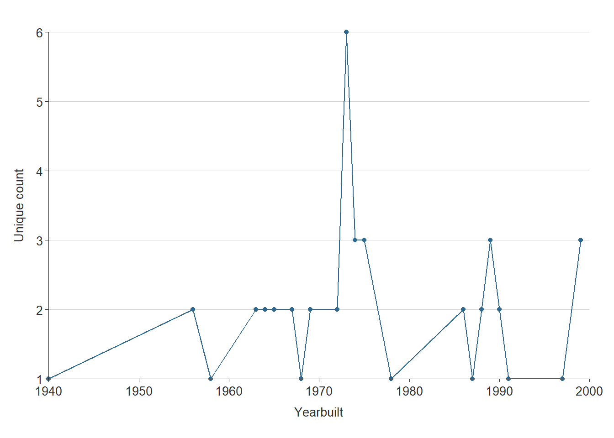

# Rental Spatial Analyis {#part-2a-2}

This section presents an analysis of the county's existing rental supply, focusing on the amount and location of rental housing units by Chesterfield County magisterial districts.


## Recent multifamily developments

The last five years have shown fluctuating multifamily development completions based on CoStar's proprietary commercial real estate database. From zero completed units in 2018 to a five year high of 1,569 units in 2020, development has been sporadic but is expected to grow significantly in the coming years. Most recent developments have consisted of low-rise buildings, offering amenities such as clubhouses, pools, and fitness centers.

As of June 2022, there were 33 existing market-rate multifamily developments that were either built in the last five years, under construction, or proposed. An additional development is a mixed-income senior rental housing project by Better Housing Coalition that was completed recently. Development in the past five years has generally been spread across the county, but only one development was completed in the Dale District.

Thirty-two percent of recent and future development has been or will be constructed in the Midlothian District. In 2023 and 2024, 3,757 new rental homes are expected to be completed --- slightly more than the number of homes completed between 2020 and 2022.

This shift in intense development can be attributed to increasing home demand in this affluent and amenity rich portion of the county. Greenfield development in the western part of the county also contributes to its attractiveness to multifamily and mixed-use developers --- providing less risk when compared to redevelopment of brownfield sites. The Midlothian area also offers convenient access to Route 288, where residents can reach major job centers like the County Government Center, or even centers outside the county, like West Creek in Henrico County.

<div class="figure">

<p class="caption">(\#fig:recent-mf)Recent multifamily developments by magisterial district</p>
</div><div class="figure">
<iframe src="maps/new_map.html" width="100%" height="500px" data-external="1" style="border:none;"></iframe>
<p class="caption">(\#fig:recent-mf)Recent multifamily developments by magisterial district</p>
</div>

*Source: CoStar Group, Inc.*

<div class="figure">

```{=html}
<div id="htmlwidget-7830f6de518e9c80aba7" style="width:100%;height:480px;" class="plotly html-widget"></div>
<script type="application/json" data-for="htmlwidget-7830f6de518e9c80aba7">{"x":{"data":[{"orientation":"v","width":0.75,"base":0,"x":[1],"y":[1329],"text":"District: Bermuda<br />Units: 1329<br />District: Bermuda<br />District: Bermuda","type":"bar","textposition":"none","marker":{"autocolorscale":false,"color":"rgba(23,190,207,1)","line":{"width":1.88976377952756,"color":"rgba(23,190,207,1)"}},"name":"Bermuda","legendgroup":"Bermuda","showlegend":true,"xaxis":"x","yaxis":"y","hoverinfo":"text","frame":null,"hoverlabel":{"align":"left"}},{"orientation":"v","width":0.75,"base":0,"x":[2],"y":[2455],"text":"District: Cloverhill<br />Units: 2455<br />District: Cloverhill<br />District: Cloverhill","type":"bar","textposition":"none","marker":{"autocolorscale":false,"color":"rgba(188,189,34,1)","line":{"width":1.88976377952756,"color":"rgba(188,189,34,1)"}},"name":"Cloverhill","legendgroup":"Cloverhill","showlegend":true,"xaxis":"x","yaxis":"y","hoverinfo":"text","frame":null,"hoverlabel":{"align":"left"}},{"orientation":"v","width":0.75,"base":0,"x":[3],"y":[230],"text":"District: Dale<br />Units:  230<br />District: Dale<br />District: Dale","type":"bar","textposition":"none","marker":{"autocolorscale":false,"color":"rgba(140,86,75,1)","line":{"width":1.88976377952756,"color":"rgba(140,86,75,1)"}},"name":"Dale","legendgroup":"Dale","showlegend":true,"xaxis":"x","yaxis":"y","hoverinfo":"text","frame":null,"hoverlabel":{"align":"left"}},{"orientation":"v","width":0.75,"base":0,"x":[4],"y":[1176],"text":"District: Matoaca<br />Units: 1176<br />District: Matoaca<br />District: Matoaca","type":"bar","textposition":"none","marker":{"autocolorscale":false,"color":"rgba(227,119,194,1)","line":{"width":1.88976377952756,"color":"rgba(227,119,194,1)"}},"name":"Matoaca","legendgroup":"Matoaca","showlegend":true,"xaxis":"x","yaxis":"y","hoverinfo":"text","frame":null,"hoverlabel":{"align":"left"}},{"orientation":"v","width":0.75,"base":0,"x":[5],"y":[3389],"text":"District: Midlothian<br />Units: 3389<br />District: Midlothian<br />District: Midlothian","type":"bar","textposition":"none","marker":{"autocolorscale":false,"color":"rgba(31,119,180,1)","line":{"width":1.88976377952756,"color":"rgba(31,119,180,1)"}},"name":"Midlothian","legendgroup":"Midlothian","showlegend":true,"xaxis":"x","yaxis":"y","hoverinfo":"text","frame":null,"hoverlabel":{"align":"left"}}],"layout":{"margin":{"t":25.2984640929846,"r":26.5670402656704,"b":39.5184723951847,"l":63.4288086342881},"plot_bgcolor":"rgba(255,255,255,1)","paper_bgcolor":"rgba(255,255,255,1)","font":{"color":"rgba(50,50,50,1)","family":"","size":13.2835201328352},"xaxis":{"domain":[0,1],"automargin":true,"type":"linear","autorange":false,"range":[0.4,5.6],"tickmode":"array","ticktext":["Bermuda","Cloverhill","Dale","Matoaca","Midlothian"],"tickvals":[1,2,3,4,5],"categoryorder":"array","categoryarray":["Bermuda","Cloverhill","Dale","Matoaca","Midlothian"],"nticks":null,"ticks":"outside","tickcolor":"rgba(50,50,50,1)","ticklen":3.65296803652968,"tickwidth":0.398505603985056,"showticklabels":true,"tickfont":{"color":"rgba(50,50,50,1)","family":"","size":13.2835201328352},"tickangle":-0,"showline":true,"linecolor":"rgba(50,50,50,1)","linewidth":0.398505603985056,"showgrid":false,"gridcolor":null,"gridwidth":0,"zeroline":false,"anchor":"y","title":{"text":"District","font":{"color":"rgba(50,50,50,1)","family":"","size":13.2835201328352}},"hoverformat":".2f"},"yaxis":{"domain":[0,1],"automargin":true,"type":"linear","autorange":false,"range":[0,3500],"tickmode":"array","ticktext":["0","500","1,000","1,500","2,000","2,500","3,000","3,500"],"tickvals":[0,500,1000,1500,2000,2500,3000,3500],"categoryorder":"array","categoryarray":["0","500","1,000","1,500","2,000","2,500","3,000","3,500"],"nticks":null,"ticks":"outside","tickcolor":"rgba(50,50,50,1)","ticklen":3.65296803652968,"tickwidth":0.398505603985056,"showticklabels":true,"tickfont":{"color":"rgba(50,50,50,1)","family":"","size":13.2835201328352},"tickangle":-0,"showline":true,"linecolor":"rgba(50,50,50,1)","linewidth":0.398505603985056,"showgrid":true,"gridcolor":"rgba(211,211,211,1)","gridwidth":0.265670402656704,"zeroline":false,"anchor":"x","title":{"text":"Units","font":{"color":"rgba(50,50,50,1)","family":"","size":13.2835201328352}},"hoverformat":".2f"},"shapes":[{"type":"rect","fillcolor":null,"line":{"color":null,"width":0,"linetype":[]},"yref":"paper","xref":"paper","x0":0,"x1":1,"y0":0,"y1":1}],"showlegend":true,"legend":{"bgcolor":"rgba(255,255,255,1)","bordercolor":"rgba(255,255,255,1)","borderwidth":1.88976377952756,"font":{"color":"rgba(50,50,50,1)","family":"","size":13.2835201328352},"title":{"text":"District","font":{"color":"rgba(50,50,50,1)","family":"","size":13.2835201328352}}},"hovermode":"closest","barmode":"relative"},"config":{"doubleClick":"reset","modeBarButtonsToAdd":["hoverclosest","hovercompare"],"showSendToCloud":false,"modeBarButtonsToRemove":["zoom2d","pan2d","zoomIn2d","zoomOut2d","autoScale2d","resetScale2d","hoverClosestCartesian","hoverCompareCartesian","sendDataToCloud","toggleHover","resetViews","toggleSpikelines","resetViewMapbox","toggleSpikelines","resetViewMapbox","lasso2d","select2d"],"displaylogo":false},"source":"A","attrs":{"61a82ba04cfd":{"x":{},"y":{},"colour":{},"fill":{},"type":"bar"}},"cur_data":"61a82ba04cfd","visdat":{"61a82ba04cfd":["function (y) ","x"]},"highlight":{"on":"plotly_click","persistent":false,"dynamic":false,"selectize":false,"opacityDim":0.2,"selected":{"opacity":1},"debounce":0},"shinyEvents":["plotly_hover","plotly_click","plotly_selected","plotly_relayout","plotly_brushed","plotly_brushing","plotly_clickannotation","plotly_doubleclick","plotly_deselect","plotly_afterplot","plotly_sunburstclick"],"base_url":"https://plot.ly"},"evals":[],"jsHooks":[]}</script>
```

<p class="caption">(\#fig:new-units)Number of recent multifamily units by magisterial district</p>
</div>

*Source: CoStar Group, Inc.*

<div class="figure">

```{=html}
<div id="htmlwidget-03bca8f2817c3d4addc0" style="width:100%;height:480px;" class="plotly html-widget"></div>
<script type="application/json" data-for="htmlwidget-03bca8f2817c3d4addc0">{"x":{"data":[{"orientation":"v","width":[0.0964285714285325,0.0964285714285325,0.0964285714285325,0.0964285714285325,0.0964285714285325,0.0964285714285325,0.0964285714285325,0.0964285714285325],"base":[0,0,0,0,0,0,0,0],"x":[2016.94642857143,2017.05357142857,2018.89285714286,2019.67857142857,2019.78571428571,2021.73214285714,2021.83928571429,2022.67857142857],"y":[166,37,385,60,276,112,201,92],"text":["Year: 2017<br />Units: 166<br />District: BERMUDA<br />District: BERMUDA","Year: 2017<br />Units:  37<br />District: BERMUDA<br />District: BERMUDA","Year: 2019<br />Units: 385<br />District: BERMUDA<br />District: BERMUDA","Year: 2020<br />Units:  60<br />District: BERMUDA<br />District: BERMUDA","Year: 2020<br />Units: 276<br />District: BERMUDA<br />District: BERMUDA","Year: 2022<br />Units: 112<br />District: BERMUDA<br />District: BERMUDA","Year: 2022<br />Units: 201<br />District: BERMUDA<br />District: BERMUDA","Year: 2023<br />Units:  92<br />District: BERMUDA<br />District: BERMUDA"],"type":"bar","textposition":"none","marker":{"autocolorscale":false,"color":"rgba(23,190,207,1)","line":{"width":1.88976377952756,"color":"rgba(23,190,207,1)"}},"name":"BERMUDA","legendgroup":"BERMUDA","showlegend":true,"xaxis":"x","yaxis":"y","hoverinfo":"text","frame":null,"hoverlabel":{"align":"left"}},{"orientation":"v","width":[0.0964285714285325,0.0964285714285325,0.0964285714285325,0.0964285714285325,0.0964285714285325,0.0964285714285325],"base":[0,0,0,0,0,0],"x":[2019,2019.89285714286,2020.89285714286,2021.94642857143,2023.89285714286,2024],"y":[271,192,200,342,750,700],"text":["Year: 2019<br />Units: 271<br />District: CLOVERHILL<br />District: CLOVERHILL","Year: 2020<br />Units: 192<br />District: CLOVERHILL<br />District: CLOVERHILL","Year: 2021<br />Units: 200<br />District: CLOVERHILL<br />District: CLOVERHILL","Year: 2022<br />Units: 342<br />District: CLOVERHILL<br />District: CLOVERHILL","Year: 2024<br />Units: 750<br />District: CLOVERHILL<br />District: CLOVERHILL","Year: 2024<br />Units: 700<br />District: CLOVERHILL<br />District: CLOVERHILL"],"type":"bar","textposition":"none","marker":{"autocolorscale":false,"color":"rgba(188,189,34,1)","line":{"width":1.88976377952756,"color":"rgba(188,189,34,1)"}},"name":"CLOVERHILL","legendgroup":"CLOVERHILL","showlegend":true,"xaxis":"x","yaxis":"y","hoverinfo":"text","frame":null,"hoverlabel":{"align":"left"}},{"orientation":"v","width":0.0964285714285325,"base":0,"x":[2021],"y":[230],"text":"Year: 2021<br />Units: 230<br />District: DALE<br />District: DALE","type":"bar","textposition":"none","marker":{"autocolorscale":false,"color":"rgba(140,86,75,1)","line":{"width":1.88976377952756,"color":"rgba(140,86,75,1)"}},"name":"DALE","legendgroup":"DALE","showlegend":true,"xaxis":"x","yaxis":"y","hoverinfo":"text","frame":null,"hoverlabel":{"align":"left"}},{"orientation":"v","width":[0.0964285714285325,0.0964285714285325,0.0964285714285325,0.0964285714285325,0.0964285714285325],"base":[0,0,0,0,0],"x":[2020,2020.10714285714,2022.05357142857,2022.16071428571,2022.26785714286],"y":[307,248,288,234,99],"text":["Year: 2020<br />Units: 307<br />District: MATOACA<br />District: MATOACA","Year: 2020<br />Units: 248<br />District: MATOACA<br />District: MATOACA","Year: 2022<br />Units: 288<br />District: MATOACA<br />District: MATOACA","Year: 2022<br />Units: 234<br />District: MATOACA<br />District: MATOACA","Year: 2022<br />Units:  99<br />District: MATOACA<br />District: MATOACA"],"type":"bar","textposition":"none","marker":{"autocolorscale":false,"color":"rgba(227,119,194,1)","line":{"width":1.88976377952756,"color":"rgba(227,119,194,1)"}},"name":"MATOACA","legendgroup":"MATOACA","showlegend":true,"xaxis":"x","yaxis":"y","hoverinfo":"text","frame":null,"hoverlabel":{"align":"left"}},{"orientation":"v","width":[0.0964285714285325,0.0964285714285325,0.0964285714285325,0.0964285714285325,0.0964285714285325,0.0964285714285325,0.0964285714285325,0.0964285714285325,0.0964285714285325,0.0964285714285325,0.0964285714285325],"base":[0,0,0,0,0,0,0,0,0,0,0],"x":[2019.10714285714,2020.21428571429,2020.32142857143,2021.10714285714,2022.78571428571,2022.89285714286,2023,2023.10714285714,2023.21428571429,2023.32142857143,2024.10714285714],"y":[238,248,238,450,212,473,275,310,450,245,250],"text":["Year: 2019<br />Units: 238<br />District: MIDLOTHIAN<br />District: MIDLOTHIAN","Year: 2020<br />Units: 248<br />District: MIDLOTHIAN<br />District: MIDLOTHIAN","Year: 2020<br />Units: 238<br />District: MIDLOTHIAN<br />District: MIDLOTHIAN","Year: 2021<br />Units: 450<br />District: MIDLOTHIAN<br />District: MIDLOTHIAN","Year: 2023<br />Units: 212<br />District: MIDLOTHIAN<br />District: MIDLOTHIAN","Year: 2023<br />Units: 473<br />District: MIDLOTHIAN<br />District: MIDLOTHIAN","Year: 2023<br />Units: 275<br />District: MIDLOTHIAN<br />District: MIDLOTHIAN","Year: 2023<br />Units: 310<br />District: MIDLOTHIAN<br />District: MIDLOTHIAN","Year: 2023<br />Units: 450<br />District: MIDLOTHIAN<br />District: MIDLOTHIAN","Year: 2023<br />Units: 245<br />District: MIDLOTHIAN<br />District: MIDLOTHIAN","Year: 2024<br />Units: 250<br />District: MIDLOTHIAN<br />District: MIDLOTHIAN"],"type":"bar","textposition":"none","marker":{"autocolorscale":false,"color":"rgba(31,119,180,1)","line":{"width":1.88976377952756,"color":"rgba(31,119,180,1)"}},"name":"MIDLOTHIAN","legendgroup":"MIDLOTHIAN","showlegend":true,"xaxis":"x","yaxis":"y","hoverinfo":"text","frame":null,"hoverlabel":{"align":"left"}}],"layout":{"margin":{"t":25.2984640929846,"r":26.5670402656704,"b":39.5184723951847,"l":50.1452885014529},"plot_bgcolor":"rgba(255,255,255,1)","paper_bgcolor":"rgba(255,255,255,1)","font":{"color":"rgba(50,50,50,1)","family":"","size":13.2835201328352},"xaxis":{"domain":[0,1],"automargin":true,"type":"linear","autorange":false,"range":[2016.89821428571,2024.15535714286],"tickmode":"array","ticktext":["2017","2018","2019","2020","2021","2022","2023","2024"],"tickvals":[2017,2018,2019,2020,2021,2022,2023,2024],"categoryorder":"array","categoryarray":["2017","2018","2019","2020","2021","2022","2023","2024"],"nticks":null,"ticks":"outside","tickcolor":"rgba(50,50,50,1)","ticklen":3.65296803652968,"tickwidth":0.398505603985056,"showticklabels":true,"tickfont":{"color":"rgba(50,50,50,1)","family":"","size":13.2835201328352},"tickangle":-0,"showline":true,"linecolor":"rgba(50,50,50,1)","linewidth":0.398505603985056,"showgrid":false,"gridcolor":null,"gridwidth":0,"zeroline":false,"anchor":"y","title":{"text":"Year","font":{"color":"rgba(50,50,50,1)","family":"","size":13.2835201328352}},"hoverformat":".2f"},"yaxis":{"domain":[0,1],"automargin":true,"type":"linear","autorange":false,"range":[0,800],"tickmode":"array","ticktext":["0","200","400","600","800"],"tickvals":[0,200,400,600,800],"categoryorder":"array","categoryarray":["0","200","400","600","800"],"nticks":null,"ticks":"outside","tickcolor":"rgba(50,50,50,1)","ticklen":3.65296803652968,"tickwidth":0.398505603985056,"showticklabels":true,"tickfont":{"color":"rgba(50,50,50,1)","family":"","size":13.2835201328352},"tickangle":-0,"showline":true,"linecolor":"rgba(50,50,50,1)","linewidth":0.398505603985056,"showgrid":true,"gridcolor":"rgba(211,211,211,1)","gridwidth":0.265670402656704,"zeroline":false,"anchor":"x","title":{"text":"Units","font":{"color":"rgba(50,50,50,1)","family":"","size":13.2835201328352}},"hoverformat":".2f"},"shapes":[{"type":"rect","fillcolor":null,"line":{"color":null,"width":0,"linetype":[]},"yref":"paper","xref":"paper","x0":0,"x1":1,"y0":0,"y1":1}],"showlegend":true,"legend":{"bgcolor":"rgba(255,255,255,1)","bordercolor":"rgba(255,255,255,1)","borderwidth":1.88976377952756,"font":{"color":"rgba(50,50,50,1)","family":"","size":13.2835201328352},"title":{"text":"District","font":{"color":"rgba(50,50,50,1)","family":"","size":13.2835201328352}}},"hovermode":"closest","barmode":"relative"},"config":{"doubleClick":"reset","modeBarButtonsToAdd":["hoverclosest","hovercompare"],"showSendToCloud":false,"modeBarButtonsToRemove":["zoom2d","pan2d","zoomIn2d","zoomOut2d","autoScale2d","resetScale2d","hoverClosestCartesian","hoverCompareCartesian","sendDataToCloud","toggleHover","resetViews","toggleSpikelines","resetViewMapbox","toggleSpikelines","resetViewMapbox","lasso2d","select2d"],"displaylogo":false},"source":"A","attrs":{"61a86ae53eb3":{"x":{},"y":{},"colour":{},"fill":{},"type":"bar"}},"cur_data":"61a86ae53eb3","visdat":{"61a86ae53eb3":["function (y) ","x"]},"highlight":{"on":"plotly_click","persistent":false,"dynamic":false,"selectize":false,"opacityDim":0.2,"selected":{"opacity":1},"debounce":0},"shinyEvents":["plotly_hover","plotly_click","plotly_selected","plotly_relayout","plotly_brushed","plotly_brushing","plotly_clickannotation","plotly_doubleclick","plotly_deselect","plotly_afterplot","plotly_sunburstclick"],"base_url":"https://plot.ly"},"evals":[],"jsHooks":[]}</script>
```

<p class="caption">(\#fig:units-time)Timeline of recent multifamily units by magisterial district</p>
</div>

*Source: CoStar Group, Inc.*


*Source: CoStar Group, Inc.*

## Market affordable rental

Market affordable rental housing is spread throughout each district of Chesterfield County. However, the majority of market affordable rentals lie along the city-county border. This is a typical trend in most metropolitan areas, wherein early suburban development in the mid- to late 20th century led to small garden apartment development on the outskirts of major cities. But these "inner-ring" suburbs are growing rapidly, especially with more and more diverse populations.[^part-2a-2-1]

[^part-2a-2-1]: Hanlon, Bernadette. (2009). "A Typologoy of Inner-Ring Suburbs: Class, Race, and Ethnicity in U.S. Suburbia." City and Community.2009;8(3):221-246. <doi:10.1111/j.1540-6040.2009.01287.x>

The Bermuda District, which includes the entirety of the Route One corridor, contains the largest number of market affordable rental properties, specifically manufactured home communities (8 from the city border down to Route 10). The only other district with manufactured home communities present is the Midlothian District with an estimated 275 homes across two properties --- the majority of which are located in Suburban Village.

Market affordable rentals are largely located in garden style apartments though. Garden style apartments are communities made up of small buildings that are at least two stories high, but no higher than four stories. This style of apartment was hugely popular in the 1960s and remained so throughout the 1970s and 1980s.[^part-2a-2-2]

[^part-2a-2-2]: Johnson, Emily. (2022). <https://rejournals.com/suburban-garden-style-apartments-are-2022s-comeback-kid/>

The largest of these communities is Crystal Lakes Apartments is located along Chippenham Parkway --- with 716 apartment homes. Built in 1967, the property recently underwent renovations in 2020. Subsequently, the property saw a 6 percent increase in average market rent per unit from 2019 to 2020.

These older garden style communities may have some amenities like a clubhouse, playgrounds, or fitness centers, but they are often outdated. Twenty-six of the 61 market affordable properties were built in the 1960s and 1970s. Only eight of these properties have reported a renovation; most of these renovations having been completed in the last seven years.

Preserving market affordable rentals, especially near the city-county border and along transit lines, helps support low- to moderate-income renters. McKinsey & Company, a global management consulting firm, has even focused research on preserving such a valuable asset of local housing stock.[^part-2a-2-3] 

[^part-2a-2-3]: Kling et al. <https://www.mckinsey.com/industries/public-and-social-sector/our-insights/preserving-the-largest-and-most-at-risk-supply-of-affordable-housing>

<div class="figure">
<iframe src="maps/noah_map_dist.html" width="100%" height="500px" data-external="1" style="border:none;"></iframe>
<p class="caption">(\#fig:noah-map)Map of market affordable units by magisterial district</p>
</div>

*Source: CoStar Group, Inc.*

<div class="figure">

```{=html}
<div id="htmlwidget-dc4e7fedc93fbfb92b11" style="width:100%;height:480px;" class="plotly html-widget"></div>
<script type="application/json" data-for="htmlwidget-dc4e7fedc93fbfb92b11">{"x":{"data":[{"orientation":"v","width":0.75,"base":0,"x":[1],"y":[3115],"text":"District: Bermuda<br />Units: 3115<br />District: Bermuda<br />District: Bermuda","type":"bar","textposition":"none","marker":{"autocolorscale":false,"color":"rgba(23,190,207,1)","line":{"width":1.88976377952756,"color":"rgba(23,190,207,1)"}},"name":"Bermuda","legendgroup":"Bermuda","showlegend":true,"xaxis":"x","yaxis":"y","hoverinfo":"text","frame":null,"hoverlabel":{"align":"left"}},{"orientation":"v","width":0.75,"base":0,"x":[2],"y":[1458],"text":"District: Cloverhill<br />Units: 1458<br />District: Cloverhill<br />District: Cloverhill","type":"bar","textposition":"none","marker":{"autocolorscale":false,"color":"rgba(188,189,34,1)","line":{"width":1.88976377952756,"color":"rgba(188,189,34,1)"}},"name":"Cloverhill","legendgroup":"Cloverhill","showlegend":true,"xaxis":"x","yaxis":"y","hoverinfo":"text","frame":null,"hoverlabel":{"align":"left"}},{"orientation":"v","width":0.75,"base":0,"x":[3],"y":[2615],"text":"District: Dale<br />Units: 2615<br />District: Dale<br />District: Dale","type":"bar","textposition":"none","marker":{"autocolorscale":false,"color":"rgba(140,86,75,1)","line":{"width":1.88976377952756,"color":"rgba(140,86,75,1)"}},"name":"Dale","legendgroup":"Dale","showlegend":true,"xaxis":"x","yaxis":"y","hoverinfo":"text","frame":null,"hoverlabel":{"align":"left"}},{"orientation":"v","width":0.75,"base":0,"x":[4],"y":[1267],"text":"District: Matoaca<br />Units: 1267<br />District: Matoaca<br />District: Matoaca","type":"bar","textposition":"none","marker":{"autocolorscale":false,"color":"rgba(227,119,194,1)","line":{"width":1.88976377952756,"color":"rgba(227,119,194,1)"}},"name":"Matoaca","legendgroup":"Matoaca","showlegend":true,"xaxis":"x","yaxis":"y","hoverinfo":"text","frame":null,"hoverlabel":{"align":"left"}},{"orientation":"v","width":0.75,"base":0,"x":[5],"y":[2692],"text":"District: Midlothian<br />Units: 2692<br />District: Midlothian<br />District: Midlothian","type":"bar","textposition":"none","marker":{"autocolorscale":false,"color":"rgba(31,119,180,1)","line":{"width":1.88976377952756,"color":"rgba(31,119,180,1)"}},"name":"Midlothian","legendgroup":"Midlothian","showlegend":true,"xaxis":"x","yaxis":"y","hoverinfo":"text","frame":null,"hoverlabel":{"align":"left"}}],"layout":{"margin":{"t":25.2984640929846,"r":26.5670402656704,"b":39.5184723951847,"l":63.4288086342881},"plot_bgcolor":"rgba(255,255,255,1)","paper_bgcolor":"rgba(255,255,255,1)","font":{"color":"rgba(50,50,50,1)","family":"","size":13.2835201328352},"xaxis":{"domain":[0,1],"automargin":true,"type":"linear","autorange":false,"range":[0.4,5.6],"tickmode":"array","ticktext":["Bermuda","Cloverhill","Dale","Matoaca","Midlothian"],"tickvals":[1,2,3,4,5],"categoryorder":"array","categoryarray":["Bermuda","Cloverhill","Dale","Matoaca","Midlothian"],"nticks":null,"ticks":"outside","tickcolor":"rgba(50,50,50,1)","ticklen":3.65296803652968,"tickwidth":0.398505603985056,"showticklabels":true,"tickfont":{"color":"rgba(50,50,50,1)","family":"","size":13.2835201328352},"tickangle":-0,"showline":true,"linecolor":"rgba(50,50,50,1)","linewidth":0.398505603985056,"showgrid":false,"gridcolor":null,"gridwidth":0,"zeroline":false,"anchor":"y","title":{"text":"District","font":{"color":"rgba(50,50,50,1)","family":"","size":13.2835201328352}},"hoverformat":".2f"},"yaxis":{"domain":[0,1],"automargin":true,"type":"linear","autorange":false,"range":[0,3500],"tickmode":"array","ticktext":["0","500","1,000","1,500","2,000","2,500","3,000","3,500"],"tickvals":[0,500,1000,1500,2000,2500,3000,3500],"categoryorder":"array","categoryarray":["0","500","1,000","1,500","2,000","2,500","3,000","3,500"],"nticks":null,"ticks":"outside","tickcolor":"rgba(50,50,50,1)","ticklen":3.65296803652968,"tickwidth":0.398505603985056,"showticklabels":true,"tickfont":{"color":"rgba(50,50,50,1)","family":"","size":13.2835201328352},"tickangle":-0,"showline":true,"linecolor":"rgba(50,50,50,1)","linewidth":0.398505603985056,"showgrid":true,"gridcolor":"rgba(211,211,211,1)","gridwidth":0.265670402656704,"zeroline":false,"anchor":"x","title":{"text":"Units","font":{"color":"rgba(50,50,50,1)","family":"","size":13.2835201328352}},"hoverformat":".2f"},"shapes":[{"type":"rect","fillcolor":null,"line":{"color":null,"width":0,"linetype":[]},"yref":"paper","xref":"paper","x0":0,"x1":1,"y0":0,"y1":1}],"showlegend":true,"legend":{"bgcolor":"rgba(255,255,255,1)","bordercolor":"rgba(255,255,255,1)","borderwidth":1.88976377952756,"font":{"color":"rgba(50,50,50,1)","family":"","size":13.2835201328352},"title":{"text":"District","font":{"color":"rgba(50,50,50,1)","family":"","size":13.2835201328352}}},"hovermode":"closest","barmode":"relative"},"config":{"doubleClick":"reset","modeBarButtonsToAdd":["hoverclosest","hovercompare"],"showSendToCloud":false,"modeBarButtonsToRemove":["zoom2d","pan2d","zoomIn2d","zoomOut2d","autoScale2d","resetScale2d","hoverClosestCartesian","hoverCompareCartesian","sendDataToCloud","toggleHover","resetViews","toggleSpikelines","resetViewMapbox","toggleSpikelines","resetViewMapbox","lasso2d","select2d"],"displaylogo":false},"source":"A","attrs":{"61a87a98c4e":{"x":{},"y":{},"colour":{},"fill":{},"type":"bar"}},"cur_data":"61a87a98c4e","visdat":{"61a87a98c4e":["function (y) ","x"]},"highlight":{"on":"plotly_click","persistent":false,"dynamic":false,"selectize":false,"opacityDim":0.2,"selected":{"opacity":1},"debounce":0},"shinyEvents":["plotly_hover","plotly_click","plotly_selected","plotly_relayout","plotly_brushed","plotly_brushing","plotly_clickannotation","plotly_doubleclick","plotly_deselect","plotly_afterplot","plotly_sunburstclick"],"base_url":"https://plot.ly"},"evals":[],"jsHooks":[]}</script>
```

<p class="caption">(\#fig:noah-units)Total market affordable homes by magisterial district</p>
</div>

*Source: CoStar Group, Inc. and the Manufactured Housing Community Coalition of Virginia.*

<div class="figure">

```{=html}
<div id="htmlwidget-a2775d9ac856b7c3222d" style="width:100%;height:480px;" class="plotly html-widget"></div>
<script type="application/json" data-for="htmlwidget-a2775d9ac856b7c3222d">{"x":{"data":[{"orientation":"v","width":[0.75,0.75],"base":[1899,2417],"x":[1,5],"y":[1216,275],"text":["MagDistName: BERMUDA<br />Units: 1216<br />type: Manufactured Home Park<br />type: Manufactured Home Park","MagDistName: MIDLOTHIAN<br />Units:  275<br />type: Manufactured Home Park<br />type: Manufactured Home Park"],"type":"bar","textposition":"none","marker":{"autocolorscale":false,"color":"rgba(23,190,207,1)","line":{"width":1.88976377952756,"color":"rgba(23,190,207,1)"}},"name":"Manufactured Home Park","legendgroup":"Manufactured Home Park","showlegend":true,"xaxis":"x","yaxis":"y","hoverinfo":"text","frame":null,"hoverlabel":{"align":"left"}},{"orientation":"v","width":[0.75,0.75,0.75,0.75,0.75],"base":[0,0,0,0,0],"x":[1,2,3,4,5],"y":[1899,1458,2615,1267,2417],"text":["MagDistName: BERMUDA<br />Units: 1899<br />type: Multifamily<br />type: Multifamily","MagDistName: CLOVERHILL<br />Units: 1458<br />type: Multifamily<br />type: Multifamily","MagDistName: DALE<br />Units: 2615<br />type: Multifamily<br />type: Multifamily","MagDistName: MATOACA<br />Units: 1267<br />type: Multifamily<br />type: Multifamily","MagDistName: MIDLOTHIAN<br />Units: 2417<br />type: Multifamily<br />type: Multifamily"],"type":"bar","textposition":"none","marker":{"autocolorscale":false,"color":"rgba(188,189,34,1)","line":{"width":1.88976377952756,"color":"rgba(188,189,34,1)"}},"name":"Multifamily","legendgroup":"Multifamily","showlegend":true,"xaxis":"x","yaxis":"y","hoverinfo":"text","frame":null,"hoverlabel":{"align":"left"}}],"layout":{"margin":{"t":25.2984640929846,"r":26.5670402656704,"b":39.5184723951847,"l":63.4288086342881},"plot_bgcolor":"rgba(255,255,255,1)","paper_bgcolor":"rgba(255,255,255,1)","font":{"color":"rgba(50,50,50,1)","family":"","size":13.2835201328352},"xaxis":{"domain":[0,1],"automargin":true,"type":"linear","autorange":false,"range":[0.4,5.6],"tickmode":"array","ticktext":["Bermuda","Cloverhill","Dale","Matoaca","Midlothian"],"tickvals":[1,2,3,4,5],"categoryorder":"array","categoryarray":["Bermuda","Cloverhill","Dale","Matoaca","Midlothian"],"nticks":null,"ticks":"outside","tickcolor":"rgba(50,50,50,1)","ticklen":3.65296803652968,"tickwidth":0.398505603985056,"showticklabels":true,"tickfont":{"color":"rgba(50,50,50,1)","family":"","size":13.2835201328352},"tickangle":-0,"showline":true,"linecolor":"rgba(50,50,50,1)","linewidth":0.398505603985056,"showgrid":false,"gridcolor":null,"gridwidth":0,"zeroline":false,"anchor":"y","title":{"text":"Mag dist name","font":{"color":"rgba(50,50,50,1)","family":"","size":13.2835201328352}},"hoverformat":".2f"},"yaxis":{"domain":[0,1],"automargin":true,"type":"linear","autorange":false,"range":[0,3500],"tickmode":"array","ticktext":["0","500","1,000","1,500","2,000","2,500","3,000","3,500"],"tickvals":[0,500,1000,1500,2000,2500,3000,3500],"categoryorder":"array","categoryarray":["0","500","1,000","1,500","2,000","2,500","3,000","3,500"],"nticks":null,"ticks":"outside","tickcolor":"rgba(50,50,50,1)","ticklen":3.65296803652968,"tickwidth":0.398505603985056,"showticklabels":true,"tickfont":{"color":"rgba(50,50,50,1)","family":"","size":13.2835201328352},"tickangle":-0,"showline":true,"linecolor":"rgba(50,50,50,1)","linewidth":0.398505603985056,"showgrid":true,"gridcolor":"rgba(211,211,211,1)","gridwidth":0.265670402656704,"zeroline":false,"anchor":"x","title":{"text":"Units","font":{"color":"rgba(50,50,50,1)","family":"","size":13.2835201328352}},"hoverformat":".2f"},"shapes":[{"type":"rect","fillcolor":null,"line":{"color":null,"width":0,"linetype":[]},"yref":"paper","xref":"paper","x0":0,"x1":1,"y0":0,"y1":1}],"showlegend":true,"legend":{"bgcolor":"rgba(255,255,255,1)","bordercolor":"rgba(255,255,255,1)","borderwidth":1.88976377952756,"font":{"color":"rgba(50,50,50,1)","family":"","size":13.2835201328352},"title":{"text":"Type","font":{"color":"rgba(50,50,50,1)","family":"","size":13.2835201328352}}},"hovermode":"closest","barmode":"relative"},"config":{"doubleClick":"reset","modeBarButtonsToAdd":["hoverclosest","hovercompare"],"showSendToCloud":false,"modeBarButtonsToRemove":["zoom2d","pan2d","zoomIn2d","zoomOut2d","autoScale2d","resetScale2d","hoverClosestCartesian","hoverCompareCartesian","sendDataToCloud","toggleHover","resetViews","toggleSpikelines","resetViewMapbox","toggleSpikelines","resetViewMapbox","lasso2d","select2d"],"displaylogo":false},"source":"A","attrs":{"61a81f217a9b":{"x":{},"y":{},"colour":{},"fill":{},"type":"bar"}},"cur_data":"61a81f217a9b","visdat":{"61a81f217a9b":["function (y) ","x"]},"highlight":{"on":"plotly_click","persistent":false,"dynamic":false,"selectize":false,"opacityDim":0.2,"selected":{"opacity":1},"debounce":0},"shinyEvents":["plotly_hover","plotly_click","plotly_selected","plotly_relayout","plotly_brushed","plotly_brushing","plotly_clickannotation","plotly_doubleclick","plotly_deselect","plotly_afterplot","plotly_sunburstclick"],"base_url":"https://plot.ly"},"evals":[],"jsHooks":[]}</script>
```

<p class="caption">(\#fig:noah-type)Type of market affordable housing by magisterial district</p>
</div>

*Source: CoStar Group, Inc. and the Manufactured Housing Community Coalition of Virginia.*

<div class="figure">

<p class="caption">(\#fig:noah-typemap)Map of market affordable housing by type</p>
</div>

*Source: CoStar Group, Inc. and the Manufactured Housing Community Coalition of Virginia.*

## Affordable rental

Rental housing supported by federal affordable housing programs is located in each Chesterfield County district. As of early 2022, the Bermuda District contains the most affordable housing units --- with roughly 1,622 homes across 14 different buildings. The Dale District compares the second most federally-supported rental housing with 881 homes --- nearly half that of the Bermuda District. The location of subsidized housing in these areas is largely related to the provisions of federal programs like the Low-Income Housing Tax Credit program that favor development in [Qualified Census Tracts (QCTs)](https://www.huduser.gov/portal/datasets/qct.html) and [Difficult Development Areas (DDAs)](https://www.huduser.gov/portal/datasets/qct.html).

<div class="figure">
<iframe src="maps/aff_map.html" width="100%" height="500px" data-external="1" style="border:none;"></iframe>
<p class="caption">(\#fig:affordable-map)Affordable housing by magisterial district</p>
</div>

*Source: National Housing Preservation Database*

The bulk of affordable rental housing is supported by the Low-Income Housing Tax Credit program --- 2,312 rental homes. Significant research has been doing on the placement of LIHTC developments and their impact on surrounding communities. A review of these studies found that "property value increased when LIHTC developments are built in low-income areas" and furthermore, decreases in crime are associated with LIHTC development.[^part-2a-2-4] Even the location of LIHTC development in high opportunity areas has proven to have positive impacts.[^part-2a-2-5]

[^part-2a-2-4]: Keri-Nicole Dillman, Keren Mertens Horn & Ann Verrilli (2017) The What, Where, and When of Place-Based Housing Policy's Neighborhood Effects, Housing Policy Debate, 27:2, 282-305, DOI: 10.1080/10511482.2016.1172103

[^part-2a-2-5]: *Ibid*

<div class="figure">

```{=html}
<div id="htmlwidget-e52b319eda74e8df88c5" style="width:100%;height:480px;" class="plotly html-widget"></div>
<script type="application/json" data-for="htmlwidget-e52b319eda74e8df88c5">{"x":{"data":[{"orientation":"v","width":0.9,"base":1330,"x":[1],"y":[292],"text":"MagDistName: BERMUDA<br />assisted_units: 292<br />subsidy_name: HUD Insured","type":"bar","textposition":"none","marker":{"autocolorscale":false,"color":"rgba(248,118,109,1)","line":{"width":1.88976377952756,"color":"transparent"}},"name":"HUD Insured","legendgroup":"HUD Insured","showlegend":true,"xaxis":"x","yaxis":"y","hoverinfo":"text","frame":null,"hoverlabel":{"align":"left"}},{"orientation":"v","width":[0.9,0.9,0.9,0.9,0.9,0.9,0.9,0.9,0.9,0.9,0.9,0.9,0.9,0.9,0.9,0.9,0.9,0.9,0.9,0.9,0.9],"base":[10,102,0,204,194,263,326,312,456,368,564,686,560,592,672,812,856,70,981,1131,1257],"x":[2,3,5,3,1,1,1,3,3,1,3,3,1,1,1,3,1,5,1,1,1],"y":[214,102,70,108,69,63,42,144,108,192,122,126,32,80,184,69,125,113,150,126,73],"text":["MagDistName: CLOVERHILL<br />assisted_units: 214<br />subsidy_name: LIHTC","MagDistName: DALE<br />assisted_units: 102<br />subsidy_name: LIHTC","MagDistName: MIDLOTHIAN<br />assisted_units:  70<br />subsidy_name: LIHTC","MagDistName: DALE<br />assisted_units: 108<br />subsidy_name: LIHTC","MagDistName: BERMUDA<br />assisted_units:  69<br />subsidy_name: LIHTC","MagDistName: BERMUDA<br />assisted_units:  63<br />subsidy_name: LIHTC","MagDistName: BERMUDA<br />assisted_units:  42<br />subsidy_name: LIHTC","MagDistName: DALE<br />assisted_units: 144<br />subsidy_name: LIHTC","MagDistName: DALE<br />assisted_units: 108<br />subsidy_name: LIHTC","MagDistName: BERMUDA<br />assisted_units: 192<br />subsidy_name: LIHTC","MagDistName: DALE<br />assisted_units: 122<br />subsidy_name: LIHTC","MagDistName: DALE<br />assisted_units: 126<br />subsidy_name: LIHTC","MagDistName: BERMUDA<br />assisted_units:  32<br />subsidy_name: LIHTC","MagDistName: BERMUDA<br />assisted_units:  80<br />subsidy_name: LIHTC","MagDistName: BERMUDA<br />assisted_units: 184<br />subsidy_name: LIHTC","MagDistName: DALE<br />assisted_units:  69<br />subsidy_name: LIHTC","MagDistName: BERMUDA<br />assisted_units: 125<br />subsidy_name: LIHTC","MagDistName: MIDLOTHIAN<br />assisted_units: 113<br />subsidy_name: LIHTC","MagDistName: BERMUDA<br />assisted_units: 150<br />subsidy_name: LIHTC","MagDistName: BERMUDA<br />assisted_units: 126<br />subsidy_name: LIHTC","MagDistName: BERMUDA<br />assisted_units:  73<br />subsidy_name: LIHTC"],"type":"bar","textposition":"none","marker":{"autocolorscale":false,"color":"rgba(124,174,0,1)","line":{"width":1.88976377952756,"color":"transparent"}},"name":"LIHTC","legendgroup":"LIHTC","showlegend":true,"xaxis":"x","yaxis":"y","hoverinfo":"text","frame":null,"hoverlabel":{"align":"left"}},{"orientation":"v","width":0.9,"base":15,"x":[4],"y":[15],"text":"MagDistName: MATOACA<br />assisted_units:  15<br />subsidy_name: Section 202","type":"bar","textposition":"none","marker":{"autocolorscale":false,"color":"rgba(0,191,196,1)","line":{"width":1.88976377952756,"color":"transparent"}},"name":"Section 202","legendgroup":"Section 202","showlegend":true,"xaxis":"x","yaxis":"y","hoverinfo":"text","frame":null,"hoverlabel":{"align":"left"}},{"orientation":"v","width":[0.9,0.9,0.9,0.9,0.9,0.9,0.9,0.9,0.9,0.9,0.9],"base":[0,0,4,0,82,0,7,87,191,95,98],"x":[1,2,2,3,3,4,2,3,1,3,3],"y":[191,4,3,82,5,15,3,8,3,3,4],"text":["MagDistName: BERMUDA<br />assisted_units: 191<br />subsidy_name: Section 8","MagDistName: CLOVERHILL<br />assisted_units:   4<br />subsidy_name: Section 8","MagDistName: CLOVERHILL<br />assisted_units:   3<br />subsidy_name: Section 8","MagDistName: DALE<br />assisted_units:  82<br />subsidy_name: Section 8","MagDistName: DALE<br />assisted_units:   5<br />subsidy_name: Section 8","MagDistName: MATOACA<br />assisted_units:  15<br />subsidy_name: Section 8","MagDistName: CLOVERHILL<br />assisted_units:   3<br />subsidy_name: Section 8","MagDistName: DALE<br />assisted_units:   8<br />subsidy_name: Section 8","MagDistName: BERMUDA<br />assisted_units:   3<br />subsidy_name: Section 8","MagDistName: DALE<br />assisted_units:   3<br />subsidy_name: Section 8","MagDistName: DALE<br />assisted_units:   4<br />subsidy_name: Section 8"],"type":"bar","textposition":"none","marker":{"autocolorscale":false,"color":"rgba(199,124,255,1)","line":{"width":1.88976377952756,"color":"transparent"}},"name":"Section 8","legendgroup":"Section 8","showlegend":true,"xaxis":"x","yaxis":"y","hoverinfo":"text","frame":null,"hoverlabel":{"align":"left"}}],"layout":{"margin":{"t":26.2283105022831,"r":7.30593607305936,"b":40.1826484018265,"l":48.9497716894977},"plot_bgcolor":"rgba(235,235,235,1)","paper_bgcolor":"rgba(255,255,255,1)","font":{"color":"rgba(0,0,0,1)","family":"","size":14.6118721461187},"xaxis":{"domain":[0,1],"automargin":true,"type":"linear","autorange":false,"range":[0.4,5.6],"tickmode":"array","ticktext":["BERMUDA","CLOVERHILL","DALE","MATOACA","MIDLOTHIAN"],"tickvals":[1,2,3,4,5],"categoryorder":"array","categoryarray":["BERMUDA","CLOVERHILL","DALE","MATOACA","MIDLOTHIAN"],"nticks":null,"ticks":"outside","tickcolor":"rgba(51,51,51,1)","ticklen":3.65296803652968,"tickwidth":0.66417600664176,"showticklabels":true,"tickfont":{"color":"rgba(77,77,77,1)","family":"","size":11.689497716895},"tickangle":-0,"showline":false,"linecolor":null,"linewidth":0,"showgrid":true,"gridcolor":"rgba(255,255,255,1)","gridwidth":0.66417600664176,"zeroline":false,"anchor":"y","title":{"text":"MagDistName","font":{"color":"rgba(0,0,0,1)","family":"","size":14.6118721461187}},"hoverformat":".2f"},"yaxis":{"domain":[0,1],"automargin":true,"type":"linear","autorange":false,"range":[-81.1,1703.1],"tickmode":"array","ticktext":["0","500","1000","1500"],"tickvals":[0,500,1000,1500],"categoryorder":"array","categoryarray":["0","500","1000","1500"],"nticks":null,"ticks":"outside","tickcolor":"rgba(51,51,51,1)","ticklen":3.65296803652968,"tickwidth":0.66417600664176,"showticklabels":true,"tickfont":{"color":"rgba(77,77,77,1)","family":"","size":11.689497716895},"tickangle":-0,"showline":false,"linecolor":null,"linewidth":0,"showgrid":true,"gridcolor":"rgba(255,255,255,1)","gridwidth":0.66417600664176,"zeroline":false,"anchor":"x","title":{"text":"assisted_units","font":{"color":"rgba(0,0,0,1)","family":"","size":14.6118721461187}},"hoverformat":".2f"},"shapes":[{"type":"rect","fillcolor":null,"line":{"color":null,"width":0,"linetype":[]},"yref":"paper","xref":"paper","x0":0,"x1":1,"y0":0,"y1":1}],"showlegend":true,"legend":{"bgcolor":"rgba(255,255,255,1)","bordercolor":"transparent","borderwidth":1.88976377952756,"font":{"color":"rgba(0,0,0,1)","family":"","size":11.689497716895},"title":{"text":"subsidy_name","font":{"color":"rgba(0,0,0,1)","family":"","size":14.6118721461187}}},"hovermode":"closest","barmode":"relative"},"config":{"doubleClick":"reset","modeBarButtonsToAdd":["hoverclosest","hovercompare"],"showSendToCloud":false,"modeBarButtonsToRemove":["zoom2d","pan2d","zoomIn2d","zoomOut2d","autoScale2d","resetScale2d","hoverClosestCartesian","hoverCompareCartesian","sendDataToCloud","toggleHover","resetViews","toggleSpikelines","resetViewMapbox","toggleSpikelines","resetViewMapbox","lasso2d","select2d"],"displaylogo":false},"source":"A","attrs":{"61a8d2e3745":{"x":{},"y":{},"fill":{},"type":"bar"}},"cur_data":"61a8d2e3745","visdat":{"61a8d2e3745":["function (y) ","x"]},"highlight":{"on":"plotly_click","persistent":false,"dynamic":false,"selectize":false,"opacityDim":0.2,"selected":{"opacity":1},"debounce":0},"shinyEvents":["plotly_hover","plotly_click","plotly_selected","plotly_relayout","plotly_brushed","plotly_brushing","plotly_clickannotation","plotly_doubleclick","plotly_deselect","plotly_afterplot","plotly_sunburstclick"],"base_url":"https://plot.ly"},"evals":[],"jsHooks":[]}</script>
```

<p class="caption">(\#fig:aff-type)Subsidy type by magisterial district</p>
</div>

*Source: National Housing Preservation Database*

LIHTC in the County has largely been developed by for profit developers with only one non-profit developer in the county, Better Housing Coalition (BHC). BHC, one of the Richmond region's largest nonprofit developers of affordable housing, has concentrated much of their work along Route One --- where they first developed their first phase of Winchester Green townhomes in 1999.[^part-2a-2-6] Since 1999, Better Housing Coalition has continued to phase development with Market Square and will continue develop on adjacent parcels with Winchester Forest.

[^part-2a-2-6]: Phase 1 of Winchester Greens was financed by a \$5.8 million bond issued by the Chesterfield County Industrial Development Authority, \$13.8 million from HUD, and \$800,000 in Community Development Block Grant from Chesterfield County.

Programs like LIHTC have a time frame for affordability restrictions. For LIHTC in Virginia, like many other states, there is a 30 year commitment to affordability, but only a 15 year compliance period, wherein property owners can increase rents. By 2040, the majority of existing LIHTC housing (1,984 homes) will be outside the 30 year commitment period. Nonprofit developers will often seek new allocation of tax credits before their commitment period ends, but there is often little incentive for for-profit developers to maintain affordability restrictions past the compliance period.

LIHTC developments in the Bermuda and Dale Districts are set to face the end of the affordability commitment period before 2040, but Bermuda District LIHTC properties are largely nonprofit owned and managed --- therefore, less likely at risk of loss. But Dale District LIHTC properties could face significant risk of exiting from the affordable housing stock.

<div class="figure">

```{=html}
<div id="htmlwidget-cc499db3158985a12229" style="width:100%;height:480px;" class="plotly html-widget"></div>
<script type="application/json" data-for="htmlwidget-cc499db3158985a12229">{"x":{"data":[{"orientation":"v","width":[0.75,0.75,0.75,0.75,0.75,0.75,0.75,0.75,0.75,0.75,0.75],"base":[122,322,0,0,191,0,223,407,69,0,42],"x":[2036,2034,2035,2029,2036,2047,2036,2036,2033,2028,2035],"y":[69,63,42,192,32,80,184,125,150,126,73],"text":["end_date: 2036<br />assisted_units:  69<br />MagDistName: BERMUDA<br />MagDistName: BERMUDA","end_date: 2034<br />assisted_units:  63<br />MagDistName: BERMUDA<br />MagDistName: BERMUDA","end_date: 2035<br />assisted_units:  42<br />MagDistName: BERMUDA<br />MagDistName: BERMUDA","end_date: 2029<br />assisted_units: 192<br />MagDistName: BERMUDA<br />MagDistName: BERMUDA","end_date: 2036<br />assisted_units:  32<br />MagDistName: BERMUDA<br />MagDistName: BERMUDA","end_date: 2047<br />assisted_units:  80<br />MagDistName: BERMUDA<br />MagDistName: BERMUDA","end_date: 2036<br />assisted_units: 184<br />MagDistName: BERMUDA<br />MagDistName: BERMUDA","end_date: 2036<br />assisted_units: 125<br />MagDistName: BERMUDA<br />MagDistName: BERMUDA","end_date: 2033<br />assisted_units: 150<br />MagDistName: BERMUDA<br />MagDistName: BERMUDA","end_date: 2028<br />assisted_units: 126<br />MagDistName: BERMUDA<br />MagDistName: BERMUDA","end_date: 2035<br />assisted_units:  73<br />MagDistName: BERMUDA<br />MagDistName: BERMUDA"],"type":"bar","textposition":"none","marker":{"autocolorscale":false,"color":"rgba(23,190,207,1)","line":{"width":1.88976377952756,"color":"rgba(23,190,207,1)"}},"name":"BERMUDA","legendgroup":"BERMUDA","showlegend":true,"xaxis":"x","yaxis":"y","hoverinfo":"text","frame":null,"hoverlabel":{"align":"left"}},{"orientation":"v","width":0.75,"base":108,"x":[2034],"y":[214],"text":"end_date: 2034<br />assisted_units: 214<br />MagDistName: CLOVERHILL<br />MagDistName: CLOVERHILL","type":"bar","textposition":"none","marker":{"autocolorscale":false,"color":"rgba(188,189,34,1)","line":{"width":1.88976377952756,"color":"rgba(188,189,34,1)"}},"name":"CLOVERHILL","legendgroup":"CLOVERHILL","showlegend":true,"xaxis":"x","yaxis":"y","hoverinfo":"text","frame":null,"hoverlabel":{"align":"left"}},{"orientation":"v","width":[0.75,0.75,0.75,0.75,0.75,0.75,0.75],"base":[0,0,0,102,0,0,0],"x":[2030,2034,2027,2030,2036,2037,2033],"y":[102,108,144,108,122,126,69],"text":["end_date: 2030<br />assisted_units: 102<br />MagDistName: DALE<br />MagDistName: DALE","end_date: 2034<br />assisted_units: 108<br />MagDistName: DALE<br />MagDistName: DALE","end_date: 2027<br />assisted_units: 144<br />MagDistName: DALE<br />MagDistName: DALE","end_date: 2030<br />assisted_units: 108<br />MagDistName: DALE<br />MagDistName: DALE","end_date: 2036<br />assisted_units: 122<br />MagDistName: DALE<br />MagDistName: DALE","end_date: 2037<br />assisted_units: 126<br />MagDistName: DALE<br />MagDistName: DALE","end_date: 2033<br />assisted_units:  69<br />MagDistName: DALE<br />MagDistName: DALE"],"type":"bar","textposition":"none","marker":{"autocolorscale":false,"color":"rgba(140,86,75,1)","line":{"width":1.88976377952756,"color":"rgba(140,86,75,1)"}},"name":"DALE","legendgroup":"DALE","showlegend":true,"xaxis":"x","yaxis":"y","hoverinfo":"text","frame":null,"hoverlabel":{"align":"left"}},{"orientation":"v","width":[0.75,0.75],"base":[0,0],"x":[2044,2038],"y":[70,113],"text":["end_date: 2044<br />assisted_units:  70<br />MagDistName: MIDLOTHIAN<br />MagDistName: MIDLOTHIAN","end_date: 2038<br />assisted_units: 113<br />MagDistName: MIDLOTHIAN<br />MagDistName: MIDLOTHIAN"],"type":"bar","textposition":"none","marker":{"autocolorscale":false,"color":"rgba(227,119,194,1)","line":{"width":1.88976377952756,"color":"rgba(227,119,194,1)"}},"name":"MIDLOTHIAN","legendgroup":"MIDLOTHIAN","showlegend":true,"xaxis":"x","yaxis":"y","hoverinfo":"text","frame":null,"hoverlabel":{"align":"left"}}],"layout":{"margin":{"t":25.2984640929846,"r":26.5670402656704,"b":39.5184723951847,"l":50.1452885014529},"plot_bgcolor":"rgba(255,255,255,1)","paper_bgcolor":"rgba(255,255,255,1)","font":{"color":"rgba(50,50,50,1)","family":"","size":13.2835201328352},"xaxis":{"domain":[0,1],"automargin":true,"type":"linear","autorange":false,"range":[2026.625,2047.375],"tickmode":"array","ticktext":["2030","2035","2040","2045"],"tickvals":[2030,2035,2040,2045],"categoryorder":"array","categoryarray":["2030","2035","2040","2045"],"nticks":null,"ticks":"outside","tickcolor":"rgba(50,50,50,1)","ticklen":3.65296803652968,"tickwidth":0.398505603985056,"showticklabels":true,"tickfont":{"color":"rgba(50,50,50,1)","family":"","size":13.2835201328352},"tickangle":-0,"showline":true,"linecolor":"rgba(50,50,50,1)","linewidth":0.398505603985056,"showgrid":false,"gridcolor":null,"gridwidth":0,"zeroline":false,"anchor":"y","title":{"text":"End date","font":{"color":"rgba(50,50,50,1)","family":"","size":13.2835201328352}},"hoverformat":".2f"},"yaxis":{"domain":[0,1],"automargin":true,"type":"linear","autorange":false,"range":[0,600],"tickmode":"array","ticktext":["0","100","200","300","400","500","600"],"tickvals":[0,100,200,300,400,500,600],"categoryorder":"array","categoryarray":["0","100","200","300","400","500","600"],"nticks":null,"ticks":"outside","tickcolor":"rgba(50,50,50,1)","ticklen":3.65296803652968,"tickwidth":0.398505603985056,"showticklabels":true,"tickfont":{"color":"rgba(50,50,50,1)","family":"","size":13.2835201328352},"tickangle":-0,"showline":true,"linecolor":"rgba(50,50,50,1)","linewidth":0.398505603985056,"showgrid":true,"gridcolor":"rgba(211,211,211,1)","gridwidth":0.265670402656704,"zeroline":false,"anchor":"x","title":{"text":"Assisted units","font":{"color":"rgba(50,50,50,1)","family":"","size":13.2835201328352}},"hoverformat":".2f"},"shapes":[{"type":"rect","fillcolor":null,"line":{"color":null,"width":0,"linetype":[]},"yref":"paper","xref":"paper","x0":0,"x1":1,"y0":0,"y1":1}],"showlegend":true,"legend":{"bgcolor":"rgba(255,255,255,1)","bordercolor":"rgba(255,255,255,1)","borderwidth":1.88976377952756,"font":{"color":"rgba(50,50,50,1)","family":"","size":13.2835201328352},"title":{"text":"Mag dist name","font":{"color":"rgba(50,50,50,1)","family":"","size":13.2835201328352}}},"hovermode":"closest","barmode":"relative"},"config":{"doubleClick":"reset","modeBarButtonsToAdd":["hoverclosest","hovercompare"],"showSendToCloud":false,"modeBarButtonsToRemove":["zoom2d","pan2d","zoomIn2d","zoomOut2d","autoScale2d","resetScale2d","hoverClosestCartesian","hoverCompareCartesian","sendDataToCloud","toggleHover","resetViews","toggleSpikelines","resetViewMapbox","toggleSpikelines","resetViewMapbox","lasso2d","select2d"],"displaylogo":false},"source":"A","attrs":{"61a8612e554d":{"x":{},"y":{},"colour":{},"fill":{},"type":"bar"}},"cur_data":"61a8612e554d","visdat":{"61a8612e554d":["function (y) ","x"]},"highlight":{"on":"plotly_click","persistent":false,"dynamic":false,"selectize":false,"opacityDim":0.2,"selected":{"opacity":1},"debounce":0},"shinyEvents":["plotly_hover","plotly_click","plotly_selected","plotly_relayout","plotly_brushed","plotly_brushing","plotly_clickannotation","plotly_doubleclick","plotly_deselect","plotly_afterplot","plotly_sunburstclick"],"base_url":"https://plot.ly"},"evals":[],"jsHooks":[]}</script>
```

<p class="caption">(\#fig:loss)LIHTC housing at risk of loss of affordability by year</p>
</div>

*Source: National Housing Preservation Database*

### Price comparison

The following makes comparisons between affordable multifamily and market-rate multifamily rental prices across Chesterfield County. CoStar data is incomplete for some properties, but still provides an accurate and up-to-date average market asking rent per unit by property. The analysis below includes 96 multifamily properties where average asking rent data is available. It excludes manufactured home communities and single family rentals.

The map below shows the location of market rate, affordable (rent restricted or rent subsidized), and market/affordable multifamily developments. The size of the circle represents the average asking market rent per unit for each property. The map shows a large amount of market rate properties located in the northern section of the county, specifically along Midlothian Turnpike and Route 288. Affordable rental properties, including those that are mixed-income, are largely located towards the eastern part of the county along Route One and Route 10.

<iframe src="maps/comp_map.html" width="100%" height="500px" data-external="1" style="border:none;"></iframe>
*Source: CoStar Group, Inc.*

Market rate rents skew towards the \$1,500 to \$2,000 range, with two properties well-above the \$2,000 rent level. These two properties are high-end properties; one being a townhome development and the other a senior independent living with substantial amenities and programming. Affordable rental properties have rents that sit closer to \$1,000, which would require at least $40,000 annually to not be cost-burdened. Market/affordable rents are scattered but are typically between \$1,000 and \$1,500. 

```{=html}
<div id="htmlwidget-c5ff542268ca42d3a80c" style="width:100%;height:480px;" class="plotly html-widget"></div>
<script type="application/json" data-for="htmlwidget-c5ff542268ca42d3a80c">{"x":{"data":[{"x":[1,1,1,1,1,1,1,1,1,1,1,1,1,1,1],"y":[822,1266,973,1248,1408,1003,870,1223,975,989,1157,1236,1042,1274,525],"hoverinfo":"y","type":"box","fillcolor":"rgba(23,190,207,0.502)","marker":{"opacity":null,"outliercolor":"rgba(0,0,0,1)","line":{"width":1.88976377952756,"color":"rgba(0,0,0,1)"},"size":5.66929133858268},"line":{"color":"rgba(23,190,207,1)","width":1.88976377952756},"name":"Affordable","legendgroup":"Affordable","showlegend":true,"xaxis":"x","yaxis":"y","frame":null,"hoverlabel":{"align":"left"}},{"x":[2,2,2,2,2,2,2,2,2,2,2,2,2,2,2,2,2,2,2,2,2,2,2,2,2,2,2,2,2,2,2,2,2,2,2,2,2,2,2,2,2,2,2,2,2,2,2,2,2,2,2,2,2,2,2,2,2,2,2,2,2,2,2,2,2,2,2,2,2,2,2,2,2,2,2],"y":[1782,764,624,1290,1662,1774,1668,1604,1654,1688,1258,806,1599,1490,1771,1769,1628,1812,1800,1923,1656,1255,1620,1508,1129,1709,1565,1039,1519,1495,1633,1699,1502,1713,1818,894,1482,1304,1766,1641,899,917,1707,1212,1879,1622,1917,2355,1088,1422,1545,924,1592,1976,1300,1789,1476,1495,1521,1292,635,1626,1767,1793,3104,1197,1544,1137,1811,741,1444,1567,1194,1324,934],"hoverinfo":"y","type":"box","fillcolor":"rgba(188,189,34,0.502)","marker":{"opacity":null,"outliercolor":"rgba(0,0,0,1)","line":{"width":1.88976377952756,"color":"rgba(0,0,0,1)"},"size":5.66929133858268},"line":{"color":"rgba(188,189,34,1)","width":1.88976377952756},"name":"Market","legendgroup":"Market","showlegend":true,"xaxis":"x","yaxis":"y","frame":null,"hoverlabel":{"align":"left"}},{"x":[3,3,3,3,3,3],"y":[1343,1504,640,1123,1503,927],"hoverinfo":"y","type":"box","fillcolor":"rgba(140,86,75,0.502)","marker":{"opacity":null,"outliercolor":"rgba(0,0,0,1)","line":{"width":1.88976377952756,"color":"rgba(0,0,0,1)"},"size":5.66929133858268},"line":{"color":"rgba(140,86,75,1)","width":1.88976377952756},"name":"Market/Affordable","legendgroup":"Market/Affordable","showlegend":true,"xaxis":"x","yaxis":"y","frame":null,"hoverlabel":{"align":"left"}}],"layout":{"margin":{"t":25.2984640929846,"r":26.5670402656704,"b":39.5184723951847,"l":63.4288086342881},"plot_bgcolor":"rgba(255,255,255,1)","paper_bgcolor":"rgba(255,255,255,1)","font":{"color":"rgba(50,50,50,1)","family":"","size":13.2835201328352},"xaxis":{"domain":[0,1],"automargin":true,"type":"linear","autorange":false,"range":[0.4,3.6],"tickmode":"array","ticktext":["Affordable","Market","Market affordable"],"tickvals":[1,2,3],"categoryorder":"array","categoryarray":["Affordable","Market","Market affordable"],"nticks":null,"ticks":"outside","tickcolor":"rgba(50,50,50,1)","ticklen":3.65296803652968,"tickwidth":0.398505603985056,"showticklabels":true,"tickfont":{"color":"rgba(50,50,50,1)","family":"","size":13.2835201328352},"tickangle":-0,"showline":true,"linecolor":"rgba(50,50,50,1)","linewidth":0.398505603985056,"showgrid":false,"gridcolor":null,"gridwidth":0,"zeroline":false,"anchor":"y","title":{"text":"Rent type","font":{"color":"rgba(50,50,50,1)","family":"","size":13.2835201328352}},"hoverformat":".2f"},"yaxis":{"domain":[0,1],"automargin":true,"type":"linear","autorange":false,"range":[500,3500],"tickmode":"array","ticktext":["500","1,000","1,500","2,000","2,500","3,000","3,500"],"tickvals":[500,1000,1500,2000,2500,3000,3500],"categoryorder":"array","categoryarray":["500","1,000","1,500","2,000","2,500","3,000","3,500"],"nticks":null,"ticks":"outside","tickcolor":"rgba(50,50,50,1)","ticklen":3.65296803652968,"tickwidth":0.398505603985056,"showticklabels":true,"tickfont":{"color":"rgba(50,50,50,1)","family":"","size":13.2835201328352},"tickangle":-0,"showline":true,"linecolor":"rgba(50,50,50,1)","linewidth":0.398505603985056,"showgrid":true,"gridcolor":"rgba(211,211,211,1)","gridwidth":0.265670402656704,"zeroline":false,"anchor":"x","title":{"text":"Avg asking unit","font":{"color":"rgba(50,50,50,1)","family":"","size":13.2835201328352}},"hoverformat":".2f"},"shapes":[{"type":"rect","fillcolor":null,"line":{"color":null,"width":0,"linetype":[]},"yref":"paper","xref":"paper","x0":0,"x1":1,"y0":0,"y1":1}],"showlegend":true,"legend":{"bgcolor":"rgba(255,255,255,1)","bordercolor":"rgba(255,255,255,1)","borderwidth":1.88976377952756,"font":{"color":"rgba(50,50,50,1)","family":"","size":13.2835201328352},"title":{"text":"Rent type","font":{"color":"rgba(50,50,50,1)","family":"","size":13.2835201328352}}},"hovermode":"closest","barmode":"relative"},"config":{"doubleClick":"reset","modeBarButtonsToAdd":["hoverclosest","hovercompare"],"showSendToCloud":false,"modeBarButtonsToRemove":["zoom2d","pan2d","zoomIn2d","zoomOut2d","autoScale2d","resetScale2d","hoverClosestCartesian","hoverCompareCartesian","sendDataToCloud","toggleHover","resetViews","toggleSpikelines","resetViewMapbox","toggleSpikelines","resetViewMapbox","lasso2d","select2d"],"displaylogo":false},"source":"A","attrs":{"61a81dd15ff4":{"x":{},"y":{},"colour":{},"fill":{},"type":"box"}},"cur_data":"61a81dd15ff4","visdat":{"61a81dd15ff4":["function (y) ","x"]},"highlight":{"on":"plotly_click","persistent":false,"dynamic":false,"selectize":false,"opacityDim":0.2,"selected":{"opacity":1},"debounce":0},"shinyEvents":["plotly_hover","plotly_click","plotly_selected","plotly_relayout","plotly_brushed","plotly_brushing","plotly_clickannotation","plotly_doubleclick","plotly_deselect","plotly_afterplot","plotly_sunburstclick"],"base_url":"https://plot.ly"},"evals":[],"jsHooks":[]}</script>
```

```{=html}
<div id="htmlwidget-58ff63e1efeb5d63c54b" style="width:100%;height:480px;" class="plotly html-widget"></div>
<script type="application/json" data-for="htmlwidget-58ff63e1efeb5d63c54b">{"x":{"data":[{"orientation":"v","width":[88.9310344827586,88.9310344827586,88.9310344827586,88.9310344827586,88.9310344827586,88.9310344827586,88.9310344827586,88.9310344827586,88.9310344827586,88.9310344827586,88.9310344827586,88.9310344827586,88.9310344827586,88.9310344827586,88.9310344827586,88.9310344827586,88.9310344827586,88.9310344827586,88.9310344827591,88.9310344827591,88.9310344827591,88.9310344827591,88.9310344827591,88.9310344827591,88.9310344827591,88.9310344827591,88.9310344827591,88.9310344827591,88.9310344827591,88.9310344827591],"base":[0,0,0,0,0,0,0,0,0,0,0,0,0,0,0,0,0,0,0,0,0,0,0,0,0,0,0,0,0,0],"x":[533.586206896552,622.51724137931,711.448275862069,800.379310344828,889.310344827586,978.241379310345,1067.1724137931,1156.10344827586,1245.03448275862,1333.96551724138,1422.89655172414,1511.8275862069,1600.75862068966,1689.68965517241,1778.62068965517,1867.55172413793,1956.48275862069,2045.41379310345,2134.34482758621,2223.27586206897,2312.20689655172,2401.13793103448,2490.06896551724,2579,2667.93103448276,2756.86206896552,2845.79310344828,2934.72413793103,3023.65517241379,3112.58620689655],"y":[1,0,0,1,1,4,1,1,5,0,1,0,0,0,0,0,0,0,0,0,0,0,0,0,0,0,0,0,0,0],"text":["count:  1<br />avg_asking_unit:  533.5862<br />rent_type: Affordable<br />rent_type: Affordable","count:  0<br />avg_asking_unit:  622.5172<br />rent_type: Affordable<br />rent_type: Affordable","count:  0<br />avg_asking_unit:  711.4483<br />rent_type: Affordable<br />rent_type: Affordable","count:  1<br />avg_asking_unit:  800.3793<br />rent_type: Affordable<br />rent_type: Affordable","count:  1<br />avg_asking_unit:  889.3103<br />rent_type: Affordable<br />rent_type: Affordable","count:  4<br />avg_asking_unit:  978.2414<br />rent_type: Affordable<br />rent_type: Affordable","count:  1<br />avg_asking_unit: 1067.1724<br />rent_type: Affordable<br />rent_type: Affordable","count:  1<br />avg_asking_unit: 1156.1034<br />rent_type: Affordable<br />rent_type: Affordable","count:  5<br />avg_asking_unit: 1245.0345<br />rent_type: Affordable<br />rent_type: Affordable","count:  0<br />avg_asking_unit: 1333.9655<br />rent_type: Affordable<br />rent_type: Affordable","count:  1<br />avg_asking_unit: 1422.8966<br />rent_type: Affordable<br />rent_type: Affordable","count:  0<br />avg_asking_unit: 1511.8276<br />rent_type: Affordable<br />rent_type: Affordable","count:  0<br />avg_asking_unit: 1600.7586<br />rent_type: Affordable<br />rent_type: Affordable","count:  0<br />avg_asking_unit: 1689.6897<br />rent_type: Affordable<br />rent_type: Affordable","count:  0<br />avg_asking_unit: 1778.6207<br />rent_type: Affordable<br />rent_type: Affordable","count:  0<br />avg_asking_unit: 1867.5517<br />rent_type: Affordable<br />rent_type: Affordable","count:  0<br />avg_asking_unit: 1956.4828<br />rent_type: Affordable<br />rent_type: Affordable","count:  0<br />avg_asking_unit: 2045.4138<br />rent_type: Affordable<br />rent_type: Affordable","count:  0<br />avg_asking_unit: 2134.3448<br />rent_type: Affordable<br />rent_type: Affordable","count:  0<br />avg_asking_unit: 2223.2759<br />rent_type: Affordable<br />rent_type: Affordable","count:  0<br />avg_asking_unit: 2312.2069<br />rent_type: Affordable<br />rent_type: Affordable","count:  0<br />avg_asking_unit: 2401.1379<br />rent_type: Affordable<br />rent_type: Affordable","count:  0<br />avg_asking_unit: 2490.0690<br />rent_type: Affordable<br />rent_type: Affordable","count:  0<br />avg_asking_unit: 2579.0000<br />rent_type: Affordable<br />rent_type: Affordable","count:  0<br />avg_asking_unit: 2667.9310<br />rent_type: Affordable<br />rent_type: Affordable","count:  0<br />avg_asking_unit: 2756.8621<br />rent_type: Affordable<br />rent_type: Affordable","count:  0<br />avg_asking_unit: 2845.7931<br />rent_type: Affordable<br />rent_type: Affordable","count:  0<br />avg_asking_unit: 2934.7241<br />rent_type: Affordable<br />rent_type: Affordable","count:  0<br />avg_asking_unit: 3023.6552<br />rent_type: Affordable<br />rent_type: Affordable","count:  0<br />avg_asking_unit: 3112.5862<br />rent_type: Affordable<br />rent_type: Affordable"],"type":"bar","textposition":"none","marker":{"autocolorscale":false,"color":"rgba(23,190,207,0.502)","line":{"width":1.88976377952756,"color":"rgba(23,190,207,1)"}},"name":"Affordable","legendgroup":"Affordable","showlegend":true,"xaxis":"x","yaxis":"y","hoverinfo":"text","frame":null,"hoverlabel":{"align":"left"}},{"orientation":"v","width":[88.9310344827586,88.9310344827586,88.9310344827586,88.9310344827586,88.9310344827586,88.9310344827586,88.9310344827586,88.9310344827586,88.9310344827586,88.9310344827586,88.9310344827586,88.9310344827586,88.9310344827586,88.9310344827586,88.9310344827586,88.9310344827586,88.9310344827586,88.9310344827586,88.9310344827591,88.9310344827591,88.9310344827591,88.9310344827591,88.9310344827591,88.9310344827591,88.9310344827591,88.9310344827591,88.9310344827591,88.9310344827591,88.9310344827591,88.9310344827591],"base":[0,0,0,0,0,0,0,0,0,0,0,0,0,0,0,0,0,0,0,0,0,0,0,0,0,0,0,0,0,0],"x":[533.586206896552,622.51724137931,711.448275862069,800.379310344828,889.310344827586,978.241379310345,1067.1724137931,1156.10344827586,1245.03448275862,1333.96551724138,1422.89655172414,1511.8275862069,1600.75862068966,1689.68965517241,1778.62068965517,1867.55172413793,1956.48275862069,2045.41379310345,2134.34482758621,2223.27586206897,2312.20689655172,2401.13793103448,2490.06896551724,2579,2667.93103448276,2756.86206896552,2845.79310344828,2934.72413793103,3023.65517241379,3112.58620689655],"y":[0,2,1,2,4,1,2,4,3,5,2,11,11,9,12,1,3,0,0,0,1,0,0,0,0,0,0,0,0,1],"text":["count:  0<br />avg_asking_unit:  533.5862<br />rent_type: Market<br />rent_type: Market","count:  2<br />avg_asking_unit:  622.5172<br />rent_type: Market<br />rent_type: Market","count:  1<br />avg_asking_unit:  711.4483<br />rent_type: Market<br />rent_type: Market","count:  2<br />avg_asking_unit:  800.3793<br />rent_type: Market<br />rent_type: Market","count:  4<br />avg_asking_unit:  889.3103<br />rent_type: Market<br />rent_type: Market","count:  1<br />avg_asking_unit:  978.2414<br />rent_type: Market<br />rent_type: Market","count:  2<br />avg_asking_unit: 1067.1724<br />rent_type: Market<br />rent_type: Market","count:  4<br />avg_asking_unit: 1156.1034<br />rent_type: Market<br />rent_type: Market","count:  3<br />avg_asking_unit: 1245.0345<br />rent_type: Market<br />rent_type: Market","count:  5<br />avg_asking_unit: 1333.9655<br />rent_type: Market<br />rent_type: Market","count:  2<br />avg_asking_unit: 1422.8966<br />rent_type: Market<br />rent_type: Market","count: 11<br />avg_asking_unit: 1511.8276<br />rent_type: Market<br />rent_type: Market","count: 11<br />avg_asking_unit: 1600.7586<br />rent_type: Market<br />rent_type: Market","count:  9<br />avg_asking_unit: 1689.6897<br />rent_type: Market<br />rent_type: Market","count: 12<br />avg_asking_unit: 1778.6207<br />rent_type: Market<br />rent_type: Market","count:  1<br />avg_asking_unit: 1867.5517<br />rent_type: Market<br />rent_type: Market","count:  3<br />avg_asking_unit: 1956.4828<br />rent_type: Market<br />rent_type: Market","count:  0<br />avg_asking_unit: 2045.4138<br />rent_type: Market<br />rent_type: Market","count:  0<br />avg_asking_unit: 2134.3448<br />rent_type: Market<br />rent_type: Market","count:  0<br />avg_asking_unit: 2223.2759<br />rent_type: Market<br />rent_type: Market","count:  1<br />avg_asking_unit: 2312.2069<br />rent_type: Market<br />rent_type: Market","count:  0<br />avg_asking_unit: 2401.1379<br />rent_type: Market<br />rent_type: Market","count:  0<br />avg_asking_unit: 2490.0690<br />rent_type: Market<br />rent_type: Market","count:  0<br />avg_asking_unit: 2579.0000<br />rent_type: Market<br />rent_type: Market","count:  0<br />avg_asking_unit: 2667.9310<br />rent_type: Market<br />rent_type: Market","count:  0<br />avg_asking_unit: 2756.8621<br />rent_type: Market<br />rent_type: Market","count:  0<br />avg_asking_unit: 2845.7931<br />rent_type: Market<br />rent_type: Market","count:  0<br />avg_asking_unit: 2934.7241<br />rent_type: Market<br />rent_type: Market","count:  0<br />avg_asking_unit: 3023.6552<br />rent_type: Market<br />rent_type: Market","count:  1<br />avg_asking_unit: 3112.5862<br />rent_type: Market<br />rent_type: Market"],"type":"bar","textposition":"none","marker":{"autocolorscale":false,"color":"rgba(188,189,34,0.502)","line":{"width":1.88976377952756,"color":"rgba(188,189,34,1)"}},"name":"Market","legendgroup":"Market","showlegend":true,"xaxis":"x2","yaxis":"y","hoverinfo":"text","frame":null,"hoverlabel":{"align":"left"}},{"orientation":"v","width":[88.9310344827586,88.9310344827586,88.9310344827586,88.9310344827586,88.9310344827586,88.9310344827586,88.9310344827586,88.9310344827586,88.9310344827586,88.9310344827586,88.9310344827586,88.9310344827586,88.9310344827586,88.9310344827586,88.9310344827586,88.9310344827586,88.9310344827586,88.9310344827586,88.9310344827591,88.9310344827591,88.9310344827591,88.9310344827591,88.9310344827591,88.9310344827591,88.9310344827591,88.9310344827591,88.9310344827591,88.9310344827591,88.9310344827591,88.9310344827591],"base":[0,0,0,0,0,0,0,0,0,0,0,0,0,0,0,0,0,0,0,0,0,0,0,0,0,0,0,0,0,0],"x":[533.586206896552,622.51724137931,711.448275862069,800.379310344828,889.310344827586,978.241379310345,1067.1724137931,1156.10344827586,1245.03448275862,1333.96551724138,1422.89655172414,1511.8275862069,1600.75862068966,1689.68965517241,1778.62068965517,1867.55172413793,1956.48275862069,2045.41379310345,2134.34482758621,2223.27586206897,2312.20689655172,2401.13793103448,2490.06896551724,2579,2667.93103448276,2756.86206896552,2845.79310344828,2934.72413793103,3023.65517241379,3112.58620689655],"y":[0,1,0,0,1,0,0,1,0,1,0,2,0,0,0,0,0,0,0,0,0,0,0,0,0,0,0,0,0,0],"text":["count:  0<br />avg_asking_unit:  533.5862<br />rent_type: Market/Affordable<br />rent_type: Market/Affordable","count:  1<br />avg_asking_unit:  622.5172<br />rent_type: Market/Affordable<br />rent_type: Market/Affordable","count:  0<br />avg_asking_unit:  711.4483<br />rent_type: Market/Affordable<br />rent_type: Market/Affordable","count:  0<br />avg_asking_unit:  800.3793<br />rent_type: Market/Affordable<br />rent_type: Market/Affordable","count:  1<br />avg_asking_unit:  889.3103<br />rent_type: Market/Affordable<br />rent_type: Market/Affordable","count:  0<br />avg_asking_unit:  978.2414<br />rent_type: Market/Affordable<br />rent_type: Market/Affordable","count:  0<br />avg_asking_unit: 1067.1724<br />rent_type: Market/Affordable<br />rent_type: Market/Affordable","count:  1<br />avg_asking_unit: 1156.1034<br />rent_type: Market/Affordable<br />rent_type: Market/Affordable","count:  0<br />avg_asking_unit: 1245.0345<br />rent_type: Market/Affordable<br />rent_type: Market/Affordable","count:  1<br />avg_asking_unit: 1333.9655<br />rent_type: Market/Affordable<br />rent_type: Market/Affordable","count:  0<br />avg_asking_unit: 1422.8966<br />rent_type: Market/Affordable<br />rent_type: Market/Affordable","count:  2<br />avg_asking_unit: 1511.8276<br />rent_type: Market/Affordable<br />rent_type: Market/Affordable","count:  0<br />avg_asking_unit: 1600.7586<br />rent_type: Market/Affordable<br />rent_type: Market/Affordable","count:  0<br />avg_asking_unit: 1689.6897<br />rent_type: Market/Affordable<br />rent_type: Market/Affordable","count:  0<br />avg_asking_unit: 1778.6207<br />rent_type: Market/Affordable<br />rent_type: Market/Affordable","count:  0<br />avg_asking_unit: 1867.5517<br />rent_type: Market/Affordable<br />rent_type: Market/Affordable","count:  0<br />avg_asking_unit: 1956.4828<br />rent_type: Market/Affordable<br />rent_type: Market/Affordable","count:  0<br />avg_asking_unit: 2045.4138<br />rent_type: Market/Affordable<br />rent_type: Market/Affordable","count:  0<br />avg_asking_unit: 2134.3448<br />rent_type: Market/Affordable<br />rent_type: Market/Affordable","count:  0<br />avg_asking_unit: 2223.2759<br />rent_type: Market/Affordable<br />rent_type: Market/Affordable","count:  0<br />avg_asking_unit: 2312.2069<br />rent_type: Market/Affordable<br />rent_type: Market/Affordable","count:  0<br />avg_asking_unit: 2401.1379<br />rent_type: Market/Affordable<br />rent_type: Market/Affordable","count:  0<br />avg_asking_unit: 2490.0690<br />rent_type: Market/Affordable<br />rent_type: Market/Affordable","count:  0<br />avg_asking_unit: 2579.0000<br />rent_type: Market/Affordable<br />rent_type: Market/Affordable","count:  0<br />avg_asking_unit: 2667.9310<br />rent_type: Market/Affordable<br />rent_type: Market/Affordable","count:  0<br />avg_asking_unit: 2756.8621<br />rent_type: Market/Affordable<br />rent_type: Market/Affordable","count:  0<br />avg_asking_unit: 2845.7931<br />rent_type: Market/Affordable<br />rent_type: Market/Affordable","count:  0<br />avg_asking_unit: 2934.7241<br />rent_type: Market/Affordable<br />rent_type: Market/Affordable","count:  0<br />avg_asking_unit: 3023.6552<br />rent_type: Market/Affordable<br />rent_type: Market/Affordable","count:  0<br />avg_asking_unit: 3112.5862<br />rent_type: Market/Affordable<br />rent_type: Market/Affordable"],"type":"bar","textposition":"none","marker":{"autocolorscale":false,"color":"rgba(140,86,75,0.502)","line":{"width":1.88976377952756,"color":"rgba(140,86,75,1)"}},"name":"Market/Affordable","legendgroup":"Market/Affordable","showlegend":true,"xaxis":"x3","yaxis":"y","hoverinfo":"text","frame":null,"hoverlabel":{"align":"left"}}],"layout":{"margin":{"t":38.5819842258198,"r":26.5670402656704,"b":39.5184723951847,"l":43.5035284350353},"plot_bgcolor":"rgba(255,255,255,1)","paper_bgcolor":"rgba(255,255,255,1)","font":{"color":"rgba(50,50,50,1)","family":"","size":13.2835201328352},"xaxis":{"domain":[0,0.306547619047619],"automargin":true,"type":"linear","autorange":false,"range":[489.120689655172,3157.05172413793],"tickmode":"array","ticktext":["1,000","2,000","3,000"],"tickvals":[1000,2000,3000],"categoryorder":"array","categoryarray":["1,000","2,000","3,000"],"nticks":null,"ticks":"outside","tickcolor":"rgba(50,50,50,1)","ticklen":3.65296803652968,"tickwidth":0.398505603985056,"showticklabels":true,"tickfont":{"color":"rgba(50,50,50,1)","family":"","size":13.2835201328352},"tickangle":-0,"showline":true,"linecolor":"rgba(50,50,50,1)","linewidth":0.398505603985056,"showgrid":false,"gridcolor":null,"gridwidth":0,"zeroline":false,"anchor":"y","title":"","hoverformat":".2f"},"annotations":[{"text":"Avg asking unit","x":0.5,"y":0,"showarrow":false,"ax":0,"ay":0,"font":{"color":"rgba(50,50,50,1)","family":"","size":13.2835201328352},"xref":"paper","yref":"paper","textangle":-0,"xanchor":"center","yanchor":"top","annotationType":"axis","yshift":-29.5808013183644},{"text":"Count","x":0,"y":0.5,"showarrow":false,"ax":0,"ay":0,"font":{"color":"rgba(50,50,50,1)","family":"","size":13.2835201328352},"xref":"paper","yref":"paper","textangle":-90,"xanchor":"right","yanchor":"center","annotationType":"axis","xshift":-32.8767123287671},{"text":"Affordable","x":0.15327380952381,"y":1,"showarrow":false,"ax":0,"ay":0,"font":{"color":"rgba(50,50,50,1)","family":"","size":13.2835201328352},"xref":"paper","yref":"paper","textangle":-0,"xanchor":"center","yanchor":"bottom"},{"text":"Market","x":0.5,"y":1,"showarrow":false,"ax":0,"ay":0,"font":{"color":"rgba(50,50,50,1)","family":"","size":13.2835201328352},"xref":"paper","yref":"paper","textangle":-0,"xanchor":"center","yanchor":"bottom"},{"text":"Market affordable","x":0.84672619047619,"y":1,"showarrow":false,"ax":0,"ay":0,"font":{"color":"rgba(50,50,50,1)","family":"","size":13.2835201328352},"xref":"paper","yref":"paper","textangle":-0,"xanchor":"center","yanchor":"bottom"}],"yaxis":{"domain":[0,1],"automargin":true,"type":"linear","autorange":false,"range":[0,15],"tickmode":"array","ticktext":["0","5","10","15"],"tickvals":[0,5,10,15],"categoryorder":"array","categoryarray":["0","5","10","15"],"nticks":null,"ticks":"outside","tickcolor":"rgba(50,50,50,1)","ticklen":3.65296803652968,"tickwidth":0.398505603985056,"showticklabels":true,"tickfont":{"color":"rgba(50,50,50,1)","family":"","size":13.2835201328352},"tickangle":-0,"showline":true,"linecolor":"rgba(50,50,50,1)","linewidth":0.398505603985056,"showgrid":true,"gridcolor":"rgba(211,211,211,1)","gridwidth":0.265670402656704,"zeroline":false,"anchor":"x","title":"","hoverformat":".2f"},"shapes":[{"type":"rect","fillcolor":null,"line":{"color":null,"width":0,"linetype":[]},"yref":"paper","xref":"paper","x0":0,"x1":0.306547619047619,"y0":0,"y1":1},{"type":"rect","fillcolor":"rgba(255,255,255,1)","line":{"color":"rgba(255,255,255,1)","width":0.66417600664176,"linetype":"solid"},"yref":"paper","xref":"paper","x0":0,"x1":0.306547619047619,"y0":0,"y1":19.9252801992528,"yanchor":1,"ysizemode":"pixel"},{"type":"rect","fillcolor":null,"line":{"color":null,"width":0,"linetype":[]},"yref":"paper","xref":"paper","x0":0.360119047619048,"x1":0.639880952380952,"y0":0,"y1":1},{"type":"rect","fillcolor":"rgba(255,255,255,1)","line":{"color":"rgba(255,255,255,1)","width":0.66417600664176,"linetype":"solid"},"yref":"paper","xref":"paper","x0":0.360119047619048,"x1":0.639880952380952,"y0":0,"y1":19.9252801992528,"yanchor":1,"ysizemode":"pixel"},{"type":"rect","fillcolor":null,"line":{"color":null,"width":0,"linetype":[]},"yref":"paper","xref":"paper","x0":0.693452380952381,"x1":1,"y0":0,"y1":1},{"type":"rect","fillcolor":"rgba(255,255,255,1)","line":{"color":"rgba(255,255,255,1)","width":0.66417600664176,"linetype":"solid"},"yref":"paper","xref":"paper","x0":0.693452380952381,"x1":1,"y0":0,"y1":19.9252801992528,"yanchor":1,"ysizemode":"pixel"}],"xaxis2":{"type":"linear","autorange":false,"range":[489.120689655172,3157.05172413793],"tickmode":"array","ticktext":["1,000","2,000","3,000"],"tickvals":[1000,2000,3000],"categoryorder":"array","categoryarray":["1,000","2,000","3,000"],"nticks":null,"ticks":"outside","tickcolor":"rgba(50,50,50,1)","ticklen":3.65296803652968,"tickwidth":0.398505603985056,"showticklabels":true,"tickfont":{"color":"rgba(50,50,50,1)","family":"","size":13.2835201328352},"tickangle":-0,"showline":true,"linecolor":"rgba(50,50,50,1)","linewidth":0.398505603985056,"showgrid":false,"domain":[0.360119047619048,0.639880952380952],"gridcolor":null,"gridwidth":0,"zeroline":false,"anchor":"y","title":"","hoverformat":".2f"},"xaxis3":{"type":"linear","autorange":false,"range":[489.120689655172,3157.05172413793],"tickmode":"array","ticktext":["1,000","2,000","3,000"],"tickvals":[1000,2000,3000],"categoryorder":"array","categoryarray":["1,000","2,000","3,000"],"nticks":null,"ticks":"outside","tickcolor":"rgba(50,50,50,1)","ticklen":3.65296803652968,"tickwidth":0.398505603985056,"showticklabels":true,"tickfont":{"color":"rgba(50,50,50,1)","family":"","size":13.2835201328352},"tickangle":-0,"showline":true,"linecolor":"rgba(50,50,50,1)","linewidth":0.398505603985056,"showgrid":false,"domain":[0.693452380952381,1],"gridcolor":null,"gridwidth":0,"zeroline":false,"anchor":"y","title":"","hoverformat":".2f"},"showlegend":true,"legend":{"bgcolor":"rgba(255,255,255,1)","bordercolor":"rgba(255,255,255,1)","borderwidth":1.88976377952756,"font":{"color":"rgba(50,50,50,1)","family":"","size":13.2835201328352},"title":{"text":"Rent type","font":{"color":"rgba(50,50,50,1)","family":"","size":13.2835201328352}}},"hovermode":"closest","barmode":"relative"},"config":{"doubleClick":"reset","modeBarButtonsToAdd":["hoverclosest","hovercompare"],"showSendToCloud":false,"modeBarButtonsToRemove":["zoom2d","pan2d","zoomIn2d","zoomOut2d","autoScale2d","resetScale2d","hoverClosestCartesian","hoverCompareCartesian","sendDataToCloud","toggleHover","resetViews","toggleSpikelines","resetViewMapbox","toggleSpikelines","resetViewMapbox","lasso2d","select2d"],"displaylogo":false},"source":"A","attrs":{"61a87b0538e5":{"x":{},"colour":{},"fill":{},"type":"bar"}},"cur_data":"61a87b0538e5","visdat":{"61a87b0538e5":["function (y) ","x"]},"highlight":{"on":"plotly_click","persistent":false,"dynamic":false,"selectize":false,"opacityDim":0.2,"selected":{"opacity":1},"debounce":0},"shinyEvents":["plotly_hover","plotly_click","plotly_selected","plotly_relayout","plotly_brushed","plotly_brushing","plotly_clickannotation","plotly_doubleclick","plotly_deselect","plotly_afterplot","plotly_sunburstclick"],"base_url":"https://plot.ly"},"evals":[],"jsHooks":[]}</script>
```
*Source: CoStar Group, Inc.*

Showing the distribution of rents by magisterial districts shows different rental markets for each district. 
 

```{=html}
<div id="htmlwidget-3e583b193417cc67c62f" style="width:100%;height:480px;" class="plotly html-widget"></div>
<script type="application/json" data-for="htmlwidget-3e583b193417cc67c62f">{"x":{"data":[{"orientation":"v","width":[88.9310344827586,88.9310344827586,88.9310344827586,88.9310344827586,88.9310344827586,88.9310344827586,88.9310344827586,88.9310344827586,88.9310344827586,88.9310344827586,88.9310344827586,88.9310344827586,88.9310344827586,88.9310344827586,88.9310344827586,88.9310344827586,88.9310344827586,88.9310344827586,88.9310344827591,88.9310344827591,88.9310344827591,88.9310344827591,88.9310344827591,88.9310344827591,88.9310344827591,88.9310344827591,88.9310344827591,88.9310344827591,88.9310344827591,88.9310344827591],"base":[0,0,0,0,0,0,0,0,0,0,0,0,0,0,0,0,0,0,0,0,0,0,0,0,0,0,0,0,0,0],"x":[533.586206896552,622.51724137931,711.448275862069,800.379310344828,889.310344827586,978.241379310345,1067.1724137931,1156.10344827586,1245.03448275862,1333.96551724138,1422.89655172414,1511.8275862069,1600.75862068966,1689.68965517241,1778.62068965517,1867.55172413793,1956.48275862069,2045.41379310345,2134.34482758621,2223.27586206897,2312.20689655172,2401.13793103448,2490.06896551724,2579,2667.93103448276,2756.86206896552,2845.79310344828,2934.72413793103,3023.65517241379,3112.58620689655],"y":[0,0,0,1,0,2,0,1,3,0,0,0,0,0,0,0,0,0,0,0,0,0,0,0,0,0,0,0,0,0],"text":["count: 0<br />avg_asking_unit:   NA<br />rent_type: Affordable<br />rent_type: Affordable","count: 0<br />avg_asking_unit:   NA<br />rent_type: Affordable<br />rent_type: Affordable","count: 0<br />avg_asking_unit:   NA<br />rent_type: Affordable<br />rent_type: Affordable","count: 1<br />avg_asking_unit:   NA<br />rent_type: Affordable<br />rent_type: Affordable","count: 0<br />avg_asking_unit:   NA<br />rent_type: Affordable<br />rent_type: Affordable","count: 2<br />avg_asking_unit:   NA<br />rent_type: Affordable<br />rent_type: Affordable","count: 0<br />avg_asking_unit:   NA<br />rent_type: Affordable<br />rent_type: Affordable","count: 1<br />avg_asking_unit:   NA<br />rent_type: Affordable<br />rent_type: Affordable","count: 3<br />avg_asking_unit:   NA<br />rent_type: Affordable<br />rent_type: Affordable","count: 0<br />avg_asking_unit:   NA<br />rent_type: Affordable<br />rent_type: Affordable","count: 0<br />avg_asking_unit:   NA<br />rent_type: Affordable<br />rent_type: Affordable","count: 0<br />avg_asking_unit:   NA<br />rent_type: Affordable<br />rent_type: Affordable","count: 0<br />avg_asking_unit:   NA<br />rent_type: Affordable<br />rent_type: Affordable","count: 0<br />avg_asking_unit:   NA<br />rent_type: Affordable<br />rent_type: Affordable","count: 0<br />avg_asking_unit:   NA<br />rent_type: Affordable<br />rent_type: Affordable","count: 0<br />avg_asking_unit:   NA<br />rent_type: Affordable<br />rent_type: Affordable","count: 0<br />avg_asking_unit:   NA<br />rent_type: Affordable<br />rent_type: Affordable","count: 0<br />avg_asking_unit:   NA<br />rent_type: Affordable<br />rent_type: Affordable","count: 0<br />avg_asking_unit:   NA<br />rent_type: Affordable<br />rent_type: Affordable","count: 0<br />avg_asking_unit:   NA<br />rent_type: Affordable<br />rent_type: Affordable","count: 0<br />avg_asking_unit:   NA<br />rent_type: Affordable<br />rent_type: Affordable","count: 0<br />avg_asking_unit:   NA<br />rent_type: Affordable<br />rent_type: Affordable","count: 0<br />avg_asking_unit:   NA<br />rent_type: Affordable<br />rent_type: Affordable","count: 0<br />avg_asking_unit:   NA<br />rent_type: Affordable<br />rent_type: Affordable","count: 0<br />avg_asking_unit:   NA<br />rent_type: Affordable<br />rent_type: Affordable","count: 0<br />avg_asking_unit:   NA<br />rent_type: Affordable<br />rent_type: Affordable","count: 0<br />avg_asking_unit:   NA<br />rent_type: Affordable<br />rent_type: Affordable","count: 0<br />avg_asking_unit:   NA<br />rent_type: Affordable<br />rent_type: Affordable","count: 0<br />avg_asking_unit:   NA<br />rent_type: Affordable<br />rent_type: Affordable","count: 0<br />avg_asking_unit:   NA<br />rent_type: Affordable<br />rent_type: Affordable"],"type":"bar","textposition":"none","marker":{"autocolorscale":false,"color":"rgba(23,190,207,0.502)","line":{"width":1.88976377952756,"color":"rgba(23,190,207,1)"}},"name":"Affordable","legendgroup":"Affordable","showlegend":true,"xaxis":"x","yaxis":"y","hoverinfo":"text","frame":null,"hoverlabel":{"align":"left"}},{"orientation":"v","width":[88.9310344827586,88.9310344827586,88.9310344827586,88.9310344827586,88.9310344827586,88.9310344827586,88.9310344827586,88.9310344827586,88.9310344827586,88.9310344827586,88.9310344827586,88.9310344827586,88.9310344827586,88.9310344827586,88.9310344827586,88.9310344827586,88.9310344827586,88.9310344827586,88.9310344827591,88.9310344827591,88.9310344827591,88.9310344827591,88.9310344827591,88.9310344827591,88.9310344827591,88.9310344827591,88.9310344827591,88.9310344827591,88.9310344827591,88.9310344827591],"base":[0,0,0,0,0,0,0,0,0,0,0,0,0,0,0,0,0,0,0,0,0,0,0,0,0,0,0,0,0,0],"x":[533.586206896552,622.51724137931,711.448275862069,800.379310344828,889.310344827586,978.241379310345,1067.1724137931,1156.10344827586,1245.03448275862,1333.96551724138,1422.89655172414,1511.8275862069,1600.75862068966,1689.68965517241,1778.62068965517,1867.55172413793,1956.48275862069,2045.41379310345,2134.34482758621,2223.27586206897,2312.20689655172,2401.13793103448,2490.06896551724,2579,2667.93103448276,2756.86206896552,2845.79310344828,2934.72413793103,3023.65517241379,3112.58620689655],"y":[0,0,0,0,0,0,0,0,1,0,0,0,0,0,0,0,0,0,0,0,0,0,0,0,0,0,0,0,0,0],"text":["count: 0<br />avg_asking_unit: 1223<br />rent_type: Affordable<br />rent_type: Affordable","count: 0<br />avg_asking_unit: 1223<br />rent_type: Affordable<br />rent_type: Affordable","count: 0<br />avg_asking_unit: 1223<br />rent_type: Affordable<br />rent_type: Affordable","count: 0<br />avg_asking_unit: 1223<br />rent_type: Affordable<br />rent_type: Affordable","count: 0<br />avg_asking_unit: 1223<br />rent_type: Affordable<br />rent_type: Affordable","count: 0<br />avg_asking_unit: 1223<br />rent_type: Affordable<br />rent_type: Affordable","count: 0<br />avg_asking_unit: 1223<br />rent_type: Affordable<br />rent_type: Affordable","count: 0<br />avg_asking_unit: 1223<br />rent_type: Affordable<br />rent_type: Affordable","count: 1<br />avg_asking_unit: 1223<br />rent_type: Affordable<br />rent_type: Affordable","count: 0<br />avg_asking_unit: 1223<br />rent_type: Affordable<br />rent_type: Affordable","count: 0<br />avg_asking_unit: 1223<br />rent_type: Affordable<br />rent_type: Affordable","count: 0<br />avg_asking_unit: 1223<br />rent_type: Affordable<br />rent_type: Affordable","count: 0<br />avg_asking_unit: 1223<br />rent_type: Affordable<br />rent_type: Affordable","count: 0<br />avg_asking_unit: 1223<br />rent_type: Affordable<br />rent_type: Affordable","count: 0<br />avg_asking_unit: 1223<br />rent_type: Affordable<br />rent_type: Affordable","count: 0<br />avg_asking_unit: 1223<br />rent_type: Affordable<br />rent_type: Affordable","count: 0<br />avg_asking_unit: 1223<br />rent_type: Affordable<br />rent_type: Affordable","count: 0<br />avg_asking_unit: 1223<br />rent_type: Affordable<br />rent_type: Affordable","count: 0<br />avg_asking_unit: 1223<br />rent_type: Affordable<br />rent_type: Affordable","count: 0<br />avg_asking_unit: 1223<br />rent_type: Affordable<br />rent_type: Affordable","count: 0<br />avg_asking_unit: 1223<br />rent_type: Affordable<br />rent_type: Affordable","count: 0<br />avg_asking_unit: 1223<br />rent_type: Affordable<br />rent_type: Affordable","count: 0<br />avg_asking_unit: 1223<br />rent_type: Affordable<br />rent_type: Affordable","count: 0<br />avg_asking_unit: 1223<br />rent_type: Affordable<br />rent_type: Affordable","count: 0<br />avg_asking_unit: 1223<br />rent_type: Affordable<br />rent_type: Affordable","count: 0<br />avg_asking_unit: 1223<br />rent_type: Affordable<br />rent_type: Affordable","count: 0<br />avg_asking_unit: 1223<br />rent_type: Affordable<br />rent_type: Affordable","count: 0<br />avg_asking_unit: 1223<br />rent_type: Affordable<br />rent_type: Affordable","count: 0<br />avg_asking_unit: 1223<br />rent_type: Affordable<br />rent_type: Affordable","count: 0<br />avg_asking_unit: 1223<br />rent_type: Affordable<br />rent_type: Affordable"],"type":"bar","textposition":"none","marker":{"autocolorscale":false,"color":"rgba(23,190,207,0.502)","line":{"width":1.88976377952756,"color":"rgba(23,190,207,1)"}},"name":"Affordable","legendgroup":"Affordable","showlegend":false,"xaxis":"x2","yaxis":"y","hoverinfo":"text","frame":null,"hoverlabel":{"align":"left"}},{"orientation":"v","width":[88.9310344827586,88.9310344827586,88.9310344827586,88.9310344827586,88.9310344827586,88.9310344827586,88.9310344827586,88.9310344827586,88.9310344827586,88.9310344827586,88.9310344827586,88.9310344827586,88.9310344827586,88.9310344827586,88.9310344827586,88.9310344827586,88.9310344827586,88.9310344827586,88.9310344827591,88.9310344827591,88.9310344827591,88.9310344827591,88.9310344827591,88.9310344827591,88.9310344827591,88.9310344827591,88.9310344827591,88.9310344827591,88.9310344827591,88.9310344827591],"base":[0,0,0,0,0,0,0,0,0,0,0,0,0,0,0,0,0,0,0,0,0,0,0,0,0,0,0,0,0,0],"x":[533.586206896552,622.51724137931,711.448275862069,800.379310344828,889.310344827586,978.241379310345,1067.1724137931,1156.10344827586,1245.03448275862,1333.96551724138,1422.89655172414,1511.8275862069,1600.75862068966,1689.68965517241,1778.62068965517,1867.55172413793,1956.48275862069,2045.41379310345,2134.34482758621,2223.27586206897,2312.20689655172,2401.13793103448,2490.06896551724,2579,2667.93103448276,2756.86206896552,2845.79310344828,2934.72413793103,3023.65517241379,3112.58620689655],"y":[1,0,0,0,0,1,1,0,1,0,1,0,0,0,0,0,0,0,0,0,0,0,0,0,0,0,0,0,0,0],"text":["count: 1<br />avg_asking_unit:   NA<br />rent_type: Affordable<br />rent_type: Affordable","count: 0<br />avg_asking_unit:   NA<br />rent_type: Affordable<br />rent_type: Affordable","count: 0<br />avg_asking_unit:   NA<br />rent_type: Affordable<br />rent_type: Affordable","count: 0<br />avg_asking_unit:   NA<br />rent_type: Affordable<br />rent_type: Affordable","count: 0<br />avg_asking_unit:   NA<br />rent_type: Affordable<br />rent_type: Affordable","count: 1<br />avg_asking_unit:   NA<br />rent_type: Affordable<br />rent_type: Affordable","count: 1<br />avg_asking_unit:   NA<br />rent_type: Affordable<br />rent_type: Affordable","count: 0<br />avg_asking_unit:   NA<br />rent_type: Affordable<br />rent_type: Affordable","count: 1<br />avg_asking_unit:   NA<br />rent_type: Affordable<br />rent_type: Affordable","count: 0<br />avg_asking_unit:   NA<br />rent_type: Affordable<br />rent_type: Affordable","count: 1<br />avg_asking_unit:   NA<br />rent_type: Affordable<br />rent_type: Affordable","count: 0<br />avg_asking_unit:   NA<br />rent_type: Affordable<br />rent_type: Affordable","count: 0<br />avg_asking_unit:   NA<br />rent_type: Affordable<br />rent_type: Affordable","count: 0<br />avg_asking_unit:   NA<br />rent_type: Affordable<br />rent_type: Affordable","count: 0<br />avg_asking_unit:   NA<br />rent_type: Affordable<br />rent_type: Affordable","count: 0<br />avg_asking_unit:   NA<br />rent_type: Affordable<br />rent_type: Affordable","count: 0<br />avg_asking_unit:   NA<br />rent_type: Affordable<br />rent_type: Affordable","count: 0<br />avg_asking_unit:   NA<br />rent_type: Affordable<br />rent_type: Affordable","count: 0<br />avg_asking_unit:   NA<br />rent_type: Affordable<br />rent_type: Affordable","count: 0<br />avg_asking_unit:   NA<br />rent_type: Affordable<br />rent_type: Affordable","count: 0<br />avg_asking_unit:   NA<br />rent_type: Affordable<br />rent_type: Affordable","count: 0<br />avg_asking_unit:   NA<br />rent_type: Affordable<br />rent_type: Affordable","count: 0<br />avg_asking_unit:   NA<br />rent_type: Affordable<br />rent_type: Affordable","count: 0<br />avg_asking_unit:   NA<br />rent_type: Affordable<br />rent_type: Affordable","count: 0<br />avg_asking_unit:   NA<br />rent_type: Affordable<br />rent_type: Affordable","count: 0<br />avg_asking_unit:   NA<br />rent_type: Affordable<br />rent_type: Affordable","count: 0<br />avg_asking_unit:   NA<br />rent_type: Affordable<br />rent_type: Affordable","count: 0<br />avg_asking_unit:   NA<br />rent_type: Affordable<br />rent_type: Affordable","count: 0<br />avg_asking_unit:   NA<br />rent_type: Affordable<br />rent_type: Affordable","count: 0<br />avg_asking_unit:   NA<br />rent_type: Affordable<br />rent_type: Affordable"],"type":"bar","textposition":"none","marker":{"autocolorscale":false,"color":"rgba(23,190,207,0.502)","line":{"width":1.88976377952756,"color":"rgba(23,190,207,1)"}},"name":"Affordable","legendgroup":"Affordable","showlegend":false,"xaxis":"x3","yaxis":"y","hoverinfo":"text","frame":null,"hoverlabel":{"align":"left"}},{"orientation":"v","width":[88.9310344827586,88.9310344827586,88.9310344827586,88.9310344827586,88.9310344827586,88.9310344827586,88.9310344827586,88.9310344827586,88.9310344827586,88.9310344827586,88.9310344827586,88.9310344827586,88.9310344827586,88.9310344827586,88.9310344827586,88.9310344827586,88.9310344827586,88.9310344827586,88.9310344827591,88.9310344827591,88.9310344827591,88.9310344827591,88.9310344827591,88.9310344827591,88.9310344827591,88.9310344827591,88.9310344827591,88.9310344827591,88.9310344827591,88.9310344827591],"base":[0,0,0,0,0,0,0,0,0,0,0,0,0,0,0,0,0,0,0,0,0,0,0,0,0,0,0,0,0,0],"x":[533.586206896552,622.51724137931,711.448275862069,800.379310344828,889.310344827586,978.241379310345,1067.1724137931,1156.10344827586,1245.03448275862,1333.96551724138,1422.89655172414,1511.8275862069,1600.75862068966,1689.68965517241,1778.62068965517,1867.55172413793,1956.48275862069,2045.41379310345,2134.34482758621,2223.27586206897,2312.20689655172,2401.13793103448,2490.06896551724,2579,2667.93103448276,2756.86206896552,2845.79310344828,2934.72413793103,3023.65517241379,3112.58620689655],"y":[0,0,0,0,1,1,0,0,0,0,0,0,0,0,0,0,0,0,0,0,0,0,0,0,0,0,0,0,0,0],"text":["count: 0<br />avg_asking_unit:   NA<br />rent_type: Affordable<br />rent_type: Affordable","count: 0<br />avg_asking_unit:   NA<br />rent_type: Affordable<br />rent_type: Affordable","count: 0<br />avg_asking_unit:   NA<br />rent_type: Affordable<br />rent_type: Affordable","count: 0<br />avg_asking_unit:   NA<br />rent_type: Affordable<br />rent_type: Affordable","count: 1<br />avg_asking_unit:   NA<br />rent_type: Affordable<br />rent_type: Affordable","count: 1<br />avg_asking_unit:   NA<br />rent_type: Affordable<br />rent_type: Affordable","count: 0<br />avg_asking_unit:   NA<br />rent_type: Affordable<br />rent_type: Affordable","count: 0<br />avg_asking_unit:   NA<br />rent_type: Affordable<br />rent_type: Affordable","count: 0<br />avg_asking_unit:   NA<br />rent_type: Affordable<br />rent_type: Affordable","count: 0<br />avg_asking_unit:   NA<br />rent_type: Affordable<br />rent_type: Affordable","count: 0<br />avg_asking_unit:   NA<br />rent_type: Affordable<br />rent_type: Affordable","count: 0<br />avg_asking_unit:   NA<br />rent_type: Affordable<br />rent_type: Affordable","count: 0<br />avg_asking_unit:   NA<br />rent_type: Affordable<br />rent_type: Affordable","count: 0<br />avg_asking_unit:   NA<br />rent_type: Affordable<br />rent_type: Affordable","count: 0<br />avg_asking_unit:   NA<br />rent_type: Affordable<br />rent_type: Affordable","count: 0<br />avg_asking_unit:   NA<br />rent_type: Affordable<br />rent_type: Affordable","count: 0<br />avg_asking_unit:   NA<br />rent_type: Affordable<br />rent_type: Affordable","count: 0<br />avg_asking_unit:   NA<br />rent_type: Affordable<br />rent_type: Affordable","count: 0<br />avg_asking_unit:   NA<br />rent_type: Affordable<br />rent_type: Affordable","count: 0<br />avg_asking_unit:   NA<br />rent_type: Affordable<br />rent_type: Affordable","count: 0<br />avg_asking_unit:   NA<br />rent_type: Affordable<br />rent_type: Affordable","count: 0<br />avg_asking_unit:   NA<br />rent_type: Affordable<br />rent_type: Affordable","count: 0<br />avg_asking_unit:   NA<br />rent_type: Affordable<br />rent_type: Affordable","count: 0<br />avg_asking_unit:   NA<br />rent_type: Affordable<br />rent_type: Affordable","count: 0<br />avg_asking_unit:   NA<br />rent_type: Affordable<br />rent_type: Affordable","count: 0<br />avg_asking_unit:   NA<br />rent_type: Affordable<br />rent_type: Affordable","count: 0<br />avg_asking_unit:   NA<br />rent_type: Affordable<br />rent_type: Affordable","count: 0<br />avg_asking_unit:   NA<br />rent_type: Affordable<br />rent_type: Affordable","count: 0<br />avg_asking_unit:   NA<br />rent_type: Affordable<br />rent_type: Affordable","count: 0<br />avg_asking_unit:   NA<br />rent_type: Affordable<br />rent_type: Affordable"],"type":"bar","textposition":"none","marker":{"autocolorscale":false,"color":"rgba(23,190,207,0.502)","line":{"width":1.88976377952756,"color":"rgba(23,190,207,1)"}},"name":"Affordable","legendgroup":"Affordable","showlegend":false,"xaxis":"x2","yaxis":"y2","hoverinfo":"text","frame":null,"hoverlabel":{"align":"left"}},{"orientation":"v","width":[88.9310344827586,88.9310344827586,88.9310344827586,88.9310344827586,88.9310344827586,88.9310344827586,88.9310344827586,88.9310344827586,88.9310344827586,88.9310344827586,88.9310344827586,88.9310344827586,88.9310344827586,88.9310344827586,88.9310344827586,88.9310344827586,88.9310344827586,88.9310344827586,88.9310344827591,88.9310344827591,88.9310344827591,88.9310344827591,88.9310344827591,88.9310344827591,88.9310344827591,88.9310344827591,88.9310344827591,88.9310344827591,88.9310344827591,88.9310344827591],"base":[0,0,0,0,0,0,0,0,0,0,0,0,0,0,0,0,0,0,0,0,0,0,0,0,0,0,0,0,0,0],"x":[533.586206896552,622.51724137931,711.448275862069,800.379310344828,889.310344827586,978.241379310345,1067.1724137931,1156.10344827586,1245.03448275862,1333.96551724138,1422.89655172414,1511.8275862069,1600.75862068966,1689.68965517241,1778.62068965517,1867.55172413793,1956.48275862069,2045.41379310345,2134.34482758621,2223.27586206897,2312.20689655172,2401.13793103448,2490.06896551724,2579,2667.93103448276,2756.86206896552,2845.79310344828,2934.72413793103,3023.65517241379,3112.58620689655],"y":[0,2,1,2,2,1,1,1,2,2,0,5,5,1,1,0,2,0,0,0,0,0,0,0,0,0,0,0,0,0],"text":["count: 0<br />avg_asking_unit:   NA<br />rent_type: Market<br />rent_type: Market","count: 2<br />avg_asking_unit:   NA<br />rent_type: Market<br />rent_type: Market","count: 1<br />avg_asking_unit:   NA<br />rent_type: Market<br />rent_type: Market","count: 2<br />avg_asking_unit:   NA<br />rent_type: Market<br />rent_type: Market","count: 2<br />avg_asking_unit:   NA<br />rent_type: Market<br />rent_type: Market","count: 1<br />avg_asking_unit:   NA<br />rent_type: Market<br />rent_type: Market","count: 1<br />avg_asking_unit:   NA<br />rent_type: Market<br />rent_type: Market","count: 1<br />avg_asking_unit:   NA<br />rent_type: Market<br />rent_type: Market","count: 2<br />avg_asking_unit:   NA<br />rent_type: Market<br />rent_type: Market","count: 2<br />avg_asking_unit:   NA<br />rent_type: Market<br />rent_type: Market","count: 0<br />avg_asking_unit:   NA<br />rent_type: Market<br />rent_type: Market","count: 5<br />avg_asking_unit:   NA<br />rent_type: Market<br />rent_type: Market","count: 5<br />avg_asking_unit:   NA<br />rent_type: Market<br />rent_type: Market","count: 1<br />avg_asking_unit:   NA<br />rent_type: Market<br />rent_type: Market","count: 1<br />avg_asking_unit:   NA<br />rent_type: Market<br />rent_type: Market","count: 0<br />avg_asking_unit:   NA<br />rent_type: Market<br />rent_type: Market","count: 2<br />avg_asking_unit:   NA<br />rent_type: Market<br />rent_type: Market","count: 0<br />avg_asking_unit:   NA<br />rent_type: Market<br />rent_type: Market","count: 0<br />avg_asking_unit:   NA<br />rent_type: Market<br />rent_type: Market","count: 0<br />avg_asking_unit:   NA<br />rent_type: Market<br />rent_type: Market","count: 0<br />avg_asking_unit:   NA<br />rent_type: Market<br />rent_type: Market","count: 0<br />avg_asking_unit:   NA<br />rent_type: Market<br />rent_type: Market","count: 0<br />avg_asking_unit:   NA<br />rent_type: Market<br />rent_type: Market","count: 0<br />avg_asking_unit:   NA<br />rent_type: Market<br />rent_type: Market","count: 0<br />avg_asking_unit:   NA<br />rent_type: Market<br />rent_type: Market","count: 0<br />avg_asking_unit:   NA<br />rent_type: Market<br />rent_type: Market","count: 0<br />avg_asking_unit:   NA<br />rent_type: Market<br />rent_type: Market","count: 0<br />avg_asking_unit:   NA<br />rent_type: Market<br />rent_type: Market","count: 0<br />avg_asking_unit:   NA<br />rent_type: Market<br />rent_type: Market","count: 0<br />avg_asking_unit:   NA<br />rent_type: Market<br />rent_type: Market"],"type":"bar","textposition":"none","marker":{"autocolorscale":false,"color":"rgba(188,189,34,0.502)","line":{"width":1.88976377952756,"color":"rgba(188,189,34,1)"}},"name":"Market","legendgroup":"Market","showlegend":true,"xaxis":"x","yaxis":"y","hoverinfo":"text","frame":null,"hoverlabel":{"align":"left"}},{"orientation":"v","width":[88.9310344827586,88.9310344827586,88.9310344827586,88.9310344827586,88.9310344827586,88.9310344827586,88.9310344827586,88.9310344827586,88.9310344827586,88.9310344827586,88.9310344827586,88.9310344827586,88.9310344827586,88.9310344827586,88.9310344827586,88.9310344827586,88.9310344827586,88.9310344827586,88.9310344827591,88.9310344827591,88.9310344827591,88.9310344827591,88.9310344827591,88.9310344827591,88.9310344827591,88.9310344827591,88.9310344827591,88.9310344827591,88.9310344827591,88.9310344827591],"base":[0,0,0,0,0,0,0,0,0,0,0,0,0,0,0,0,0,0,0,0,0,0,0,0,0,0,0,0,0,0],"x":[533.586206896552,622.51724137931,711.448275862069,800.379310344828,889.310344827586,978.241379310345,1067.1724137931,1156.10344827586,1245.03448275862,1333.96551724138,1422.89655172414,1511.8275862069,1600.75862068966,1689.68965517241,1778.62068965517,1867.55172413793,1956.48275862069,2045.41379310345,2134.34482758621,2223.27586206897,2312.20689655172,2401.13793103448,2490.06896551724,2579,2667.93103448276,2756.86206896552,2845.79310344828,2934.72413793103,3023.65517241379,3112.58620689655],"y":[0,0,0,0,0,0,0,1,1,1,1,0,2,0,3,1,0,0,0,0,1,0,0,0,0,0,0,0,0,0],"text":["count: 0<br />avg_asking_unit:   NA<br />rent_type: Market<br />rent_type: Market","count: 0<br />avg_asking_unit:   NA<br />rent_type: Market<br />rent_type: Market","count: 0<br />avg_asking_unit:   NA<br />rent_type: Market<br />rent_type: Market","count: 0<br />avg_asking_unit:   NA<br />rent_type: Market<br />rent_type: Market","count: 0<br />avg_asking_unit:   NA<br />rent_type: Market<br />rent_type: Market","count: 0<br />avg_asking_unit:   NA<br />rent_type: Market<br />rent_type: Market","count: 0<br />avg_asking_unit:   NA<br />rent_type: Market<br />rent_type: Market","count: 1<br />avg_asking_unit:   NA<br />rent_type: Market<br />rent_type: Market","count: 1<br />avg_asking_unit:   NA<br />rent_type: Market<br />rent_type: Market","count: 1<br />avg_asking_unit:   NA<br />rent_type: Market<br />rent_type: Market","count: 1<br />avg_asking_unit:   NA<br />rent_type: Market<br />rent_type: Market","count: 0<br />avg_asking_unit:   NA<br />rent_type: Market<br />rent_type: Market","count: 2<br />avg_asking_unit:   NA<br />rent_type: Market<br />rent_type: Market","count: 0<br />avg_asking_unit:   NA<br />rent_type: Market<br />rent_type: Market","count: 3<br />avg_asking_unit:   NA<br />rent_type: Market<br />rent_type: Market","count: 1<br />avg_asking_unit:   NA<br />rent_type: Market<br />rent_type: Market","count: 0<br />avg_asking_unit:   NA<br />rent_type: Market<br />rent_type: Market","count: 0<br />avg_asking_unit:   NA<br />rent_type: Market<br />rent_type: Market","count: 0<br />avg_asking_unit:   NA<br />rent_type: Market<br />rent_type: Market","count: 0<br />avg_asking_unit:   NA<br />rent_type: Market<br />rent_type: Market","count: 1<br />avg_asking_unit:   NA<br />rent_type: Market<br />rent_type: Market","count: 0<br />avg_asking_unit:   NA<br />rent_type: Market<br />rent_type: Market","count: 0<br />avg_asking_unit:   NA<br />rent_type: Market<br />rent_type: Market","count: 0<br />avg_asking_unit:   NA<br />rent_type: Market<br />rent_type: Market","count: 0<br />avg_asking_unit:   NA<br />rent_type: Market<br />rent_type: Market","count: 0<br />avg_asking_unit:   NA<br />rent_type: Market<br />rent_type: Market","count: 0<br />avg_asking_unit:   NA<br />rent_type: Market<br />rent_type: Market","count: 0<br />avg_asking_unit:   NA<br />rent_type: Market<br />rent_type: Market","count: 0<br />avg_asking_unit:   NA<br />rent_type: Market<br />rent_type: Market","count: 0<br />avg_asking_unit:   NA<br />rent_type: Market<br />rent_type: Market"],"type":"bar","textposition":"none","marker":{"autocolorscale":false,"color":"rgba(188,189,34,0.502)","line":{"width":1.88976377952756,"color":"rgba(188,189,34,1)"}},"name":"Market","legendgroup":"Market","showlegend":false,"xaxis":"x2","yaxis":"y","hoverinfo":"text","frame":null,"hoverlabel":{"align":"left"}},{"orientation":"v","width":[88.9310344827586,88.9310344827586,88.9310344827586,88.9310344827586,88.9310344827586,88.9310344827586,88.9310344827586,88.9310344827586,88.9310344827586,88.9310344827586,88.9310344827586,88.9310344827586,88.9310344827586,88.9310344827586,88.9310344827586,88.9310344827586,88.9310344827586,88.9310344827586,88.9310344827591,88.9310344827591,88.9310344827591,88.9310344827591,88.9310344827591,88.9310344827591,88.9310344827591,88.9310344827591,88.9310344827591,88.9310344827591,88.9310344827591,88.9310344827591],"base":[0,0,0,0,0,0,0,0,0,0,0,0,0,0,0,0,0,0,0,0,0,0,0,0,0,0,0,0,0,0],"x":[533.586206896552,622.51724137931,711.448275862069,800.379310344828,889.310344827586,978.241379310345,1067.1724137931,1156.10344827586,1245.03448275862,1333.96551724138,1422.89655172414,1511.8275862069,1600.75862068966,1689.68965517241,1778.62068965517,1867.55172413793,1956.48275862069,2045.41379310345,2134.34482758621,2223.27586206897,2312.20689655172,2401.13793103448,2490.06896551724,2579,2667.93103448276,2756.86206896552,2845.79310344828,2934.72413793103,3023.65517241379,3112.58620689655],"y":[0,0,0,0,1,0,0,0,0,1,1,2,0,1,0,0,0,0,0,0,0,0,0,0,0,0,0,0,0,0],"text":["count: 0<br />avg_asking_unit:   NA<br />rent_type: Market<br />rent_type: Market","count: 0<br />avg_asking_unit:   NA<br />rent_type: Market<br />rent_type: Market","count: 0<br />avg_asking_unit:   NA<br />rent_type: Market<br />rent_type: Market","count: 0<br />avg_asking_unit:   NA<br />rent_type: Market<br />rent_type: Market","count: 1<br />avg_asking_unit:   NA<br />rent_type: Market<br />rent_type: Market","count: 0<br />avg_asking_unit:   NA<br />rent_type: Market<br />rent_type: Market","count: 0<br />avg_asking_unit:   NA<br />rent_type: Market<br />rent_type: Market","count: 0<br />avg_asking_unit:   NA<br />rent_type: Market<br />rent_type: Market","count: 0<br />avg_asking_unit:   NA<br />rent_type: Market<br />rent_type: Market","count: 1<br />avg_asking_unit:   NA<br />rent_type: Market<br />rent_type: Market","count: 1<br />avg_asking_unit:   NA<br />rent_type: Market<br />rent_type: Market","count: 2<br />avg_asking_unit:   NA<br />rent_type: Market<br />rent_type: Market","count: 0<br />avg_asking_unit:   NA<br />rent_type: Market<br />rent_type: Market","count: 1<br />avg_asking_unit:   NA<br />rent_type: Market<br />rent_type: Market","count: 0<br />avg_asking_unit:   NA<br />rent_type: Market<br />rent_type: Market","count: 0<br />avg_asking_unit:   NA<br />rent_type: Market<br />rent_type: Market","count: 0<br />avg_asking_unit:   NA<br />rent_type: Market<br />rent_type: Market","count: 0<br />avg_asking_unit:   NA<br />rent_type: Market<br />rent_type: Market","count: 0<br />avg_asking_unit:   NA<br />rent_type: Market<br />rent_type: Market","count: 0<br />avg_asking_unit:   NA<br />rent_type: Market<br />rent_type: Market","count: 0<br />avg_asking_unit:   NA<br />rent_type: Market<br />rent_type: Market","count: 0<br />avg_asking_unit:   NA<br />rent_type: Market<br />rent_type: Market","count: 0<br />avg_asking_unit:   NA<br />rent_type: Market<br />rent_type: Market","count: 0<br />avg_asking_unit:   NA<br />rent_type: Market<br />rent_type: Market","count: 0<br />avg_asking_unit:   NA<br />rent_type: Market<br />rent_type: Market","count: 0<br />avg_asking_unit:   NA<br />rent_type: Market<br />rent_type: Market","count: 0<br />avg_asking_unit:   NA<br />rent_type: Market<br />rent_type: Market","count: 0<br />avg_asking_unit:   NA<br />rent_type: Market<br />rent_type: Market","count: 0<br />avg_asking_unit:   NA<br />rent_type: Market<br />rent_type: Market","count: 0<br />avg_asking_unit:   NA<br />rent_type: Market<br />rent_type: Market"],"type":"bar","textposition":"none","marker":{"autocolorscale":false,"color":"rgba(188,189,34,0.502)","line":{"width":1.88976377952756,"color":"rgba(188,189,34,1)"}},"name":"Market","legendgroup":"Market","showlegend":false,"xaxis":"x3","yaxis":"y","hoverinfo":"text","frame":null,"hoverlabel":{"align":"left"}},{"orientation":"v","width":[88.9310344827586,88.9310344827586,88.9310344827586,88.9310344827586,88.9310344827586,88.9310344827586,88.9310344827586,88.9310344827586,88.9310344827586,88.9310344827586,88.9310344827586,88.9310344827586,88.9310344827586,88.9310344827586,88.9310344827586,88.9310344827586,88.9310344827586,88.9310344827586,88.9310344827591,88.9310344827591,88.9310344827591,88.9310344827591,88.9310344827591,88.9310344827591,88.9310344827591,88.9310344827591,88.9310344827591,88.9310344827591,88.9310344827591,88.9310344827591],"base":[0,0,0,0,0,0,0,0,0,0,0,0,0,0,0,0,0,0,0,0,0,0,0,0,0,0,0,0,0,0],"x":[533.586206896552,622.51724137931,711.448275862069,800.379310344828,889.310344827586,978.241379310345,1067.1724137931,1156.10344827586,1245.03448275862,1333.96551724138,1422.89655172414,1511.8275862069,1600.75862068966,1689.68965517241,1778.62068965517,1867.55172413793,1956.48275862069,2045.41379310345,2134.34482758621,2223.27586206897,2312.20689655172,2401.13793103448,2490.06896551724,2579,2667.93103448276,2756.86206896552,2845.79310344828,2934.72413793103,3023.65517241379,3112.58620689655],"y":[0,0,0,0,0,0,0,2,0,1,0,2,1,1,3,0,0,0,0,0,0,0,0,0,0,0,0,0,0,0],"text":["count: 0<br />avg_asking_unit:   NA<br />rent_type: Market<br />rent_type: Market","count: 0<br />avg_asking_unit:   NA<br />rent_type: Market<br />rent_type: Market","count: 0<br />avg_asking_unit:   NA<br />rent_type: Market<br />rent_type: Market","count: 0<br />avg_asking_unit:   NA<br />rent_type: Market<br />rent_type: Market","count: 0<br />avg_asking_unit:   NA<br />rent_type: Market<br />rent_type: Market","count: 0<br />avg_asking_unit:   NA<br />rent_type: Market<br />rent_type: Market","count: 0<br />avg_asking_unit:   NA<br />rent_type: Market<br />rent_type: Market","count: 2<br />avg_asking_unit:   NA<br />rent_type: Market<br />rent_type: Market","count: 0<br />avg_asking_unit:   NA<br />rent_type: Market<br />rent_type: Market","count: 1<br />avg_asking_unit:   NA<br />rent_type: Market<br />rent_type: Market","count: 0<br />avg_asking_unit:   NA<br />rent_type: Market<br />rent_type: Market","count: 2<br />avg_asking_unit:   NA<br />rent_type: Market<br />rent_type: Market","count: 1<br />avg_asking_unit:   NA<br />rent_type: Market<br />rent_type: Market","count: 1<br />avg_asking_unit:   NA<br />rent_type: Market<br />rent_type: Market","count: 3<br />avg_asking_unit:   NA<br />rent_type: Market<br />rent_type: Market","count: 0<br />avg_asking_unit:   NA<br />rent_type: Market<br />rent_type: Market","count: 0<br />avg_asking_unit:   NA<br />rent_type: Market<br />rent_type: Market","count: 0<br />avg_asking_unit:   NA<br />rent_type: Market<br />rent_type: Market","count: 0<br />avg_asking_unit:   NA<br />rent_type: Market<br />rent_type: Market","count: 0<br />avg_asking_unit:   NA<br />rent_type: Market<br />rent_type: Market","count: 0<br />avg_asking_unit:   NA<br />rent_type: Market<br />rent_type: Market","count: 0<br />avg_asking_unit:   NA<br />rent_type: Market<br />rent_type: Market","count: 0<br />avg_asking_unit:   NA<br />rent_type: Market<br />rent_type: Market","count: 0<br />avg_asking_unit:   NA<br />rent_type: Market<br />rent_type: Market","count: 0<br />avg_asking_unit:   NA<br />rent_type: Market<br />rent_type: Market","count: 0<br />avg_asking_unit:   NA<br />rent_type: Market<br />rent_type: Market","count: 0<br />avg_asking_unit:   NA<br />rent_type: Market<br />rent_type: Market","count: 0<br />avg_asking_unit:   NA<br />rent_type: Market<br />rent_type: Market","count: 0<br />avg_asking_unit:   NA<br />rent_type: Market<br />rent_type: Market","count: 0<br />avg_asking_unit:   NA<br />rent_type: Market<br />rent_type: Market"],"type":"bar","textposition":"none","marker":{"autocolorscale":false,"color":"rgba(188,189,34,0.502)","line":{"width":1.88976377952756,"color":"rgba(188,189,34,1)"}},"name":"Market","legendgroup":"Market","showlegend":false,"xaxis":"x","yaxis":"y2","hoverinfo":"text","frame":null,"hoverlabel":{"align":"left"}},{"orientation":"v","width":[88.9310344827586,88.9310344827586,88.9310344827586,88.9310344827586,88.9310344827586,88.9310344827586,88.9310344827586,88.9310344827586,88.9310344827586,88.9310344827586,88.9310344827586,88.9310344827586,88.9310344827586,88.9310344827586,88.9310344827586,88.9310344827586,88.9310344827586,88.9310344827586,88.9310344827591,88.9310344827591,88.9310344827591,88.9310344827591,88.9310344827591,88.9310344827591,88.9310344827591,88.9310344827591,88.9310344827591,88.9310344827591,88.9310344827591,88.9310344827591],"base":[0,0,0,0,0,0,0,0,0,0,0,0,0,0,0,0,0,0,0,0,0,0,0,0,0,0,0,0,0,0],"x":[533.586206896552,622.51724137931,711.448275862069,800.379310344828,889.310344827586,978.241379310345,1067.1724137931,1156.10344827586,1245.03448275862,1333.96551724138,1422.89655172414,1511.8275862069,1600.75862068966,1689.68965517241,1778.62068965517,1867.55172413793,1956.48275862069,2045.41379310345,2134.34482758621,2223.27586206897,2312.20689655172,2401.13793103448,2490.06896551724,2579,2667.93103448276,2756.86206896552,2845.79310344828,2934.72413793103,3023.65517241379,3112.58620689655],"y":[0,0,0,0,1,0,1,0,0,0,0,2,3,6,5,0,1,0,0,0,0,0,0,0,0,0,0,0,0,1],"text":["count: 0<br />avg_asking_unit:   NA<br />rent_type: Market<br />rent_type: Market","count: 0<br />avg_asking_unit:   NA<br />rent_type: Market<br />rent_type: Market","count: 0<br />avg_asking_unit:   NA<br />rent_type: Market<br />rent_type: Market","count: 0<br />avg_asking_unit:   NA<br />rent_type: Market<br />rent_type: Market","count: 1<br />avg_asking_unit:   NA<br />rent_type: Market<br />rent_type: Market","count: 0<br />avg_asking_unit:   NA<br />rent_type: Market<br />rent_type: Market","count: 1<br />avg_asking_unit:   NA<br />rent_type: Market<br />rent_type: Market","count: 0<br />avg_asking_unit:   NA<br />rent_type: Market<br />rent_type: Market","count: 0<br />avg_asking_unit:   NA<br />rent_type: Market<br />rent_type: Market","count: 0<br />avg_asking_unit:   NA<br />rent_type: Market<br />rent_type: Market","count: 0<br />avg_asking_unit:   NA<br />rent_type: Market<br />rent_type: Market","count: 2<br />avg_asking_unit:   NA<br />rent_type: Market<br />rent_type: Market","count: 3<br />avg_asking_unit:   NA<br />rent_type: Market<br />rent_type: Market","count: 6<br />avg_asking_unit:   NA<br />rent_type: Market<br />rent_type: Market","count: 5<br />avg_asking_unit:   NA<br />rent_type: Market<br />rent_type: Market","count: 0<br />avg_asking_unit:   NA<br />rent_type: Market<br />rent_type: Market","count: 1<br />avg_asking_unit:   NA<br />rent_type: Market<br />rent_type: Market","count: 0<br />avg_asking_unit:   NA<br />rent_type: Market<br />rent_type: Market","count: 0<br />avg_asking_unit:   NA<br />rent_type: Market<br />rent_type: Market","count: 0<br />avg_asking_unit:   NA<br />rent_type: Market<br />rent_type: Market","count: 0<br />avg_asking_unit:   NA<br />rent_type: Market<br />rent_type: Market","count: 0<br />avg_asking_unit:   NA<br />rent_type: Market<br />rent_type: Market","count: 0<br />avg_asking_unit:   NA<br />rent_type: Market<br />rent_type: Market","count: 0<br />avg_asking_unit:   NA<br />rent_type: Market<br />rent_type: Market","count: 0<br />avg_asking_unit:   NA<br />rent_type: Market<br />rent_type: Market","count: 0<br />avg_asking_unit:   NA<br />rent_type: Market<br />rent_type: Market","count: 0<br />avg_asking_unit:   NA<br />rent_type: Market<br />rent_type: Market","count: 0<br />avg_asking_unit:   NA<br />rent_type: Market<br />rent_type: Market","count: 0<br />avg_asking_unit:   NA<br />rent_type: Market<br />rent_type: Market","count: 1<br />avg_asking_unit:   NA<br />rent_type: Market<br />rent_type: Market"],"type":"bar","textposition":"none","marker":{"autocolorscale":false,"color":"rgba(188,189,34,0.502)","line":{"width":1.88976377952756,"color":"rgba(188,189,34,1)"}},"name":"Market","legendgroup":"Market","showlegend":false,"xaxis":"x2","yaxis":"y2","hoverinfo":"text","frame":null,"hoverlabel":{"align":"left"}},{"orientation":"v","width":[88.9310344827586,88.9310344827586,88.9310344827586,88.9310344827586,88.9310344827586,88.9310344827586,88.9310344827586,88.9310344827586,88.9310344827586,88.9310344827586,88.9310344827586,88.9310344827586,88.9310344827586,88.9310344827586,88.9310344827586,88.9310344827586,88.9310344827586,88.9310344827586,88.9310344827591,88.9310344827591,88.9310344827591,88.9310344827591,88.9310344827591,88.9310344827591,88.9310344827591,88.9310344827591,88.9310344827591,88.9310344827591,88.9310344827591,88.9310344827591],"base":[0,0,0,0,0,0,0,0,0,0,0,0,0,0,0,0,0,0,0,0,0,0,0,0,0,0,0,0,0,0],"x":[533.586206896552,622.51724137931,711.448275862069,800.379310344828,889.310344827586,978.241379310345,1067.1724137931,1156.10344827586,1245.03448275862,1333.96551724138,1422.89655172414,1511.8275862069,1600.75862068966,1689.68965517241,1778.62068965517,1867.55172413793,1956.48275862069,2045.41379310345,2134.34482758621,2223.27586206897,2312.20689655172,2401.13793103448,2490.06896551724,2579,2667.93103448276,2756.86206896552,2845.79310344828,2934.72413793103,3023.65517241379,3112.58620689655],"y":[0,1,0,0,1,0,0,0,0,1,0,1,0,0,0,0,0,0,0,0,0,0,0,0,0,0,0,0,0,0],"text":["count: 0<br />avg_asking_unit:   NA<br />rent_type: Market/Affordable<br />rent_type: Market/Affordable","count: 1<br />avg_asking_unit:   NA<br />rent_type: Market/Affordable<br />rent_type: Market/Affordable","count: 0<br />avg_asking_unit:   NA<br />rent_type: Market/Affordable<br />rent_type: Market/Affordable","count: 0<br />avg_asking_unit:   NA<br />rent_type: Market/Affordable<br />rent_type: Market/Affordable","count: 1<br />avg_asking_unit:   NA<br />rent_type: Market/Affordable<br />rent_type: Market/Affordable","count: 0<br />avg_asking_unit:   NA<br />rent_type: Market/Affordable<br />rent_type: Market/Affordable","count: 0<br />avg_asking_unit:   NA<br />rent_type: Market/Affordable<br />rent_type: Market/Affordable","count: 0<br />avg_asking_unit:   NA<br />rent_type: Market/Affordable<br />rent_type: Market/Affordable","count: 0<br />avg_asking_unit:   NA<br />rent_type: Market/Affordable<br />rent_type: Market/Affordable","count: 1<br />avg_asking_unit:   NA<br />rent_type: Market/Affordable<br />rent_type: Market/Affordable","count: 0<br />avg_asking_unit:   NA<br />rent_type: Market/Affordable<br />rent_type: Market/Affordable","count: 1<br />avg_asking_unit:   NA<br />rent_type: Market/Affordable<br />rent_type: Market/Affordable","count: 0<br />avg_asking_unit:   NA<br />rent_type: Market/Affordable<br />rent_type: Market/Affordable","count: 0<br />avg_asking_unit:   NA<br />rent_type: Market/Affordable<br />rent_type: Market/Affordable","count: 0<br />avg_asking_unit:   NA<br />rent_type: Market/Affordable<br />rent_type: Market/Affordable","count: 0<br />avg_asking_unit:   NA<br />rent_type: Market/Affordable<br />rent_type: Market/Affordable","count: 0<br />avg_asking_unit:   NA<br />rent_type: Market/Affordable<br />rent_type: Market/Affordable","count: 0<br />avg_asking_unit:   NA<br />rent_type: Market/Affordable<br />rent_type: Market/Affordable","count: 0<br />avg_asking_unit:   NA<br />rent_type: Market/Affordable<br />rent_type: Market/Affordable","count: 0<br />avg_asking_unit:   NA<br />rent_type: Market/Affordable<br />rent_type: Market/Affordable","count: 0<br />avg_asking_unit:   NA<br />rent_type: Market/Affordable<br />rent_type: Market/Affordable","count: 0<br />avg_asking_unit:   NA<br />rent_type: Market/Affordable<br />rent_type: Market/Affordable","count: 0<br />avg_asking_unit:   NA<br />rent_type: Market/Affordable<br />rent_type: Market/Affordable","count: 0<br />avg_asking_unit:   NA<br />rent_type: Market/Affordable<br />rent_type: Market/Affordable","count: 0<br />avg_asking_unit:   NA<br />rent_type: Market/Affordable<br />rent_type: Market/Affordable","count: 0<br />avg_asking_unit:   NA<br />rent_type: Market/Affordable<br />rent_type: Market/Affordable","count: 0<br />avg_asking_unit:   NA<br />rent_type: Market/Affordable<br />rent_type: Market/Affordable","count: 0<br />avg_asking_unit:   NA<br />rent_type: Market/Affordable<br />rent_type: Market/Affordable","count: 0<br />avg_asking_unit:   NA<br />rent_type: Market/Affordable<br />rent_type: Market/Affordable","count: 0<br />avg_asking_unit:   NA<br />rent_type: Market/Affordable<br />rent_type: Market/Affordable"],"type":"bar","textposition":"none","marker":{"autocolorscale":false,"color":"rgba(140,86,75,0.502)","line":{"width":1.88976377952756,"color":"rgba(140,86,75,1)"}},"name":"Market/Affordable","legendgroup":"Market/Affordable","showlegend":true,"xaxis":"x","yaxis":"y","hoverinfo":"text","frame":null,"hoverlabel":{"align":"left"}},{"orientation":"v","width":[88.9310344827586,88.9310344827586,88.9310344827586,88.9310344827586,88.9310344827586,88.9310344827586,88.9310344827586,88.9310344827586,88.9310344827586,88.9310344827586,88.9310344827586,88.9310344827586,88.9310344827586,88.9310344827586,88.9310344827586,88.9310344827586,88.9310344827586,88.9310344827586,88.9310344827591,88.9310344827591,88.9310344827591,88.9310344827591,88.9310344827591,88.9310344827591,88.9310344827591,88.9310344827591,88.9310344827591,88.9310344827591,88.9310344827591,88.9310344827591],"base":[0,0,0,0,0,0,0,0,0,0,0,0,0,0,0,0,0,0,0,0,0,0,0,0,0,0,0,0,0,0],"x":[533.586206896552,622.51724137931,711.448275862069,800.379310344828,889.310344827586,978.241379310345,1067.1724137931,1156.10344827586,1245.03448275862,1333.96551724138,1422.89655172414,1511.8275862069,1600.75862068966,1689.68965517241,1778.62068965517,1867.55172413793,1956.48275862069,2045.41379310345,2134.34482758621,2223.27586206897,2312.20689655172,2401.13793103448,2490.06896551724,2579,2667.93103448276,2756.86206896552,2845.79310344828,2934.72413793103,3023.65517241379,3112.58620689655],"y":[0,0,0,0,0,0,0,1,0,0,0,1,0,0,0,0,0,0,0,0,0,0,0,0,0,0,0,0,0,0],"text":["count: 0<br />avg_asking_unit:   NA<br />rent_type: Market/Affordable<br />rent_type: Market/Affordable","count: 0<br />avg_asking_unit:   NA<br />rent_type: Market/Affordable<br />rent_type: Market/Affordable","count: 0<br />avg_asking_unit:   NA<br />rent_type: Market/Affordable<br />rent_type: Market/Affordable","count: 0<br />avg_asking_unit:   NA<br />rent_type: Market/Affordable<br />rent_type: Market/Affordable","count: 0<br />avg_asking_unit:   NA<br />rent_type: Market/Affordable<br />rent_type: Market/Affordable","count: 0<br />avg_asking_unit:   NA<br />rent_type: Market/Affordable<br />rent_type: Market/Affordable","count: 0<br />avg_asking_unit:   NA<br />rent_type: Market/Affordable<br />rent_type: Market/Affordable","count: 1<br />avg_asking_unit:   NA<br />rent_type: Market/Affordable<br />rent_type: Market/Affordable","count: 0<br />avg_asking_unit:   NA<br />rent_type: Market/Affordable<br />rent_type: Market/Affordable","count: 0<br />avg_asking_unit:   NA<br />rent_type: Market/Affordable<br />rent_type: Market/Affordable","count: 0<br />avg_asking_unit:   NA<br />rent_type: Market/Affordable<br />rent_type: Market/Affordable","count: 1<br />avg_asking_unit:   NA<br />rent_type: Market/Affordable<br />rent_type: Market/Affordable","count: 0<br />avg_asking_unit:   NA<br />rent_type: Market/Affordable<br />rent_type: Market/Affordable","count: 0<br />avg_asking_unit:   NA<br />rent_type: Market/Affordable<br />rent_type: Market/Affordable","count: 0<br />avg_asking_unit:   NA<br />rent_type: Market/Affordable<br />rent_type: Market/Affordable","count: 0<br />avg_asking_unit:   NA<br />rent_type: Market/Affordable<br />rent_type: Market/Affordable","count: 0<br />avg_asking_unit:   NA<br />rent_type: Market/Affordable<br />rent_type: Market/Affordable","count: 0<br />avg_asking_unit:   NA<br />rent_type: Market/Affordable<br />rent_type: Market/Affordable","count: 0<br />avg_asking_unit:   NA<br />rent_type: Market/Affordable<br />rent_type: Market/Affordable","count: 0<br />avg_asking_unit:   NA<br />rent_type: Market/Affordable<br />rent_type: Market/Affordable","count: 0<br />avg_asking_unit:   NA<br />rent_type: Market/Affordable<br />rent_type: Market/Affordable","count: 0<br />avg_asking_unit:   NA<br />rent_type: Market/Affordable<br />rent_type: Market/Affordable","count: 0<br />avg_asking_unit:   NA<br />rent_type: Market/Affordable<br />rent_type: Market/Affordable","count: 0<br />avg_asking_unit:   NA<br />rent_type: Market/Affordable<br />rent_type: Market/Affordable","count: 0<br />avg_asking_unit:   NA<br />rent_type: Market/Affordable<br />rent_type: Market/Affordable","count: 0<br />avg_asking_unit:   NA<br />rent_type: Market/Affordable<br />rent_type: Market/Affordable","count: 0<br />avg_asking_unit:   NA<br />rent_type: Market/Affordable<br />rent_type: Market/Affordable","count: 0<br />avg_asking_unit:   NA<br />rent_type: Market/Affordable<br />rent_type: Market/Affordable","count: 0<br />avg_asking_unit:   NA<br />rent_type: Market/Affordable<br />rent_type: Market/Affordable","count: 0<br />avg_asking_unit:   NA<br />rent_type: Market/Affordable<br />rent_type: Market/Affordable"],"type":"bar","textposition":"none","marker":{"autocolorscale":false,"color":"rgba(140,86,75,0.502)","line":{"width":1.88976377952756,"color":"rgba(140,86,75,1)"}},"name":"Market/Affordable","legendgroup":"Market/Affordable","showlegend":false,"xaxis":"x3","yaxis":"y","hoverinfo":"text","frame":null,"hoverlabel":{"align":"left"}}],"layout":{"margin":{"t":38.5819842258198,"r":26.5670402656704,"b":39.5184723951847,"l":36.8617683686177},"plot_bgcolor":"rgba(255,255,255,1)","paper_bgcolor":"rgba(255,255,255,1)","font":{"color":"rgba(50,50,50,1)","family":"","size":13.2835201328352},"xaxis":{"domain":[0,0.306547619047619],"automargin":true,"type":"linear","autorange":false,"range":[489.120689655172,3157.05172413793],"tickmode":"array","ticktext":["1,000","2,000","3,000"],"tickvals":[1000,2000,3000],"categoryorder":"array","categoryarray":["1,000","2,000","3,000"],"nticks":null,"ticks":"outside","tickcolor":"rgba(50,50,50,1)","ticklen":3.65296803652968,"tickwidth":0.398505603985056,"showticklabels":true,"tickfont":{"color":"rgba(50,50,50,1)","family":"","size":13.2835201328352},"tickangle":-0,"showline":true,"linecolor":"rgba(50,50,50,1)","linewidth":0.398505603985056,"showgrid":false,"gridcolor":null,"gridwidth":0,"zeroline":false,"anchor":"y2","title":"","hoverformat":".2f"},"annotations":[{"text":"Avg asking unit","x":0.5,"y":0,"showarrow":false,"ax":0,"ay":0,"font":{"color":"rgba(50,50,50,1)","family":"","size":13.2835201328352},"xref":"paper","yref":"paper","textangle":-0,"xanchor":"center","yanchor":"top","annotationType":"axis","yshift":-29.5808013183644},{"text":"Count","x":0,"y":0.5,"showarrow":false,"ax":0,"ay":0,"font":{"color":"rgba(50,50,50,1)","family":"","size":13.2835201328352},"xref":"paper","yref":"paper","textangle":-90,"xanchor":"right","yanchor":"center","annotationType":"axis","xshift":-26.2349522623495},{"text":"Bermuda","x":0.15327380952381,"y":1,"showarrow":false,"ax":0,"ay":0,"font":{"color":"rgba(50,50,50,1)","family":"","size":13.2835201328352},"xref":"paper","yref":"paper","textangle":-0,"xanchor":"center","yanchor":"bottom"},{"text":"Cloverhill","x":0.5,"y":1,"showarrow":false,"ax":0,"ay":0,"font":{"color":"rgba(50,50,50,1)","family":"","size":13.2835201328352},"xref":"paper","yref":"paper","textangle":-0,"xanchor":"center","yanchor":"bottom"},{"text":"Dale","x":0.84672619047619,"y":1,"showarrow":false,"ax":0,"ay":0,"font":{"color":"rgba(50,50,50,1)","family":"","size":13.2835201328352},"xref":"paper","yref":"paper","textangle":-0,"xanchor":"center","yanchor":"bottom"},{"text":"Matoaca","x":0.15327380952381,"y":0.452122249896223,"showarrow":false,"ax":0,"ay":0,"font":{"color":"rgba(50,50,50,1)","family":"","size":13.2835201328352},"xref":"paper","yref":"paper","textangle":-0,"xanchor":"center","yanchor":"bottom"},{"text":"Midlothian","x":0.5,"y":0.452122249896223,"showarrow":false,"ax":0,"ay":0,"font":{"color":"rgba(50,50,50,1)","family":"","size":13.2835201328352},"xref":"paper","yref":"paper","textangle":-0,"xanchor":"center","yanchor":"bottom"}],"yaxis":{"domain":[0.547877750103777,1],"automargin":true,"type":"linear","autorange":false,"range":[0,6],"tickmode":"array","ticktext":["0","2","4","6"],"tickvals":[0,2,4,6],"categoryorder":"array","categoryarray":["0","2","4","6"],"nticks":null,"ticks":"outside","tickcolor":"rgba(50,50,50,1)","ticklen":3.65296803652968,"tickwidth":0.398505603985056,"showticklabels":true,"tickfont":{"color":"rgba(50,50,50,1)","family":"","size":13.2835201328352},"tickangle":-0,"showline":true,"linecolor":"rgba(50,50,50,1)","linewidth":0.398505603985056,"showgrid":true,"gridcolor":"rgba(211,211,211,1)","gridwidth":0.265670402656704,"zeroline":false,"anchor":"x","title":"","hoverformat":".2f"},"shapes":[{"type":"rect","fillcolor":null,"line":{"color":null,"width":0,"linetype":[]},"yref":"paper","xref":"paper","x0":0,"x1":0.306547619047619,"y0":0.547877750103777,"y1":1},{"type":"rect","fillcolor":"rgba(255,255,255,1)","line":{"color":"rgba(255,255,255,1)","width":0.66417600664176,"linetype":"solid"},"yref":"paper","xref":"paper","x0":0,"x1":0.306547619047619,"y0":0,"y1":19.9252801992528,"yanchor":1,"ysizemode":"pixel"},{"type":"rect","fillcolor":null,"line":{"color":null,"width":0,"linetype":[]},"yref":"paper","xref":"paper","x0":0.360119047619048,"x1":0.639880952380952,"y0":0.547877750103777,"y1":1},{"type":"rect","fillcolor":"rgba(255,255,255,1)","line":{"color":"rgba(255,255,255,1)","width":0.66417600664176,"linetype":"solid"},"yref":"paper","xref":"paper","x0":0.360119047619048,"x1":0.639880952380952,"y0":0,"y1":19.9252801992528,"yanchor":1,"ysizemode":"pixel"},{"type":"rect","fillcolor":null,"line":{"color":null,"width":0,"linetype":[]},"yref":"paper","xref":"paper","x0":0.693452380952381,"x1":1,"y0":0.547877750103777,"y1":1},{"type":"rect","fillcolor":"rgba(255,255,255,1)","line":{"color":"rgba(255,255,255,1)","width":0.66417600664176,"linetype":"solid"},"yref":"paper","xref":"paper","x0":0.693452380952381,"x1":1,"y0":0,"y1":19.9252801992528,"yanchor":1,"ysizemode":"pixel"},{"type":"rect","fillcolor":null,"line":{"color":null,"width":0,"linetype":[]},"yref":"paper","xref":"paper","x0":0,"x1":0.306547619047619,"y0":0,"y1":0.452122249896223},{"type":"rect","fillcolor":"rgba(255,255,255,1)","line":{"color":"rgba(255,255,255,1)","width":0.66417600664176,"linetype":"solid"},"yref":"paper","xref":"paper","x0":0,"x1":0.306547619047619,"y0":0,"y1":19.9252801992528,"yanchor":0.452122249896223,"ysizemode":"pixel"},{"type":"rect","fillcolor":null,"line":{"color":null,"width":0,"linetype":[]},"yref":"paper","xref":"paper","x0":0.360119047619048,"x1":0.639880952380952,"y0":0,"y1":0.452122249896223},{"type":"rect","fillcolor":"rgba(255,255,255,1)","line":{"color":"rgba(255,255,255,1)","width":0.66417600664176,"linetype":"solid"},"yref":"paper","xref":"paper","x0":0.360119047619048,"x1":0.639880952380952,"y0":0,"y1":19.9252801992528,"yanchor":0.452122249896223,"ysizemode":"pixel"}],"xaxis2":{"type":"linear","autorange":false,"range":[489.120689655172,3157.05172413793],"tickmode":"array","ticktext":["1,000","2,000","3,000"],"tickvals":[1000,2000,3000],"categoryorder":"array","categoryarray":["1,000","2,000","3,000"],"nticks":null,"ticks":"outside","tickcolor":"rgba(50,50,50,1)","ticklen":3.65296803652968,"tickwidth":0.398505603985056,"showticklabels":true,"tickfont":{"color":"rgba(50,50,50,1)","family":"","size":13.2835201328352},"tickangle":-0,"showline":true,"linecolor":"rgba(50,50,50,1)","linewidth":0.398505603985056,"showgrid":false,"domain":[0.360119047619048,0.639880952380952],"gridcolor":null,"gridwidth":0,"zeroline":false,"anchor":"y2","title":"","hoverformat":".2f"},"xaxis3":{"type":"linear","autorange":false,"range":[489.120689655172,3157.05172413793],"tickmode":"array","ticktext":["1,000","2,000","3,000"],"tickvals":[1000,2000,3000],"categoryorder":"array","categoryarray":["1,000","2,000","3,000"],"nticks":null,"ticks":"outside","tickcolor":"rgba(50,50,50,1)","ticklen":3.65296803652968,"tickwidth":0.398505603985056,"showticklabels":true,"tickfont":{"color":"rgba(50,50,50,1)","family":"","size":13.2835201328352},"tickangle":-0,"showline":true,"linecolor":"rgba(50,50,50,1)","linewidth":0.398505603985056,"showgrid":false,"domain":[0.693452380952381,1],"gridcolor":null,"gridwidth":0,"zeroline":false,"anchor":"y","title":"","hoverformat":".2f"},"yaxis2":{"type":"linear","autorange":false,"range":[0,6],"tickmode":"array","ticktext":["0","2","4","6"],"tickvals":[0,2,4,6],"categoryorder":"array","categoryarray":["0","2","4","6"],"nticks":null,"ticks":"outside","tickcolor":"rgba(50,50,50,1)","ticklen":3.65296803652968,"tickwidth":0.398505603985056,"showticklabels":true,"tickfont":{"color":"rgba(50,50,50,1)","family":"","size":13.2835201328352},"tickangle":-0,"showline":true,"linecolor":"rgba(50,50,50,1)","linewidth":0.398505603985056,"showgrid":true,"domain":[0,0.452122249896223],"gridcolor":"rgba(211,211,211,1)","gridwidth":0.265670402656704,"zeroline":false,"anchor":"x","title":"","hoverformat":".2f"},"showlegend":true,"legend":{"bgcolor":"rgba(255,255,255,1)","bordercolor":"rgba(255,255,255,1)","borderwidth":1.88976377952756,"font":{"color":"rgba(50,50,50,1)","family":"","size":13.2835201328352},"title":{"text":"Rent type","font":{"color":"rgba(50,50,50,1)","family":"","size":13.2835201328352}}},"hovermode":"closest","barmode":"relative"},"config":{"doubleClick":"reset","modeBarButtonsToAdd":["hoverclosest","hovercompare"],"showSendToCloud":false,"modeBarButtonsToRemove":["zoom2d","pan2d","zoomIn2d","zoomOut2d","autoScale2d","resetScale2d","hoverClosestCartesian","hoverCompareCartesian","sendDataToCloud","toggleHover","resetViews","toggleSpikelines","resetViewMapbox","toggleSpikelines","resetViewMapbox","lasso2d","select2d"],"displaylogo":false},"source":"A","attrs":{"61a8dbc312a":{"x":{},"colour":{},"fill":{},"type":"bar"}},"cur_data":"61a8dbc312a","visdat":{"61a8dbc312a":["function (y) ","x"]},"highlight":{"on":"plotly_click","persistent":false,"dynamic":false,"selectize":false,"opacityDim":0.2,"selected":{"opacity":1},"debounce":0},"shinyEvents":["plotly_hover","plotly_click","plotly_selected","plotly_relayout","plotly_brushed","plotly_brushing","plotly_clickannotation","plotly_doubleclick","plotly_deselect","plotly_afterplot","plotly_sunburstclick"],"base_url":"https://plot.ly"},"evals":[],"jsHooks":[]}</script>
```
*Source: CoStar Group, Inc.*

-   Compare affordable (rent-restricted) rents to market-rate (non-affordable) rents
-   For market-rate, include ALL other CoStar properties, not just NOAH
-   Show at county level and magisterial district
-   Since CoStar is showing average rent by property, don't want to average the averages
-   Could do colored box plot where color is affordable vs non-affordable, each column is magisterial district

<https://statisticsnz.github.io/simplevis/reference/gg_boxplot_col.html>
