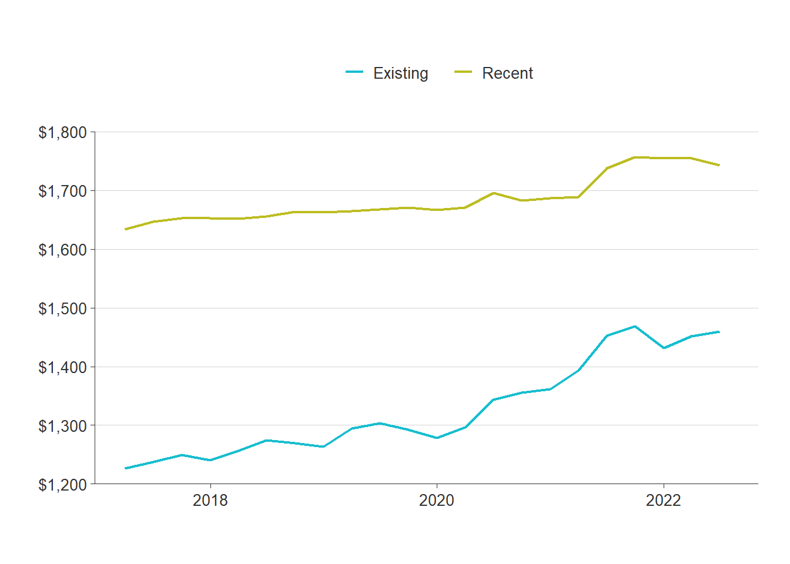
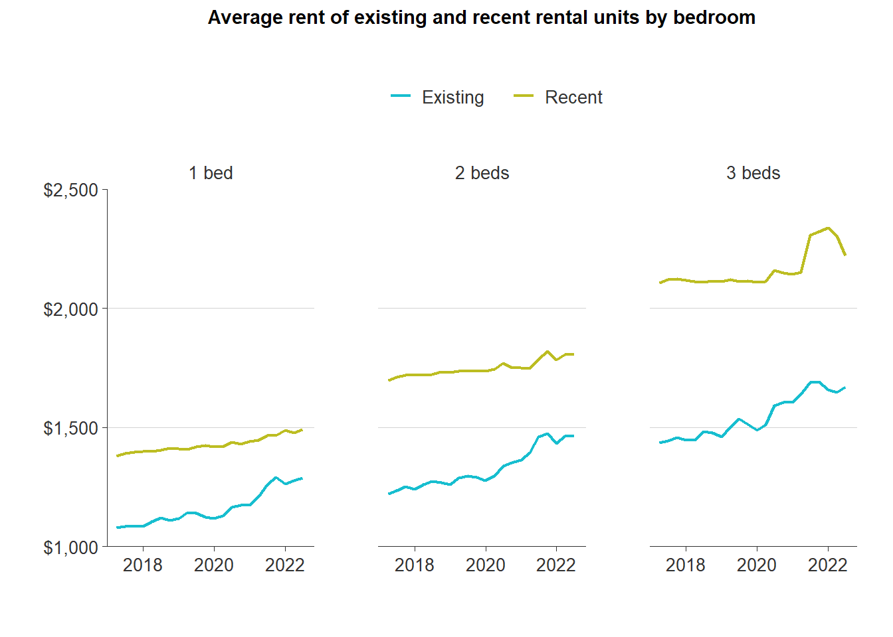
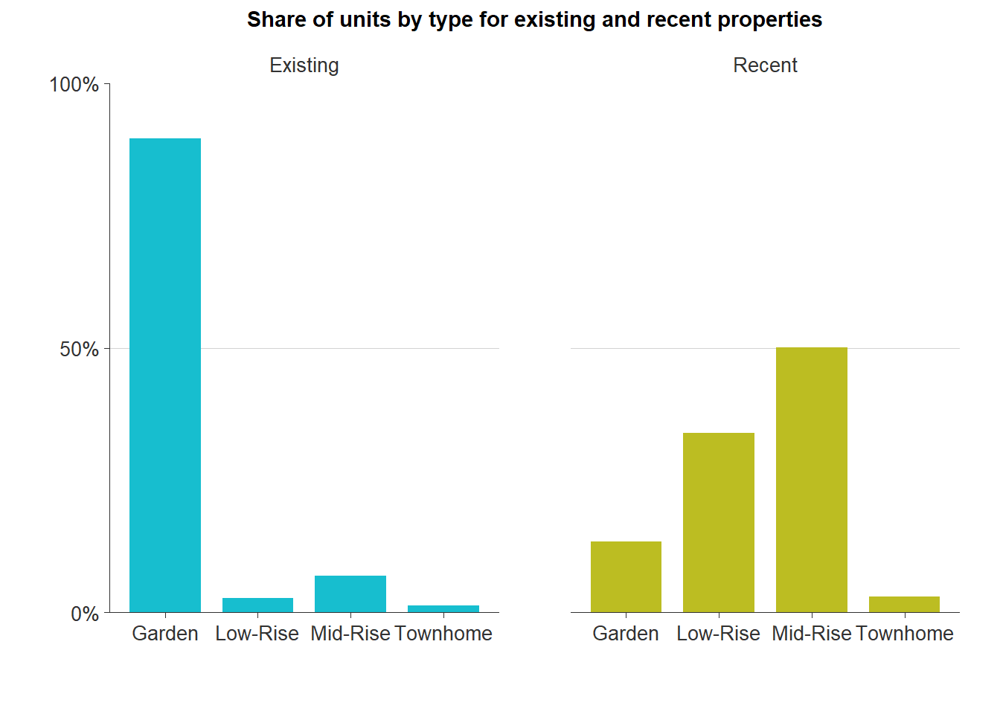
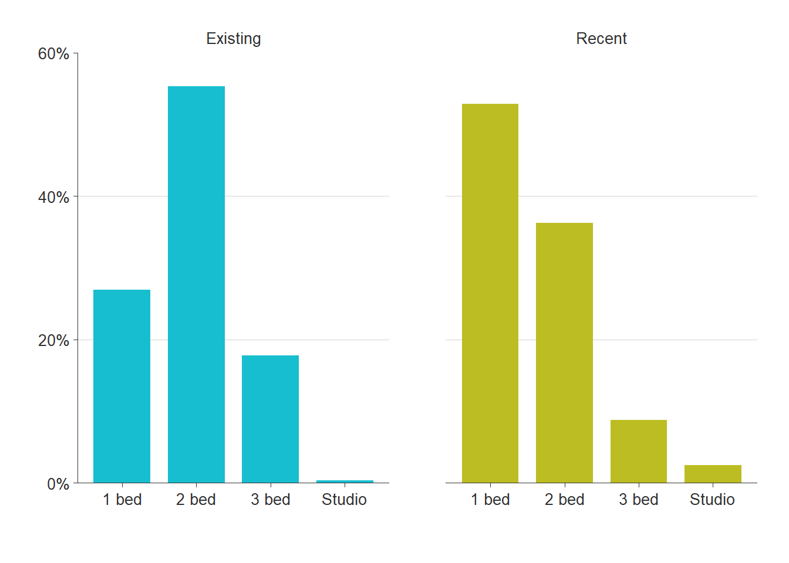
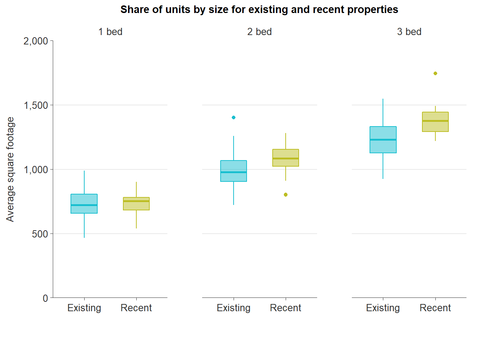
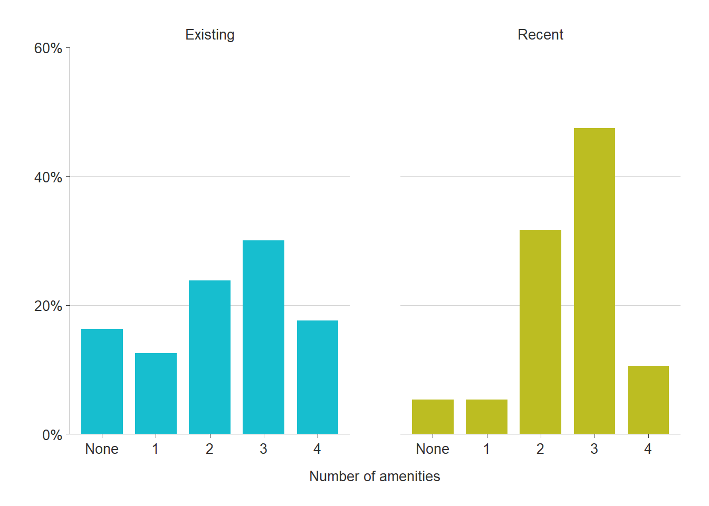
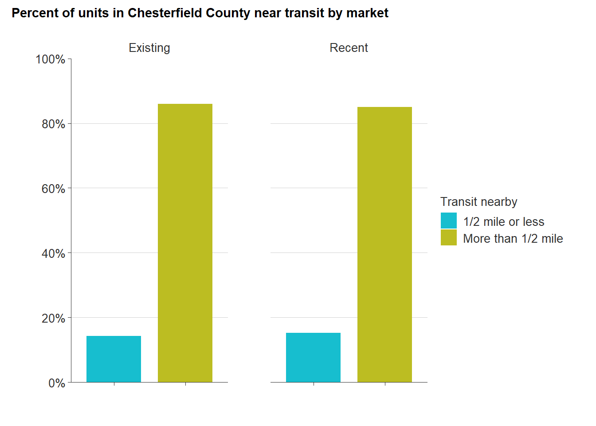
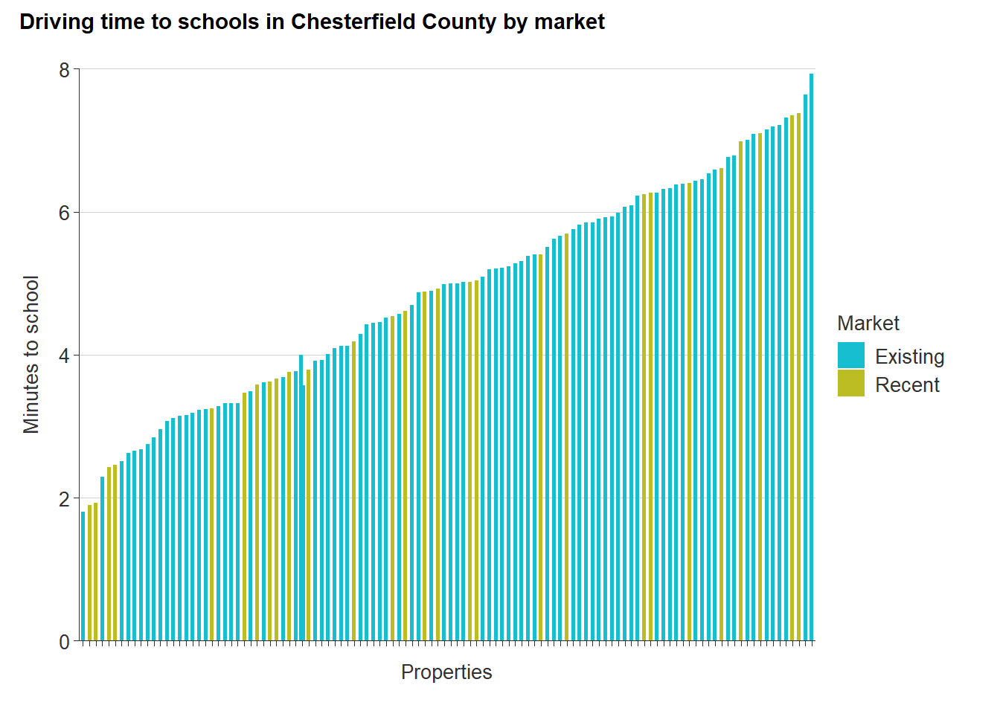
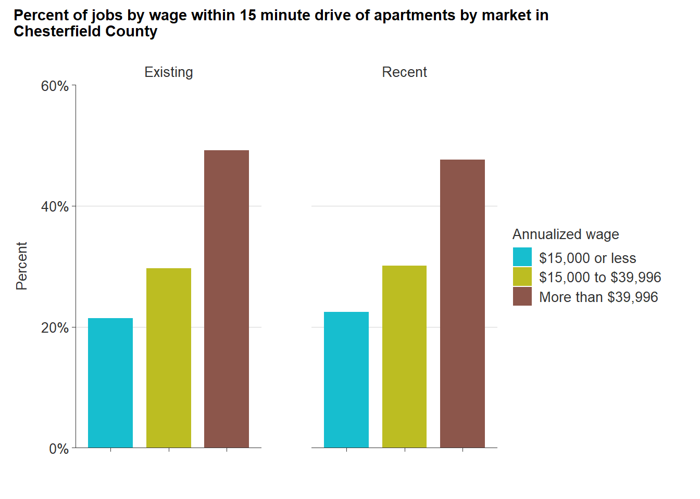

# Market comparison {#part-2a-3}

This section will make comparisons between recent multifamily developments and existing rental supply in the county. For the purposes of this section, "recent" developers are those built in the past five years, are under construction, or are proposed. This analysis does not include single-family rentals, nor manufactured home communities.

## Price

For much of the past five years, the difference in rental prices between recent and existing rental properties has remained at nearly \$400. But when the pandemic hit in the second quarter of 2020, the gap began to narrow.

Both recent and existing properties experienced a jump in average rent in the second quarter of 2020. While recent properties experienced a 1% increase in average rents, existing property average rents increased by 4% --- closing the gap to \$352. This difference in percent of change over time has continued to Q2 2022.

From Q2 2020 to Q2 2022, average rent for recent properties has changed 3% --- from \$1,696 to \$1,743. Existing property average rent growth was three times (9%) that of recent properties --- going from \$1,344 to \$1,460. From Q2 2017 to Q2 2022, the difference in average rent between recent and existing properties has gone from \$410 to \$285.

While average rents for recent properties has remained steady, existing property rents have risen dramatically. The COVID-19 pandemic has significantly impacted demand among the existing stock of rental housing in the county --- leading to complementary increases in rental prices.

(\#fig:price-all)Average rent of existing and recent rental units

*Source: CoStar Group, Inc.*

Price difference between recent and existing properties by number of bedrooms follows similar trends. But average rents for recent three-bedroom rentals experienced a significant increase in the middle of 2021 --- going from \$2,152 in Q2 2021 to \$2,337 in Q4 2021. In 2022, these rents began to decline somewhat, but still remained above \$2,000.

(\#fig:price-br)Average rent of existing and recent rental units by bedroom

*Source: CoStar Group, Inc.*

In all cases, the percent change in average rents for existing rental properties was three times that of recent properties no matter the bedroom count. One- and two-bedroom existing rentals had a near 20 percent increase in average rents from 2017 to 2022, while three-bedroom average rents increased by 16 percent. Average rents for recent rental properties only had an increase of 5 to 7 percent. The difference in rents between recent and existing properties as of Q2 2022 ranges from \$204 for one-bedrooms to \$552 for three-bedrooms.

## Unit mix

### Building style

Consumer preferences can change over time and those preference changes can impact market demand and prices. Multifamily building styles built in the late 20th century were largely in the garden-style apartments. The garden-style emphasizes lower densities and clustered development. Residents typically have ground floor access with no neighbors above.

Existing rental properties are majority garden-style (85 percent). But the composition of recent multifamily development is much more diverse. Although though garden-style apartments are still being produced, the majority (82 percent) of newer multifamily properties are low- or mid-rise buildings.

The shift towards these types of developments provides developers with greater economies of scale. More density makes it more financially possible to finance and develop properties. Without the density that comes through low- and mid-rise buildings, developers have to rely heavily on higher rents or substantial subsidies to make development possible.

(\#fig:unit-mix)Share of units by type for existing and recent properties

*Source: CoStar Group, Inc.*

### Bedrooms

Existing rental development mainly consists of two-bedroom rental homes (55 percent) and one-bedrooms (27 percent). More recent developments have shifted towards to one-bedroom rentals (53 percent). The percent of larger rentals - two- and three-bedrooms - being produced has dropped to 36 percent and 9 percent, respectively.

One-bedroom rentals meets a growing demand among young professionals and aging seniors in the county, but the lack of larger rental homes leaves growing families out of the multifamily rental market. Single-family homes are increasingly meeting the demand for larger families in need of rentals. Although this often is preferred by families who want greater privacy and more in-home separation, the single-family rental market can impact opportunities for potential homebuyers.

(\#fig:br-mix)Share of units by bedrooms for existing and recent properties

*Source: CoStar Group, Inc.*

### Size

On average, the significant number of new one-bedroom apartments are close in size to the county's existing supply of one-bedroom units---around 750 square feet. New two- and three-bedroom apartments are noticeably larger than older units, however. Recently-built three-bedroom rentals are now approaching 1,500 square feet.

(\#fig:sf-mix)Share of units by size for existing and recent properties

*Source: CoStar Group, Inc.*

## Amenities

The types of amenities and features on a rental property have also changed of time as consumer preferences and expectations have shifted. While there are many possible examples of "amenities", this analysis compares the prevalence of four common features across rental properties in the county.

These amenities, which are included in property-level data from CoStar, include:

-   Clubhouse,
-   On-site property manager,
-   Pool, and
-   Fitness center.

On average, newer apartment communities are much more likely to have at least two of these amenities compared to older properties. In fact, about 90 percent of all new developments have two or more amenities, versus just 71 percent of existing properties.

(\#fig:amenities)Percent of existing and recent properties by number of amenities

*Source: CoStar Group, Inc.*

## Location

New rental development has occurred all across Chesterfield County in recent years. However, as the map below shows, much of that activity has been concentrated along Route 288 from Midlothian Turnpike south to Hull Street. This development is notable for being located in areas where multifamily housing is not already prevalent.

On the other side of the county, there are five new developments along Route 1, plus several more just to the west following Route 10. These recent properties, unlike those along Route 288, do not make up the majority of multifamily housing in the area.

<iframe src="maps/comp_location_map.html" width="100%" height="500px" data-external="1" style="border:none;"></iframe>

(\#fig:location)Map of recent and existing multifamily rental properties

### Proximity to public transportation

Within the county, there are only 20 out of 115 multifamily properties located within a half mile walking distance of a public transit stop. The majority of these properties are existing properties, while only six are recent developments (built in 2017 or later).

These transit stops are mainly located at the city-county border along Midlothian Turnpike or along Route One, where the Greater Richmond Transit Company (GRTC) began local bus service from Falling Creek to John Tyler Community College in March 2020.

One recent development (Commonwealth Apartments built in 2022) has taken advantage of an Express Service Park-N-Ride located at Commonwealth Centre Parkway. This transit service provides a direct route from Commonwealth Centre Parkway to Downtown Richmond --- whether for work or leisure.

    MAP/ANALYSIS IN PROGRESS

(\#fig:transit-chart)Percent of units in Chesterfield County near transit by market

### Proximity to schools

    MAP/ANALYSIS IN PROGRESS

(\#fig:schools-chart)Driving time to schools in Chesterfield County by market

### Proximity to grocery stores

    ANALYSIS IN PROGRESS

### Proximity to healthcare

    ANALYSIS IN PROGRESS

### Proximity to job centers

    ANALYSIS IN PROGRESS
    

(\#fig:jobs-chart)Percent of jobs by wage within 15 minute drive by rent type in Chesterfield County

