# (PART) CORRIDOR CASE STUDIES {.unnumbered}

# Route 1 corridor analysis {#part-2b-1}

This section describes the Route 1 corridor in terms of its rental housing market, proximity of rental homes to amenities, recent major investments, and homeownership relative to the price of single-family rentals.

The Route 1 corridor used in this section uses the same six census tracts from the previous Route 1 affordability analysis in [Chapter 10](#part-1b-5).


## The Route 1 Corridor

U.S. Route 1 once served as the major north-south corridor that connected East Coast states. However, the completion of Interstate 95 in the late 1950s drew traffic and business away from the highway. Since then, areas up and down the entirety of U.S. Route 1 have experienced decline and significant change that present challenges to revitalization. As a home to residents and businesses, the Route 1 corridor in Chesterfield County is well-positioned to be one of the county's most vibrant suburban communities to existing and future generations. In close proximity to the City of Richmond and with convenient access to Interstate 95, the corridor is centrally located in the Richmond metro area and could play a pivotal role in the growth and development of the entire region.

Current conditions on the northern section of Route 1 prevent significant reinvestment, but recent efforts by the County improve those conditions and incentivize new and much needed development. The 2018 Northern Jefferson Davis Special Area Plan and the 2019 Northern Jefferson Davis Real Estate Market Study provide Chesterfield County with initial tools to revitalize Route 1. Momentum has continued with the Route 1 Residential Overlay District, the Northern Jefferson Davis Incentive Program, and Greater Richmond Transit Company's Pilot Bus Service.

Much of the new rental housing development has occurred at the southern end of the study area --- pulled towards the intersection of W. Hundred Road (State Route 10) and Route 1, where there is a dense concentration of retail shopping options.

This study focuses its research on the six census tracts that straddle the Route 1 corridor from the Richmond-Chesterfield County border to the north and State Route 10 to the south. This encompasses portions of the Bensley, Bellwood, and northern Chester.

<iframe src="maps/r1_neighborhoods.html" width="100%" height="500px" data-external="1" style="border:none;"></iframe>

## Rental housing supply

The following describes the existing rental housing supply along the Route 1 corridor.

### Number of rental homes

The number of rental homes along the Route 1 corridor has increased by 26 percent between 2010 and 2020 - a total of 708 renter households. Much of this rental housing growth occurred in the latter half of the decade --- from 2014 and on. From 2010 to 2012, rental housing was in decline --- most likely a reflection of the latter year impacts from the Great Recession. During this timeframe, the construction industry struggled to keep pace with the growing demand for new rental housing. From 2019 to 2020, there was a higher estimated percent change (13 percent)in renter homes than in previous years. Although this could be a significant impact of the COVID-19's impact on the rental housing market --- margins of error for the data in 2020 are also higher than previous years; and therefore, these changes should be interpreted with caution.

<div class="figure">
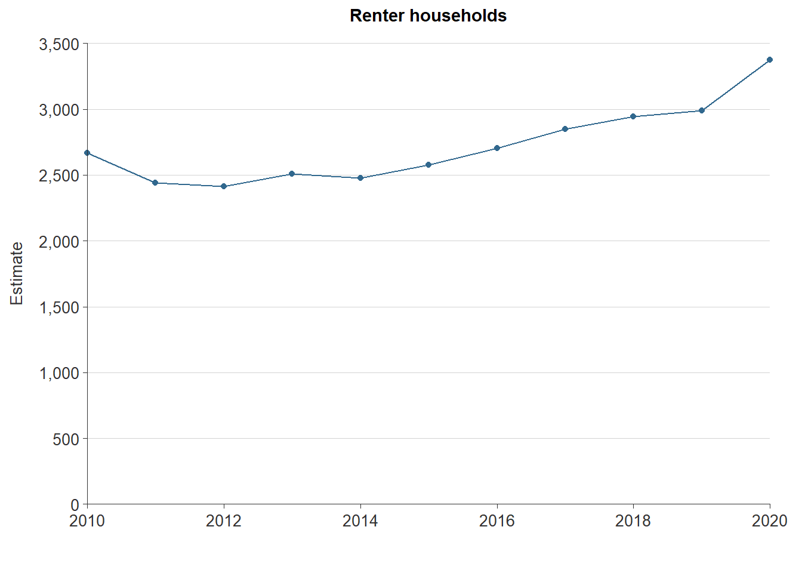
<p class="caption">(\#fig:r1-rhh)Renter households in Route 1 corridor</p>
</div>

Based on 2010 and 2020 estimates, the increase in rental housing has largely occurred at the northern end of the Route 1 corridor in the Bensley area. All areas saw some increase in renter housing except for Census Tract 1004.04, which covers the eastern side of Route 1 from Falling Creek down to Bellwood Road. This census tract experienced a decrease of 180 renter households.

While unable to determine the causes or from where these renter households came from, this area of Route 1 contains several manufactured home communities and naturally-occurring affordable housing --- all of which place households at greater risk of displacement.

<div class="figure">
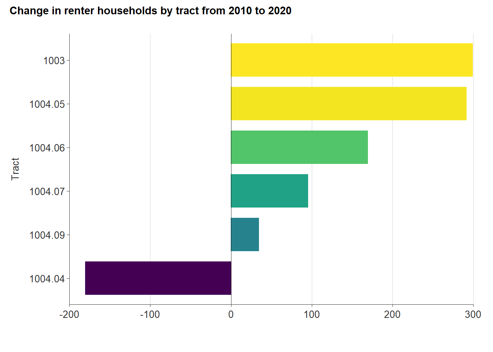
<p class="caption">(\#fig:r1-rhh-tract)Change in renter households by tract from 2010 to 2020</p>
</div>

### Multifamily properties

Of the estimated 3,376 occupied rental homes from the U.S. Census Bureau, CoStar captures at most 2,417 of them that are located across 20 multifamily properties. These multifamily properties contain at least 12 rental homes and the majority of these properties (70 percent) are garden-style apartments. The majority (70 percent) of existing properties were built before 1976, and of these fourteen properties, only two have a recorded renovation --- Collindale Apartments (renovated in 1990) and Falling Creek (renovated in 2017).

<div class="figure">
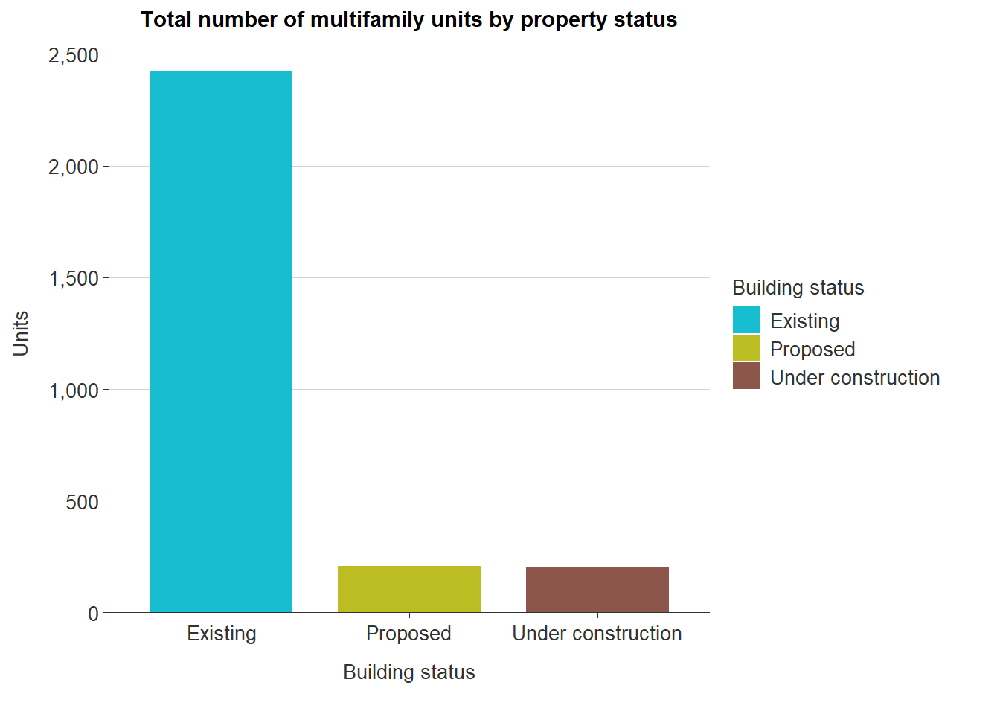
<p class="caption">(\#fig:costar-mf-1)Total number of multifamily units by property status</p>
</div>

The city-county border was located much further north before the annexation of Northern Chesterfield by the City of Richmond in 1970. In spite of this change, these older rental properties represent the extent to which rental housing development in the mid-20th century stretched into the county.

<div class="figure">
<iframe src="maps/r1_costar_map.html" width="100%" height="500px" data-external="1" style="border:none;"></iframe>
<p class="caption">(\#fig:costar-mf-2)Map of multifamily properties along Route 1 Corridor</p>
</div>

### Manufactured home communities

Manufactured housing grew out of the "travel trailer" popularity of the mid-20th century. These trailers evolved into the manufactured housing when the U.S. Department of Housing and Urban Development developed standardized building codes and the the Federal Housing Administration began offering mortgage insurance on both homes and lots.

Communities of manufactured homes grew out of the decline of "travel trailer" camp grounds and the increase in manufactured housing production. With the need for land to place manufactured homes, there were few options aside from existing land where similar types of housing were already permitted, or where a household could afford a plot of land themselves. Land owners also saw a value in developing manufactured home communities for those who wanted the experience of a single-family detached home, but could not afford to purchase.

But the stigma of manufactured housing has plagued both residents and developers for decades. There have been no new manufactured home communities in Virginia in that same amount of time. Nonetheless, manufactured home communities have carved out a particular niche along the housing spectrum, offering an affordable albeit often precarious housing opportunity.

Manufactured home communities offer rental housing opportunities across the county by one of two ways:

1.  A household owns their manufactured home and rents the land in which their home is placed (i.e. paying lot rent); or
2.  A household rents the manufactured home that is owned by the community owner (i.e. paying rent where lot rent is included).

Accurate data on manufactured home communities is difficult to come by. Community owners may allow for the additional of homes on a continuous basis without approval, or some homes may be left abandoned after a tenant has vacated. Anecdotally, some owners have even subdivided a single home into four units to be rented. This makes it difficult to have an accurate count of households.

The northern Route 1 corridor has a substantial number of manufactured home communities --- specifically 10 out of the county's known 17 manufactured home communities are located in the area. This accounts for at least 514 individual manufactured homes, or 31 percent of all homes located in a manufactured home community. This includes the sixth largest manufactured home park in the county, Shady Hill, which was recently purchased in July 2022.

<div class="figure">
<iframe src="maps/r1_mhc_map.html" width="100%" height="500px" data-external="1" style="border:none;"></iframe>
<p class="caption">(\#fig:r1-mhc)Map of manufactured home communities along Route 1</p>
</div>

Notable among these communities is Bermuda Estates, which was purchased by affordable housing nonprofit, project:HOMES, in September 2020. Only one of two nonprofit owned and managed manufactured home communities in the Commonwealth, Bermuda Estates has seen significant infrastructure improvements and the replacement of homes with new energy efficient manufactured home models by project:HOMES.

<table class="table table-condensed table-hover table-striped" style="margin-left: auto; margin-right: auto;">
<caption>(\#tab:r1-mhc-list)Manufactured home communities along northern Route 1 corridor</caption>
 <thead>
  <tr>
   <th style="text-align:left;"> Name </th>
   <th style="text-align:right;"> Estimated homes </th>
  </tr>
 </thead>
<tbody>
  <tr>
   <td style="text-align:left;"> Holiday Mobile Home Park </td>
   <td style="text-align:right;"> 140 </td>
  </tr>
  <tr>
   <td style="text-align:left;"> Shady Hill Mobile Home Park </td>
   <td style="text-align:right;"> 110 </td>
  </tr>
  <tr>
   <td style="text-align:left;"> Conner Homes </td>
   <td style="text-align:right;"> 54 </td>
  </tr>
  <tr>
   <td style="text-align:left;"> Bermuda Estates </td>
   <td style="text-align:right;"> 54 </td>
  </tr>
  <tr>
   <td style="text-align:left;"> Bellwood Mobile Home Park </td>
   <td style="text-align:right;"> 41 </td>
  </tr>
  <tr>
   <td style="text-align:left;"> Falling Creek Mobile Home Park </td>
   <td style="text-align:right;"> 35 </td>
  </tr>
  <tr>
   <td style="text-align:left;"> Parkway Trailer Court </td>
   <td style="text-align:right;"> 28 </td>
  </tr>
  <tr>
   <td style="text-align:left;"> Ponderosa Mobile Home Park </td>
   <td style="text-align:right;"> 27 </td>
  </tr>
  <tr>
   <td style="text-align:left;"> Bellwood Rd LLC Trailer Park </td>
   <td style="text-align:right;"> 13 </td>
  </tr>
  <tr>
   <td style="text-align:left;"> Unnamed </td>
   <td style="text-align:right;"> 12 </td>
  </tr>
</tbody>
</table>

### Single-family rentals

As mentioned previously in [Chapter 11](#part-2a-1), the growth of the single-family home rental (SFR) market is impacting all parts of the county. And the Route 1 corridor is no exception.

Along the northern Route 1 corridor, there is an estimated 1,008 single-family home rentals --- about 20 percent of all single-family homes the area.[^part-2b-1-1] The highest concentration of SFR is within Census Tract 1003 (Bensley), where 28 percent of all single-family homes are believed to be renter occupied.

[^part-2b-1-1]: This analysis was conducted by matching owner mailing address to physical address for all parcels wherein the land use code is "Single Dwelling." This analysis does not account for condominiums and therefore could be considered an undercount.

SFR is a growing demand among renters as homeownership continues to be out of reach for many, but it also serves a growing demand among households looking for greater space and privacy not offered in apartments. As seen in [Chapter 13](#part-2a-3), nearly 54 percent of recent multifamily housing is two-bedrooms or less, leaving many larger households competing for less supply. SFR is filling the gap where multifamily developers are often falling short due to increasing construction costs and public opposition.

<div class="figure">
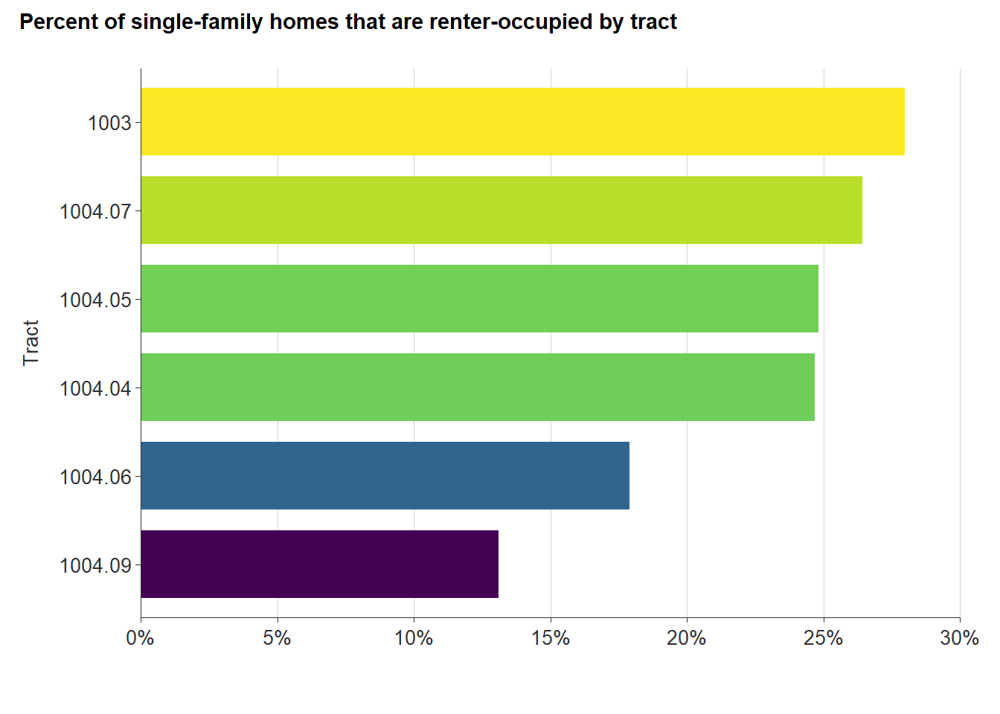
<p class="caption">(\#fig:sfr-r1)Percent of single-family homes that are renter-occupied by tract</p>
</div>

The majority (68 percent) of owners of SFR along the corridor live somewhere else in the county, while 25 percent live outside of the county but somewhere else in Virginia. Fewer than 7 percent of SFR owners live outside of Virginia --- the largest share of which has an owner in Florida.

<table class="table table-condensed table-hover table-striped" style="margin-left: auto; margin-right: auto;">
<caption>(\#tab:sfr_r1_owners)Single-family rentals in Route 1 corridor by owner location</caption>
 <thead>
  <tr>
   <th style="text-align:left;"> Ownership </th>
   <th style="text-align:right;"> Number </th>
   <th style="text-align:right;"> Percent </th>
  </tr>
 </thead>
<tbody>
  <tr>
   <td style="text-align:left;"> Owner in Chesterfield </td>
   <td style="text-align:right;"> 690 </td>
   <td style="text-align:right;"> 68% </td>
  </tr>
  <tr>
   <td style="text-align:left;"> Owner in Virginia </td>
   <td style="text-align:right;"> 256 </td>
   <td style="text-align:right;"> 25% </td>
  </tr>
  <tr>
   <td style="text-align:left;"> Owner out of state </td>
   <td style="text-align:right;"> 62 </td>
   <td style="text-align:right;"> 6% </td>
  </tr>
</tbody>
</table>

### Rental prices

Median rents in the northern Route 1 corridor have fluctuated in the last decade. But increases in the typical rent have most significantly occurred in the southern part of Bellwood (Census Tract 1004.07) where Colony Village was developed. In this part of the corridor, median rent has increased by 24 percent from 2010 to 2020.

<div class="figure">
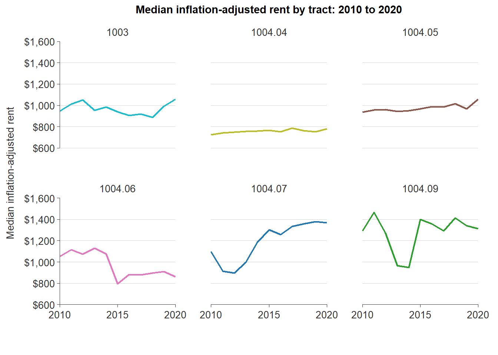
<p class="caption">(\#fig:acs-r1-rent)Median inflation-adjusted rent by tract: 2010 to 2020</p>
</div>

There are clear differences in median rents between the northern and southern sections of the Route 1 corridor. Northern Chester and southern Bellwood had median rents above \$1,300 in 2020 --- \$1,314 and \$1,367, respectively. Median rents in the northern part of the corridor ranged from \$780 to \$1,059 -- hundreds of dollars less in all cases than the southern part of the corridor.

Much of this difference in rental markets is no doubt a result of newer developments like Colony Village and The Jane at Moore's Lake. There have been few new multifamily developments in the northern section aside from Better Housing Coalition developments.

<div class="figure">
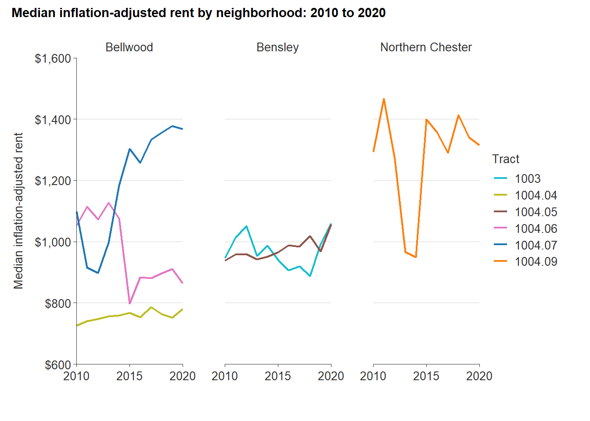
<p class="caption">(\#fig:acs-r1-rent1)Median inflation-adjusted rent by neighborhood: 2010 to 2020</p>
</div>

#### Multifamily rents

CoStar's analytics allows for a broad snapshot of average rent data along Route 1 on a quarter-by-quarter basis. Average rent per apartment was on a steady decline from 2002 until the rental market began to recover in 2013. It was not until Q3 2014 that average rent began to experience consistent increases quarter over quarter from \$1,109 to \$1,214 in the most recent 2022 quarter.

From 2017 to early 2020, the typical average rent increase was about \$3 but between Q1 2020 and Q2 2020 the average rent jumped \$15 from \$1,195 to \$1,210. It was during this timeframe that the pandemic began to impact housing markets, leading to significantly low rental vacancy rates as the eviction moratorium was put in place and increasing demand for housing away from the denser urban environment.

<div class="figure">
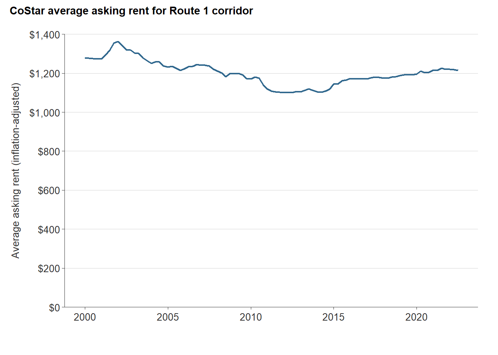
<p class="caption">(\#fig:costar-r1-rent)CoStar average asking rent for Route 1 corridor</p>
</div>

Average rent disaggregated by number of bedrooms shows fairly steady increases for all bedroom types, especially one- and two-bedroom apartments. Studios and three-bedroom apartments in the area have seen decreasing rents in recent years. In fact, average rent for three bedroom apartments are now \$56 cheaper (\$1,431) than they were at the start of 2012 (\$1,487).

<div class="figure">
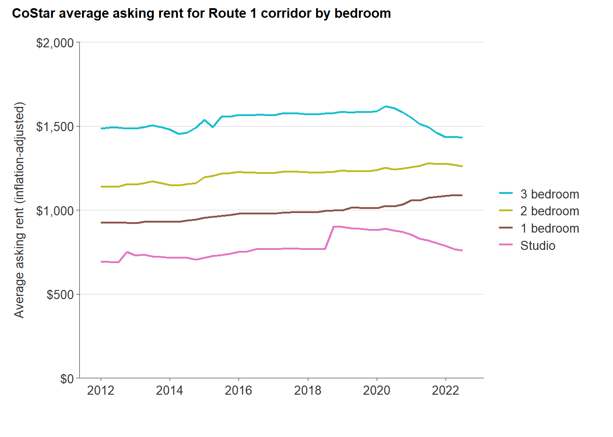
<p class="caption">(\#fig:costar-r1-brent)CoStar average asking rent for Route 1 corridor by bedroom</p>
</div>

#### Single-family rents

Single-family rentals are not often listed via sources that provide consistent or reliable data. Facebook groups and other social networks often play a major role in advertising SFR, but the Central Virginia Regional Multiple Listing Service (CVR MLS) does pick up some of this market. Within the last year, there were 44 single-family homes rented through the MLS.

The average listed rent for one of these SFR was \$1,336 --- nearly \$100 less the average rent for a three-bedroom apartment. Single-family detached homes fetch higher rental prices versus condominiums or duplexes.

<div class="figure">
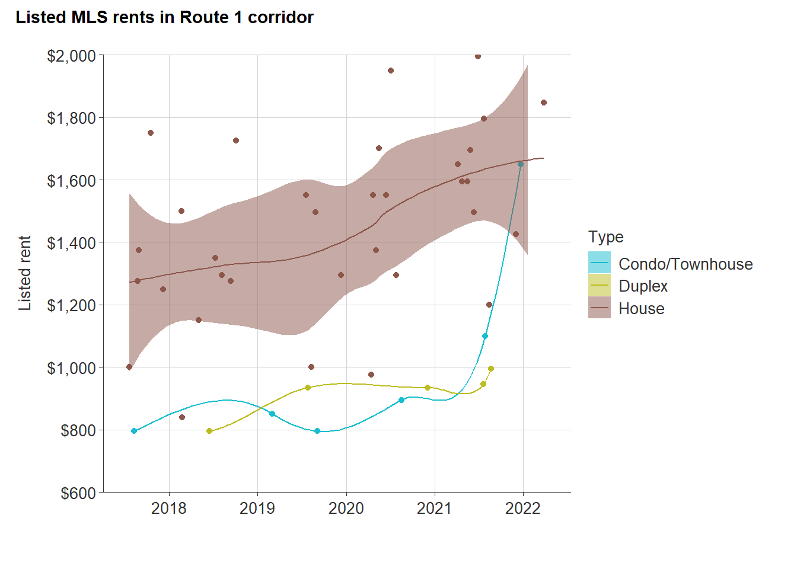
<p class="caption">(\#fig:mls-sfr)Listed MLS rents in Route 1 corridor</p>
</div>

The majority of SFR listed through MLS are three-bedroom homes (54 percent), while 18 percent are four-bedrooms or more --- an option that apartments do not often offer.

<div class="figure">
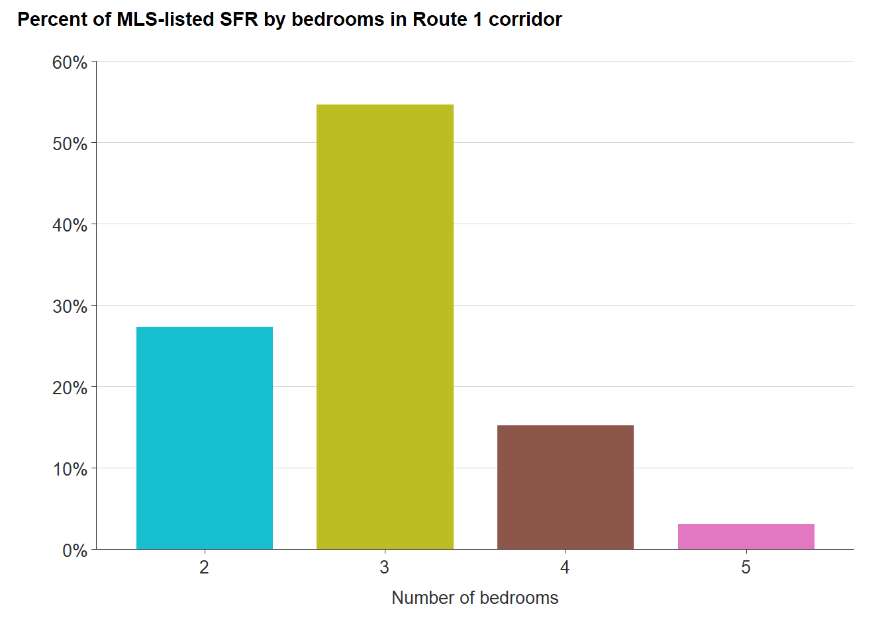
<p class="caption">(\#fig:mls-sfr1)Percent of MLS-listed SFR by bedrooms in Route 1 corridor</p>
</div>


### Conditions

Aging rental properties require substantial capital in order to maintain properties. Even properties built in the 1980s are approaching half a century in age. Along the Route 1 corridor, there are 1,812 rental homes that were built before 1980. The largest share of these homes are located in the Bensley area (Census Tracts 1003 and 1004.04).

<div class="figure">
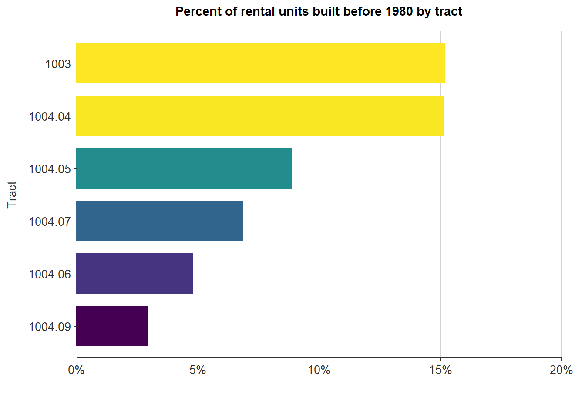
<p class="caption">(\#fig:acs-yrblt)Percent of rental units built before 1980 by tract</p>
</div>

Of the 23 CoStar-listed multifamily properties, 14 (61 percent) were constructed before 1980. There was no major multifamily development activity again until 2000 when Better Housing Coalition constructed Winchester Green Apartments' first phase. There has been little new multifamily development along the corridor during the last two decades --- activity has largely been spearheaded by Better Housing Coalition and Emerson Companies. With few newer developments, there are fewer options for those who are looking to rent along the corridor --- either having to choose a pre-1980s apartment, which are often in need of renovation, or among new luxury apartments that are often outside the budgets of existing renters along the corridor.

<div class="figure">
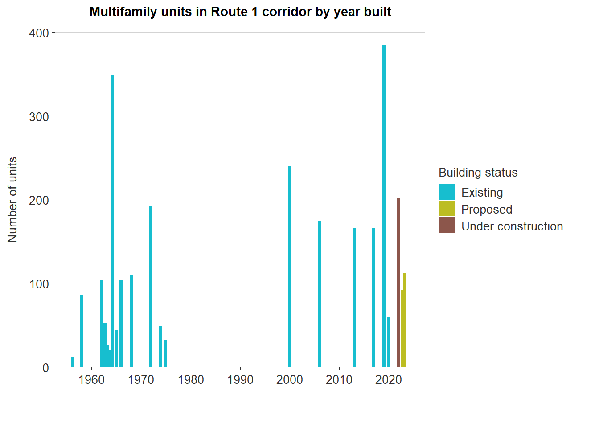
<p class="caption">(\#fig:costar-mf-3)Multifamily units in Route 1 corridor by year built</p>
</div>

CoStar's building rating system also provides a snapshot of condition of multifamily properties. Eighty-three percent of multifamily properties along the corridor are three-star or less --- meaning that in terms of quality and amenities that these buildings are relatively average or simply functional. In comparison, four-star properties are "are constructed with higher end finishes and specifications, providing desirable amenities to residents and designed/built to competitive and contemporary standards," while five-star properties are "the luxury end of multi-family buildings defined by finishes, amenities, the overall interior/exterior design and the highest level of specifications for its style..."

<div class="figure">
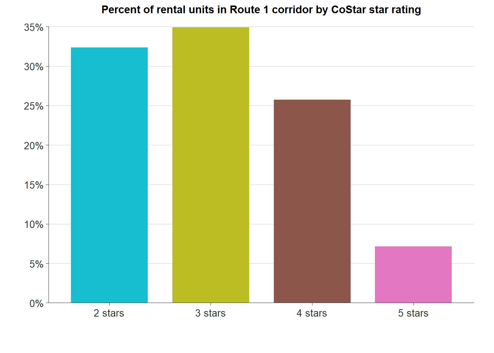
<p class="caption">(\#fig:costar-mf-4)Percent of rental units in Route 1 corridor by CoStar star rating</p>
</div>

In 2016, the Manufactured Home Community Coalition of Virginia conducted an assessment of manufactured home communities in Central Virginia. Their assessment included all but three of the communities identified in this study.

Based on an analysis of community socio-economic conditions, spatial patterns, and design characteristics, MHCCV created a typology that helps understand community conditions and potential areas for concern. To supplement their typology, communities not identified previously were assigned a typology.[^part-2b-1-2]

[^part-2b-1-2]: Bermuda Estates was assigned a completely new typology due to its ownership by nonprofit, project:HOMES. This typology emphasizes the stability of the park and the continued investments in the community given project:HOMES' overall mission.

Of the ten communities located along the corridor, six are either obsolete or under pressure. Obsolete communities were found to have "severe, long-standing deficiencies in infrastructure, housing condition, private property, tenure, amenities, and management. Under pressure communities often house low-income families with children and are located in areas close to daily needs. They have poor conditions and are at the most risk for redevelopment.

<div class="figure">
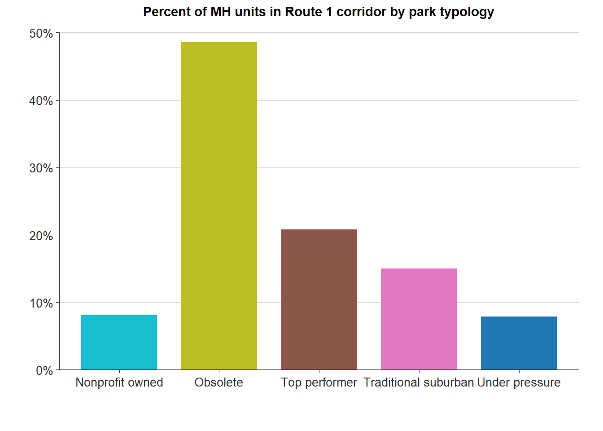
<p class="caption">(\#fig:mhccv-condition)Percent of MH units in Route 1 corridor by park typology</p>
</div>

## Single-family rental versus purchase

For renter households along the corridor, the ability to purchase a home may be out of reach for many. But SFRs are filling a gap for households looking for the opportunity to live in a single-family detached home --- providing more space and privacy for growing families. At the same time, SFRs are typically the entry-level homes that many first-time homebuyers would be able to afford. 


In the last year, the median home sales price for a home along the corridor was \$265,000, which would require a monthly mortgage payment of \$1,707.60. This is nearly \$400 more than the price of a SFR in the area --- \$1,336.87 a month.

<table class="table table-condensed table-hover table-striped" style="margin-left: auto; margin-right: auto;">
<caption>(\#tab:r1-home-price)Calculated income needed to buy median-priced home in the study area</caption>
 <thead>
  <tr>
   <th style="text-align:left;"> Variable </th>
   <th style="text-align:right;"> Value </th>
  </tr>
 </thead>
<tbody>
  <tr>
   <td style="text-align:left;"> Median sales price </td>
   <td style="text-align:right;"> $265,000 </td>
  </tr>
  <tr>
   <td style="text-align:left;"> Downpayment </td>
   <td style="text-align:right;"> 5.0% </td>
  </tr>
  <tr>
   <td style="text-align:left;"> Closing costs </td>
   <td style="text-align:right;"> 1.5% </td>
  </tr>
  <tr>
   <td style="text-align:left;"> Loan amount </td>
   <td style="text-align:right;"> $255,584 </td>
  </tr>
  <tr>
   <td style="text-align:left;"> Interest rate </td>
   <td style="text-align:right;"> 5.54% </td>
  </tr>
  <tr>
   <td style="text-align:left;"> Monthly utilities </td>
   <td style="text-align:right;"> $250 </td>
  </tr>
  <tr>
   <td style="text-align:left;"> Monthly payment </td>
   <td style="text-align:right;"> $1,707.60 </td>
  </tr>
  <tr>
   <td style="text-align:left;font-weight: bold;"> Income needed to buy home </td>
   <td style="text-align:right;font-weight: bold;"> $73,183 </td>
  </tr>
</tbody>
</table>

In order to afford the median home sales price, a household would need to make \$73,183 annually, while an SFR would require \$53,475 --- almost \$20,000 less.

<table class="table table-condensed table-hover table-striped" style="margin-left: auto; margin-right: auto;">
<caption>(\#tab:r1-sfr-price)Calculated income needed to rent single-family home in the Route 1 corridor</caption>
 <thead>
  <tr>
   <th style="text-align:left;"> Variable </th>
   <th style="text-align:right;"> Value </th>
  </tr>
 </thead>
<tbody>
  <tr>
   <td style="text-align:left;"> Average rent for single-family home </td>
   <td style="text-align:right;"> $1,336.87 </td>
  </tr>
  <tr>
   <td style="text-align:left;font-weight: bold;"> Income needed </td>
   <td style="text-align:right;font-weight: bold;"> $53,474.80 </td>
  </tr>
</tbody>
</table>

Based on the most recent ACS estimates for renter household incomes, the typical renter in most Census tracts would not be able to either rent a SFR nor purchase the typical home in the area. Renters in southern Bellwood and northern Chester are more likely to afford a SFR, but with their incomes they are still nearly \$10,000 short of being able to purchase a home priced at \$265,000.

<div class="figure">
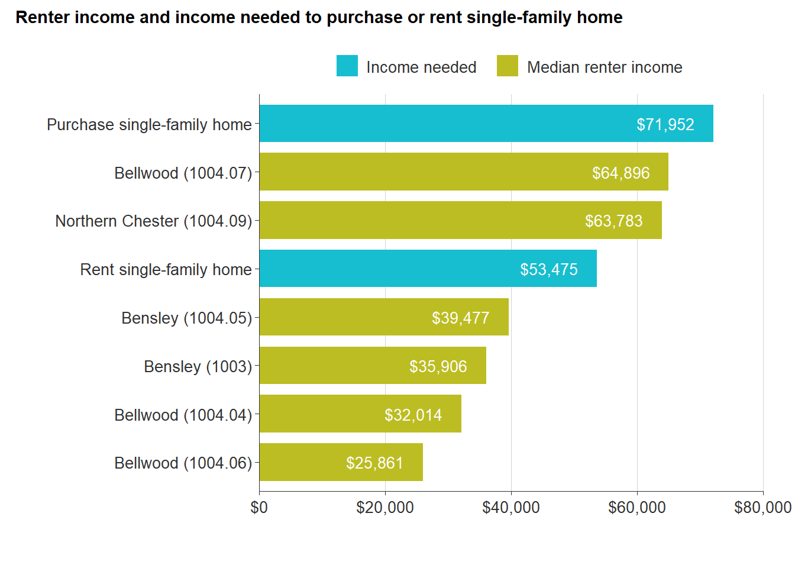
<p class="caption">(\#fig:sfr-mls-bar)Renter income and income needed to purchase or rent single-family home in Route 1 corridor</p>
</div>

With homeownership being out of reach for many in the area, the next best option is often renting a single-family home. Low supply of homes for sale is often being exacerbated by owners or investors converting potential starter home opportunities into rental properties. Although this is meeting a demand in the rental market, the opportunity to reach the first rung of the homeownership ladder is so often pushed further away when the cost to rent a home is only a few hundred dollars away from being able to afford a monthly mortgage.

## Proximity to amenities

Being close to amenities like grocery stores and employment can make a difference in housing affordability for many families on a tight budget. Less time spent traveling often means less money spent on personal vehicle maintenance and gas. It also means more time to spend with family members and more savings that can be spent on housing costs. 

### Public transportation

Public transportation is not prevalent throughout Chesterfield County. But in March 2020, the [Greater Richmond Transit Company (GRTC)](http://ridegrtc.com/statistics-reports/projects-plans/chesterfield-route-1-local-bus-service) partnered with Chesterfield County and the Department of Rail and Public Transportation (DRPT) to pilot local bus service from Falling Creek to John Tyler Community College. Along the Route 1 corridor, there are 24 stops --- 12 along each north and south side.

Local bus service provides those without personal vehicles greater access to employment opportunities and the ability to reach community amenities such as grocery stores. Of the 23 properties along the corridor, 19 are within a half mile walking distance of a bus stop.

In fact, the average distance of properties along this section of the corridor to a bus stop is 0.42 miles. This allows for nearly 2,000 renter households with less than a half mile access to bus service to the City of Richmond, John Tyler Community College, or retail at the intersection of Route 1 and Route 10.

However, this access is slightly more difficult for renters living in apartment communities with affordable rents. One-in-four of all rent-restricted apartments are beyond 1/2 mile walking distance to a transit stop, compared to just 13 percent of all market-rate apartments in the corridor.


<div class="figure">
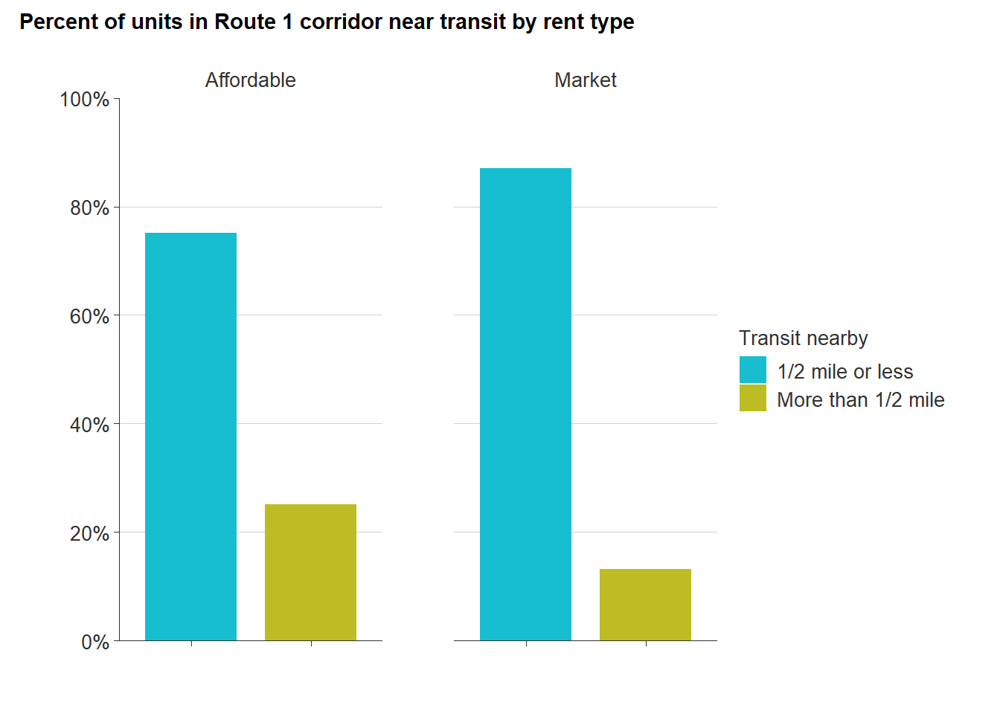
<p class="caption">(\#fig:r1-transit-chart)Percent of units in Route 1 corridor near transit by rent type</p>
</div>


### Schools

Within the footprint of the Route 1 corridor study area, there are four Chesterfield County Public Schools (CCPS). These include:
- Bensley Elementary School
- Bellwood Elementary School
- C.E. Curtis Elementary School
- Thomas Dale High School

Studies have found that longer commute times have negative impacts on students, including less time spent on activities that promote greater health outcomes.^[Voulgaris CT, Smart MJ, Taylor BD. Tired of Commuting? Relationships among Journeys to School, Sleep, and Exercise among American Teenagers. Journal of Planning Education and Research. 2019;39(2):142-154. doi:10.1177/0739456X17725148] Researchers generally define "long" school commutes as those greater than 30 minutes one-way.

Multifamily properties along the corridor are all within a 30 minute drive of at least one Chesterfield County Public School. In fact, all multifamily properties are fewer than eight minutes away from a school. The average time to at least one CCPS school is slightly more than five minutes.

Still, the affordable communities are further away on average compared to market-rate properties. All but one rent-restricted community has a drive time of more than six minutes. This may detrimentally affect students who walk to school.


<div class="figure">
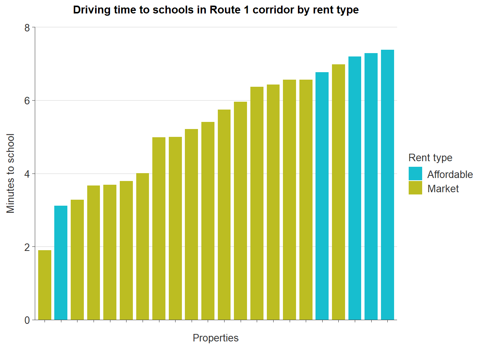
<p class="caption">(\#fig:r1-schools-chart)Driving time to schools in Route 1 corridor by rent type</p>
</div>

### Grocery stores

Close proximity to a full service grocery store provides families with a greater ability to purchase fresh meat and produce on a regular basis. When access is limited, many families have depend on more convenient options like corner stores and gas stations, where foods are often cheaper but lower quality. This impacts individual health and leads to greater prevalence of preventable diseases such as obesity, heart disease, and type 2 diabetes.

Properties along the corridor are much more likely to be located within close proximity to a convenience store than a full-service grocery. Of all 23 properties, only one is located within a half mile distance of grocery store --- the Food Lion located at the Chippenham Parkway interchange.

The average distance between an apartment and a full-service grocery is 1.39 miles, while the average distance to a convenience store or small market is 0.40 miles. For those without a personal vehicle, the choice in traveling to get food is often an easy one to make when convenience stores like Dollar General are much more accessible.

On average, both affordable and market-rate apartments are a little less than half a mile from a convenience store. However, residents in market-rate properties are more likely to be significantly closer (1.2 miles away) to a SNAP retailer, such as a major grocery store, versus those in rent-restricted properties (1.8 miles).


<div class="figure">
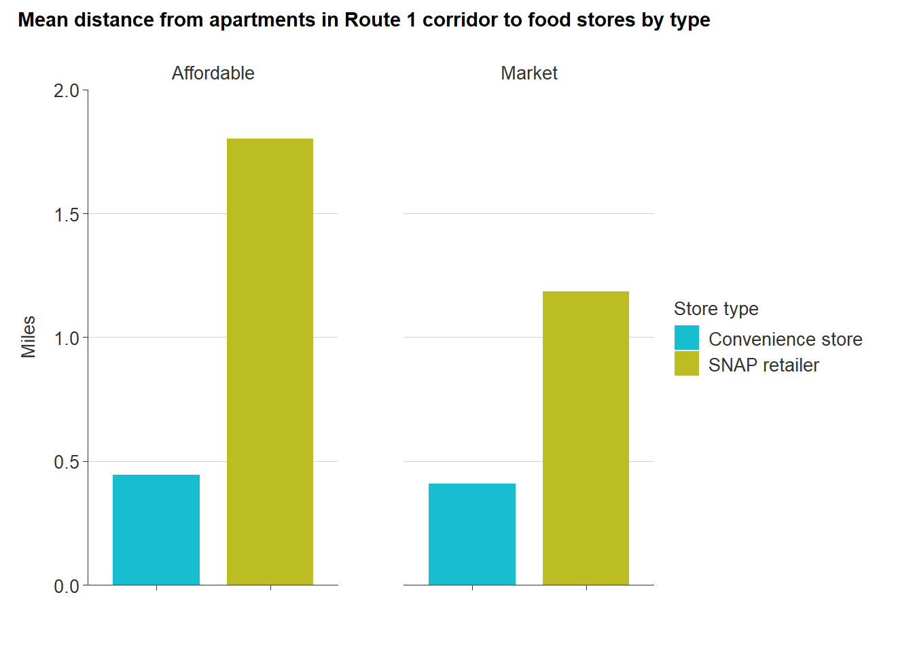
<p class="caption">(\#fig:r1-grocery-chart)Mean distance from apartments in Route 1 corridor to food stores by type</p>
</div>

### Healthcare

Healthcare access is an important factor in improving not only individual health, but community health. Acute care general hospitals are open 24 hours a day, 365 days a year and provide patients with wellness services as well as emergency medical episodes that require intensive care. Urgent care facilities provide walk-in clinic services for minor illnesses and injuries outside a hospital setting. Access to both of these levels of care provide communities with a spectrum of care.

Along the corridor, the closest acute care hospital is Hunter Holmes McGuire Veterans Hospital, while the Concentra Urgent Care located in the Bellwood area is the closest urgent care facility. The average drive-time for a resident in a multifamily property along the corridor to an acute care hospital is 13.5 minutes, while their average drive-time to an urgent care is 7.5 minutes.

Nationally, the average travel time for residents in a suburban setting to a hospital is 12 minutes, slightly below that of the multifamily residents along the corridor.^[https://www.pewresearch.org/fact-tank/2018/12/12/how-far-americans-live-from-the-closest-hospital-differs-by-community-type/] 

There are no significant differences in the average driving time to both hospitals and urgent care facilities between affordable and market-rate properties in the corridor.


<div class="figure">
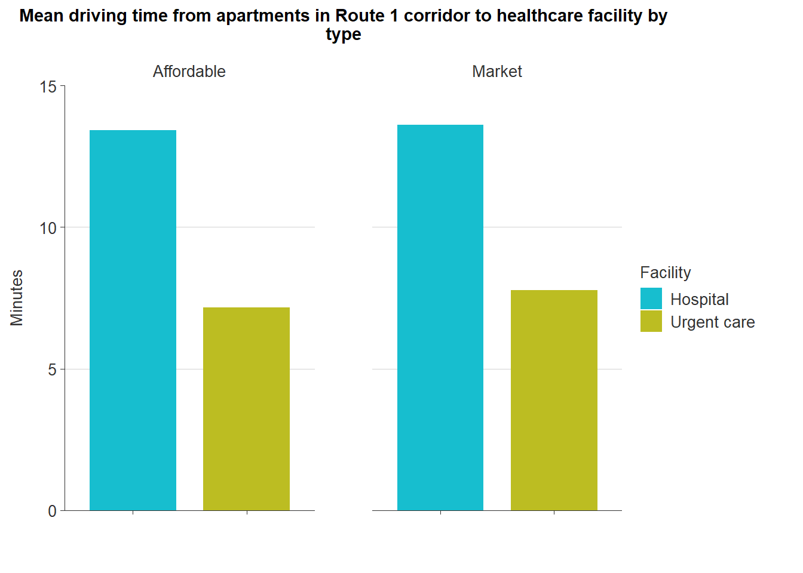
<p class="caption">(\#fig:r1-health-chart)Mean driving time from apartments in Route 1 corridor to healthcare facility by type</p>
</div>

### Job centers

Living close to well-paying jobs can increase economic opportunities for low- and moderate-income households. When those opportunities are a further distance from where someone lives, that can often mean more money spent on commuting and less money for essentials like healthcare and housing. 

Multifamily properties regardless of type or location along the corridor are generally well-located in relation to jobs. However, the northern section of the corridor sees greater proximity to more jobs --- largely because of the City of Richmond.

Furthermore, properties closer to the city-county border are also in closer proximity to jobs paying greater than \$3,333 a month, or $39,996 annually. This is the highest wage category available in the data. On average, 54 percent of the jobs located within a 15 minute drive of properties pay more than \$3,333 per month. Workers in both market-rate and rent-restricted apartments have nearly the same access to jobs of different wages.

Fewer high-paying job opportunities exist towards the southern end of the corridor, despite higher end developments like The Jane and Colony Village. This most likely means that many residents are commuting longer distances away from the corridor for work. 


<div class="figure">
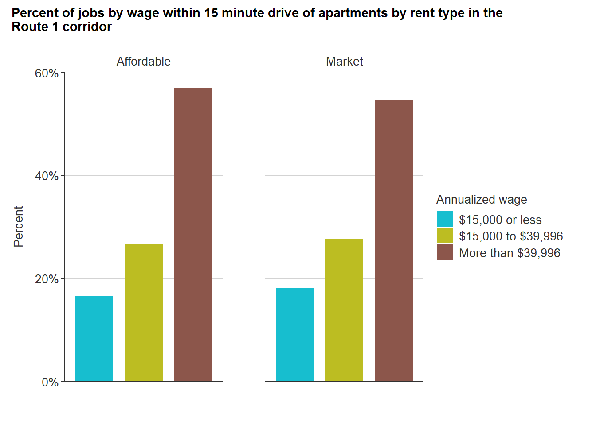
<p class="caption">(\#fig:r1-jobs-chart)Percent of jobs by wage within 15 minute drive by rent type in the Route 1 corridor</p>
</div>

## Public and private investments

Chesterfield County has largely focused revitalization efforts on the northern section on the Route 1 corridor. The Northern Jefferson Davis Special Area Plan was adopted in 2018 and reflects the County's ongoing commitment to improve quality of life for residents of the corridor. Recent public projects include:

-   **Bensley Park** field renovations and paving.
-   **Shared-Use Path** planned for Route 1 from Marina Drive to Elliham Avenue.
-   **Falling Creek Ironworks Park** improvements in planning.

Additionally, the Board of Supervisors approved the Route 1 Residential Overlay ordinance in 2019, which allows for high density multifamily development by-right in C3 and C5 zoned parcels with some restrictions. This ordinance also [reduced parking requirements for apartments located within a quarter-mile of bus stops](https://www.chesterfieldobserver.com/articles/county-offers-parking-credits-to-developers-on-route-1/) and encourages less auto-centric development, which has historically stifled revitalization of the corridor.

The Board of Supervisors also extended the [Route 1 tax abatement policy](https://www.chesterfield.gov/CivicAlerts.aspx?AID=2448&ARC=3953). The policy provides the developer of a qualifying project with a grant equal to 80 percent of their increasing real estate taxes for the first seven years after completion of the project. Over the final three years, the grant reduces to 60, 40, and 20 percent, respectively. Better Housing Coalition's Winchester Forest development, which will result in 160 rental homes by early 2024, is the first development to utilize this incentive.

With these incentives, as well as the Route 1 GRTC pilot, the County has continued to invest in the corridor to spur much-needed development. With dwindling supply of market affordable housing and at-risk manufactured home communities, many low- and moderate-income families will have few to no options for safe and stable housing.

Private development interest is also coming to the corridor with Thalhimer Realty Partners proposing a mixed-use project at the Bellwood Flea Market site at the southeast corner Route 1 and Willis Road. This redevelopment project would see 690 new residential units and commercial space across 40 acres --- bringing additional homeownership and rental opportunities to the corridor. Projects like this help bring new economic activity to the corridor and additional rooftops to justify additional commercial development along the corridor.

Nonprofit development interest has continued from Better Housing Coalition further down the corridor at the historic Colbrook Motel site south of Route 10. At this site, they plan to develop 156 rental homes in an apartment and townhome setting. Meanwhile, Maggie Walker Community Land Trust is in the early planning stages for an agricultural neighborhood development off of Swineford Road. MWCLT will offer homeownership opportunities under their community land trust model --- often serving first-time home buyers of color.

### Case study

```
Bermuda Estates or The Jane at Moore's Lake

-   Add a photo
-   Describe development and market it serves
-   Rent/sale prices
```

