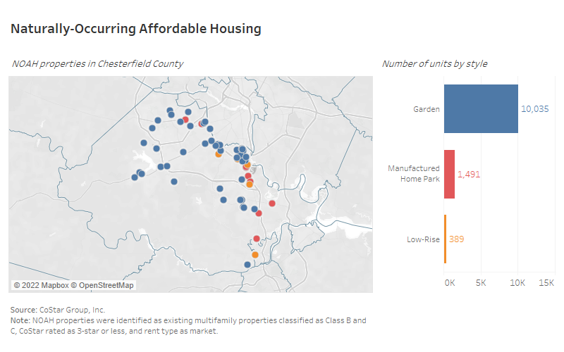

# Market-affordable housing {#part-1a-3}

This section summarizes research on market affordable housing, or what is commonly referred to as naturally occurring affordable housing (NOAH). Particular focus will be given to determining a common and accepted definition of NOAH.

## Background

Not all affordable housing is supported by public subsidy. In fact, a large share of affordable housing is privately-owned and receives no government assistance. Widely referred to as naturally occurring affordable housing (NOAH), or market-affordable housing, these properties are a growing concern for communities facing housing affordability challenges.

The preservation of NOAH properties has been a growing strategy to support affordable housing in communities as the ability to quickly develop new units has been stifled by labor shortages, rising land prices, and supply chain issues. NOAH is at great risk of being lost because it often requires greater investment to maintain and more likely to be redeveloped---in turn contributing to a loss of affordable housing units.

## Defining NOAH

While research around NOAH has been growing over the past several years, an universally-accepted definition still does not exist. But general agreement among advocates and practitioners is that NOAH units are older, outmoded, and in less desirable locations.

When these characteristics are placed into the context of a community's rental market, rents are generally lower than the typical rental unit because NOAH units are of comparably lower quality than newer units on the market.

CoStar, a commercial real estate and analytics provider with its global research operations based in Richmond, Virginia, conducted an [analysis of NOAH properties](https://americas.uli.org/new-costar-data-identifies-5-5-million-units-naturally-occurring-affordable-housing-markets-across-united-states/) in Fall 2016 at the request of Urban Land Institute's Terwilliger Center for Housing.

This analysis concluded that 76 percent of the 335,978 multifamily properties in their database were NOAH properties. CoStar came to this conclusion based on their proprietary rating system, which gives each property a star rating from one to five stars, wherein one- and two-star properties are the equivalent of Class B and C properties.

::: {.rmdnote}

**What are Class B and C properties?**

The commercial real estate industry utilizes a property classification system to help investors, lenders, and brokers quickly understand and communicate the quality of a property. The system classifies real estate properties as A, B, C, or D.

NOAH properties generally fall into either Class B or C.

**Class B**

These properties are generally in good condition for being built within the last 20 years, but the exteriors and interiors are generally considered outdated. Amenities are much less than those found in a high end apartment. Renovations may have occurred recently and there is little deferred maintenance.

**Class C**

These properties were built within the last 30 years or are a much older property that has had recent renovations. Exteriors and interiors are outdated, and amenities are very limited. Improvements to the property show some age and there may be some deferred maintenance.

:::

## NOAH in Chesterfield County

``` {r setup}

library(tidyverse)
library(janitor)
library(knitr)
library(scales)
library(zoo)
library(formattable)
library(ggthemes)

costar_noah <- read_csv("data/chesterfield_noah_coded.csv")
costar_noah_rent <- read_csv("data/costar_noah_rent_bedroom.csv")

```

The following analysis on NOAH inventory in Chesterfield County uses data from CoStar Group, Inc. Properties were selected if they met these criteria:

* Existing multifamily properties with active leases,
* Classified as Class B or C,
* No public subsidy, rent caps, or other income-based restrictions, and
* *CoStar Building Rating* of three or fewer stars out of five.^[Per CoStar, this is rating for the building relative to other buildings of the same type throughout the country.]

### Amount

Chesterfield County is home to 10,784 market-affordable rental units as of March 2022. These apartments are predominately in garden-style buildings with 200 to 250 units per property. A much smaller share of these NOAH units are found in manufactured home communities and low-rise multifamily buildings. One rental property (Huntwood Apartments) is a collection of 48 single-family homes.

```{r noah-amount}

costar_noah %>% 
  select(style, units) %>% 
  mutate(properties = 1) %>% 
  group_by(style) %>% 
  summarise(properties = sum(properties),
            units = sum(units)) %>% 
  arrange(desc(units)) %>% 
  adorn_totals() %>% 
  kable(caption = "NOAH properties and units by style",
       align = "lrr",
       col.names = c("Style", "Properties", "Units"),
       format.args = list(big.mark = ",")) %>% 
  kableExtra::kable_styling(
      bootstrap_options = c("striped", "hover", "condensed")) %>% 
  kableExtra::row_spec(5, bold=TRUE)

```
*Source: CoStar Group, Inc.*

This NOAH inventory is approximately 34 percent of the county's total number of rental units according to the latest Census Bureau estimates.^[U.S. Census Bureau, American Community Survey, 2016-2020 5-year estimates. Tables B25003 and B25004.] However, that estimate includes the approximately 10,000 single-family homes leased out in Chesterfield.

NOAH units account for a much larger share (72 percent) of the county's traditional multifamily rental market, as tracked by CoStar.^[As of March 31, 2022, CoStar's total multifamily unit inventory in Chesterfield County was 14,905.] This is in line to the estimated share of NOAH across all multifamily properties in the nation calculated by CoStar in 2016.

:::{.rmdcaution}

*Manufactured housing undercounted in CoStar data:*

Manufactured homes are a key source of NOAH throughout Virginia, especially along Chesterfield County’s major corridors. However, the CoStar database does not fully capture all of these communities.

In 2016, the Manufactured Home Community Coalition of Virginia (MHCCV) conducted a [study of mobile home parks in Central Virginia](https://mhccv.org/resources/central-virginia-study/) and found that Chesterfield County was home to 1,543 units within parks---the highest of any Central Virginia locality, with the second highest locality being Prince George at 831.

:::

### Location

NOAH properties are spread throughout all parts of Chesterfield County, but like most NOAH properties nationwide, they are largely located in the inner suburbs---areas that saw early development towards the middle of the 19th century. These includes garden style apartments like Falling Creek Apartments along Route One or manufactured home communities like Suburban Village off of Midlothian Turnpike.

```{r noah-map, fig.cap="Location and type of NOAH"}



```

### Rent levels

As of early 2022, average rents in Chesterfield's NOAH units range from \$862 to \$1,462 depending on the number of bedrooms. The minimum gross annual income to afford the average 2-bedroom market-affordable apartment is \$51,000.

```{r noah-rent-table}

rent <- costar_noah_rent %>% 
  pivot_longer(cols = 2:5, names_to = "Bedrooms", values_to = "Rent") %>% 
  mutate(Bedrooms = fct_reorder(Bedrooms, desc(Rent))) %>% 
  mutate(Period = as.Date(as.yearqtr(Period, format = "%Y Q%q"), frac = 1))

rent %>% 
  group_by(Bedrooms) %>% 
  top_n(1, Period) %>% 
  mutate(Rent = dollar(Rent)) %>% 
  select(-Period) %>% 
  kable(caption = "Current rent by bedroom in NOAH properties",
       align = "lr") %>% 
  kableExtra::kable_styling(
      bootstrap_options = c("striped", "hover", "condensed"))

```

*Source: CoStar Group, Inc.*

Market rents in Chesterfield's NOAH units have increased significantly as demand for lower-cost apartments continues to exceed the supply. Much of this price growth has occurred since 2015. Prior to that year, the average 3-bedroom NOAH unit could be rented for less than $1,000 per month.

```{r noah-rent-plot, fig.cap="Median asking rent by bedroom for NOAH properties"}

library(simplevis)

# rent_plot <- ggplot(rent, aes(x = Period, y = Rent, group = Bedrooms, color = Bedrooms)) +
#   geom_line() +
#   scale_y_continuous(labels=dollar_format(prefix = "$", big.mark = ",")) +
#   scale_x_date() +
#   theme(
#     axis.title.x = element_blank(),
#     axis.title.y = element_blank())
#   
# rent_plot

gg_line_col(rent,
            x_var = Period,
            y_var = Rent,
            col_var = Bedrooms,
            alpha_point = 0,
            size_line = 0.75,
            title = "Median asking rent by bedroom for NOAH properties",
            y_labels = label_dollar(),
            y_title = "Median asking rent",
            x_title = element_blank(),
            x_labels = scales::date_format(format = "%Y")
          ) +
  ggplot2::scale_x_date(limits = as.Date(c(NA, Sys.Date()))) +
  ggplot2::theme(
    legend.title = element_blank()
  )
  
```
*Source: CoStar Group, Inc.*

### Age

The majority of Chesterfield's NOAH properties are older than 20 years. These buildings were primarily constructed in three major production cycles:

* The mid 1960s to the mid 1970s,
* The late 1980s and early 1990s, and
* The early 2000s.

The median age of the county's NOAH units is 48 years. (Built in 1974.)

```{r noah-age, fig.cap="NOAH units by year built"}

# age_plot <- ggplot(costar_noah, aes(x=yearbuilt, weights=units)) +
#   geom_histogram(binwidth = 5, fill="#69b3a2", color="#e9ecef") +
#   scale_y_continuous(labels = scales::comma) +
#   scale_x_continuous(limits = c(1950, 2020),
#                      breaks = seq(1950, 2020, 10)) +
#   theme(
#     axis.title.x = element_blank(),
#     axis.title.y = element_blank())
# 
# age_plot

gg_histogram(costar_noah,
             x_var = yearbuilt,
             x_title = "Year built",
             x_bins_n = 18,
             title = "NOAH units by year built",
             x_labels = scales::label_number(accuracy = 1, big.mark = ""),
             y_title = "Number of properties",
             y_labels = scales::label_number(accuracy = 1)) +
  ggplot2::scale_x_continuous(limits = c(1950, 2020),
                              breaks = seq(1950, 2020, 10))

```
*Source: CoStar Group, Inc.*

### Examples

<br>

*Falling Creek Apartments*

```{r falling-creek, fig.cap="Falling Creek Apartments. Credit: CoStar Group, Inc."}

knitr::include_graphics("images/falling-creek.jpg")

```

* Units: 348
* Two-bedroom asking rent: $955
* Style: Garden apartments
* Neighborhood: Bensley

<br>
<br>

*Suburban Village Manufactured Home Community*

```{r suburban-village, fig.cap="Suburban Village Manufactured Home Community. Credit: Google Earth."}


```

* Units: 220 units
* Asking lot rent: Approximately \$500 to \$600
* Style: Manufactured home community
* Neighborhood: Bon Air

## Takeaways

* NOAH properties are a key resource for communities facing affordability challenges. However, NOAH properties face challenges themselves.
* The investments needed to maintain or improve the quality of NOAH properties are often out of reach for many property owners. However, making those investments can often lead to rent increases that price existing residents out of that housing.
* Strategies in NOAH preservation are becoming a growing area of interest among localities seeking to leverage limited resources for preserving existing affordable housing.
* NOAH units comprise a significant share of Chesterfield County's rental market, but are experiencing rapid rent escalation despite their above-average age compared to the rest of the county's housing stock.