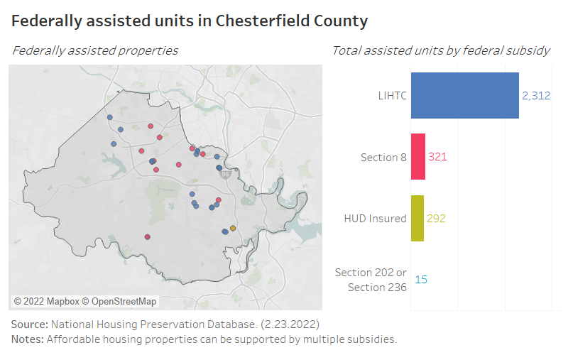

# Concentrations of affordable housing {#part-1a-4}

## Background

Concerns over the concentration of affordable housing have been largely born out of the criticisms of large-scale public housing developments and the impacts of concentrated poverty. But little research has been done on the impacts multiple affordable housing developments, such as Low-Income Housing Tax Credit, have on a community.

## Research analysis

Most relevant research on affordable housing concentration has been in regards to the impacts that an affordable housing development has on a community---mainly in terms of surrounding property value. According to recent research, the spillover effects of affordable housing developments have largely been conducted without regard to other nearby developments. Therefore, there is little to no consensus on what constitutes a concentration of affordable housing. 

Research conducted in 2008 on the spatial distribution of LIHTC properties determined that “clustering” of LIHTC properties does occur across metropolitan areas. However, the scale of clustering varied among metropolitan areas included in the study---none of which included the Richmond metropolitan area. This clustering was concluded to be due largely to program design (i.e. Qualified Allocation Plans in many states favor the development of LIHTC properties in Qualified Census Tracts (QCT) or Difficult Development Areas (DDA)).

In the same year, in A Review of Existing Research on the Effects of Federally Assisted Housing Programs on Neighboring Residential Property Values, Galster defined a concentration as either five or more properties within 1,000 to 2,000 feet of one another in Denver or three or more within 500 feet in Baltimore County. 

More recent research was conducted in 2020 on the spillover effects of more than one LIHTC property on surrounding homes. Once again, an explicit definition of a concentration of affordable housing was lacking. Voith and his colleagues simply differentiated between areas wherein there were zero, one, or two or more LIHTC developments within a half mile radius in Los Angeles City.

Based on this review, a concentration of affordable housing varies depending on research methods, as well as community context. In most instances, a concentration of affordable housing was described as being multiple properties within a set radius of one another. 

To this end, a concentration of affordable housing in Chesterfield County would look very different from a concentration of affordable housing in Hampton, Virginia or even in the City of Richmond.

## Distribution of lower-cost rental housing in Chesterfield County

### With public subsidy

```{r subsidy-map}



```

Based on data from the National Housing Preservation Database (NHPD), affordable housing properties supported by the federal government are spread throughout the suburban parts of the county. There are 32 federally assisted properties in Chesterfield County, compared to 60 in Henrico County and 134 in the City of Richmond. In Chesterfield, the majority of assisted units are supported by the Low Income Housing Tax Credit program, where market-rate units are often included in the development.

### Without public subsidy

```{r noah-map}

knitr::include_graphics("images/noah_map.png")

```

Naturally-occuring affordable housing (NOAH) is more prevalent across the county, as discussed in [Chapter 3](#part-1a-3). These properties can be found throughout most populated areas, with the highest concentrations within several miles of the border with the City of Richmond, particularly between Hull Street and Route 1.

## Takeaways

* A standard definition of a concentration of affordable housing does not exist. Little to no research has been conducted to determine what would constitute a concentration.
* The majority of related research has been in relation to the impacts of multiple affordable housing properties on the surrounding community. However, in each research case, a “concentration” of affordable housing varied depending on the community (i.e., a concentration means different things in different locations).
* Income-restricted rental housing in Chesterfield County is not tightly concentrated in one neighborhood or along one corridor.
* A significant share of the county’s unsubsidized affordable housing is located in northern neighborhoods adjacent to the City of Richmond.
