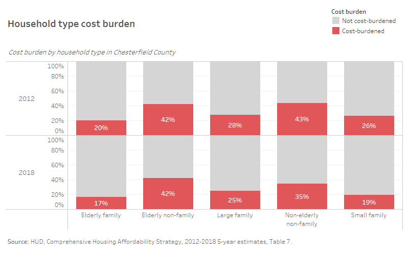

# Household cost burden {#part-1b-3}

This section provides an analysis of cost burden within Chesterfield County disaggregated by tenure, income, household type, and race/ethnicity.

## Background

Cost burden is the standard by which most academics and practitioners measure housing affordability and is the result of the 30 percent standard. Households spending more than 30 percent of their income on housing costs are housing cost-burdened, while households spending more than 50 percent are severely housing cost-burdened. Although cost burden can be a reflection of insufficient wages to afford housing, it can also point to a growing need for more diverse housing options.

While other measures have their benefits in communicating the need to address housing affordability ([Chapter 2](#part-1a-2)), the 30 percent standard has not only been shown to be accurate in representing the overall community, but it can be easily understood and applied at different scales. For these reasons, and for the range of demographic and socioeconomic crosstabs available for cost burden in CHAS data, we use this standard.

```{r setup}

library(glue)
library(httr)
library(jsonlite)
library(tidyverse)
library(tidycensus)
library(readxl)
library(ggplot2)
library(plotly)
library(sf)
library(formattable)
library(esquisse)

```

## Tenure and income

For homeowners, cost burden has decreased across the board. There were 21,305 cost-burdened homeowners in 2010, but that number decreased significantly to 16,945 in 2018---a 20 percent decrease. The total share of cost-burdened homeowners has shrunk, from nearly one in four (24 percent) in 2010 to 18 percent in 2018. 

But cost burden is still substantial among households with lower incomes, especially extremely low- (30 percent AMI or less) and very low-income (31 to 50 percent AMI) homeowners, where over half of homeowners at these incomes are cost-burdened, 85 percent and 56 percent, respectively. Worse yet, the majority of cost burdened homeowners at these incomes are spending more than 50 percent of their income on housing costs. 

```{r tenure, eval=FALSE, include=FALSE}

# With the share of renters increasing in Chesterfield County, the share of renter households experiencing cost burden has been in decline in recent years---dropping from 45 percent in 2013 to 42 percent in 2018. But the actual number of cost-burdened renters has been on the rise---from 10,495 at the start of the decade to 12,795 cost-burdened renters in 2018.
# 
# For homeowners, cost burden has decreased across the board. There were 21,305 cost-burdened homeowners in 2010, but that number decreased significantly to 16,945 in 2018---a 20 percent decrease. The total share of cost-burdened homeowners has shrunk, from nearly one in four (24 percent) in 2010 to 18 percent in 2018. 

table7 <- read_csv("data/Table7_2012to2018.csv") %>%
  filter(fips == 51041) %>%
  filter(Line_Type == "Detail") %>%
  select(year = Year, estimate = Estimate, moe = MOE, tenure = Tenure, income = `Household income`, hhtype = `Household type`, costburden = `Cost burden`)

tenure_income <- table7 %>%
  mutate(income = case_when(
    income == "household income is less than or equal to 30% of HAMFI" ~ "30% AMI or less",
    income == "household income is greater than 30% but less than or equal to 50% of HAMFI" ~ "31% to 50% AMI",
    income == "household income is greater than 50% but less than or equal to 80% of HAMFI" ~ "51% to 80% AMI",
    income == "household income is greater than 80% but less than or equal to 100% of HAMFI" ~ "81% to 100% AMI",
    income == "household income is greater than 100% of HAMFI" ~ "Greater than 100% AMI"
  )) %>%
  mutate(hhtype = case_when(
    hhtype == "household type is elderly family (2 persons, with either or both age 62 or over)" ~ "Elderly family",
    hhtype == "household type is elderly non-family" ~ "Elderly non-family",
    hhtype == "household type is large family (5 or more persons)" ~ "Large family",
    hhtype == "household type is small family (2 persons, neither person 62 years or over, or 3 or 4 persons)" ~ "Small family",
    hhtype == "other household type (non-elderly non-family)" ~ "Other family type"
  )) %>%
  mutate(costburden = case_when(
    costburden == "housing cost burden is less than or equal to 30%" ~ "Not cost-burdened",
    costburden == "housing cost burden is greater than 30% but less than or equal to 50%" ~ "Cost-burdened",
    costburden == "housing cost burden is greater than 50%" ~ "Severely cost-burdened",
    costburden == "housing cost burden not computed (household has no/negative income)" ~ "No or negative income"
  )) %>%
  mutate(tenure = case_when(
    tenure == "Owner occupied" ~ "Homeowner",
    tenure == "Renter occupied" ~ "Renter"
  ))
  
tenure <- aggregate(cbind(estimate, moe) ~year+tenure+income+costburden, data = tenure_income, FUN = sum, na.rm = TRUE)

tenure_income_chas <- tenure %>%
  group_by(year, tenure, income, costburden) %>%
  summarise(
    estimate = sum(estimate),
    moe = moe_sum(moe, estimate)
  ) %>% 
  ungroup() %>% 
  mutate(cv = ((moe/1.645)/estimate)*100) %>% 
  mutate(reliability = case_when(
    cv < 15 ~ "High reliability",
    cv >= 15 & cv <= 30 ~ "Medium reliability",
    cv > 30 ~ "Low reliability")
  )

```

```{r tenure-owner-img, fig.cap="Homeowner cost burden"}


```

With the share of renters increasing in Chesterfield County, the share of renter households experiencing cost burden has been in decline in recent years---dropping from 45 percent in 2013 to 42 percent in 2018. But the actual number of cost-burdened renters has been on the rise---from 10,495 at the start of the decade to 12,795 cost-burdened renters in 2018.

Separating out by income group shows that declining cost burden is not a shared experience. Income groups making less than 80 percent AMI have seen an increasing share of cost-burdened renters. Those increases have been greatest among extremely low-income renters (85 percent to 90 percent) and low-income renters (58 percent to 64 percent) between 2012 and 2018. The decrease in higher income renters (80 percent AMI or more) experiencing cost burden shows an increasing number of higher earning renters entering the county rental market, nearly 4,000 higher earning renters without cost burden by 2018.

```{r tenure-renter-img, fig.cap="Renter cost burden"}


```

## Household type

As families grow and seniors age, expenses tend to increase as well. More mouths to feed can often mean less flexibility in spending towards essential needs like housing. For aging households on fixed incomes, increasing healthcare costs can not only lower a housing budget, but can imply a growing need to support aging-in-place.

In the county, elderly non-family households (i.e., single seniors living alone) experience cost burden at a disproportionate rate. In 2018, 5,885 elderly non-family households (42 percent) were cost-burdened---higher than any other household type. The brunt of this cost burden was shouldered by homeowners (3,730), but 69 percent of seniors living alone (2,155) who rent were cost-burdened, indicating a clear need to address senior affordable rental housing in the county.

The second household type experiencing a significant amount of cost burden (35 percent) was non-elderly non-family households  (i.e., single adults living alone, or with a roommate). Although decreasing eight percentage points since 2012, a large share of single adults were still cost-burdened---from 8,455 to 6,595 households. Over half (56 percent) of those 6,595 households are renters. 

Cost burden among these two household types exhibits a growing affordability challenge for single adults regardless of age. Without additional income that comes from other family members in a household, affording a home in the county can be financially difficult.

```{r hhtype, eval=FALSE, include=FALSE}

hhtype_chas <- read_csv("data/Table7_2012to2018.csv") %>%
  filter(fips == 51041) %>%
  filter(Line_Type == "Detail") %>%
  select(year = Year, estimate = Estimate, moe = MOE, tenure = Tenure, income = `Household income`, hhtype = `Household type`, costburden = `Cost burden`)

hhtype_clean <- hhtype_chas %>%
  mutate(income = case_when(
    income == "household income is less than or equal to 30% of HAMFI" ~ "30% AMI or less",
    income == "household income is greater than 30% but less than or equal to 50% of HAMFI" ~ "31% to 50% AMI",
    income == "household income is greater than 50% but less than or equal to 80% of HAMFI" ~ "51% to 80% AMI",
    income == "household income is greater than 80% but less than or equal to 100% of HAMFI" ~ "81% to 100% AMI",
    income == "household income is greater than 100% of HAMFI" ~ "Greater than 100% AMI"
  )) %>%
  mutate(hhtype = case_when(
    hhtype == "household type is elderly family (2 persons, with either or both age 62 or over)" ~ "Elderly family",
    hhtype == "household type is elderly non-family" ~ "Elderly non-family",
    hhtype == "household type is large family (5 or more persons)" ~ "Large family",
    hhtype == "household type is small family (2 persons, neither person 62 years or over, or 3 or 4 persons)" ~ "Small family",
    hhtype == "other household type (non-elderly non-family)" ~ "Other family type"
  )) %>%
  mutate(costburden = case_when(
    costburden == "housing cost burden is less than or equal to 30%" ~ "Not cost-burdened",
    costburden == "housing cost burden is greater than 30% but less than or equal to 50%" ~ "Cost-burdened",
    costburden == "housing cost burden is greater than 50%" ~ "Severely cost-burdened",
    costburden == "housing cost burden not computed (household has no/negative income)" ~ "No or negative income"
  ))

hhtype <- aggregate(cbind(estimate, moe) ~year + hhtype + costburden, data = hhtype_clean, FUN = sum, na.rm = TRUE)

hhtype_cb <- hhtype %>%
 group_by(year, hhtype, costburden) %>%
  summarise(
    estimate = sum(estimate),
    moe = moe_sum(moe, estimate)
  ) %>% 
  ungroup() %>% 
  mutate(cv = ((moe/1.645)/estimate)*100) %>% 
  mutate(reliability = case_when(
    cv < 15 ~ "High reliability",
    cv >= 15 & cv <= 30 ~ "Medium reliability",
    cv > 30 ~ "Low reliability")
  )

```

```{r hhtype-img, fig.cap="Household type cost burden"}



```

## Race and ethnicity

In the county, there are major disparities in cost burden between racial and ethnic groups. In 2018, the share of cost-burdened white households was ten percentage points lower than the share of Black, Asian, and Hispanic households.

In spite of these disparities, the share of cost burdened households of color has been in a steady decline. Most significantly, Hispanic households have experienced the greatest decrease in cost burden---from nearly half of all Hispanic households in 2010 to only one in three (34 percent) in 2018. 

These decreases in cost burden among households of color may be in large part to the relative affordability and attractiveness of Chesterfield County to growing families.

```{r race, eval=FALSE, include=FALSE}

race_chas <- read_csv("data/Table9_2012to2018.csv") %>%
  filter(fips == 51041) %>%
  filter(Line_Type == "Detail") %>%
  select(year = Year, estimate = Estimate, moe = MOE, tenure = Tenure, race = `Race/ethnicity`, costburden = `Cost burden`)

race_clean <- race_chas %>%
  mutate(across(.fns = ~str_remove_all(.x, "alone, non-Hispanic"))) %>% # I haven't figured out how to retain this for White
  mutate(race = case_when(
    race == "other (including multiple races, non-Hispanic)" ~ "Another race incuding multiracial",
    TRUE ~ race
  )) %>%
    mutate(costburden = case_when(
    costburden == "less than or equal to 30%" ~ "Not cost-burdened",
    costburden == "greater than 30% but less than or equal to 50%" ~ "Cost-burdened",
    costburden == "greater than 50%" ~ "Severely cost-burdened",
    costburden == "not computed (household has no/negative income)" ~ "No or negative income"
  ))
  
  
```

```{r race-img, fig.cap="Race and ethnicity cost burden"}

knitr::include_graphics("images/racecb.png")

```

## Spatial distribution

``` {r tract. eval=FALSE, include=FALSE}
chas_041 <- read_csv("data/table7_chesterfield.csv")

table_labels <- read_csv("data/table7_dict.csv")

chas_041 <- chas_041 %>% pivot_longer(starts_with("T7"), 
                   names_to = "code",
                   values_to = "value")  %>%
      mutate(id = str_extract(code, "\\d+$"),
             type = str_extract(code, "est|moe")) %>%
      select(-code) %>%
      pivot_wider(names_from = type, values_from = value) %>%
      rename(Estimate = est, MOE = moe)

table_labels <- table_labels %>%
  mutate(id = str_extract(code, "\\d+$"))

labeled_041 <- chas_041 %>%
  left_join(table_labels, by = "id") %>%
  mutate(tenure = case_when(
    tenure == "Owner occupied" ~ "Homeowner",
    tenure == "Renter occupied" ~ "Renter"
  )) %>%
  mutate(income = case_when(
    income == "household income is less than or equal to 30% of HAMFI" ~ "30% AMI or less",
    income == "household income is greater than 30% but less than or equal to 50% of HAMFI" ~ "31% to 50% AMI",
    income == "household income is greater than 50% but less than or equal to 80% of HAMFI" ~ "51% to 80% AMI",
    income == "household income is greater than 80% but less than or equal to 100% of HAMFI" ~ "81% to 100% AMI",
    income == "household income is greater than 100% of HAMFI" ~ "Greater than 100% AMI"
  )) %>%
  mutate(household = case_when(
    household == "household type is elderly family (2 persons, with either or both age 62 or over)" ~ "Elderly family",
    household == "household type is elderly non-family" ~ "Elderly non-family",
    household == "household type is large family (5 or more persons)" ~ "Large family",
    household == "household type is small family (2 persons, neither person 62 years or over, or 3 or 4 persons)" ~ "Small family",
    household == "other household type (non-elderly non-family)" ~ "Other family type"
  )) %>%
  mutate(costburden = case_when(
    costburden == "housing cost burden is less than or equal to 30%" ~ "Not cost-burdened",
    costburden == "housing cost burden is greater than 30% but less than or equal to 50%" ~ "Cost-burdened",
    costburden == "housing cost burden is greater than 50%" ~ "Severely cost-burdened",
    costburden == "housing cost burden not computed (household has no/negative income)" ~ "No or negative income"
  )) %>%
  filter(type == "Detail")

chas <- labeled_041 %>%
  group_by(tract, tenure, costburden) %>%
  summarise(
    estimate = sum(Estimate),
    moe = moe_sum(MOE, Estimate)
  ) %>% 
  ungroup() %>% 
  mutate(cv = ((moe/1.645)/estimate)*100) %>% 
  mutate(reliability = case_when(
    cv < 15 ~ "High reliability",
    cv >= 15 & cv <= 30 ~ "Medium reliability",
    cv > 30 ~ "Low reliability")
  )


b25106_vars <- load_variables(2020, "acs5") %>%
  filter(str_sub(name, end = 6) %in% "B25106")

b25106_raw <- get_acs(
    geography = "tract",
    county = "Chesterfield County",
    state = "VA",
    table = "B25106",
    year = 2020,
    survey = "acs5",
    geometry = TRUE,
    cache_table = TRUE
  )

b25106_vars_cleaned <- b25106_vars %>%
  separate(label, into = c("est", "total", "tenure", "income", "costburden"), sep = "!!") %>%
  select(variable = name, tenure, income, costburden) %>%
  mutate(tenure = case_when(
    tenure == "Owner-occupied housing units:" ~ "Homeowner",
    tenure == "Renter-occupied housing units:" ~ "Renter",
    TRUE ~ "All"
  )) %>%
  mutate(across(.fns = ~str_remove_all(.x, ":")),
         across(.fns = ~replace_na(.x, "All"))) %>%
  mutate(costburden = case_when(
    costburden == "Less than 20 percent" ~ "Not cost-burdened",
    costburden == "20 to 29 percent" ~ "Not cost-burdened",
    costburden == "30 percent or more" ~ "Cost-burdened",
    TRUE ~ "All"
  ))
           
acs <- b25106_raw %>%
  right_join(b25106_vars_cleaned, by = "variable") %>%
  select(tract = NAME, GEOID, tenure, income, costburden, estimate, moe) %>%
   group_by(tract, costburden) %>%
  summarise(
    estimate = sum(estimate),
    moe = moe_sum(moe, estimate)
  ) %>% 
  ungroup() %>% 
  mutate(cv = ((moe/1.645)/estimate)*100) %>% 
  mutate(reliability = case_when(
    cv < 15 ~ "High reliability",
    cv >= 15 & cv <= 30 ~ "Medium reliability",
    cv > 30 ~ "Low reliability")
  ) %>%
  filter(tenure != "All") %>%
  filter(costburden != "All")

acs_perc <- acs %>%
  group_by(tract, costburden) %>%
  summarise(
    estimate = sum(estimate))
    
acs_perc <- acs_perc %>%
  group_by(tract) %>%
  mutate(percentage = percent(estimate/sum(estimate)))
  
```
## Takeaways

* Cost burden is not felt equally among Chesterfield County residents. Lower income households, especially renters, adults living alone, seniors and non-seniors, and households of color experience cost burden at disproportionate rates in the county.
* While the share of households of color experiencing cost burden has been in decline, more and more lower income households are becoming cost-burdened.